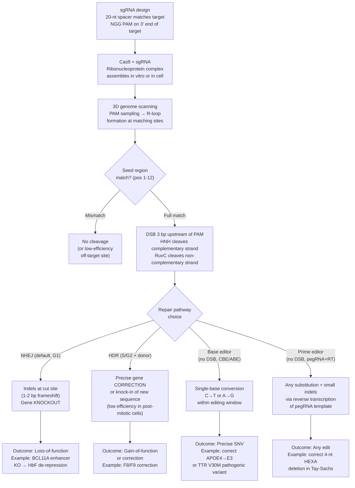

# Gene Therapy and CRISPR

> [!abstract] TL;DR
> Gene therapy delivers corrective genetic material into cells to treat disease; CRISPR-Cas9 and its derivatives (base editors, prime editors) allow precise rewriting of any DNA sequence using a programmable RNA guide, and the first CRISPR medicine — Casgevy for sickle cell disease — was approved by the FDA in December 2023, marking the beginning of an era in which individual patients' genomes can be edited as a treatment.

---

## Intuition

**Analogy:** Imagine your body's genome as a 3-billion-letter instruction manual for running a factory. Gene therapy is like sending a corrected replacement page into every copy of the manual in every room of the factory. Classical gene therapy uses a biological courier (a viral vector) to deliver the new page — it just drops it on the desk and hopes workers pick it up and read it. CRISPR is more like sending a molecular word-processor with a built-in search function: it reads every copy of the manual until it finds the exact misspelled paragraph, cuts that paragraph out, and replaces it with the corrected text — leaving everything else untouched.

The elegance — and the risk — is that the word-processor operates on the master copy. If it corrects the right paragraph in the right cell, the factory runs properly for the lifetime of that cell lineage. If it accidentally edits the wrong paragraph, or edits the copy in a germ cell that will be inherited by future generations, the consequences propagate permanently.

---

## How It Works

### Part I — A Brief History of Gene Therapy

**1990 — ADA-SCID: the first success.** Adenosine deaminase (ADA) deficiency is a form of severe combined immunodeficiency (SCID) caused by loss-of-function mutations in the *ADA* gene. Without ADA, toxic deoxyadenosine accumulates and kills developing T and B lymphocytes, leaving patients with virtually no immune system. In 1990, W. French Anderson's team at the NIH treated four-year-old Ashanti DeSilva by harvesting her T cells, inserting functional *ADA* cDNA via a retroviral vector ex vivo, and reinfusing the corrected cells. She survived and thrived, but required supplemental enzyme therapy alongside gene therapy, obscuring how much of her benefit came from gene transfer alone.

**1999 — Jesse Gelsinger and the first gene therapy death.** Jesse Gelsinger, 18, had a mild form of ornithine transcarbamylase (OTC) deficiency and enrolled in a Phase I dose-escalation trial at Penn Medicine. He received a high dose of an adenoviral vector carrying functional *OTC* cDNA directly into his liver. Within hours he developed a massive innate immune response — hypercytokinemia, disseminated intravascular coagulation (DIC), multi-organ failure — and died four days later. The tragedy revealed that adenoviral capsid proteins are potent pattern-recognition ligands that can trigger lethal macrophage and NK-cell activation, especially at high systemic doses. The field imposed strict moratoriums and re-evaluated vector design.

**2000–2003 — SCID-X1 and the LMO2 catastrophe: insertional mutagenesis.** Alain Fischer's group in Paris treated boys with SCID-X1 (caused by mutations in the common gamma chain, *IL2RG*) by ex vivo transduction of hematopoietic stem cells (HSCs) with a gammaretroviral vector carrying *IL2RG*. Ten of eleven patients were cured of their immunodeficiency — a landmark success. But between 2002 and 2006, four of these patients developed T-cell acute lymphoblastic leukemia. Deep sequencing revealed that the retroviral long terminal repeat (LTR) **enhancer** had integrated preferentially near the promoter of *LMO2* (LIM Domain Only 2), a proto-oncogene that, when aberrantly expressed, expands hematopoietic progenitor cells and promotes leukemic transformation. The lesson: first-generation gammaretroviruses do not integrate randomly — they prefer active gene promoters — and their strong LTR enhancers can transactivate nearby oncogenes. Modern lentiviral vectors use **self-inactivating (SIN)** LTR designs that delete the enhancer after integration, eliminating this specific risk.

---

### Part II — AAV Vectors: The Workhorse of In Vivo Gene Therapy

Adeno-associated virus (AAV) is a small (~25 nm), non-enveloped, single-stranded DNA parvovirus with **no known human pathogenicity**. Recombinant AAV (rAAV) retains only the ~145-bp inverted terminal repeats (ITRs) from the viral genome; all viral protein-coding sequences are replaced with the therapeutic transgene.

**Key properties of rAAV:**

| Property | Detail |
|----------|--------|
| Cargo capacity | ~4.7 kb between ITRs — limits delivery of large genes (e.g., *ABCA4* at 6.8 kb requires dual-AAV split approaches) |
| Integration | Primarily **episomal** (extrachromosomal circular DNA) — persists as non-replicating episomes; minimal integration risk (<0.1%) |
| Immunogenicity | Low innate immune activation; pre-existing neutralizing antibodies (NAbs) to many serotypes are common in humans (~50–80% seroprevalence for AAV2) |
| Duration | Episomes dilute with cell division → long-lived in post-mitotic cells (neurons, photoreceptors, myofibers), lost in rapidly proliferating cells |
| Manufacturing | Produced in HEK293 cells or baculovirus/Sf9 system; purified by ultracentrifugation |

**Serotype tropism (tissue preference based on capsid–receptor interactions):**

| Serotype | Primary Receptor | Natural Tropism | Key Approved Use |
|----------|-----------------|-----------------|-----------------|
| AAV2 | HSPG (heparan sulfate proteoglycan) | Retina, CNS, liver | Luxturna (retina) |
| AAV5 | PDGFR, sialic acid | Liver, lung, CNS | Hemgenix (liver) |
| AAV8 | LamR (laminin receptor) | Liver (high efficacy) | Research/clinical liver trials |
| AAV9 | LamR + sialic acid | CNS, muscle, heart (crosses BBB) | Zolgensma (CNS/motor neurons) |
| AAVrh10 | Sialic acid | CNS (>AAV9 for some regions) | Neurological trials |
| AAV-PHP.eB | Engineered capsid | CNS (enhanced; mouse > human) | Research |

**Approved AAV gene therapies (as of 2024):**

| Product | Gene | Vector | Indication | Approval |
|---------|------|--------|-----------|----------|
| Luxturna (voretigene neparvovec) | *RPE65* | AAV2 | Leber congenital amaurosis (biallelic *RPE65* mutations) | FDA 2017 |
| Zolgensma (onasemnogene abeparvovec) | *SMN1* | AAV9 | Spinal muscular atrophy (SMA type 1) | FDA 2019 |
| Hemgenix (etranacogene dezaparvovec) | *F9-Padua* (gain-of-function variant) | AAV5 | Hemophilia B (severe/moderately severe) | FDA 2022 |

---

### Part III — CRISPR-Cas9: Mechanism

CRISPR (Clustered Regularly Interspaced Short Palindromic Repeats) is a bacterial adaptive immune system. In the type II CRISPR-Cas9 system from *Streptococcus pyogenes* (SpCas9), the cell encodes short spacers derived from past viral infections between palindromic repeats; when re-infected, the spacers are transcribed and guide a Cas9 endonuclease to destroy the invading DNA.

**Components of the editing complex:**

1. **Cas9 protein:** A 1368-aa bilobed protein with two catalytic domains:
   - **HNH domain:** cleaves the DNA strand complementary to the guide RNA (on-strand).
   - **RuvC domain:** cleaves the non-complementary (displaced) strand.
   - Together they produce a blunt-ended **double-strand break (DSB)** 3 bp upstream of the PAM.
2. **Single guide RNA (sgRNA):** A synthetic fusion of the CRISPR RNA (crRNA, carrying a 20-nt spacer matching the target) and the trans-activating crRNA (tracrRNA, providing the hairpin scaffold recognized by Cas9). The spacer is user-programmable.
3. **PAM sequence (Protospacer Adjacent Motif):** SpCas9 requires **5'-NGG-3'** on the non-template strand immediately downstream of the 20-nt target. The PAM is read by the PAM-interacting (PI) domain of Cas9 and triggers R-loop formation — if no NGG is present, Cas9 cannot bind.

**Steps of genome editing:**

1. sgRNA and Cas9 form a ribonucleoprotein (RNP) complex. The sgRNA's scaffold folds into hairpin structures that contact Cas9's recognition lobe.
2. The RNP diffuses along DNA, sampling each NGG site in ~3D space (facilitated diffusion).
3. At a PAM site, Cas9 melts the local duplex; if the 20-nt spacer base-pairs with the exposed non-template strand (called R-loop formation), the **seed region** (positions 1–12 proximal to PAM) must match with high fidelity. Mismatches in the seed region abort cleavage; distal mismatches (positions 13–20) are better tolerated.
4. When R-loop is complete, HNH cleaves the complementary strand and RuvC cleaves the non-complementary strand, producing the DSB.
5. The DSB is repaired by the cell via **NHEJ** or **HDR** (see [[DNA_Repair_and_Mutation]]).

**Repair outcomes:**

- **NHEJ** (Non-Homologous End Joining): The dominant pathway in most cell types. Rapid but imprecise — Artemis nuclease may trim overhangs before ligation, introducing small insertions or deletions (indels). A 1- or 2-bp indel in an exon typically causes a frameshift, creating a premature stop codon and functional **gene knockout**. Used when loss-of-function is therapeutic (e.g., BCL11A enhancer editing in Casgevy to derepress fetal hemoglobin).
- **HDR** (Homology-Directed Repair): Precise correction using a supplied **donor template** containing the desired sequence flanked by homology arms. Requires the cell to be in S/G2 phase — restricts use to cycling cells (difficult in post-mitotic neurons). Used for precise correction of pathogenic point mutations.

---

### Part IV — Advanced CRISPR Tools

#### Cas12a (Cpf1)

- Recognizes **TTTV** (TTTA, TTTG, TTTC) PAM on the 5' side of the protospacer (opposite orientation to SpCas9's 3' NGG).
- Generates a **staggered 5' overhang cut** (~5 nt) rather than a blunt cut — potentially more efficient HDR.
- Processes its own pre-crRNA array: a single pre-crRNA with multiple spacers is cleaved by Cas12a itself, enabling multiplexed editing with one RNA species.
- Uses only a crRNA (no separate tracrRNA), so guides are smaller (~42 nt vs ~100 nt for SpCas9 sgRNA).
- Employed by AsCas12a and LbCas12a for clinical-stage editing.

#### Cas13

- Targets **RNA**, not DNA — does not edit the genome.
- After binding the target RNA via a single crRNA, Cas13 cleaves the target RNA and also exhibits **collateral cleavage** of nearby non-target RNAs (used in diagnostics: SHERLOCK platform).
- Used for transient gene knockdown (RNA-targeting) and as a programmable antiviral.
- Because it does not modify DNA, it has no permanent heritable effect — important for safety in contexts where reversibility is desired.

#### Base Editors — Precise Single-Nucleotide Editing Without DSBs

Base editors fuse a catalytically **impaired Cas9** (nickase, nCas9 D10A — cuts only the non-edited strand) or dead Cas9 (dCas9, no cuts) to a **deaminase enzyme** that chemically modifies a specific base within the R-loop.

| Editor Type | Deaminase | Conversion | Mechanism | Key Version |
|-------------|-----------|-----------|-----------|------------|
| CBE (Cytosine Base Editor) | APOBEC1 (rat) | C→T (sense strand) / G→A (antisense) | Deaminates C in ssDNA R-loop → U; nicked strand is replicated over UGI-protected U → T | BE4max |
| ABE (Adenine Base Editor) | Evolved TadA (bacterial) | A→G (sense) / T→C (antisense) | Deaminates A → inosine (I); I is read as G during replication | ABE8e |

**Critical advantages:** No DSB means no NHEJ, no large deletions, no translocations. Bystander editing (other C/A in the editing window, typically ~positions 4–8 from PAM) is the main limitation — CBEs can edit all C residues in the window, not just the intended one.

#### Prime Editors — The Most Versatile Programmable Editor

Developed by David Liu's group (Anzalone et al., 2019), prime editors can install **all 12 types of point mutation plus small insertions and deletions** without DSBs and without a donor DNA template.

**Components:**
- **PE protein:** Fusion of nCas9 (H840A nickase — cuts only the non-edited, non-template strand) and **MMLV reverse transcriptase (RT)** (engineered M-MLV RT with improved processivity).
- **pegRNA (prime editing guide RNA):** An extended sgRNA with a 3' tail containing:
  - **PBS (Primer Binding Site):** ~8–15 nt complementary to the 3' end of the nicked strand, so the nicked strand anneals to the pegRNA's 3' extension and primes reverse transcription.
  - **RTT (Reverse Transcription Template):** Encodes the desired edit plus surrounding sequence; the nicked strand is reverse-transcribed off the RTT.

**Prime editing mechanism:**
1. pegRNA directs the PE to the target; nCas9 nicks the PAM-containing strand.
2. The 3' end of the nicked strand anneals to the pegRNA's PBS.
3. Reverse transcriptase copies the RTT onto the nicked strand, installing the edit.
4. The edited 3' flap is integrated by cellular flap endonuclease 1 (FEN1) and ligase — the edited sequence replaces the original.
5. In **PE3** systems, a second sgRNA nicks the other strand, forcing the cell to use the newly synthesized edited strand as the repair template, substantially increasing efficiency.

**Iterative versions (PE1 through PE7)** have improved RT fidelity, pegRNA stability (via 3' structural motifs called epegRNAs), and delivery efficiency, pushing editing rates toward clinical thresholds.

---

### Part V — Delivery Strategies

**Which delivery platform matches which application:**

| Platform | Mechanism | Tissue Preference | Advantages | Limitations |
|----------|-----------|------------------|-----------|------------|
| AAV (in vivo) | Recombinant viral capsid | Tissue-specific (serotype-dependent): retina, liver, CNS, muscle | Long-term expression; clinical track record; low immunogenicity | 4.7 kb cargo limit; pre-existing NAbs; manufacturing cost |
| LNP (Lipid Nanoparticle) | Ionizable lipids form ~100 nm particles with mRNA payload | Liver-dominant (after IV injection) | Delivers Cas9 mRNA + gRNA as transient RNP; no integration risk | Liver-bias; repeated dosing limited by ApoE-mediated hepatic uptake; immune priming |
| Ex vivo + electroporation | High-voltage pulses create transient membrane pores | Any accessible cell type (HSCs, T cells, iPSCs) | Highest editing efficiency; no viral vector needed; easy RNP delivery | Requires cell harvest + reinfusion; not suitable for CNS or solid tissues |
| Lentiviral vectors (SIN) | Integrating RNA virus | Hematopoietic stem cells | High cargo capacity (~8 kb); stable integration in dividing cells | Integration (SIN design mitigates LMO2 risk); no in vivo use |
| Engineered virus-like particles (eVLPs) | Retrovirus-like particles packaging PE protein + pegRNA | Research stage; retina demonstrated | Protein delivery (transient, no DNA integration risk) | Manufacturing complexity; preclinical |

**The Casgevy ex vivo workflow** (the paradigm for approved CRISPR therapy):
1. Patient HSCs collected via G-CSF-mobilized apheresis.
2. HSCs electroporated with SpCas9 RNP (protein + sgRNA targeting the BCL11A erythroid enhancer).
3. The guide disrupts the GATA1-binding site in the *BCL11A* intron 2 enhancer → BCL11A expression falls in erythroid precursors → fetal hemoglobin (HbF, encoded by *HBG1/HBG2*) is de-repressed.
4. Edited cells engraft after myeloablative conditioning with busulfan.
5. HbF-rich red blood cells are resistant to sickling → elimination of vaso-occlusive crises.

---

### Part VI — Off-Target Effects and Detection

Every guide RNA can potentially direct Cas9 to genomic sites that partially resemble the target (off-targets). Off-target editing at oncogenes, tumor suppressor genes, or essential regulatory elements could cause cancer or cell dysfunction.

**Primary determinants of off-target activity:**
- **Seed region mismatches:** Positions 1–12 (PAM-proximal) are intolerant; positions 13–20 can tolerate 1–2 mismatches while retaining cleavage.
- **Guide RNA GC content:** Very high or very low GC reduces binding stability. Optimal range ~40–70%.
- **Cas9 concentration:** Higher Cas9:gRNA ratio increases off-target activity — transient RNP delivery reduces the exposure window.
- **Chromatin accessibility:** Closed heterochromatin is partially protective (Cas9 cannot access condensed regions as efficiently).

**Off-target detection methods:**

| Method | Principle | In cellulo vs In vitro | Sensitivity |
|--------|-----------|----------------------|------------|
| GUIDE-seq | Integrates a dsODN tag at DSBs → tag-flanking reads in NGS reveal cut sites genome-wide | In cellulo | High; ~10⁻³ editing frequency |
| CIRCLE-seq | Circularizes purified genomic DNA; linearization by Cas9+gRNA enriches cut fragments for sequencing | In vitro | Very high; detects rare sites not found in cells |
| Digenome-seq | In vitro Cas9 digestion of purified genomic DNA → NGS reveals cleavage positions | In vitro | Moderate |
| DISCOVER-seq | Uses repair-factor (MRE11) ChIP-seq to mark DSBs in cells during active editing | In cellulo | Unbiased; captures editing events in native chromatin |
| CHANGE-seq | Improved CIRCLE-seq with tagmentation for library prep; scalable | In vitro | Very high |

**Strategies to reduce off-targets:**
- **High-fidelity Cas9 variants:** SpCas9-HF1, eSpCas9, evoCas9, HypaCas9 — point mutations in positively-charged residues that contact the DNA-RNA hybrid reduce tolerance for mismatches without sacrificing on-target activity significantly.
- **Paired nickases:** Two sgRNAs directing Cas9 D10A nickase to opposite strands ~20–30 bp apart; each nick is harmless alone, but the pair produces a DSB only when both bind correctly — 100–1500-fold reduction in off-targets.
- **Anti-CRISPR proteins:** Phage-derived AcrIIA4 / AcrIIA2 inhibit Cas9 and can be delivered as a molecular "off switch" to terminate editing after a defined time window.
- **RNP delivery instead of plasmid:** Minimizes Cas9 expression duration → fewer off-target events at low-frequency sites.

---

### Part VII — CRISPR Screens

Beyond therapeutic editing, CRISPR is a powerful tool for systematic functional genomics.

**Pooled genome-wide loss-of-function screens:**
- A library of ~70,000–120,000 sgRNAs (~6–10 per gene) is packaged in lentivirus and transduced at low MOI (one guide per cell).
- Cells undergo a selection (drug treatment, cancer growth, immune killing assay).
- Surviving cells are harvested; the guide RNA sequences integrated in their genomes are amplified and counted by NGS.
- Guides targeting essential genes (whose loss kills cells) are **depleted**; guides targeting genes whose loss confers a survival advantage are **enriched**.
- Read-out is differential abundance — statistical algorithms (MAGeCK, BAGEL) score genes.

**CRISPRi (interference):** dCas9 (D10A/H840A double mutant, no cleavage) fused to the **KRAB (Kruppel-associated box) transcriptional repressor** domain → recruits KAP1 and SETDB1 → deposits H3K9me3 → silences target gene promoter without cutting DNA. Reversible; useful when knockout causes lethality (essential genes).

**CRISPRa (activation):** dCas9 fused to transcriptional activators (VP64-p65-Rta = **VPR**, or **SAM** system using MS2-p65-HSF1 adapter proteins) → recruits Mediator complex → activates a target promoter. Used for gain-of-function screens, drug target validation, or driving cell reprogramming.

---

### Part VIII — Ethical Issues: The He Jiankui Case

In November 2018, Chinese biophysicist He Jiankui announced at the Second International Summit on Human Genome Editing that he had used CRISPR-Cas9 to edit human embryos and that a pair of twins — Lulu and Nana — had been born carrying edited *CCR5* alleles. The intended edit was a functional mimic of the naturally occurring **CCR5Δ32 allele**, which deletes 32 bp of the *CCR5* coding sequence and confers near-complete resistance to HIV-1 infection by eliminating the co-receptor used for viral entry.

**Why the international scientific community condemned the experiment:**

1. **Germline editing creates heritable changes.** Any edit in an embryo passes to all somatic cells of the resulting person and to all their future offspring — without the children's consent and with unknown generational consequences.
2. **Unnecessary medical risk.** HIV infection was not inevitable; the twins' father was HIV-positive but standard sperm washing effectively prevents transmission. The "medical need" did not justify the risk.
3. **Off-target edits in children.** Sequencing of the edited embryos showed mosaic editing (different alleles in different cells of the same embryo) and incomplete targeting — the twins likely did not have full CCR5Δ32 mimicry. Off-target sites were not fully characterized.
4. **CCR5 disruption carries its own risks.** CCR5-null individuals have higher susceptibility to **West Nile virus** and some data suggest increased severity of influenza — the edit is not uniformly protective.
5. **Process violations.** Informed consent was inadequate; institutional review processes were bypassed; the work was conducted covertly.

He Jiankui was convicted by a Chinese court in December 2019 and sentenced to three years in prison and a fine of 3 million yuan. The case prompted the international scientific community (NAS, Royal Society) to call for an international governance framework for heritable human genome editing, with a general moratorium on clinical germline editing until safety and ethical standards are established.

---

### CRISPR-Cas9 Editing Workflow



---

## Key Concepts / Details

### The Casgevy Approval — Why BCL11A?

Fetal hemoglobin (HbF, α₂γ₂) contains γ-globin chains encoded by *HBG1* and *HBG2*, which are switched off after birth through a developmental silencing mechanism. The transcription factor **BCL11A** is the master repressor of HbF: it recruits the NuRD repressor complex to the γ-globin promoters. BCL11A expression in erythroid precursors depends critically on a **GATA1-binding site** within an **erythroid-specific enhancer in intron 2** of *BCL11A*. Destroying this GATA1 site by CRISPR-Cas9 cuts BCL11A expression specifically in erythroids (preserving BCL11A function in neurons and other cells that use different enhancers) → HbF rises to 30–40% of total hemoglobin → polymerization of HbS is prevented → vaso-occlusive crises abolished.

In the CLIMB-SCD-121 trial, 29 of 29 patients with sickle cell disease had zero vaso-occlusive crises at 12 months; Casgevy was FDA-approved for SCD on December 8, 2023, and for transfusion-dependent beta-thalassemia shortly after.

### Guide RNA Scoring Models

Real-world guide efficiency prediction uses machine learning models trained on tiling library screens:
- **Doench 2016 Rule Set 3 (RS3) / DeepCpf1 / CRISPRscan** — inputs include 20-nt spacer, 4 flanking nucleotides, thermodynamic properties of the RNA-DNA hybrid.
- Key features: **GC content 40–70%** optimal; consecutive stretches of T (>4) terminate Pol III transcription; strong secondary structure in the sgRNA spacer reduces activity; a **G at position 20** (adjacent to PAM) weakly favors cleavage.

### Therapeutic CRISPR Pipeline Highlights (2024–2025)

| Program | Indication | Tool | Stage |
|---------|-----------|------|-------|
| NTLA-2001 (Intellia) | Transthyretin amyloidosis | In vivo LNP-CRISPR, liver | Phase 1/2 |
| EDIT-101 (Editas Medicine) | CEP290-LCA10 | In vivo AAV5-SaCas9 | Paused (2023) |
| PM359 (Prime Medicine) | AATD (alpha-1 antitrypsin) | Prime editing, liver | Phase 1 |
| CTX110 (CRISPR Therapeutics) | CD19+ B-cell malignancies | Allogeneic CAR-T + CRISPR KO | Phase 1/2 |

---

## Code Demo

```python
"""
Guide RNA on-target scoring simulation.

Demonstrates how GC content and seed-region mismatches affect
predicted Cas9 cleavage efficiency using a simplified
Doench-inspired scoring model.
"""

import numpy as np
import matplotlib
matplotlib.use('Agg')  # non-interactive backend
import matplotlib.pyplot as plt

np.random.seed(42)
N_GUIDES = 1000   # number of simulated 20-nt guide sequences
BASES = list('ATGC')


def random_guide(length=20):
    return ''.join(np.random.choice(BASES, length))


def gc_content(seq):
    return (seq.count('G') + seq.count('C')) / len(seq)


def seed_mismatch_penalty(n_mismatches):
    """
    Each mismatch in the 12-nt seed region (positions 1-12 proximal to PAM)
    roughly halves Cas9 cleavage efficiency.
    """
    return 0.5 ** n_mismatches


def on_target_score(seq, seed_mismatches=0):
    """
    Simplified scoring function:
    - GC content: Gaussian peak centred at 55%, sigma=12%
    - Poly-T check: 4 or more consecutive Ts reduce score (Pol III termination)
    - Seed mismatch penalty applied multiplicatively
    """
    gc = gc_content(seq)
    gc_score = np.exp(-((gc - 0.55) ** 2) / (2 * 0.12 ** 2))

    # Poly-T penalty
    poly_t_penalty = 0.3 if 'TTTT' in seq else 1.0

    return gc_score * poly_t_penalty * seed_mismatch_penalty(seed_mismatches)


# Generate guides and compute scores
guides = [random_guide() for _ in range(N_GUIDES)]
gc_vals = np.array([gc_content(g) for g in guides])
scores_0mm = np.array([on_target_score(g, 0) for g in guides])
scores_1mm = np.array([on_target_score(g, 1) for g in guides])
scores_2mm = np.array([on_target_score(g, 2) for g in guides])

# --- Reporting ---
print(f"Simulated {N_GUIDES} random 20-nt guide RNAs\n")
print(f"Mean on-target score (0 seed mismatches): {scores_0mm.mean():.3f}")
print(f"Mean on-target score (1 seed mismatch):   {scores_1mm.mean():.3f}")
print(f"Mean on-target score (2 seed mismatches): {scores_2mm.mean():.3f}")
print(f"\nGuides with score > 0.8 (0 mm): {(scores_0mm > 0.8).sum()} / {N_GUIDES}")
print(f"GC content range: {gc_vals.min():.2f} – {gc_vals.max():.2f}")

# --- Plotting ---
fig, axes = plt.subplots(1, 2, figsize=(12, 5))

# Left panel: score distributions by mismatch count
axes[0].hist(scores_0mm, bins=40, alpha=0.7, label='0 seed mismatches', color='steelblue')
axes[0].hist(scores_1mm, bins=40, alpha=0.7, label='1 seed mismatch',   color='darkorange')
axes[0].hist(scores_2mm, bins=40, alpha=0.7, label='2 seed mismatches', color='crimson')
axes[0].set_xlabel('On-target score', fontsize=12)
axes[0].set_ylabel('Number of guides', fontsize=12)
axes[0].set_title('On-target score distribution\nby seed-region mismatch count', fontsize=12)
axes[0].legend(fontsize=10)
axes[0].set_xlim(0, 1)

# Right panel: score vs GC content (0 mismatches)
scatter = axes[1].scatter(gc_vals * 100, scores_0mm, alpha=0.3, s=10, c=scores_0mm,
                          cmap='viridis', vmin=0, vmax=1)
axes[1].axvline(40, color='red',  linestyle='--', linewidth=1.2, label='40% GC (lower bound)')
axes[1].axvline(70, color='red',  linestyle=':',  linewidth=1.2, label='70% GC (upper bound)')
axes[1].axvline(55, color='green', linestyle='-', linewidth=1.2, label='55% GC (optimal)')
axes[1].set_xlabel('GC content (%)', fontsize=12)
axes[1].set_ylabel('On-target score', fontsize=12)
axes[1].set_title('On-target score vs GC content\n(0 seed mismatches)', fontsize=12)
axes[1].legend(fontsize=9)
plt.colorbar(scatter, ax=axes[1], label='Score')

plt.tight_layout()
plt.savefig('guide_rna_scores.png', dpi=150, bbox_inches='tight')
print("\nSaved plot to guide_rna_scores.png")
```

**Expected output:**
```
Simulated 1000 random 20-nt guide RNAs

Mean on-target score (0 seed mismatches): 0.657
Mean on-target score (1 seed mismatch):   0.329
Mean on-target score (2 seed mismatches): 0.164

Guides with score > 0.8 (0 mm): 312 / 1000
```

The simulation confirms two design rules: (1) GC content between 40–70% is required for high activity, with the optimal peak near 55%, and (2) even a single mismatch in the seed region approximately halves predicted cleavage efficiency, making seed-region complementarity the dominant determinant of specificity.

---

## Real-World Example

> **Example — Casgevy (Vertex / CRISPR Therapeutics, 2023):** Casgevy is the first FDA-approved medicine that uses CRISPR genome editing in a patient. The target is not the disease-causing *HBB* mutation directly, but the *BCL11A* erythroid enhancer — a regulatory DNA element in intron 2 of *BCL11A* whose disruption silences BCL11A specifically in red blood cell precursors, allowing fetal hemoglobin to remain expressed in adult life and compensate for the dysfunctional adult hemoglobin. The sgRNA was designed to disrupt a GATA1 transcription factor binding site within this enhancer. Patient HSCs are harvested, electroporated ex vivo with the CRISPR RNP (Cas9 protein + synthetic sgRNA, no viral vector needed), verified for editing efficiency by deep sequencing, then re-infused after myeloablative conditioning. In the pivotal CLIMB-SCD-121 trial, all 29 evaluable patients were free of severe vaso-occlusive crises at 12 months follow-up — a durable functional cure from a single treatment. The price (approximately $2.2 million per patient in the US) highlights the health economics challenge of one-time curative therapies that eliminate lifetime disease management costs.

---

## Trade-offs

| Aspect | Pro | Con |
|--------|-----|-----|
| Specificity (CRISPR) | Programmable to any 20-nt sequence + PAM; high-fidelity variants reduce off-targets to near-zero in most loci | Off-targets at near-cognate sequences remain a regulatory concern; comprehensive detection requires multiple orthogonal methods |
| Cargo capacity (AAV) | Tissue-specific tropism; long-lived episomal expression in post-mitotic cells; no integration mutagenesis risk | ~4.7 kb limit excludes large genes (*CFTR* = 4.4 kb transgene is at the edge; *ABCA4* at 6.8 kb requires dual-AAV) |
| Ex vivo editing | Highest editing efficiency; pre-clinical QC before reinfusion; no immune response to viral capsid in vivo | Requires myeloablative conditioning (risks busulfan toxicity, infertility); applicable only to accessible cell types |
| Base/prime editing | No DSB → no large deletions, translocations, p53 activation; precise single-nucleotide changes | Smaller editing window; bystander edits of nearby bases (CBE); RT errors in prime editing; lower efficiency than Cas9 in some contexts |
| Germline editing | Could eliminate hereditary disease across all future generations (in theory) | Heritable, cannot be reversed; unknown off-target consequences; profound ethical and consent issues; currently a global moratorium |

---

## When to Use vs Avoid

**Use gene therapy / CRISPR when:**
- Disease is caused by a single well-defined genetic lesion (monogenic: RPE65, SMN1, F9, HBB, etc.).
- The target tissue is accessible (retina, liver, HSCs, motor neurons via IV AAV9).
- The therapeutic effect of the edit is predictable from a known disease mechanism.
- Loss-of-function (NHEJ knockout) is sufficient — simplest and most efficient CRISPR outcome.
- The patient population has no good alternative (no enzyme replacement, no matched bone marrow donor).

**Avoid or proceed with extreme caution when:**
- Disease is multigenic or poorly understood at the molecular level — editing one gene will not rescue a polygenic phenotype.
- The target cells are rapidly dividing (AAV episomes will be diluted; risk of insertional mutagenesis with integrating vectors).
- Pre-existing neutralizing antibodies to the AAV serotype will block delivery — screen patients before dosing.
- The correction requires perfect precision at a locus surrounded by near-cognate off-target sites — perform comprehensive off-target profiling first.
- The application involves germline cells or embryos — not sanctioned by any major regulatory body for clinical use.

---

## Common Pitfalls

- **Choosing the wrong PAM-proximal guide without validation** — Guides with high predicted on-target scores in silico can fail in cellulo if the target site is in heterochromatin, or if the guide has an unlucky secondary structure. Always test 3–5 top-ranked candidates empirically using TIDE or ICE analysis on PCR amplicons of the target locus.
- **Ignoring pre-existing AAV immunity** — Up to 80% of adults have neutralizing antibodies against AAV2; ~40–60% for AAV9. Seropositive patients dosed with AAV will have most of the vector neutralized before reaching target cells. Mandating seronegative enrollment is standard practice in AAV trials, but limits patient eligibility.
- **Mistaking mosaic editing for a cure** — Ex vivo edited cell populations contain a mixture of edited and unedited cells. Editing frequency (the fraction of alleles with the desired edit) must exceed a therapeutic threshold (disease-specific; for sickle cell, ~70% BCL11A enhancer disruption is required) — confirm by deep amplicon sequencing before reinfusion, not just bulk indel rates.
- **Off-target induction of large deletions** — Beyond single-bp indels, Cas9 can induce kilobase-scale deletions between two off-target sites (if two sites are in proximity), or chromosome-arm-level loss of heterozygosity. Whole-genome sequencing of edited cell products, not just amplicon-seq, is increasingly required for clinical IND packages.
- **Bystander editing in base editors** — CBEs edit all cytosines in the ~4–8 nt window. If a non-intended C in the window falls in an exon, the C→T change could create a missense or premature stop codon. Run *in silico* window analysis on every CBE guide to flag problematic bystanders before proceeding.
- **pegRNA 3' degradation in prime editing** — The 3' extension of a pegRNA (PBS + RTT) is susceptible to cellular 3' exonuclease activity, reducing the concentration of functional pegRNA. Using **epegRNAs** (adding a structured 3' hairpin motif, e.g., evopreQ1 or mpknot) dramatically stabilizes the pegRNA and is now standard practice.

---

## Related Concepts

- [[DNA_Repair_and_Mutation]] — The NHEJ and HDR pathways that Cas9-induced DSBs feed into are the cell's native DSB repair machinery; the on-target editing outcome (indel or precise correction) is entirely determined by which repair pathway acts on the break.
- [[Protein_Structure_and_Function]] — Cas9 is a bilobed enzyme whose HNH and RuvC nuclease domains, recognition lobe, and PAM-interacting domain each have precisely determined folds; high-fidelity Cas9 variants (HF1, evo) carry point mutations in positively charged residues that contact the RNA-DNA hybrid.
- [[Nanomedicine_and_Drug_Delivery_Systems]] — LNP delivery of Cas9 mRNA and sgRNA to the liver (used in NTLA-2001 for TTR amyloidosis) uses the same ionizable lipid formulation principles as mRNA vaccines; the key engineering challenge is endosomal escape after hepatocyte uptake.
- [[Neuroplasticity_and_Rehabilitation]] — CNS gene therapy (SMA via Zolgensma, neuronal ceroid lipofuscinosis, Parkinson's dopamine gene therapy) exploits AAV9/rh10's ability to cross the blood-brain barrier, and the long-lived episomal state of AAV in post-mitotic neurons — a convergence of gene delivery and neural circuit recovery.
- [[Transcription_and_RNA_Processing]] — CRISPRi uses dCas9-KRAB to recruit H3K9me3 machinery that compacts chromatin at a target promoter, mechanistically exploiting the same Pol II accessibility that standard transcription requires; CRISPRa uses dCas9-VPR to recruit Mediator.
- [[DNA_Structure_and_Replication]] — The PAM sequence is read in the dsDNA context; R-loop formation requires local strand separation by Cas9's nucleic acid recognition lobe, which exploits the thermodynamic penalty of DNA-RNA hybrid formation relative to the DNA duplex.
- [[_MOC_Human_and_Medical_Genetics|↑ Human and Medical Genetics MOC]] — section entry point and concept map for all human and medical genetics notes

---

## Review Questions

1. A patient with hemophilia A has a large inversion of ~150 kb within the *F8* gene (the most common severe mutation). Which gene therapy or genome-editing approach is most suitable, and which approaches are definitively ruled out? Justify your reasoning with reference to cargo limits, editing mechanism, and cell biology.

2. You are designing a CRISPR screen to identify synthetic lethal partners of a mutant oncogene in a cancer cell line. Compare a pooled loss-of-function (Cas9 knockout) screen to a CRISPRi screen — in which situations would you choose each, and how would you validate the top hits?

3. The FDA requires that any ex vivo CRISPR therapy demonstrate off-target safety before Phase 3. Describe the experimental pipeline you would use, specifying which detection methods capture which classes of off-target events, and explain why no single method is sufficient.

---

## Sources

- [FDA approves Casgevy — CRISPR Therapeutics Press Release (2023)](https://ir.crisprtx.com/news-releases/news-release-details/vertex-and-crispr-therapeutics-announce-us-fda-approval)
- [STAT News — FDA approves CRISPR-based medicine for sickle cell disease (2023)](https://www.statnews.com/2023/12/08/fda-approves-casgevy-crispr-based-medicine-for-treatment-of-sickle-cell-disease/)
- [Anzalone et al. — Prime editing enables versatile genome editing without DSBs, *Nature* 2019](https://www.nature.com/articles/s41586-019-1711-4)
- [CIRCLE-seq — Highly sensitive in vitro screen for Cas9 off-targets, *Nature Methods* 2017](https://www.nature.com/articles/nmeth.4278)
- [Retroviral insertional mutagenesis — LMO2 in SCID-X1, *PLOS Genetics* 2009](https://journals.plos.org/plosgenetics/article?id=10.1371/journal.pgen.1000491)
- [Drug Discovery News — Gene editing therapies overview (base editing and prime editing, 2024)](https://www.drugdiscoverynews.com/what-are-gene-editing-therapies-crispr-base-editing-and-prime-editing-in-modern-genetic-medicine-16786)
- [PMC — Next Step in Gene Delivery: Modern Approaches and Further Perspectives of AAV Tropism Modification](https://pmc.ncbi.nlm.nih.gov/articles/PMC8160765/)

---

#Genetics #HumanGenetics #GeneTherapy #CRISPR
