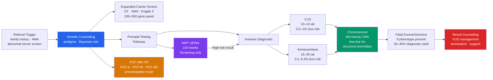

# 🧬 Genetic Counseling and Prenatal Testing

> [!abstract] TL;DR
> Genetic counseling translates raw genomic data — pedigrees, test results, variant reports — into actionable, non-directive reproductive decisions by combining Bayesian probability with psychosocial support; prenatal and preimplantation testing technologies ranging from non-invasive cell-free DNA screening (>99% sensitivity for trisomy 21) to invasive chromosomal microarray provide a tiered diagnostic ladder, each with its own sensitivity, specificity, procedural risk, and gestational window.

---

## Intuition — analogy FIRST

Imagine you have inherited an old blueprint library. You do not know which blueprints contain typos, but you know your family history: some relatives built walls that collapsed (affected individuals). A building inspector (genetic counselor) studies the catalogue of past projects (pedigree), calculates how likely it is that your copy contains the same typos (Bayesian risk), and then offers you a series of checks: a quick scan of the cover pages for obvious formatting errors (NIPT), a careful sampling of a few pages under magnification (CVS/amniocentesis with chromosomal microarray), or — if you want to know before printing the plans at all — a check of individual blueprint copies before selecting which set to use (preimplantation genetic testing).

The inspector's job is not to decide which blueprints you build with. It is to make sure you have accurate, complete information to make that decision yourself.

---

## How It Works



---

## Key Concepts / Details

### Secondary Level

**The Genetic Counseling Process**

Genetic counseling is a health communication process — not a test — delivered by board-certified genetic counselors (CGCs) or medical geneticists. A standard clinical encounter has six components:

1. **Indication identification** — personal or family history of a genetic condition, advanced maternal age (AMA, ≥35), abnormal serum screen, consanguinity, recurrent pregnancy loss, structural fetal anomaly on ultrasound.
2. **Pedigree construction** — at minimum a three-generation pedigree using standard notation: circles = female, squares = male, filled = affected, horizontal line = mating, vertical line = offspring, double horizontal line = consanguinity. Record age of onset, diagnosis confirmation, deceased relatives, miscarriages, and ethnic background (relevant to carrier frequency priors).
3. **Risk assessment** — applying mode-of-inheritance rules and Bayesian analysis to quantify recurrence risk (see Undergraduate section below).
4. **Education** — explaining the condition, test options, sensitivity/specificity, and limitations in plain language appropriate to the family.
5. **Non-directive counseling** — presenting options and probabilities without steering toward a particular reproductive decision. This distinguishes clinical genetic counseling from eugenics.
6. **Psychosocial support** — acknowledging the emotional weight of receiving genetic risk information; facilitating decisions around testing, family planning, and disclosure to relatives.

**Overview of Prenatal Testing Options**

| Test | Window | Type | Primary Indication | Procedure Risk |
|------|--------|------|--------------------|----------------|
| Cell-free DNA / NIPT | ≥10 wk | Screening | Common aneuploidies (T21/18/13) | None (blood draw) |
| First-trimester combined screen | 11–13 wk | Screening | Trisomies + NT measurement | None |
| Quad screen (AFP, hCG, uE3, inhibin A) | 15–20 wk | Screening | T21, T18, NTDs | None |
| CVS | 10–13 wk | Diagnostic | Chromosome / gene disorders | 0.5–1% loss |
| Amniocentesis | 15–20 wk | Diagnostic | Chromosome / gene disorders | 0.1–0.3% loss |

Screening tests generate a risk probability (e.g., 1/100 for T21) — they do not diagnose. Diagnostic tests on CVS or amniocyte cultures produce definitive chromosomal or molecular results.

---

### Undergraduate Level

**Bayesian Risk Calculation in Pedigrees**

When a woman wants to know her carrier probability, prior genotype frequency is updated by conditional information from the pedigree and/or test results. The formal structure is:

$$P(\text{carrier} \mid \text{evidence}) = \frac{P(\text{carrier}) \times P(\text{evidence} \mid \text{carrier})}{P(\text{carrier}) \times P(\text{evidence} \mid \text{carrier}) + P(\text{non-carrier}) \times P(\text{evidence} \mid \text{non-carrier})}$$

**Worked example — CF sibling with negative carrier test**

A woman's full sibling has cystic fibrosis. Both parents are confirmed obligate carriers (Cc). The woman is phenotypically unaffected.

| Hypothesis | Prior | Conditional (unaffected) | Joint | Posterior |
|---|---|---|---|---|
| Carrier (Cc) | 2/4 = 1/2 | 1 (she is unaffected; carriers are unaffected) | 1/2 | 2/3 |
| Non-carrier (CC) | 1/4 | 1 | 1/4 | 1/3 |
| Affected (cc) | 1/4 | 0 (excluded — she is unaffected) | 0 | 0 |

After conditioning on her being unaffected, her carrier prior = **2/3**.

Now she takes an expanded CF panel (detection rate D = 0.95, i.e., 95% of CF-causing variants detected) and the result is **negative**.

| Hypothesis | Prior | Conditional (neg test) | Joint | Posterior |
|---|---|---|---|---|
| Carrier | 2/3 | 1 − D = 0.05 | 0.0333 | 0.091 |
| Non-carrier | 1/3 | 1.0 | 0.3333 | 0.909 |

**Residual carrier probability after a negative test ≈ 9.1%** — substantially reduced from 67%, but not zero because no panel achieves 100% detection.

**Non-Invasive Prenatal Testing (NIPT) — Cell-Free DNA**

Cell-free DNA (cfDNA) in maternal plasma is a mixture of maternal cell-free DNA and fetal-derived cfDNA shed by apoptosis of cytotrophoblasts. The **fetal fraction** (FF) — the proportion originating from the placenta — must be ≥4% for reliable analysis; most labs require ≥4% and will report a "no-call" result if FF is lower (observed in obesity, early gestational age, or fetal aneuploidy itself in some cases).

| Condition | Sensitivity | Specificity | PPV (low-risk population) |
|---|---|---|---|
| Trisomy 21 (Down) | >99% | >99% | ~85–90% |
| Trisomy 18 (Edwards) | ~97% | >99% | ~45–75% |
| Trisomy 13 (Patau) | ~90% | >99% | ~18–40% |
| Monosomy X | ~92% | >99% | ~40–75% |

The low PPV for T18/T13 in low-risk populations illustrates that a positive NIPT result is a **high-risk screening result**, not a diagnosis. Confirmatory invasive testing (CVS or amniocentesis) is recommended before clinical action. ACOG, ACMG, and SMFM (2024 updated guidance) recommend cfDNA be offered to all pregnant patients regardless of maternal age.

**Chorionic Villus Sampling (CVS)**

Performed at 10–13 gestational weeks, CVS obtains a biopsy of chorionic villi from the placenta either transcervically or transabdominally. The tissue is genetically identical to the fetus at all chromosomal loci (though confined placental mosaicism — a chromosome abnormality present only in the placenta — occurs in ~1–2% of cases and can complicate interpretation). CVS enables:
- **Karyotype** — resolution ~5–10 Mb; detects aneuploidy and large rearrangements
- **Chromosomal microarray (CMA)** — resolution ~50–100 kb; first-line for fetuses with structural anomalies
- **Single-gene panel / Sanger** — for known familial variant
- **Earlier gestational age** than amniocentesis

**Amniocentesis**

Performed at 15–20 weeks; amniotic fluid contains exfoliated fetal cells cultured for karyotype, and the fluid itself is used for cell-free molecular testing. Procedure-related pregnancy loss risk is **0.1–0.3%** (lower than the historical 0.5–1% estimate). Amniocentesis avoids confined placental mosaicism. In addition to CMA and karyotype, amniotic fluid AFP can diagnose open neural tube defects.

**Chromosomal Microarray (CMA) as First-Line for Structural Anomalies**

CMA (array CGH or SNP array) detects copy-number variants (CNVs) with resolution orders of magnitude higher than conventional karyotype. ACOG recommends CMA as the first-line test when a fetal structural anomaly is identified on ultrasound, because:
- CMA detects clinically significant CNVs in ~6% of fetuses with structural anomalies even when karyotype is normal.
- SNP-based arrays additionally detect regions of homozygosity, identifying uniparental disomy.
- Diagnostic yield: ~1.7% additional findings when karyotype is normal and indication is AMA alone; ~6% when structural anomaly is present.

**Expanded Carrier Screening Panels**

Population-based carrier screening identifies at-risk couples before or during pregnancy. Key conditions:

| Condition | Gene | Inheritance | Carrier Frequency (European) | Detection Rate (standard panel) |
|---|---|---|---|---|
| Cystic fibrosis | *CFTR* | AR | ~1/25 | ~90–95% |
| Spinal muscular atrophy (SMA) | *SMN1* | AR | ~1/54 | ~95% |
| Fragile X | *FMR1* | X-linked, CGG repeat | ~1/250 (women) | ~99% (PCR for repeats) |
| Sickle-cell/thalassaemia | *HBB* | AR | varies by ancestry | varies |

Modern expanded carrier screening panels test 200–500 autosomal recessive and X-linked conditions simultaneously. ACMG and ACOG recommend offering expanded carrier screening to all patients of reproductive age, replacing the prior ethnicity-based sequential approach.

**Preimplantation Genetic Testing (PGT)**

PGT is performed on embryos created by IVF. A trophectoderm biopsy (5–8 cells from the blastocyst at day 5–6) is analysed before uterine transfer.

| Acronym | Full Name | Indication | Technology |
|---|---|---|---|
| PGT-A | Aneuploidy testing | Recurrent pregnancy loss, IVF failure, AMA | Next-generation sequencing (NGS) 24-chromosome |
| PGT-M | Monogenic conditions | Known familial single-gene disorder (CF, HD, BRCA1) | Targeted sequencing ± haplotyping |
| PGT-SR | Structural rearrangements | Carrier of translocation/inversion | NGS or FISH |

PGT-A is the most common; approximately 30–60% of blastocysts in women ≥38 are aneuploid. PGT-M requires custom probe design (~4–8 weeks lead time) and is offered when one or both partners carry a pathogenic variant for an autosomal dominant, autosomal recessive, or X-linked condition.

---

### Graduate Level

**Variant of Uncertain Significance (VUS) Management**

When sequencing identifies a variant not previously classified, it receives a VUS designation following the ACMG/AMP 2015 five-tier framework:

| Tier | Classification | Clinical Action |
|---|---|---|
| 1 | Pathogenic | Report, clinical action indicated |
| 2 | Likely Pathogenic | Report, treat as pathogenic |
| 3 | VUS | Report, no clinical action on variant alone; family testing and literature monitoring |
| 4 | Likely Benign | May report; no action |
| 5 | Benign | Generally not reported |

Evidence weighed includes: population frequency in gnomAD, computational predictions (SIFT, PolyPhen, CADD score), functional studies, de novo status, co-segregation in family members, and published case reports. VUSs are reclassified over time as evidence accumulates — approximately 20–30% of VUSs in BRCA1/2 testing have been reclassified within 3–5 years, predominantly toward benign.

In a prenatal context, a VUS reported on fetal CMA or exome creates profound uncertainty. The standard approach is:
1. Test both biological parents for the same variant (parental testing).
2. Classify variant as de novo (higher pathogenicity probability) or inherited from an apparently unaffected parent (lower probability, but incomplete penetrance must be considered).
3. Consult condition-specific expert panels (e.g., ClinGen VUS working groups) and variant databases (ClinVar, DECIPHER).

**Fetal Exome/Genome Sequencing**

When a fetal structural anomaly is identified and CMA is non-diagnostic, fetal exome sequencing (FES) achieves a diagnostic yield of approximately **30–40%** in prospective cohorts (CLINGEN/Deciphering Developmental Disorders). The indication profile includes:
- Multiple fetal anomalies, especially if involving different organ systems
- Fetal skeletal dysplasia
- Ventriculomegaly or fetal hydrops of unknown cause
- Parents are both carriers for the same gene (trio exome on mother/father/fetus)

Fetal genome sequencing (FGS) is increasingly used in rapid trio settings; turnaround times of 2–3 weeks are achievable for prenatal indications, though the gestational window constrains clinical utility. Secondary findings (ACMG SF v3.2 list of 81 actionable genes) raise the same ethical challenges as in postnatal sequencing.

**cfDNA Biology: Why Fetal Fraction Matters**

Cell-free fetal DNA originates almost exclusively from apoptosis of cytotrophoblast cells in the outermost placental layer; it does not represent circulating fetal cells per se. The placenta's cfDNA half-life in maternal circulation is ~16–30 minutes; thus cfDNA reflects current placental chromosome complement. This explains:
- **Confined placental mosaicism (CPM)**: NIPT reflects placental — not necessarily fetal — karyotype. False-positive NIPT results for aneuploidy (~60% of T13 and T18 positive NIPTs) are often due to CPM.
- **Vanishing twin**: cfDNA from a demised co-twin contributes to maternal plasma; can cause false-positive trisomy result months after the co-twin has been resorbed.
- **Maternal copy number variants**: maternal deletions/duplications at the genomic loci assessed can generate false NIPT signals for chromosomal aneuploidy or microdeletion syndromes.

**Ethical Dimensions**

Four major ethical tensions pervade clinical genetics and prenatal testing:

1. **Reproductive autonomy vs. disability rights critique**: Prenatal testing for conditions compatible with fulfilling life (Down syndrome, deafness) is contested. The disability rights critique argues that selective termination after prenatal diagnosis implicitly devalues the lives of people living with these conditions. Genetic counselors are trained to present this perspective without advocacy for any reproductive decision.

2. **Right not to know**: A patient may decline carrier screening or decline to be told secondary findings from fetal exome sequencing. The right not to know is legally and ethically protected; counselors must ascertain preferences before ordering broad sequencing.

3. **Incidental findings in the fetus**: Fetal exome/genome may reveal adult-onset conditions (BRCA1, APOE ε4, Huntington *HTT* premutation) in the fetus. The fetal patient cannot consent; consensus guidance (ACMG, ACOG) generally supports reporting highly penetrant actionable childhood-onset findings but not adult-onset conditions where the child will reach an age of autonomous decision-making.

4. **Direct-to-consumer (DTC) testing**: Products like 23andMe and AncestryDNA offer ancestry, health trait, and carrier reports. Limitations for clinical use:
   - Limited panel coverage (e.g., 23andMe BRCA assay tests only three founder variants, missing >1000 known pathogenic BRCA1/2 variants)
   - No pre-test counseling; inadequate framework for psychosocial support on positive results
   - Population-level polygenic risk scores (PRS) have limited individual predictive value
   - Unexpected relatedness discovery (half-siblings, paternity discordance) in 1–2% of users

---

## Python Demo

```python
# Bayesian carrier probability update after a negative screening test
# Scenario: unaffected sibling of a CF-affected patient
# pip install numpy matplotlib

import numpy as np
import matplotlib.pyplot as plt

def posterior_carrier_neg_test(prior_carrier, detection_rate):
    """
    Compute posterior carrier probability after a NEGATIVE carrier screening test.

    Parameters
    ----------
    prior_carrier   : float  Prior probability of being a carrier (0–1)
    detection_rate  : float  Fraction of true carriers identified by the panel (0–1)

    Returns
    -------
    float  Posterior carrier probability after a negative result
    """
    prior_noncarrier       = 1.0 - prior_carrier
    p_neg_given_carrier    = 1.0 - detection_rate  # panel missed the mutation
    p_neg_given_noncarrier = 1.0                   # non-carriers always test negative

    joint_carrier    = prior_carrier    * p_neg_given_carrier
    joint_noncarrier = prior_noncarrier * p_neg_given_noncarrier

    return joint_carrier / (joint_carrier + joint_noncarrier)

# --- Concrete worked example ---
# Prior 2/3 because she is an unaffected sibling of a CF patient (CC parents are Cc x Cc)
prior_sib      = 2 / 3
detection_rate = 0.95   # standard CF 97-variant panel: ~95% detection in European ancestry

posterior_sib  = posterior_carrier_neg_test(prior_sib, detection_rate)
print("=== CF sibling carrier calculation ===")
print(f"Prior carrier probability:          {prior_sib:.4f}  ({prior_sib*100:.1f}%)")
print(f"CF panel detection rate:            {detection_rate:.2f}  ({detection_rate*100:.0f}%)")
print(f"Posterior after NEGATIVE test:      {posterior_sib:.4f}  ({posterior_sib*100:.1f}%)")
print()

# --- Sweep: posterior vs prior for several detection rates ---
priors          = np.linspace(0.01, 0.99, 300)
detection_rates = [0.85, 0.90, 0.95, 0.99]
colors          = ['#d97706', '#7c3aed', '#2563eb', '#059669']

fig, (ax1, ax2) = plt.subplots(1, 2, figsize=(13, 5))

# Left: posterior carrier probability vs prior
for dr, col in zip(detection_rates, colors):
    posts = [posterior_carrier_neg_test(p, dr) for p in priors]
    ax1.plot(priors, posts, color=col, lw=2, label=f"Detection {int(dr*100)}%")
ax1.plot(priors, priors, 'k--', lw=1, alpha=0.5, label='No test (prior = posterior)')
ax1.scatter([prior_sib], [posterior_sib], color='red', zorder=5, s=80,
            label=f'CF sibling example\n({prior_sib:.2f} → {posterior_sib:.3f})')
ax1.set_xlabel('Prior carrier probability', fontsize=11)
ax1.set_ylabel('Posterior carrier probability\n(after NEGATIVE test)', fontsize=10)
ax1.set_title('Bayesian update: negative carrier screening', fontsize=11)
ax1.legend(fontsize=8)
ax1.set_xlim(0, 1); ax1.set_ylim(0, 1)
ax1.grid(alpha=0.3)

# Right: absolute risk reduction delivered by a negative test
for dr, col in zip(detection_rates, colors):
    reductions = [p - posterior_carrier_neg_test(p, dr) for p in priors]
    ax2.plot(priors, reductions, color=col, lw=2, label=f"Detection {int(dr*100)}%")
ax2.set_xlabel('Prior carrier probability', fontsize=11)
ax2.set_ylabel('Absolute risk reduction (prior − posterior)', fontsize=10)
ax2.set_title('Reassurance value of a negative result', fontsize=11)
ax2.legend(fontsize=8)
ax2.set_xlim(0, 1); ax2.set_ylim(0, 0.75)
ax2.grid(alpha=0.3)

fig.suptitle('Bayesian Carrier Probability — Effect of Panel Detection Rate', fontsize=12)
plt.tight_layout()
plt.savefig('bayesian_carrier_screening.png', dpi=150)
plt.show()
```

Expected output:
```
=== CF sibling carrier calculation ===
Prior carrier probability:          0.6667  (66.7%)
CF panel detection rate:            0.95  (95%)
Posterior after NEGATIVE test:      0.0909  (9.1%)
```

---

## Real-World Applications

**Down Syndrome Screening Programme — UK NHS**

The NHS Combined Test (11–13 weeks: nuchal translucency ultrasound + maternal serum PAPP-A + free β-hCG) has a ~90% detection rate for trisomy 21 at a 5% false-positive rate. Since the introduction of NIPT as a contingency test for screen-positives (NIPT offered to women with Combined Test risk ≥1/150), the invasive testing rate in England dropped by ~70% between 2018 and 2022 (NHS FASP data), preventing hundreds of procedure-related losses annually while maintaining or improving T21 detection.

**BRCA1/2 PGT-M — Hereditary Breast and Ovarian Cancer**

Couples where one partner carries a pathogenic BRCA1 (c.5266dupC / 185delAG) or BRCA2 variant commonly choose PGT-M to avoid transmitting the allele. The IVF cycle produces multiple embryos; trophectoderm biopsy identifies which embryos inherited the variant. Unaffected embryos are transferred. This eliminates a 50% heritable cancer risk per conception without prenatal diagnosis or selective termination mid-pregnancy — addressing ethical concerns for couples who object to termination.

**Chromosomal Microarray in Stillbirth Investigation**

When a stillbirth occurs and conventional karyotype fails due to tissue degradation (failed cell culture), CMA on formalin-fixed or fresh placental tissue succeeds in ~50–70% of cases. CMA identifies a chromosomal cause in ~8–10% of stillbirths overall, including subtle CNVs missed by karyotype, providing recurrence risk information critical for counseling.

**23andMe BRCA Limitations — FDA Warning**

The 23andMe Health + Ancestry kit received FDA clearance for three BRCA1/2 variants prevalent in Ashkenazi Jewish populations. However, over 1,000 other pathogenic BRCA1/2 variants are not detected. Studies show that 88–90% of BRCA carriers in non-Ashkenazi populations would receive a **false-negative** result from DTC testing alone. The ACMG position statement (2015, affirmed 2021) advises against using DTC results as a basis for clinical management without a full diagnostic-grade panel ordered through a healthcare provider.

---

## Common Pitfalls

- **Treating a positive NIPT as a diagnosis** — NIPT is a screening test; its false-positive rate, while low, still means a majority of positive NIPT results in low-risk populations represent false positives (low PPV). Invasive confirmatory testing is required before clinical decisions (termination, surgical planning).
- **Ignoring residual risk after a negative carrier test** — A negative expanded carrier panel does not eliminate carrier status; residual risk depends on the panel's detection rate and the population's allele spectrum. Genetic counselors always communicate residual risk alongside the negative result.
- **Confusing fetal fraction failure with fetal normalcy** — A "no-call" NIPT result due to low fetal fraction is not reassuring. It is non-informative; invasive testing should be offered if clinical concern remains.
- **Applying Bayesian tables without considering conditional independence** — Each row of a Bayesian table must represent mutually exclusive hypotheses and the conditional probabilities must reflect the actual test performance in the relevant population. Using sensitivity/specificity from a high-risk cohort to counsel a low-risk patient inflates PPV.
- **Mistaking CVS for amniocentesis in gestational timing** — CVS is performed at 10–13 weeks; amniocentesis at 15–20 weeks. CVS carries higher procedural risk (~0.5–1%) but provides results earlier. Confusing the windows leads to incorrect counseling on when action can be taken.
- **Ignoring confined placental mosaicism (CPM)** — CMA or karyotype on CVS reflects placental tissue. CPM (chromosome abnormality limited to the placenta) occurs in ~1–2% of CVS specimens and can produce a false-positive chromosomal result for the fetus. Amniocentesis is offered to resolve discordant CVS findings.
- **Pathologising Deaf culture in counseling** — The Deaf community includes individuals who do not identify their hearing status as a disability and may specifically request PGT to select for Deaf offspring. Non-directive counseling principles require genetic counselors to respect reproductive autonomy in both directions.
- **Overlooking adult-onset implications of fetal sequencing results** — Discovering a BRCA2 or Huntington expansion in a fetus creates an ethical obligation the family did not necessarily anticipate. Pre-test counseling should explicitly cover the scope of possible findings and the patient's preferences before fetal exome is ordered.

---

## Related Concepts

- [[Bayesian_Statistics]] — the mathematical engine of Bayesian pedigree risk tables; prior × conditional → posterior probability, directly applied in every carrier probability calculation in clinical genetics
- [[Mendelian_Inheritance_Patterns]] — the foundational segregation ratios (1/2 risk for AD, 1/4 for AR) that serve as priors before conditioning on pedigree or test evidence
- [[Chromosomal_Theory_of_Inheritance]] — understanding karyotype, meiotic nondisjunction, and chromosomal rearrangements is prerequisite for interpreting CMA results and NIPT aneuploidy calls
- [[Extensions_to_Mendelian_Genetics]] — penetrance, expressivity, anticipation (CGG repeat in *FMR1*, CAG in *HTT*), and genomic imprinting all modify risk calculations in genetic counseling
- [[Population_Genetics_and_Hardy_Weinberg]] — carrier frequency priors used in counseling are derived from allele frequencies in population genetic databases; Hardy-Weinberg equilibrium underlies population-level carrier screening design
- [[DNA_Repair_and_Mutation]] — understanding mutational mechanisms (point mutations, CNVs, repeat expansions) is essential for interpreting variant classifications (pathogenic vs VUS) on diagnostic reports
- [[_MOC_Human_and_Medical_Genetics|↑ Human and Medical Genetics MOC]] — section entry point and concept map for all human and medical genetics notes

---

## Review Questions

1. **Secondary**: A woman's father has an autosomal dominant condition with 80% penetrance. Draw the relevant pedigree segment. What is her probability of carrying the causative allele? What is her probability of *expressing* the condition if she carries it? How do these two numbers differ, and why does the distinction matter for counseling?

2. **Undergraduate**: A couple of Ashkenazi Jewish ancestry is undergoing carrier screening. The man tests positive for a *CFTR* pathogenic variant. The woman's result is negative on a 97-variant CF panel with 95% detection rate in this population. Her prior carrier probability (before testing) is 1/25. Construct the Bayesian table and calculate her posterior carrier probability after the negative test. What is the couple's residual risk of having an affected child?

3. **Graduate**: A morphologically abnormal fetus at 18 weeks has a normal karyotype and normal chromosomal microarray. The maternal-fetal medicine team orders fetal exome sequencing (trio). The report returns a VUS in *KAT6A* — a de novo missense variant in the acetyltransferase domain, not present in gnomAD, CADD score 28.7, predicted deleterious by six in silico tools, no published case with this variant but 12 published pathogenic missense variants cluster in the same domain. Using the ACMG/AMP variant classification criteria, what evidence codes apply, what is the likely classification, and how would you counsel the family given the gestational age?

---

## Sources

- [Bayesian Analysis and Risk Assessment in Genetic Counseling and Testing — PubMed](https://pubmed.ncbi.nlm.nih.gov/14736820/)
- [SMFM Consult Series #74: Cell-free DNA Screening for Aneuploidies — Updated Guidance 2025](https://obgyn.onlinelibrary.wiley.com/doi/full/10.1002/pmf2.70139)
- [Cell-free DNA Screening for Trisomies 21, 18, and 13 — AJOG 2022](https://www.ajog.org/article/S0002-9378%2822%2900041-2/fulltext)
- [ASRM Committee Opinion: Indications for PGT-M (2023)](https://www.asrm.org/practice-guidance/practice-committee-documents/indications-and-management-of-preimplantation-genetic-testing-for-monogenic-conditions-a-committee-opinion-2023/)
- [Richards S. et al. (2015). Standards and Guidelines for the Interpretation of Sequence Variants. *Genetics in Medicine*, 17, 405–424.](https://www.nature.com/articles/gim201530)
- [Hillman S. C. et al. (2013). Use of chromosomal microarray analysis in prenatal diagnosis. *Ultrasound in Obstetrics & Gynecology*, 41, 610–620.](https://doi.org/10.1002/uog.12464)
- [Genetics: Bayesian Risk Analysis in X-linked Recessive Disorders — Practical Haemostasis](https://practical-haemostasis.com/Genetics/bayesian_risk_analysis.html)
- Nussbaum R. L., McInnes R. R., Willard H. F. *Thompson & Thompson Genetics in Medicine*, 8th ed. Elsevier. (Ch. 15–17)

---

#Genetics #HumanGenetics #GeneticCounseling #PrenatalTesting
