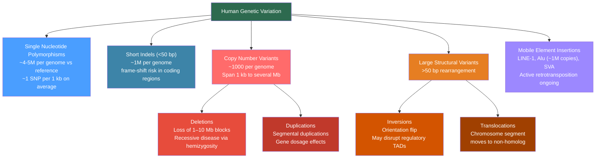

# 🧬 Human Genome and Genetic Variation

> [!abstract] TL;DR
> The human genome — 3.1 billion base pairs encoding ~20,000 protein-coding genes — has been comprehensively catalogued from the $3 billion Human Genome Project (1990–2003) through to the telomere-to-telomere pangenome (2022–2023); any two humans differ at ~4–5 million single nucleotide positions, plus thousands of structural rearrangements, and understanding how that variation is distributed within and between populations is the foundation of medical genetics, GWAS, and ancestry analysis.

---

## Intuition — analogy FIRST

Think of the human genome as a 3.1-billion-letter instruction manual, of which only about 20 million letters (~1.5%) contain active instructions (protein-coding exons) and roughly half the book is composed of ancient repetitive photocopies — old viral remnants pasted in millions of times over hundreds of millions of years. Any two copies of this manual differ in roughly 4–5 million individual letter choices (SNPs), plus thousands of places where one copy has an extra paragraph inserted, a chapter deleted, or a long section flipped backwards. The vast majority of these differences are inconsequential — typographical variation that does not change the meaning of any sentence. A small fraction are critically functional: they alter amino acids, splice sites, or regulatory grammar. Medical genetics is the discipline of distinguishing the meaningful edits from the noise.

---

## How It Works

### The Human Genome Project and Reference Assembly

The **Human Genome Project (HGP)** ran from 1990 to 2003, cost approximately $3 billion, and produced the first draft (2001) and finished (2003) reference sequence using clone-by-clone Sanger sequencing. Celera Genomics ran a competing whole-genome shotgun effort in parallel; both were published simultaneously in *Science* and *Nature* in February 2001.

The GRCh38/hg38 assembly (2013) refined the original sequence but still contained ~200 Mb of unresolved gaps, most of them in centromeres, telomeres, and highly repetitive pericentromeric regions. These regions were finally closed by the **Telomere-to-Telomere (T2T) Consortium** in 2022 using Oxford Nanopore ultra-long reads and PacBio HiFi reads, producing the **T2T-CHM13v2.0** assembly — the first truly gapless human reference sequence, adding ~182 Mb of previously unsequenced sequence including complete centromeric satellite arrays.

The **Human Pangenome Reference Consortium (HPRC)** published a draft pangenome in 2023 built from 47 phased diploid assemblies representing diverse ancestry groups (including HG002, a well-characterised Ashkenazi Jewish reference sample). The pangenome encodes ~119 million variant sites including 1.1 million SVs invisible to GRCh38-only analysis — replacing the concept of a single linear reference with a variation graph that represents the full allelic diversity of our species.

### Genome Statistics

| Feature | Value |
|---------|-------|
| Haploid genome size | ~3.1 Gb (3,054 Mb in T2T-CHM13) |
| Diploid cell DNA content | ~6.4 pg (~6.2 Gb) |
| Protein-coding genes | ~19,000–20,500 (GENCODE v44) |
| Coding exons (fraction of genome) | ~1.5% |
| Intronic sequence | ~25% |
| Transposable elements / repeats | ~46–50% |
| Number of chromosomes (diploid) | 46 (22 autosomes × 2 + sex chromosomes) |
| CpG islands | ~28,000 (often near gene promoters) |
| Human-mouse conserved sequence | ~5% (regulatory + coding) |

### Types of Genetic Variation



---

## Key Concepts / Details

### Secondary Level

**What is a SNP?** A single nucleotide polymorphism (SNP) is a position in the genome where the nucleotide base differs between individuals. At a canonical SNP, one allele (the ancestral or major allele) occurs in most people, and one or more alternative alleles occur at a frequency ≥1% in the population. Any two unrelated humans carry ~4–5 million SNP differences relative to the reference genome. At a population level, ~300–600 million SNP positions have been catalogued across all humans.

**Allele frequency spectrum.** Most common SNPs (minor allele frequency, MAF > 5%) were present in the ancestral African population before the out-of-Africa migration and are shared broadly across continental groups. Rare variants (MAF < 1%) are disproportionately recent mutations, often private to a single ethnic group or even a single family.

**Copy number variants (CNVs).** A CNV is a segment of DNA (typically >1 kb) that is present in a variable number of copies relative to the reference genome. Deletions reduce copy number below 2; duplications increase it above 2. On average a person carries ~1,000 CNVs relative to the reference, collectively affecting >10 Mb of sequence. CNVs contribute substantially to phenotypic diversity — the salivary amylase gene (AMY1) copy number varies from 2 to >20 and correlates with starch digestion efficiency.

**Mobile element insertions.** Alu elements (~280 bp SINEs) and LINE-1 elements (~6 kb LINEs) together comprise over 25% of the human genome. LINE-1 elements are still actively retrotransposing at a rate of roughly one new insertion per 20–200 births. These insertions can disrupt coding sequence, alter splicing, or reactivate in somatic cells during cancer.

---

### Undergraduate Level

**Linkage disequilibrium (LD).** LD is the non-random association between alleles at two or more loci in a population. Two SNPs are in strong LD if knowing the allele at one locus predicts the allele at the other with high probability. LD arises because nearby variants on the same chromosome are inherited together unless separated by recombination.

Two standard LD statistics:

| Statistic | Formula | Range | Interpretation |
|-----------|---------|-------|----------------|
| $r^2$ | $\frac{(p_{AB} - p_A p_B)^2}{p_A(1-p_A) p_B(1-p_B)}$ | 0 to 1 | Proportion of variance explained; used for GWAS tag-SNP selection |
| $D'$ | $D / D_{\max}$ where $D = p_{AB} - p_A p_B$ | −1 to 1 | Historical recombination; $|D'|=1$ means no historical recombination between loci |

High $r^2$ (>0.8) between two SNPs means genotyping one effectively genotypes the other — a key principle behind GWAS **imputation** and **tag-SNP** panel design.

**Haplotype blocks.** The genome is organised into discrete regions of high LD (~10–100 kb in Europeans) called haplotype blocks, separated by recombination hotspots where crossing-over is concentrated. Within a block, only a handful of common haplotypes (distinct combinations of alleles) account for the vast majority of chromosomes in any population. The **HapMap Project** (phases 1–3, 2002–2009) catalogued this haplotype block structure across four continental populations (YRI, CEU, CHB, JPT), enabling systematic tag-SNP selection for genome-wide association studies.

**1000 Genomes Project.** Sequenced 2,504 individuals from 26 populations at 4–8× coverage (phase 3, 2015), cataloguing ~88 million SNPs, ~3.6 million indels, and ~68,000 SVs, with a focus on variants at MAF > 1%. Its phased haplotype reference panels are the backbone of modern GWAS imputation pipelines. The **gnomAD** database (v4.1, 2024) extends this to ~807,000 whole exomes and ~76,000 whole genomes, providing population-stratified allele frequency estimates for ~730 million variants — the definitive reference for variant pathogenicity assessment.

**Human population structure and $F_{ST}$.** Wright's fixation index:

$$F_{ST} = \frac{H_T - H_S}{H_T}$$

For humans, genome-wide $F_{ST}$ between continental groups (sub-Saharan Africa, Europe, East Asia) is ~0.10–0.15. This means approximately 85–90% of total human genetic variation exists *within* continental groups and only 10–15% exists *between* them — the famous Lewontin (1972) observation confirmed by genomic data. $F_{ST}$ between adjacent European populations is typically 0.001–0.01; between individuals within any single population it is ~0.

**Out-of-Africa bottleneck.** The founding population that left Africa ~50,000–70,000 years ago carried only a subset of African diversity — a genetic bottleneck that reduced $N_e$ and truncated the allele frequency spectrum. As a result, non-African populations share longer haplotype blocks (less historical recombination opportunity since the founder event), fewer total SNPs per genome, and greater LD than African populations. The San (Khoisan) people of southern Africa harbour the deepest human population divergence and the greatest within-group diversity.

**ACMG/AMP variant classification.** The American College of Medical Genetics and the Association for Molecular Pathology (2015 Richards criteria, 2023 updates) classify sequence variants in diagnostic contexts using five tiers:

| Class | Label | Typical clinical action |
|-------|-------|------------------------|
| 1 | Benign (B) | Report as background variant, no action |
| 2 | Likely Benign (LB) | Interpreted as non-causative |
| 3 | Variant of Uncertain Significance (VUS) | Cannot conclude pathogenicity; may require functional data or family segregation |
| 4 | Likely Pathogenic (LP) | ≥90% probability of pathogenicity; treat as causative |
| 5 | Pathogenic (P) | Overwhelmingly strong evidence; causative diagnosis |

Evidence codes combine population frequency (PM2 — absent or extremely rare in gnomAD), computational predictions (PP3 — multiple lines of computational evidence), functional assays (PS3 — well-established in-vitro or in-vivo functional studies), and clinical/segregation data (PP4 — phenotype consistent with a gene's disease spectrum).

---

### Graduate Level

**Admixture and ancestry inference.** Model-based clustering methods (STRUCTURE, ADMIXTURE) treat each individual's genome as a mixture of $K$ ancestral populations and estimate membership coefficients $q_{ik}$ (the fraction of individual $i$'s ancestry from cluster $k$) by maximising the likelihood of the observed SNP genotypes under Hardy-Weinberg equilibrium within each cluster. For a genome-wide SNP array:

$$L = \prod_{l=1}^{L} \prod_{i=1}^{n} P(\text{genotype}_{il} \mid q_i, f_{lk})$$

where $f_{lk}$ is the allele frequency at locus $l$ in cluster $k$. The EM algorithm iterates between updating $q_i$ (ancestry fractions) and $f_{lk}$ (cluster allele frequencies). ADMIXTURE achieves identical likelihood to STRUCTURE but uses block-coordinate gradient descent ~100–1000× faster.

**Principal component analysis for ancestry.** PCA applied to a genome-wide SNP matrix (individuals × SNPs) places individuals in a low-dimensional space where the first principal components capture continental ancestry, and subsequent PCs capture finer-scale regional structure. The eigenvalue decomposition of the $n \times n$ genetic relatedness matrix (GRM):

$$\text{GRM}_{ij} = \frac{1}{L}\sum_{l=1}^{L}\frac{(g_{il} - 2f_l)(g_{jl} - 2f_l)}{2f_l(1-f_l)}$$

produces PCs that are routinely used as covariates in GWAS to correct for population stratification (Price et al., 2006 — EIGENSTRAT). The first PC typically separates Africans from non-Africans; the second separates East Asians from Europeans; subsequent PCs resolve within-continental structure.

**Variant effect prediction — deleteriousness scoring.** Computational tools predict variant functional impact from evolutionary conservation and biochemical context:

| Tool | Input | Method | Output |
|------|-------|--------|--------|
| SIFT | Amino acid change | Sequence homology — conservation across orthologues | Tolerated/Deleterious |
| PolyPhen-2 | Amino acid change + structure | Naive Bayes classifier on evolutionary conservation + structural features | Benign/Possibly/Probably damaging |
| CADD | Any variant | Ensemble of 60+ features in a linear SVM trained to distinguish fixed vs. simulated variants | C-score (phred-scaled); CADD >20 = top 1% deleterious |
| SpliceAI | Intronic/exonic variant | Deep residual network trained on splice sites genome-wide | Delta score for acceptor/donor gain/loss |
| AlphaMissense | Missense variant | Fine-tuned AlphaFold-derived language model on human variation | Likely pathogenic / ambiguous / likely benign |

**Haplotype phasing and long-read genomics.** Short-read sequencing cannot directly determine which SNPs lie on the maternal vs. paternal chromosome (haplotype phasing). Long reads from PacBio HiFi or Oxford Nanopore that span multiple heterozygous sites simultaneously phase variants by physical co-occurrence. SHAPEIT5 and WhatsHap implement statistical and physical phasing respectively. Phasing is critical for compound heterozygous diagnosis — two pathogenic alleles in a recessive disease gene must be on opposite haplotypes (trans configuration) to cause disease.

**gnomAD constraint metrics — pLI and LOEUF.** gnomAD quantifies how intolerant a gene is to loss-of-function (LoF) variation by comparing observed LoF variants to the number expected under neutrality. The probability of being loss-of-function intolerant (**pLI**, v2) and the loss-of-function observed/expected upper bound fraction (**LOEUF**, v3+) capture the same concept:

- pLI ≥ 0.9 → gene is highly constrained; heterozygous LoF variants very likely pathogenic (haploinsufficiency)
- LOEUF < 0.35 → gene belongs to the most constrained ~10% of protein-coding genes

These metrics are the primary evidence for PM2/PP2 ACMG codes and power variant curation in ClinVar.

**Structural variant discovery at population scale.** SVs (>50 bp) are systematically underdetected by short-read SNP arrays and even short-read WGS. Long-read-based SV calling (Sniffles2, PBSV) identifies insertions, deletions, inversions, and translocations at single-base breakpoint resolution. Population-scale long-read cohorts (HGSVC, UK Biobank PacBio pilot) show that SVs affect ~3.5 Mb per genome on average — comparable to the total coding sequence — and include medically relevant CNVs over known disease loci missed by clinical microarrays.

---

## Python Demo

```python
# pip install numpy matplotlib scipy
"""
Simulate SNP allele frequencies across 3 populations (Africa, Europe, East Asia)
with genetic drift and inter-population migration.
Track FST over generations and visualise allele frequency spectra.
"""
import numpy as np
import matplotlib.pyplot as plt

rng = np.random.default_rng(2024)

# ── Parameters ──────────────────────────────────────────────────────────────
N_SNPS       = 2000      # independent SNP loci
N_GENERATIONS = 2000     # generations of drift post out-of-Africa split
Ne_Africa    = 10_000    # effective population size
Ne_Europe    = 3_000     # smaller due to out-of-Africa bottleneck
Ne_EastAsia  = 3_000
MIGRATION    = 0.002     # fraction of each non-African pop replaced by
                         # migrants from Africa each generation (gene flow)

# ── Initialise allele frequencies ────────────────────────────────────────────
# African ancestral population: draw MAF from a realistic folded spectrum
# Beta(0.5, 0.5) gives a U-shaped prior approximating the neutral spectrum
p_ancestral = rng.beta(0.5, 0.5, N_SNPS)
# Ensure minor allele is the minor one
p_ancestral = np.where(p_ancestral > 0.5, 1 - p_ancestral, p_ancestral)
p_ancestral = np.clip(p_ancestral, 0.01, 0.99)

# Africa stays at ancestral frequencies (large, slowly drifting population)
p_afr = p_ancestral.copy()
# Founder populations start at the same frequencies but drift independently
p_eur = p_ancestral.copy()
p_eas = p_ancestral.copy()

fst_history = []

def fst_pairwise(p1, p2):
    """Compute FST between two populations for an array of SNP frequencies."""
    p_bar = (p1 + p2) / 2.0
    H_T   = 2 * p_bar * (1 - p_bar)
    H_S   = p1 * (1 - p1) + p2 * (1 - p2)
    # Avoid division by zero at fixed loci
    valid = H_T > 1e-9
    return float(np.mean((H_T[valid] - H_S[valid]) / H_T[valid]))

# ── Simulation ────────────────────────────────────────────────────────────────
for _ in range(N_GENERATIONS):
    # Africa: slow drift
    counts_afr = rng.binomial(2 * Ne_Africa, p_afr)
    p_afr = counts_afr / (2 * Ne_Africa)

    # Europe: drift + migration from Africa
    counts_eur = rng.binomial(2 * Ne_Europe, p_eur)
    p_eur = counts_eur / (2 * Ne_Europe)
    p_eur = (1 - MIGRATION) * p_eur + MIGRATION * p_afr  # gene flow

    # East Asia: drift + smaller migration pulse from Africa
    counts_eas = rng.binomial(2 * Ne_EastAsia, p_eas)
    p_eas = counts_eas / (2 * Ne_EastAsia)
    p_eas = (1 - MIGRATION * 0.5) * p_eas + MIGRATION * 0.5 * p_afr

    # Clamp to [0, 1]
    p_afr = np.clip(p_afr, 0, 1)
    p_eur = np.clip(p_eur, 0, 1)
    p_eas = np.clip(p_eas, 0, 1)

    if _ % 100 == 0:
        fst_ae = fst_pairwise(p_afr, p_eur)
        fst_ee = fst_pairwise(p_eur, p_eas)
        fst_af_ea = fst_pairwise(p_afr, p_eas)
        fst_history.append((_, fst_ae, fst_ee, fst_af_ea))

# ── Plotting ──────────────────────────────────────────────────────────────────
fig, axes = plt.subplots(1, 3, figsize=(16, 5))

# Plot 1: FST trajectories over generations
gens, fst_ae_vals, fst_ee_vals, fst_af_ea_vals = zip(*fst_history)
axes[0].plot(gens, fst_ae_vals,    label="Africa–Europe",    color="#e74c3c", lw=2)
axes[0].plot(gens, fst_af_ea_vals, label="Africa–East Asia", color="#3498db", lw=2)
axes[0].plot(gens, fst_ee_vals,    label="Europe–East Asia", color="#2ecc71", lw=2)
axes[0].axhspan(0.10, 0.15, alpha=0.12, color="gold",
                label="Observed human FST range (0.10–0.15)")
axes[0].set_xlabel("Generation")
axes[0].set_ylabel("$F_{ST}$")
axes[0].set_title("FST Divergence Over Time")
axes[0].legend(fontsize=8)
axes[0].set_ylim(0, 0.25)

# Plot 2: Minor allele frequency spectra (allele frequency spectrum, AFS)
def maf(p):
    return np.where(p > 0.5, 1 - p, p)

bins = np.linspace(0, 0.5, 21)
axes[1].hist(maf(p_afr), bins=bins, alpha=0.6, color="#e74c3c",
             label="Africa", density=True)
axes[1].hist(maf(p_eur), bins=bins, alpha=0.6, color="#3498db",
             label="Europe", density=True)
axes[1].hist(maf(p_eas), bins=bins, alpha=0.6, color="#2ecc71",
             label="East Asia", density=True)
axes[1].set_xlabel("Minor Allele Frequency (MAF)")
axes[1].set_ylabel("Density")
axes[1].set_title("Allele Frequency Spectra\n(End of simulation)")
axes[1].legend(fontsize=8)

# Plot 3: Per-SNP FST distribution between Africa and Europe
snp_fst = []
for pa, pe in zip(p_afr, p_eur):
    pbar = (pa + pe) / 2
    ht   = 2 * pbar * (1 - pbar)
    hs   = pa * (1 - pa) + pe * (1 - pe)
    snp_fst.append((ht - hs) / ht if ht > 1e-9 else 0.0)
snp_fst = np.array(snp_fst)

axes[2].hist(snp_fst, bins=40, color="#9c88ff", edgecolor="white", alpha=0.85)
axes[2].axvline(np.mean(snp_fst), color="red", lw=2,
                label=f"Mean FST = {np.mean(snp_fst):.3f}")
axes[2].axvline(np.percentile(snp_fst, 99), color="orange", lw=1.5, ls="--",
                label=f"99th pct = {np.percentile(snp_fst, 99):.3f}\n(outlier loci → selection?)")
axes[2].set_xlabel("Per-SNP $F_{ST}$ (Africa vs Europe)")
axes[2].set_ylabel("Count")
axes[2].set_title("Per-SNP FST Distribution\n(Outliers indicate local adaptation)")
axes[2].legend(fontsize=8)

fig.suptitle(
    "Simulated Human Population Divergence\n"
    f"Ne(Africa)={Ne_Africa:,}  Ne(non-Africa)={Ne_Europe:,}  "
    f"Migration={MIGRATION:.3f}  Generations={N_GENERATIONS:,}",
    fontsize=12
)
plt.tight_layout()
plt.savefig("human_genetic_variation_simulation.png", dpi=150)
plt.show()

# ── Summary statistics ─────────────────────────────────────────────────────
final_fst_ae = fst_pairwise(p_afr, p_eur)
final_fst_ea = fst_pairwise(p_eur, p_eas)
n_fixed_eur  = int(np.sum((p_eur == 0) | (p_eur == 1)))
print(f"Final FST Africa–Europe:      {final_fst_ae:.4f}  (empirical: 0.10–0.15)")
print(f"Final FST Europe–East Asia:   {final_fst_ea:.4f}  (empirical: 0.05–0.10)")
print(f"SNPs fixed in European pop:   {n_fixed_eur} / {N_SNPS}  ({n_fixed_eur/N_SNPS:.1%})")
```

The simulation demonstrates three empirical patterns: (1) Africa–Europe FST rises toward the observed 0.10–0.15 range after thousands of generations of drift + bottleneck; (2) the African allele frequency spectrum retains a richer distribution of intermediate-frequency variants reflecting its larger effective size; (3) the per-SNP FST distribution has a long right tail — the basis of $F_{ST}$ outlier tests used to identify loci under local positive selection (e.g., skin pigmentation, lactase persistence).

---

## Real-World Notes

**GWAS and the common disease–common variant hypothesis.** Genome-wide association studies (GWAS) rely on the principle that common diseases are partly driven by common SNPs (MAF > 5%). Because SNPs in LD with the causal variant will show association even if they are not themselves functional, genotyping ~650,000 tag-SNPs on an Illumina array implicitly surveys ~80% of common variation across the genome via LD. The NHGRI-EBI GWAS Catalog (2024) lists over 590,000 associations across ~5,200 traits. However, common SNPs explain only 10–50% of the heritability of most complex traits — the "missing heritability" problem drives ongoing interest in rare variants, SVs, and gene–environment interactions.

**Pharmacogenomics and CYP2C19 variation.** CYP2C19 encodes a liver enzyme that metabolises ~10% of all prescribed drugs including clopidogrel (antiplatelet), omeprazole (PPI), and several antidepressants. A common loss-of-function SNP (*2 allele, rs4244285, MAF ~15% in Europeans, ~30% in East Asians) renders individuals poor metabolisers. The FDA requires CYP2C19 genotyping before prescribing clopidogrel in some contexts. This is the clearest translational example of how population-level allele frequency data (gnomAD) directly informs prescribing decisions.

**The 1000 Genomes Project and imputation.** Modern GWAS arrays genotype ~650,000 SNPs directly, but statistical imputation using 1000 Genomes or TOPMed reference panels can extend association analyses to >60 million variants without additional genotyping cost. Imputation exploits LD: if a typed tag-SNP at $r^2 = 0.9$ with an untyped SNP, the untyped SNP's genotype can be inferred with ~90% accuracy. This approach identified thousands of additional GWAS loci that SNP arrays alone cannot detect, particularly in non-European populations that were underrepresented in early reference panels.

**BRCA1/BRCA2 and variant interpretation.** The BRCA1 and BRCA2 genes harbour thousands of unique sequence variants across their coding sequences. ClinVar (NCBI) and LOVD (Leiden Open Variation Database) curate these variants using ACMG/AMP criteria. Approximately 40% of submitted BRCA1/2 variants are classified as VUS — uncertain significance — creating clinical decision paralysis. Functional saturation genome editing experiments (Findlay et al., 2018; Erwood et al., 2022) have classified near-complete sets of BRCA1 missense variants functionally, reclassifying thousands of VUS to likely benign or likely pathogenic — demonstrating that high-throughput functional data can resolve population-scale variant classification backlogs.

---

## Common Pitfalls

- **Conflating SNP count with genetic distance.** Two individuals can share 99.9% of their SNPs yet have dramatically different ancestry-informative variant profiles, because informativeness is driven by allele frequency differences between populations, not total SNP count. Use ancestry-informative markers (AIMs) or PCA, not raw SNP counts, for ancestry analysis.
- **Reference bias in variant calling.** Aligning reads to GRCh38 causes reads carrying alleles absent from the reference to misalign or be discarded. This disproportionately affects non-European individuals whose ancestral haplotypes diverge more from the GRCh38 founder. Graph pangenome alignment (VG toolkit) reduces allele dropout but is computationally heavier.
- **MAF ≠ effect on disease risk.** A common variant (MAF = 40%) can have a meaningful effect on disease risk; a rare variant (MAF = 0.001%) can be fully benign. Effect size and frequency are approximately inversely correlated for disease variants under purifying selection, but exceptions abound — e.g., APOE ε4 (MAF ~15%) carrying the largest common-variant effect on Alzheimer's risk.
- **VUS misclassification in clinical reports.** Variants of uncertain significance should never be used for clinical decisions. However, patients often interpret VUS as "probably pathogenic" because it was reported. Returning VUS results requires active genetic counselling; some laboratories no longer report VUS in genes with weak disease association evidence.
- **Population-stratified allele frequency lookups.** gnomAD reports allele frequencies stratified by population (AFR, AMR, ASJ, EAS, FIN, NFE, SAS). A variant at MAF = 0.3% in the NFE (Non-Finnish European) population might be at MAF = 5% in the FIN (Finnish) population due to the Finnish founder effect. Using the wrong reference population for the PM2 evidence code can lead to incorrect pathogenicity classification.
- **LD decay and population-specific haplotype blocks.** Haplotype block structure differs between populations. A tag-SNP with $r^2 = 0.9$ to a causal variant in Europeans may have $r^2 = 0.3$ in Africans due to shorter LD blocks. GWAS findings from European cohorts frequently do not replicate in African-ancestry cohorts for this reason — fine-mapping requires population-specific LD reference panels.
- **Treating CNVs and SVs as binary.** Many CNVs are multiallelic (copy number 0, 1, 2, 3, 4+). Treating them as biallelic SNPs in standard GWAS pipelines assigns incorrect effect estimates. Dedicated CNV calling tools (GATK gCNV, CNVnator, Canvas) and SV-aware association methods are required.

---

## Related Concepts

- [[Population_Genetics_and_Hardy_Weinberg]] (Genetics/02_Classical_and_Population_Genetics) — the theoretical framework underpinning FST, allele frequency spectra, and drift that this note applies to empirical human genomic data; Hardy-Weinberg assumptions underlie GWAS control-population quality control
- [[DNA_Sequencing_Technologies]] (Genetics/03_Genomics_and_Bioinformatics) — the technologies that generated the human reference sequence and now catalogue personal genomic variation; Illumina WGS, PacBio HiFi, and Nanopore long reads each discover different variant classes with different accuracy profiles
- [[Genome_Organization_and_Structure]] (Genetics/03_Genomics_and_Bioinformatics) — the architecture of repetitive elements, segmental duplications, and centromeric satellite DNA directly determines which genomic regions are accessible to variant calling and why ~46% of the genome is occupied by transposable elements
- [[Linkage_Mapping_and_Recombination]] (Genetics/02_Classical_and_Population_Genetics) — recombination rates govern the decay of linkage disequilibrium and the boundaries of haplotype blocks; genetic maps derived from family studies and population LD are the same underlying biology viewed at different timescales
- [[Bayesian_Statistics]] (Mathematics/06_Probability_and_Statistics) — STRUCTURE/ADMIXTURE ancestry inference uses Bayesian posteriors over population membership; ACMG/AMP variant classification is a probabilistic framework assigning prior + evidence weights; imputation is Bayesian prediction under an LD prior
- [[PCA]] (AI-ML/01_Classical_ML/Unsupervised) — principal component analysis on genome-wide SNP matrices (EIGENSTRAT) is the standard method for visualising population structure, detecting stratification in GWAS, and computing ancestry covariates; the genetic relatedness matrix is the covariance matrix being decomposed
- [[_MOC_Human_and_Medical_Genetics|↑ Human and Medical Genetics MOC]] — section entry point and concept map for all human and medical genetics notes

---

## Review Questions

1. **Secondary:** A researcher reports that SNP rs334 (the HbS sickle cell variant) has an allele frequency of 0.12 in a West African population and 0.001 in a European population. Using the concept of FST, explain qualitatively why this SNP would appear as an FST outlier between these populations, and why this does *not* necessarily indicate recent positive selection in Africa without additional evidence.

2. **Undergraduate:** You are curating a missense variant found in a patient with suspected hereditary breast cancer. The variant changes arginine to cysteine at position 1699 of BRCA1 (p.Arg1699Cys). It is absent from gnomAD (0 alleles in 730,000 chromosomes), falls in the BRCT domain, and a PolyPhen-2 score of 0.998 ("probably damaging") and CADD score of 34 have been computed. (a) Which ACMG/AMP evidence codes apply? (b) What additional evidence would you seek to move the classification from VUS to Likely Pathogenic? (c) Why does gnomAD absence (PM2) provide stronger evidence for this gene than for a gene with pLI = 0.2?

3. **Graduate:** You are designing a GWAS for type 2 diabetes in an admixed Latin American cohort (individuals with varying proportions of European, Indigenous American, and African ancestry). (a) Explain why standard European-ancestry LD reference panels and tag-SNP arrays will reduce power in this cohort. (b) Describe the specific computational steps in a population structure–corrected GWAS, naming the tools and the statistical rationale for each step. (c) A genome-wide significant hit at chr11q24 has a lead SNP with $r^2 = 0.85$ to the causal variant in Europeans but $r^2 = 0.22$ in Indigenous Americans. What strategy would you use to fine-map the causal variant, and what data resources would you need?

---

## Sources

- [1000 Genomes Project Consortium (2015) — A global reference for human genetic variation. *Nature*, 526, 68–74](https://doi.org/10.1038/nature15393)
- [Lander et al. (2001) — Initial sequencing and analysis of the human genome. *Nature*, 409, 860–921](https://doi.org/10.1038/35057062)
- [Nurk et al. (2022) — The complete sequence of a human genome. *Science*, 376, 44–53](https://doi.org/10.1126/science.abj6987)
- [Human Pangenome Reference Consortium (2023) — A draft human pangenome reference. *Nature*, 617, 312–324](https://doi.org/10.1038/s41586-023-05896-x)
- [Richards et al. (2015) — Standards and guidelines for interpretation of sequence variants. *Genetics in Medicine*, 17, 405–424](https://doi.org/10.1038/gim.2015.30)
- [Chen et al. (2024) — A genomic mutational constraint map using variation in 76,156 human genomes. *Nature*, 625, 92–100 (gnomAD v4)](https://doi.org/10.1038/s41586-023-06045-0)
- [Rosenberg et al. (2002) — Genetic structure of human populations. *Science*, 298, 2381–2385](https://doi.org/10.1126/science.1078311)
- [Price et al. (2006) — Principal components analysis corrects for stratification in genome-wide association studies. *Nat Genet*, 38, 904–909](https://doi.org/10.1038/ng1847)

---

#Genetics #HumanGenetics #HumanGenome #GeneticVariation
