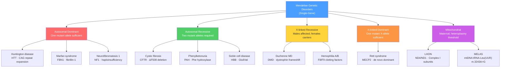

# 🧬 Mendelian Genetic Disorders

> [!abstract] TL;DR
> Mendelian genetic disorders are diseases caused by a pathogenic variant in a single gene that follows a predictable inheritance mode — autosomal dominant/recessive, X-linked, or mitochondrial; understanding the mode unlocks carrier risk calculation via Hardy-Weinberg, population screening, molecular diagnosis by sequencing, and increasingly precise targeted therapy, making single-gene diseases both the best-understood and most therapeutically tractable class of human genetic disease.

---

## Intuition — analogy FIRST

Think of each gene as a two-copy blueprint kept in a factory library. In most autosomal recessive disorders (cystic fibrosis, PKU), the factory needs both copies of the blueprint ruined before production fails — one intact copy is sufficient to run the process at full output. In autosomal dominant disorders (Huntington disease, Marfan syndrome), one corrupted blueprint is enough to cripple the factory, either because half-output is below the viability threshold, or because the corrupted copy actively poisons the machinery assembled from the good copy.

X-linked disorders add a twist: biological males carry only a single X-chromosome copy of each X-linked blueprint and have no backup, so one faulty copy immediately compromises them. Biological females carry two X-copies; the second compensates — which is why Duchenne muscular dystrophy devastates boys while carrier sisters remain largely healthy. Mitochondrial diseases break all the nuclear-inheritance rules entirely: mitochondria are maternally inherited organelles with their own genome, passed from mother to every child through egg cytoplasm, with hundreds of copies per cell whose mutant-to-normal ratio drifts unpredictably through development.

---

## How It Works



---

## Key Concepts

### Secondary Level

**Five Inheritance Modes and Their Pedigree Signatures**

| Mode | Risk per pregnancy (carrier × carrier) | Pedigree hallmarks | Skips generations? | Sex bias? |
|------|----------------------------------------|-------------------|-------------------|-----------|
| Autosomal dominant (AD) | 50% if one parent affected | Vertical; every generation affected | No | No |
| Autosomal recessive (AR) | 25% if both parents carriers | Horizontal; unaffected carrier parents; consanguinity raises risk | Yes (carrier generations) | No |
| X-linked recessive (XLR) | 50% of sons affected; 50% of daughters carriers | No father-to-son transmission; maternal uncle often affected | Yes (carrier females) | Males severely affected |
| X-linked dominant (XLD) | 50% daughters + 50% sons of affected mother | Males often lethal; affected father passes to all daughters, no sons | No | Females predominate |
| Mitochondrial | All children of affected mother at risk | Maternal lineage only; no paternal transmission; variable severity | No | Neither sex spared |

**Autosomal Dominant Disorders**

*Huntington disease (HD)* is caused by a CAG trinucleotide repeat expansion in exon 1 of *HTT* (chromosome 4p16.3). Normal alleles carry fewer than 36 repeats; 36–39 repeats cause reduced-penetrance disease; 40 or more repeats are fully penetrant. The resulting polyglutamine tract in huntingtin protein misfolds and aggregates in striatal neurons, causing progressive chorea, cognitive decline, and psychiatric features with onset typically between ages 30 and 50. **Anticipation** — repeat expansion in successive generations, particularly through paternal transmission — causes progressively earlier onset in children than parents. Each additional CAG repeat above 40 reduces onset age by roughly 3–4 years.

*Marfan syndrome* arises from pathogenic variants in *FBN1* (fibrillin-1; chromosome 15q21.1). Fibrillin-1 is a glycoprotein scaffold that sequesters TGF-β in the extracellular matrix. Its deficiency releases excess TGF-β signaling, causing connective tissue weakness across multiple organ systems: upward lens dislocation (ectopia lentis), aortic root dilation with risk of fatal dissection, and a tall, slender habitus with arm span exceeding height. Approximately 25% of cases arise de novo, so a negative family history does not exclude the diagnosis.

*Neurofibromatosis type 1 (NF1)* results from heterozygous loss-of-function variants in *NF1* (neurofibromin; chromosome 17q11.2), a Ras-GTPase-activating protein that normally suppresses Ras signaling. Haploinsufficiency — a single functional copy of *NF1* is insufficient to maintain Ras suppression in neural crest derivatives — is the mechanism. NF1 is the textbook example of extreme **variable expressivity**: among *NF1* heterozygotes, the phenotype ranges from six café-au-lait spots to hundreds of disfiguring neurofibromas, optic gliomas, and severe learning disabilities, even within the same family carrying the same variant.

**Autosomal Recessive Disorders**

*Cystic fibrosis (CF)* is the most common severe AR disorder in Northern European populations (prevalence ~1/2,500; carrier frequency ~1/25). Biallelic pathogenic variants in *CFTR* (chromosome 7q31.2) impair chloride channel function at epithelial surfaces. The ΔF508 variant — an in-frame deletion of phenylalanine 508 — causes CFTR protein misfolding and proteasomal degradation before it reaches the apical membrane, abolishing chloride and bicarbonate secretion. The resulting viscous mucus obstructs the lungs (progressive bronchiectasis), pancreatic ducts (exocrine insufficiency), and vas deferens (male infertility). Genotype determines modulator eligibility: the triple combination elexacaftor/tezacaftor/ivacaftor (Trikafta) corrects ΔF508 misfolding and is approved for patients with at least one ΔF508 allele, covering ~90% of CF patients.

*Phenylketonuria (PKU)* is caused by pathogenic variants in *PAH* (phenylalanine hydroxylase; chromosome 12q23.2). Impaired conversion of phenylalanine to tyrosine allows phenylalanine to accumulate to neurotoxic levels in the developing brain, causing severe intellectual disability if untreated. PKU is the original newborn screening success story: detected by bacterial inhibition assay (Guthrie test) since the 1960s and now by tandem mass spectrometry (MS/MS), dietary phenylalanine restriction initiated before day 10 of life produces completely normal neurodevelopmental outcomes. The same genetic defect, if undetected and untreated, causes profound disability — demonstrating how environmental intervention can fully compensate for a metabolic genetic defect.

*Sickle cell disease (SCD)* arises from homozygosity (or compound heterozygosity with other beta-globin variants) for the *HBB* p.Glu6Val substitution (rs334), chromosome 11p15.4. The valine substitution causes deoxygenated HbS to polymerize into rigid fibers, distorting red blood cells into sickle shapes that occlude capillaries, triggering vaso-occlusive crises, acute chest syndrome, stroke, and progressive organ damage. The HbS allele reaches carrier frequencies of 8–10% in West African populations because heterozygotes (HbA/HbS) have significantly increased survival against *Plasmodium falciparum* malaria — the canonical example of balancing selection maintaining an otherwise lethal recessive allele at appreciable population frequency.

**X-linked Disorders**

*Duchenne muscular dystrophy (DMD)* is caused by out-of-frame deletions, duplications, or nonsense variants in *DMD* (chromosome Xp21.2 — the largest gene in the human genome at 2.4 Mb) that abolish dystrophin protein. Dystrophin mechanically links the actin cytoskeleton to the extracellular matrix; its absence exposes muscle fibers to contraction-induced membrane rupture. Boys show progressive proximal muscle weakness, loss of ambulation by age 12, and cardiomyopathy; the median survival has improved to the mid-30s with respiratory support. *Becker MD* — the allelic milder disorder — results from in-frame variants that produce a shorter, partially functional dystrophin. Carrier females are clinically unaffected in ~90% of cases but carry a 10% risk of cardiomyopathy due to skewed X-inactivation.

*Hemophilia A and B* are XLR coagulation disorders caused by pathogenic variants in *F8* (factor VIII; Xq28) and *F9* (factor IX; Xq27.1), respectively. Clinical severity correlates tightly with residual clotting factor activity: severe (<1% of normal) causes spontaneous joint bleeds; moderate (1–5%) causes bleeds after minor trauma; mild (5–40%) causes bleeds only after surgery or major trauma. Queen Victoria carried the hemophilia B allele — spread through European royal families across three generations — constituting the most historically documented pedigree of X-linked disease.

*Rett syndrome* is an X-linked dominant (XLD) neurodevelopmental disorder caused predominantly by de novo pathogenic variants in *MECP2* (methyl-CpG binding protein 2; Xq28), an epigenetic regulator essential for neuronal gene expression. Almost all cases are female; males with a single affected X allele typically die perinatally from neonatal encephalopathy. Girls develop normally for 6–18 months, then undergo a regression: loss of purposeful hand use, stereotyped hand-wringing, loss of speech, and intellectual disability. It represents a case where XLD lethal in males produces an apparently female-only disorder.

**Mitochondrial Disorders**

Mitochondria carry a ~16.6 kb circular genome (mtDNA) encoding 13 oxidative phosphorylation subunits, 22 tRNAs, and 2 rRNAs. Each cell contains hundreds to thousands of mtDNA copies; a cell may harbor both mutant and wild-type molecules simultaneously (**heteroplasmy**). Clinical disease generally manifests only when the proportion of mutant mtDNA exceeds a **threshold** — typically 60–80% — in energy-demanding tissues such as retina, cochlear hair cells, cardiac and skeletal muscle, and neurons.

*Leber hereditary optic neuropathy (LHON)* is caused by homoplasmic or near-homoplasmic point mutations in mitochondrial Complex I subunit genes: m.11778G>A in *ND4* accounts for ~70% of cases globally, with m.3460G>A (*ND1*) and m.14484T>C (*ND6*) accounting for most of the remainder. Despite maternal inheritance (all children of an affected mother receive the mutation), males are affected three to five times more frequently than females — penetrance modifier loci on the X chromosome are implicated. Presentation is bilateral, sequential, painless central vision loss in young adults. Lenadogene nolparvovec (AAV2-ND4 intravitreal injection) is approved in the European Union for acute LHON caused by m.11778G>A, representing the first approved mitochondrial gene therapy.

*MELAS* (Mitochondrial Encephalomyopathy, Lactic Acidosis, and Stroke-like episodes) is most commonly caused by m.3243A>G in *MT-TL1* (mitochondrial tRNA-Leu(UUR)), impairing mitochondrial protein synthesis globally. Heteroplasmy levels vary substantially between tissues and between family members. Clinical severity — from asymptomatic to severe multi-organ disease — correlates with mutant mtDNA load, but the relationship is nonlinear and tissue-specific, making prognosis from genotype alone unreliable.

---

### Undergraduate Level

**Hardy-Weinberg and Carrier Frequency in Disease Screening**

For an autosomal recessive disorder at Hardy-Weinberg equilibrium with birth prevalence $q^2$:

$$q = \sqrt{q^2} \qquad p = 1 - q \qquad \text{carrier frequency} = 2pq \approx 2q \;\text{ (when } q \ll 1\text{)}$$

For rare alleles, the ratio of carriers to affected individuals approximates $2/q$:

| Disease | Prevalence ($q^2$) | $q$ | Carrier frequency ($2pq$) | Carriers per affected |
|---------|--------------------|-----|--------------------------|----------------------|
| Cystic fibrosis (N. European) | 1/2,500 | 0.0200 | ~1/25 | ~50 |
| PKU (global average) | 1/10,000 | 0.0100 | ~1/50 | ~100 |
| Sickle cell disease (W. African) | 1/400 | 0.0500 | ~1/10 | ~20 |
| MCAD deficiency | 1/17,000 | 0.0077 | ~1/65 | ~130 |
| Gaucher disease type 1 (Ashkenazi) | 1/850 | 0.0343 | ~1/15 | ~43 |

The practical implication: for CF at 1/2,500 prevalence, roughly 1 in 25 individuals is a carrier. Population screening programs that test only symptomatic individuals miss the vast majority of the genetic risk; carrier screening of all adults in the target population is necessary for meaningful public health impact.

**Founder Effects and the Ashkenazi Jewish Disease Panel**

When a population is established by a small group of founders, alleles present by chance in those founders drift to elevated frequency over subsequent generations regardless of fitness effect. The Ashkenazi Jewish population, estimated to derive from roughly 600–1,000 medieval Central European founders, shows dramatic enrichment of several AR diseases:

| Disease | Gene | Ashkenazi carrier frequency | General population frequency |
|---------|------|-----------------------------|------------------------------|
| Gaucher disease type 1 | *GBA* | 1/14 | 1/200 |
| Tay-Sachs disease | *HEXA* | 1/30 | 1/300 |
| Canavan disease | *ASPA* | 1/40 | 1/300 |
| Familial dysautonomia | *IKBKAP* | 1/30 | very rare |
| Niemann-Pick disease A/B | *SMPD1* | 1/75 | 1/800 |

Standard Ashkenazi Jewish carrier panels now simultaneously test for 19 conditions using NGS. Critically, the elevated carrier frequencies in this population cannot be estimated from general Hardy-Weinberg population prevalence data; they must be derived directly from empirical carrier screening studies, because the founder effect has shifted $q$ far above the genome-wide background mutation-selection equilibrium.

**Variable Expressivity and Incomplete Penetrance in Clinical Practice**

**Variable expressivity** describes the range in phenotypic severity among individuals who all carry the same pathogenic genotype. NF1 is the paradigm: *NF1* heterozygotes in the same family with the same variant may show only six café-au-lait spots (the minimum diagnostic criterion) or may develop hundreds of neurofibromas, plexiform neurofibromas, optic gliomas, and severe neurocognitive deficits. Modifier alleles at other loci, stochastic developmental events, and somatic second-hit mutations in *NF1* collectively shape severity.

**Incomplete penetrance** means that a fraction of individuals with a pathogenic genotype show no clinical features. *BRCA1* p.(Cys61Gly): ~72% lifetime breast cancer risk by age 80. A carrier who reaches age 80 without cancer does not mean the variant is benign — she simply sits in the 28% non-penetrant fraction for that phenotype. Clinical implication: a negative clinical examination does not rule out the disease-associated genotype; a positive genotype does not predict a certain clinical course. Both facts must be communicated in genetic counseling.

The two concepts are independent: a gene can be 60% penetrant (40% of carriers show no phenotype) yet highly variable in expressivity among the 60% who are penetrant.

**Newborn Screening by Tandem Mass Spectrometry**

Tandem mass spectrometry (MS/MS) of dried blood spots measures amino acids and acylcarnitines simultaneously from a single ~3 mm punch of filter paper. The Recommended Uniform Screening Panel (RUSP) in the US currently lists 35 primary conditions detectable by MS/MS or other methods on the same card:

| Condition | Biomarker (MS/MS) | Intervention |
|-----------|------------------|-------------|
| PKU | Elevated phenylalanine | Low-Phe diet; sapropterin (BH4 cofactor) |
| MCAD deficiency | Elevated C8 octanoylcarnitine | Avoid prolonged fasting; carnitine supplementation |
| Galactosemia (classic) | Elevated galactose-1-phosphate | Lactose-free diet from day 1 |
| Maple syrup urine disease | Elevated branched-chain amino acids | Restricted leucine/isoleucine/valine diet |
| Homocystinuria | Elevated methionine | Vitamin B6; methionine restriction |

Early detection before first clinical symptoms is essential — the same PKU genotype produces normal neurodevelopment if treated by day 10 but severe intellectual disability if untreated beyond week three of life.

**Molecular Diagnosis — From Targeted Testing to Genome Sequencing**

| Technology | Scope | Diagnostic yield | Typical indication |
|------------|-------|-----------------|-------------------|
| Sanger sequencing | Single gene or exon | ~100% for known variant confirmation | Targeted confirmation; family testing after proband found |
| Targeted NGS panel | 10–500 clinically relevant genes | 25–50% | Phenotypically guided (epilepsy panel, cardiomyopathy panel, etc.) |
| Clinical exome sequencing (CES) | ~22,000 protein-coding genes | 25–40% | Panel-negative; non-specific/broad phenotype |
| Clinical genome sequencing (CGS) | Entire genome including non-coding | 35–45% (+5–10% vs exome) | Exome-negative; suspected structural variants; non-coding regulatory pathology |

**OMIM (Online Mendelian Inheritance in Man)** at omim.org is the authoritative curated database linking human genes to Mendelian phenotypes. Each entry has a unique 6-digit MIM number: #219700 = cystic fibrosis (the # prefix means molecularly confirmed phenotype); *602421 = *CFTR* gene entry. The inheritance prefix precedes the MIM number: # = confirmed gene-disease relationship; + = known sequence with confirmed phenotype; % = phenotype with unknown molecular basis; ^ = obsolete entry. OMIM is the starting point for any clinical genetics literature search.

**Genotype-Phenotype Correlation**

The relationship between specific alleles and clinical outcome varies enormously by gene and disorder:

- *CFTR*: Six functional classes of variants predict clinical severity and therapeutic eligibility. Class II misfolding variants (ΔF508) respond to elexacaftor/tezacaftor/ivacaftor. Class III gating variants (G551D) respond to ivacaftor alone. Class IV conductance-reducing variants often cause only CBAVD (congenital bilateral absence of the vas deferens) in males — minimal pulmonary disease. Genotype now directly determines which modulator therapy a patient qualifies for.
- *HTT*: 36–39 repeats = reduced penetrance (some carriers unaffected into old age); 40–59 repeats = full penetrance adult onset; 60+ repeats = juvenile onset; 80+ repeats = childhood onset. Somatic repeat instability in the striatum — the CAG tract expands further in non-dividing neurons — may contribute to selective striatal vulnerability.
- *PAH*: Over 1,000 documented disease alleles; compound heterozygotes are common. The combination of two null alleles produces classic PKU; combinations with mild hypomorphic alleles produce mild hyperphenylalaninemia (HPA) requiring only monitoring without treatment.

---

### Graduate Level

**Mosaicism — Somatic and Germline**

Mosaicism arises when a mutation occurs post-zygotically, producing an individual with two or more genetically distinct cell populations. Two clinically important subtypes exist:

**Somatic mosaicism**: mutation in a somatic progenitor cell; the individual has a mixture of normal and mutant cells throughout the body. The clinical severity depends on the proportion of mutant cells (mutant burden) and the tissue distribution at the time of mutation. Low-level mosaicism (<10%) is frequently missed by standard Sanger sequencing but is detectable by deep NGS at 200–500× coverage with sensitive variant-calling algorithms. Tuberous sclerosis (*TSC1/TSC2*) and *MECP2* disorders may present with atypical, attenuated phenotypes when somatic mosaic.

**Germline mosaicism**: mutation present in a fraction of germline cells but absent from (or below the detection threshold in) somatic tissue. This explains apparent de novo AD disorders recurring in siblings of two phenotypically normal, genotype-negative parents — osteogenesis imperfecta (*COL1A1/COL1A2*), NF1, achondroplasia (*FGFR3* p.Gly380Arg), and DMD. Empirical recurrence risk for a second affected child is 2–7% even when parental testing is negative, because standard testing of parental blood does not exclude low-level germline mosaicism. Deep sequencing (500×+) of parental DNA at the child's variant site is the current best practice to estimate the mosaicism burden.

**X-inactivation and Manifesting Carriers**

In females, one X chromosome in each somatic cell is transcriptionally silenced by spreading of H3K27me3 chromatin marks initiated from the *XIST* locus on the inactive X. Under normal random X-inactivation, ~50% of cells express the maternal X and ~50% the paternal X. Carrier females for XLR disorders are typically unaffected because cells expressing the wild-type X compensate for cells expressing the mutant X.

**Skewed X-inactivation** — where the X-inactivation ratio deviates beyond 80:20 — can cause carrier females to manifest disease. A DMD carrier female with >90% X-inactivation favoring the mutant X develops cardiomyopathy despite an apparently favorable genotype from pedigree inspection alone. The mechanism is clonal expansion of a cell that happened to inactivate the wild-type X early in embryogenesis. X-inactivation skewing is heritable and can show familial aggregation, complicating counseling.

**Mitochondrial Genetics — Bottleneck, Heteroplasmy Drift, and the Threshold Effect**

At cell division, mtDNA molecules segregate randomly between daughter cells (**mitotic segregation**). The **mtDNA bottleneck during oogenesis** drastically reduces the effective copy number of mtDNA in primary oocytes to as few as 1–10 molecules before re-amplification. This bottleneck means a mother heteroplasmic at 30% mutant load can produce eggs spanning 0–100% mutant, generating dramatically different mutant burdens — and therefore different clinical severities — among her children. Genetic counseling for MELAS, MERRF, and other heteroplasmic disorders cannot offer meaningful quantitative risk estimates for severity; the standard message is that outcome is unpredictable across siblings.

The **threshold effect** is tissue-specific: post-mitotic, energy-demanding tissues (retinal ganglion cells, cardiac myocytes, cochlear hair cells, large neurons) reach their biochemical failure point at lower mutant burdens than proliferating tissues. Clinical disease typically manifests when mutant load exceeds 60–80% in these tissues. Consequently, the mutant load measured in blood or chorionic villus cells during prenatal diagnosis may underestimate (or overestimate) the burden in fetal neural and cardiac tissue, making prenatal prediction of severity unreliable for heteroplasmic mtDNA disorders.

**CRISPR and Emerging Therapeutics — Mechanism Dictates Strategy**

Understanding whether a Mendelian disorder results from loss-of-function, gain-of-function, or dominant-negative mechanisms directly determines the therapeutic approach:

| Mechanism | Strategy | Example |
|-----------|---------|---------|
| Loss-of-function | Gene addition (AAV vector) or mRNA therapy | Spinal muscular atrophy: onasemnogene abeparvovec (AAV9-*SMN1*); FDA-approved 2019 |
| Gain-of-function (toxic protein) | Allele-specific silencing — ASO, siRNA, or allele-specific CRISPR | Huntington disease: ASO targeting *HTT* mRNA; Phase III |
| Gain-of-function (constitutive signaling) | Small-molecule inhibition of hyperactivated pathway | FGFR3 G380R (achondroplasia): vosoritide (C-type natriuretic peptide analogue); FDA-approved 2021 |
| Dominant-negative | Silencing of mutant allele while preserving wild-type | *COL1A1* dominant-negative OI: investigational ASOs |
| Recessive — metabolic enzyme | Substrate reduction or enzyme replacement therapy | Gaucher type 1: imiglucerase (recombinant GBA); FDA-approved 1994 |
| Recessive — misfolded channel | Small-molecule corrector/potentiator | CF ΔF508: elexacaftor/tezacaftor/ivacaftor (Trikafta); FDA-approved 2019 |
| Beta-globin chain imbalance | CRISPR reactivation of fetal hemoglobin (*BCL11A* enhancer silencing) | Sickle cell + beta-thalassemia: exagamglogene autotemcel (Casgevy); FDA-approved 2023 |

The Casgevy approval is a landmark: CRISPR-Cas9 editing of hematopoietic stem cells ex vivo, then autologous transplantation, producing durable fetal hemoglobin re-expression that compensates for the HBB defect — the first approved CRISPR medicine.

---

## Python Demo

```python
# pip install numpy matplotlib
import numpy as np
import matplotlib.pyplot as plt

# ── Part 1: Hardy-Weinberg carrier frequency table ────────────────────────────
diseases = [
    ("Cystic fibrosis (N. European)",   1 / 2_500),
    ("PKU (global average)",            1 / 10_000),
    ("Sickle cell disease (W. African)",1 / 400),
    ("MCAD deficiency",                 1 / 17_000),
    ("Gaucher type 1 (Ashkenazi)",      1 / 850),
    ("Tay-Sachs (Ashkenazi)",           1 / 3_500),
]

print(f"{'Disease':<40} {'Prevalence':>11} {'q':>9} {'2pq (carrier)':>14} {'Carrier:Affected':>18}")
print("-" * 97)
for name, prev in diseases:
    q = np.sqrt(prev)
    p = 1.0 - q
    carrier = 2 * p * q
    ratio = carrier / prev
    print(f"{name:<40} {prev:>11.6f} {q:>9.5f} {carrier:>14.5f} {ratio:>17.0f}:1")

# ── Part 2: Carrier frequency and carriers-per-affected curves ────────────────
q_arr       = np.logspace(-4, -0.3, 600)
prev_arr    = q_arr ** 2
carrier_arr = 2 * (1 - q_arr) * q_arr
ratio_arr   = carrier_arr / prev_arr          # approaches 2/q for small q

fig, (ax1, ax2) = plt.subplots(1, 2, figsize=(13, 5))

ax1.loglog(prev_arr, carrier_arr, color="steelblue", linewidth=2.5)
markers = [
    ("CF",          1 / 2_500,  "crimson"),
    ("PKU",         1 / 10_000, "darkorange"),
    ("Sickle cell", 1 / 400,    "green"),
]
for label, prev, color in markers:
    q   = np.sqrt(prev)
    cf  = 2 * (1 - q) * q
    ax1.scatter(prev, cf, s=90, color=color, zorder=5)
    ax1.annotate(label, (prev, cf), textcoords="offset points",
                 xytext=(6, 0), fontsize=9, color=color)
ax1.set_xlabel("Disease prevalence  (q²)")
ax1.set_ylabel("Carrier frequency  (2pq)")
ax1.set_title("Carrier Frequency vs. Disease Prevalence\n(Autosomal Recessive, Hardy-Weinberg)")
ax1.grid(True, which="both", alpha=0.25)

ax2.semilogx(prev_arr, ratio_arr, color="darkorange", linewidth=2.5)
ax2.set_xlabel("Disease prevalence  (q²)")
ax2.set_ylabel("Carriers per affected individual  (2pq / q²)")
ax2.set_title("Why Carriers Vastly Outnumber Affected\n(approaches 2/q for rare alleles)")
ax2.grid(True, which="both", alpha=0.25)
for label, prev, color in markers:
    q = np.sqrt(prev)
    r = (2 * (1 - q) * q) / prev
    ax2.scatter(prev, r, s=90, color=color, zorder=5)
    ax2.annotate(f"{label}\n~{r:.0f}:1", (prev, r),
                 textcoords="offset points", xytext=(6, 4), fontsize=8, color=color)

plt.tight_layout()
plt.savefig("hw_carrier_frequency.png", dpi=150)
plt.show()

# ── Part 3: X-linked recessive pedigree risk simulation ──────────────────────
# Carrier mother (Xd X) × unaffected father (X Y)
# Each child: sex is random (50:50); if male, affected iff receives Xd (p=0.5)
rng = np.random.default_rng(0)
n_families        = 50_000
n_children        = 4

sex      = rng.integers(0, 2, size=(n_families, n_children))   # 0=female, 1=male
gets_xd  = rng.random(size=(n_families, n_children)) < 0.5     # receives mutant X
affected = (sex == 1) & gets_xd                                  # male + Xd

print("\n── X-linked recessive: carrier mother x unaffected father ──")
print(f"Expected  fraction of ALL children affected : {0.25:.4f}")
print(f"Simulated fraction of ALL children affected : {affected.mean():.4f}")
affected_sons = affected[sex == 1]
print(f"Expected  fraction of SONS affected         : {0.5:.4f}")
print(f"Simulated fraction of SONS affected         : {affected_sons.mean():.4f}")
daughter_carriers = (sex == 0) & gets_xd
print(f"Expected  fraction of DAUGHTERS who carry   : {0.5:.4f}")
print(f"Simulated fraction of DAUGHTERS who carry   : {daughter_carriers[sex == 0].mean():.4f}")
```

Expected output (truncated):
```
Disease                                  Prevalence         q   2pq (carrier) Carrier:Affected
─────────────────────────────────────────────────────────────────────────────────────────────
Cystic fibrosis (N. European)            0.000400   0.02000        0.03920             98:1
PKU (global average)                     0.000100   0.01000        0.01980            198:1
Sickle cell disease (W. African)         0.002500   0.05000        0.09500             38:1
...
── X-linked recessive: carrier mother x unaffected father ──
Expected  fraction of ALL children affected : 0.2500
Simulated fraction of ALL children affected : 0.2498
Expected  fraction of SONS affected         : 0.5000
Simulated fraction of SONS affected         : 0.4997
```

---

## Real-World Applications

**1. CFTR Modulator Therapy — Genotype Determines Prescription**

Vertex Pharmaceuticals developed a series of small molecules targeting specific CFTR molecular defects. Ivacaftor (VX-770) potentiates CFTR channel gating for Class III variants (G551D); lumacaftor/tezacaftor correct Class II misfolding; elexacaftor (VX-445) stabilizes the NBD1–MSD2 interface disrupted by ΔF508. The triple combination Trikafta approved in 2019 improved FEV1 by ~14 percentage points in Phase III trials and is now standard of care for ~90% of CF patients. This is molecular-mechanism-driven precision medicine: the specific protein-folding defect encoded by the genotype determines which corrector/potentiator combination is clinically effective.

**2. Casgevy — The First Approved CRISPR Medicine for a Mendelian Disorder**

Exagamglogene autotemcel (Casgevy), approved by the FDA in December 2023, treats sickle cell disease and transfusion-dependent beta-thalassemia. The approach: CRISPR-Cas9 editing of the patient's own hematopoietic stem cells ex vivo disrupts a transcriptional repressor (*BCL11A*) that normally silences fetal hemoglobin (HbF) expression after birth. Re-infused edited cells produce HbF, which compensates for the defective HbS/HbB — without correcting the causal mutation. In pivotal trials, 29/29 SCD patients had no vaso-occlusive crises over a median 19-month follow-up. This exemplifies gene-therapy strategy matching disease mechanism: since restoring fetal hemoglobin rescues function regardless of the HBB genotype, *BCL11A* suppression is a valid bypass strategy.

**3. Newborn Screening for MCAD — Treating a Disease Before It Existed**

Medium-chain acyl-CoA dehydrogenase (MCAD) deficiency (*ACADM*; AR) was essentially unknown as a clinical entity before tandem MS/MS newborn screening was implemented — because the only presentation was sudden metabolic decompensation (hypoketotic hypoglycemia) during a febrile illness or prolonged fasting, often presenting as sudden unexpected infant death. Once NBS identified the characteristic C8 acylcarnitine elevation, the entire clinical burden evaporated: the intervention is simply advising caregivers to avoid prolonged fasting and to present immediately during illnesses. A disease that killed 1 in 17,000 children is now effectively preventable at near-zero cost per diagnosed case.

**4. The Diagnostic Odyssey Ended by Trio Exome — STAT3 Gain-of-Function**

A child with recurrent infections, eczema, markedly elevated serum IgE, and skeletal abnormalities had been evaluated for seven years without diagnosis. Trio clinical exome sequencing identified a de novo missense variant in *STAT3* not present in either parent. Cross-referencing OMIM entry #147060 (Hyper-IgE syndrome, AD, STAT3 gain-of-function) confirmed the diagnosis. The variant's mechanism — constitutive STAT3 phosphorylation disrupting TH17 cell differentiation — explained the susceptibility to staphylococcal infections specifically, guided antimicrobial prophylaxis, and enabled OMIM-directed management. Average diagnostic odyssey for rare Mendelian disease before exome sequencing: 5–7 years; after trio exome in an appropriate clinical context: weeks.

---

## Common Pitfalls

- **Assuming de novo means non-heritable** — de novo AD variants (achondroplasia, NF1, severe *COL1A1* OI) can recur in siblings due to germline mosaicism in a phenotypically normal parent. Empirical recurrence risk is quoted as ~1–7% even when standard parental testing is negative; parents must be counseled that a negative blood test does not provide a zero recurrence guarantee.

- **Conflating penetrance and expressivity** — NF1 is ~100% penetrant (virtually all *NF1* heterozygotes show some feature by age 20) yet shows extreme variable expressivity. Telling a parent "NF1 is highly penetrant so your child will definitely have it significantly" confuses binary disease presence (penetrance) with severity (expressivity). These must be communicated as separate, independent dimensions.

- **Applying HWE carrier frequency formula to founder-effect populations** — using $2\sqrt{q^2}$ to estimate Ashkenazi carrier frequency for Tay-Sachs or Gaucher disease gives wildly wrong answers because the founder effect has elevated $q$ far above the global mutation-selection equilibrium. Empirical carrier-screening data from the target population are required.

- **Missing X-linked dominant when only affected females are observed** — XLD disorders where hemizygous males die in utero or in early infancy (Rett syndrome, incontinentia pigmenti) can superficially resemble AD inheritance in a pedigree of surviving individuals. Failure to consider XLD leads to incorrect recurrence counseling: the risk to daughters of affected mothers is 50%, but the risk to sons appears lower only because affected male embryos are lost.

- **Quoting a penetrance percentage for heteroplasmic mtDNA disorders** — mitochondrial disease penetrance is a continuous function of mutant heteroplasmy level and tissue distribution, not a fixed probability. Telling a MELAS mother "50% of your children will be affected" misrepresents the biology entirely; the correct message is that mutant load in offspring is unpredictable due to the mtDNA bottleneck, and that severity cannot be predicted from prenatal testing.

- **Missing low-level mosaicism with Sanger sequencing** — Sanger sequencing reliably detects variants present in ≥20% of cells; variants at 5–15% mosaicism (clinically significant for mosaic NF2, PTEN hamartoma tumour syndrome, etc.) require deep NGS. A negative Sanger result in a suspected mosaic does not exclude the variant; the question must specify what level of mosaicism is clinically relevant and whether the sequencing technique has sufficient sensitivity.

---

## Related Concepts

- [[Mendelian_Inheritance_Patterns]] — the foundational rules of segregation and dominance that define the five inheritance modes applied here to human disease; pedigree analysis, Punnett squares, and penetrance concepts are established there
- [[Population_Genetics_and_Hardy_Weinberg]] — Hardy-Weinberg equilibrium is the mathematical framework for converting disease prevalence to carrier frequency; founder effects manifest as HWE deviations detectable in population genomic data
- [[Extensions_to_Mendelian_Genetics]] — modifier genes, variable expressivity, incomplete penetrance, genomic imprinting, trinucleotide repeat anticipation, and maternal inheritance are the molecular mechanisms that cause deviations from clean Mendelian predictions in clinical pedigrees
- [[DNA_Repair_and_Mutation]] — pathogenic variants originate as replication errors and unrepaired DNA lesions; the de novo mutation rate (~1–2 × 10⁻⁸ per bp per generation) determines the steady-state frequency of new dominant alleles and the background rate of de novo disorders
- [[DNA_Sequencing_Technologies]] — Sanger, targeted NGS panels, clinical exome, and genome sequencing are the diagnostic tools that convert a clinical suspicion of a Mendelian disorder into a molecular diagnosis
- [[Bayesian_Statistics]] — Bayesian updating converts prior carrier probability (from HWE or pedigree position) to posterior probability after observing phenotypes in relatives; it is the mathematical backbone of genetic counseling risk tables before molecular testing
- [[Neurodevelopmental_Disorders]] — Rett syndrome (*MECP2*), fragile X (*FMR1*), and Angelman syndrome (*UBE3A*) are Mendelian causes of neurodevelopmental disability; this note provides their molecular inheritance frameworks
- [[Biological_Basis_of_Behavior]] — PKU, Huntington disease, and other neurological Mendelian disorders are direct demonstrations of how single-gene defects produce profound cognitive and behavioral phenotypes, grounding behavioral genetics in molecular mechanism
- [[_MOC_Human_and_Medical_Genetics|↑ Human and Medical Genetics MOC]] — section entry point and concept map for all human and medical genetics notes

---

## Review Questions

1. **Secondary:** A couple of Northern European ancestry has one child with cystic fibrosis. Assuming Hardy-Weinberg equilibrium and a population carrier frequency of 1/25, what is the probability that the next child will be affected? The father then reveals that his brother also has CF — does this change the calculation? Explain why or why not, and identify which Hardy-Weinberg assumption is relevant.

2. **Undergraduate:** A woman's maternal uncle was affected with Duchenne muscular dystrophy; her mother is an obligate carrier. The woman is phenotypically unaffected. (a) Using Bayes' theorem, calculate her posterior probability of being a carrier given that she has two unaffected sons (no molecular testing). (b) She then undergoes molecular testing and is confirmed to carry the familial DMD deletion. What is the probability that her next son will be affected? Her next daughter will be an affected individual? A carrier daughter? (c) Why does skewed X-inactivation complicate her carrier status with respect to cardiomyopathy risk, even though she is clinically unaffected in terms of skeletal muscle?

3. **Graduate:** A woman with MELAS (m.3243A>G heteroplasmy at 40% in blood leukocytes) wants to understand her children's risk. (a) Explain why quoting "40% risk of MELAS severity equal to the mother" is biologically unsound, with specific reference to the mtDNA bottleneck mechanism. (b) Why is chorionic villus sampling an unreliable predictor of disease severity in the fetus, and what are the practical prenatal counseling implications? (c) Contrast the recurrence risk framework for MELAS with that for an autosomal recessive disorder with the same overall population prevalence — identify three specific dimensions in which they differ.

---

## Sources

- Strachan T. & Read A.P. — *Human Molecular Genetics*, 5th ed., CRC Press (2018)
- Nussbaum R.L., McInnes R.R. & Willard H.F. — *Thompson & Thompson Genetics in Medicine*, 8th ed., Elsevier (2016)
- Online Mendelian Inheritance in Man (OMIM) — https://omim.org
- GeneReviews at NCBI — https://www.ncbi.nlm.nih.gov/books/NBK1116/
- Richards S. et al. (2015) — "Standards and guidelines for the interpretation of sequence variants" — *Genetics in Medicine* 17: 405–424 — https://doi.org/10.1038/gim.2015.30
- Frangoul H. et al. (2021) — "CRISPR-Cas9 Gene Editing for Sickle Cell Disease and β-Thalassemia" — *NEJM* 384: 252–260 — https://doi.org/10.1056/NEJMoa2031054

---

#Genetics #HumanGenetics #GeneticDisorders #MendelianDisease
