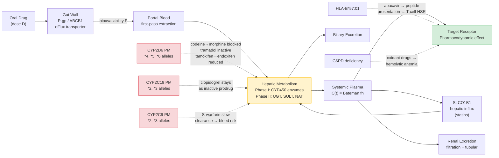

# Pharmacogenomics and Personalized Medicine

> [!abstract] TL;DR
> Pharmacogenomics decodes how inherited genetic variation — single nucleotide polymorphisms in drug-metabolizing enzymes, transporters, and drug targets — determines whether the same pill produces the right response, no response, or life-threatening toxicity in different patients, enabling clinicians to choose the right drug at the right dose before the first prescription is written.

---

## Intuition — analogy FIRST

**Analogy:** Imagine a city's road network where every drug molecule is a delivery van. Each van must travel from the dockyard (gut absorption) through a toll-plaza (liver enzymes) to reach its destination warehouse (target receptor). Some people have a wide, fast toll-plaza — the van is processed instantly and moves on. Others have a narrow toll-booth with only one lane open: the van sits in queue, building up to a traffic jam (drug accumulation and toxicity). A rare few have a turbo-charged eight-lane plaza that liquidates everything before it even reaches the warehouse (no drug effect at all). The road network is the same drug — only the infrastructure differs, and that infrastructure is written in the genome.

Pharmacogenomics maps which variants alter the dimensions of those toll-booths (metabolizing enzymes), the gates on the warehouse (drug targets), and the bridges that bypass the main road (transporters). Armed with that map, a clinician can pre-select the van type and route before sending it into the city.

---

## How It Works

### The ADME Framework

Every drug traverses four pharmacokinetic phases collectively called **ADME**:

1. **Absorption** — Oral drugs dissolve in the gut lumen and cross the intestinal epithelium. Bioavailability F (fraction reaching systemic circulation) is reduced by efflux transporters such as P-glycoprotein (encoded by *ABCB1*) that pump drug back into the lumen, and by first-pass metabolism in the gut wall.
2. **Distribution** — Drug distributes from plasma into tissues. Volume of distribution Vd (litres) describes how extensively: a small Vd means drug stays in plasma; a large Vd means it partitions into fat or muscle. Highly lipophilic drugs (e.g. amiodarone) have Vd > 5,000 L; warfarin has Vd ≈ 8–15 L.
3. **Metabolism** — The liver is the principal metabolic organ. **Phase I reactions** (catalysed by CYP450 enzymes) introduce or expose a polar group (hydroxylation, oxidation, N-demethylation) — often converting lipophilic drugs to more polar metabolites. **Phase II reactions** (UGTs, SULTs, NATs, GSTs) conjugate the metabolite with glucuronide, sulfate, acetyl, or glutathione — dramatically increasing water-solubility and preparing the drug for excretion. Genetic variants in Phase I enzymes (particularly CYP2D6, CYP2C19, CYP2C9) account for the majority of PGx-actionable drug responses.
4. **Excretion** — Polar metabolites are excreted renally or via bile. Renal clearance depends on glomerular filtration rate plus tubular secretion/reabsorption. SLCO1B1 (hepatic uptake transporter) controls how much statin enters the liver for metabolism before reaching systemic circulation.

### One-Compartment Oral Pharmacokinetic Model

For a single oral dose under a one-compartment open model, plasma concentration follows the **Bateman function**:

$$C(t) = \frac{F \cdot D \cdot k_a}{V_d (k_a - k_e)} \left( e^{-k_e t} - e^{-k_a t} \right)$$

| Parameter | Symbol | Typical unit | Meaning |
|-----------|--------|-------------|---------|
| Bioavailability | F | dimensionless (0–1) | Fraction of dose reaching systemic circulation |
| Dose | D | mg | Amount administered |
| Absorption rate constant | ka | h⁻¹ | Rate of uptake from gut |
| Elimination rate constant | ke | h⁻¹ | Rate of removal from plasma |
| Volume of distribution | Vd | L | Apparent dilution volume |

Half-life: $t_{1/2} = \ln(2)/k_e$. A CYP2C9 poor metabolizer has a longer t₁/₂ for warfarin because ke is reduced — the drug accumulates to higher peak concentrations for the same dose.

### Metabolizer Phenotype Classification

CPIC (Clinical Pharmacogenomics Implementation Consortium) classifies patients into four phenotypes based on their diplotype (pair of alleles at a gene locus):

| Phenotype | Abbreviation | Functional allele count | Consequence |
|-----------|-------------|------------------------|-------------|
| Poor Metabolizer | PM | 0 functional alleles | Severely reduced or absent enzyme activity |
| Intermediate Metabolizer | IM | 1 functional allele | Decreased enzyme activity |
| Normal (Extensive) Metabolizer | NM/EM | 2 functional alleles | Standard enzyme activity |
| Ultra-Rapid Metabolizer | UM | > 2 functional alleles | Greatly increased activity (gene duplication) |

### ADME with Pharmacogenomics — Where Variants Act



---

## Key Concepts

### Secondary Level

**Why does the same drug work differently in different people?** About 95% of people who take a standard aspirin dose have adequate pain relief; the same dose does almost nothing for a significant minority. The reason is not willpower or psychology — it is that the enzyme responsible for converting the drug into its active form, or for breaking it down before it accumulates, has different activity depending on which version of the gene encoding that enzyme a person carries.

**A variant is not always harmful.** A single nucleotide polymorphism (SNP) in a metabolizing enzyme gene can be: (a) a loss-of-function allele that slows drug clearance so the drug stays at therapeutic levels longer — useful at lower doses; or (b) a gain-of-function allele from gene duplication that clears the drug so fast it never reaches therapeutic levels. Neither variant is intrinsically "bad" — context (which drug, which dose) determines clinical impact.

**Pharmacogenomics is not the same as pharmacogenetics.** Pharmacogenetics historically focused on single-gene effects (e.g., G6PD deficiency and hemolysis). Pharmacogenomics examines the whole genome — including polygenic contributions, transcriptomics, and the tumor genome in oncology — to guide therapy.

### Undergraduate Level

#### CYP2D6 — Codeine, Tramadol, Tamoxifen

CYP2D6 (chromosome 22q13.2) metabolises approximately 25% of all clinically used drugs. It is the most polymorphic CYP gene, with > 150 named alleles.

**Codeine and tramadol:** Both are prodrugs requiring CYP2D6 for activation. Codeine → morphine (analgesia); tramadol → O-desmethyltramadol (10× higher opioid affinity). In **poor metabolizers** (PM, ~7–10% of Europeans carrying *2 × *4, *5 null alleles): codeine produces negligible analgesia; tramadol is ineffective. In **ultra-rapid metabolizers** (UM, ~1–2% Europeans; up to 28% in some Ethiopian populations, due to *1xN or *2xN duplications): codeine is rapidly converted to morphine → potentially fatal respiratory depression. In 2013 the FDA issued a black-box warning against codeine use in children after a post-tonsillectomy fatality in a CYP2D6 UM child.

**Tamoxifen (breast cancer):** The active metabolite endoxifen (100× higher affinity for ER than tamoxifen) requires two CYP2D6 oxidation steps. PM patients produce markedly less endoxifen → reduced disease-free survival in hormone-receptor-positive breast cancer. This is among the clearest PGx-efficacy associations.

#### CYP2C19 — Clopidogrel

CYP2C19 (chromosome 10q24) activates clopidogrel from prodrug to its active thiol metabolite, which irreversibly inhibits the platelet ADP receptor P2Y₁₂, preventing arterial thrombosis after coronary stenting. PMs (*2 and *3 alleles: ~30% of East Asians, ~2% of Europeans) cannot generate the active metabolite → inadequate platelet inhibition → 3.58× higher risk of major adverse cardiovascular events (MACE) and stent thrombosis compared to NMs (TRITON-TIMI 38 substudy). The FDA added a **black-box warning** to clopidogrel's label in 2010. CPIC recommends either increasing the clopidogrel dose or switching to prasugrel/ticagrelor (not CYP2C19-dependent) for PMs.

Conversely, the *17 gain-of-function allele (ultra-rapid metabolizers, ~18% of Europeans) produces excess active metabolite and is associated with increased bleeding risk.

#### CYP2C9 — Warfarin

Warfarin (Coumadin) is the archetypal narrow therapeutic index drug. It inhibits VKORC1, reducing vitamin K recycling and thus the carboxylation of coagulation factors II, VII, IX, X. The therapeutic INR window (2.0–3.0) sits uncomfortably close to sub-therapeutic (thrombosis) and supratherapeutic (haemorrhage) zones. Dosing difficulty reflects three PGx contributors:

1. **CYP2C9** — metabolises S-warfarin (the active enantiomer, ~4× more potent than R-warfarin). *2 allele (R144C, ~35% residual activity), *3 allele (I359L, ~5% residual activity) reduce clearance → dose requirement drops by ~30% (*2/*2) to ~70% (*3/*3).
2. **VKORC1** — the drug target. The −1639G>A promoter SNP reduces VKORC1 expression → less target protein → more warfarin effect for the same concentration → lower dose needed.
3. **CYP4F2** — V433M variant reduces vitamin K₁ oxidase activity → less vitamin K recycled → warfarin sensitivity.

The **IWPC dosing algorithm** integrating CYP2C9 + VKORC1 + CYP4F2 genotypes with clinical variables (age, height, weight, indication) reduces time-outside-therapeutic-range and major bleeding compared to empirical dosing, particularly for patients requiring very low (<21 mg/week) or very high (>49 mg/week) doses.

#### CYP3A4/5 — Tacrolimus, Statins

CYP3A4 (chromosome 7q22) is the most abundantly expressed CYP in adult human liver and gut wall and metabolises approximately 50% of all drugs. CYP3A5 is expressed only in individuals carrying at least one functional *1 allele (~40% of African-Americans vs ~10% of Europeans). Tacrolimus (calcineurin inhibitor, post-transplant immunosuppression) is a CYP3A5 substrate; CYP3A5 expressers require ~50% higher doses to achieve target trough concentrations. CPIC grade A recommendation: genotype for CYP3A5 before starting tacrolimus.

#### TPMT — Thiopurine Chemotherapy

TPMT (thiopurine S-methyltransferase) inactivates 6-mercaptopurine (6-MP), azathioprine, and 6-thioguanine — drugs used in acute lymphoblastic leukaemia (ALL) and inflammatory bowel disease. When TPMT activity is absent (PM, *2, *3A, *3C alleles, ~0.3% of the population), thiopurines are channelled entirely toward toxic thioguanine nucleotides (TGNs) → life-threatening myelosuppression. Genotype-guided dose reduction (often 10-fold) eliminates this toxicity without sacrificing efficacy. PMs receive 6–10% of the standard dose. Standard of care in paediatric ALL since the early 2000s.

> Note: *NUDT15* (R139C, common in East and Southeast Asians) is now co-tested because it independently predicts TGN toxicity via a different pathway (degrading the active metabolite TGTP).

#### DPYD — Fluoropyrimidine Chemotherapy

DPYD encodes dihydropyrimidine dehydrogenase (DPD), which inactivates 5-fluorouracil (5-FU) and capecitabine in the liver. 5-FU is among the most widely used cancer drugs (colorectal, breast, head-and-neck cancers). DPYD*2A (IVS14+1G>A, exon 14 skipping, ~1% of Europeans) produces a truncated, non-functional protein → 5-FU accumulates → severe grade 3–4 toxicity: mucositis, diarrhoea, hand-foot syndrome, cerebellar toxicity, bone marrow suppression — fatality rate ~0.5% of treated patients. CPIC: heterozygous *2A → 50% dose reduction; homozygous or compound heterozygous → avoid fluoropyrimidines entirely.

#### SLCO1B1 — Statin-Induced Myopathy

SLCO1B1 encodes OATP1B1, the primary hepatic organic anion uptake transporter that moves statins from portal blood into hepatocytes for CYP3A4/CYP2C9 metabolism. The *5 haplotype (521T>C, V174A, ~15% of Europeans) reduces transporter function → statins accumulate in plasma instead of being cleared hepatically → muscle drug exposure increases → myopathy and rhabdomyolysis. For simvastatin 80 mg, the risk of myopathy is ~18% in *5/*5 homozygotes vs 0.6% in *1/*1. CPIC recommends limiting simvastatin dose or switching to rosuvastatin (less affected) for *5 carriers.

#### G6PD — Oxidant Drug Haemolysis

G6PD deficiency (X-linked, affecting ~400 million people globally, predominantly in malaria-endemic regions — sub-Saharan Africa, Mediterranean, Southeast Asia) impairs the hexose monophosphate shunt → reduced NADPH → reduced glutathione → red blood cells cannot neutralise reactive oxygen species. Oxidant drugs (primaquine, dapsone, rasburicase, nitrofurantoin, some sulfonamides) precipitate acute intravascular haemolytic anaemia. Severity varies with variant: African A- variant (G202A) produces moderate haemolysis; Mediterranean variant (C563T) produces severe haemolysis. FDA requires G6PD testing before rasburicase (urate oxidase, used in tumour lysis syndrome) — which generates H₂O₂ as a by-product.

#### HLA-B*57:01 — Abacavir Hypersensitivity

HLA-B*57:01, a class I HLA allele present in ~6% of Europeans (1% of Africans), is the strongest known pharmacogenomic association. Abacavir (nucleoside reverse transcriptase inhibitor, HIV treatment) binds non-covalently in the peptide-binding groove of HLA-B*57:01, altering the repertoire of self-peptides presented to CD8⁺ cytotoxic T cells. The resulting T-cell response causes a systemic hypersensitivity reaction (HSR): fever, rash, malaise, respiratory and GI symptoms within 6 weeks of starting therapy. Untreated or re-challenged, it can be fatal. Prospective HLA-B*57:01 screening before abacavir (implemented in the UK in 2008) reduced HSR from ~8% to near 0%. This is the first pharmacogenomics test routinely mandated globally.

Other critical HLA–drug associations:
- **HLA-B*15:02** (Southeast Asians) → carbamazepine-induced Stevens-Johnson syndrome / toxic epidermal necrolysis (SJS/TEN)
- **HLA-B*58:01** (Han Chinese) → allopurinol-induced SJS/TEN
- **HLA-DRB1*07:01** → lapatinib-induced hepatotoxicity

### Graduate Level

#### Precision Oncology and the Tumour Genome

Germline PGx focuses on inherited variants. Somatic PGx addresses mutations acquired in the tumour that create targetable dependencies:

| Somatic alteration | Drug class | Example |
|---------------------|-----------|---------|
| *EGFR* exon 19 del / L858R | EGFR TKIs (erlotinib, osimertinib) | NSCLC |
| *EGFR* T790M (acquired resistance) | Osimertinib (3rd gen) | NSCLC after 1st-gen TKI |
| *BCR-ABL1* fusion | Imatinib / dasatinib | CML |
| *BRCA1/2* loss-of-function | PARP inhibitors (olaparib) | Breast, ovarian, prostate |
| HER2 amplification | Trastuzumab, pertuzumab | Breast, gastric |
| MSI-high / dMMR | Pembrolizumab (PD-1 blockade) | Any solid tumour (tissue-agnostic) |
| *BRAF* V600E | Vemurafenib + cobimetinib | Melanoma |
| *KRAS* G12C | Sotorasib, adagrasib | NSCLC, CRC |

**Liquid biopsy** (cell-free DNA / circulating tumour DNA, ctDNA) enables non-invasive tumour genotyping from a blood draw. ctDNA is shed from tumour cells into the bloodstream, detectable at allele fractions as low as 0.01% using digital PCR or ultra-deep next-generation sequencing with error-correction (duplex sequencing, CAPP-seq). Clinical utility:
- Select therapy before tissue biopsy is feasible (brain metastases)
- Monitor for acquired resistance mutations without re-biopsy
- Minimal residual disease (MRD) detection post-surgery
- Treatment response assessment (ctDNA falls rapidly with effective therapy)

#### Polygenic Risk Scores for Drug Response

Single-gene PGx variants explain only part of inter-individual variability in drug response for complex phenotypes (antidepressant response, statin efficacy, immunosuppressant dosing). GWAS have identified hundreds of loci with small effects, each explainable by common variants (MAF > 1%). A **polygenic risk score (PRS)** aggregates the effects of thousands of SNPs:

$$\text{PRS}_i = \sum_{j=1}^{M} \hat{\beta}_j \cdot G_{ij}$$

where $\hat{\beta}_j$ is the GWAS-estimated effect size for SNP j and $G_{ij}$ is the allele dosage (0, 1, or 2) for individual i. PRS-based warfarin dosing augments the IWPC algorithm. For antidepressants, PRS from major depressive disorder GWAS modestly predict differential response to SSRIs vs SNRIs, but effect sizes remain small (R² < 5% for most drug-response phenotypes), and clinical translation is limited by ancestry-dependent portability of PRS weights.

#### PharmGKB, CPIC, and FDA PGx Labelling

**PharmGKB** (Stanford/UCSF) is the primary PGx knowledge repository: curates variant–drug–outcome associations, annotates clinical evidence levels (1A = highest), and maintains pathway diagrams. It cross-links to variant databases (dbSNP, ClinVar) and trial data.

**CPIC** (Clinical Pharmacogenomics Implementation Consortium): publishes peer-reviewed prescribing guidelines, updated continuously. Grade A recommendations (strong evidence, change prescribing) currently exist for: CYP2D6/codeine, CYP2C19/clopidogrel, TPMT+NUDT15/thiopurines, DPYD/fluoropyrimidines, CYP2C9+VKORC1/warfarin, HLA-B*57:01/abacavir, SLCO1B1/statins, G6PD/rasburicase.

**FDA PGx labelling**: > 350 FDA-approved drugs carry pharmacogenomic information in their label; approximately 40 require testing before use (contraindicated in certain genotypes) and the rest carry "informative" or "actionable" language. The FDA Table of Pharmacogenomic Biomarkers (updated quarterly) is the regulatory reference.

The **DPWG** (Dutch Pharmacogenetics Working Group) provides a European parallel set of dose-adjustment guidelines and is integrated into Dutch hospital pharmacy informatics systems — the most operationalised national PGx infrastructure in the world.

#### Pharmacokinetic–Pharmacodynamic (PK/PD) Modelling

Steady-state plasma concentration at repeated dosing (dose D every interval τ hours, clearance CL = ke·Vd):

$$C_{ss} = \frac{F \cdot D}{\tau \cdot CL}$$

The **therapeutic window** is bounded by the minimum effective concentration (MEC, below which the drug is subtherapeutic) and the minimum toxic concentration (MTC, above which adverse effects emerge). A PGx variant that halves CL doubles Css at fixed dosing — potentially crossing the toxicity threshold. Dose adjustment to restore Css to the therapeutic window is the core clinical action.

---

## Python Demo

```python
# pip install numpy matplotlib scipy
import numpy as np
import matplotlib.pyplot as plt

# ── Bateman function: one-compartment oral PK model ───────────────────────────
def bateman(t, F, D, ka, ke, Vd):
    """
    Plasma concentration for oral one-compartment PK model.
    C(t) = F*D*ka / (Vd*(ka-ke)) * (exp(-ke*t) - exp(-ka*t))
    F:  bioavailability (0-1)
    D:  dose (mg)
    ka: absorption rate constant (h^-1)
    ke: elimination rate constant (h^-1)
    Vd: volume of distribution (L)
    """
    if abs(ka - ke) < 1e-10:
        return F * D * ka / Vd * t * np.exp(-ke * t)
    return (F * D * ka) / (Vd * (ka - ke)) * (np.exp(-ke * t) - np.exp(-ka * t))

# ── CYP2C9 genotype parameters for S-warfarin ────────────────────────────────
# Half-lives reflect published ranges:
#   *1/*1 (Normal EM) ~35 h | *1/*3 (IM) ~55 h | *3/*3 (PM) ~90 h
# Source: Rettie & Jones 2005; IWPC PGx dosing studies
F  = 0.97   # warfarin bioavailability
ka = 0.9    # absorption rate constant h^-1 (Tmax ~45 min)
Vd = 10.0   # volume of distribution L (0.14 L/kg * 70 kg, approx)

# Approximate therapeutic plasma window for S-warfarin
# INR 2.0-3.0 ≈ roughly 0.5-2.0 mg/L (illustrative; real INR-concentration
# relationship is patient-specific; used here for visual clarity only)
C_min_therapeutic = 0.5   # mg/L
C_max_therapeutic = 2.0   # mg/L

genotypes = {
    '*1/*1  Normal EM':         {'t_half': 35, 'dose_std': 5.0, 'dose_guided': 5.0,  'color': '#1a73e8'},
    '*1/*3  Intermediate IM':   {'t_half': 55, 'dose_std': 5.0, 'dose_guided': 3.0,  'color': '#f9a825'},
    '*3/*3  Poor Metabolizer':  {'t_half': 90, 'dose_std': 5.0, 'dose_guided': 1.5,  'color': '#d93025'},
}

for geno, p in genotypes.items():
    p['ke'] = np.log(2) / p['t_half']

t = np.linspace(0.01, 220, 2000)   # 0–220 hours post-dose

fig, axes = plt.subplots(1, 2, figsize=(13, 5))
fig.suptitle("Warfarin Pharmacokinetics — CYP2C9 Genotype Effect", fontsize=12, fontweight='bold')

# ── Panel 1: Standard 5 mg dose for all genotypes ────────────────────────────
ax = axes[0]
for geno, p in genotypes.items():
    C = bateman(t, F, p['dose_std'], ka, p['ke'], Vd)
    ax.plot(t, C, label=f"{geno}  (t½={p['t_half']} h)", color=p['color'], linewidth=2)

ax.axhspan(C_min_therapeutic, C_max_therapeutic,
           alpha=0.10, color='#34a853', label='Therapeutic window')
ax.axhline(C_min_therapeutic, color='#34a853', linestyle='--', linewidth=0.8, alpha=0.7)
ax.axhline(C_max_therapeutic, color='#ea4335', linestyle='--', linewidth=0.8, alpha=0.7,
           label='Toxicity boundary')
ax.set_xlabel('Time post-dose (hours)')
ax.set_ylabel('Plasma S-warfarin (mg/L)')
ax.set_title('Standard 5 mg dose — all genotypes\n(same dose, different plasma exposure)')
ax.legend(fontsize=8, framealpha=0.8)
ax.set_xlim(0, 220)
ax.grid(alpha=0.25)

# ── Panel 2: Genotype-guided dosing ──────────────────────────────────────────
ax2 = axes[1]
for geno, p in genotypes.items():
    C = bateman(t, F, p['dose_guided'], ka, p['ke'], Vd)
    ax2.plot(t, C, label=f"{geno}  ({p['dose_guided']} mg)", color=p['color'], linewidth=2)

ax2.axhspan(C_min_therapeutic, C_max_therapeutic,
            alpha=0.10, color='#34a853', label='Therapeutic window')
ax2.axhline(C_min_therapeutic, color='#34a853', linestyle='--', linewidth=0.8, alpha=0.7)
ax2.axhline(C_max_therapeutic, color='#ea4335', linestyle='--', linewidth=0.8, alpha=0.7)
ax2.set_xlabel('Time post-dose (hours)')
ax2.set_ylabel('Plasma S-warfarin (mg/L)')
ax2.set_title('Genotype-guided dosing\n(adjusted dose keeps all genotypes in window)')
ax2.legend(fontsize=8, framealpha=0.8)
ax2.set_xlim(0, 220)
ax2.grid(alpha=0.25)

plt.tight_layout()
plt.show()

# ── Summary table ─────────────────────────────────────────────────────────────
print("Warfarin PK Summary by CYP2C9 Genotype")
print("=" * 60)
for geno, p in genotypes.items():
    C_std    = bateman(t, F, 5.0,            ka, p['ke'], Vd)
    C_guided = bateman(t, F, p['dose_guided'], ka, p['ke'], Vd)
    print(f"\n{geno}")
    print(f"  t½ = {p['t_half']} h | ke = {p['ke']:.4f} h⁻¹")
    print(f"  Standard 5 mg → Cmax = {C_std.max():.2f} mg/L at t = {t[C_std.argmax()]:.0f} h")
    print(f"  Guided  {p['dose_guided']} mg → Cmax = {C_guided.max():.2f} mg/L at t = {t[C_guided.argmax()]:.0f} h")
```

---

## Real-World Applications

**Clopidogrel + CYP2C19 in cardiology:** Hospitals in South Korea and Taiwan (where CYP2C19 PM frequency is ~30%) now routinely perform point-of-care PGx testing before percutaneous coronary intervention (PCI). Patients identified as PMs are switched to ticagrelor at catheterisation lab check-in, with subsequent reductions in 30-day MACE rates reported in the TAILOR-PCI trial.

**Abacavir + HLA-B*57:01 in HIV:** The UK NHS implemented universal pre-prescription HLA-B*57:01 screening in 2007–2008. Over the subsequent five years, the reported incidence of abacavir hypersensitivity reaction dropped from 8% to under 0.3% — among the clearest public health successes attributable to a single PGx intervention. The test costs < £50 and prevented an estimated £7.4 million per year in hospitalisation costs.

**DPYD pre-screening for 5-FU chemotherapy:** A 2020 Dutch national registry study (n = 1,799 patients with DPYD*2A or c.2846A>T) demonstrated that upfront DPYD genotyping with dose reduction reduced severe toxicity from 73% to 28% in heterozygous carriers, without compromising anti-tumour response. The European Medicines Agency (EMA) mandated DPYD testing before fluoropyrimidine therapy in Europe from 2020.

**Osimertinib in NSCLC (liquid biopsy):** After initial EGFR TKI therapy (erlotinib/gefitinib), ~60% of NSCLC patients develop EGFR T790M resistance mutations. A blood-based ctDNA assay (Roche cobas EGFR Mutation Test v2, FDA-approved) identifies T790M in plasma, enabling osimertinib prescribing without requiring a repeat tissue biopsy — critical when re-biopsy is clinically risky. The AURA3 trial validated osimertinib as superior to platinum-based chemotherapy in T790M-positive, plasma-confirmed resistance.

**Preemptive PGx in health systems:** Vanderbilt University Medical Center's PREDICT programme and the Mayo Clinic RIGHT Protocol have deposited PGx results for thousands of patients into their electronic health records, triggering clinical decision support alerts at the moment of prescribing — before the patient ever receives a drug. Multi-gene panels (CYP2D6, CYP2C19, CYP2C9, TPMT, DPYD, SLCO1B1) are run once, stored in the record, and queried by pharmacists for the patient's lifetime.

---

## Common Pitfalls

- **Phenotype ≠ genotype directly** — Environmental factors confound the genotype-to-phenotype translation. Fluoxetine and paroxetine are potent CYP2D6 inhibitors; a CYP2D6 normal metabolizer taking either drug will function as a phenotypic poor metabolizer. This "drug-induced phenoconversion" must be checked before making PGx-based dose decisions.

- **Copy-number variation in CYP2D6** — CYP2D6 has the highest structural variation of any CYP gene: entire gene deletions (*5), duplications (×2 to ×13 copies), and hybrid alleles (*10, *36/41) are common. Standard SNP arrays and even NGS without copy-number normalisation can misclassify UM patients as NM and vice versa.

- **Ethnicity-specific allele frequency tables** — CYP2C19 *2 (PM) allele frequency is ~15–30% in East Asians but only ~2% in Europeans; CYP2D6 *17 (reduced function) is common in Africans but absent in Europeans. Applying European-derived CPIC allele tables to a South Asian patient can systematically misclassify metabolizer phenotype.

- **HLA testing specificity** — HLA-B*57:01 has close to 100% negative predictive value (no allele = no HSR) but only ~50% positive predictive value (many carriers never develop HSR). Testing prevents all HSR but also unnecessarily withholds abacavir from some patients — this is considered acceptable given the severity of HSR.

- **Somatic vs germline confusion in oncology** — Tumour-derived BRCA2 mutations detected in ctDNA can be somatic (in the tumour only) or germline (in every cell of the body). The clinical implications differ enormously: germline BRCA2 carriers have elevated lifetime risk for other BRCA-related cancers and may benefit from prophylactic surgery, while somatic BRCA2 in the tumour predicts PARP inhibitor response but carries no hereditary cancer risk.

- **Polypharmacy and interaction masking** — In elderly patients on 10+ medications, a PGx variant effect may be dominated by drug–drug interactions (e.g., CYP3A4 inhibition by clarithromycin) that dwarf genotype effects. PGx is most informative in patients without strong co-inhibitors or co-inducers of the same CYP.

- **PRS portability across ancestries** — Polygenic risk scores trained on European GWAS cohorts show substantially reduced predictive accuracy in African, South Asian, or East Asian populations (r² can drop >60%), because LD patterns differ and causal variants may differ in frequency or effect size. Applying a European-trained PRS for antidepressant response to a non-European patient may be actively misleading.

---

## Related Concepts

- [[Chemical_Kinetics]] — the rate laws, transition states, and activation energies underlying CYP450 enzyme catalysis; the Bateman function is a direct application of first-order kinetic rate equations
- [[Enzyme_Kinetics_and_Catalysis]] — Michaelis-Menten kinetics, Km, Vmax, and inhibition patterns; CYP450 enzyme variants alter kcat and/or Km, directly translating into metabolizer phenotype classification
- [[Membranes_and_Cell_Signaling]] — drug targets (GPCRs, ion channels, kinases) are membrane-associated; the pharmacodynamic side of PGx involves variants in these targets as well as in the metabolizing enzymes
- [[Psychopharmacology_and_Drug_Mechanisms]] — CNS drugs (antidepressants, antipsychotics, opioids) are disproportionately represented in PGx because many are CYP2D6 and CYP2C19 substrates; clinical psychiatric pharmacogenomics is a direct extension
- [[DNA_Repair_and_Mutation]] — somatic mutations acquired in tumour cells (BRCA1/2, EGFR, KRAS) are the substrate for precision oncology PGx; the biology of how those mutations arise and are maintained connects directly to therapy selection
- [[Population_Genetics_and_Hardy_Weinberg]] — PGx allele frequencies vary enormously by ancestry; understanding Hardy-Weinberg equilibrium, drift, and selection explains why CYP2D6*17 is common in Africans and CYP2C19*2 is common in East Asians
- [[Quantitative_Genetics_and_Heritability]] — the heritability of drug response phenotypes motivates PRS-based approaches; twin studies estimated ~60–90% heritability for antidepressant non-response and statin myopathy
- [[DNA_Sequencing_Technologies]] — clinical PGx panels use amplicon sequencing, whole-exome sequencing, and microarrays (Illumina DMET Plus, Thermo AmpliChip) to genotype variant alleles; liquid biopsy for ctDNA relies on ultra-deep sequencing with error correction
- [[Protein_Structure_and_Function]] — CYP450 enzymes are haem-containing monooxygenases with a conserved fold; variant amino acid substitutions (CYP2C9 I359L in *3) alter active-site geometry and substrate binding — a structural explanation for the kinetic change
- [[_MOC_Human_and_Medical_Genetics|↑ Human and Medical Genetics MOC]] — section entry point and concept map for all human and medical genetics notes

---

## Review Questions

**Secondary level:**
1. Two patients with cancer are prescribed the same dose of 5-fluorouracil. One develops life-threatening diarrhoea and bone marrow failure after the first cycle; the other tolerates the drug well. Using the toll-plaza analogy, explain what might differ between the two patients at the molecular level and what pre-prescription test could have prevented the serious adverse event.

**Undergraduate level:**
2. A CYP2C19 poor metabolizer is prescribed clopidogrel after a coronary stent procedure. Six months later, she develops in-stent thrombosis. (a) At each step of clopidogrel's mechanism of action, identify exactly where the CYP2C19*2 genotype causes failure. (b) Using the Bateman function, predict whether plasma clopidogrel prodrug concentrations would be higher or lower than in a normal metabolizer given the same dose, and why. (c) Name two alternative antiplatelet agents that are not affected by CYP2C19 genotype.

**Graduate level:**
3. You are designing a precision oncology programme for a hospital in Singapore, where CYP2C19 PM frequency is 28%, DPYD deficiency is underdiagnosed, and HLA-B*15:02 (carbamazepine SJS risk) frequency is 6.5%. (a) Design a three-panel preemptive PGx test prioritised by clinical impact, cost per avoided event, and drug volume. (b) A lung cancer patient's ctDNA assay detects EGFR L858R (allele fraction 3.2%) and T790M (allele fraction 0.4%). Discuss whether the T790M detection is analytically reliable and clinically actionable, and what follow-up testing you would recommend. (c) The patient is also taking carbamazepine for post-thoracotomy neuropathic pain. Explain the HLA-B*15:02 implication and whether germline or somatic testing should be ordered.

---

## Sources

- [Relling, M.V. & Evans, W.E. (2015). "Pharmacogenomics in the clinic." *Nature* 526, 343–350.](https://doi.org/10.1038/nature15817)
- [CPIC Guidelines — Clinical Pharmacogenomics Implementation Consortium](https://cpicpgx.org/guidelines/)
- [PharmGKB Pharmacogenomics Knowledge Base](https://www.pharmgkb.org/)
- [Caudle, K.E. et al. (2016). "Standardizing terms for clinical pharmacogenomic test results: consensus terms from the Clinical Pharmacogenomics Implementation Consortium." *Genetics in Medicine* 19, 215–223.](https://doi.org/10.1038/gim.2016.87)
- [Rettie, A.E. & Jones, J.P. (2005). "Clinical and toxicological relevance of CYP2C9: drug–drug interactions and pharmacogenetics." *Annual Review of Pharmacology and Toxicology* 45, 477–494.](https://doi.org/10.1146/annurev.pharmtox.45.120403.095821)
- [Mallal, S. et al. (2008). "HLA-B*5701 screening for hypersensitivity to abacavir." *NEJM* 358, 568–579.](https://doi.org/10.1056/NEJMoa0706135)
- [IWPC Consortium (2009). "Estimation of the warfarin dose with clinical and pharmacogenetic data." *NEJM* 360, 753–764.](https://doi.org/10.1056/NEJMoa0809329)
- [Deenen, M.J. et al. (2016). "Upfront genotyping of DPYD*2A to individualize fluoropyrimidine therapy." *Journal of Clinical Oncology* 34, 227–234.](https://doi.org/10.1200/JCO.2015.63.1325)
- [FDA Table of Pharmacogenomic Biomarkers in Drug Labeling](https://www.fda.gov/drugs/science-and-research-drugs/table-pharmacogenomic-biomarkers-drug-labeling)

---

#Genetics #HumanGenetics #Pharmacogenomics #PrecisionMedicine
