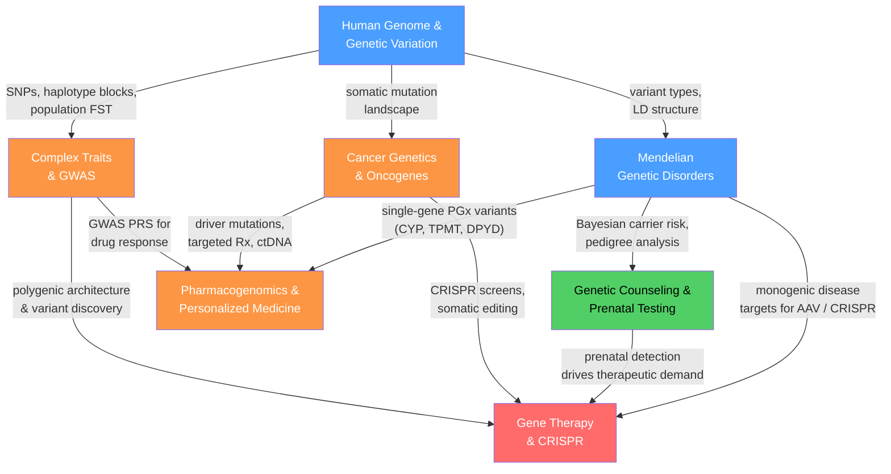

# Human and Medical Genetics — Section Map of Content

> [!abstract] Section Overview
> Section 05 applies the molecular and population genetics foundations from earlier sections directly to the human organism — cataloguing the 3.1-billion-base-pair genome and its 4–5 million per-person variants, dissecting single-gene and complex disease architectures, and translating that knowledge into clinical tools: carrier screening, prenatal diagnosis, pharmacogenomic dosing, targeted cancer therapy, and CRISPR-based cures.
> This section is the translational bridge of the vault: it receives upstream theory (molecular mechanisms, inheritance patterns, population statistics) and converts it into the diagnostics, risk calculations, and therapeutic interventions that reach patients.

---

## Section Concept Map

*(Blue = foundational entry points, Green = clinical intermediate, Orange = translational intermediate–advanced, Red = most advanced therapeutic endpoint; arrows = "provides substrate for" or "leads to")*

---

## Notes in This Section

| Note | Core Topic | Level |
|------|-----------|-------|
| [[Human_Genome_and_Genetic_Variation]] | HGP, T2T pangenome, SNPs/CNVs/SVs, LD, FST, ACMG variant classification | Beginner–Graduate |
| [[Mendelian_Genetic_Disorders]] | AD/AR/XLR/XLD/Mitochondrial inheritance modes, CF, SCD, HD, DMD, HWE carrier math, newborn screening | Beginner–Graduate |
| [[Genetic_Counseling_and_Prenatal_Testing]] | Bayesian pedigree risk, NIPT cfDNA, CVS, amniocentesis, CMA, PGT-A/M/SR, VUS management | Intermediate |
| [[Cancer_Genetics_and_Oncogenes]] | Somatic clonal evolution, oncogenes, TSGs, two-hit hypothesis, mutational signatures, hallmarks, immunotherapy | Intermediate–Advanced |
| [[Complex_Trait_Genetics_and_GWAS]] | GWAS pipeline, imputation, fine-mapping, PRS (LDpred2/PRS-CS), missing heritability, PRS equity | Intermediate–Advanced |
| [[Pharmacogenomics_and_Personalized_Medicine]] | ADME, CYP2D6/2C19/2C9, TPMT, DPYD, SLCO1B1, HLA-B*57:01, precision oncology, PRS for drug response | Intermediate–Advanced |
| [[Gene_Therapy_and_CRISPR]] | AAV vectors, CRISPR-Cas9, base editors, prime editors, Casgevy, off-target detection, germline ethics | Advanced |

---

## Learning Paths

### Path 1 — Clinical Genetics
*Recommended for learners approaching from a clinical or pre-medical perspective; builds from genome fundamentals through single-gene disease to therapeutic intervention.*

1. [[Human_Genome_and_Genetic_Variation]] — establishes the genome architecture, variant taxonomy, and LD framework that all subsequent clinical reasoning requires
2. [[Mendelian_Genetic_Disorders]] — five inheritance modes and the diseases that exemplify each; Hardy-Weinberg carrier math; genotype-phenotype correlations
3. [[Genetic_Counseling_and_Prenatal_Testing]] — Bayesian risk quantification, NIPT/CVS/amniocentesis, PGT; the clinical translation of Mendelian risk to reproductive decisions
4. [[Cancer_Genetics_and_Oncogenes]] — somatic genetics as a distinct discipline; oncogene activation, TSG two-hit model, targeted therapy, liquid biopsy
5. [[Gene_Therapy_and_CRISPR]] — the therapeutic endpoint: AAV gene addition, CRISPR-Cas9 editing, Casgevy approval, ethical boundaries

### Path 2 — Genomic Medicine
*Recommended for learners with a computational or statistical genetics background; moves from population-scale variant discovery to personalized treatment prediction.*

1. [[Human_Genome_and_Genetic_Variation]] — the variant landscape, LD, imputation logic, and ACMG classification that underpin all downstream analyses
2. [[Complex_Trait_Genetics_and_GWAS]] — genome-wide association pipelines, PRS construction (C+T, LDpred2, PRS-CS), fine-mapping, missing heritability
3. [[Pharmacogenomics_and_Personalized_Medicine]] — single-gene PGx (CYP enzymes, HLA) converging with GWAS-derived PRS to guide drug selection and dosing
4. [[Gene_Therapy_and_CRISPR]] — how variant-level knowledge feeds design of sgRNAs, base-editor windows, and delivery strategies for curative editing

---

## Cross-Section Connections

- **Links to S01 (Molecular Genetics):** [[DNA_Repair_and_Mutation]] supplies the mechanistic origin of pathogenic variants and the synthetic-lethality logic behind PARP inhibitors in cancer; [[Gene_Regulation_and_Epigenetics]] and [[Chromatin_Structure_and_Nucleosomes]] explain IDH1/2 oncometabolite-driven CIMP and EZH2 gain-of-function; [[Transcription_and_RNA_Processing]] underpins CRISPRi/CRISPRa and AAV transgene expression; [[DNA_Structure_and_Replication]] explains Cas9 R-loop formation and PAM recognition
- **Links to S02 (Classical and Population Genetics):** [[Mendelian_Inheritance_Patterns]] provides the foundational segregation ratios used as priors in genetic counseling Bayesian tables; [[Population_Genetics_and_Hardy_Weinberg]] is the engine for carrier frequency estimates, FST between populations, and GWAS stratification correction; [[Extensions_to_Mendelian_Genetics]] covers penetrance, anticipation, and imprinting that modify clinical pedigree interpretation; [[Quantitative_Genetics_and_Heritability]] provides the heritability decomposition framework that motivates GWAS and PRS; [[Linkage_Mapping_and_Recombination]] explains LD block structure and recombination hotspots that determine tagging-SNP efficiency
- **Links to S03 (Genomics and Bioinformatics):** [[DNA_Sequencing_Technologies]] is the enabling technology for HGP, T2T, WGS, ctDNA liquid biopsy, and clinical exome/genome sequencing; [[Genome_Organization_and_Structure]] explains repetitive element distribution and why 50% of the genome is transposable-element-derived; [[Functional_Genomics_and_Transcriptomics]] provides eQTL/sQTL data from GTEx that connects GWAS loci to effector genes; [[Bioinformatics_Algorithms_and_Sequence_Analysis]] underlies variant calling pipelines (GATK, BWA-MEM, DeepVariant) used in clinical sequencing
- **Links to S04 (Developmental and Epigenetic Genetics):** [[Epigenetics_DNA_Methylation_and_Histone_Modification]] explains CpG island promoter methylation as a TSG "second hit" in cancer, the CpG island methylator phenotype (CIMP), and BCL11A erythroid enhancer CRISPR targeting in Casgevy; [[Genomic_Imprinting_and_X_Inactivation]] connects directly to manifesting carrier females in X-linked disorders and skewed X-inactivation risk; [[Aging_and_Genome_Instability]] overlaps with somatic mutation accumulation and cancer progression

---

## Cross-Vault Links

- [[Neurodegenerative_Diseases]] (Neuroscience) — IDH1-mutant gliomas, Huntington disease (*HTT* CAG expansion), Alzheimer risk via *APOE* ε4 are mechanistic bridges between this section and neuroscience
- [[Neurodevelopmental_Disorders]] (Neuroscience) — Rett syndrome (*MECP2*), fragile X (*FMR1*), and Angelman (*UBE3A*) are Mendelian causes of neurodevelopmental disability
- [[Neuroplasticity_and_Rehabilitation]] (Neuroscience) — CNS gene therapy (Zolgensma AAV9 for SMA, neuronal ceroid lipofuscinosis AAV) exploits AAV's ability to cross the blood-brain barrier
- [[Protein_Structure_and_Function]] (Chemistry) — Cas9's bilobed HNH/RuvC structure, CYP450 haem-iron active-site geometry, and oncogenic kinase conformations are structural explanations for functional outcomes
- [[Enzyme_Kinetics_and_Catalysis]] (Chemistry) — Michaelis-Menten kinetics and CYP450 kcat/Km underpin the metabolizer phenotype classification framework in pharmacogenomics
- [[Membranes_and_Cell_Signaling]] (Chemistry) — MAPK, PI3K/AKT/mTOR, JAK-STAT, and WNT/β-catenin signalling cascades are the pathways hijacked by oncogenes and targeted by precision therapies
- [[Nanomedicine_and_Drug_Delivery_Systems]] (Materials Science) — LNP delivery of Cas9 mRNA to liver uses the same ionizable lipid chemistry as COVID-19 mRNA vaccines
- [[Psychopharmacology_and_Drug_Mechanisms]] (Psychology) — CYP2D6 and CYP2C19 PGx is disproportionately relevant to CNS drugs; psychiatric pharmacogenomics is a direct extension
- [[Biological_Basis_of_Behavior]] (Psychology) — PKU, Huntington disease, and other neurological Mendelian disorders demonstrate how single-gene defects produce cognitive and behavioral phenotypes
- [[Bayesian_Statistics]] (AI-ML) — the mathematical engine of both genetic counseling risk tables and GWAS fine-mapping posterior probability calculations
- [[PCA]] (AI-ML) — EIGENSTRAT principal-component ancestry correction is applied in every GWAS to prevent population stratification inflation
- [[Statistical_Inference]] (AI-ML) — GWAS Bonferroni correction, Firth logistic regression, LD score regression, and PRS calibration are applied statistics problems at scale

---

[[_MOC_Genetics_Master]]

#MOC #Genetics #HumanGenetics #MedicalGenetics
