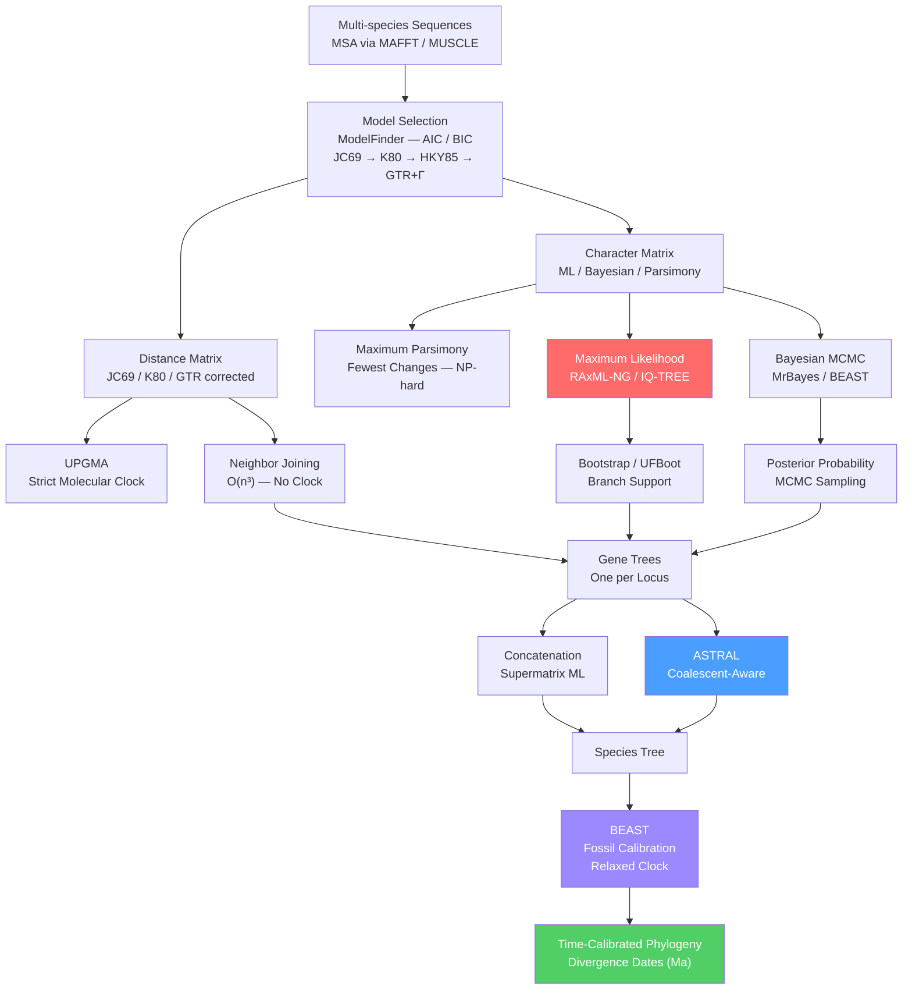

# 🌿 Molecular Evolution and Phylogenetics

> [!abstract] TL;DR
> Molecular evolution explains how and why DNA sequences change over time — mostly through neutral drift (Kimura) rather than selection — while phylogenetics uses those changes as forensic evidence to reconstruct the branching tree of life, calibrate a molecular clock, and map divergence events onto geological time.

---

## Intuition — analogy FIRST

**Analogy:** Imagine a monk in a medieval scriptorium copying a sacred text by hand. Every copy introduces a handful of random spelling mistakes — a letter transposed here, a word dropped there. Most mistakes do not change the meaning (neutral). A few happen to improve readability (positive selection). Most that change the meaning are corrected or discarded (purifying selection). Now picture hundreds of monasteries exchanging copies over centuries. Two manuscripts that share a rare spelling mistake on page 47 almost certainly came from the same ancestor copy. The more shared mistakes two manuscripts have, the more recently they diverged from their last common ancestor. Count the unique mistakes per page, and you can estimate how many copying cycles have elapsed — a manuscript clock.

DNA is the manuscript. Point mutations are copying mistakes introduced by replication errors and mutagens. Phylogenetics reads the pattern of shared mutations across species to reconstruct the branching tree. The neutral theory tells us most mutations are random noise accumulating at a roughly constant rate — the molecular clock — and that predictable rate turns sequence divergence into geological time.

---

## How It Works

### Core Mechanics

#### 1. Neutral Theory of Molecular Evolution (Kimura, 1968)

Motoo Kimura's landmark insight: the vast majority of DNA differences between species are selectively neutral — neither helping nor harming the organism. They fix in populations purely by random genetic drift. Because only truly neutral mutations accumulate at the full mutation rate, the substitution rate equals the neutral mutation rate:

$$k = \mu$$

This has a profound corollary: **the molecular clock**. If the neutral mutation rate is approximately constant across lineages, sequences diverge at a predictable rate per unit time, independent of generation time differences when measured per year.

Selective pressure at protein-coding genes is quantified by the non-synonymous to synonymous substitution rate ratio:

$$\omega = \frac{d_N}{d_S} = \frac{K_a}{K_s}$$

| ω value | Interpretation | Example |
|---------|---------------|---------|
| ω ≪ 1 | Purifying (negative) selection | Ribosomal proteins, histones |
| ω ≈ 1 | Neutral evolution | Pseudogenes |
| ω > 1 | Positive (Darwinian) selection | Immune genes, virus surface proteins |

Synonymous sites (d_S) evolve at approximately the neutral mutation rate and serve as an internal clock calibrating each gene independently.

#### 2. Nearly Neutral Theory (Ohta, 1973)

Tomoko Ohta extended Kimura: slightly deleterious mutations (|s| << 1/N_e) behave effectively neutrally because drift overpowers weak selection when effective population size (N_e) is small. Key consequences:

- **Large N_e populations** (bacteria, ~10⁹): selection efficiently removes slightly deleterious mutations → compact, streamlined genomes
- **Small N_e populations** (mammals, ~10⁴–10⁵): slightly deleterious mutations accumulate → larger genomes, more introns, more gene-family redundancy
- This forms the basis of the **drift-barrier hypothesis**: genome complexity tracks 1/N_e rather than organismal complexity

#### 3. Substitution Models

Before building a phylogeny, a probabilistic model of nucleotide substitution is required to correct for multiple hits (two substitutions at the same site erasing the first). Models are nested by increasing generality:

| Model | Free Params | Key Assumption |
|-------|------------|----------------|
| **JC69** (Jukes-Cantor) | 1 (μ) | All 12 substitution rates equal; equal base frequencies (0.25 each) |
| **K80** (Kimura 2-parameter) | 2 (α, β) | Transitions (Ts: A↔G, C↔T) occur at rate α; transversions (Tv: A↔C etc.) at β |
| **HKY85** (Hasegawa-Kishino-Yano) | 5 | Unequal base frequencies π + separate Ts/Tv ratio κ |
| **TrN** (Tamura-Nei) | 6 | Two different transition rates (AG ≠ CT) + unequal base frequencies |
| **GTR** (General Time Reversible) | 9 | Six distinct exchangeability rates + four base frequencies (one constrained) |
| **GTR+Γ** | 10 | GTR + gamma-distributed rate variation across sites, shape parameter α |
| **GTR+Γ+I** | 11 | GTR+Γ + proportion of invariable sites I |

**Jukes-Cantor distance formula.** The probability two sites differ at time t under JC69 is:

$$p(t) = \frac{3}{4}\!\left(1 - e^{-4\mu t/3}\right)$$

Inverting to recover corrected distance d = 2μt from observed proportion-different p:

$$d_{JC} = -\frac{3}{4}\ln\!\left(1 - \frac{4}{3}\,p\right)$$

Without this correction, raw p underestimates divergence for distant sequences because a site hit twice counts as zero changes.

**GTR rate matrix.** The instantaneous rate matrix Q has the form:

$$Q_{ij} = s_{ij} \cdot \pi_j \quad (i \neq j)$$

where s_ij = s_ji are the six symmetric exchangeability parameters (AC, AG, AT, CG, CT, GT) and π_j are equilibrium base frequencies. Model selection via AIC/BIC (ModelFinder in IQ-TREE) determines which model is warranted by the data.

**Gamma rate heterogeneity (+Γ).** Sites evolve at different rates. The distribution of rates across sites follows a gamma distribution with shape parameter α:
- α < 1: high heterogeneity (most sites slow, a few hypervariable)
- α > 5: approximately uniform (rare in practice)
- Discretized into 4 or 8 rate categories for computational tractability

#### 4. Phylogenetic Inference Methods

| Method | Data type | Speed | Clock? | Tool |
|--------|-----------|-------|--------|------|
| UPGMA | Distances | O(n²) | Required (strict) | General |
| Neighbor Joining | Distances | O(n³) | No | FastME, BioPython |
| Maximum Parsimony | Characters | NP-hard | No | PAUP*, TNT |
| Maximum Likelihood | Characters | Heuristic | No | RAxML-NG, IQ-TREE |
| Bayesian MCMC | Characters | Slow | Optional | MrBayes, BEAST |

**UPGMA** joins the two closest leaves, replaces them with their average, and repeats. Assumes a strict molecular clock; produces an ultrametric tree where all tips are equidistant from the root. Biased whenever lineages evolve at different rates.

**Neighbor Joining (Saitou & Nei 1987)** avoids the clock assumption by minimising total tree branch length at each join. The Q-criterion selects the optimal pair (i, j):

$$Q(i,j) = (n-2)\,d_{ij} - \sum_{k} d_{ik} - \sum_{k} d_{jk}$$

Fast (O(n³)) and adequate for preliminary analysis; not statistically consistent under all conditions but widely used for large datasets.

**Maximum Likelihood (ML)** finds the tree topology, branch lengths, and substitution model parameters that maximise P(data | tree, θ). Felsenstein's pruning algorithm computes the likelihood efficiently by summing over all possible ancestral states at internal nodes. Model selection (BIC/AIC) prevents overfitting. RAxML-NG and IQ-TREE are the gold-standard tools. Long-branch attraction (LBA) can still mislead ML with poor models.

**Bayesian Inference (MrBayes, BEAST)** samples from the posterior via Markov Chain Monte Carlo:

$$P(\text{tree},\, \theta \mid \text{data}) \propto P(\text{data} \mid \text{tree},\, \theta)\cdot P(\text{tree},\, \theta)$$

Output is a distribution over trees. Clade support is measured by **posterior probability** (fraction of MCMC samples containing that clade) rather than bootstrap. BEAST additionally co-estimates branch rates and fossil-calibrated node ages, producing a fully time-calibrated tree.

#### 5. Bootstrap and Branch Support

**Non-parametric bootstrap (Felsenstein 1985):** Resample alignment columns with replacement → rebuild tree → record which splits appear. Bootstrap value ≥ 70 % is conventionally well-supported (roughly equivalent to p < 0.05). Bootstrap values and Bayesian posterior probabilities are not directly comparable; posteriors are typically numerically higher.

**Ultra-fast bootstrap (UFBoot, IQ-TREE):** Converges in a fraction of standard bootstrap time; calibrated so values ≥ 95 % correspond to ~70 % standard bootstrap.

#### 6. Molecular Clock: Strict vs Relaxed

A **strict molecular clock** assumes all branches evolve at the same rate r (substitutions per site per year). BEAST enforces this via a single-rate prior. Valid across closely related taxa but routinely violated across deep-time comparisons.

**Relaxed clocks** allow rates to vary among branches:
- **Uncorrelated lognormal (UCLN):** Each branch draws its rate independently from a lognormal distribution. Most widely used in BEAST analyses.
- **Autocorrelated (random local clock):** Child branch rates are correlated with parent rates; better for data where rate shifts cluster.

**Fossil calibration:** Minimum node ages are set from the oldest known fossils assigned to a clade. Calibrations are encoded as prior distributions (uniform, log-normal, or exponential) on node age in BEAST. Combining molecular data with fossil calibrations yields **absolute divergence dates** (e.g., human–chimp split: 6–8 Ma; mammalian radiation: 65–85 Ma).

#### 7. Gene Tree vs Species Tree: ILS and the Multispecies Coalescent

A **gene tree** traces the genealogy of a single locus; a **species tree** traces the history of populations. They differ for three main reasons:

1. **Incomplete Lineage Sorting (ILS):** Ancestral polymorphisms persist through one or more speciation events. If two alleles in a common ancestor fail to coalesce before the ancestor splits, the resulting gene tree topology disagrees with the species tree. Most prevalent in rapid radiations where internal branches are short.

2. **Horizontal Gene Transfer (HGT):** Especially common in prokaryotes; a gene from lineage A jumps into lineage B, making it appear closer to A.

3. **Gene duplication and loss:** Paralog sequences analyzed as orthologs produce incorrect placements.

Under the **multispecies coalescent (MSC)** model, gene trees are random variables drawn from the space of trees consistent with the species tree topology. The probability that a gene tree matches the species tree for a three-taxon rooted triplet depends on the internal branch length τ (in coalescent units of generations × N_e):

$$P(\text{concordant}) = 1 - \frac{2}{3}\,e^{-\tau / N_e}$$

Short internal branches (τ/N_e ≪ 1) produce rampant ILS and high gene-tree discordance.

**ASTRAL (Accurate Species Tree Algorithm)** estimates the species tree by finding the topology that maximises quartet agreement across all input gene trees. It runs in polynomial time and is statistically consistent under the MSC without assuming equal mutation rates. ASTRAL-III and ASTRAL-Pro (for multi-copy genes) are current standard tools.

#### 8. Phylogenomics: Concatenation vs Coalescent

| Approach | Mechanism | Strength | Weakness |
|----------|-----------|----------|----------|
| **Concatenation (supermatrix)** | All loci merged into one alignment; ML/Bayesian run once | High statistical power; handles missing data | Assumes one tree for all sites; biased under strong ILS |
| **Coalescent summary (supertree)** | Gene trees estimated per locus; combined by ASTRAL/SVDquartets | Accounts for ILS; statistically consistent | Requires accurate gene trees; error propagates |
| **Site-pattern concordance** | IQ-TREE concordance factors; no gene-tree estimation | Quick diagnostic of ILS vs support | Descriptive, not inferential |

Best practice: run both concatenation and coalescent analyses, compare topologies, and examine discordant nodes for evidence of HGT, ancient hybridisation, or data artefacts.

---

### Flow / Architecture



---

## Key Concepts

### Secondary Level

**Why sequences diverge.** Every time DNA replicates, there is a small probability of introducing a point mutation — a single nucleotide change. Over millions of generations these mutations accumulate, causing two lineages that share a common ancestor to look increasingly different. The tree of life is just this process played out over billions of years across all species.

**What a phylogenetic tree shows.** A tree (or cladogram) is a graph where leaves are sampled sequences (species, genes, or individuals), internal nodes are hypothetical ancestors, and branch lengths represent the amount of evolutionary change (substitutions per site) or elapsed time. A rooted tree has a single common ancestor at the base; an unrooted tree only shows relative relationships.

**Bootstrap support.** Rebuild the tree 100–1000 times on resampled data. A node appearing in 95 % of resampled trees is much more reliable than one appearing in 40 %. Nodes with support < 70 % are usually considered unresolved.

### Undergraduate Level

**Multiple substitutions and model correction.** Imagine a nucleotide position that mutated from A to G and then back to A. Counting raw differences, we see zero change between ancestors and descendant — yet two substitutions occurred. Jukes-Cantor and related models correct for this "homoplasy" using a log transformation, recovering the expected number of true substitutions.

**Transitions vs transversions.** Chemically, pyrimidine-to-pyrimidine (C↔T) and purine-to-purine (A↔G) changes (transitions, Ts) require smaller structural rearrangements and occur roughly 2–10× more often than pyrimidine-to-purine swaps (transversions, Tv). The K80 model captures this with just two parameters.

**Molecular clock calibration.** If the primate substitution rate is ~10⁻⁹ per site per year, and two primate species differ by 1 % of their mitochondrial DNA, they diverged approximately 1 × 10⁻² / (2 × 10⁻⁹) = 5 million years ago. This is a rough estimate; rigorous dating uses BEAST with fossil priors.

**Parsimony and long-branch attraction.** Parsimony's logic is sound when evolution is slow; it breaks down on rapidly evolving branches. Two long branches accumulate many independent mutations by chance, causing parsimony to group them together even when they branched early and independently — the long-branch attraction (LBA) artefact. ML with a good substitution model reduces LBA substantially.

### Graduate Level

**Nearly neutral theory and genome size.** The drift-barrier hypothesis (Lynch & Abegg 2010) explains why prokaryotes have compact genomes (~4 Mb, few introns, high gene density) while mammals have sprawling genomes (~3 Gb, ~98 % non-coding). With N_e ≈ 10⁹, bacterial selection efficiency s > 1/N_e even for very small fitness effects, purging introns, transposons, and redundant sequence. With N_e ≈ 10⁴, mammalian drift dominates slightly deleterious insertions, allowing bloated genomes.

**Multispecies coalescent and the anomaly zone.** When internal branch lengths are extremely short (τ/N_e < ln(3/2) ≈ 0.405), the most probable gene tree topology differs from the species tree — the **anomaly zone**. Parsimony and naive ML concatenation are biased in the anomaly zone; only coalescent-aware methods (ASTRAL) or full-data Bayesian MSC methods remain consistent.

**BEAST and ancestral state reconstruction.** Beyond dating, BEAST implements Bayesian discrete trait evolution: a continuous-time Markov chain on discrete character states (geographic area, host species, phenotype) is co-estimated with the tree. The posterior distribution over ancestral states at each internal node gives probabilistic biogeographic reconstructions (e.g., "80 % probability that the common ancestor of SARS-CoV-2 variants was in Wuhan").

**Horizontal gene transfer (HGT) detection.** In prokaryotic phylogenomics, gene trees routinely disagree with the species tree for a different reason than ILS: genes physically move between genomes via conjugation, transduction, or transformation. Detecting HGT requires comparing each gene tree topology against a reference species tree (e.g., using RANGER-DTL or PhyloNet) and checking for suspiciously high GC content or codon usage in the recipient.

---

## Code Demo

```python
import numpy as np
import matplotlib
matplotlib.use("Agg")   # headless-safe; remove if running in a notebook
import matplotlib.pyplot as plt
from scipy.cluster.hierarchy import linkage, dendrogram
from scipy.spatial.distance import squareform


# ── Jukes-Cantor (JC69) corrected distance ────────────────────────────────
def jc_distance(seq1: str, seq2: str) -> float:
    """
    JC69-corrected pairwise distance between two aligned DNA sequences.
    Returns NaN when p >= 0.75 (correction formula diverges at saturation).
    """
    assert len(seq1) == len(seq2), "Sequences must be pre-aligned (same length)"
    n = len(seq1)
    p = sum(a != b for a, b in zip(seq1, seq2)) / n   # observed diff fraction
    if p >= 0.75:
        return float("nan")
    return -0.75 * np.log(1.0 - (4.0 / 3.0) * p)


# ── Five 30-bp toy aligned sequences (hominid-like divergence) ────────────
seqs = {
    "Human":     "ATGCTTACGGAATCGATCGATCGATCGATCG",
    "Chimp":     "ATGCTTACGGAATCGATCGATCGATCGATTG",
    "Gorilla":   "ATGCTTACGGAATCGATCGATCGATCGATTG",
    "Orangutan": "ATGCTTACGAAATCGATCGATCGATCGCTTG",
    "Gibbon":    "ATGCTTACGAAATCGATCAATCGATCGCTTG",
}
taxa = list(seqs.keys())
n = len(taxa)

# ── Build full symmetric JC69 distance matrix ─────────────────────────────
dist = np.zeros((n, n))
for i in range(n):
    for j in range(i + 1, n):
        d = jc_distance(seqs[taxa[i]], seqs[taxa[j]])
        dist[i, j] = dist[j, i] = d

print("JC69 distance matrix:")
print(f"{'':>10}", end="")
for t in taxa:
    print(f"{t:>11}", end="")
print()
for i, name in enumerate(taxa):
    print(f"{name:>10}", end="")
    for j in range(n):
        v = f"{dist[i, j]:.4f}" if not np.isnan(dist[i, j]) else "  NaN"
        print(f"{v:>11}", end="")
    print()

# ── Approximate NJ via scipy average-linkage (for visualisation) ──────────
# For production NJ use BioPython's DistanceTreeConstructor with NJ method.
condensed = squareform(dist)
Z = linkage(condensed, method="average")   # WPGMA — approximates NJ topology

fig, ax = plt.subplots(figsize=(8, 4))
dendrogram(
    Z,
    labels=taxa,
    ax=ax,
    orientation="right",
    color_threshold=0.02,
    above_threshold_color="gray",
)
ax.set_title("Cladogram from JC69 distances (average-linkage proxy for NJ)")
ax.set_xlabel("JC69 corrected distance")
plt.tight_layout()
plt.savefig("phylo_cladogram.png", dpi=150)
print("\nCladogram saved to phylo_cladogram.png")

# ── Expected output ───────────────────────────────────────────────────────
# JC69 distance matrix:
#                Human      Chimp    Gorilla  Orangutan     Gibbon
#      Human   0.0000     0.0342     0.0342     0.0693     0.1054
#      Chimp   0.0342     0.0000     0.0000     0.0693     0.1054
#    Gorilla   0.0342     0.0000     0.0000     0.0693     0.1054
#  Orangutan   0.0693     0.0693     0.0693     0.0000     0.0342
#     Gibbon   0.1054     0.1054     0.1054     0.0342     0.0000
# Human and Chimp cluster first (smallest JC69 distance), then
# Orangutan+Gibbon form an outgroup — consistent with hominid evolution.
```

---

## Real-World Example

> **Example — SARS-CoV-2 Variant Phylogenomics (Nextstrain):**
> Nextstrain uses IQ-TREE (GTR+Γ model, ML optimisation) to reconstruct real-time phylogenies of SARS-CoV-2 genomes uploaded to GISAID — millions of sequences spanning 2020–present. BEAST with a strict clock (rate ~8 × 10⁻⁴ substitutions/site/year for SARS-CoV-2) dates the emergence of each variant lineage and anchors ancestral state reconstruction to identify geographic origins of Omicron and other variants. Bootstrap values and temporal signal diagnostics flag sequences with incorrect collection dates or sequencing errors before they distort the tree. The resulting time-calibrated phylogeny was the primary evidence base for WHO variant-of-concern designations and global response coordination.

---

## Trade-offs

| Aspect | Concatenation + ML | Coalescent (ASTRAL) | Bayesian (BEAST) |
|--------|--------------------|---------------------|-----------------|
| **Speed** | Fast (hours for 1000 taxa) | Moderate (hours for 1000 gene trees) | Slow (days/weeks for large datasets) |
| **ILS handling** | Poor (biased in anomaly zone) | Excellent (statistically consistent) | Good (full MSC models) |
| **Fossil integration** | Not directly | Not directly | Native (prior on node ages) |
| **Model flexibility** | High (any substitution model) | Limited (gene tree quality matters) | Very high (clock + substitution + demographic) |
| **Software maturity** | RAxML-NG, IQ-TREE (excellent) | ASTRAL-III (robust) | BEAST2 (extensive documentation) |
| **Scalability** | Thousands of taxa | Thousands of taxa | Hundreds of taxa |

---

## When to Use vs Avoid

**Use maximum likelihood + bootstrap when:**
- You need a fast, well-supported species or gene tree for hundreds to thousands of taxa.
- Rate heterogeneity among lineages is moderate and model can capture it.
- You are building an exploratory or publication-quality topological tree without absolute dates.

**Use Bayesian MCMC (BEAST) when:**
- You need absolute divergence times calibrated against fossils or known historical events.
- You want ancestral state reconstruction with full probabilistic uncertainty.
- You have temporal signal in your sequences (e.g., rapidly evolving viruses with known sampling dates).

**Use ASTRAL (coalescent) when:**
- Your dataset involves a rapid radiation with short internal branches (high ILS expected).
- You have genome-scale data: hundreds of gene trees from different loci.
- Concatenation and coalescent analyses produce conflicting topologies — ASTRAL gives the more theoretically grounded answer.

**Avoid strict clock UPGMA when:**
- Lineages show rate variation (heterotachy) — nearly all real datasets.

**Avoid maximum parsimony when:**
- Some lineages are much longer (faster evolving) than others — LBA is severe.
- Dataset has many taxa with high divergence.

---

## Common Pitfalls

- **Ignoring model selection** — Running JC69 on a dataset that requires GTR+Γ produces systematically wrong branch lengths and potentially wrong topologies. Always run ModelFinder (IQ-TREE) or jModelTest first.
- **Conflating bootstrap support with probability** — A 90 % bootstrap value is not "90 % probability the clade is correct." Bootstrap measures reproducibility under resampling, not posterior probability. Bayesian posteriors of 0.99 and bootstrap of 80 % are not directly comparable.
- **Confusing gene trees and species trees** — Reporting a single gene tree as the species phylogeny in a radiation where ILS is likely leads to wrong conclusions. Always compare multiple loci and use ASTRAL.
- **Long-branch attraction** — Two fast-evolving lineages cluster spuriously under parsimony or with a misspecified ML model. Diagnose by checking that suspiciously close relatives do not have disproportionately long branches; test with different models or exclude long-branch taxa.
- **Clock violation without detection** — Applying a strict clock in BEAST without testing the temporal signal (regression of root-to-tip distance vs sampling date, or likelihood ratio test) produces falsely precise divergence dates. Use TempEst to check temporal signal before running BEAST.
- **Saturation at synonymous sites** — Using d_S as a clock for very distantly related taxa (insects vs vertebrates) fails because synonymous sites saturate (p → 0.75). Use more slowly evolving markers (18S rRNA, nuclear protein-coding genes) for ancient divergences.
- **Treating HGT as ILS** — In bacteria, gene tree discordance is often horizontal transfer, not incomplete lineage sorting. Running ASTRAL on prokaryotic gene trees produces a species tree averaged over recipients and donors, which is biologically misleading.

---

## Related Concepts

- [[Comparative_Genomics_and_Synteny]] — Phylogenetics underpins synteny analysis: ortholog identification, Ka/Ks (dN/dS) calculation, and ancestral genome reconstruction all require a reference phylogeny.
- [[Population_Genetics_and_Hardy_Weinberg]] — Coalescent theory connects population genetics (allele frequency, N_e, drift) to gene tree shapes; the multispecies coalescent is the bridge between microevolution and macroevolution.
- [[DNA_Repair_and_Mutation]] — Mutation rate (μ) is the raw input to the neutral theory; repair mechanism efficiency sets μ and thus the molecular clock rate per generation.
- [[Bioinformatics_Algorithms_and_Sequence_Analysis]] — Multiple sequence alignment (MAFFT, MUSCLE), dynamic programming, and probabilistic models (HMMs, profile scoring) are prerequisites for building the character matrices that phylogenetic methods consume.
- [[Bayesian_Statistics]] — Bayesian phylogenetics (MrBayes, BEAST) applies MCMC to sample from the posterior over tree topologies and model parameters; Bayesian inference is the mathematical backbone of time-calibrated phylogenomics.
- [[Information_Theory]] — Maximum likelihood phylogenetics minimises the Kullback-Leibler divergence between the data distribution and the model; model selection via AIC/BIC is a direct application of information-theoretic principles.
- [[Natural_Selection_Genetic_Drift_and_Bottlenecks]] — The interplay of drift and selection determines what fraction of mutations fix neutrally, setting the clock rate and shaping ω distributions across lineages.
- [[_MOC_Evolutionary_and_Systems_Genetics|↑ Evolutionary and Systems Genetics MOC]]

---

## Review Questions

1. **Conceptual:** Under Kimura's neutral theory, k = μ (substitution rate = neutral mutation rate). What happens to this relationship if you compare two lineages that differ substantially in effective population size (N_e)? How does Ohta's nearly neutral theory modify the prediction?

2. **Scenario:** You are reconstructing the phylogeny of 12 rapidly-diverging bird species that radiated 5 million years ago in 1 million years. You have assembled 500 single-copy gene alignments. Your concatenation tree and your ASTRAL tree conflict at three internal nodes. What does this pattern suggest, and what additional analyses would you run to resolve the conflict?

3. **Trade-off:** A collaborator proposes running UPGMA on a mitochondrial alignment of 200 mammalian species to date the placental mammal radiation. List at least three reasons why this approach is likely to produce incorrect divergence times, and describe a more appropriate analysis pipeline.

---

## Sources

- [Kimura M. (1968). Evolutionary rate at the molecular level. *Nature*.](https://www.nature.com/articles/217624a0)
- [Ohta T. (1973). Slightly deleterious mutant substitutions in evolution. *Nature*.](https://www.nature.com/articles/246096a0)
- [Felsenstein J. (1981). Evolutionary trees from DNA sequences: ML approach. *J Mol Evol*.](https://link.springer.com/article/10.1007/BF01734359)
- [Saitou N, Nei M. (1987). The neighbor-joining method. *Mol Biol Evol*.](https://academic.oup.com/mbe/article/4/4/406/1029664)
- [ASTRAL-II: Coalescent-based species tree estimation](https://academic.oup.com/bioinformatics/article/31/12/i44/215524)
- [GTRpmix: Linked GTR model for profile mixture models. *Mol Biol Evol* (2024)](https://academic.oup.com/mbe/article/41/9/msae174/7735827)
- [IQ-TREE 2: New Models and Methods for Phylogenetic Inference](https://academic.oup.com/mbe/article/37/5/1530/5721363)
- [RevBayes: Nucleotide substitution models tutorial](https://revbayes.github.io/tutorials/ctmc/)
- [BEAST2 Documentation](https://beast.community/)

---

#Genetics #EvolutionaryGenetics #MolecularEvolution #Phylogenetics
