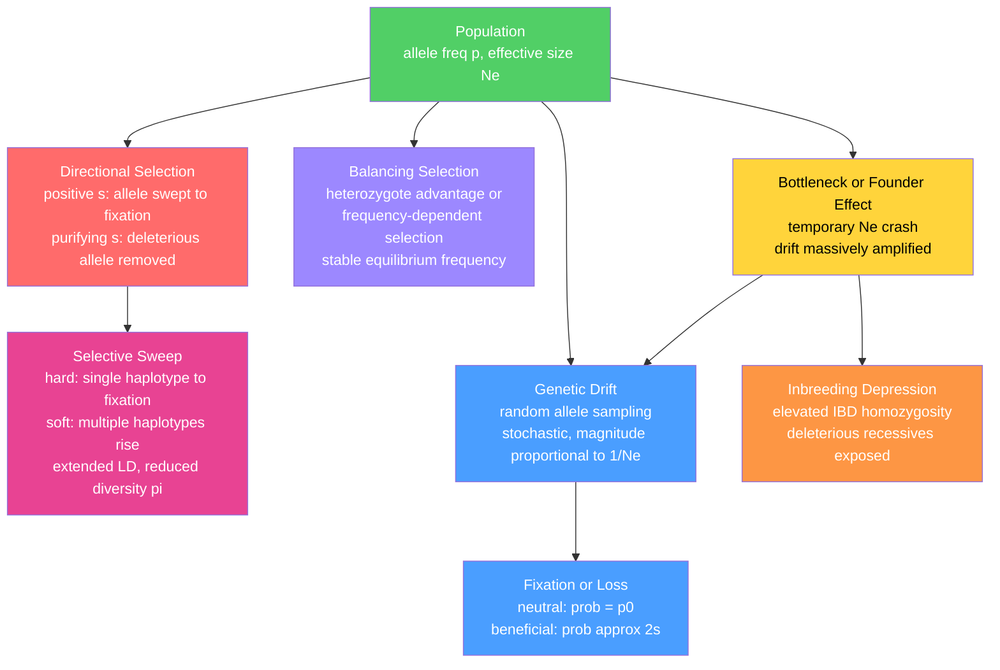

# 🌿 Natural Selection, Genetic Drift, and Bottlenecks

> [!abstract] TL;DR
> Natural selection and genetic drift are the two principal engines of allele frequency change: selection is the deterministic force that rewards fit variants; drift is the stochastic force that dominates small populations; bottlenecks and founder events temporarily amplify drift to catastrophic levels, reshaping genetic diversity and evolutionary trajectories for thousands of generations afterward.

---

## Intuition — analogy FIRST

Imagine a massive library — millions of books (alleles) spread across thousands of shelves (chromosomes). Every generation, readers borrow books and write copies; books that are read more often get more copies made (natural selection), while in a tiny branch library random borrowing determines which survive (genetic drift).

Now imagine a fire burns down the main library and only 20 randomly-grabbed books survive (a bottleneck). Even after the branch library expands back to millions of copies, they are all reprints of those same 20 originals — diversity is forever reduced to whatever the survivors happened to contain. If one of those survivors was a previously rare obscure title, it now represents a huge fraction of the rebuilt collection. That is the founder effect.

The profound implication: a population's genetic architecture is shaped not only by which variants were most useful (selection) but by which ones happened to be present when the catastrophe struck (drift during the bottleneck).

---

## How It Works



---

## Key Concepts / Details

### Secondary Level

**Types of natural selection.** Natural selection acts whenever genotypes differ in survival or reproductive success. Four modes are distinguished:

1. **Directional (positive) selection** — one allele has higher fitness, so its frequency rises generation after generation until fixation ($p = 1$) or the environment changes. Example: antibiotic resistance alleles in bacteria.

2. **Purifying (negative) selection** — an allele reduces fitness and is continuously removed. This is the *most common* form of selection acting on genomes — the vast majority of non-synonymous mutations are mildly to strongly deleterious and are kept at very low frequency by this process.

3. **Balancing selection** — multiple alleles are actively maintained in the population. Two main mechanisms:
   - *Heterozygote advantage (overdominance)*: Aa has higher fitness than either AA or aa (canonical example: sickle-cell HbS heterozygotes are resistant to malaria).
   - *Negative frequency-dependent selection*: rare alleles are favoured because rarity itself confers an advantage (e.g., self-incompatibility alleles in plants; MHC diversity in vertebrates).

4. **Sexual selection** — one sex (usually females) chooses mates based on traits that advertise genetic quality (peacock tails, birdsong complexity). Can drive alleles to high frequency even when they reduce survival, as long as the mating advantage outweighs the survival cost. Overlaps with directional selection when the two sexes share the selected locus.

**Selection coefficient $s$.** Quantifies relative fitness difference. If $w_{aa} = 1$ and $w_{AA} = 1 + s$, then $s > 0$ means A is favoured, $s < 0$ means A is deleterious. Typical values: strong selection $|s| \sim 0.01$–$0.1$; weak/nearly neutral $|s| < 1/(2N_e)$.

**Genetic drift.** In any finite population the next generation is formed by randomly sampling alleles from the current gene pool. Random sampling causes allele frequencies to fluctuate unpredictably even without selection. The smaller the population, the larger the fluctuations. Eventually, by chance alone, one allele reaches $p = 1$ (fixation) and all others are lost — even if they were perfectly neutral or slightly beneficial.

**Bottleneck effect.** When a population crashes to a very small size for one or more generations, the random sampling of alleles during that crash can radically alter allele frequencies and eliminate rare variants entirely. Even when the population recovers its census size, genetic diversity is permanently limited to whatever the bottleneck survivors happened to possess.

**Founder effect.** A special case of a bottleneck: a small subset colonises a new habitat. The founders carry only a fraction of the original gene pool, and random chance — not selection — determines which alleles are present and at what starting frequencies in the new population.

---

### Undergraduate Level

**Mathematical treatment of directional selection.** With allele frequencies $p$ (A) and $q = 1 - p$ (a), and fitnesses $w_{AA} = 1 + s$, $w_{Aa} = 1 + hs$, $w_{aa} = 1$, the mean fitness is:

$$\bar{w} = p^2(1+s) + 2pq(1+hs) + q^2$$

After selection the frequency of A becomes:

$$p' = \frac{p^2(1+s) + pq(1+hs)}{\bar{w}}$$

The per-generation change is approximately:

$$\Delta p \approx \frac{spq\bigl[p + h(1-2p)\bigr]}{\bar{w}}$$

For additive alleles ($h = 0.5$): $\Delta p \approx spq/2$. This is fastest when $p = q = 0.5$ and slows as the favoured allele approaches fixation, because heterozygote frequency declines and a decreasing fraction of the gene pool is "visible" to selection.

**Fitness landscape.** Sewall Wright's adaptive landscape maps genotype space (allele frequencies at many loci) onto a fitness surface. Populations climb toward local peaks under selection. The key insight: landscapes with multiple peaks create evolutionary traps — a population at a local fitness peak cannot cross a fitness valley by selection alone. Genetic drift in small populations helps "jump" across valleys by temporarily allowing unfavourable allele combinations to persist, potentially reaching higher peaks. This tension between the optimising power of selection and the stochastic exploration enabled by drift is central to Wright's shifting-balance theory.

**Fixation probability.** The probability that a single copy of a new mutation ultimately reaches fixation in a diploid population of effective size $N_e$:

| Allele type | Fixation probability |
|-------------|---------------------|
| Strictly neutral | $1/(2N_e)$ |
| Beneficial, large $N_e s$ | $\approx 2s$ (independent of $N_e$) |
| Beneficial, general $s$ | $\dfrac{2s}{1 - e^{-4N_e s}}$ (Kimura 1962) |
| Strongly deleterious, $N_e|s| \gg 1$ | $\approx 0$ |

The **nearly neutral theory** (Ohta 1973) generalises this: an allele is effectively neutral when $|N_e s| < 1$. Most mammalian non-synonymous variants fall in this nearly neutral regime because $N_e \sim 10^4$–$10^5$, so only alleles with $|s| > 10^{-4}$–$10^{-5}$ are meaningfully selected.

**Effective population size $N_e$.** $N_e$ is the size of an idealised Wright-Fisher population experiencing the same rate of genetic drift as the real population. It is always smaller than the census size $N$:

- **Variance in reproductive success** — $N_e \approx 4N / (V_k + 2)$ where $V_k$ is the variance in offspring number. Pacific salmon with extreme reproductive skew have $N_e/N \approx 0.001$.
- **Fluctuating population sizes** — $N_e$ is the harmonic mean of historical census sizes. A single generation at $N = 10$ in an otherwise $N = 10^6$ population pulls $N_e$ toward 10.
- **Unequal sex ratio** — $N_e = 4N_m N_f / (N_m + N_f)$. A 1:99 sex ratio gives $N_e \approx 4 N_m$.

**Hard vs soft selective sweeps.** A *hard sweep* occurs when a single new beneficial mutation arises on one haplotype and is swept to fixation by positive selection. Linked neutral variation is dragged to fixation too (genetic hitchhiking), leaving a valley of reduced nucleotide diversity ($\pi$) flanked by elevated linkage disequilibrium (LD) around the selected site.

A *soft sweep* occurs when selection acts on *standing genetic variation* — an allele that already existed at low-to-intermediate frequency before becoming beneficial. Multiple independent haplotypes carrying the favoured allele compete and sweep simultaneously. Soft sweeps reduce diversity less and produce weaker LD signals; they are likely common for polygenic traits adapting to environmental change.

**Clonal interference in asexual populations.** In asexual organisms all loci are permanently linked. Multiple beneficial mutations arise on different genetic backgrounds and compete directly — *clonal interference*. The fastest background wins; beneficial mutations on other backgrounds are lost. This slows adaptation compared to sexual populations (where recombination assembles all beneficial alleles into one genome). Clonal interference is experimentally documented in long-term *E. coli* evolution experiments (Lenski LTEE) and plays a key role in viral evolution, cancer genome dynamics, and microbial drug resistance evolution.

**Inbreeding depression.** After a bottleneck, survivors share recent common ancestors — their genomes have elevated identity-by-descent (IBD). When relatives mate, offspring have elevated probability of being homozygous for deleterious recessive alleles previously sheltered in heterozygotes. The fitness reduction in inbred relative to outbred offspring is *inbreeding depression*. The inbreeding coefficient $F$ (probability both alleles at a locus are IBD) governs this: $w_{\text{inbred}} \approx w_{\text{outbred}}(1 - aF)$ where $a$ is the inbreeding depression coefficient.

**Tajima's D under selection.** Tajima's D (see [[Population_Genetics_and_Hardy_Weinberg]]) takes specific sign under selection:

- **Strongly negative $D$ in a genomic window** — excess rare variants; consistent with a recent selective sweep (new mutations on the swept haplotype) or population expansion.
- **Strongly positive $D$ in a genomic window** — excess intermediate-frequency variants; consistent with balancing selection maintaining two divergent haplotypes, or population contraction/subdivision.
- An extended run of $D < -2$ followed by a central peak is the classic hard sweep signature.

Critical caveat: demographic events produce genome-wide shifts in $D$, while selection produces localised outliers. Testing outliers against the genome-wide demographic background (calibrated on synonymous sites) is mandatory before attributing signal to selection.

---

### Graduate Level

**dN/dS — molecular signature of selection.** For a protein-coding gene, $d_N$ is the rate of non-synonymous substitutions per non-synonymous site and $d_S$ is the synonymous rate:

| Ratio | Interpretation |
|-------|---------------|
| $d_N/d_S < 1$ | Purifying selection — amino acid changes are deleterious; synonymous sites accumulate faster |
| $d_N/d_S = 1$ | Neutral evolution — amino acid changes occur at the neutral rate |
| $d_N/d_S > 1$ | Positive (diversifying) selection — amino acid changes are actively favoured; seen in immune genes, rapidly evolving pathogens |

**McDonald-Kreitman (MK) test.** Juxtaposes polymorphism (within species) and divergence (between species) at synonymous vs non-synonymous sites:

|  | Non-synonymous | Synonymous |
|--|---------------|-----------|
| Fixed between species | $D_N$ | $D_S$ |
| Polymorphic within species | $P_N$ | $P_S$ |

Under strict neutrality $D_N/D_S = P_N/P_S$. An excess of fixed non-synonymous changes ($D_N/D_S > P_N/P_S$) indicates positive selection drove those divergence events. The *neutrality index* $\text{NI} = (P_N / P_S)/(D_N / D_S)$; NI < 1 implies positive selection. The *direction of selection* statistic $\alpha = 1 - (D_S P_N)/(D_N P_S)$ estimates the fraction of non-synonymous fixations driven by positive selection. Applying the MK test requires distinguishing truly neutral synonymous sites from those affected by codon usage bias or RNA structure.

**Extended haplotype homozygosity (EHH) statistics.** Detect ongoing or recently completed sweeps by measuring the decay of identical haplotype blocks around a candidate SNP:

- **iHS (integrated Haplotype Score)**: Compares the integral of EHH along the ancestral vs derived haplotype *within* a single population. A large absolute iHS indicates an unusually intact long haplotype on the derived allele — signature of an ongoing sweep.
- **XP-EHH (Cross-Population EHH)**: Compares haplotype homozygosity around a candidate locus *between* two populations. A sweep completed in one population leaves an unusually long intact haplotype in that population relative to the comparison. XP-EHH has greater power for completed sweeps.
- **nSL (number of segregating sites by length)**: Similar to iHS but uses the count of segregating sites on a haplotype as the decay metric rather than homozygosity; more robust to SNP ascertainment bias.

**$F_{ST}$ outlier tests for local adaptation.** When positive selection adapts a population to its local environment, the selected locus shows dramatically elevated $F_{ST}$ between populations — more diverged than expected under pure drift alone. Genome-wide $F_{ST}$ distributions from neutral loci provide the null; loci in the top 1–5% are candidate sweeps. Tools: BayeScan (Bayesian hierarchical model), pcadapt, OutFLANK. Key limitation: demographic structure (bottlenecks, admixture) inflates genome-wide $F_{ST}$ and generates false positives. Correcting for the demographic null is mandatory.

**Hill-Robertson interference and linked selection.** In finite, recombining populations, selection at one locus reduces the effective population size experienced by linked loci — because selection creates variance in reproductive success that acts as drift for neighbours. In regions of low recombination (near centromeres, within inversions), purifying and positive selection continuously perturb allele frequencies at linked sites, depressing nucleotide diversity. Empirically: $\pi$ correlates strongly with local recombination rate across the genome in *Drosophila*, humans, and many other species — a genome-wide footprint of pervasive linked selection rather than targeted sweeps.

---

## Python Demo

```python
# Requires: numpy, matplotlib
# Demonstrates: (1) Wright-Fisher allele frequency trajectories with and without
#               positive selection; (2) bottleneck effect on expected heterozygosity.

import numpy as np
import matplotlib.pyplot as plt

rng = np.random.default_rng(42)


# ── Wright-Fisher with viability selection ────────────────────────────────
def wf_step(p, Ne, s=0.0, h=0.5):
    """One generation of drift + viability selection.
    Fitness: w_AA = 1+s,  w_Aa = 1+h*s,  w_aa = 1  (A is favoured when s > 0)."""
    w_bar = p**2 * (1 + s) + 2*p*(1 - p) * (1 + h*s) + (1 - p)**2
    p_sel = (p**2*(1 + s) + p*(1 - p)*(1 + h*s)) / w_bar
    counts = rng.binomial(2*Ne, np.clip(p_sel, 0.0, 1.0))
    return counts / (2*Ne)

def simulate_wf(p0, Ne, generations, n_reps, s=0.0):
    trajs = np.zeros((n_reps, generations + 1))
    trajs[:, 0] = p0
    for g in range(generations):
        trajs[:, g + 1] = wf_step(trajs[:, g], Ne, s)
    return trajs


# ── Panel A: neutral drift vs positive selection ──────────────────────────
Ne, n_reps, gens, p0 = 500, 40, 400, 0.02

neutral  = simulate_wf(p0, Ne, gens, n_reps, s=0.0)
positive = simulate_wf(p0, Ne, gens, n_reps, s=0.05)

fig, axes = plt.subplots(1, 2, figsize=(13, 4.5), sharey=True)
for ax, trajs, label, color in [
    (axes[0], neutral,  "Neutral (s = 0)",             "#4a9eff"),
    (axes[1], positive, "Positive selection (s = 0.05)", "#ff6b6b"),
]:
    for traj in trajs:
        ax.plot(traj, alpha=0.3, lw=0.8, color=color)
    fix_frac = float(np.mean(trajs[:, -1] >= 1.0))
    ax.set_title(f"{label}\nNe={Ne}  p0={p0}  fraction fixed={fix_frac:.2f}", fontsize=10)
    ax.set_xlabel("Generation")
axes[0].set_ylabel("Allele frequency p")
fig.suptitle("Wright-Fisher: natural selection vs pure drift", fontsize=12)
plt.tight_layout()
plt.show()

# Theoretical fixation probabilities (Kimura 1962)
print(f"Theory: neutral  P(fix) = p0 = {p0:.3f}")
print(f"Theory: selected P(fix) = 2s = {2 * 0.05:.3f}")


# ── Panel B: bottleneck — expected heterozygosity before / during / after ──
def run_bottleneck(p0, Ne_large, Ne_bottle, Ne_after,
                   pre_gens, bottle_gens, post_gens, n_reps):
    p = np.full(n_reps, p0)
    record = {}

    for _ in range(pre_gens):
        p = wf_step(p, Ne_large)
    record["1_pre_bottleneck"] = float(np.mean(2 * p * (1 - p)))

    for _ in range(bottle_gens):
        p = wf_step(p, Ne_bottle)
    record["2_bottleneck"]     = float(np.mean(2 * p * (1 - p)))

    for _ in range(post_gens):
        p = wf_step(p, Ne_after)
    record["3_post_recovery"]  = float(np.mean(2 * p * (1 - p)))

    return record


stats = run_bottleneck(
    p0=0.5,
    Ne_large=10_000, Ne_bottle=10, Ne_after=10_000,
    pre_gens=200, bottle_gens=5, post_gens=300,
    n_reps=500,
)
print("\nBottleneck effect on expected heterozygosity H = 2p(1-p):")
for phase, H in stats.items():
    print(f"  {phase:<25s}  H = {H:.4f}")

# Theory: after Ne_bottle=10 for 5 gens, H_residual = H_pre * (1 - 1/(2*Ne))^t
H_theory = 0.5 * (1 - 1 / (2 * 10))**5
print(f"\n  Theory H_post_bottle = 0.5 * (1 - 1/20)^5 = {H_theory:.4f}")
```

Expected output: the selection panel shows most replicates lost or stuck near zero under neutral drift, while the selection panel shows the majority sweeping toward fixation. The bottleneck output shows $H$ dropping from ~0.49 pre-bottleneck to ~0.38 immediately after, then remaining low (~0.37) even after 300 generations of recovery at $N_e = 10{,}000$ — because without mutation, drift can only reduce diversity, never restore it.

---

## Real-World Notes

**Lactase persistence — strongest documented hard sweep in Western Eurasians.** The derived T-13910 allele upstream of the *LCT* gene confers lactase production into adulthood, allowing digestion of fresh milk. In populations with a long history of dairying (Northern Europeans, some East African pastoralists), this allele shows one of the most extreme hard-sweep signatures in the human genome: a several-megabase haplotype block on chromosome 2q21, dramatically reduced nucleotide diversity, a highly negative Tajima's D, and elevated XP-EHH relative to non-dairying populations. Selection coefficients estimated from ancient DNA time series range from $s \approx 0.01$ to $0.10$ — among the highest observed in recent human evolution, indicating powerful ongoing directional selection linked to the emergence of pastoralism.

**Ashkenazi Jewish founder effect and disease allele enrichment.** The Ashkenazi Jewish population traces to a founding event of perhaps 350–500 individuals in medieval Europe, followed by rapid expansion. This founder bottleneck inflated the frequencies of rare alleles that happened to be present in the founders: carrier frequencies for Tay-Sachs disease (hexosaminidase A deficiency), BRCA1 185delAG, and BRCA2 6174delT are 5–10-fold higher in Ashkenazim than in the general population — not because these alleles are advantageous, but because they were present in the founders and genetic drift amplified them during the population crash. This is the textbook demonstration that drift, not selection, can elevate otherwise strongly deleterious alleles to conspicuous population frequencies.

**McDonald-Kreitman test in Drosophila Adh.** The alcohol dehydrogenase (*Adh*) gene in *Drosophila melanogaster* was the original locus to which the MK test was applied (McDonald and Kreitman 1991). The test revealed a significant excess of fixed non-synonymous divergence between *D. melanogaster* and *D. simulans* relative to non-synonymous polymorphism within *D. melanogaster*, interpreted as positive selection driving amino acid substitutions likely related to adaptation to fermentation environments in human-associated niches. The paper established the MK test as a reference method for detecting positive selection at the molecular level and introduced the framework now applied across eukaryotic genomes.

---

## Common Pitfalls

- **Treating drift as negligible in "large" populations.** A census size of $10^6$ feels large, but the harmonic mean formula means a single bottleneck generation at $N = 50$ drives $N_e$ far below 1,000. Always estimate $N_e$ from molecular data (heterozygosity, LD decay, PSMC) rather than from census counts.
- **Attributing every $F_{ST}$ outlier to selection.** Population structure alone can generate loci appearing as $F_{ST}$ outliers. Correcting for the genome-wide demographic signal (using a null distribution from synonymous or non-genic $F_{ST}$ values) is essential before declaring local adaptation.
- **Interpreting a soft sweep as neutrality.** Soft sweeps and polygenic adaptation from standing variation produce weaker signals than hard sweeps and often fall below the detection threshold of iHS or XP-EHH. Absence of a sweep signal does not mean no selection — it may mean the sweep was soft or spread across many small-effect loci.
- **Applying dN/dS to short genes or closely related species.** The MK test and $d_N/d_S$ have low power when $D_N$ or $D_S$ are small (few substitutions). Short genes between closely related species may have $D_N = 0$, making the ratio undefined. Minimum recommended: at least 10–20 fixed synonymous substitutions.
- **Conflating heterozygosity loss with inbreeding depression.** A bottleneck reduces heterozygosity by chance; this only causes inbreeding depression if relatives subsequently mate. A well-mixed population that passes through a bottleneck and then panmictically expands can largely avoid inbreeding depression; it is sustained small size combined with relative mating that exposes deleterious recessives.
- **Ignoring clonal interference when modelling asexual evolution.** Single-locus fixation probability overestimates a beneficial mutation's chance of fixing in an asexual organism because it competes with other beneficial mutations on other backgrounds. Multi-locus, population-level simulators (SLiM, FFPopSim) are required for accurate modelling.

---

## Related Concepts

- [[Population_Genetics_and_Hardy_Weinberg]] — the null model against which all selection and drift deviations are measured; covers the Wright-Fisher sampling model, HWE, $F$-statistics, and Tajima's D foundations in detail
- [[Quantitative_Genetics_and_Heritability]] — extends selection theory from single alleles to polygenic traits; the breeder's equation $R = h^2 S$ is the quantitative-genetic analogue of directional selection acting on a continuous phenotype
- [[Linkage_Mapping_and_Recombination]] — recombination rate determines the width of selective sweep valleys and the strength of Hill-Robertson interference; high-recombination genomic regions recover diversity faster after a sweep
- [[DNA_Repair_and_Mutation]] — mutation rate $\mu$ sets the rate at which new variation enters populations for drift and selection to act on; the mutation-selection balance determines equilibrium frequency of deleterious alleles
- [[Comparative_Genomics_and_Synteny]] — $d_N/d_S$ comparisons and the McDonald-Kreitman test require aligned orthologous sequences across species; synteny blocks define the evolutionary units used in cross-species selection scans
- [[Bioinformatics_Algorithms_and_Sequence_Analysis]] — alignment, variant calling, and haplotype phasing are the upstream computational steps that produce the allele frequency spectra and haplotype data fed into iHS, XP-EHH, and MK test pipelines
- [[Bayesian_Statistics]] — Bayesian skyline plots (BEAST, PSMC) reconstruct historical $N_e$ trajectories from sequence data; BayeScan uses Bayesian outlier detection for $F_{ST}$-based local adaptation scans
- [[Statistical_Inference]] — Tajima's D, the MK test, Fisher's exact test for the MK contingency table, and chi-square neutrality tests are standard statistical inference problems; misunderstanding test assumptions (especially demographic confounders) is the leading source of false positive selection claims
- [[_MOC_Evolutionary_and_Systems_Genetics|↑ Evolutionary and Systems Genetics MOC]]

---

## Review Questions

1. **Secondary:** A small island population of birds ($N_e = 50$) diverges from a mainland population ($N_e = 50{,}000$) over 200 generations with no selection. Which population shows more allele frequency change at neutral loci, and why? If the island population was founded by 10 birds from the mainland, how does this change your answer and what additional phenomenon does it illustrate?

2. **Undergraduate:** A new missense mutation arises in a diploid population of $N_e = 5{,}000$. It has $s = 0.01$, additive ($h = 0.5$). (a) Estimate $P(\text{fix})$ using the Kimura formula and compare to the neutral case. (b) Starting at a single copy ($p_0 = 1/(2N_e)$), compute the expected frequency after 100 generations under selection alone (ignore drift). (c) If the population went through a single-generation bottleneck to $N = 5$ before this mutation arose, explain qualitatively why the fixation probability of the same mutation changes, and in which direction.

3. **Graduate:** You perform a genome-wide selection scan in two human populations (European and West African). A 500 kb region on chromosome 6 shows: XP-EHH score in the top 0.1% in Europeans relative to Africans; significantly negative Tajima's D in Europeans only; and $d_N/d_S \approx 1.8$ for the gene at the centre of the region in a human-chimpanzee comparison. Describe the evolutionary scenario most consistent with all three lines of evidence. What McDonald-Kreitman result would further strengthen the interpretation? What demographic confound must be ruled out, and what computational approach would you use to do so?

---

## Sources

- Kimura, M. (1962) "On the probability of fixation of mutant genes in a population" — *Genetics* 47: 713–719
- McDonald, J. H. & Kreitman, M. (1991) "Adaptive protein evolution at the Adh locus in Drosophila" — *Nature* 351: 652–654
- Sabeti, P. C. et al. (2002) "Detecting recent positive selection in the human genome from haplotype structure" — *Nature* 419: 832–837
- Ohta, T. (1973) "Slightly deleterious mutant substitutions in evolution" — *Nature* 246: 96–98
- Nielsen, R. (2005) "Molecular signatures of natural selection" — *Annual Review of Genetics* 39: 197–218
- Gillespie, J. H. — *Population Genetics: A Concise Guide*, 2nd ed. (Johns Hopkins University Press)
- Hermisson, J. & Pennings, P. S. (2005) "Soft sweeps: molecular population genetics of adaptation from standing genetic variation" — *Genetics* 169: 2335–2352

---

#Genetics #EvolutionaryGenetics #NaturalSelection #GeneticDrift
