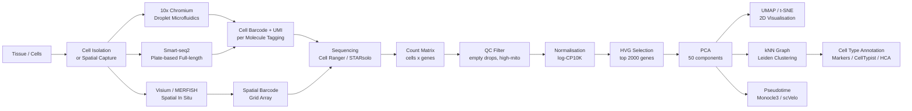

# Single-Cell Genomics and Multi-Omics

> [!abstract] TL;DR
> Single-cell genomics resolves the transcriptome, chromatin, and protein landscape of individual cells rather than bulk tissue averages — technologies ranging from 10x Chromium droplet encapsulation to spatial transcriptomics capture the identity and position of every cell, while multi-omics platforms simultaneously measure two or more molecular layers per cell, enabling reconstruction of the regulatory circuits, developmental trajectories, and evolutionary variation that shape cell identity across tissues, species, and disease.

---

## Intuition

**Analogy:** Bulk RNA-seq is like recording an orchestra from the back of a concert hall — you capture the overall symphonic sound but cannot distinguish whether the violins or cellos dominate a passage, or who played a wrong note. Single-cell RNA-seq places a microphone in front of every musician simultaneously: 10,000 cells each receive their own independent transcript profile. Multi-omics then attaches a camera to every microphone — recording both which notes each musician plays (RNA) and which pages of their score are open (chromatin accessibility), which instrument they are holding (surface protein), and which passages a conductor marked up with a red pen (CRISPR perturbation). Spatial transcriptomics goes one step further: it preserves the seating chart of the orchestra, so you know not just what each musician played but exactly where on stage they were sitting.

In technical terms: bulk experiments destroy cellular heterogeneity by averaging across millions of cells. Single-cell and spatial approaches preserve individual cell identities, enabling discovery of rare cell types (e.g., tuft cells, ionocytes, epsilon cells), continuous developmental trajectories, and spatial expression domains — biological structure invisible to bulk measurements.

---

## How It Works

### Pipeline Overview



### 1. Single-Cell Capture Technologies

**Droplet-based: 10x Genomics Chromium**

The 10x Chromium platform is the current industry standard, capable of profiling 1,000–20,000 cells per library. Cells are encapsulated in nanoliter-volume oil droplets alongside a gel bead (GEM — Gel Bead-in-EMulsion). Each bead carries thousands of oligo-dT capture oligonucleotides, all sharing an identical 16-nucleotide **cell barcode (CBC)** that uniquely identifies the bead (and therefore the cell encapsulated with it), appended with a 12-nucleotide **Unique Molecular Identifier (UMI)** that tags each individual mRNA molecule before PCR amplification. Lysis within the droplet releases mRNA, which reverse-transcribes onto bead oligonucleotides. The resulting barcoded cDNA library is sequenced on Illumina; Cell Ranger or STARsolo demultiplexes reads by barcode, collapses PCR duplicates by UMI, and outputs a **cells × genes count matrix** where each entry is the number of distinct mRNA molecules detected.

**Limitation:** 10x captures only the 3′ end of transcripts (~100 bp), captures ~5–15% of transcripts per cell (low sensitivity), and is susceptible to doublets (two cells co-encapsulated in one droplet), which inflate gene counts and must be detected computationally by Scrublet or DoubletFinder.

**Plate-based: Smart-seq2**

Smart-seq2 processes cells individually sorted by FACS into 384-well plates. Each cell is lysed, reverse-transcribed using template-switching (SMART technology), and PCR-amplified to full-length cDNA before tagmentation with Tn5. Because full-length cDNA is sequenced rather than just 3′ ends, Smart-seq2 enables **isoform-level quantification** and detects more genes per cell (~5,000–8,000) than 10x (~2,000). Throughput is limited to a few hundred cells per plate and cost per cell is ~100× higher than 10x; Smart-seq2 is therefore reserved for rare populations or studies requiring splice-variant resolution.

**CITE-seq: Cellular Indexing of Transcriptomes and Epitopes by Sequencing**

CITE-seq (Stoeckius et al. 2017) appends surface protein measurement to scRNA-seq by conjugating antibodies with short DNA oligonucleotide barcodes (antibody-derived tags, **ADTs**). ADTs are co-captured by the 10x platform alongside polyadenylated mRNA and sequenced together, producing a bimodal dataset: RNA counts and protein counts per cell. CITE-seq resolves ambiguities where transcriptional state and protein state diverge — critical for immune cell subtyping where surface markers (CD4, CD8, CD19) remain the gold standard for clinical classification.

### 2. Computational Analysis Pipeline (Seurat / Scanpy)

Both Seurat (R, Seurat5) and Scanpy (Python, AnnData object) implement nearly identical standard workflows.

**QC and filtering:** Empty droplets (ambient RNA) contain very few detected genes. Doublets express too many. Dying cells show an elevated fraction of mitochondrial reads — cytoplasmic mRNA leaks out during membrane damage while mitochondria (enclosed organelles) remain. Three standard exclusion thresholds: minimum genes detected (commonly 200), maximum genes detected (3,000–6,000, tissue-dependent), and percent mitochondrial reads (<20% is a common threshold).

**Normalisation:** Divide each cell's raw counts by its total library size, multiply by 10,000 (CP10K — counts per 10,000), then apply log1p:

$$x_{norm} = \log_1\!\left(\frac{x_{raw}}{\text{lib\_size}} \times 10^4 + 1\right)$$

This controls for sequencing depth variation between cells without the gene-length correction needed in bulk RNA-seq (all reads in scRNA-seq are from 3′ ends of similar effective length).

**Highly Variable Gene (HVG) selection:** Of ~20,000 detected genes, most are uninformative. HVGs are selected as the top 2,000–3,000 genes by standardized dispersion: for each gene, variance/mean (Fano factor analog) is computed and z-scored within expression-level bins to correct for the mean-variance relationship. Genes with the highest standardized dispersion carry cell-type-specific information and are used for all downstream analysis.

**PCA:** Applied to the cells × HVGs matrix, retaining the top 30–50 principal components. The resulting PCA coordinates capture major axes of expression variation (cell type identity, differentiation state, cell cycle phase) while suppressing noise. An elbow plot (variance explained per PC) guides the choice of how many PCs to retain.

**UMAP / t-SNE:** Applied to top PCA coordinates, projecting cells to 2D for visualisation. The **k-nearest-neighbor (kNN) graph** built in PCA space is the shared foundation for both UMAP embedding and graph-based clustering. UMAP preserves both local structure (same-type cells cluster) and global structure (inter-cluster distances) better than t-SNE, and scales to millions of cells.

**Leiden clustering:** Leiden community detection (or Louvain) operates on the kNN graph, finding densely connected communities. The `resolution` parameter controls granularity — higher values yield more, smaller clusters. Cluster resolution must be validated by known marker gene expression; it is a hyperparameter, not a biological fact.

**Marker gene identification:** For each cluster, a Wilcoxon rank-sum test (or logistic regression) identifies genes significantly more expressed in that cluster versus all others. Top markers are mapped to known cell types by cross-referencing curated databases (PanglaoDB, CellMarker, Human Cell Atlas) or automated classifiers such as CellTypist.

### 3. Pseudotime and RNA Velocity

**Monocle 3 — pseudotime inference**

In developmental systems, cells exist on continuous differentiation trajectories rather than as discrete types. Monocle 3 constructs a **principal graph** (a minimum spanning tree through the UMAP embedding), then assigns each cell a **pseudotime** — a 1D coordinate along the graph representing its transcriptional distance from a user-specified root (typically a confirmed progenitor marker-positive cluster). Pseudotime is a statistical ordering, not a clock: it captures transcriptional similarity to the root, not actual chronological time.

**RNA Velocity — scVelo**

La Manno et al. (2018) discovered that unspliced (intron-containing, nascent) and spliced (mature) mRNA can be simultaneously quantified from scRNA-seq reads. STARsolo or Velocyto counts spliced (S) and unspliced (U) reads separately per gene per cell. A kinetic model relates their ratio to transcriptional momentum:

$$\frac{dU}{dt} = \alpha - \beta U \qquad\qquad \frac{dS}{dt} = \beta U - \gamma S$$

where $\alpha$ is the transcription rate, $\beta$ the splicing rate, and $\gamma$ the degradation rate. At steady state $U/S = \gamma/\beta$. Cells where $U/S > \gamma/\beta$ are **increasing** expression (gene being activated); where $U/S < \gamma/\beta$, they are **decreasing** (gene being silenced). scVelo (Bergen et al. 2020) fits the full dynamical model per gene using maximum likelihood, computing a velocity vector per cell in PCA/UMAP space — visualised as arrows overlaid on the UMAP predicting each cell's future transcriptional state.

### 4. scATAC-seq: Single-Cell Chromatin Accessibility

scATAC-seq applies the Tn5 transposase to thousands of individual nuclei, each captured in a droplet with a unique barcode (analogous to 10x scRNA-seq). Tn5 cuts accessible (nucleosome-free) chromatin and inserts sequencing adapters; the resulting fragment length distribution shows characteristic sub-nucleosomal, mono-nucleosomal, and di-nucleosomal peaks (~200, 400 bp). After alignment and peak calling with MACS2, a **cells × peaks binary matrix** encodes which regulatory elements are open in each cell.

Compared to scRNA-seq, scATAC-seq is sparser (~10,000 accessible peaks per cell vs. 2,000–5,000 genes in scRNA-seq), noisier, and harder to cluster — but captures the **upstream regulatory layer**. Chromatin accessibility at an enhancer typically precedes transcriptional activation of its target gene by hours during differentiation, making scATAC-seq more informative about cell fate commitment direction than the downstream RNA snapshot.

### 5. Single-Cell Multi-Omics

**10x Multiome (RNA + ATAC from the same nucleus)**

The 10x Multiome kit simultaneously measures scRNA-seq and scATAC-seq from the same nucleus by co-capturing both polyadenylated mRNA and Tn5-fragmented open chromatin in a single GEM droplet. This yields paired RNA and chromatin profiles per cell, enabling direct linkage of which accessible regulatory elements are active in the same cell as which genes are transcribed. Weighted Nearest Neighbor (WNN) analysis in Seurat integrates the two modalities by computing per-cell weights based on the information content of each data type, producing a joint embedding that exploits both layers simultaneously.

**Perturb-seq: CRISPR screens with transcriptional readout**

Perturb-seq (Dixit et al. 2016) delivers pooled CRISPR guide RNAs (sgRNAs) to cells, then reads out the full single-cell transcriptome alongside sgRNA barcode identity. Each cell's sgRNA identity (= its gene knockout) is captured in the scRNA-seq library, generating a matrix: for each gene knockout, what is the genome-wide transcriptional response? At scale (Replogle et al. 2022), Perturb-seq across all ~10,000 expressed genes in K562 cells produced the largest single-cell perturbation atlas, mapping causal gene regulatory network edges — which TF knockouts affect which downstream targets — at genome-wide coverage.

**Spatial Transcriptomics: Visium, MERFISH, Slide-seq**

Dissociation-based methods destroy tissue architecture that encodes critical biological information. Three complementary spatial platforms:

- **Visium (10x Genomics):** A glass slide coated with a grid of 55 µm spots, each containing ~3,000 distinct barcode oligonucleotides. A tissue section placed on the slide releases mRNA that hybridises to spot barcodes. Each spot captures ~1–10 cells, so resolution is sub-cellular but not single-cell. Spot × gene count matrices are analyzed in STUtility, Seurat Spatial, or squidpy to identify spatially variable genes and cell-type colocalization patterns across tissue architecture.

- **MERFISH (Multiplexed Error-Robust FISH, Chen et al. 2015):** Uses combinatorial single-molecule smFISH to detect hundreds to thousands of RNA species in intact tissue at single-molecule, single-cell resolution. Each RNA species is assigned a binary barcode across multiple rounds of hybridisation–imaging–photobleaching; error-robust (Hamming distance 4) codes detect and correct signal dropout. MERFISH achieves true single-cell, sub-cellular resolution (individual RNA molecules visible as diffraction-limited puncta) but requires specialized imaging hardware and is limited to pre-defined gene panels.

- **Slide-seq (Rodriques et al. 2019):** Beads with random DNA barcodes are packed onto a glass puck (~10 µm between beads); their spatial positions are decoded by sequencing. Tissue placed on the puck allows mRNA to hybridise to beads before sequencing. Slide-seq achieves near single-cell 10 µm resolution with the scalability of a sequencing-based readout and no specialized imaging instrument.

### 6. Data Integration: Harmony, scVI, and Seurat CCA

Combining scRNA-seq data across experiments, donors, or technologies introduces **batch effects** — systematic technical variation that confounds biological clustering (cells from the same donor cluster together rather than by cell type).

**Harmony (Korsunsky et al. 2019):** Iteratively adjusts PCA embeddings to minimize the contribution of batch (donor, technology, lab) variables while preserving biological variation. Harmony works in existing PCA space without retraining, runs in minutes even on large atlases, and integrates seamlessly into Seurat/Scanpy workflows. It is the first-line recommendation for mild-to-moderate batch effects.

**scVI (Lopez et al. 2018):** A variational autoencoder (VAE) trained on raw scRNA-seq counts. The encoder maps each cell's count vector (conditioned on batch label $s$) to a low-dimensional latent variable $z$; the decoder reconstructs counts from $z$ and $s$ using a zero-inflated negative binomial likelihood. The batch-free latent embedding is used for downstream clustering and differential expression. An extension, totalVI, jointly models RNA + protein (CITE-seq ADT) data in a single probabilistic latent space.

**Seurat CCA (Canonical Correlation Analysis):** Finds linear projections of gene expression from two datasets that maximally correlate, mapping cells from different technologies into a shared embedding. Less powerful than Harmony or scVI for highly divergent datasets but computationally simple and analytically interpretable.

### 7. Human Cell Atlas and Evolutionary Comparative Genomics

**Human Cell Atlas (HCA):** An international consortium (Regev et al. 2017) profiling every cell type in every tissue of the human body. As of 2024, the HCA has catalogued >50 million cells across 30+ organs, generating reference atlases for the lung, gut, heart, developing embryo, and immune system. CellTypist uses logistic regression trained on HCA reference datasets to automatically assign cell type labels to new scRNA-seq data from the 200 most informative marker genes per cell type — bringing automated, reproducible cell type annotation to the community.

**Evolutionary comparative single-cell genomics:** scRNA-seq applied across species (mouse, zebrafish, non-human primates, invertebrates) identifies conserved versus lineage-specific cell types and transcriptional programs. Cross-species integration uses BLAST-scored gene homolog pairs as features; SAMap (Tarashansky et al. 2021) builds a cross-species kNN graph over homologous genes, mapping cell types between distant species (planarians, hydra, human) and revealing which cell identities are evolutionarily ancient (e.g., ciliated sensory neurons) versus recently derived (e.g., mammalian cortical GABA interneuron diversity). This approach converts morphological homology hypotheses into testable molecular cell-type identity claims.

---

## Key Concepts

### Secondary Level

**Why does cellular heterogeneity matter?**
A liver biopsy contains hepatocytes, Kupffer cells (tissue macrophages), stellate cells, endothelial cells, and bile duct epithelial cells. In liver fibrosis, only stellate cells undergo fibrogenic activation. Bulk RNA-seq averages all these populations — the stellate cell signal is diluted 50-fold by surrounding hepatocytes. scRNA-seq reveals exactly which cell type changes, enabling targeted mechanistic investigation and cell-type-specific therapeutic design.

**What is a UMI and why does it matter?**
Each capture oligonucleotide on a 10x bead carries a unique 12-nucleotide sequence (UMI). When a single mRNA molecule is reverse-transcribed, its resulting cDNA inherits that UMI. PCR amplification creates many copies of the same cDNA, all still carrying the same UMI. After sequencing, all reads with the same cell barcode + gene + UMI are collapsed to one count. UMI deduplication means the count matrix reflects distinct mRNA molecules — not PCR copies — eliminating amplification bias.

**What does a UMAP show and not show?**
UMAP compresses 20,000-dimensional gene expression into 2 dimensions while preserving local neighbourhood relationships. Clusters visible in UMAP correspond to cell types or states. The absolute distances between clusters in UMAP are not interpretable — UMAP optimizes local topology, not global distances. UMAP plots must always be annotated by known marker gene expression, not treated as ground truth, because clustering resolution and UMAP parameters both influence the visual layout.

### Undergraduate Level

**QC filtering thresholds and rationale:**

| Metric | Typical Threshold | Rationale |
|--------|------------------|-----------|
| Minimum genes detected | > 200 | Empty droplets: ambient RNA gives very few gene counts |
| Maximum genes detected | < 5,000 (tissue-specific) | Doublets: two co-encapsulated cells double apparent gene count |
| % mitochondrial reads | < 20% | Dying cells: cytoplasmic mRNA leaks; enclosed mitochondria remain |

**Highly Variable Gene dispersion formula:**

For each gene $g$, normalized dispersion is:

$$\tilde{d}_g = \frac{d_g - \bar{d}_{bin}}{s_{d,\,bin}}, \qquad d_g = \frac{\mathrm{Var}(x_g)}{\mathrm{Mean}(x_g)}$$

where $d_g$ is the raw dispersion (Fano factor analog), and $\bar{d}_{bin}$, $s_{d,\,bin}$ are the mean and standard deviation of dispersion across all genes in the same mean-expression bin. Z-scoring within bins corrects for the inherent mean–variance relationship (highly expressed genes have lower raw dispersion by chance). Genes with the highest $\tilde{d}_g$ carry cell-type-specific expression variation.

**Leiden community detection and resolution:**

The Leiden algorithm optimises a modularity-like quality function on the kNN graph:

$$Q = \sum_c \left[\frac{m_c}{m} - \gamma\left(\frac{n_c}{2m}\right)^2\right]$$

where $m_c$ is the number of intra-community edges, $m$ total edges, $n_c$ total degree within community $c$, and $\gamma$ the resolution parameter. Increasing $\gamma$ penalises large clusters, splitting them into sub-communities. A practical diagnostic: run Leiden at resolution 0.3, 0.5, and 1.0 and assess whether known marker genes clearly separate clusters at the chosen resolution.

**Pseudobulk DE analysis for multi-donor scRNA-seq:**

Applying Wilcoxon tests at single-cell resolution is pseudoreplication — 5,000 cells from 5 donors share within-donor correlation, inflating $N$ from 5 to 5,000 and producing vastly over-powered, biologically spurious DE gene lists. The correct approach is **pseudobulk**: aggregate counts per donor × cell type, then apply DESeq2 on the resulting pseudo-bulk count matrix (5 donors = 5 pseudobulk samples per condition). This correctly models donor-to-donor biological variability rather than cell-to-cell technical variability.

### Graduate Level

**scVelo dynamical model and phase portrait:**

The full dynamical model fit by scVelo infers per-gene kinetic rate triplets $(\alpha, \beta, \gamma)$ by maximum likelihood on the joint (S, U) count distributions. The **phase portrait** of each gene — plotting unspliced $U$ (y-axis) versus spliced $S$ (x-axis) — traces an induction arc (rising from origin, $U$ in excess) followed by a repression arc (falling toward origin, $U$ deficient) for dynamically regulated genes. Cells' positions on this arc determine their per-gene velocity. The cell-level velocity vector averages over all velocity genes projected into PCA space. **Velocity coherence** (cosine similarity between a cell's velocity vector and those of its neighbors) measures how consistently the data support a directional trajectory; low coherence indicates technical noise or genuine branching.

**Variational autoencoder in scVI:**

scVI models each gene's count $x_{ng}$ for cell $n$ as:

$$x_{ng} \sim \mathrm{ZINB}(\mu_{ng},\, \theta_g,\, \pi_{ng}), \quad \mu_{ng} = \ell_n \cdot f_\theta(z_n,\, s_n)_g$$

where $\ell_n$ is the inferred library size, $f_\theta$ is the decoder network mapping latent variable $z$ and batch label $s$ to expected expression, $\theta_g$ is the per-gene inverse dispersion (NB shape parameter), and $\pi_{ng}$ is the zero-inflation probability (dropout). The encoder $q_\phi(z \mid x, s)$ produces a variational posterior $\mathcal{N}(\mu_z, \sigma_z^2)$. Training minimises the ELBO:

$$\mathcal{L} = \mathbb{E}_{q_\phi(z|x,s)}\!\big[\log p_\theta(x\mid z,s)\big] - \mathrm{KL}\!\left[q_\phi(z\mid x,s)\,\|\,p(z)\right]$$

The KL term regularises the latent space toward $\mathcal{N}(0,I)$, preventing overfitting. The 10–20 dimensional latent $z$ vectors (batch-effect-free) are used for clustering and UMAP downstream of training. scVI-DE performs differential expression in latent space using a Bayes factor rather than a Wilcoxon test, properly accounting for the full posterior uncertainty over gene expression.

**Spatial multi-omics and gene regulatory network inference:**

10x Multiome (paired RNA + ATAC per cell) enables **cis-regulatory element inference**: for each gene, candidate enhancer peaks are identified by computing the peak–gene accessibility–expression correlation across cells (ArchR, Signac). Peaks that are accessible in cells where the target gene is expressed, and that contain TF binding motifs consistent with the active TF landscape, are candidate regulatory elements. MERFISH at 100 nm resolution in the tumor microenvironment directly images TF-target gene colocalization within single-cell nuclei, adding spatial evidence for chromatin looping without Hi-C.

**Evolutionary comparative single-cell genomics and the conservation landscape:**

Cross-species scRNA-seq integration (SAMap, SATURN) reveals that cell type transcriptional programs show graded evolutionary conservation: housekeeping genes of ancient cell types (neurons, erythrocytes) are almost perfectly conserved across vertebrates, while species-specific programs reflect lineage-specific regulatory evolution. The correlation between inter-species transcriptional divergence and non-coding sequence conservation identifies candidate cis-regulatory elements under functional constraint — independently verifying ENCODE-based enhancer annotations with evolutionary evidence. Brain cortical neurons show the fastest transcriptional divergence among mammals, consistent with the evolutionary expansion of cortical complexity in primates.

---

## Python Demo

```python
# pip install numpy matplotlib scipy
# Simulates 3 cell populations (progenitor + 2 terminal types), runs PCA on
# normalised HVGs, then visualises both cell-type identity and pseudotime gradient.

import numpy as np
import matplotlib.pyplot as plt
from scipy.linalg import svd as scipy_svd

rng = np.random.default_rng(42)

# --- Simulate 3 cell populations with distinct gene programs -------------------
N_PER_TYPE = 120    # cells per population
N_GENES    = 300    # genes measured

# Mean expression programs per cell type (log-scale amplitude)
center = np.zeros((3, N_GENES))
center[0, 40:120]  = 2.0    # Progenitor: broad, low-amplitude expression
center[1, :80]     = 5.5    # Terminal A: early gene program (genes 0-79)
center[2, 120:200] = 5.5    # Terminal B: late gene program (genes 120-199)

cells_list, labels_list = [], []
for ct in range(3):
    noise = rng.normal(scale=0.8, size=(N_PER_TYPE, N_GENES))
    expr  = np.maximum(center[ct] + noise, 0.0)   # non-negative counts
    cells_list.append(expr)
    labels_list.append(np.full(N_PER_TYPE, ct, dtype=int))

X      = np.vstack(cells_list)        # shape: (360, 300)
labels = np.concatenate(labels_list)

# --- Normalisation: library-size correct + log1p (Seurat/Scanpy default) ------
lib_size = X.sum(axis=1, keepdims=True)
X_norm   = np.log1p(X / (lib_size + 1e-9) * 1e4)

# --- HVG selection: top 60 genes by standardised dispersion -------------------
g_mean = X_norm.mean(axis=0)
g_var  = X_norm.var(axis=0)
cv     = g_var / (g_mean + 1e-9)     # coefficient of variation as dispersion proxy
hvg    = np.argsort(cv)[-60:]         # top 60 most variable genes
X_hvg  = X_norm[:, hvg]

# --- PCA via truncated SVD (2 PCs for 2D visualisation) -----------------------
X_c       = X_hvg - X_hvg.mean(axis=0)
U, S, _Vt = scipy_svd(X_c, full_matrices=False)
X_pca     = U[:, :2] * S[:2]         # shape: (360, 2)

# --- Pseudotime: 1D ordering anchored at the progenitor centroid on PC1 -------
root_pc1 = X_pca[labels == 0, 0].mean()
pseudo   = X_pca[:, 0] - root_pc1
pseudo   = (pseudo - pseudo.min()) / (pseudo.ptp() + 1e-9)  # normalise to [0, 1]

# --- Variance explained per PC ------------------------------------------------
var_exp = (S ** 2) / (S ** 2).sum()

# --- Visualisation ------------------------------------------------------------
COLORS = ['#2ca02c', '#1f77b4', '#d62728']
NAMES  = ['Progenitor', 'Terminal A', 'Terminal B']

fig, (ax1, ax2) = plt.subplots(1, 2, figsize=(12, 5))

# Panel 1: cell type identity
for ct, (col, name) in enumerate(zip(COLORS, NAMES)):
    mask = labels == ct
    ax1.scatter(X_pca[mask, 0], X_pca[mask, 1],
                c=col, alpha=0.75, s=18, linewidths=0, label=name)
ax1.set_xlabel(f'PC1  ({var_exp[0]:.1%} var. explained)')
ax1.set_ylabel(f'PC2  ({var_exp[1]:.1%} var. explained)')
ax1.set_title('PCA Embedding — Cell Type Identity')
ax1.legend(fontsize=9, framealpha=0.8)

# Panel 2: pseudotime gradient along PC1 trajectory
sc = ax2.scatter(X_pca[:, 0], X_pca[:, 1],
                 c=pseudo, cmap='plasma', alpha=0.75, s=18, linewidths=0)
cbar = plt.colorbar(sc, ax=ax2)
cbar.set_label('Pseudotime  (0 = progenitor  →  1 = terminal)')
ax2.set_xlabel(f'PC1  ({var_exp[0]:.1%} var. explained)')
ax2.set_ylabel(f'PC2  ({var_exp[1]:.1%} var. explained)')
ax2.set_title('PCA Embedding — Pseudotime Gradient')

plt.tight_layout()
plt.show()

print(f"Cells: {len(labels)}  |  HVGs used: {len(hvg)}")
print(f"PC1 variance explained: {var_exp[0]:.1%}")
print(f"PC2 variance explained: {var_exp[1]:.1%}")
```

**Expected output:** Left panel shows three well-separated clusters along PC1, with Terminal A and Terminal B at opposite ends and the Progenitor centred between them — mimicking a bifurcating differentiation trajectory. Right panel shows a smooth plasma-colormap pseudotime gradient along PC1, confirming that the 1D axis captures developmental progression from progenitor (dark purple) to terminal states (yellow). In a real Seurat/Scanpy analysis this 2D PCA view would be replaced by UMAP computed from 30–50 PCA dimensions, but the statistical structure is identical.

---

## Real-World Applications

**COVID-19 lung immune landscape (Liao et al. 2020)**
scRNA-seq of bronchoalveolar lavage from mild and severe COVID-19 patients revealed that severe disease is characterised by a massive expansion of inflammatory monocyte-derived macrophages expressing cytokine storm signatures (IL-6, TNF, CXCL10), while mild disease retained tissue-resident alveolar macrophages. This cell-type-specific insight was impossible with bulk RNA-seq. It directly informed clinical trials of IL-6 receptor blockade (tocilizumab), which reduced ICU mortality in severe COVID-19 — demonstrating single-cell genomics translating to precision medicine within months of data generation.

**Human Cell Atlas — gut epithelium**
The HCA profiled >500,000 cells across 11 intestinal regions. Single-cell resolution revealed a *BEST4+/OTOP2+* enterocyte population responsible for bicarbonate secretion — a human-specific cell type absent from mouse. The atlas identifies which cell types are proportionally depleted or activated in inflammatory bowel disease and colorectal cancer, providing cell-type-specific therapeutic targets validated by spatial imaging.

**Perturb-seq genome-wide screen (Replogle et al. 2022)**
Replogle et al. knocked out every expressed gene in K562 leukemia cells (>10,000 sgRNAs) and measured the transcriptome-wide response of each knockout by scRNA-seq. The resulting 10,000 × transcriptome perturbation atlas revealed that ~50% of the transcriptome is regulated by fewer than 200 hub transcription factors, and that chromatin remodeling complexes (BAF/PBAF, NuRD) exert the broadest downstream effects — making this dataset the largest causal regulatory network map ever generated.

**Spatial transcriptomics in the tumor microenvironment**
Visium applied to non-small cell lung cancer identified a spatial gradient of immune exclusion: T cells accumulated at the tumor margin but were excluded from the tumor core, which was surrounded by TGF-β-secreting cancer-associated fibroblasts (CAFs). MERFISH at 100 nm resolution resolved direct CAF–T cell contact sites enriched for inhibitory checkpoint ligands (PD-L1, TIGIT ligands). Spatial resolution uncovered drug-resistance mechanisms — fibroblast-mediated T cell exclusion — invisible to dissociated-cell analysis.

**Evolutionary comparative scRNA-seq (Tosches et al. 2018)**
scRNA-seq of neurons from reptilian cortex, compared with mammalian cortical neurons using cross-species integration, identified conserved transcriptional signatures (GABAergic interneuron marker genes shared between turtle and human cortex) while revealing that the diversity of mammalian cortical interneuron subtypes — associated with cognitive complexity — is an evolutionarily recent derivation. This converted decades of morphological homology debate into a molecularly testable framework, demonstrating the power of single-cell atlases for evolutionary biology.

---

## Common Pitfalls

- **Ignoring ambient RNA contamination** — cell lysis during tissue dissociation releases mRNA into suspension (ambient RNA), which enters all droplets and inflates counts for highly expressed genes in rare cell types. CellBender and SoupX model and subtract ambient contamination; skipping this step causes false-positive markers for rare clusters.

- **Over- or under-clustering** — Leiden resolution is a hyperparameter, not a biological truth. Too high: biologically identical cells split into artificial sub-clusters. Too low: distinct rare types merge into dominant populations. Always validate cluster assignments with independent positive control marker genes (e.g., *CD3D* for T cells, *LYZ* for monocytes) before reporting novel cell types.

- **Pseudotime root misspecification** — Monocle 3 requires a user-specified root cell. If placed in a terminal differentiated cell instead of a progenitor, the entire trajectory is inverted. Root cells must be validated by independent biology: EdU pulse-labeling timing, known progenitor marker expression (*SOX2*, *NKX2-1*), or orthogonal lineage-tracing data.

- **Unremoved batch effects masking biology** — uncorrected batch effects cluster cells by donor, run, or protocol rather than cell type. Always visualise PCA colored by batch metadata before integration; if batch is the primary variance axis, apply Harmony or scVI before clustering.

- **Naive Wilcoxon tests for multi-donor DE** — applying cell-level tests pseudoreplicates: 50,000 cells from 5 donors inflate $N$ 10,000-fold, generating biologically spurious but statistically "significant" gene lists with p-values near machine epsilon. Use pseudobulk + DESeq2 for all multi-sample differential expression analyses.

- **Conflating scATAC-seq peaks with functional enhancers** — accessibility is necessary but not sufficient for enhancer activity. An open chromatin peak may be a structural CTCF site, a dead regulatory element, or a primed but silent enhancer. Functional validation by MPRA or CRISPRi perturbation is required to confirm regulatory activity.

- **Treating UMAP distances as meaningful** — UMAP optimises local topology, not global Euclidean distance. Two clusters that appear close in UMAP may be transcriptionally distant. Use Euclidean distance in PCA space or the kNN graph for quantitative comparisons; never use UMAP coordinates in statistical tests.

- **Doublet contamination inflating rare cluster counts** — doublets (two cells in one droplet) frequently appear as artificial "bridge" cell types between clusters, or as high-RNA-content rare populations. Always apply Scrublet or DoubletFinder before clustering; report doublet rate per sample.

---

## Related Concepts

- [[Functional_Genomics_and_Transcriptomics]] — bulk RNA-seq, ChIP-seq, and ATAC-seq are the population-level precursors whose methods (normalisation, DESeq2, peak calling) are adapted for single-cell data; scATAC-seq is the direct single-cell extension of bulk ATAC-seq
- [[Cell_Fate_and_Differentiation]] — pseudotime and RNA velocity are the computational tools that bridge single-cell snapshots to developmental dynamics; scRNA-seq trajectory analysis directly tests Waddington landscape models at molecular resolution
- [[Stem_Cells_and_Pluripotency]] — iPSC differentiation trajectories are a primary application domain for pseudotime analysis; scRNA-seq of Yamanaka factor reprogramming intermediates revealed stochastic transcriptional dynamics during cell fate conversion
- [[DNA_Sequencing_Technologies]] — 10x Chromium, Smart-seq2, Visium, and MERFISH all depend on Illumina short-read sequencing as the readout platform; long-read scRNA-seq (FLAM-seq, FLAMES) uses PacBio or Nanopore for full-length isoform profiling per cell
- [[Gene_Regulation_and_Epigenetics]] — transcription factor binding and chromatin looping measured at single-cell resolution (scATAC-seq, single-cell CUT&TAG) link the regulatory state to scRNA-seq transcriptional output within the same cell
- [[Comparative_Genomics_and_Synteny]] — cross-species single-cell atlases use syntenic gene orthologs for data integration, identifying conserved and lineage-specific cell types through evolutionarily constrained transcriptional programs
- [[Bioinformatics_Algorithms_and_Sequence_Analysis]] — read alignment (STARsolo, Cell Ranger), k-mer-based ambient RNA estimation, and UMI deduplication algorithms form the computational foundation upstream of the count matrix
- [[PCA]] — the central dimensionality reduction step in every scRNA-seq pipeline; PCA on the HVG count matrix defines the low-dimensional coordinate system on which clustering, UMAP, and pseudotime are built
- [[UMAP]] — the standard 2D visualisation of scRNA-seq data; UMAP of the PCA embedding is the universal output figure in single-cell publications, revealing cluster structure and trajectory topology
- [[tSNE]] — an alternative 2D visualisation for single-cell data; computationally slower than UMAP and less globally consistent but still widely used for comparing results against pre-existing analyses or characterising tight sub-clusters
- [[Connectomics_and_Network_Neuroscience]] — both fields reconstruct complex biological networks at cellular resolution; spatial transcriptomics and connectomics are converging in systems neuroscience, mapping both the molecular identity and the synaptic wiring of individual neurons in the same tissue volume
- [[_MOC_Evolutionary_and_Systems_Genetics|↑ Evolutionary and Systems Genetics MOC]]

---

## Review Questions

**Tier 1 — Conceptual**

1. A 10x Chromium scRNA-seq experiment captures 10,000 cells. You observe 600 cells with unusually high gene counts (>7,000 genes detected). Give two biological and two technical explanations for this pattern, and name the computational tools used to address each.
2. UMAP and PCA are both applied to scRNA-seq data but serve distinct roles. Explain which is applied first and why, what biological information is retained or lost in each step, and why absolute distances between clusters in UMAP are not interpretable.
3. RNA velocity assigns a direction of transcriptional change to each cell based on unspliced versus spliced RNA ratios. What biological process is signalled by an excess of unspliced mRNA, and what kinetic assumption must hold for the velocity estimate to be reliable?

**Tier 2 — Scenario**

4. You have collected 10x scRNA-seq from pancreatic tissue from 10 healthy donors and 10 donors with Type 2 diabetes, processed across two sequencing batches. Outline the complete computational workflow from raw FASTQ to cell-type-specific differentially expressed genes — explicitly stating where batch correction is applied, which method you would use, how you would validate batch effects are corrected without over-correcting biological signal, and why the final DE test must use pseudobulk rather than single-cell-level tests.
5. You want to identify which enhancers are specifically active in pancreatic epsilon cells (0.1% of all cells). Explain why neither bulk ATAC-seq nor scRNA-seq alone is sufficient, and describe which single-cell multi-omics strategy — specifying the exact platform and analytical approach — would provide the most direct molecular evidence for active enhancers in this rare population.

**Tier 3 — Advanced / Trade-off**

6. Compare MERFISH and Visium for spatial transcriptomics on the same FFPE tumor biopsy. Analyse their trade-offs across spatial resolution, throughput, gene panel flexibility, cost, and data analysis complexity. Specify the biological questions where each platform is the superior choice, and describe how you would combine both in a single study to maximise information content.
7. The Human Cell Atlas aims to create a complete reference of all human cell types. Critically evaluate three fundamental limitations: (a) the cell type definition problem — when does a cluster represent a true cell type versus a state, (b) the sampling problem — which tissues and disease states are underrepresented, and (c) the reference-versus-disease problem — how a healthy reference constrains interpretation of diseased tissue. For each limitation, propose a technical or analytical solution currently being developed in the field.

---

## Sources

- [Macosko, E.Z. et al. (2015). "Highly Parallel Genome-wide Expression Profiling of Individual Cells Using Nanoliter Droplets." *Cell* 161, 1202–1214.](https://doi.org/10.1016/j.cell.2015.05.002)
- [Stuart, T. & Satija, R. (2019). "Integrative single-cell analysis." *Nature Reviews Genetics* 20, 257–272.](https://doi.org/10.1038/s41576-019-0093-7)
- [La Manno, G. et al. (2018). "RNA velocity of single cells." *Nature* 560, 494–498.](https://doi.org/10.1038/s41586-018-0414-6)
- [Bergen, V. et al. (2020). "Generalizing RNA velocity to transient cell states through dynamical modeling." *Nature Biotechnology* 38, 1408–1414.](https://doi.org/10.1038/s41587-020-0591-3)
- [Korsunsky, I. et al. (2019). "Fast, sensitive and accurate integration of single-cell data with Harmony." *Nature Methods* 16, 1289–1296.](https://doi.org/10.1038/s41592-019-0619-0)
- [Lopez, R. et al. (2018). "Deep generative modeling for single-cell transcriptomics." *Nature Methods* 15, 1053–1058.](https://doi.org/10.1038/s41592-018-0229-2)
- [Replogle, J.M. et al. (2022). "Mapping information-rich genotype-phenotype landscapes with genome-scale Perturb-seq." *Cell* 185, 2559–2575.](https://doi.org/10.1016/j.cell.2022.05.013)
- [Regev, A. et al. (2017). "The Human Cell Atlas." *eLife* 6, e27041.](https://doi.org/10.7554/eLife.27041)
- [Chen, K.H. et al. (2015). "Spatially resolved, highly multiplexed RNA profiling in single cells." *Science* 348, aaa6090.](https://doi.org/10.1126/science.aaa6090)
- [Tosches, M.A. et al. (2018). "Evolution of pallium, hippocampus, and cortical cell types revealed by single-cell transcriptomics in reptiles." *Science* 360, 881–888.](https://doi.org/10.1126/science.aar4237)
- [Dixit, A. et al. (2016). "Perturb-Seq: Dissecting Molecular Circuits with Scalable Single-Cell RNA Profiling of Pooled Genetic Screens." *Cell* 167, 1853–1866.](https://doi.org/10.1016/j.cell.2016.11.038)

---

#Genetics #EvolutionaryGenetics #SingleCell #MultiOmics
