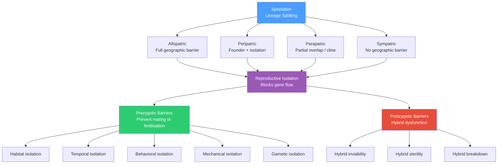

# 🔀 Speciation and Reproductive Isolation

> [!abstract] TL;DR
> Speciation is the evolutionary process by which one ancestral lineage splits into two or more lineages that can no longer interbreed; the proximate mechanism is reproductive isolation — genetic and ecological barriers that block gene flow — and the proximate genetic cause of postzygotic isolation is Dobzhansky-Muller incompatibilities, arising when alleles that diverged in allopatry prove lethal or sterility-causing when reunited in hybrids.

---

## Intuition — analogy FIRST

Imagine two software teams that fork the same codebase on day one, then work in complete isolation for a decade. Team 1 refactors module A; Team 2 refactors module B. Each codebase runs perfectly on its own. When you merge the two branches, module A from Team 1 calls functions that module B from Team 2 has renamed or removed — the merge compiles but the runtime crashes. Neither team did anything wrong in isolation; the incompatibility is a side-effect of independent evolution toward two locally consistent but mutually incompatible architectures.

Speciation is exactly this. Two populations share an ancestral genome, then diverge under their own selection pressures and drift. Each population's genome remains internally self-consistent. Derived alleles that evolved in one background may be incompatible with independently derived alleles that evolved in the other background. When the two populations hybridize, those alleles meet for the first time in the same nucleus — and the runtime crashes.

---

## How It Works

Speciation unfolds in three phases: (1) populations acquire isolation — from geography, ecology, or genomic accident; (2) they diverge independently by selection and drift; (3) enough divergence accumulates that gene flow between them is blocked even if the populations later meet. The block can operate before fertilisation (prezygotic barriers) or after (postzygotic barriers).



---

## Key Concepts / Details

### Secondary Level

**Species concepts.** Three major frameworks operationalize what "species" means:

| Concept | Core criterion | Proponent | Strength | Weakness |
|---------|---------------|-----------|----------|----------|
| Biological Species Concept (BSC) | Interbreeding + reproductive isolation | Ernst Mayr (1942) | Maps directly to gene flow; operationally clear for sexually reproducing organisms | Inapplicable to asexual lineages, fossils, and widely allopatric populations that have never met |
| Phylogenetic Species Concept (PSC) | Monophyletic clade diagnosably distinct by at least one fixed shared derived character | Cracraft (1983) | Works for asexuals and fossils; phylogenetically grounded | Inflates species counts — any fixed difference qualifies; lumps or splits depending on marker choice |
| Ecological Species Concept (ESC) | Occupying a distinct adaptive zone / niche | Van Valen (1976) | Captures adaptive significance of divergence; bridges ecology and evolution | Niche boundaries are continuous and hard to operationalise |

Modern taxonomy uses a pluralistic approach: the BSC governs sexually reproducing organisms where gene flow data exist; the PSC is applied to asexuals and fossils.

**Modes of speciation by geography:**

1. **Allopatric speciation** — a physical barrier (mountain range, ocean, glacier, desert) completely separates two populations. Gene flow drops to zero. Divergence proceeds by independent selection and drift. The vast majority of documented animal speciation events are allopatric. Classic example: Darwin's finches on separate Galápagos islands diverged in beak morphology and song while geographically isolated.

2. **Peripatric speciation** (founder-effect speciation) — a small founder population colonises an isolated habitat at the periphery of a species range. The genetic bottleneck plus isolation accelerates divergence. Proposed for island radiations: Hawaiian honeycreepers (>50 species from a single finch-like founder ~5 Mya) and *Drosophila* on the Hawaiian archipelago (>800 species, following island age sequence).

3. **Parapatric speciation** — populations are geographically contiguous but occupy different habitats; a cline (gradient of allele frequencies) forms where they meet. For differentiation to be maintained, selection against migrants must exceed migration rate. Classic example: carrion crow (*Corvus corone*) and hooded crow (*C. cornix*) form a stable hybrid zone across Europe.

4. **Sympatric speciation** — speciation without geographic isolation; gene flow is broken by ecological divergence or assortative mating within a single area. Controversial for animals; clearest examples are host-race formation in apple maggot fly (*Rhagoletis pomonella*, which shifted from hawthorn to introduced apple ~150 years ago) and explosive cichlid radiations in African crater lakes.

---

### Undergraduate Level

**Prezygotic barriers** prevent mating or fertilisation and therefore stop gene flow before any hybrid is formed. They are energetically cheaper to enforce and typically evolve faster:

| Barrier type | Mechanism | Example |
|-------------|-----------|---------|
| **Habitat isolation** | Populations prefer different microhabitats and rarely encounter each other | *Phlox* spp. on limestone vs. granite; intertidal vs. subtidal mussels |
| **Temporal isolation** | Breeding seasons or flowering times differ | Sympatric *Rana* frog species with offset calling seasons; bishop pine vs. Monterey pine (different cone serotiny) |
| **Behavioral (ethological)** | Species-specific mating signals are not recognised across species | Firefly flash patterns; bird song recognition; pheromone profiles in *Drosophila* |
| **Mechanical isolation** | Structural incompatibility of genitalia or floral morphology | Insect genitalia lock-and-key; orchid floral architecture matched to specific bee pollinators |
| **Gametic isolation** | Sperm fails to fertilise eggs of the other species; pollen tube fails to germinate | Sperm-egg recognition proteins (bindin and VERL) in sea urchins; conspecific pollen competitive advantage in angiosperms |

**Postzygotic barriers** act after mating; they are costly because resources are invested in hybrid offspring that reduce parental fitness:

| Barrier type | Definition | Haldane's rule applies? | Canonical example |
|-------------|-----------|------------------------|-------------------|
| **Hybrid inviability** | Hybrid embryos die during development before reproductive age | Yes — heterogametic sex affected first | *Drosophila melanogaster* × *D. simulans*: all F1 females die; males survive but are sterile |
| **Hybrid sterility** | Hybrids survive to adulthood but cannot reproduce | Yes — stronger in heterogametic sex | Mule (horse ♀ × donkey ♂, 2n=63): viable and robust but sterile due to meiotic failure |
| **Hybrid breakdown** | F1 hybrids are fit; F2 and later generations show reduced fitness as recessive incompatibilities emerge | Variable | *Oryza sativa* indica × japonica: F1 vigorous, F2 show 20–40% seed abortion; *Drosophila pseudoobscura* × *D. persimilis* F2 offspring |

**Haldane's rule** states: when only one sex of hybrids is sterile or inviable, it is almost always the heterogametic sex (XY males in mammals/Diptera; ZW females in birds/Lepidoptera). Two complementary mechanisms operate: (1) recessive X-linked incompatibilities are exposed in XY hybrids because there is no second X to mask them; (2) faster evolution of male reproductive proteins and sperm-associated genes on X chromosomes makes them disproportionately involved in incompatibilities.

**Reinforcement** occurs when two partially isolated populations come into secondary contact and selection against costly hybrid matings actively strengthens prezygotic isolation over time. Evidence: in *Drosophila*, sympatric pairs consistently show stronger behavioural (sexual) isolation than allopatric pairs of the same species. Reinforcement requires that the fitness cost of producing hybrids outweighs the cost of being choosy (reduced mate availability). It is the one mechanism that directly tightens prezygotic barriers as a result of postzygotic costs.

**Hybrid zones** form at secondary contact where two partially differentiated populations exchange genes:

- **Tension zone**: maintained by a balance between selection against unfit hybrids (narrows the zone) and dispersal (broadens it). Zone width $w \approx \sigma / \sqrt{s}$, where $\sigma$ is the dispersal distance per generation and $s$ is the selection coefficient against heterozygotes at incompatible loci. The zone moves toward the smaller population.
- **Mosaic zone**: rather than a smooth geographic cline, hybrids are patchily distributed across a habitat mosaic; each parental type occupies preferred habitat patches. Common in complex terrain.

---

### Graduate Level

**The Bateson-Dobzhansky-Muller (BDM) model.** Postzygotic isolation via incompatible derived alleles resolves a paradox: how can natural selection produce genomes that are internally fit yet incompatible with other lineages? The BDM model shows this is an inevitable consequence of divergence, requiring no direct selection for isolation.

Starting from ancestral genotype *aabb*:
- Population 1 fixes allele *A* at locus 1 in a *b* background — the *A–b* combination is tested by selection and found fit → *AAbb*
- Population 2 independently fixes allele *B* at locus 2 in an *a* background — the *a–B* combination is tested and found fit → *aaBB*
- On hybridisation, the F1 carries *AaBb* — the *A–B* combination has **never** been tested by natural selection in either lineage
- If *A* and *B* are biochemically or genetically incompatible (e.g., a transcription factor and its DNA-binding co-factor that co-evolved independently), the hybrid suffers reduced fitness or sterility
- Neither allele is maladaptive in its home genome; the incompatibility is purely relational

**Orr's snowball rule** (1995): With $n$ loci fixed differently in each diverging lineage, the number of incompatible pairs scales as $n(n-1)/2 \propto n^2$, while $n$ itself grows linearly with divergence time. DMI accumulation is therefore super-linear — the "snowball effect." Speciation can proceed slowly through a period of partial isolation and then complete rapidly once enough incompatibilities have accumulated.

**Speciation genes** — loci where adaptive divergence is fast enough to generate incompatibilities:

- ***OdsH* (*Odysseus*)** in *Drosophila* — a homeodomain gene under recurrent positive selection on the X chromosome. The *D. mauritiana* allele of *OdsH* is incompatible with autosomal loci from *D. simulans*, causing male hybrid sterility. The incompatibility maps to co-evolutionary conflict between the *OdsH* homeodomain and rapidly evolving centromere-associated heterochromatin proteins.
- ***Prdm9*** in mammals — a zinc-finger gene that marks meiotic recombination hotspots by trimethylating H3K4. In hybrids between house mouse subspecies (*M. m. musculus* × *M. m. domesticus*), mismatched *Prdm9* alleles create an asymmetry: each allele directs DSB formation at hotspots that are not recognized as such by the other subspecies' genome, causing chromosome asynapsis during meiosis prophase I → male hybrid sterility. *Prdm9* is the fastest-evolving gene in mammals by positive selection rate and the only speciation gene yet cloned in vertebrates.
- **Centromere-associated proteins, sperm-egg recognition proteins, piRNA pathway components, and immune genes** (e.g., MHC, *OAS* cluster) recurrently show positive selection signatures and are disproportionately represented among mapped hybrid incompatibilities.

**Chromosomal rearrangements as barriers.** Inversions, Robertsonian translocations, and chromosome fusions suppress meiotic recombination in structural heterozygotes. A chromosome segment trapped within an inversion cannot recombine freely with the non-inverted homologue → local adaptation alleles are protected from gene flow → the inversion is a "supergene" packaging local adaptations. Simultaneously, inversion heterozygotes produce unbalanced gametes at elevated rates, imposing a fitness cost. Replicated examples: *Drosophila* 3rd-chromosome inversions correlated with climate adaptation; *Anopheles gambiae* inversions on chromosome 2 linked to host preference and insecticide resistance; multiple inversions on chromosome 17q21.31 in humans associated with Neanderthal-introgressed haplotypes under recent positive selection.

**Introgression and ancient hybridization.** Reproductive isolation is rarely absolute in the short run. Neutral or beneficial alleles from one lineage can introgress (persist and spread) in a sister lineage's gene pool without causing complete fusion. Key case study: modern humans migrating out of Africa (~60–70 kya) encountered Eurasian Neanderthals and interbred; all non-African humans today carry ~2–4% Neanderthal ancestry (East Asians slightly more than Europeans; sub-Saharan Africans ~0%). Denisovan introgression reached ~2–6% in Melanesian genomes. Signatures of BDM incompatibility are visible in the introgression landscape:
- Runs of Neanderthal haplotype are strongly depleted near functional genes on autosomes — purifying selection winnowed out hybrid genotypes carrying incompatible Neanderthal alleles near exons
- The Neanderthal Y chromosome is entirely absent from modern humans — consistent with Haldane's rule-style male incompatibility acting through the Y-X interaction
- Some introgressed segments are positively selected: *EPAS1* (Denisovan, altitude adaptation in Tibetans), *OAS1/2/3* (Neanderthal, antiviral immunity), keratin gene cluster (Neanderthal, skin/hair), and *BNC2* (skin pigmentation)

**Polyploidy-driven speciation** — the dominant mode of plant speciation, responsible for an estimated 15% of angiosperm and 31% of fern speciation events:

- **Autopolyploidy**: whole-genome duplication within one species (2n → 4n). Autotetraploids are immediately reproductively isolated from diploid progenitors because tetraploid × diploid crosses produce triploids with severely disrupted meiosis. No BDM incompatibilities are required — isolation is mechanical and immediate.
- **Allopolyploidy**: inter-specific hybridisation followed by genome doubling. The allopolyploid carries both parental genomes in full and is isolated from both parents (F1 diploid hybrids are sterile; the doubled hybrid is fertile with correct disomic segregation). Three iconic examples:
  - **Bread wheat** (*Triticum aestivum*, 6n = AABBDD, 2n=42): the AB tetraploid (*T. turgidum*) arose ~0.5 Mya from hybridisation between *T. urartu* (AA donor) and an extinct *Aegilops* relative (BB donor). Under early Neolithic agriculture ~8,000–10,000 BP, *T. turgidum* crossed with *A. tauschii* (DD donor), producing hexaploid bread wheat. Each ploidy transition imposed immediate reproductive isolation.
  - **Upland cotton** (*Gossypium hirsutum*, 4n = AADD, 2n=52): allotetraploid of an Old World lineage (A genome) and a New World diploid (D genome); hybridisation occurred after trans-oceanic long-distance dispersal ~1–2 Mya, forming a species fully isolated from both progenitors.
  - **Brassica triangle of U**: three diploid species (*B. oleracea* CC, *B. rapa* AA, *B. nigra* BB) gave rise to three allotetraploids (*B. napus* = AACC = rapeseed; *B. juncea* = AABB = mustard; *B. carinata* = BBCC = Ethiopian mustard), each isolated from its progenitors and from each other.

**Hybrid speciation.** A hybrid between two species that independently establishes reproductive isolation from both parents. Allopolyploidy is the commonest mechanism. Homoploid hybrid speciation (no ploidy change) is rarer but documented in *Helianthus* sunflowers: *H. anomalus*, *H. deserticola*, and *H. paradoxus* each derive independently from *H. annuus* × *H. petiolaris* crosses (~60,000–200,000 BP) and occupy extreme habitats — active sand dunes, desert, and hypersaline marshes respectively — that neither parent can tolerate. Hybrid genomes combined salt-tolerance and drought-tolerance loci from both parents in novel combinations.

**Transposon dysgenesis as a postzygotic barrier.** Mobile element (transposon) silencing is maintained by the piRNA pathway. piRNAs are inherited maternally (loaded into the egg cytoplasm). When two lineages hybridize, paternal transposons that the maternal piRNA pool does not recognise are de-repressed → transposon burst → genome instability → reduced fitness. Classic case: *Drosophila* P-element dysgenesis. P-elements are restricted to *D. melanogaster* that acquired them from *D. willistoni* via horizontal transfer ~80 years ago. Crosses of P-element-carrying ("P-cytotype") males with M-cytotype females lacking P-element piRNAs produce sterile offspring with gonadal atrophy — a real-world transposon-driven postzygotic barrier that arose within a single species within recorded history.

---

## Python Demo

```python
# pip install numpy matplotlib
import numpy as np
import matplotlib.pyplot as plt

rng = np.random.default_rng(42)


def simulate_bdm(Ne=300, n_loci=15, mu=2e-4, s_fix=0.03, eps=0.04, generations=4000):
    """
    Simulate the Bateson-Dobzhansky-Muller (BDM) model in two isolated populations.

    Two populations diverge from a common ancestor. Each independently
    accumulates derived alleles at n_loci loci via mutation, positive
    selection (s_fix), and genetic drift (Ne).

    Any derived allele fixed in Pop1 paired with any independently fixed
    derived allele in Pop2 is one DMI pair — a combination never tested
    by selection in either lineage.  Each pair reduces hybrid fitness
    multiplicatively by (1 - eps).

    Orr (1995) snowball: DMI pairs grow as n1 * n2 ~ t^2 while loci
    fixed (n1, n2) grow linearly with time t.
    """
    freq1 = np.zeros((generations, n_loci))  # derived allele freqs in Pop1
    freq2 = np.zeros((generations, n_loci))  # derived allele freqs in Pop2

    for t in range(1, generations):
        for loc in range(n_loci):
            for freq in (freq1, freq2):
                p = freq[t - 1, loc]
                if p == 0.0:
                    # Introduce new mutation with probability mu * 2 * Ne
                    if rng.random() < mu * 2 * Ne:
                        p = 1.0 / (2 * Ne)
                elif p < 1.0:
                    # Positive selection toward fixation + Wright-Fisher drift
                    p_sel = p * (1 + s_fix) / (p * (1 + s_fix) + (1 - p))
                    count = rng.binomial(2 * Ne, p_sel)
                    p = count / (2 * Ne)
                # p >= 1.0 stays at 1.0 (already fixed)
                freq[t, loc] = p

    # Count loci fully fixed (p == 1.0) in each population per generation
    n_fixed1 = np.sum(freq1 >= 1.0, axis=1).astype(float)
    n_fixed2 = np.sum(freq2 >= 1.0, axis=1).astype(float)

    # DMI pairs: every Pop1-fixed locus is incompatible with every Pop2-fixed locus
    dmi_pairs = n_fixed1 * n_fixed2

    # Hybrid fitness: multiplicative reduction per incompatible pair
    hybrid_fitness = (1.0 - eps) ** dmi_pairs

    return freq1, freq2, n_fixed1, n_fixed2, dmi_pairs, hybrid_fitness


freq1, freq2, nf1, nf2, dmi_pairs, hf = simulate_bdm(
    Ne=300, n_loci=15, mu=2e-4, s_fix=0.03, eps=0.04, generations=4000
)

gens = np.arange(4000)
fig, axes = plt.subplots(1, 3, figsize=(15, 5))

# Panel 1: derived allele frequency trajectories in Pop1
for loc in range(15):
    axes[0].plot(gens, freq1[:, loc], alpha=0.5, linewidth=0.7)
axes[0].set_title("Pop1: Derived Allele Frequencies\n(15 loci over 4000 generations)")
axes[0].set_xlabel("Generation")
axes[0].set_ylabel("Derived allele frequency")
axes[0].set_ylim(-0.05, 1.05)

# Panel 2: fixation counts and DMI pair accumulation (Orr's snowball)
axes[1].plot(gens, nf1, label="Loci fixed in Pop1", color="#3498db", linewidth=1.5)
axes[1].plot(gens, nf2, label="Loci fixed in Pop2", color="#e74c3c", linewidth=1.5)
axes[1].plot(gens, dmi_pairs, label="DMI pairs (n1 x n2)", color="#2ecc71", linewidth=2)
axes[1].set_title("Fixation and DMI Accumulation\n(Orr's snowball: pairs grow as t squared)")
axes[1].set_xlabel("Generation")
axes[1].set_ylabel("Count")
axes[1].legend(fontsize=9)

# Panel 3: hybrid fitness decline
axes[2].plot(gens, hf, color="#9b59b6", linewidth=2)
axes[2].axhline(0.5, linestyle="--", color="gray", alpha=0.6, label="50% fitness")
axes[2].axhline(0.0, linestyle=":", color="gray", alpha=0.4)
axes[2].set_title("Expected Hybrid Fitness Decline\n(multiplicative BDM model)")
axes[2].set_xlabel("Generation")
axes[2].set_ylabel("Hybrid fitness")
axes[2].set_ylim(-0.05, 1.05)
axes[2].legend()

fig.suptitle(
    "Bateson-Dobzhansky-Muller Simulation: Two Diverging Isolated Populations\n"
    "Ne=300 | 15 loci | mu=2e-4 | s_fix=0.03 | eps=0.04 per incompatible pair",
    fontsize=12,
)
plt.tight_layout()
plt.show()

final_n1, final_n2 = int(nf1[-1]), int(nf2[-1])
print(f"Loci fixed  —  Pop1: {final_n1},  Pop2: {final_n2}")
print(f"DMI pairs at generation 4000: {int(dmi_pairs[-1])}  (= {final_n1} x {final_n2})")
print(f"Final hybrid fitness: {hf[-1]:.4f}")
half_fitness_gen = int(np.argmax(hf < 0.5)) if np.any(hf < 0.5) else ">4000"
print(f"Half-fitness threshold crossed at generation: {half_fitness_gen}")
```

---

## Real-World Notes

**Neanderthal introgression — BDM incompatibility made visible.** Modern humans migrating out of Africa (~60–70 kya) encountered Neanderthals in Eurasia and interbred. Today ~2–4% of non-African genomes are Neanderthal-derived (Denisovan introgression reaches ~2–6% in Melanesians). The introgression landscape is the fingerprint of postzygotic incompatibility: Neanderthal haplotypes are depleted near functional genes on autosomes (purifying selection removed hybrid genotypes carrying incompatible alleles near exons) and virtually absent from the X chromosome (consistent with Haldane's rule — male hybrid incompatibility through the X-autosome or X-Y axis). The Neanderthal Y chromosome is entirely absent, consistent with hybrid male incompatibility. Positively selected introgressed segments include *EPAS1* (Denisovan; altitude adaptation in Tibetans), *OAS1/2/3* (Neanderthal; antiviral immunity), and keratin gene clusters (Neanderthal; skin and hair adaptation in cold environments).

**Bread wheat and allopolyploidy.** Modern bread wheat (*Triticum aestivum*, 2n=42) carries three homeologous sets of 7 chromosomes (AABBDD). The tetraploid AB progenitor arose ~0.5 Mya; the D genome entered from *Aegilops tauschii* in early Neolithic agriculture ~8,000–10,000 BP. Each ploidy event produced immediate reproductive isolation from both parents — no BDM accumulation required. Allopolyploidy also creates new gene dosage landscapes: gluten protein composition (and therefore bread-making quality) is a direct product of subgenome interaction and homeolog dosage balance, attributes absent from either diploid parent.

**Darwin's finches and reinforcement.** The ~15 Darwin's finch species descend from a single founder flock colonising the Galápagos ~2 Mya; each island acted as an allopatric isolate. Sympatric island populations of closely related species show stronger behavioural isolation (beak size bimodality, song divergence, mate preference) than allopatric populations of the same species pairs on separate islands — the textbook signature of reinforcement. The 2004–2006 drought on Daphne Major island, studied by Peter and Rosemary Grant, demonstrated character displacement in real time: beak size diverged between sympatric *G. fortis* and *G. magnirostris* in a single generation, consistent with selection reinforcing ecological isolation to reduce competition.

---

## Common Pitfalls

- **Conflating the species concept with the speciation process.** The BSC defines species by gene flow, but speciation (the process) can be allopatric, sympatric, or polyploidy-driven. A BSC-delimited species that arose sympatrically is not a contradiction: isolation can be established by ecology or assortative mating without geography.
- **Treating hybrid zones as evolutionary dead ends.** Hybrid zones are dynamic: they can be zones of reinforcement (isolation amplified), conduits of introgression (adaptive alleles spreading from one species into another), or mosaic intermediates. Many crop-improvement traits (disease resistance, drought tolerance) entered cultivars through deliberate exploitation of hybrid zone introgression from wild relatives.
- **Assuming prezygotic barriers always evolve before postzygotic.** BDM incompatibilities accumulate during allopatry with zero contact and can be substantial before the populations ever meet. In many plant systems, polyploidy-based postzygotic isolation (triploid sterility) appears immediately upon hybridization — long before any prezygotic barrier can evolve.
- **Over-generalising Haldane's rule.** The rule applies strongly to hybrid sterility but less consistently to hybrid inviability. It does not apply to parthenogenetic lineages or hermaphroditic organisms (*Caenorhabditis*). It is a probabilistic prediction based on X-linkage of incompatibilities, not a universal biological law.
- **Ignoring Orr's snowball when estimating time to speciation.** Because DMI pairs accumulate proportional to $n^2$ rather than $n$, the transition from "partial isolation" to "complete isolation" is much faster than linear extrapolation predicts. This explains why secondary contact between recently diverged taxa often reveals surprisingly complete postzygotic isolation despite relatively small sequence divergence.
- **Equating polyploidy-derived isolation with BDM-style locus incompatibility.** Polyploidy generates immediate mechanical isolation via triploid sterility (meiotic failure from odd chromosome number) without requiring any locus-specific incompatibilities. The mechanisms are genetically distinct, operate on completely different timescales, and are manipulated by different genetic approaches in plant breeding.

---

## Related Concepts

- [[Population_Genetics_and_Hardy_Weinberg]] (Genetics/02) — $F_{ST}$ measures the between-population allele-frequency divergence that is the proximate precursor of reproductive isolation; gene flow (migration parameter $m$) is the quantity that speciation reduces to zero
- [[Comparative_Genomics_and_Synteny]] (Genetics/03) — chromosomal rearrangements detected as synteny breaks are among the primary genomic barriers to gene flow between diverging lineages; Ka/Ks identifies rapidly evolving loci that become speciation genes; ortholog/paralog relationships trace lineage splitting events
- [[Linkage_Mapping_and_Recombination]] (Genetics/02) — inversions suppress recombination in structural heterozygotes and thereby protect co-adapted allele combinations from gene flow in hybrid zones, acting as the chromosomal scaffolding of speciation
- [[Natural_Selection_Genetic_Drift_and_Bottlenecks]] (Genetics/06) — peripatric speciation is driven by the founder-effect bottleneck; selective sweeps at loci like *Prdm9* and *OdsH* provide the adaptive divergence that generates incompatibilities *(planned)*
- [[Molecular_Evolution_and_Phylogenetics]] (Genetics/06) — molecular phylogenies of diverging lineages and the molecular clock provide the timescale over which DMI pairs accumulate; phylogenetics tests whether putative speciation events correspond to true lineage splits *(planned)*
- [[_MOC_Evolutionary_and_Systems_Genetics|↑ Evolutionary and Systems Genetics MOC]]

---

## Review Questions

1. **Secondary:** Two populations of the same butterfly species are separated by a mountain range for 500,000 years. On secondary contact, females from Population A refuse to mate with males from Population B, but females from B willingly mate with males from A. Which type of reproductive isolation barrier is operating, and is it prezygotic or postzygotic? Is this situation consistent with the Biological Species Concept? What evolutionary mechanism might explain the asymmetry in female preference?

2. **Undergraduate:** Two closely related plant species hybridize naturally, producing F1 hybrids that are vigorous but completely sterile. A spontaneous genome-doubling event in one F1 individual produces a viable allotetraploid. (a) Explain why the allotetraploid is immediately reproductively isolated from both parental species without requiring any accumulated BDM incompatibilities. (b) Explain why the diploid F1 is sterile while the allotetraploid is fertile, with reference to meiosis. (c) Name two allopolyploid crop species and identify their genomic constitutions (e.g., AADD).

3. **Graduate:** A genomic survey of two subspecies of house mouse (*M. m. musculus* and *M. m. domesticus*) across their hybrid zone reveals: (a) autosomal introgression extends ~200 km either side of the contact zone; (b) X-chromosome introgression is essentially zero; (c) the *Prdm9* locus shows the highest $F_{ST}$ outlier value in the genome; (d) male hybrids show elevated meiotic arrest and asynapsis relative to female hybrids. Using the BDM model, Haldane's rule, and the molecular function of *Prdm9*, construct a mechanistic explanation for all four observations. Then design one genetic experiment (e.g., using knock-in or transgenic mice) that would confirm the causal role of *Prdm9* allelic divergence in male hybrid dysfunction.

---

## Sources

- Coyne, J. A. & Orr, H. A. — *Speciation* (Sinauer Associates, 2004)
- Mayr, E. — *Systematics and the Origin of Species* (Columbia University Press, 1942)
- Dobzhansky, T. — *Genetics and the Origin of Species* (Columbia University Press, 1937)
- Orr, H. A. (1995) — "The population genetics of speciation: the evolution of hybrid incompatibilities", *Genetics* 139: 1805–1813
- Phadnis, N. & Orr, H. A. (2009) — "A Single Gene Causes Both Male Sterility and Segregation Distortion in *Drosophila* Hybrids", *Science* 323: 376–379 (*OdsH*)
- Mihola, O. et al. (2009) — "A Mouse Speciation Gene Encodes a Meiotic Histone H3 Methyltransferase", *Science* 323: 373–375 (*Prdm9*)
- Green, R. E. et al. (2010) — "A Draft Sequence of the Neandertal Genome", *Science* 328: 710–722
- Payseur, B. A. & Rieseberg, L. H. (2016) — "A genomic perspective on hybridization and speciation", *Molecular Ecology* 25: 2337–2360
- Rieseberg, L. H. (1997) — "Hybrid origins of plant species", *Annual Review of Ecology and Systematics* 28: 359–389

---

#Genetics #EvolutionaryGenetics #Speciation #ReproductiveIsolation
