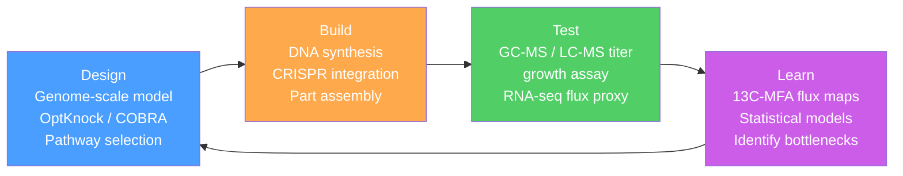

# Synthetic Biology and Metabolic Engineering

> [!abstract] TL;DR
> Synthetic biology applies engineering principles — standardized parts, modular abstraction, and iterative design cycles — to program living cells; metabolic engineering redirects cellular chemistry to produce fuels, drugs, and materials that nature rarely makes in quantity.

## Intuition — analogy FIRST

Think of a living cell as a **programmable factory floor**. The factory already runs thousands of chemical reactions, carries its own power supply, and self-replicates. Synthetic biology is the discipline of writing new "job orders" — genetic programs — that tell the factory to assemble new products from its existing supply chain (metabolism) or to behave in coordinated ways it would never evolve on its own (genetic circuits). Metabolic engineering is the sub-specialty of retooling specific production lines: diverting raw materials away from the cell's usual output, adding borrowed enzymes from exotic organisms, and unclogging bottlenecks so that one chosen compound pours out at industrial scale.

The key insight is that biology already solved protein synthesis, membrane transport, energy coupling, and cofactor recycling — problems that would be impossibly hard to engineer from scratch. Synthetic biologists exploit that solved infrastructure and add a thin layer of programmable logic on top.

---

## How It Works

### The Abstraction Hierarchy

Inspired by electrical engineering, synthetic biology formalises three levels:

| Level | Contents | Example |
|-------|----------|---------|
| **Parts** | Individual functional DNA sequences | Promoter J23101, RBS B0034, terminator B0015 |
| **Devices** | Assembled parts performing one function | Toggle switch, AND gate, oscillator |
| **Systems** | Networks of devices achieving a cellular behaviour | Artemisinin biosynthesis pathway, cancer-sensing cell |

**BioBricks** (standard RFC 10 format) encode every part flanked by identical restriction sites (EcoRI–XbaI upstream, SpeI–PstI downstream), so parts can be assembled by iterative ligation without re-designing junctions. The **SBOL (Synthetic Biology Open Language)** data standard provides a machine-readable, visual notation for sharing designs across labs and tools (gRNA, CDS, promoter glyphs are all standardised).

### Genetic Circuit Design

**Toggle switch (Gardner et al., 2000, *Nature*):** Two repressors, A and B, are wired in mutual inhibition: A represses the gene encoding B, and B represses the gene encoding A. The resulting system is **bistable** — stable in either the "A-high / B-low" or the "A-low / B-high" state, with switching triggered by a transient input (heat-shock or IPTG). It is the genetic analog of an SR flip-flop.

**Repressilator (Elowitz & Leibler, 2000, *Nature*):** Three repressors (LacI → TetR → λCI → LacI) form a cyclic chain. Each represses the next and is repressed by the previous one. The system sustains autonomous oscillations with a period roughly equal to twice the total circuit delay — the genetic analog of a ring oscillator. It demonstrated that gene network topology alone can generate temporal patterns without any oscillatory input from the cell.

**Logic gates from gene networks:**

| Gate | Implementation | Output |
|------|---------------|--------|
| NOT | Single repressor | High only when input is low |
| AND | Two promoters each required for output | High only when both inputs are high |
| OR | Two independent promoters driving same gene | High when either input is high |
| NAND | AND gate feeding a NOT gate | Low only when both inputs are high |

**Chassis organisms** are chosen for how well the standard genetic toolkit works in them:
- *E. coli* K-12: fastest doubling time (~20 min), best-characterised genome, widest available part library; preferred for prototyping.
- *S. cerevisiae* BY4741/CEN.PK: eukaryotic secretion and post-translational modification, compartmentalised metabolism (cytoplasm, ER, mitochondria), GRAS status; preferred for complex natural product synthesis.
- CHO (Chinese hamster ovary) cells: required for human-compatible glycosylation of therapeutic proteins; slower to engineer but clinically essential.

### Metabolic Engineering — Flux Redirection

Cellular metabolism is a network of enzymatic reactions. Native flux is distributed to maximise growth. Metabolic engineers intervene to:

1. **Overexpress** rate-limiting enzymes in the target pathway.
2. **Delete** competing branch-point reactions that divert precursors.
3. **Import heterologous genes** from organisms that natively produce the target compound.
4. **Balance cofactors** (NADPH/NADH, ATP, CoA) to avoid thermodynamic bottlenecks.
5. **Engineer transcriptional regulators** to coordinate pathway expression with growth phase.

The **DBTL cycle** (Design–Build–Test–Learn) structures this iterative process:



### Genome-Scale Metabolic Models and Flux Balance Analysis

A **genome-scale metabolic model (GEM)** represents every reaction in a cell's metabolism as a stoichiometric matrix **S** (m metabolites × n reactions). At steady state:

$$\mathbf{S} \cdot \mathbf{v} = \mathbf{0}$$

where **v** is the flux vector. The system is underdetermined (more reactions than metabolites), so **flux balance analysis (FBA)** maximises an objective (typically growth rate, or target product flux) subject to:
- Steady-state constraint: **S · v = 0**
- Thermodynamic bounds: $v_i^{min} \le v_i \le v_i^{max}$ (irreversible reactions have $v_i \ge 0$)
- Uptake rates fixed by experimental measurements (glucose, oxygen)

The **COBRA Toolbox** (Python/MATLAB) provides GEMs for hundreds of organisms and solves the LP. iML1515 is the gold-standard *E. coli* GEM (1515 genes, 2712 reactions).

**OptKnock** extends FBA to strain design: it solves a bilevel optimisation where the inner problem maximises growth and the outer problem selects which gene knockouts force the cell to couple growth with target compound production — "growth-coupled production" ensures evolutionary stability.

### Cell-Free Systems

When chassis organismal metabolism is inconvenient (toxicity, regulatory overhead, cofactor imbalance), cell-free transcription-translation (**TX-TL**) systems extract the cellular machinery into a test tube:

- **PURE system** (Protein synthesis Using Recombinant Elements): 36 purified components (ribosomes, all translation factors, aminoacyl-tRNA synthetases, EF-Tu/Ts/G, RNA polymerase, energy regeneration enzymes) — fully defined, highly reproducible, no host metabolism.
- **Cell extract systems** (e.g., BL21 lysate): faster to prepare, higher yield, contains endogenous metabolic enzymes — useful for prototyping circuits and co-factor-dependent biosynthesis without live cells.

Applications: rapid prototyping (hours instead of days), on-demand biosynthesis, diagnostics (SHERLOCK, LAMP), and production of cytotoxic proteins.

### Biosafety and Biocontainment

Four complementary strategies prevent engineered organisms from surviving outside the lab:

| Strategy | Mechanism | Limitation |
|----------|-----------|------------|
| **Auxotrophic containment** | Essential amino acid synthesis gene deleted; viability requires supplemented media | Horizontal gene transfer can restore wild-type |
| **Kill switches** | Toxin gene (colicin, MazF) expressed if inducer (absent in environment) is removed; also temperature-sensitive repressors | Selection pressure to silence the switch |
| **Semantic containment** | Reassign stop codons or sense codons to unnatural amino acids (ncAA); EV proteins are non-functional without lab-supplied ncAA | Requires entire proteome re-engineering for full containment |
| **Xenobiology** | Incorporate unnatural base pairs (dNaM-dTPT3, Benner bases) into the genetic alphabet; replication requires synthetic triphosphates unavailable in the environment | Still under development for whole-genome deployment |

The Romesberg lab (Scripps, 2019) created a semi-synthetic organism whose plasmid contained dNaM-dTPT3 base pairs encoding a fifth and sixth nucleotide; without the synthetic nucleotide transporter, the unnatural bases were diluted out over cell divisions — a replication-dependent kill switch.

---

## Key Concepts / Details

### Secondary Level

**Why is standardization so powerful?** Before BioBricks, researchers had to re-characterise every DNA element in each new genetic context — a promoter that worked well in one construct might behave completely differently in another due to sequence context effects. Standardization means published characterisation data (e.g., "this promoter drives 450 REUs in *E. coli* MG1655 at 37°C") is portable: a lab in Seoul can replicate a circuit designed in Boston without repeating every calibration experiment.

**Metabolic flux as currency:** A cell has a fixed budget of carbon entering from glucose. Every mole of carbon devoted to growing cell biomass is a mole not available for your target product. The art of metabolic engineering is finding the set of modifications — deletions, overexpressions, imports — that re-allocates flux toward product while leaving enough growth to keep the culture viable. Too aggressive a redirect and the strain grows so slowly it gets outcompeted by spontaneous revertants.

**The artemisinin story:** Malaria kills ~600,000 people per year. Its front-line treatment, artemisinin, comes from the sweet wormwood plant *Artemisia annua* at low yield (~0.01% dry weight). Jay Keasling's lab (UC Berkeley) spent a decade engineering *S. cerevisiae* to produce artemisinic acid — the immediate precursor — by: (a) importing eight plant/bacterial enzymes (ADS, CYP71AV1, CPR1, CYB5, ADH1, ALDH1, ERG20-F96W, tHMGR), (b) upregulating the yeast mevalonate pathway to flood the cell with IPP/DMAPP precursors, (c) expressing a bacterial *upc2-1* transcription factor to boost sterol precursor pools. The resulting strain produced 25 g/L artemisinic acid in fed-batch fermentation (Paddon et al., 2013) — a 25,000-fold improvement over initial titers. Sanofi licensed the process; semi-synthetic artemisinin now supplies ~60 million treatment courses per year.

---

### Undergraduate Level

**Hill-function repressor kinetics in toggle switches:**

The Gardner toggle is governed by two dimensionless Hill equations. Letting *u* = normalized concentration of repressor A and *v* = normalized concentration of repressor B:

$$\frac{du}{dt} = \frac{\alpha_1}{1 + v^{\beta}} - u \qquad \frac{dv}{dt} = \frac{\alpha_2}{1 + u^{\gamma}} - v$$

- $\alpha_1, \alpha_2$: effective promoter strengths (synthesis rate / degradation rate).
- $\beta, \gamma$: Hill coefficients measuring cooperativity of repression.

Bistability requires that the nullclines ($du/dt = 0$ and $dv/dt = 0$ curves) intersect three times — two stable steady states separated by one unstable saddle point. Increasing $\beta$ or $\gamma$ sharpens the nonlinearity and broadens the parameter space in which bistability exists. For $\beta = \gamma = 2$ and $\alpha_1 = \alpha_2 = 3$, the system is reliably bistable; for Hill coefficients near 1, bistability disappears and the system relaxes to a single fixed point.

**Flux balance analysis in detail:**

The stoichiometric matrix **S** has entry $S_{ij}$ = stoichiometric coefficient of metabolite $i$ in reaction $j$ (negative for consumed, positive for produced). For *E. coli* growing on glucose, the LP:

$$\text{maximise} \quad c^T v$$
$$\text{subject to} \quad S v = 0, \quad v^{lb} \le v \le v^{ub}$$

where $c$ is a vector selecting the biomass reaction. Shadow prices (dual variables) identify the metabolites whose relaxation would most increase growth — i.e., limiting cofactors and precursors — directly pointing to engineering targets. Reduced costs identify reactions that, if knocked out, force flux rerouting.

**CRISPR-based metabolic engineering:** Modern DBTL cycles use Cas9 (or Cas12a for *S. cerevisiae*) to: (a) knock out competing pathways (gene deletion), (b) knock in heterologous enzymes at safe harbour loci, (c) CRISPRi (dCas9-KRAB) to fine-tune downregulation without deletion — critical when a gene is essential under some conditions and deletable only during exponential growth. **Multiplex automated genome engineering (MAGE)** in *E. coli* uses cyclic lambda Red recombination with a pool of ssDNA oligos to simultaneously introduce dozens of mutations across the genome within hours, enabling rapid combinatorial strain optimization.

**Directed evolution as a metabolic engineering tool:** When a heterologous enzyme is kinetically too slow or has poor substrate specificity for the host's metabolite pool, directed evolution (random mutagenesis + screening/selection) can improve turnover ($k_{cat}$) and $K_m$ without knowing the structure. Frances Arnold's lab showed that cytochrome P450 BM3, evolved over 10 rounds, accepted non-native substrates (propane, silane, carbene donors) with activities millions of times above the wild-type background — a pattern repeated for dozens of industrial enzymes.

**13C Metabolic Flux Analysis (13C-MFA):** Feeding cells with 13C-labelled glucose (e.g., 1-13C or U-13C6-glucose) generates label patterns in downstream metabolites that depend on which enzymatic routes the carbon traversed. GC-MS or NMR measures the isotopologue distribution in proteinogenic amino acids. Computational fitting of flux parameters to these isotopologue distributions (EMU framework) yields absolute fluxes (mmol/gDCW/h) with measurement-based error bounds — far more information than stoichiometric FBA alone. This reveals hidden metabolic cycles (e.g., futile cycling in pentose phosphate pathway) that consume ATP or NADPH without net carbon output.

---

### Graduate Level

**Phase separation and metabolic channeling:** A long-standing challenge in metabolic engineering is that sequentially-acting pathway enzymes are diluted across the cytoplasm; intermediates can diffuse away, be diverted by competing reactions, or accumulate to toxic levels. Recent strategies scaffold enzyme complexes using:
- **Protein scaffolds:** SH3/PDZ/GBD interaction domain chains that tether enzymes with defined stoichiometry (Dueber et al., *Nature Biotechnology* 2009). Optimising scaffold architecture increased mevalonate production 77-fold.
- **RNA scaffolds:** MS2/PP7/boxB aptamers embedded in a non-coding RNA backbone recruit enzyme-coat protein fusions into spatial proximity.
- **Phase-separated condensates:** Engineered IDR (intrinsically disordered region) fusions drive liquid-liquid phase separation into cytoplasmic droplets that concentrate pathway enzymes and exclude competing reactions. This is analogous to the natural purinosome or pyrinosome metabolon.

**Minimal cells and genome reduction:** The JCVI-syn3A project (Hutchison et al., *Science* 2016) designed and chemically synthesised a 531 kb mycoplasma-like genome containing 473 genes — the minimum required for self-replication in rich media. Surprisingly, 149 genes had no assigned function. Minimal-cell chassis offer reduced metabolic burden (no competing biosynthesis), predictable resource allocation, and improved orthogonality for synthetic circuits, but at the cost of fragility (any auxotrophic deficiency is lethal without external supplementation).

**Genetic code expansion and recoded organisms:** The Chin lab (MRC LMB) and Schultz lab have reassigned amber stop codons (UAG) genome-wide, then abolished RF1 (release factor 1) to create cells that read UAG exclusively as an amino acid codon. Inserting an orthogonal aminoacyl-tRNA synthetase / tRNA pair allows site-specific incorporation of any of >200 engineered non-canonical amino acids (ncAAs) — photo-crosslinkers, bio-orthogonal handles (azides, alkynes), redox-active ferrocene — into recombinant proteins. The recoded *E. coli* strain C321.ΔA is itself a biocontainment mechanism: circuits that depend on a ncAA-containing essential protein cannot function in any organism lacking the ncAA supply.

**Orthogonal ribosome (riboswitch) design:** Chin et al. engineered ribosomes with mutated 16S rRNA that pair only with mRNAs carrying a cognate orthogonal Shine-Dalgarno (SD) sequence. Synthetic genes encoding toxic or expensive proteins are placed under orthogonal SD control — the host ribosomes ignore them; only the orthogonal ribosomes translate the synthetic mRNA. This decouples synthetic protein expression from global translational capacity, allowing simultaneous optimization of host cell growth and recombinant product synthesis.

**Multi-organism consortia engineering:** A single-chassis cell faces thermodynamic and metabolic limits: certain pathway intermediates are toxic, cofactor demand is non-stoichiometric, and a 20-enzyme heterologous pathway taxes any single cell. Division of labour across multiple engineered strains (e.g., one *E. coli* strain converts glucose to an intermediate; a second converts the intermediate to the final product) mimics industrial chemical cascades. Spatial and temporal control of cross-feeding is achieved by quorum-sensing-coupled gene expression, enabling stable coexistence that is self-regulating — the consortium produces the optimal ratio of strains for maximum yield without external intervention.

---

## Python Demo

```python
# Genetic Toggle Switch — ODE simulation, phase portrait, and time traces
# Gardner et al. (2000) bistable model:
#   du/dt = alpha1 / (1 + v^beta) - u    (Repressor A)
#   dv/dt = alpha2 / (1 + u^gamma) - v   (Repressor B)
# Units are normalised (concentration / K_d); time is in units of 1/degradation_rate.

import numpy as np
from scipy.integrate import solve_ivp
import matplotlib.pyplot as plt
import matplotlib.gridspec as gridspec

# ── Model parameters ─────────────────────────────────────────────────────────
alpha1 = 3.0   # effective promoter strength for repressor A
alpha2 = 3.0   # effective promoter strength for repressor B
beta   = 2.5   # Hill coefficient: cooperativity of B repressing A
gamma  = 2.5   # Hill coefficient: cooperativity of A repressing B
T_END  = 30.0  # dimensionless time units to simulate


def toggle(t, y):
    u, v = y
    dudt = alpha1 / (1.0 + v ** beta)  - u
    dvdt = alpha2 / (1.0 + u ** gamma) - v
    return [dudt, dvdt]


# ── Time traces for three initial conditions ─────────────────────────────────
initial_conditions = [
    (0.1, 4.0, "State-1 basin\n(A-low, B-high)", "steelblue"),
    (4.0, 0.1, "State-2 basin\n(A-high, B-low)", "tomato"),
    (1.5, 1.5, "Near saddle point",              "goldenrod"),
]

t_span = (0.0, T_END)
t_eval = np.linspace(0.0, T_END, 600)

fig = plt.figure(figsize=(13, 5))
gs  = gridspec.GridSpec(1, 2, figure=fig)

ax_time   = fig.add_subplot(gs[0, 0])
ax_phase  = fig.add_subplot(gs[0, 1])

for u0, v0, label, color in initial_conditions:
    sol = solve_ivp(toggle, t_span, [u0, v0], t_eval=t_eval, method="RK45", rtol=1e-8)
    ax_time.plot(sol.t, sol.y[0], color=color,  lw=2,   label=f"A ({label})")
    ax_time.plot(sol.t, sol.y[1], color=color,  lw=2, ls="--")
    ax_phase.plot(sol.y[0], sol.y[1], color=color, lw=1.8, label=label)
    ax_phase.plot(u0, v0, "o", color=color, ms=8)

ax_time.set_xlabel("Dimensionless time", fontsize=11)
ax_time.set_ylabel("Normalised concentration", fontsize=11)
ax_time.set_title("Time traces: A (solid) vs B (dashed)", fontsize=12)
ax_time.legend(fontsize=8)

# ── Nullclines on phase portrait ─────────────────────────────────────────────
u_vals = np.linspace(0.01, 5.0, 400)
v_vals = np.linspace(0.01, 5.0, 400)

# du/dt = 0  →  v = (alpha1/u - 1)^(1/beta)  where alpha1/u > 1
v_nullcline = np.where(alpha1 / u_vals > 1.0,
                       (alpha1 / u_vals - 1.0) ** (1.0 / beta), np.nan)
# dv/dt = 0  →  u = (alpha2/v - 1)^(1/gamma)  where alpha2/v > 1
u_nullcline = np.where(alpha2 / v_vals > 1.0,
                       (alpha2 / v_vals - 1.0) ** (1.0 / gamma), np.nan)

ax_phase.plot(u_vals, v_nullcline, "k-",  lw=1.5, label="du/dt = 0 (A nullcline)")
ax_phase.plot(u_nullcline, v_vals, "k--", lw=1.5, label="dv/dt = 0 (B nullcline)")

ax_phase.set_xlim(0, 5)
ax_phase.set_ylim(0, 5)
ax_phase.set_xlabel("Repressor A (normalised)", fontsize=11)
ax_phase.set_ylabel("Repressor B (normalised)", fontsize=11)
ax_phase.set_title("Phase portrait — bistable toggle switch", fontsize=12)
ax_phase.legend(fontsize=8)

plt.suptitle(
    f"Gardner Toggle Switch  |  alpha1={alpha1}, alpha2={alpha2}, "
    f"beta={beta}, gamma={gamma}",
    fontsize=10, y=1.01
)
plt.tight_layout()
plt.show()

# Expected output:
#   Blue trajectory (A-low start)  →  stable state: A ~ 0.2, B ~ 2.9
#   Red  trajectory (A-high start) →  stable state: A ~ 2.9, B ~ 0.2
#   Gold trajectory (near saddle)  →  system is sensitive to tiny perturbation;
#     slight asymmetry in alpha1 vs alpha2 will tip it to one basin.
# The nullclines cross at THREE points: two stable nodes + one unstable saddle.
```

The nullclines cross at three points. The two outer intersections are stable fixed points (the two cellular "memories"); the middle intersection is an unstable saddle — tiny noise tips the trajectory toward one attractor. In the real Gardner switch, transient IPTG (drives up *lacI* expression → pushes to A-high state) or transient heat shock (inactivates cI → pushes to B-high state) flips the cell between states reliably.

---

## Real-World Applications

**Artemisinin biosynthesis (Keasling lab / Amyris / Sanofi, 2006–2013):** The complete demonstration that a 14-enzyme pathway (eight heterologous) could be installed in *S. cerevisiae* to produce 25 g/L artemisinic acid proved that metabolic engineering is industrially viable for complex natural products. The mevalonate pathway was the scaffold: endogenous IPP/DMAPP → FPP → amorphadiene (via plant ADS synthase) → artemisinic acid (via three-step oxidation by CYP71AV1). This project also established the DBTL paradigm as standard practice and pioneered the use of FBA + 13C-MFA together.

**Insulin, human growth hormone, and therapeutic proteins (*E. coli* / CHO, 1982–present):** The first FDA-approved recombinant protein, Humulin insulin (Genentech/Eli Lilly, 1982), expressed human *INS* gene in *E. coli*. This required synthetic gene synthesis (the natural human cDNA contained eukaryotic splice signals), optimised codon usage, and a disulfide bond-enabling secretion signal. Modern therapeutic proteins (monoclonal antibodies, erythropoietin, Factor VIII) use CHO cells that deliver human-compatible glycosylation unavailable in prokaryotic chassis — a direct example of chassis selection dictating product quality.

**1,3-Propanediol (DuPont / Genencor, 2006):** A 2-billion-pound/year polymer building block was produced by engineering *E. coli* with two heterologous pathways (glycerol-3-phosphate dehydratase from *Klebsiella* and 1,3-propanediol oxidoreductase from *C. freundii*) plus 24 additional genetic modifications to balance NADH, improve glycerol import, and redirect central carbon flux. Yield reached 51% of theoretical maximum — the benchmark for industrial metabolic engineering and the first product to enter billion-dollar production from a DBTL-optimised strain.

---

## Common Pitfalls

- **Ignoring metabolic burden.** Every heterologous gene consumes ribosomes, tRNA, and ATP for expression. A 10-enzyme pathway can reduce growth rate 40–60% and create strong selection pressure for mutations that silence the constructs. Using inducible promoters (Ptrc, Pgal1) to delay pathway induction until late exponential phase, or embedding expression in chromosomally stable loci rather than high-copy plasmids, mitigates this.
- **Assuming Parts are context-independent.** A BioBrick promoter strength rating measured in one genetic context is not reliable in another. The local sequence around a promoter (UP elements, RNase E sites in mRNA), ribosome binding site spacing, and downstream gene affect apparent activity by orders of magnitude. Characterise every part in the target chassis and genetic context, not just by registry data.
- **Ignoring cofactor imbalance.** Many heterologous pathways are NADPH-dependent while *E. coli* central metabolism preferentially regenerates NADH. Expressing a transhydrogenase (UdhA) or engineering the pentose phosphate pathway to overproduce NADPH is frequently required. FBA typically flags this: the shadow price of NADPH becomes very large, indicating it is the binding constraint on flux.
- **Treating FBA outputs as ground truth.** FBA assumes steady state and optimal cellular behaviour. Real cells are not optimal: regulatory responses (catabolite repression, overflow metabolism producing acetate) divert flux away from the FBA prediction. Always validate with 13C-MFA or metabolomics; do not pipeline OptKnock predictions directly to experiment without wet-lab verification.
- **Kill switch reliability.** A simple toxin-antitoxin kill switch placed on a plasmid is silenced with ~10^-6 probability per cell division by spontaneous mutation or plasmid loss. For genuine containment, multiple independent, chromosomally integrated kill switches targeting different essential functions — combined with auxotrophic containment — are required. No single-mechanism kill switch is considered biosafe for environmental release by current regulatory standards.
- **Bistability sensitivity to noise.** The toggle switch is a gradient device near the saddle point: small stochastic fluctuations in mRNA/protein levels can cause unintended state switching. Increasing protein half-lives (reducing proteolysis) and increasing Hill coefficients (more cooperative promoters) both increase robustness but at the cost of slower switching kinetics. Designing circuits without quantifying noise characteristics leads to unreliable digital logic behaviour in living cells.

---

## Related Concepts

- [[Gene_Regulation_and_Epigenetics]] — toggle switches and repressilators are built on promoter-TF interactions; Hill-equation bistability described here is the same cooperative binding described in the epigenetics note for gene expression thresholds (Genetics/01_Molecular_Genetics)
- [[Systems_of_ODEs]] — the Gardner toggle switch and repressilator are both autonomous ODE systems; nullcline analysis, fixed-point stability, and phase portraits used here are covered in depth in this Mathematics note (Mathematics/07_Differential_Equations)
- [[Chemical_Kinetics]] — enzymatic rate laws (Michaelis-Menten, Hill equation) and reaction network analysis underpin both genetic circuit kinetics and the stoichiometric models used in FBA (Chemistry/02_Physical_Chemistry)
- [[Membranes_and_Cell_Signaling]] — quorum sensing and inducible promoter systems used to trigger synthetic gene circuits depend on small-molecule signal transduction pathways covered here; CHO cell glycosylation requires ER membrane trafficking described in this note (Chemistry/06_Biochemistry)
- [[_MOC_Evolutionary_and_Systems_Genetics|↑ Evolutionary and Systems Genetics MOC]]

---

## Review Questions

1. **(Secondary)** The Gardner toggle switch can be flipped from the "B-high" state to the "A-high" state by a pulse of IPTG. Explain, using the mutual repressor model, why the pulse only needs to be temporary yet the new state persists after the inducer is removed.

2. **(Undergraduate)** A metabolic engineer wants to maximise production of lycopene (a C40 isoprenoid) in *E. coli*. FBA of iML1515 predicts that knocking out *pgi* (phosphoglucose isomerase) increases NADPH availability and redirects flux into the pentose phosphate pathway. (a) Sketch the expected changes in central carbon flux distribution. (b) What growth phenotype would you observe after the *pgi* knockout? (c) How would you use 13C-MFA with [1-13C]-glucose to verify that the PPP flux actually increased?

3. **(Graduate)** You have engineered an 8-enzyme heterologous pathway in *S. cerevisiae* that produces a terpenoid at 500 mg/L in a 2 L shake flask but only 80 mg/L in a 200 L fed-batch bioreactor. Propose three mechanistic hypotheses — one related to oxygen transfer, one to dissolved CO2 accumulation, and one to genetic instability — that could explain the scale-down discrepancy, and describe the experiment that would distinguish between them.

---

## Sources

- Gardner, T.S., Cantor, C.R. & Collins, J.J. (2000). "Construction of a genetic toggle switch in *Escherichia coli*." *Nature*, 403, 339–342. https://doi.org/10.1038/35002131
- Elowitz, M.B. & Leibler, S. (2000). "A synthetic oscillatory network of transcriptional regulators." *Nature*, 403, 335–338. https://doi.org/10.1038/35002125
- Paddon, C.J. et al. (2013). "High-level semi-synthetic production of the potent antimalarial artemisinin." *Nature*, 496, 528–532. https://doi.org/10.1038/nature12051
- Orth, J.D., Thiele, I. & Palsson, B.Ø. (2010). "What is flux balance analysis?" *Nature Biotechnology*, 28, 245–248. https://doi.org/10.1038/nbt.1614
- Dueber, J.E. et al. (2009). "Synthetic protein scaffolds provide modular control over metabolic flux." *Nature Biotechnology*, 27, 753–759. https://doi.org/10.1038/nbt.1557
- Burgard, A.P., Pharkya, P. & Maranas, C.D. (2003). "Optknock: a bilevel programming framework for identifying gene knockout strategies for microbial strain optimization." *Biotechnology and Bioengineering*, 84, 647–657.
- Hutchison, C.A. III et al. (2016). "Design and synthesis of a minimal bacterial genome." *Science*, 351, aad6253. https://doi.org/10.1126/science.aad6253
- Cameron, D.E., Bashor, C.J. & Collins, J.J. (2014). "A brief history of synthetic biology." *Nature Reviews Microbiology*, 12, 381–390.

---

#Genetics #EvolutionaryGenetics #SyntheticBiology #MetabolicEngineering
