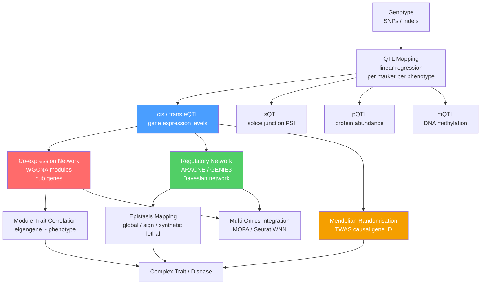

# Systems Genetics and Gene Networks

> [!abstract] TL;DR
> Systems genetics treats the genome as a wiring diagram — it maps genetic variants not just to phenotypes but to the molecular network in between, instrumenting gene expression (eQTL), splicing (sQTL), protein levels (pQTL), and DNA methylation (mQTL) as intermediate phenotypes, then reconstructing co-expression modules, regulatory hierarchies, and epistatic interactions to explain how genetic variation propagates into complex traits.

---

## Intuition — analogy FIRST

Think of a city power grid. Classical genetics identifies which substations fail when the city goes dark — it maps variants to traits one-to-one, gene by gene. Systems genetics instead maps the **whole grid**: which power lines are co-regulated, which substations are critical hubs (remove one and half the city loses power), and which failures cascade silently because the grid has built-in redundancy. An eQTL is discovering that flipping a switch in one neighbourhood dimmed fifty blocks downstream; a WGCNA co-expression module is finding that 200 street lights always dim and brighten in lockstep; genetic buffering is the backup generator that absorbs the fault invisibly — until you disable *that* too.

In technical terms: genotype shapes phenotype not through a single direct path but through a layered molecular network. Systems genetics instruments that network using genetic variants as natural perturbations, simultaneously measuring thousands of molecular phenotypes to reconstruct which genes regulate which others, where variants exert their effects, which network nodes are essential, and where redundancy hides genetic variation from selection.

---

## How It Works

### The Systems Genetics Framework

The core model places **molecular phenotypes** — the transcriptome, proteome, metabolome, and epigenome — as intermediate layers between genotype and organismal trait:

```
Genotype (SNPs / indels)
    ↓  QTL mapping at each layer
Molecular Phenotypes (mRNA · protein · metabolite · methylation · chromatin)
    ↓  network inference + epistasis
Complex Trait (disease · fitness · behavior)
```

At each molecular layer, **quantitative trait locus (QTL) mapping** performs a linear regression of the molecular phenotype on genotype at every marker across the genome. This is identical in statistical structure to classical QTL analysis, but the phenotypes are now genomic-scale molecular readouts, giving mechanistic resolution into regulatory logic.

### Expression QTL (eQTL): Cis vs Trans

An **eQTL** is a genetic variant whose genotype statistically associates with the expression level of a gene across individuals. Two classes are distinguished by the distance between the variant and its target gene.

**Cis-eQTL (local):**
- The variant lies within ~1 Mb of the gene it regulates.
- Mechanism: alters a *cis*-regulatory element — promoter, enhancer, splice site, 3′-UTR stability element — directly affecting transcription or post-transcriptional processing of the adjacent gene.
- Properties: numerous (80–90% of all eQTL signals), large in effect size, tissue-specific, highly reproducible across cohorts.
- Example: a SNP in the *SORT1* promoter (chr1p13) disrupts a C/EBP binding motif, reducing hepatic *SORT1* expression; this cis-eQTL colocalises with the strongest GWAS hit for LDL cholesterol, implicating *SORT1* as the causal gene rather than neighbouring *CELSR2*.

**Trans-eQTL (distal):**
- The variant lies >5 Mb from, or on a different chromosome to, its target gene.
- Mechanism: alters a *trans*-acting factor — a transcription factor, signalling kinase, or RNA-binding protein — whose activity then modulates many distal target genes.
- Properties: individually small in effect, require $N > 1{,}000$ for reliable detection because the testing burden is ~20,000 target genes × 6 million SNPs; a variant with hundreds of trans-eQTL targets is likely changing the abundance of a master regulator.
- Example: variants at *GATA1* in blood show hundreds of trans-eQTL targets that match the GATA1 regulon — the variant modulates the master erythroid transcription factor, and all its downstream targets co-vary.

**GTEx Project:** The Genotype-Tissue Expression consortium profiled RNA-seq across 49 human tissues from >2,000 post-mortem donors (v10 release). GTEx catalogued >100,000 cis-eQTL genes. Crucially, ~40% of GWAS loci for complex traits share their causal variant with a tissue-specific cis-eQTL, providing mechanistic hypotheses at otherwise opaque association signals: pancreatic islet eQTLs explain type 2 diabetes hits; prefrontal cortex and hippocampal eQTLs explain schizophrenia loci.

### The Full Molecular QTL Landscape

Beyond expression, genetic variants can be mapped as QTLs for any quantifiable molecular phenotype:

| QTL type | Molecular phenotype measured | Key resource | Biological insight |
|----------|------------------------------|-------------|-------------------|
| **eQTL** | Gene expression (RNA-seq, TPM) | GTEx, eQTLGen | Regulatory element function, TF binding disruption |
| **sQTL** | Splice junction usage (percent-spliced-in, PSI) | GTEx LeafCutter, ENCODE | Variant alters splice site strength or splicing regulator binding |
| **pQTL** | Protein abundance (SomaScan, Olink, mass spec) | deCODE Genetics, UKB-PPP | Post-transcriptional regulation; often diverges from eQTL |
| **mQTL** | CpG DNA methylation (M-value or beta-value) | ARIES, MRC-IEU | Variant disrupts a TFBS, enabling/excluding methylation |
| **caQTL** | Chromatin accessibility (ATAC-seq peak height) | ENCODE, GTEx | Variant creates or destroys a TF binding motif in open chromatin |

Integration across layers traces causal molecular chains: a coding variant may show no eQTL but a strong pQTL (misfolded protein, altered degradation rate); a regulatory variant may show a cis-eQTL that propagates via the regulatory network as many trans-eQTLs. Combining sQTL and eQTL at the same locus distinguishes expression-level regulation from isoform switching.

### Gene Co-expression Networks: WGCNA

**Weighted Gene Co-expression Network Analysis (WGCNA)** (Zhang & Horvath, 2005) constructs a weighted network in which each node is a gene and edge weights reflect pairwise expression similarity across a population of samples.

**Step-by-step pipeline:**

1. **Pairwise correlations** — compute the Pearson or biweight midcorrelation $r_{ij}$ between every pair of genes across all samples. For $N = 20{,}000$ genes this produces a $20{,}000 \times 20{,}000$ correlation matrix.

2. **Soft thresholding** — raise $|r_{ij}|$ to a power $\beta$ (the **soft thresholding power**, chosen so that the resulting network approximates scale-free topology with $R^2 > 0.8$):
$$w_{ij} = |r_{ij}|^\beta$$
This preserves a continuous similarity measure rather than discarding weak co-expression with an arbitrary hard cutoff.

3. **Topological Overlap Matrix (TOM)** — $\text{TOM}_{ij}$ measures shared neighbourhood overlap between genes $i$ and $j$:
$$\text{TOM}_{ij} = \frac{\sum_k w_{ik} w_{kj} + w_{ij}}{\min(k_i, k_j) + 1 - w_{ij}}$$
where $k_i = \sum_k w_{ik}$ is the connectivity of node $i$. TOM is more robust to spurious pairwise correlations than the raw weight matrix.

4. **Hierarchical clustering + dynamic tree cutting** — average-linkage clustering of $1 - \text{TOM}$ followed by dynamic tree cutting identifies **co-expression modules**: groups of densely interconnected genes with correlated expression profiles across samples.

5. **Module eigengene (ME)** — the first principal component of each module's expression matrix. The ME is a single representative expression trajectory for the entire module; it captures the dominant source of variation within the module.

6. **Hub genes** — genes with the highest **Module Membership** (Pearson correlation of their own expression with the module eigengene) are the hub genes. Hub genes are the most centrally connected, most representative nodes; they are enriched for known transcription factors and tend to be under purifying selection (essential regulators). Perturbing a hub gene often disrupts the entire module's expression.

7. **Module–trait correlation** — correlating each module eigengene with external clinical or phenotypic variables (disease status, drug response, cell type proportion) identifies modules biologically associated with the trait of interest, turning a high-dimensional expression matrix into a set of interpretable biological modules.

### Genetic Interaction Networks: Epistasis at Genome Scale

**Epistasis** is the non-independence of allelic effects — the phenotypic impact of allele A depends on the genotype at locus B. At genome scale, two mechanistic categories are critical:

**Global (magnitude) epistasis:** mutation B amplifies or dampens the effect of mutation A without reversing its direction. Combined effects deviate from a multiplicative baseline (for fitness) or additive baseline (for quantitative traits) in a consistent direction. Detected by comparing observed double-mutant phenotypes against expectations computed from single-mutant effects.

**Sign epistasis:** the fitness effect of mutation A is beneficial in one genetic background but deleterious in another — the *sign* flips. Sign epistasis creates ridges in the fitness landscape, constraining evolutionary paths. It explains why adaptive trajectories in experimental evolution are often parallel: sign epistasis blocks alternative routes, channelling populations toward the same summit.

**Synthetic lethality:** neither single mutation kills the cell; both together are lethal. This extreme sign epistasis arises when two pathways provide redundant essential functions — disabling one is tolerated, but disabling both eliminates the function entirely. The **SGA (Synthetic Genetic Array)** screen in budding yeast constructed ~5 million double-deletion combinations, mapping a genome-wide genetic interaction network. Negative interactions (synthetic sick/lethal) cluster within functional pathways; positive interactions (buffering) appear between parallel redundant pathways. The network is modular, and modules correspond to known biological processes with striking fidelity.

### Regulatory Network Inference

Given expression data from $N$ samples and $G$ genes, three classes of algorithm infer which genes regulate which:

**Bayesian networks:** represent the joint probability over all expression levels as a directed acyclic graph (DAG). Edge $A \to B$ means knowing $A$'s expression provides information about $B$ beyond what all other predictors of $B$ provide. Structure learning algorithms (PC, GES, MCMC-based) search for the highest-scoring DAG. Limitation: the DAG constraint forbids feedback loops, which are ubiquitous in regulatory circuits. Scales poorly beyond ~1,000 genes without heuristics.

**ARACNE (Algorithm for the Reconstruction of Accurate Cellular Networks)** (Margolin et al., 2006): scores all gene pairs by **mutual information** $I(X_i; X_j) = \sum_{x,y} p(x,y) \log\frac{p(x,y)}{p(x)p(y)}$, which captures non-linear dependencies invisible to Pearson correlation. It then applies the **Data Processing Inequality (DPI)**: in any chain $A - B - C$, the indirect mutual information $I(A;C) \leq \min[I(A;B), I(B;C)]$. ARACNE identifies every triplet and removes the weakest edge when the DPI is violated, pruning indirect interactions and leaving a sparse network of putatively direct regulatory connections. Scales to $\sim$20,000 genes using large cohorts.

**GENIE3 (Gene Network Inference with Ensemble of Trees)** (Huynh-Thu et al., 2010): for each target gene $j$, trains a random forest to predict the expression of gene $j$ from the expression of all other genes. The **variable importances** from the forest rank the regulators of $j$ — high importance of gene $i$ indicates a probable regulatory edge $i \to j$. GENIE3 won the DREAM4 and DREAM5 network inference challenges; it is non-parametric, handles non-linear gene–gene relationships, and produces a ranked list of directed edges without a linearity assumption.

### Network Topology: Scale-Free, Small-World, Modularity

**Scale-free networks:** degree distribution follows a power law $P(k) \propto k^{-\gamma}$ ($\gamma$ typically 2–3 for biological networks). Most nodes are low-degree; a small number of **hubs** have very high degree. Scale-free topology arises from preferential attachment — new nodes are more likely to connect to already well-connected nodes. Biological consequence: these networks are robust to random node failure (removing a random node almost certainly removes a low-degree node) but fragile to targeted removal of hubs.

**Small-world property:** the network has (1) short average path length $L$ comparable to a random graph ($L \approx \frac{\ln N}{\ln \langle k \rangle}$), and (2) high clustering coefficient $C \gg C_{\text{random}}$. Mathematically: $C_{\text{observed}} / C_{\text{random}} \gg 1$ while $L_{\text{observed}} / L_{\text{random}} \approx 1$. Small-world networks propagate signals rapidly across the whole network while maintaining dense local clusters that perform specific functions.

**Modularity $Q$:** measures whether edges are denser within communities than expected by chance for a network with the same degree sequence:
$$Q = \frac{1}{2m} \sum_{i,j} \left[ A_{ij} - \frac{k_i k_j}{2m} \right] \delta(c_i, c_j)$$
where $A_{ij}$ is the adjacency matrix, $k_i$ the degree of node $i$, $m$ the total edge count, and $\delta(c_i, c_j) = 1$ if nodes $i$ and $j$ share the same community. Values of $Q > 0.3$ indicate significant modular structure. Biological modules detected by maximising $Q$ correspond to co-regulated pathways, protein complexes, and organelle-specific gene programs with high fidelity.

**Centrality–lethality rule:** across yeast, *E. coli*, *C. elegans*, and human networks, experimentally essential genes (whose deletion or knockdown is lethal or severely deleterious) are strongly enriched among network hubs. Hubs integrate information from many functional processes simultaneously; no single alternative path compensates for their loss. This principle connects graph topology to evolutionary constraint: hub genes are under stronger purifying selection, accumulate fewer nonsynonymous variants, and have greater conservation across species.

### Genetic Buffering, Canalization, and the Waddington Landscape

**Canalization** (Waddington, 1942): developmental processes tend to produce the same phenotype despite substantial genetic and environmental perturbation. A canalized phenotype is robust — genetic variants have little visible effect in normal conditions even though they segregate in the population at appreciable frequency. The genetic variation suppressed by canalization is called **cryptic genetic variation (CGV)**: alleles with no visible effect in the standard background but large phenotypic effects when the buffering system is disrupted.

**Waddington's epigenetic landscape** (Waddington, 1957): visualises development as a ball rolling down a hillside with valleys (stable cellular attractors) separated by ridges (regulatory thresholds). In gene-network terms, the valleys correspond to stable expression states (cell types) maintained by positive-feedback loops; the ridges are bistable switch points. Genetic buffering holds the ball near the valley bottom; epistasis shapes the landscape contours. Environmental stress or reducing the activity of molecular chaperones broadens the distribution of trajectories, allowing balls to cross ridges — this is **genetic assimilation**: formerly cryptic variants become phenotypically expressed when the buffer is overwhelmed.

**Hsp90 as a genetic capacitor:** Hsp90, encoded by *HSP90AA1*, stabilises ~10% of all signal-transduction proteins. When Hsp90 is partially inhibited (by the drug geldanamycin or by heterozygous deletion of the yeast orthologue *HSP82/HSC82*), the phenotypic effects of previously silent variants in client proteins are revealed as diverse visible phenotypes. Rutherford & Lindquist (1998) demonstrated this in *Drosophila*: reducing Hsp90 activity across genetically diverse lines uncovered wing, leg, and eye abnormalities attributable to cryptic variation that Hsp90 had buffered. After repeated selection in an Hsp90-compromised background, the phenotype was eventually stabilised and expressed even at normal Hsp90 levels — genetic assimilation in action.

### Multi-Omics Integration

**MOFA (Multi-Omics Factor Analysis)** (Argelaguet et al., 2018): a Bayesian latent factor model that jointly decomposes multiple omics matrices — transcriptomics ($N \times G$), chromatin accessibility ($N \times P$), DNA methylation ($N \times C$), proteomics ($N \times R$) — from the same samples into a small set of **latent factors**. Each factor captures a coordinated source of variation across all omics layers simultaneously; factor loadings reveal which genes, peaks, or CpGs contribute to each factor. MOFA handles missing data (not every sample needs all omics platforms) through its Bayesian expectation-maximisation framework. Factors can then be correlated with clinical metadata to identify the multi-omic signatures of disease states, cell types, or treatment effects.

**Seurat WNN (Weighted Nearest Neighbor):** integrates multi-modal single-cell data (RNA + ATAC, RNA + protein surface markers) at the per-cell level. For each cell, WNN computes a modality-specific weight based on local neighbourhood information content, then constructs a joint k-nearest-neighbor graph in which each cell is connected to its neighbours weighted by both modalities. Cells differing in regulatory state (ATAC) but identical in transcriptome (RNA) are separated in the WNN graph — capturing biology invisible to either modality alone.

**Genome-wide Mendelian Randomization (MR):** uses genetic variants as instrumental variables to test causal relationships between molecular phenotypes and disease traits. If variant $Z$ is an eQTL for gene $X$, and the same variant associates with disease $Y$ in a GWAS, MR asks: is the association with $Y$ mediated through $X$? The three required assumptions are: (1) **Relevance** — $Z$ strongly associates with $X$ (the eQTL F-statistic should be >10); (2) **Independence** — $Z$ is not confounded with $Y$ by population stratification or other exposures; (3) **Exclusion restriction** — $Z$ affects $Y$ only through $X$, not through other pathways (pleiotropy). **TWAS (Transcriptome-Wide Association Study)** applies this framework across all expressed genes simultaneously, prioritising causal regulatory genes at GWAS loci by weighting SNP associations by their eQTL effect sizes, then testing whether the predicted expression change associates with disease risk.

---

### Systems Genetics Pipeline



---

## Key Concepts

### Secondary Level

**Why measure molecular phenotypes?** Classical genetics tells you which region of the genome is associated with a disease, but not *what* is changed. A SNP in a desert of non-coding sequence may be completely mysterious until you realise it is a strong cis-eQTL — it controls how much of a nearby gene is made in a specific tissue. The molecular phenotype (gene expression) bridges the SNP and the trait, explaining *how* the genetic variant acts.

**Cis vs trans in everyday terms:** a cis-eQTL is like a thermostat dial physically attached to a heater — moving the dial directly changes *that* heater's output. A trans-eQTL is like the central control room in a building: a single master switch that indirectly regulates every heater in the building through the wiring. Trans-eQTLs are rare but biologically powerful because they identify master regulatory nodes.

**Co-expression modules as functional units:** genes that encode proteins in the same complex or pathway tend to need the same amounts of their products at the same times. Natural selection therefore co-regulates them. WGCNA finds these groups by asking: "which genes fluctuate in lockstep across individuals?" A module of 300 co-expressed genes in liver, all correlated with cholesterol levels, is a strong candidate for the cholesterol regulatory pathway — the module eigengene becomes a single quantitative trait that you can map as a QTL (module QTL, or mQTL in some literature).

**Synthetic lethality for cancer therapy:** cancer cells frequently lose tumour suppressors by mutation. When a tumour suppressor is lost, the cancer cell becomes dependent on a compensating pathway that normal cells do not need. If you can identify the compensating pathway and inhibit it, you selectively kill the cancer cell while normal cells — which still have the tumour suppressor — survive. This is the therapeutic logic of synthetic lethality: find the pairs, then drug the partner.

### Undergraduate Level

**eQTL mapping as regression:** For each gene $j$ and each SNP $k$, fit:
$$E_j = \mu + \beta_{jk} \cdot G_k + \sum_c \gamma_c X_c + \epsilon$$
where $E_j$ is normalised expression (inverse-normal transformed), $G_k$ is the genotype at SNP $k$ (coded 0, 1, 2), $X_c$ are covariates (sex, age, PEER factors capturing hidden confounders), and $\beta_{jk}$ is the eQTL effect size. The test statistic for $H_0: \beta_{jk} = 0$ follows a $t$-distribution. The multiple-testing burden for cis-eQTLs is ~1,000 SNPs per gene; for trans-eQTLs it is ~6,000,000 SNPs against ~20,000 genes.

**WGCNA soft thresholding and scale-free fit:** the power $\beta$ is chosen by computing $\log[P(k)]$ against $\log[k]$ for a range of $\beta$ values and selecting the smallest $\beta$ for which the linear fit $R^2 > 0.8$. This enforces approximate scale-free topology (power-law degree distribution). If no value achieves $R^2 > 0.8$, the data may lack co-expression structure, or technical noise dominates.

**Mutual information for ARACNE:** the mutual information between variables $X$ and $Y$ measured in **nats** is:
$$I(X; Y) = H(X) + H(Y) - H(X, Y)$$
where $H(X) = -\sum_x p(x) \log p(x)$ is the Shannon entropy. $I(X; Y) = 0$ only if $X$ and $Y$ are statistically independent. Unlike Pearson correlation, mutual information detects non-monotonic and non-linear relationships — essential in regulatory networks where dose-response curves are sigmoidal or threshold-like. In practice, ARACNE estimates $I(X; Y)$ from continuous expression data using an adaptive partitioning estimator.

**Module eigengene and module membership:** for module $m$ containing genes $\{g_1, \ldots, g_k\}$, the eigengene $ME_m$ is the first principal component of the $N \times k$ expression sub-matrix ($N$ = samples, $k$ = module genes). Module membership $MM_{im}$ for gene $i$ is the Pearson correlation between gene $i$'s expression and $ME_m$ across all samples. $MM_{im}$ close to 1 means the gene is a central hub; close to 0 means it was weakly assigned to the module.

### Graduate Level

**GTEx eQTL fine-mapping with SuSiE:** detecting a significant cis-eQTL does not identify the causal SNP — it identifies a **credible set** of SNPs in linkage disequilibrium. SuSiE (Wang et al., 2020) fits a sum-of-single-effects regression to assign posterior inclusion probabilities (PIPs) to each SNP in the cis window, identifying 90% credible sets that contain the causal SNP with probability $\geq$0.90. Fine-mapping is jointly applied with functional annotations (ENCODE TF binding, H3K27ac, evolutionary conservation) to prioritise mechanistically interpretable causal variants.

**TWAS and SMR — Mendelian randomization at scale:** TWAS (Gamazon et al. 2015 — PrediXcan; Gusev et al. 2016 — FUSION) predicts the "genetically regulated component" of expression for each gene as a weighted sum of SNP effects:
$$\hat{E}_j = \sum_k \hat{\alpha}_{jk} G_k$$
where $\hat{\alpha}_{jk}$ are eQTL weights estimated in a reference panel (GTEx, DGN). The TWAS test then assesses whether $\hat{E}_j$ associates with disease GWAS summary statistics. SMR (Summary-based Mendelian Randomization) uses a single top eQTL SNP as the instrument and applies the standard MR ratio estimator. The HEIDI (HEterogeneity In Dependent Instruments) test distinguishes true causality (one shared causal SNP) from LD-confounded colocalization (two nearby but distinct causal SNPs affecting eQTL and GWAS independently).

**Genetic architecture of transcript-level heritability:** the **cis-$h^2$** (narrow-sense heritability of gene expression explained by variants in the cis window) varies by gene — median ~20% for expressed genes in GTEx. Trans-$h^2$ is typically much smaller per SNP but can aggregate to large values for genes regulated by many distal variants. Genes with high cis-$h^2$ make good MR instruments (first-stage F-statistic is high, assumption 1 satisfied); genes with low cis-$h^2$ are unreliable instruments and their TWAS associations may be inflated.

**Cryptic variation and the evolution of robustness:** genetic buffering is not simply a passive property — it is actively maintained by selection because it allows the accumulation of cryptic variation that would otherwise be exposed to negative selection. This standing variation becomes an evolutionary resource: under novel environmental conditions that overwhelm the buffer (heat shock, oxidative stress, parasitism), cryptic variants are expressed, generating phenotypic diversity for selection to act on. Theoretical models (Masel & Siegal, 2009) show that robustness and evolvability are not opposing forces but complementary properties of a buffered genetic architecture: robustness in normal environments enables the storage of genetic potential for rapid adaptation under novel conditions.

---

## Python Demo

```python
# Demonstrates: gene co-expression network (Erdos-Renyi + hub structure),
# degree distribution comparison (hubs vs non-hubs),
# greedy modularity community detection,
# and adjacency matrix heatmap sorted by detected module.
#
# pip install numpy matplotlib scipy networkx

import numpy as np
import matplotlib.pyplot as plt
import networkx as nx
from networkx.algorithms.community import greedy_modularity_communities

rng = np.random.default_rng(42)

# ── Parameters ───────────────────────────────────────────────────────────────
N_GENES  = 100    # nodes (genes)
ER_PROB  = 0.04   # baseline edge probability (Erdos-Renyi background)
N_HUBS   = 6      # designated hub genes (master regulators)
HUB_PROB = 0.50   # elevated edge probability for hub nodes

# ── Build weighted adjacency matrix ─────────────────────────────────────────
hub_idx = rng.choice(N_GENES, size=N_HUBS, replace=False)
hub_set = set(hub_idx.tolist())

adj = np.zeros((N_GENES, N_GENES), dtype=float)
for i in range(N_GENES):
    for j in range(i + 1, N_GENES):
        p = HUB_PROB if (i in hub_set or j in hub_set) else ER_PROB
        if rng.random() < p:
            w = rng.uniform(0.3, 1.0)   # continuous co-expression weight
            adj[i, j] = w
            adj[j, i] = w

# ── Build NetworkX graph ─────────────────────────────────────────────────────
G = nx.from_numpy_array(adj)

# ── Degree distribution ──────────────────────────────────────────────────────
degrees     = np.array([d for _, d in G.degree()])
hub_degrees = degrees[hub_idx]
non_hub_idx = np.setdiff1d(np.arange(N_GENES), hub_idx)
non_hub_deg = degrees[non_hub_idx]

# ── Greedy modularity community detection ────────────────────────────────────
communities   = list(greedy_modularity_communities(G))
n_modules     = len(communities)
node_to_mod   = {}
for mod_id, comm in enumerate(communities):
    for node in comm:
        node_to_mod[node] = mod_id

# ── Sort adjacency matrix by module for block-diagonal display ───────────────
order      = sorted(range(N_GENES), key=lambda x: node_to_mod[x])
adj_sorted = adj[np.ix_(order, order)]

# ── Module boundary tick positions ───────────────────────────────────────────
mod_sizes = [0]
for comm in communities:
    mod_sizes.append(mod_sizes[-1] + len(comm))

# ── Plots ─────────────────────────────────────────────────────────────────────
fig, axes = plt.subplots(1, 2, figsize=(13, 5))

# Panel 1: adjacency heatmap sorted by module
im = axes[0].imshow(adj_sorted, cmap="YlOrRd", aspect="auto", vmin=0, vmax=1)
for boundary in mod_sizes[1:-1]:
    axes[0].axhline(boundary - 0.5, color="steelblue", linewidth=0.8)
    axes[0].axvline(boundary - 0.5, color="steelblue", linewidth=0.8)
axes[0].set_title(
    f"Adjacency Matrix — sorted by module\n"
    f"{n_modules} modules detected  |  Q = "
    f"{nx.community.modularity(G, communities):.3f}"
)
axes[0].set_xlabel("Gene index (sorted)")
axes[0].set_ylabel("Gene index (sorted)")
plt.colorbar(im, ax=axes[0], fraction=0.046, pad=0.04,
             label="Co-expression weight")

# Panel 2: degree distribution with hub annotation
bins = np.arange(0, degrees.max() + 3) - 0.5
axes[1].hist(non_hub_deg, bins=bins, color="#aec7e8", edgecolor="white",
             linewidth=0.5, label=f"Non-hub genes (n={len(non_hub_idx)})")
axes[1].hist(hub_degrees, bins=bins, color="#d62728", edgecolor="white",
             linewidth=0.5, alpha=0.85, label=f"Hub genes (n={N_HUBS})")
axes[1].axvline(np.median(non_hub_deg), color="steelblue", linestyle="--",
                linewidth=1.4, label=f"Non-hub median = {np.median(non_hub_deg):.1f}")
axes[1].axvline(np.median(hub_degrees), color="#d62728", linestyle="--",
                linewidth=1.4, label=f"Hub median = {np.median(hub_degrees):.1f}")
axes[1].set_xlabel("Node degree")
axes[1].set_ylabel("Number of genes")
axes[1].set_title("Degree Distribution\nhubs inflate the right tail")
axes[1].legend(fontsize=8, framealpha=0.8)

plt.tight_layout()
plt.show()

print(f"Genes (nodes)         : {N_GENES}")
print(f"Edges                 : {G.number_of_edges()}")
print(f"Hub genes (indices)   : {hub_idx.tolist()}")
print(f"Hub mean degree       : {hub_degrees.mean():.1f}")
print(f"Non-hub mean degree   : {non_hub_deg.mean():.1f}")
print(f"Modules detected      : {n_modules}")
print(f"Modularity Q          : {nx.community.modularity(G, communities):.3f}")
for i, comm in enumerate(communities):
    print(f"  Module {i+1:2d}: {len(comm):3d} genes  "
          f"hub members: {sorted(hub_set & set(comm))}")
```

---

## Real-World Applications

> **GTEx and GWAS Mechanistic Interpretation.** The GTEx v8 paper (GTEx Consortium, 2020) demonstrated that 94% of GWAS loci for 87 complex traits colocalise with at least one cis-eQTL in the relevant tissue when tested across all 49 GTEx tissues. For coronary artery disease, arterial eQTLs explain the majority of GWAS signals; for schizophrenia, the colocalisation is concentrated in dorsolateral prefrontal cortex and hippocampus. This tissue-specificity principle fundamentally changed how GWAS loci are interpreted: the causal mechanism is usually regulatory, not coding, and is active in specific cell types.

> **WGCNA in Alzheimer's Disease (ROSMAP cohort).** Zhang et al. (2013) applied WGCNA to post-mortem brain transcriptomes from 1,647 individuals. A single module (M1) was the most strongly correlated with amyloid load, tau tangles, and cognitive decline. The M1 hub gene was *TYROBP* — a microglial signalling adaptor. This led directly to the **innate immune hypothesis** of Alzheimer's disease, later validated by GWAS discoveries at *TREM2* (the receptor that signals through TYROBP) and functional studies showing microglial dysfunction as a driver, not a bystander, of neurodegeneration.

> **Synthetic Lethality in Cancer — PARP Inhibitors.** Genome-wide SGA screens in yeast and RNAi/CRISPR screens in human cancer cell lines established that *BRCA1* and *BRCA2* (homologous recombination) are synthetic lethal with PARP1/2 (base-excision repair). BRCA-deficient cancer cells lose the ability to repair double-strand breaks by HR and become wholly dependent on PARP-mediated single-strand break repair; PARP inhibition creates unrepaired DSBs that kill only the tumour cell. Olaparib (AstraZeneca) was the first FDA-approved drug derived from network-based synthetic lethality reasoning (2014 for BRCA-mutated ovarian cancer), and the therapeutic class has since expanded to six approved PARP inhibitors across breast, ovarian, pancreatic, and prostate cancers.

> **Hsp90 and Cryptic Genetic Variation.** Queitsch, Sangster & Lindquist (2002) showed that the *Arabidopsis* Hsp90 orthologue (AtHsp90) buffers developmental variation: reducing AtHsp90 by mutation or pharmacological inhibition (radicicol) revealed dozens of morphological phenotypes across ecotypes that were completely silent under normal conditions. Different ecotypes showed different buffered phenotypes, demonstrating that the cryptic variation is genetically encoded and ecotype-specific. This confirmed canalization as a genome-wide quantitative genetic phenomenon, not a property of individual genes.

---

## Common Pitfalls

- **Trans-eQTL inflation at low sample sizes** — with $N < 500$, the multiple-testing burden for trans-eQTL mapping (~$10^{11}$ tests genome-wide) overwhelms statistical power. Apparent trans-eQTLs are often false positives, or reflections of population stratification not fully removed by principal-component covariates. Require $N > 1{,}000$ and replicate in an independent cohort before interpreting trans-eQTL signals.

- **WGCNA soft-thresholding power selection** — choosing $\beta$ purely by the scale-free $R^2$ criterion can select an inappropriately large power that shrinks all but the strongest co-expression signals to zero, creating artifactually small modules. Always cross-validate: module gene lists should be enriched for known pathways (GO/KEGG over-representation test) and should replicate in an independent dataset.

- **Hub gene vs regulatory driver confusion** — a hub gene has high connectivity (co-expression with many other genes) but connectivity alone does not prove it is a regulator. A gene could be a hub because it is the most-regulated target downstream of a master regulator, not because it is the regulator itself. Causal directionality requires independent evidence: an eQTL for the hub gene that perturbs the entire module, a Mendelian randomization test, or a CRISPR perturbation experiment.

- **eQTL colocalization is not causality** — coloc posterior probability PP4 (shared causal variant) = 0.9 means the GWAS hit and the eQTL share one causal SNP. It does not mean the expression change causes the disease; the shared SNP might affect both expression and disease through distinct molecular mechanisms (pleiotropy). Always complement colocalization with MR and experimental validation.

- **ARACNE DPI over-pruning in feedback circuits** — the DPI assumes the weakest link in any triplet $A - B - C$ is the indirect edge. In a feedback loop where $A \to B \to A$, the DPI may incorrectly prune one of the direct edges as if it were indirect. ARACNE's inferred network should be interpreted as undirected co-regulatory associations rather than directed causal arrows; directionality requires time-series data or genetic perturbations.

- **Module–trait correlations confused with causality** — a module eigengene correlated with disease is an association, not a causal claim. Confounders (cell type composition changes in bulk tissue, post-mortem RNA quality differences correlated with disease severity) routinely produce spurious module–trait correlations. Always check whether the correlation persists after regressing out cell-type proportions (estimated by CIBERSORT, Bisque, or similar deconvolution).

- **Ignoring batch effects in multi-omics integration** — MOFA and similar methods are sensitive to systematic technical differences between omics platforms (different sample preparation dates, different sequencing facilities). Factors capturing batch effects will score high variance but carry no biological information. Inspect all inferred factors for correlation with known technical covariates before interpreting biological factors.

---

## Related Concepts

- [[Functional_Genomics_and_Transcriptomics]] — RNA-seq generates the expression matrices that eQTL mapping and WGCNA analyse; differential expression between genotype groups is the eQTL signal; ATAC-seq and ChIP-seq data are the molecular phenotypes for caQTL and histone-modification QTL mapping
- [[Quantitative_Genetics_and_Heritability]] — eQTL mapping is a direct application of QTL analysis to molecular phenotypes; cis-$h^2$ (heritability of gene expression from local variants) quantifies how much transcript variation is genetically driven; polygenic scores for expression are the TWAS predictor weights
- [[Gene_Regulation_and_Epigenetics]] — regulatory network inference reconstructs the transcription factor logic that drives expression; mQTLs and caQTLs instrument epigenetic regulatory elements at genetic resolution; Waddington's landscape is defined by the regulatory logic of the gene network
- [[Linkage_Mapping_and_Recombination]] — classical linkage analysis and modern eQTL mapping share the same regression framework; multi-parent populations (Collaborative Cross, MAGIC lines) were designed specifically for systems genetics experiments; recombination hotspots shape the LD structure that confounds trans-eQTL attribution
- [[Population_Genetics_and_Hardy_Weinberg]] — genetic buffering and canalization evolve because they protect against purifying selection on segregating cryptic variants; population-level allele frequency spectra reflect whether network hub genes are under stronger purifying selection than periphery genes
- [[Graph_Representation]] — gene co-expression and regulatory networks are weighted graphs; adjacency matrices, degree sequences, shortest paths, and community detection algorithms from graph theory are applied directly to biological networks; the centrality-lethality rule is a graph-theoretic prediction
- [[Information_Theory]] — ARACNE uses mutual information to score gene-gene regulatory edges; Shannon entropy measures expression heterogeneity across cells; the Data Processing Inequality from information theory underpins the indirect-edge pruning step that converts a dense MI matrix into a sparse network
- [[Bayesian_Statistics]] — Bayesian network structure learning, GTEx eQTL fine-mapping (SuSiE, FINEMAP), colocalization (coloc), and MOFA's variational Bayes factor inference all rely on Bayesian posterior computation and the handling of uncertainty in high-dimensional parameter spaces
- [[_MOC_Evolutionary_and_Systems_Genetics|↑ Evolutionary and Systems Genetics MOC]]

---

## Review Questions

**Secondary level:**
1. A biologist finds a SNP statistically associated with type 2 diabetes. A systems geneticist says the SNP is "not directly causal — it acts through a network." Explain in your own words what additional information the systems geneticist wants, why tissue specificity of eQTLs matters for interpreting this finding, and how finding a cis-eQTL for a nearby gene would change your interpretation of the SNP.

**Undergraduate level:**
2. You run a WGCNA analysis on 500 liver RNA-seq samples and find a module of 300 genes (eigengene ME7) that is strongly correlated ($r = 0.72$, $p = 10^{-15}$) with serum LDL cholesterol levels. (a) Describe how you would validate that this module represents a genuine biological co-regulation rather than a technical artifact. (b) How would you identify the hub genes, and what additional experiment would you perform to test whether the top hub gene causally drives the module and the LDL phenotype?

**Graduate level:**
3. You find a GWAS hit at chr17q21 for Parkinson's disease and a cis-eQTL for *MAPT* in substantia nigra at the same locus (coloc PP4 = 0.91). You want to test whether increased *MAPT* expression causally increases PD risk using summary-data-based MR (SMR). (a) State the three MR assumptions and explain which is most likely violated in this specific locus. (b) Describe the HEIDI test and what outcome would distinguish "causal expression → disease" from "LD-confounded association." (c) *MAPT* lies within a large inversion polymorphism (H1/H2 haplotype) spanning 900 kb with hundreds of variants in high LD — how does this structural variant complicate both the eQTL fine-mapping and the MR causal inference, and what approach would you take?

---

## Sources

- [GTEx Consortium (2020). "The GTEx Consortium atlas of genetic regulatory effects across human tissues." *Science* 369(6509), 1318–1330.](https://doi.org/10.1126/science.aaz1776)
- [Zhang, B. & Horvath, S. (2005). "A general framework for weighted gene co-expression network analysis." *Statistical Applications in Genetics and Molecular Biology* 4(1).](https://doi.org/10.2202/1544-6115.1128)
- [Margolin, A.A. et al. (2006). "ARACNE: An algorithm for the reconstruction of gene regulatory networks in a mammalian cellular context." *Bioinformatics* 22(14), e363–e372.](https://doi.org/10.1093/bioinformatics/btl174)
- [Huynh-Thu, V.A. et al. (2010). "Inferring regulatory networks from expression data using tree-based methods." *PLOS ONE* 5(9), e12776.](https://doi.org/10.1371/journal.pone.0012776)
- [Argelaguet, R. et al. (2018). "Multi-omics factor analysis — a framework for unsupervised integration of multi-omics data sets." *Molecular Systems Biology* 14(6), e8124.](https://doi.org/10.15252/msb.20178124)
- [Zhang, B. et al. (2013). "Integrated systems approach identifies genetic nodes and networks in late-onset Alzheimer's disease." *Cell* 153(3), 707–720.](https://doi.org/10.1016/j.cell.2013.03.030)
- [Rutherford, S.L. & Lindquist, S. (1998). "Hsp90 as a capacitor for morphological evolution." *Nature* 396(6709), 336–342.](https://doi.org/10.1038/24550)
- [Fares, M.A. et al. (2023). "Systems genetics approaches for understanding complex traits with relevance for human disease." *eLife* 12, e91004.](https://doi.org/10.7554/eLife.91004)
- [Costanzo, M. et al. (2016). "A global genetic interaction network maps a wiring diagram of cellular function." *Science* 353(6306), aaf1420.](https://doi.org/10.1126/science.aaf1420)

---

#Genetics #EvolutionaryGenetics #SystemsGenetics #GeneNetworks
