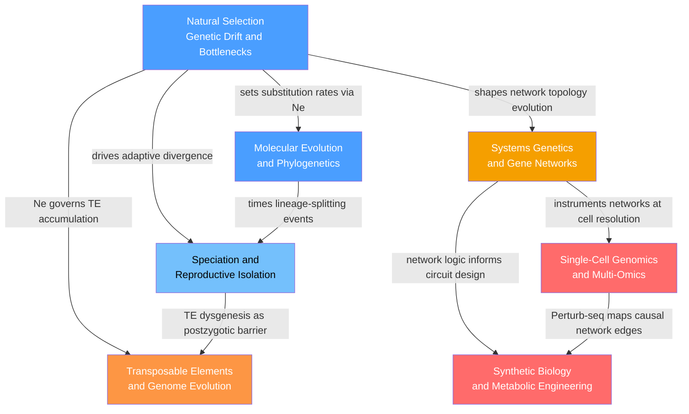

# Evolutionary and Systems Genetics — Section Map of Content

> [!abstract] Section Overview
> This section bridges two complementary perspectives on the genome: the evolutionary lens — asking how selection, drift, speciation, and mobile elements have shaped genomes across deep time — and the systems lens — asking how genetic variants propagate through molecular networks to produce complex traits, and how those networks can be rationally redesigned. Starting from the forces that govern allele frequencies in populations, the section builds upward through the molecular signatures of evolution, the origin of new species, the genomic footprint of transposable elements, the architecture of gene regulatory networks, and culminates in the cutting-edge technologies of single-cell genomics and synthetic biology that now allow researchers to read and write the genome at single-cell and whole-pathway resolution.

---

## Section Concept Map

*(Blue = fundamental entry points; light blue = evolutionary intermediate; orange = genome architecture bridge; yellow = systems bridge; red = advanced measurement and engineering applications; arrows = "leads to" or "requires")*

---

## Notes in This Section

| Note | Core Topic | Level |
|------|-----------|-------|
| [[Natural_Selection_Genetic_Drift_and_Bottlenecks]] | Selection and drift as the two engines of allele-frequency change; bottlenecks and founder effects; sweep signatures and dN/dS | Beginner–Advanced |
| [[Molecular_Evolution_and_Phylogenetics]] | Neutral theory and the molecular clock; substitution models JC69–GTR; ML and Bayesian tree inference; multispecies coalescent | Intermediate–Advanced |
| [[Speciation_and_Reproductive_Isolation]] | Species concepts; allopatric/sympatric speciation modes; BDM incompatibilities; Haldane's rule; polyploidy; Neanderthal introgression | Intermediate–Advanced |
| [[Transposable_Elements_and_Genome_Evolution]] | TE classification and retrotransposition mechanics; piRNA and KRAB-ZFP silencing; TE exaptation; Lynch-Conery mutational hazard hypothesis | Intermediate–Advanced |
| [[Systems_Genetics_and_Gene_Networks]] | eQTL/sQTL/pQTL mapping; WGCNA co-expression modules; ARACNE/GENIE3 network inference; epistasis; Mendelian randomization; Waddington landscape | Intermediate–Advanced |
| [[Single_Cell_Genomics_and_Multi_Omics]] | 10x Chromium; scATAC-seq; Seurat/Scanpy pipeline; pseudotime; RNA velocity; Perturb-seq; spatial transcriptomics; Human Cell Atlas | Advanced |
| [[Synthetic_Biology_and_Metabolic_Engineering]] | BioBrick parts; toggle switch and repressilator; flux balance analysis; DBTL cycle; directed evolution; genetic code expansion; biocontainment | Advanced |

---

## Learning Paths

### Path 1 — Evolutionary Genetics Track

Recommended order for understanding how genomes evolve across populations and species:

1. [[Natural_Selection_Genetic_Drift_and_Bottlenecks]] — Start here: the Wright-Fisher model, fixation probabilities, selective sweeps, dN/dS, and the MK test form the conceptual backbone of all molecular evolutionary analysis
2. [[Molecular_Evolution_and_Phylogenetics]] — Builds directly on neutral theory; substitution models, molecular clock calibration, ML/Bayesian tree inference, and the multispecies coalescent translate population-genetic forces into macroevolutionary patterns
3. [[Speciation_and_Reproductive_Isolation]] — Applies selection, drift, and molecular divergence to the question of how lineages split; BDM incompatibilities explain why divergence inevitably produces postzygotic barriers
4. [[Transposable_Elements_and_Genome_Evolution]] — Closes the evolutionary loop by showing how mobile elements accumulate under drift, drive genomic rearrangements, and are occasionally co-opted into new host functions

### Path 2 — Systems and Synthetic Biology Track

Recommended order for understanding genome-scale regulatory architecture and its engineering:

1. [[Natural_Selection_Genetic_Drift_and_Bottlenecks]] — Prerequisite: purifying selection on hub genes and canalization of gene networks are understood only against the background of drift and selection theory
2. [[Systems_Genetics_and_Gene_Networks]] — Central node of the systems track; eQTL mapping, WGCNA, network inference, epistasis, and Mendelian randomization reveal the molecular wiring between genotype and complex trait
3. [[Single_Cell_Genomics_and_Multi_Omics]] — Scales systems genetics from bulk populations to individual cells; scRNA-seq, Perturb-seq, spatial transcriptomics, and multi-omics integration provide the measurement resolution needed to validate network models
4. [[Synthetic_Biology_and_Metabolic_Engineering]] — Closes the loop from understanding to design; BioBricks, toggle switches, flux balance analysis, and directed evolution apply network logic to engineer predictable cellular behaviour

---

## Cross-Section Connections

- **Links to S01 (Molecular Genetics):** [[Transposable_Elements_and_Genome_Evolution]] is rooted in [[Gene_Regulation_and_Epigenetics]] and [[Chromatin_Structure_and_Nucleosomes]] — the piRNA/PIWI and KRAB-ZFP/SETDB1 silencing pathways described here are direct applications of epigenetic mechanisms covered in S01; [[Synthetic_Biology_and_Metabolic_Engineering]] depends on [[Gene_Regulation_and_Epigenetics]] for the promoter-TF logic underlying toggle switches and repressilators; [[DNA_Repair_and_Mutation]] sets the neutral mutation rate that drives the molecular clock
- **Links to S02 (Classical and Population Genetics):** [[Natural_Selection_Genetic_Drift_and_Bottlenecks]] and [[Speciation_and_Reproductive_Isolation]] both extend directly from [[Population_Genetics_and_Hardy_Weinberg]] — Tajima's D, FST, and the coalescent framework from S02 are applied here to sweep detection and speciation; [[Systems_Genetics_and_Gene_Networks]] applies QTL mapping methodology from [[Quantitative_Genetics_and_Heritability]] to molecular phenotypes; inversions shaping speciation directly depend on [[Linkage_Mapping_and_Recombination]]
- **Links to S03 (Genomics and Bioinformatics):** [[Molecular_Evolution_and_Phylogenetics]] requires [[Comparative_Genomics_and_Synteny]] for ortholog identification and dN/dS computation, and [[Bioinformatics_Algorithms_and_Sequence_Analysis]] for multiple sequence alignment and MCMC tree inference; [[Single_Cell_Genomics_and_Multi_Omics]] builds on [[Functional_Genomics_and_Transcriptomics]] for normalisation and differential expression methodology, and on [[DNA_Sequencing_Technologies]] for the Illumina short-read platform underlying all scRNA-seq
- **Links to S04 (Developmental and Epigenetic Genetics):** [[Single_Cell_Genomics_and_Multi_Omics]] converges directly with [[Cell_Fate_and_Differentiation]] and [[Stem_Cells_and_Pluripotency]] — pseudotime and RNA velocity test Waddington landscape models at molecular resolution; [[Systems_Genetics_and_Gene_Networks]] provides the network-level formalism underlying the Waddington landscape concept introduced in S04; [[Transposable_Elements_and_Genome_Evolution]] intersects with [[Gene_Regulation_and_Epigenetics]] through TE-derived enhancers and HERV regulatory elements in pluripotent cells

---

## Cross-Vault Links

- [[Bayesian_Statistics]] — Bayesian MCMC underpins phylogenetic inference in MrBayes and BEAST; GTEx eQTL fine-mapping uses SuSiE and coloc posterior probabilities; MOFA applies variational Bayes; scVI is a variational autoencoder trained on a Bayesian generative model of count data
- [[Information_Theory]] — ARACNE uses mutual information and the Data Processing Inequality to prune gene regulatory network edges; maximum likelihood phylogenetics minimises KL divergence between data and model; Shannon entropy measures expression heterogeneity in single-cell data
- [[Systems_of_ODEs]] — The Gardner toggle switch and repressilator in Synthetic Biology are autonomous ODE systems; nullcline analysis and phase portraits covered in Mathematics are directly applied to bistable genetic circuit design
- [[Statistical_Inference]] — Tajima's D, the McDonald-Kreitman test, Fisher's exact test, and TWAS association tests are standard statistical inference applications; pseudobulk DE analysis with DESeq2 requires understanding of negative binomial GLMs
- [[Graph_Representation]] — Gene co-expression and regulatory networks are weighted graphs; adjacency matrices, degree sequences, shortest paths, and community detection algorithms from DSA graph theory are applied directly to WGCNA and network biology; the centrality-lethality rule is a graph-theoretic prediction
- [[Chemical_Kinetics]] — Michaelis-Menten and Hill-equation kinetics underpin genetic circuit modelling in Synthetic Biology; stoichiometric flux balance analysis in metabolic engineering is rooted in reaction network theory from Chemistry
- [[Connectomics_and_Network_Neuroscience]] — Both Connectomics and Systems Genetics reconstruct complex biological networks at cellular resolution; spatial transcriptomics and connectomics are converging in systems neuroscience, mapping both the molecular identity and the synaptic wiring of individual neurons in the same tissue volume
- [[PCA]] — The central dimensionality reduction step in every scRNA-seq pipeline; the top 30–50 PCA components define the coordinate space for UMAP, Leiden clustering, and pseudotime trajectory analysis
- [[UMAP]] — The standard 2D visualisation of scRNA-seq data; reveals cluster structure and trajectory topology across millions of single cells

[[_MOC_Genetics_Master]]

---

#MOC #Genetics #EvolutionaryGenetics #SystemsGenetics #SectionMOC
