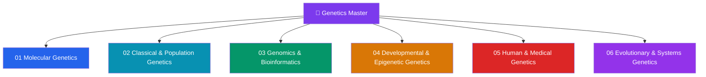

# 🧬 Genetics & Genomics — Master Map of Content

> [!abstract] About This Vault
> A comprehensive Genetics & Genomics reference spanning **senior secondary through graduate level** — **38 notes across 6 sections**. The vault traces genetic information from the double helix and central dogma (**Molecular Genetics**), through inheritance rules and population dynamics (**Classical & Population Genetics**), to whole-genome sequencing and bioinformatic analysis (**Genomics & Bioinformatics**). It then deepens into how genomes orchestrate development and are altered by aging (**Developmental & Epigenetic Genetics**), how genetic variants cause human disease and are targeted therapeutically (**Human & Medical Genetics**), and how genomes evolve across deep time and can be re-engineered at systems scale (**Evolutionary & Systems Genetics**). The vault connects outward to [[_MOC_Chemistry_Master|Chemistry]] for the biochemical substrate, [[_MOC_Neuroscience_Master|Neuroscience]] for neurogenetic disorders, and [[_MOC_AI_ML_Master|AI-ML]] for machine-learning approaches to genomic data.

## Vault Architecture

## Sections at a Glance

| # | Section | Notes | Entry Point | Level Range |
|---|---------|-------|-------------|-------------|
| 01 | Molecular Genetics | 6 | [[_MOC_Molecular_Genetics]] | Secondary → Graduate |
| 02 | Classical and Population Genetics | 6 | [[_MOC_Classical_and_Population_Genetics]] | Secondary → Graduate |
| 03 | Genomics and Bioinformatics | 6 | [[_MOC_Genomics_and_Bioinformatics]] | Secondary → Graduate |
| 04 | Developmental and Epigenetic Genetics | 6 | [[_MOC_Developmental_and_Epigenetic_Genetics]] | Undergraduate → Graduate |
| 05 | Human and Medical Genetics | 7 | [[_MOC_Human_and_Medical_Genetics]] | Secondary → Graduate |
| 06 | Evolutionary and Systems Genetics | 7 | [[_MOC_Evolutionary_and_Systems_Genetics]] | Undergraduate → Graduate |

---

## Section Contents

**01 — Molecular Genetics** — [[_MOC_Molecular_Genetics]]
- [[DNA_Structure_and_Replication]]
- [[Chromatin_Structure_and_Nucleosomes]]
- [[Transcription_and_RNA_Processing]]
- [[Translation_and_the_Genetic_Code]]
- [[Gene_Regulation_and_Epigenetics]]
- [[DNA_Repair_and_Mutation]]

**02 — Classical and Population Genetics** — [[_MOC_Classical_and_Population_Genetics]]
- [[Mendelian_Inheritance_Patterns]]
- [[Chromosomal_Theory_of_Inheritance]]
- [[Linkage_Mapping_and_Recombination]]
- [[Extensions_to_Mendelian_Genetics]]
- [[Population_Genetics_and_Hardy_Weinberg]]
- [[Quantitative_Genetics_and_Heritability]]

**03 — Genomics and Bioinformatics** — [[_MOC_Genomics_and_Bioinformatics]]
- [[Genome_Organization_and_Structure]]
- [[DNA_Sequencing_Technologies]]
- [[Bioinformatics_Algorithms_and_Sequence_Analysis]]
- [[Comparative_Genomics_and_Synteny]]
- [[Functional_Genomics_and_Transcriptomics]]
- [[Metagenomics_and_Microbiome]]

**04 — Developmental and Epigenetic Genetics** — [[_MOC_Developmental_and_Epigenetic_Genetics]]
- [[Epigenetics_DNA_Methylation_and_Histone_Modification]]
- [[Gene_Regulation_in_Development]]
- [[Cell_Fate_and_Differentiation]]
- [[Stem_Cells_and_Pluripotency]]
- [[Genomic_Imprinting_and_X_Inactivation]]
- [[Aging_and_Genome_Instability]]

**05 — Human and Medical Genetics** — [[_MOC_Human_and_Medical_Genetics]]
- [[Human_Genome_and_Genetic_Variation]]
- [[Mendelian_Genetic_Disorders]]
- [[Genetic_Counseling_and_Prenatal_Testing]]
- [[Cancer_Genetics_and_Oncogenes]]
- [[Complex_Trait_Genetics_and_GWAS]]
- [[Pharmacogenomics_and_Personalized_Medicine]]
- [[Gene_Therapy_and_CRISPR]]

**06 — Evolutionary and Systems Genetics** — [[_MOC_Evolutionary_and_Systems_Genetics]]
- [[Natural_Selection_Genetic_Drift_and_Bottlenecks]]
- [[Molecular_Evolution_and_Phylogenetics]]
- [[Speciation_and_Reproductive_Isolation]]
- [[Transposable_Elements_and_Genome_Evolution]]
- [[Systems_Genetics_and_Gene_Networks]]
- [[Single_Cell_Genomics_and_Multi_Omics]]
- [[Synthetic_Biology_and_Metabolic_Engineering]]

---

## Learning Paths

### Path 1 — Senior Secondary Student
> Best for: grades 11–12 building their first coherent picture of genetics from molecules to populations.

[[DNA_Structure_and_Replication]] → [[Mendelian_Inheritance_Patterns]] → [[Chromosomal_Theory_of_Inheritance]] → [[Transcription_and_RNA_Processing]] → [[Translation_and_the_Genetic_Code]] → [[Extensions_to_Mendelian_Genetics]] → [[Population_Genetics_and_Hardy_Weinberg]] → [[Human_Genome_and_Genetic_Variation]] → [[Mendelian_Genetic_Disorders]]

### Path 2 — Molecular Biology Track
> Best for: biochemists and cell biologists tracing the molecular logic of gene expression and cell identity from S01 through S04 and into S03 assays.

[[DNA_Structure_and_Replication]] → [[Chromatin_Structure_and_Nucleosomes]] → [[Transcription_and_RNA_Processing]] → [[Translation_and_the_Genetic_Code]] → [[Gene_Regulation_and_Epigenetics]] → [[DNA_Repair_and_Mutation]] → [[Epigenetics_DNA_Methylation_and_Histone_Modification]] → [[Gene_Regulation_in_Development]] → [[Cell_Fate_and_Differentiation]] → [[Stem_Cells_and_Pluripotency]] → [[Functional_Genomics_and_Transcriptomics]]

### Path 3 — Genomic Medicine Track
> Best for: clinicians and computational biologists moving from sequencing technology through variant interpretation to therapeutic intervention.

[[Genome_Organization_and_Structure]] → [[DNA_Sequencing_Technologies]] → [[Bioinformatics_Algorithms_and_Sequence_Analysis]] → [[Human_Genome_and_Genetic_Variation]] → [[Mendelian_Genetic_Disorders]] → [[Genetic_Counseling_and_Prenatal_Testing]] → [[Cancer_Genetics_and_Oncogenes]] → [[Complex_Trait_Genetics_and_GWAS]] → [[Pharmacogenomics_and_Personalized_Medicine]] → [[Gene_Therapy_and_CRISPR]]

### Path 4 — Evolutionary Genetics Track
> Best for: evolutionary biologists and ecologists moving from population-genetic theory through molecular evolution and speciation to systems-level network analysis.

[[Mendelian_Inheritance_Patterns]] → [[Population_Genetics_and_Hardy_Weinberg]] → [[Quantitative_Genetics_and_Heritability]] → [[Natural_Selection_Genetic_Drift_and_Bottlenecks]] → [[Molecular_Evolution_and_Phylogenetics]] → [[Speciation_and_Reproductive_Isolation]] → [[Transposable_Elements_and_Genome_Evolution]] → [[Systems_Genetics_and_Gene_Networks]] → [[Single_Cell_Genomics_and_Multi_Omics]]

---

## Cross-Vault Links

- **Chemistry** — [[_MOC_Chemistry_Master]]: DNA base chemistry and hydrogen-bond geometry underpin [[DNA_Structure_and_Replication]]; enzyme kinetics (CYP450 Michaelis-Menten) are central to [[Pharmacogenomics_and_Personalized_Medicine]]; Wnt/Notch/BMP signalling pathways contextualise [[Gene_Regulation_in_Development]]; LNP lipid chemistry connects to [[Gene_Therapy_and_CRISPR]] delivery.
- **Neuroscience** — [[_MOC_Neuroscience_Master]]: Huntington disease, *APOE* ε4 in Alzheimer risk, and IDH1-mutant gliomas link [[Cancer_Genetics_and_Oncogenes]] and [[Mendelian_Genetic_Disorders]] to neurodegenerative pathology; Rett syndrome (*MECP2*), fragile X (*FMR1*), and Angelman (*UBE3A*) connect [[Mendelian_Genetic_Disorders]] to neurodevelopmental disorders; SASP-driven neuroinflammation ties [[Aging_and_Genome_Instability]] to neurodegeneration.
- **AI-ML** — [[_MOC_AI_ML_Master]]: PCA (EIGENSTRAT) corrects population stratification in every GWAS run in [[Complex_Trait_Genetics_and_GWAS]]; UMAP and tSNE are the standard visualisation layers in the [[Single_Cell_Genomics_and_Multi_Omics]] pipeline; Bayesian networks and variational autoencoders (scVI) underpin multi-omics integration; LDpred2 and PRS-CS apply Bayesian shrinkage for polygenic risk scores.
- **Mathematics** — [[_MOC_Mathematics_Master]]: Bayesian statistics is the engine of genetic counseling risk tables, GWAS fine-mapping posteriors, and phylogenetic MCMC inference; ODEs and nullcline analysis model bistable fate switches in [[Cell_Fate_and_Differentiation]] and genetic circuits in [[Synthetic_Biology_and_Metabolic_Engineering]]; statistical inference underpins Tajima's D, the McDonald-Kreitman test, and GWAS multiple-testing correction.
- **DSA** — [[_MOC_DSA_Master]]: gene regulatory and co-expression networks in [[Systems_Genetics_and_Gene_Networks]] are weighted directed graphs; adjacency-matrix representations, shortest paths, and community detection from graph theory apply directly to WGCNA and network biology; de Bruijn graphs underpin genome assemblers in [[Bioinformatics_Algorithms_and_Sequence_Analysis]].
- **Psychology** — [[_MOC_Psychology_Master]]: CYP2D6 and CYP2C19 pharmacogenomics is directly relevant to CNS drug dosing in [[Pharmacogenomics_and_Personalized_Medicine]]; PKU and Huntington disease demonstrate in [[Mendelian_Genetic_Disorders]] how single-gene defects produce cognitive and behavioural phenotypes; behavioural genetics and heritability estimates connect [[Quantitative_Genetics_and_Heritability]] to personality and cognition research.
- **Materials Science** — [[_MOC_MaterialsScience_Master]]: ionizable lipid nanoparticles (LNPs) for Cas9-mRNA and AAV vector delivery in [[Gene_Therapy_and_CRISPR]] rely on the nanomedicine delivery principles covered in Materials Science; biocompatible scaffold materials connect to organoid culture in [[Stem_Cells_and_Pluripotency]].

---

## Section MOC Index

- [[_MOC_Molecular_Genetics]] — the central dogma engine: DNA replication, chromatin packaging, transcription, translation, gene regulation, and the DNA repair hierarchy that preserves sequence integrity.
- [[_MOC_Classical_and_Population_Genetics]] — the rules of inheritance: Mendelian ratios, chromosomal theory, linkage mapping, Hardy-Weinberg equilibrium, and quantitative heritability connecting Mendelian alleles to continuous polygenic traits.
- [[_MOC_Genomics_and_Bioinformatics]] — genome-scale analysis: genome organisation and the C-value paradox, sequencing technologies, alignment and assembly algorithms, comparative genomics, functional multi-omics, and metagenomics.
- [[_MOC_Developmental_and_Epigenetic_Genetics]] — cell identity across a lifetime: epigenetic marks, morphogen-driven developmental regulation, Waddington fate decisions, pluripotency reprogramming, genomic imprinting, and the hallmarks of aging.
- [[_MOC_Human_and_Medical_Genetics]] — genetics in the clinic: human genome variation, Mendelian disorders, genetic counseling and prenatal testing, cancer genetics, GWAS and polygenic risk, pharmacogenomics, and CRISPR-based gene therapy.
- [[_MOC_Evolutionary_and_Systems_Genetics]] — genomes through deep time and complex networks: natural selection and drift, molecular phylogenetics, speciation, transposable elements, gene regulatory network inference, single-cell multi-omics, and synthetic biology.

#MOC #Genetics #Genomics #MasterMOC
