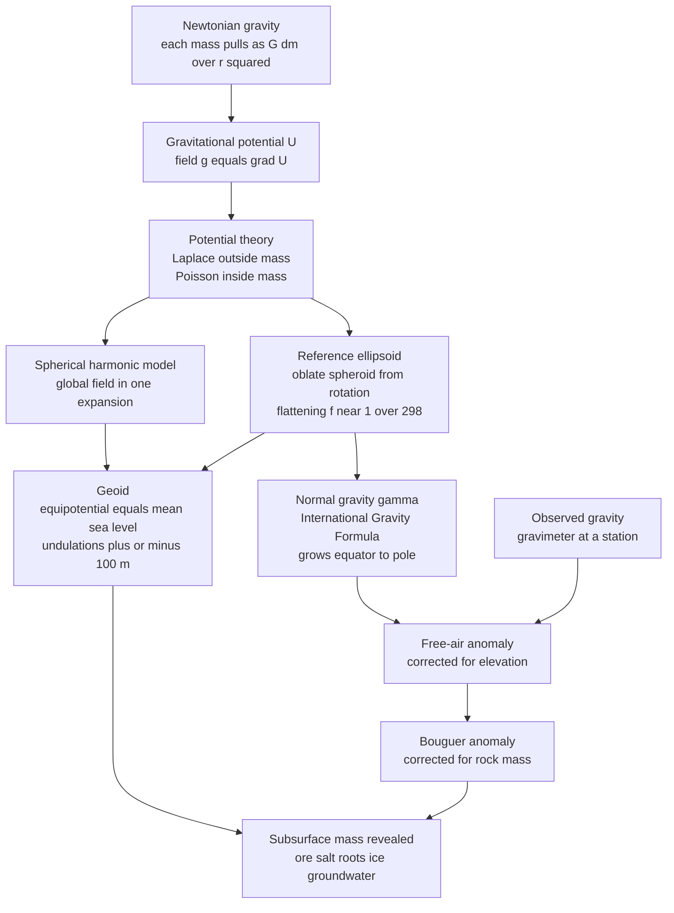

# 🌍 Earth's Gravity Field and Geodesy

> [!abstract] TL;DR
> We recite "$g = 9.8$ m/s²" as if gravity were a single constant, but it is a subtly lumpy field: it grows about **5200 mGal** from equator to pole because the rotating Earth is an oblate spheroid, and it wobbles by parts-per-million wherever buried mass is concentrated or deficient. **Potential theory** (the field is the gradient of a potential obeying Laplace/Poisson) lets geodesists define the **reference ellipsoid** (the idealised rotating shape) and the **geoid** (the true equipotential = mean sea level, undulating up to ±100 m). Subtracting the reference yields **gravity anomalies** — **free-air** (height-corrected) and **Bouguer** (mass-corrected) — that reveal ore bodies, salt domes, crustal roots, and, from satellites like **GRACE/GOCE**, melting ice sheets and vanishing groundwater. Geodesy is the science of the figure, orientation, and gravity field of the Earth.

## Intuition — analogy FIRST

Imagine the Earth confessing its hidden mass. We *say* "9.8 metres per second squared" as though gravity were the same everywhere, but it is not. You weigh very slightly **more** standing at the pole than at the equator, and slightly **less** over a buried salt dome than over a dense body of iron ore. The planet is not a perfect sphere and its density is not uniform, so its gravity field is a gently rippled landscape — a topography made not of rock height but of *pull*.

Now picture a spirit level so exquisite it could feel a mountain a mile away. Water always settles onto a surface of constant gravitational potential. Freeze that surface — the shape the oceans would take if you let them flow everywhere, ignoring winds and tides — and you have the **geoid**: a physical, lumpy, sea-level shape. Measuring the millionths-of-$g$ departures of the real field from a smooth reference lets geophysicists weigh mountains, find hidden ore, watch ice sheets melt from orbit, and define what "sea level" even means.

---

## How It Works

### Core Mechanics

1. **Newtonian gravity as a field.** Each mass element $dm$ pulls with $dg = G\,dm/r^2$. Rather than summing vectors, we work with the **gravitational potential** $U$, a scalar whose gradient is the field: $\mathbf{g} = \nabla U$. Potentials simply add, which makes bookkeeping for a whole planet tractable.

2. **Potential theory — Laplace and Poisson.** In empty space the potential obeys **Laplace's equation** $\nabla^2 U = 0$; inside matter of density $\rho$ it obeys **Poisson's equation** $\nabla^2 U = -4\pi G\rho$ (the gravitational twin of Gauss's law in electrostatics). Because $U$ is harmonic outside the Earth, it can be expanded in **spherical harmonics** — the natural "Fourier basis" on a sphere — giving a compact global model of the field.

3. **The shape of the Earth.** Rotation flings mass outward, so the equilibrium figure is an **oblate spheroid** — the **reference ellipsoid** (e.g. WGS84), flattened by $f \approx 1/298.26$. Adding the real, irregular mass distribution deforms the equipotential into the **geoid**, whose **undulations** $N$ reach roughly $-106$ m (south of India) to $+85$ m (near New Guinea).

4. **Normal gravity.** On the ellipsoid the theoretical ("normal") gravity increases from equator to pole — from both the equatorial bulge (farther from centre) and the outward centrifugal effect of rotation — captured by the **International Gravity Formula** $\gamma(\phi)$.

5. **Anomalies isolate hidden mass.** Measured minus normal gravity, after corrections for station height (**free-air**) and the mass of intervening rock (**Bouguer**), leaves the **gravity anomaly** — positive over excess/dense mass, negative over deficits/low-density bodies or isostatic roots.

6. **Inversion is non-unique.** Infinitely many subsurface density distributions produce the same surface field, so interpretation requires independent constraints (geology, seismics, drilling).

### Flow / Architecture



---

## Key Concepts

### Secondary Level

**Gravity is not constant.** Newton's law $F = G m_1 m_2 / r^2$ gives the surface value $g = GM_\oplus/R_\oplus^2 \approx 9.81$ m/s², but two facts make it vary:

- **Latitude.** The Earth bulges at the equator (radius ~21 km larger) and spins, so $g$ is *smaller* at the equator (~9.78 m/s²) than at the poles (~9.83 m/s²).
- **Elevation.** Climbing away from the mass below reduces $g$ by about **0.3086 mGal per metre** (the free-air gradient). One **milligal** (mGal) $= 10^{-5}$ m/s², about one-millionth of $g$ — the working unit of gravity surveys.

**Sea level is a shape, not a number.** Water settles onto a surface where gravity is everywhere perpendicular to it — an **equipotential**. That surface, averaged over tides and waves, is the **geoid**, the reference for "height above sea level."

### Undergraduate Level

**Potential and field.** Define the gravitational potential so that $\mathbf{g} = \nabla U$ (geodesy uses the sign convention that makes $U$ positive inside the Earth). Outside all mass, $\nabla^2 U = 0$; the field is fully determined by boundary values, which is *why* satellite measurements at altitude can be continued down to map the surface field.

**Ellipsoid vs geoid.** The **reference ellipsoid** is a smooth rotating math surface (WGS84: equatorial radius 6378.137 km, flattening $1/298.257$). The **geoid** is the physical equipotential at mean sea level. Their separation is the **geoid undulation** $N$, related to heights by

$$h = H + N$$

where $h$ is the **ellipsoidal** height a GPS receiver returns and $H$ is the **orthometric** height (above the geoid) that a spirit level and "sea level" mean.

**Normal gravity — the International Gravity Formula.** Theoretical gravity on the ellipsoid:

$$\gamma(\phi) \approx 9.780327\left(1 + 0.0053024\sin^2\phi - 0.0000058\sin^2 2\phi\right)\ \text{m/s}^2$$

From equator ($978{,}033$ mGal) to pole ($983{,}218$ mGal) that is a **~5186 mGal** rise — the dominant, entirely predictable signal that anomalies subtract away.

**Gravity anomalies.** Isolate the interesting mass signal:

- **Free-air anomaly** — correct only for station height $h$:
$$\Delta g_{FA} = g_{obs} - \gamma + 0.3086\,h \quad (h\ \text{in m, mGal})$$
- **Bouguer anomaly** — additionally remove the pull of the rock slab between station and datum ($2\pi G\rho h = 0.0419\,\rho h$ mGal, plus a terrain correction):
$$\Delta g_{B} = \Delta g_{FA} - 0.0419\,\rho\,h \quad (\rho\ \text{in g/cm}^3)$$

Over an isostatically compensated mountain the free-air anomaly is near zero while the Bouguer anomaly is strongly *negative* (the removed topography leaves the low-density crustal root exposed in the data) — the classic evidence for [[Gravity_Isostasy_and_the_Geoid|isostasy]].

**Forward model of a buried body.** A sphere of anomalous mass $M = \tfrac{4}{3}\pi R^3\,\Delta\rho$ buried at depth $z$ produces a vertical anomaly along a surface profile at horizontal offset $x$:

$$\Delta g_z(x) = \frac{G M\,z}{\left(x^2 + z^2\right)^{3/2}}$$

a bell-shaped bump — **positive** for dense excess mass (ore), **negative** for a low-density void or salt dome.

### Graduate Level

**Spherical harmonic representation.** Outside the masses the potential expands as

$$U(r,\theta,\lambda) = \frac{GM}{r}\sum_{n=0}^{\infty}\sum_{m=0}^{n}\left(\frac{a}{r}\right)^{n}\!\bar{P}_{nm}(\cos\theta)\left[\bar{C}_{nm}\cos m\lambda + \bar{S}_{nm}\sin m\lambda\right]$$

with $\bar{P}_{nm}$ normalised associated Legendre functions and $\bar{C}_{nm},\bar{S}_{nm}$ the **Stokes coefficients**. The $n=2$, $m=0$ term $J_2$ (the **dynamic form factor**, $\approx 1.08\times10^{-3}$) encodes the flattening and dwarfs all others. Modern models (EGM2008, GOCO) reach degree/order 2160+, resolving features down to ~10 km wavelength.

**Gravimetry.** **Absolute** instruments drop a corner-cube in a vacuum and time it interferometrically (or use atom interferometry), yielding $g$ to ~µGal. **Relative** instruments (LaCoste–Romberg, Scintrex CG-5) measure *differences* via a mass on a spring; they need corrections for the **solid-Earth and ocean tides** (up to ~0.3 mGal), instrument **drift**, terrain, latitude, free-air, and Bouguer effects before an anomaly is meaningful.

**Satellite gravity.** **GRACE** (2002–2017) and **GRACE-FO** (2018–) fly twin satellites and measure micron-scale changes in their ~220 km separation to map **time-variable** gravity: Greenland (~280 Gt/yr) and Antarctic ice loss, groundwater depletion (northern India, California's Central Valley), and glacial isostatic adjustment. **GOCE** (2009–2013) carried a **gradiometer** (measuring $\partial g_i/\partial x_j$) for a high-resolution *static* geoid. Together they turned the geoid into a global scale for the planet's shifting water and ice.

**Non-uniqueness of inversion.** Newtonian potential is a smoothing (harmonic-continuation) operator: adding a mass at depth or spreading it thinner near the surface can produce identical surface fields. Formally, the null space of the gravity operator is infinite-dimensional, so any inversion needs regularisation and prior constraints — the entry point to geophysical inverse theory.

**Geodesy, broadly.** Beyond gravity, geodesy determines Earth's **figure** (size/shape), **orientation** (rotation, polar motion), and their changes in time, tying local surveys into a global terrestrial reference frame — the foundation on which GPS/GNSS positioning and crustal-deformation monitoring are built.

---

## Python Demo

```python
# Earth's gravity field: (a) normal gravity vs latitude from the International
# Gravity Formula, and (b) the anomaly a gravimeter would measure crossing a
# buried body. Requires numpy + matplotlib.
import numpy as np
import matplotlib.pyplot as plt

# ---------------------------------------------------------------
# (a) NORMAL GRAVITY ON THE REFERENCE ELLIPSOID vs LATITUDE
#     International Gravity Formula (1967/GRS-style coefficients).
#     g rises equator -> pole from flattening + rotation (~5200 mGal).
# ---------------------------------------------------------------
lat_deg = np.linspace(0, 90, 361)
phi = np.radians(lat_deg)
gamma = 9.780327 * (1 + 0.0053024*np.sin(phi)**2 - 0.0000058*np.sin(2*phi)**2)
gamma_mGal = gamma * 1e5                     # m/s^2 -> mGal  (1 mGal = 1e-5 m/s^2)

g_eq, g_pole = gamma_mGal[0], gamma_mGal[-1]
print("Normal gravity (International Gravity Formula):")
print(f"  equator: {g_eq:,.1f} mGal   pole: {g_pole:,.1f} mGal")
print(f"  equator-to-pole increase: {g_pole - g_eq:,.0f} mGal (~5200 from flattening + rotation)")

# ---------------------------------------------------------------
# (b) FORWARD-MODEL A BURIED SPHERE (point-mass approximation).
#     Vertical anomaly: dg(x) = G*M*z / (x^2 + z^2)^(3/2),
#     with mass excess M = (4/3) pi R^3 * delta_rho.
#     delta_rho > 0 (dense ore) -> positive anomaly;
#     delta_rho < 0 (salt dome / void) -> negative anomaly.
# ---------------------------------------------------------------
G = 6.674e-11                                # m^3 kg^-1 s^-2
x = np.linspace(-2000, 2000, 801)            # survey line, metres

def sphere_anomaly_mGal(x, z, R, d_rho):
    """Vertical gravity anomaly (mGal) of a buried sphere, centre at depth z."""
    M = (4.0/3.0) * np.pi * R**3 * d_rho     # anomalous mass (kg)
    g = G * M * z / (x**2 + z**2)**1.5        # m/s^2
    return g * 1e5                            # -> mGal

z, R = 500.0, 250.0                          # depth 500 m, radius 250 m
ore  = sphere_anomaly_mGal(x, z, R, d_rho=+400.0)   # dense ore: +400 kg/m^3
salt = sphere_anomaly_mGal(x, z, R, d_rho=-250.0)   # salt dome:  -250 kg/m^3

print(f"\nBuried sphere (z={z:.0f} m, R={R:.0f} m):")
print(f"  peak ore anomaly:  {ore.max():+.3f} mGal")
print(f"  peak salt anomaly: {salt.min():+.3f} mGal")
print("Note: measured g must first be free-air + Bouguer corrected to expose these.")

# ---------------------------------------------------------------
# Plot both panels
# ---------------------------------------------------------------
fig, (ax1, ax2) = plt.subplots(1, 2, figsize=(12, 4.5))

ax1.plot(lat_deg, gamma_mGal, color="#2563eb", lw=2)
ax1.set_title("Normal gravity vs latitude (ellipsoid)")
ax1.set_xlabel("Geodetic latitude (deg)")
ax1.set_ylabel("Normal gravity (mGal)")
ax1.annotate(f"+{g_pole-g_eq:,.0f} mGal\nequator to pole",
             xy=(70, gamma_mGal[280]), xytext=(20, g_eq+1500),
             arrowprops=dict(arrowstyle="->"))
ax1.grid(alpha=0.3)

ax2.plot(x, ore,  color="#dc2626", lw=2, label="dense ore  (+ anomaly)")
ax2.plot(x, salt, color="#059669", lw=2, label="salt dome / void  (- anomaly)")
ax2.axhline(0, color="k", lw=0.8)
ax2.set_title("Gravity anomaly across a buried sphere")
ax2.set_xlabel("Distance along profile (m)")
ax2.set_ylabel("Vertical anomaly (mGal)")
ax2.legend()
ax2.grid(alpha=0.3)

plt.tight_layout()
plt.savefig("gravity_field_demo.png", dpi=120)
print("\nSaved figure to gravity_field_demo.png")
```

Running it prints an equator-to-pole rise of ~5186 mGal and a bell-shaped anomaly of a few tenths of a mGal — positive over the dense ore, mirror-image negative over the salt dome — exactly the signal a field gravimeter chases *after* removing the far larger latitude, free-air, and Bouguer effects.

---

## Real-World Applications

> **Example — GRACE weighs the ice sheets.** By tracking micron-scale changes in the gap between two satellites, GRACE converts the *time-varying* geoid into monthly maps of mass movement, quantifying Greenland and Antarctic ice loss and groundwater depletion — gravity used as a planetary scale.

- **Mineral and petroleum exploration.** Dense sulphide/oxide ore bodies raise the Bouguer anomaly; low-density salt domes, voids, and sedimentary basins lower it. Gravity surveys cheaply pre-screen prospects before drilling.
- **Defining sea level and heights.** The geoid is the zero-height datum. Reconciling GPS ellipsoidal heights with orthometric ("above sea level") heights requires a precise geoid model — essential for flood mapping, engineering, and unifying national height systems.
- **Isostasy and lithospheric structure.** Bouguer anomalies over mountains reveal crustal roots and effective elastic thickness, linking directly to [[Gravity_Isostasy_and_the_Geoid|isostasy and flexure]].
- **Satellite orbits and navigation.** The $J_2$ term and higher harmonics perturb every satellite's orbit; precise orbit determination and GNSS both depend on an accurate global gravity model — see [[Orbital_Mechanics_and_Celestial_Dynamics]].
- **Hydrology and climate.** GRACE monitors aquifer decline, drought, and sea-level budget closure, making the gravity field a climate-science instrument.

---

## Common Pitfalls

- **Geoid vs ellipsoid vs topography.** The ellipsoid is a smooth math surface, the geoid the physical equipotential (mean sea level), and the ground the actual rock surface. GPS gives *ellipsoidal* height $h$; "height above sea level" is orthometric $H = h - N$. Conflating the three corrupts elevations by tens of metres.
- **Free-air vs Bouguer anomaly.** The free-air anomaly *still contains* the pull of the topographic mass; the Bouguer anomaly *removes* it. Over a compensated mountain the free-air anomaly is near zero while the Bouguer anomaly is strongly negative — both correct, answering different questions.
- **mGal and µGal units.** One mGal $=10^{-5}$ m/s² ($\approx 10^{-6}g$); survey signals are tenths of a mGal to a few µGal. Mixing SI m/s² with mGal (a factor of $10^5$) is a classic sign/scale blunder.
- **Density units in the Bouguer term.** The coefficient $0.0419\,\rho$ mGal/m expects $\rho$ in g/cm³; plugging in kg/m³ inflates the correction 1000×.
- **Non-uniqueness of inversion.** Many density distributions fit the same surface field (a shallow small mass mimics a deep large one). Never treat a gravity model as *the* subsurface — regularise and constrain with independent data.
- **Skipping tide and drift corrections.** Solid-Earth/ocean tides (~0.3 mGal) and instrument drift on relative gravimeters exceed most target anomalies; failing to correct them buries the signal in noise.

---

## Related Concepts

- **Sibling notes** (this Geophysics section) — *Geophysics_Overview* frames the whole field; *Isostasy_and_Lithospheric_Flexure* takes the compensation story further; *Gravity_and_Magnetic_Surveying* applies these anomalies in the field; *Space_Geodesy_GPS_and_Crustal_Deformation* extends geodesy to positioning and deformation; *Geophysical_Inverse_Theory* formalises the non-uniqueness raised here.
- [[Gravity_Isostasy_and_the_Geoid]] — the geology-level treatment of the same geoid, anomalies, and isostatic roots; this note is the potential-theory / physical-geodesy companion to it
- [[Earth_Internal_Structure]] — the density layering (crust, mantle, core) whose integral produces the field measured here
- [[Geomagnetism_and_Paleomagnetism]] — the Earth's *other* great potential field, mapped with the same harmonic mathematics
- [[Gauss_Law_and_Electric_Potential]] — the identical potential-theory machinery (Gauss's law, Poisson/Laplace) in electrostatics
- [[Newtons_Laws_and_Kinematics]] — the inverse-square law and $g$ that everything above rests on
- [[Partial_Differential_Equations]] — Laplace and Poisson equations that govern the gravitational potential
- [[Integral_Theorems]] — the divergence theorem behind Gauss's law for gravity
- [[Orbital_Mechanics_and_Celestial_Dynamics]] — how $J_2$ and the field perturb satellite orbits used to measure it

---

## Review Questions

1. **Secondary:** Why does a very sensitive scale read slightly *less* at the equator than at the North Pole? Name the two distinct causes and state whether they arise from the Earth's shape, its rotation, or both.
2. **Undergraduate:** A survey crosses a buried sphere. (a) Write the vertical-anomaly formula and explain why a salt dome gives a *negative* bump while an ore body gives a *positive* one. (b) You measured $g_{obs}$ on a 300 m hill — list, in order, the corrections needed to turn it into a Bouguer anomaly and give the sign of the free-air correction.
3. **Graduate:** GRACE and GOCE both "measure gravity" yet answer different questions. Contrast what each observes (inter-satellite range-rate vs gravity gradients), why one excels at *time-variable* mass and the other at *static* high-resolution geoid, and explain how the non-uniqueness of gravity inversion limits interpreting either dataset without independent constraints.

---

## Sources

- Hofmann-Wellenhof & Moritz — *Physical Geodesy*, 2nd ed. (potential theory, geoid, spherical harmonics)
- Blakely — *Potential Theory in Gravity and Magnetic Applications* (forward modelling, anomalies, inversion)
- Torge & Müller — *Geodesy*, 4th ed. (reference systems, gravimetry, satellite geodesy)
- Turcotte & Schubert — *Geodynamics*, 3rd ed., Ch. 5 (gravity, geoid, isostasy)
- Tapley et al. (2004) — "GRACE measurements of mass variability in the Earth system," *Science* 305, 503

---

#geophysics #gravity #geodesy #geoid #potential-theory
