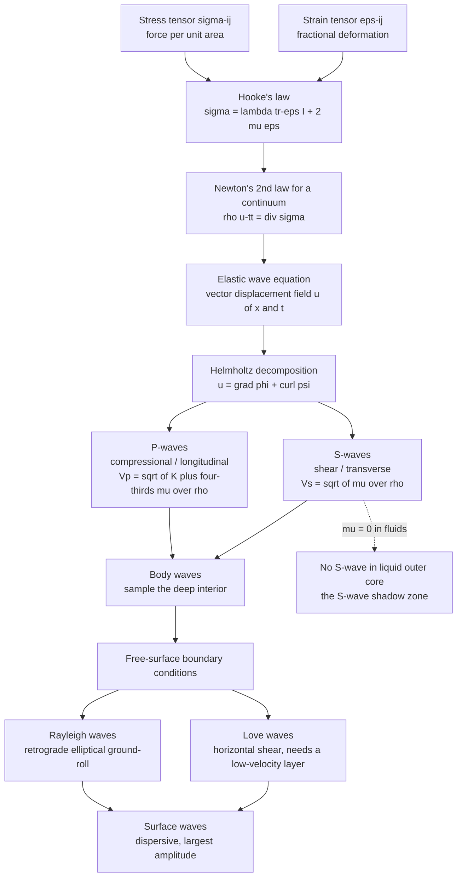

# 🌍 Elasticity and Seismic Wave Theory

> [!abstract] TL;DR
> An earthquake deforms rock elastically, and that deformation radiates outward as **seismic waves** governed by the elastic wave equation (Newton's law + Hooke's law). Two **body waves** exist: fast **P-waves** (compressional, $V_p = \sqrt{(K + \tfrac{4}{3}\mu)/\rho}$) that travel through solids *and* liquids, and slower **S-waves** (shear, $V_s = \sqrt{\mu/\rho}$) that cannot travel through fluids because fluids have zero rigidity ($\mu = 0$). Two **surface waves** — **Rayleigh** (retrograde-elliptical ground-roll) and **Love** (horizontal shear) — trail behind, are *dispersive*, and carry the largest amplitudes. Because wave speeds are fixed by the rock's stiffness and density, seismic waves are the primary probe of the entire Earth's interior.

---

## Intuition

**Analogy:** Drop a stone in a still pond and a single ripple spreads outward. But the Earth is a 3-D *solid*, not a 2-D water surface — so an earthquake sends out not one but **several kinds of waves at once**: a fast "push-pull" wave that compresses rock the way sound compresses air, a slower "shake" wave that wobbles rock sideways, and surface waves that roll along the ground like ocean swells.

Each of these travels at a speed set by how **stiff** and how **dense** the rock is — stiffer rock springs back faster, so waves travel faster; denser rock has more inertia, so waves travel slower. Because a liquid has *no* resistance to shearing (you cannot "twist" water), the sideways "shake" wave simply dies at the edge of a liquid. That single fact — an S-wave shadow on the far side of the planet — is how we first learned the Earth has a **liquid outer core**. Understanding these waves, born from the physics of how solids deform elastically, is the key that unlocks the Earth's interior.

---

## How It Works

### Core Mechanics

1. **Stress and strain.** A deforming rock is described by two tensors: the **stress** $\sigma_{ij}$ (force per unit area on each face of a tiny cube) and the **strain** $\varepsilon_{ij}$ (fractional deformation). Strain is the symmetric gradient of the displacement field, $\varepsilon_{ij} = \tfrac{1}{2}(\partial_i u_j + \partial_j u_i)$.
2. **Hooke's law (linear elasticity).** For small deformations, stress is linear in strain. For an isotropic solid this collapses to two constants, the **Lamé parameters** $\lambda$ and $\mu$: $\sigma_{ij} = \lambda\, \varepsilon_{kk}\, \delta_{ij} + 2\mu\, \varepsilon_{ij}$. Here $\mu$ is the **shear modulus (rigidity)**; $K = \lambda + \tfrac{2}{3}\mu$ is the **bulk modulus**; Young's modulus $E$ and Poisson's ratio $\nu$ are algebraic combinations of these.
3. **Newton's second law for a continuum.** Applying $\rho\, \ddot{u}_i = \partial_j \sigma_{ij}$ and substituting Hooke's law gives the **elastic wave equation** (Navier's equation):
   $$\rho\, \ddot{\mathbf{u}} = (\lambda + \mu)\,\nabla(\nabla\cdot\mathbf{u}) + \mu\,\nabla^2\mathbf{u}.$$
4. **Helmholtz decomposition splits it in two.** Writing $\mathbf{u} = \nabla\phi + \nabla\times\boldsymbol{\psi}$ separates the field into a **curl-free** part (volume change, no rotation → **P-waves**) and a **divergence-free** part (shape change, no volume change → **S-waves**). Each part obeys an ordinary scalar wave equation with its own speed:
   $$V_p = \sqrt{\frac{K + \tfrac{4}{3}\mu}{\rho}} = \sqrt{\frac{\lambda + 2\mu}{\rho}}, \qquad V_s = \sqrt{\frac{\mu}{\rho}}.$$
5. **Consequences.** Since $\mu \ge 0$, we always have $V_p > V_s$ (P for *Primary*, S for *Secondary* — P always arrives first). In a fluid $\mu = 0$, so $V_s = 0$: **fluids transmit P but not S**. The ratio $V_p/V_s = \sqrt{2(1-\nu)/(1-2\nu)}$ is a direct read-out of **Poisson's ratio** $\nu$ (about 1.73, i.e. $\nu \approx 0.25$, for most crustal rock).
6. **Surface waves.** Where body-wave solutions meet the **free surface**, boundary conditions create interface-trapped waves: **Rayleigh waves** (coupled P-SV, retrograde-elliptical particle motion, "ground-roll") and, when a low-velocity layer overlies faster rock, **Love waves** (pure horizontal shear, SH). Both are **dispersive** — longer wavelengths sample deeper, faster rock, so they travel faster — which is exactly what makes surface-wave tomography possible.

### Flow / Architecture



---

## Key Concepts

**Secondary (intuition level).** An earthquake makes several waves at once. P-waves push and pull (like sound) and arrive first; S-waves shake side-to-side and arrive second; surface waves roll along the ground, arrive last, and shake the hardest. Waves go faster through stiffer rock and slower through denser rock. Liquids block the sideways S-wave — which is how we know the outer core is molten.

**Undergraduate (working level).** Elasticity is captured by Hooke's law with two isotropic moduli, bulk $K$ and shear $\mu$. Combining it with Newton's law yields the elastic wave equation, whose curl-free and divergence-free parts propagate at $V_p = \sqrt{(K+\tfrac{4}{3}\mu)/\rho}$ and $V_s = \sqrt{\mu/\rho}$. Always $V_p > V_s$. The $V_p/V_s$ ratio fixes Poisson's ratio $\nu$. At interfaces, waves obey **Snell's law**, split into reflected and transmitted branches, and undergo **mode conversion** (P↔S). Surface waves are dispersive and dominate seismograms at teleseismic distances.

**Graduate (rigorous level).** The general anisotropic constitutive law is the fourth-rank **stiffness tensor** $c_{ijkl}$ (21 independent components, reducing to 2 for isotropy, 5 for hexagonal/TI media). Wave speeds and polarizations then come from the **Christoffel equation** $(c_{ijkl}\,n_j n_l - \rho v^2 \delta_{ik})\,g_k = 0$, an eigenvalue problem whose three eigenvalues are the quasi-P and two quasi-S speeds. Real Earth is **anelastic**: energy decays as $e^{-\pi f t / Q}$, where the **quality factor** $Q$ quantifies loss per cycle and causes physical dispersion (Kramers-Kronig). Amplitude also falls from **geometrical spreading** ($1/r$ for body waves, $1/\sqrt{r}$ for surface waves). Partitioning at interfaces is given exactly by the **Zoeppritz equations**; their high-frequency limit is ray theory, foreshadowing travel-time seismology and, at the whole-Earth scale, the discrete **free oscillations / normal modes**.

---

## Python Demo

```python
# Elastic body-wave speeds + finite-difference wave propagation + particle motion.
# Demonstrates: Vp > Vs always; Vs = 0 in fluids (mu = 0); reflection/transmission
# at a velocity interface; and P vs S vs Rayleigh particle motion.
import numpy as np
import matplotlib.pyplot as plt

# ---------------------------------------------------------------------------
# (a) Body-wave velocities from elastic moduli and density
#     Vp = sqrt((K + 4/3 mu)/rho),   Vs = sqrt(mu/rho)
# ---------------------------------------------------------------------------
def vp_vs(K, mu, rho):
    vp = np.sqrt((K + 4.0/3.0*mu) / rho)
    vs = np.sqrt(mu / rho)
    return vp, vs

# name : (K [GPa], mu [GPa], rho [kg/m^3])
rocks = {
    "Water":      (2.2,   0.0,  1000.0),   # fluid: mu = 0  ->  no S-wave
    "Sandstone":  (17.0,  6.0,  2200.0),
    "Granite":    (37.0, 30.0,  2700.0),
    "Basalt":     (60.0, 35.0,  2900.0),
    "Peridotite": (130.0,70.0,  3300.0),   # upper-mantle rock
}

names, Vp, Vs = [], [], []
print(f"{'rock':11s} {'Vp[m/s]':>8s} {'Vs[m/s]':>8s} {'Vp/Vs':>7s} {'nu':>6s}")
for name, (K, mu, rho) in rocks.items():
    vp, vs = vp_vs(K*1e9, mu*1e9, rho)
    if vs > 0:
        r2 = (vp/vs)**2
        nu = (r2 - 2) / (2*(r2 - 1))          # Poisson's ratio from Vp/Vs
        print(f"{name:11s} {vp:8.0f} {vs:8.0f} {vp/vs:7.2f} {nu:6.3f}")
    else:
        print(f"{name:11s} {vp:8.0f} {0:8.0f} {'inf':>7s} {'--':>6s}   (fluid: no S-wave)")
    names.append(name); Vp.append(vp); Vs.append(vs)
Vp, Vs = np.array(Vp), np.array(Vs)

# ---------------------------------------------------------------------------
# (b) Vp, Vs vs stiffness: sweep shear modulus mu (fixed K, rho).
#     At mu = 0 -> Vs = 0 (fluid), Vp = sqrt(K/rho) (acoustic).
# ---------------------------------------------------------------------------
mu_sweep = np.linspace(0.0, 80.0, 200) * 1e9
K_fix, rho_fix = 40e9, 2700.0
vp_sweep = np.sqrt((K_fix + 4.0/3.0*mu_sweep) / rho_fix)
vs_sweep = np.sqrt(mu_sweep / rho_fix)

# ---------------------------------------------------------------------------
# (c) 1-D finite-difference scalar (P) wave hitting a velocity interface.
#     u_tt = c(x)^2 u_xx   solved with the explicit leapfrog scheme.
# ---------------------------------------------------------------------------
nx, dx = 800, 5.0                       # grid points, spacing [m]
x  = np.arange(nx) * dx
c  = np.where(x < nx*dx/2, 2000.0, 4000.0)   # slow layer | fast layer
dt = 0.4 * dx / c.max()                 # CFL-stable time step
nt = 700
c2 = (c * dt / dx) ** 2

x0, w = nx*dx*0.25, 60.0                 # rightward-travelling Gaussian pulse
u_cur  = np.exp(-((x - x0) / w) ** 2)
u_prev = np.exp(-((x - x0 + c*dt) / w) ** 2)

snap_times, snaps = [140, 360, 560], {}
for n in range(nt + 1):
    lap = np.roll(u_cur, -1) - 2*u_cur + np.roll(u_cur, 1)
    u_next = 2*u_cur - u_prev + c2 * lap
    u_next[0] = u_next[-1] = 0.0         # fixed ends
    u_prev, u_cur = u_cur, u_next
    if n in snap_times:
        snaps[n] = u_cur.copy()

# ---------------------------------------------------------------------------
# (d) Particle motion: P longitudinal, S transverse, Rayleigh retrograde ellipse
# ---------------------------------------------------------------------------
t = np.linspace(0, 2*np.pi, 400)
motions = {
    "P: longitudinal":  (np.sin(t),        0*t),          # along propagation (x)
    "S: transverse":    (0*t,              np.sin(t)),     # perpendicular (z)
    "Rayleigh: ellipse":(0.6*np.cos(t),    np.sin(t)),     # retrograde ellipse
}

# ---------------------------------------------------------------------------
# Plot everything
# ---------------------------------------------------------------------------
fig, ax = plt.subplots(2, 2, figsize=(13, 9))

# (a) Vp vs Vs bar chart
i = np.arange(len(names))
ax[0,0].bar(i - 0.2, Vp/1000, 0.4, label="Vp (P-wave)", color="#c0392b")
ax[0,0].bar(i + 0.2, Vs/1000, 0.4, label="Vs (S-wave)", color="#2980b9")
ax[0,0].set_xticks(i); ax[0,0].set_xticklabels(names, rotation=25, ha="right")
ax[0,0].set_ylabel("velocity [km/s]")
ax[0,0].set_title("(a) Vp > Vs always; water has Vs = 0 (mu = 0)")
ax[0,0].legend(); ax[0,0].grid(alpha=0.3, axis="y")

# (b) Vp, Vs vs shear modulus
ax[0,1].plot(mu_sweep/1e9, vp_sweep/1000, "-", color="#c0392b", label="Vp")
ax[0,1].plot(mu_sweep/1e9, vs_sweep/1000, "-", color="#2980b9", label="Vs")
ax[0,1].axvline(0, color="k", lw=0.8, ls=":")
ax[0,1].set_xlabel("shear modulus mu [GPa]  (stiffness against shearing)")
ax[0,1].set_ylabel("velocity [km/s]")
ax[0,1].set_title("(b) At mu = 0: Vs -> 0 (fluid blocks S)")
ax[0,1].legend(); ax[0,1].grid(alpha=0.3)

# (c) FD wave snapshots
ax[1,0].axvspan(0, nx*dx/2000, color="#f4f4f4")
ax[1,0].axvline(nx*dx/2/1000, color="k", ls="--", lw=1.2, label="interface")
for n, col in zip(snap_times, ["#16a085", "#8e44ad", "#e67e22"]):
    ax[1,0].plot(x/1000, snaps[n], color=col, label=f"t step {n}")
ax[1,0].set_xlabel("distance [km]  (2 km/s | 4 km/s)")
ax[1,0].set_ylabel("displacement")
ax[1,0].set_title("(c) P-pulse: reflection + transmission at interface")
ax[1,0].legend(fontsize=8); ax[1,0].grid(alpha=0.3)

# (d) Particle motions
prop = np.linspace(-1.2, 1.2, 2)
for label, (px, pz) in motions.items():
    ax[1,1].plot(px, pz, label=label)
ax[1,1].annotate("propagation ->", xy=(0.55, -1.15), fontsize=9)
ax[1,1].set_aspect("equal"); ax[1,1].set_xlabel("x (propagation direction)")
ax[1,1].set_ylabel("z (vertical)")
ax[1,1].set_title("(d) Particle motion: P / S / Rayleigh")
ax[1,1].legend(fontsize=8); ax[1,1].grid(alpha=0.3)

plt.tight_layout()
plt.savefig("seismic_wave_theory.png", dpi=130)
print("\nSaved seismic_wave_theory.png")
```

Running this prints a velocity table (note Granite: $V_p \approx 5.5$ km/s, $V_s \approx 3.3$ km/s, $V_p/V_s \approx 1.66$, $\nu \approx 0.22$) and produces four panels: (a) $V_p > V_s$ for every rock with water's $V_s = 0$, (b) both speeds rising with shear stiffness while $V_s$ vanishes at $\mu = 0$, (c) a P-pulse partly reflecting and partly transmitting (speeding up) at a velocity jump, and (d) the longitudinal / transverse / retrograde-elliptical signatures that let a seismologist identify each phase.

---

## Real-World Applications

- **Imaging the deep Earth.** The absence of direct S-waves in the **S-wave shadow zone** ($>103°$ from the source) revealed the liquid outer core; delayed P-waves refracting through it and a sharp inner-core arrival (PKIKP) revealed the solid inner core. Seismic tomography turns billions of travel times into 3-D velocity maps of the mantle.
- **Earthquake early warning.** Systems like Japan's and the USGS **ShakeAlert** exploit $V_p > V_s$: the harmless fast P-wave is detected first, and an alert races ahead of the damaging slower S-waves and surface waves — buying seconds to tens of seconds.
- **Oil, gas, and CO₂ storage.** **Reflection seismology** fires controlled sources and records reflections governed by the Zoeppritz equations; **AVO (amplitude-versus-offset)** analysis uses $V_p/V_s$ contrasts to distinguish gas sands from brine.
- **Engineering and hazard mapping.** Shallow $V_s$ (via the dispersion of Rayleigh-wave **ground-roll**, e.g. MASW) classifies site soil stiffness; soft, low-$V_s$ basins amplify shaking, as in the 1985 Mexico City disaster.
- **Nuclear-test monitoring.** The **CTBTO** discriminates explosions (P-rich, isotropic) from earthquakes (strong S and surface waves) using body-wave / surface-wave amplitude ratios.

---

## Common Pitfalls

- **Confusing P and S particle motion.** P-waves oscillate *along* the propagation direction (longitudinal); S-waves oscillate *perpendicular* to it (transverse). Mislabeling these inverts your interpretation of polarization and mode conversion.
- **Misreading $V_p/V_s$ and Poisson's ratio.** $V_p/V_s$ depends *only* on $\nu$, not on absolute stiffness. A common slip is treating $\nu$ as a fixed 0.25 (the "Poisson solid"); real rocks range widely, and gas-filled pores can push $V_p/V_s$ well below 1.6.
- **Forgetting surface waves are dispersive and dominant.** Because different frequencies travel at different speeds, a surface-wave train *spreads out* with distance, and its long-period energy is usually the **largest-amplitude** part of a distant seismogram — not a minor tail.
- **Ignoring attenuation ($Q$).** Amplitude loss is not just geometrical spreading; **anelastic attenuation** decays amplitude as $e^{-\pi f t / Q}$ and preferentially kills high frequencies, so distant records look smoother than the source truly was.
- **Plane-wave vs spherical spreading.** Textbook plane waves keep constant amplitude; real point sources radiate spherically, so body-wave amplitude falls as $1/r$ (energy $\propto 1/r^2$). Fitting plane-wave amplitudes to real data overestimates source size.
- **Assuming isotropy.** In layered or aligned-crystal rock, velocity depends on *direction* (anisotropy); the single S-wave splits into two (**shear-wave splitting**), a powerful but easily-missed diagnostic of mantle flow and fracture orientation.

---

## Related Concepts

- [[Stress_Strain_and_Elastic_Moduli]] — the constitutive foundation: Hooke's law, $K$, $\mu$, $\lambda$, $E$, and $\nu$ that set every seismic velocity.
- [[Wave_Motion_and_Properties]] — the general scalar wave equation, phase vs group velocity, and dispersion that seismic waves specialize.
- [[Introduction_to_PDEs]] — the wave equation as a hyperbolic PDE and the separation-of-variables / characteristics methods behind these solutions.
- [[Vector_Calculus_and_Differential_Operators]] — the divergence, gradient, and curl used in Navier's equation and the Helmholtz decomposition into P and S.
- [[Oscillations_and_SHM]] — simple harmonic motion, the per-particle building block whose collective coupling produces a travelling wave.
- [[Waves_in_Fluids_and_Acoustics]] — the $\mu = 0$ limit where only compressional (acoustic/P) waves survive, exactly why fluids block S-waves.
- [[Surface_and_Internal_Waves]] — dispersive interface-trapped waves in fluids, the hydrodynamic analogue of Rayleigh and Love surface waves.
- [[Fourier_Transform]] — the frequency-domain view underlying dispersion curves, attenuation ($Q$), and surface-wave tomography.
- [[Seismology_and_Earthquakes]] — the observational science that records these phases on seismograms to locate and size earthquakes.
- [[Earth_Internal_Structure]] — the crust–mantle–core model that seismic velocities and shadow zones directly reveal.

*Sibling notes in this Geophysics section (build these next): Geophysics_Overview, The_Deep_Structure_of_the_Earth, Seismic_Ray_Theory_and_Travel_Times, Free_Oscillations_and_Normal_Modes, and Earthquake_Seismology_Fundamentals extend ray theory, whole-Earth normal modes, and source physics from the elastic foundations laid here.*

---

## Review Questions

1. **(Secondary)** Two waves leave the same earthquake at the same instant, but one arrives at a distant station well before the other. Which is which, and what physical property of the rock explains why one is faster?
2. **(Undergraduate)** Starting from $V_p = \sqrt{(K + \tfrac{4}{3}\mu)/\rho}$ and $V_s = \sqrt{\mu/\rho}$, prove that $V_p > V_s$ for any solid, and explain — in terms of $\mu$ — why an S-wave cannot propagate through the liquid outer core.
3. **(Graduate)** A shear wave entering an anisotropic mantle region splits into two orthogonally polarized waves with a measurable delay. Using the Christoffel equation, explain why anisotropy produces two S-velocities, and describe how the measured splitting delay and fast-axis orientation constrain mantle deformation. How would finite $Q$ and geometrical spreading each separately alter the observed amplitude of these phases?

---

## Sources

- Aki, K. & Richards, P. G. — *Quantitative Seismology* (2nd ed., University Science Books, 2002).
- Shearer, P. M. — *Introduction to Seismology* (3rd ed., Cambridge University Press, 2019).
- Stein, S. & Wysession, M. — *An Introduction to Seismology, Earthquakes, and Earth Structure* (Blackwell, 2003).
- Lay, T. & Wallace, T. C. — *Modern Global Seismology* (Academic Press, 1995).
- [IRIS / EarthScope — Education & Public Outreach: Seismic Waves](https://www.iris.edu/hq/inclass/animation/)

---

#geophysics #seismic-waves #elasticity #p-and-s-waves #wave-propagation
