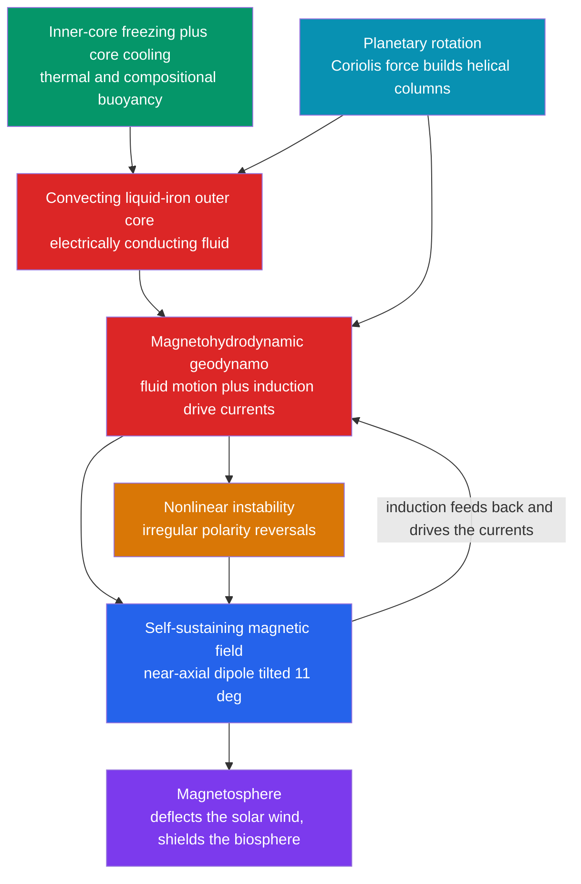

# 🧲 Geomagnetism and the Geodynamo

> [!abstract] TL;DR
> Earth's magnetic field is, to first order, a **geocentric dipole** tilted about $11^\circ$ from the rotation axis, described at every point by **declination** $D$, **inclination** $I$ (with the paleolatitude law $\tan I = 2\tan\lambda$), and intensity $F$, and expanded globally in **spherical harmonics** (the IGRF). Its origin is a genuine puzzle: the iron core is far above the Curie temperature, so it *cannot* be a permanent magnet. The field is instead generated by a **self-exciting geodynamo** — convecting, electrically conducting liquid iron in the outer core, organized by the planet's rotation, drives electric currents through **magnetohydrodynamic induction** that sustain the very field driving them. This bootstrap engine, powered by core cooling and inner-core freezing, drifts on decadal timescales (**secular variation**), flips polarity irregularly (**reversals**), and inflates the **magnetosphere** that shields life from the solar wind.

---

## Intuition

**Analogy:** A compass needle points north because the whole planet acts like one enormous bar magnet. But here is the mystery that undoes that comforting picture: the Earth's iron core is thousands of degrees hot — far hotter than the temperature at which iron loses *all* magnetism (heat destroys permanent magnets). So there is no bar magnet down there. What, then, generates the field that shields us from solar radiation, steers migrating birds, and swings your compass?

The answer is a **self-sustaining dynamo**. Picture a churning ocean of molten iron in the outer core, stirred by heat rising from below and twisted into corkscrew columns by the planet's spin. Moving metal through a magnetic field drives electric currents; those currents generate a magnetic field; and that field is exactly the one the moving metal is cutting through. Field feeds current feeds field — a **bootstrap engine** that has run for billions of years off nothing but the planet's own heat and rotation. Like any nonlinear engine it is not perfectly steady: it wanders, and every so often it stutters and **flips its polarity**, swapping magnetic north and south.

---

## How It Works

### Core Mechanics

1. **The field is a tilted dipole.** To first order Earth's field looks as if a bar magnet sat at the centre, aligned nearly (but not exactly) with the spin axis — a **geocentric dipole** tilted $\sim 11^\circ$. This is why the *magnetic* poles do not coincide with the *geographic* poles.
2. **Three measured elements.** At any point the field vector is fixed by **declination** $D$ (its horizontal deviation from true north), **inclination** $I$ (how steeply it dips below horizontal), and **intensity** $F$. For a dipole, $\tan I = 2\tan\lambda$: flat at the equator, vertical at the poles — the key to reading *paleolatitude* from rocks.
3. **The origin problem.** The core sits at $\sim 4000\text{–}6000\,\mathrm{K}$, hundreds of times hotter than iron's Curie point ($1043\,\mathrm{K}$). Above that temperature ferromagnetism vanishes, so a frozen permanent magnet is impossible. The field must be *actively generated*.
4. **The dynamo mechanism.** The liquid-iron outer core is an excellent electrical conductor kept **convecting** by heat loss and by buoyant light elements released as the solid inner core freezes. Moving that conductor through a magnetic field induces currents ([[Faradays_Law_and_Induction]]) whose own field reinforces the original — a **self-exciting dynamo**.
5. **Rotation sets the axis.** The **Coriolis force** twists the convection into helical columns roughly aligned with the spin axis, which is why the dipole ends up close to the rotation axis and why $\tan I = 2\tan\lambda$ is useful at all.
6. **It is not steady.** Nonlinear feedback makes the dynamo drift (**secular variation**, westward drift) and occasionally **reverse** its polarity at irregular intervals.

### Governing physics

Outside its sources the field is curl-free ($\nabla\times\mathbf{B}=0$; the magnetostatic limit of [[Maxwells_Equations]]), so it derives from a scalar potential expanded in **spherical harmonics** — the Gauss coefficients $g_l^m,\ h_l^m$ tabulated and updated for drift by the **International Geomagnetic Reference Field (IGRF)**. The $l=1$ terms are the dipole (about $90\%$ of the surface field); higher $l$ are the **non-dipole** field.

Inside the core, the field obeys the **magnetic induction equation** (Faraday's + Ohm's law for a moving conductor):

$$\frac{\partial \mathbf{B}}{\partial t} = \underbrace{\nabla\times(\mathbf{v}\times\mathbf{B})}_{\text{advection: field dragged by flow}} + \underbrace{\eta\,\nabla^2\mathbf{B}}_{\text{ohmic diffusion}}, \qquad \eta = \frac{1}{\mu_0\sigma}$$

Dynamo action requires the **magnetic Reynolds number** $R_m = UL/\eta = \mu_0\sigma U L$ to exceed a critical value of order tens, so that advective amplification outpaces ohmic decay. See [[Magnetohydrodynamics_and_Plasma_Flows]] for the full MHD treatment.



---

## Key Concepts

### Secondary Level

- **Giant magnet, but not a permanent one.** The field behaves like a bar magnet tilted $\sim 11^\circ$ from the spin axis, yet the core is far too hot to hold permanent magnetism — the field is generated by moving molten iron.
- **Declination and inclination.** *Declination* $D$ is how far the compass points east or west of true north; *inclination* $I$ is how steeply the needle would dip if free to tip vertically — flat at the equator, straight down at the pole.
- **The dipole law.** $\tan I = 2\tan\lambda$ links dip to latitude, so a rock that froze in the field secretly records *where on the planet it was*.
- **The magnetosphere.** The field carves out a protective bubble that deflects the solar wind; without it, charged particles would strip the atmosphere (as happened on Mars).
- **Reversals happen.** Magnetic north and south swap places every so often, at irregular intervals of tens of thousands to millions of years.

### Undergraduate Level

- **Component relations.** With intensity $F$: $H = F\cos I$ (horizontal), $Z = F\sin I$ (vertical, down positive), $\tan I = Z/H$; and $X = H\cos D,\ Y = H\sin D,\ F^2 = X^2+Y^2+Z^2$.
- **Dipole geometry.** A geocentric dipole of moment $m$ gives $Z = 2B_0\sin\lambda$, $H = B_0\cos\lambda$ with $B_0 = \mu_0 m/4\pi R^3$, so $\tan I = 2\tan\lambda$ falls out directly, and $F = B_0\sqrt{1+3\sin^2\lambda}$ — exactly twice as strong at the poles as the equator.
- **Why a dynamo is required.** The core temperature vastly exceeds iron's Curie point ($770^\circ\mathrm{C}$), ruling out a permanent magnet. A dynamo needs three ingredients: a conducting fluid in motion, induction (Faraday), and an organizing rotation (Coriolis).
- **The magnetic Reynolds number.** $R_m = \mu_0\sigma U L$ measures advection versus ohmic diffusion; the geodynamo runs at $R_m \sim 10^2\text{–}10^3$, comfortably supercritical.
- **Secular variation.** $D$, $I$, and $F$ drift measurably over decades to centuries; non-dipole features drift westward at $\sim 0.2^\circ/\mathrm{yr}$, the dipole is currently weakening $\sim 5\%$ per century, and the North Dip Pole is racing across the Arctic.

### Graduate Level

- **Spherical-harmonic (Gauss) representation.** $V(r,\theta,\phi) = R\sum_{l,m}(R/r)^{l+1}[g_l^m\cos m\phi + h_l^m\sin m\phi]P_l^m(\cos\theta)$; the axial dipole is $g_1^0$, and the IGRF publishes the coefficients plus their secular-variation rates. The growing **South Atlantic Anomaly** is read directly from the low-order non-dipole terms.
- **Full MHD dynamo problem.** The coupled Navier–Stokes, induction, and continuity equations in a rotating, convecting, stratified spherical shell — controlled by the Ekman, Rayleigh, Prandtl, and magnetic Prandtl numbers. Mean-field theory decomposes it into the **$\Omega$-effect** (differential rotation shears poloidal field into toroidal) and the **$\alpha$-effect** (helical turbulence twists toroidal back into poloidal).
- **Energy budget.** Thermal and **compositional** convection (light elements expelled as the inner core freezes) supply the buoyancy power; ohmic dissipation sets the balance. This ties the field's very existence to the planet's [thermal evolution and heat flow](#related-concepts).
- **Numerical geodynamo.** The **Glatzmaier–Roberts (1995)** 3-D self-consistent simulation first reproduced spontaneous reversals, in which the dipole collapses and the transitional field goes multipolar before rebuilding with opposite sign. Modern simulations run at parameter regimes still far from Earth's, extrapolated via scaling laws.
- **Reversals as a nonlinear-dynamics phenomenon.** Low-order truncations such as the **Rikitake two-disk dynamo** show that a deterministic, self-exciting dynamo can flip polarity *chaotically* — reversals are irregular, not periodic ([[Chaos_Theory_and_Sensitive_Dependence]]).

---

## Python Demo

```python
# Two faces of geomagnetism:
#   (a) the DIPOLE field  -- inclination vs latitude (tan I = 2 tan lambda),
#       the paleolatitude relation, and the meridional field-line geometry;
#   (b) the DYNAMO -- a Rikitake two-disk model whose coupled ODEs
#       self-sustain and flip polarity CHAOTICALLY, like the real reversal record.
import numpy as np
import matplotlib.pyplot as plt

# ----------------------------------------------------------------------
# (a) Geocentric axial dipole: inclination vs geomagnetic latitude
#     tan(I) = 2 tan(lambda)  -> flat at equator, vertical at the poles
# ----------------------------------------------------------------------
lat  = np.linspace(-89.9, 89.9, 400)                    # geomagnetic latitude (deg)
incl = np.degrees(np.arctan(2.0 * np.tan(np.radians(lat))))

def paleolatitude(I_deg):
    """Invert a measured rock inclination to recover paleolatitude."""
    return np.degrees(np.arctan(np.tan(np.radians(I_deg)) / 2.0))

I_sample   = 60.0                                       # a lava flow records I = +60 deg
lam_sample = paleolatitude(I_sample)
print(f"Rock inclination I = {I_sample:.0f} deg  ->  paleolatitude = {lam_sample:.1f} deg")

# Dipole field-line geometry in a meridional plane:  r = L * cos^2(lambda)
lam_line = np.radians(np.linspace(-90, 90, 400))
shells   = [1.5, 2.0, 3.0, 5.0]                         # L-shell values (Earth radii)

# ----------------------------------------------------------------------
# (b) Rikitake two-disk dynamo -- self-sustained CHAOTIC polarity reversals
#     dx/dt = -mu*x + z*y
#     dy/dt = -mu*y + (z - a)*x
#     dz/dt =  1 - x*y
#     x, y are the two coupled disk currents; the SIGN of x is the polarity.
# ----------------------------------------------------------------------
mu, a = 1.0, 5.0

def rikitake(s):
    x, y, z = s
    return np.array([-mu*x + z*y,
                     -mu*y + (z - a)*x,
                     1.0 - x*y])

def rk4_step(s, dt):
    k1 = rikitake(s)
    k2 = rikitake(s + 0.5*dt*k1)
    k3 = rikitake(s + 0.5*dt*k2)
    k4 = rikitake(s + dt*k3)
    return s + (dt/6.0)*(k1 + 2*k2 + 2*k3 + k4)

dt, N = 0.01, 60000
s = np.array([-1.4, -1.0, 1.0])                         # off-equilibrium start
X = np.empty(N); T = np.empty(N)
for i in range(N):
    X[i] = s[0]; T[i] = i*dt
    s = rk4_step(s, dt)

reversals = int(np.sum(np.abs(np.diff(np.sign(X))) > 0))
print(f"Rikitake dynamo: {reversals} sign flips of the disk current over t = {N*dt:.0f}")

# ----------------------------------------------------------------------
# Plot
# ----------------------------------------------------------------------
fig = plt.figure(figsize=(11, 8))
gs  = fig.add_gridspec(2, 2, height_ratios=[1.1, 1.0])

ax1 = fig.add_subplot(gs[0, 0])
ax1.plot(lat, incl, lw=2, color="#2563eb")
ax1.axhline(0, color="k", lw=0.5); ax1.axvline(0, color="k", lw=0.5)
ax1.scatter([lam_sample], [I_sample], color="red", zorder=5,
            label=f"I={I_sample:.0f} deg -> lat={lam_sample:.1f} deg")
ax1.set_xlabel("Geomagnetic latitude (deg)")
ax1.set_ylabel("Inclination  I  (deg)")
ax1.set_title("Dipole law:  tan I = 2 tan(latitude)")
ax1.legend(fontsize=8); ax1.grid(alpha=0.3)

ax2 = fig.add_subplot(gs[0, 1])
for L in shells:
    r  = L * np.cos(lam_line)**2
    xx = r * np.cos(lam_line); zz = r * np.sin(lam_line)
    ax2.plot(xx, zz, color="#059669", lw=1.5)
th = np.linspace(0, 2*np.pi, 200)
ax2.plot(np.cos(th), np.sin(th), color="saddlebrown", lw=2)          # Earth
ax2.annotate("", xy=(0, 1.6), xytext=(0, -1.6),
             arrowprops=dict(arrowstyle="->", color="gray"))          # dipole axis
ax2.set_aspect("equal"); ax2.set_xlim(-6, 6); ax2.set_ylim(-3, 3)
ax2.set_title("Dipole field lines (meridional plane)")
ax2.set_xlabel("equatorial distance (Earth radii)")

ax3 = fig.add_subplot(gs[1, :])
ax3.plot(T, X, lw=0.7, color="#dc2626")
ax3.axhline(0, color="k", lw=0.8)
ax3.set_xlabel("time (dimensionless)")
ax3.set_ylabel("disk current  x  (field polarity)")
ax3.set_title(f"Rikitake geodynamo: {reversals} irregular polarity reversals "
              f"(no fixed period)")
ax3.grid(alpha=0.3)

plt.tight_layout(); plt.show()
```

The first panel is the backbone of paleomagnetism: a measured inclination pins the latitude at which a rock froze. The second shows the dipole's classic field-line geometry — lines emerging near one pole, arcing over the equator, and re-entering near the other. The third makes the deep point visible: a *deterministic* dynamo, with no external forcing and no built-in clock, produces polarity reversals that come at **irregular intervals** — exactly the character of the real geomagnetic reversal record.

---

## Real-World Applications

- **Navigation.** Every chart and aircraft heading corrects magnetic bearings for local **declination**, which drifts with secular variation — charts carry annual rates of change and are periodically re-issued.
- **Space weather.** The magnetosphere deflects the solar wind at the magnetopause ($\sim 10\,R_E$ on the dayside) and traps the Van Allen belts; magnetic storms induce ground currents that trip power grids and disrupt satellites and GPS.
- **The South Atlantic Anomaly.** A regional weak spot where the inner radiation belt dips low enough to threaten satellite electronics and crewed spacecraft — monitored directly through the IGRF's non-dipole coefficients.
- **Resource exploration.** Aeromagnetic and marine magnetic surveys map ore bodies, igneous intrusions, faults, and the age of ocean crust from the contrast between the core field and crustal (rock) magnetism.
- **Planetary comparison.** Whether a planet has a dynamo diagnoses its interior: Earth and Mercury run active dynamos; Mars and the Moon show only *fossil* crustal magnetism from dynamos that died as their cores cooled — a direct probe of *planetary thermal evolution*.
- **Deep-time dating.** The reversal record (the Geomagnetic Polarity Time Scale) provides a global clock for correlating seafloor stripes and sediment sections, underpinning the confirmation of plate tectonics.

---

## Common Pitfalls

- **Three different "poles."** The **geographic** pole (spin axis), the **geomagnetic** pole (best-fit-dipole axis, tilted $\sim 11^\circ$), and the **magnetic dip poles** (where $I=90^\circ$) are three distinct points. Only the *time-averaged* field is truly axial (the geocentric axial dipole hypothesis).
- **Which pole is which polarity.** A compass north-seeking end points toward Earth's *magnetic north*, but the physical magnetic *pole* sitting there is a field **south** pole. Reversals swap the labels.
- **Declination vs inclination.** Declination is a *horizontal* deviation from true north; inclination is a *vertical* dip angle. They answer different questions and are measured differently — do not conflate them.
- **"The field is a dipole."** It is *mostly* dipolar (about $90\%$ of surface energy), not purely so. The non-dipole field is real, sizeable, and drifts westward; ignoring it corrupts paleopoles and hazard models.
- **Secular variation is not noise.** Decadal-to-centennial drift is a genuine signal from core flow; a single spot reading must be averaged over enough time and sites to cancel it before it means "the pole."
- **Reversals are irregular, not periodic.** They have no fixed clock: the last (Brunhes–Matuyama) was $\sim 0.78\,\mathrm{Ma}$, yet the Cretaceous Normal Superchron ran $\sim 40\,\mathrm{Myr}$ with none. Treating reversals as periodic is a classic modelling error — the Rikitake demo above shows why deterministic chaos, not a metronome, governs them.
- **Excursions are not reversals.** An excursion swings the field far off-axis but returns to the *same* polarity; only a completed reversal flips it.

---

## Related Concepts

- [[Geomagnetism_and_Paleomagnetism]] — the Earth-Science companion: how rocks record the ancient field and how that record proved plate tectonics (this note is the geodynamo-physics treatment)
- [[Magnetohydrodynamics_and_Plasma_Flows]] — the full MHD machinery (induction equation, frozen-in flux, magnetic Reynolds number) that the geodynamo is a special case of
- [[Magnetohydrodynamics]] — the physics-vault MHD note on conducting-fluid dynamics
- [[Faradays_Law_and_Induction]] — induction is the engine of the self-exciting dynamo
- [[Maxwells_Equations]] — the source-free, curl-free limit justifies the Gauss spherical-harmonic potential
- [[Magnetism_and_Biot_Savart]] — the dipole magnetostatics behind $\tan I = 2\tan\lambda$
- [[Convection_and_Thermal_Fluid_Dynamics]] — the thermal/compositional convection that powers the dynamo
- [[Rotating_and_Stratified_Flows]] — the Coriolis force that organizes convection into axial helical columns
- [[Geophysical_Fluid_Dynamics]] — rotating-fluid dynamics shared by the core, ocean, and atmosphere
- [[Chaos_Theory_and_Sensitive_Dependence]] — why the Rikitake dynamo (and the real field) reverses chaotically rather than periodically
- [[The_Sun]] — the solar dynamo and the solar wind that the magnetosphere deflects
- [[Earths_Internal_Heat_and_Geothermal_Gradient]] — the core cooling and inner-core freezing that supply the dynamo's power

---

## Review Questions

1. **Secondary:** A basalt records a magnetic inclination of $I = 60^\circ$. Using $\tan I = 2\tan\lambda$, at what geomagnetic latitude did it solidify? Would a rock that formed on the magnetic equator record a steep or a flat inclination, and why can't the compass field come from a permanent magnet in the core?
2. **Undergraduate:** State the three ingredients a self-exciting dynamo requires and identify which Maxwell/Faraday law supplies the induction. What does the magnetic Reynolds number $R_m$ measure, and why must it exceed a critical value for the geodynamo to sustain a field against ohmic decay?
3. **Graduate:** The Rikitake two-disk model is a deterministic system with no external forcing, yet it reverses polarity at irregular intervals. Explain what this demonstrates about the nature of geomagnetic reversals, contrast it with a periodic oscillator, and describe how a full 3-D geodynamo simulation (e.g. Glatzmaier–Roberts) produces a reversal in terms of the dipole collapsing through a multipolar transition.

---

## Sources

- Merrill, R. T., McElhinny, M. W. & McFadden, P. L. — *The Magnetic Field of the Earth: Paleomagnetism, the Core, and the Deep Mantle*, Academic Press
- Backus, G., Parker, R. & Constable, C. — *Foundations of Geomagnetism*, Cambridge University Press
- Roberts, P. H. & King, E. M. (2013) — "On the genesis of the Earth's magnetism," *Reports on Progress in Physics* 76, 096801
- Turcotte, D. L. & Schubert, G. — *Geodynamics*, 3rd ed. (magnetics and core dynamics chapters), Cambridge University Press
- Glatzmaier, G. A. & Roberts, P. H. (1995) — "A three-dimensional self-consistent computer simulation of a geomagnetic field reversal," *Nature* 377, 203

---

#geophysics #geomagnetism #geodynamo #magnetic-field #magnetohydrodynamics
