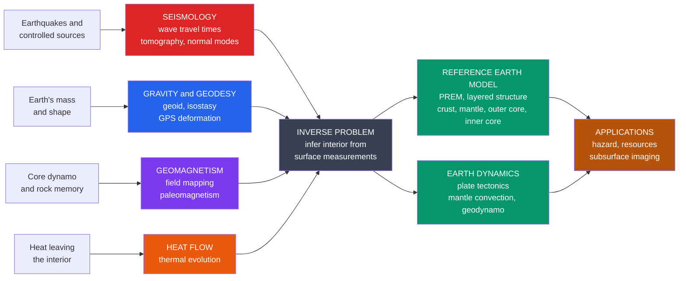

# 🌍 Geophysics — Overview

> [!abstract] TL;DR
> **Geophysics** applies the tools of physics — elasticity, potential theory, electromagnetism, fluid dynamics, thermodynamics — to study the **solid Earth**: its internal structure, composition, and dynamics. Because we can drill only a few kilometres into a planet whose centre lies **6,371 km** down, almost everything we know about the deep Earth is inferred **remotely** from the physical fields it radiates to the surface — **seismic waves**, **gravity**, the **magnetic field**, **heat flow**, and **surface deformation**. The unifying intellectual problem is the **inverse problem**: reconstructing an inaccessible interior from surface measurements. The unifying result is the **layered, convecting Earth** — crust, mantle, liquid outer core, solid inner core — codified in reference models like **PREM**, and driven by the **plate-tectonic engine**.

## Intuition — analogy FIRST

You cannot dig into the Earth. The deepest hole humans have ever bored, the **Kola Superdeep Borehole**, reached only **~12.3 km** before the rock grew too hot and plastic to drill — it did not even pierce the crust, let alone the **2,900 km** of mantle beneath it or the metallic core below that. And yet we speak with confidence about a **molten iron outer core**, a **solid inner core hotter than the Sun's surface but frozen by pressure**, and a **mantle that slowly convects** like syrup over geologic time. How can anyone *know* this about a place no instrument has ever visited?

The answer is the same trick modern medicine uses on a patient it must not cut open. A doctor "sees" inside a body with **ultrasound** (echoes of sound waves), **X-rays and CT** (rays that bend and attenuate through tissue of different density), and **MRI** (a response to magnetic fields). **Geophysics is planetary medical imaging.** Every earthquake is a hammer-tap that rings the whole planet like a bell; thousands of seismometers are the ultrasound probe. The Earth's **gravity** field bulges and dips over dense and light interiors like a CT scan of density. Its **magnetic field** is a live readout of iron churning in the core. The **heat** leaking from the ground measures the engine's power. Read together, these fields let us see the unseeable inside our world — and the mathematical craft of turning surface readings into an interior picture is what geophysics is really about.

---

## How It Works

Geophysics is not one method but a **toolkit of physical probes**, each sensitive to a different property of the interior. No single probe is enough; the interior is pinned down by making them **agree**. Seismic waves reveal **elastic structure** (stiffness and density) and locate sharp boundaries; gravity constrains the **distribution of mass**; magnetism reads the **core dynamo** and past field reversals frozen in rock; heat flow measures the **thermal budget** that powers everything; geodesy watches the surface **move in real time**. Each measurement is a **forward problem** run in reverse — given data at the surface, *invert* for the Earth model that could have produced it.



---

## Key Concepts

### Secondary Level

- **Physics of the whole planet.** Geophysics = physics applied to the Earth. We treat the planet as a physical system that carries **waves**, has a **gravity** pull, a **magnetic** field, and internal **heat**.
- **We look, we don't dig.** The interior is studied **indirectly**. The Kola borehole (~12 km) barely scratches a planet 6,371 km in radius, so we rely on signals that travel *out* of the deep Earth to the surface.
- **Earthquakes are our flashlight.** Seismic waves from earthquakes pass through the whole Earth. Timing how long they take to arrive at stations around the globe reveals what they passed through.
- **The layered Earth.** Crust (thin, rocky) → mantle (thick, hot, slowly flowing) → **outer core** (liquid iron) → **inner core** (solid iron). Different layers bend and block waves differently.
- **The plate-tectonic engine.** The rigid outer shell is broken into plates that drift on the slowly convecting mantle, causing earthquakes, volcanoes, and mountains.

### Undergraduate Level

- **Two families of probe.**
  - **Seismology** — the primary probe of the deep interior. **P-waves** (compressional) and **S-waves** (shear) travel at speeds set by the rock's elastic moduli and density; **S-waves cannot pass through liquid**, so their disappearance below ~2,891 km *proves* the outer core is molten.
  - **Potential fields** — **gravity** (constrains mass distribution, the **geoid**, and **isostasy**) and **magnetism** (the **geodynamo** in the outer core, plus **paleomagnetism** frozen into rocks). Both obey Laplace/Poisson equations, hence "potential" fields.
- **Reference Earth models.** Global data are synthesized into 1-D radial models, most famously **PREM (Preliminary Reference Earth Model, Dziewonski & Anderson 1981)**, giving density, P- and S-velocity, and moduli as functions of radius.
- **Discontinuities betray boundaries.** The **Moho** (crust/mantle), the **410 and 660 km** phase transitions, the **Gutenberg** core–mantle boundary (CMB), and the **Lehmann** inner-core boundary all appear as sharp jumps or drops in seismic velocity.
- **The P-wave shadow zone.** The sudden **drop** in P-velocity at the CMB refracts rays sharply inward, leaving a ring of the surface (~103° to 143° from an earthquake) where direct P-waves do not arrive — a global-scale piece of evidence for the core.
- **Heat and geodesy.** Surface **heat flow** (~47 TW globally) constrains thermal evolution and the mantle's convective vigor; **geodesy** (especially **GPS/GNSS**) now measures plate motions and strain accumulation of a few mm/yr directly.

### Graduate Level

- **The inverse problem is the discipline.** Data `d` relate to the Earth model `m` through a forward operator: `d = G(m)`. Geophysics inverts this — usually **ill-posed, non-unique, and noisy** — requiring **regularization**, **resolution/covariance analysis**, and Bayesian or optimization frameworks. Ray theory (high-frequency) and finite-frequency/full-waveform theory give successively richer `G`.
- **Seismic tomography.** Travel-time and waveform residuals are inverted for **3-D velocity perturbations**, imaging subducting slabs sinking to the CMB and hot upwellings (LLSVPs, plumes) — the direct observation of mantle convection.
- **Normal modes and free oscillations.** After a great earthquake the whole Earth rings in discrete **eigenmodes** (e.g. ₀S₂, the ~54-minute "football" mode). Their frequencies constrain the **radially averaged** density and elastic structure that body waves alone under-determine.
- **Geodynamics.** The mantle is modeled as a **high-Prandtl-number, infinite-Prandtl creeping fluid**; convective vigor is set by the **Rayleigh number**; **rheology** (diffusion/dislocation creep, temperature- and stress-dependent viscosity) links deformation to driving forces. This is the quantitative theory of **plate tectonics and mantle convection**.
- **The geodynamo.** The liquid outer core is a **magnetohydrodynamic (MHD)** system: convection of conducting fluid in a rotating shell sustains the field against ohmic decay, governed by the **magnetic Reynolds number** and coupled induction/Navier–Stokes/heat equations; it undergoes **reversals** recorded by paleomagnetism.
- **Physics foundations.** Seismology = **elastodynamics** (the elastic wave equation); gravity/geodesy = **potential theory** (Laplace/Poisson); geomagnetism = **Maxwell + MHD**; geodynamics = **continuum mechanics and fluid dynamics**; thermal evolution = **thermodynamics and heat transport**. Modern practice adds **HPC**, **adjoint/full-waveform inversion**, and **machine learning** for detection, denoising, and inversion.

---

## Python Demo

Two-panel demo of *reading the Earth remotely*. **Left:** a simplified **PREM-like radial profile** — P-velocity, S-velocity, and density versus depth. Watch the **P-velocity drop and S-velocity vanish** at the core–mantle boundary: that single feature proves a liquid outer core and creates the P-wave shadow zone. **Right:** the classic **seismic-refraction travel-time curve** for a layered crust — the *slope* of each straight segment is `1/velocity`, so the way the curve *bends to shallower slopes* directly encodes faster, deeper layers. This is the inverse problem in miniature: surface arrival times reveal hidden structure.

```python
# Reading the Earth from the outside: PREM-like structure + refraction travel times
import numpy as np
import matplotlib.pyplot as plt

# ---------- (a) Simplified PREM-like radial model ----------
# depth (km), Vp (km/s), Vs (km/s), density (g/cm^3). Duplicated depths = discontinuities.
depth = np.array([0,   24,   24,   410,  410,  660,  660,  2891, 2891, 5150, 5150, 6371])
Vp    = np.array([5.8, 6.5,  8.1,  8.9,  9.1,  10.2, 10.8, 13.7, 8.06, 10.36,11.03,11.26])
Vs    = np.array([3.2, 3.7,  4.5,  4.8,  4.9,  5.6,  6.0,  7.27, 0.0,  0.0,  3.50, 3.67])
rho   = np.array([2.6, 2.9,  3.38, 3.54, 3.72, 4.38, 4.56, 5.57, 9.90, 12.17,12.76,13.09])

boundaries = {"Moho": 24, "410 km": 410, "660 km": 660,
              "CMB (Gutenberg)": 2891, "ICB (Lehmann)": 5150}

# ---------- (b) Layered-crust refraction travel times ----------
# A stack of flat layers: velocities increase with depth. First arrivals reveal each layer.
v = np.array([4.0, 6.0, 8.1])       # km/s: upper crust, lower crust, mantle (Pn)
h = np.array([12.0, 20.0])          # km: thicknesses of the two crustal layers
X = np.linspace(0, 400, 800)        # source-receiver offset (km)

def head_wave_time(X, v, h, j):
    """Travel time of the head wave critically refracted along the top of layer j (0-indexed)."""
    t = X / v[j]
    for k in range(j):
        t = t + 2.0 * h[k] * np.sqrt(v[j]**2 - v[k]**2) / (v[k] * v[j])
    return t

t_direct = X / v[0]                                  # direct wave
t_refr1  = head_wave_time(X, v, h, 1)                # refraction off lower crust
t_refrM  = head_wave_time(X, v, h, 2)               # Pn: refraction along the Moho
t_first  = np.minimum.reduce([t_direct, t_refr1, t_refrM])  # first arrival = lower envelope

# ---------- Plot ----------
fig, (ax1, ax2) = plt.subplots(1, 2, figsize=(13, 6))

ax1.plot(Vp,  depth, "-o", color="#dc2626", lw=2, ms=4, label="Vp (P-wave)")
ax1.plot(Vs,  depth, "-o", color="#2563eb", lw=2, ms=4, label="Vs (S-wave)")
ax1.plot(rho, depth, "-o", color="#059669", lw=2, ms=4, label="density (g/cm^3)")
for name, d in boundaries.items():
    ax1.axhline(d, color="0.6", ls="--", lw=0.8)
    ax1.text(14.2, d, name, va="center", fontsize=8, color="0.3")
ax1.annotate("Vp DROPS, Vs to 0\n=> liquid outer core\n=> P shadow zone",
             xy=(8.06, 2891), xytext=(9.5, 1600), fontsize=8, color="#dc2626",
             arrowprops=dict(arrowstyle="->", color="#dc2626"))
ax1.set_xlabel("velocity (km/s)  /  density (g/cm^3)")
ax1.set_ylabel("depth (km)")
ax1.set_title("Simplified PREM-like radial structure")
ax1.invert_yaxis()
ax1.set_xlim(0, 17.5)
ax1.legend(loc="lower right", fontsize=8)
ax1.grid(alpha=0.3)

ax2.plot(X, t_direct, "--", color="0.6", lw=1, label=f"direct  slope=1/{v[0]:.0f}")
ax2.plot(X, t_refr1,  "--", color="0.6", lw=1, label=f"refraction  slope=1/{v[1]:.0f}")
ax2.plot(X, t_refrM,  "--", color="0.6", lw=1, label=f"Pn (Moho)  slope=1/{v[2]:.1f}")
ax2.plot(X, t_first,  "-",  color="#7c3aed", lw=2.5, label="first arrival (observed)")
ax2.set_xlabel("source-receiver distance X (km)")
ax2.set_ylabel("travel time T (s)")
ax2.set_title("Refraction travel-time curve: slope = 1/velocity")
ax2.text(250, 20, "curve bends to shallower slopes\n=> faster, deeper layers\n(the inverse problem)",
         fontsize=8, color="#7c3aed")
ax2.legend(loc="upper left", fontsize=8)
ax2.grid(alpha=0.3)

plt.tight_layout()
plt.savefig("geophysics_overview.png", dpi=120)
print("Saved geophysics_overview.png")
print(f"Global mean density implied by rho profile is dominated by the dense core "
      f"(inner core rho ~ {rho[-1]} g/cm^3 vs crust ~ {rho[0]} g/cm^3).")
```

Running it shows the two pillars of the field in one picture: a **radial model** whose sharp features localize the layers, and a **travel-time curve** whose geometry *is* the data we invert to get that model.

---

## Real-World Applications

- **Earthquake hazard and early warning.** Locating quakes, mapping faults, and characterizing ground shaking (e.g. **ShakeAlert** on the US West Coast, Japan's nationwide EEW) rests on seismology and geodesy.
- **Resource exploration.** **Reflection seismology**, gravity, and magnetic surveys image sedimentary basins for oil, gas, geothermal energy, and critical minerals; the same physics underlies **CO₂ sequestration** monitoring.
- **Tsunami warning.** Rapid inversion of seismic and **GPS/GNSS** data for the earthquake's rupture drives tsunami forecasts within minutes.
- **Nuclear-test monitoring.** The **CTBTO's** global seismic, hydroacoustic, and infrasound network detects and discriminates underground explosions from natural earthquakes.
- **Deep-Earth science.** Global **tomography** images sinking slabs and rising plumes; **paleomagnetism** reconstructs past plate positions and dates the seafloor via magnetic-reversal stripes.
- **Planetary geophysics.** The same methods went to Mars with **NASA InSight's** seismometer, revealing the Martian crust, mantle, and a surprisingly large liquid core.
- **Engineering and near-surface.** Ground-penetrating radar, electrical resistivity, and shallow seismics support foundation design, archaeology, groundwater mapping, and hazard zoning.

---

## Common Pitfalls

- **Confusing the two layerings of the Earth.** *Compositional* layers (crust/mantle/core) do not coincide with *mechanical* layers (lithosphere/asthenosphere/mesosphere/outer core/inner core). The lithosphere spans crust *and* uppermost mantle; the asthenosphere is entirely mantle. Mixing the schemes leads to wrong depths.
- **Treating inverse solutions as unique.** Surface data rarely pin down a *single* interior model. Different structures can fit the same data (**non-uniqueness**); results are only as good as their **resolution** and **model assumptions**. Always ask what a "recovered" feature's uncertainty and resolution length are.
- **Forgetting S-waves need a solid.** S-waves vanishing below the CMB is *the* evidence for a liquid outer core; conversely, expecting an S-wave arrival through the core is a classic error.
- **Ray theory outside its regime.** Ray/travel-time theory assumes wavelengths short compared to structure. For long-period waves, normal-mode and finite-frequency ("banana-doughnut") theory are required, or features get mislocated.
- **Ignoring the reference frame in geodesy.** Plate velocities are meaningless without a stated reference frame (e.g. no-net-rotation, hotspot, or a fixed plate); mm/yr signals are easily corrupted by unmodeled reference-frame drift.
- **Density is only weakly seen by body waves.** P- and S-velocities constrain moduli, but **density** is poorly resolved by travel times alone — it comes largely from **normal modes**, gravity, and the Earth's mass/moment of inertia. Assuming velocities alone fix density is a mistake.

---

## Related Concepts

- [[Earth_Internal_Structure]] — the crust/mantle/core layering and PREM that geophysical inversion produces; this overview is the *physics* behind that picture.
- [[Seismology_and_Earthquakes]] — the primary probe of the deep interior; source physics, P/S waves, and the shadow zone.
- [[Gravity_Isostasy_and_the_Geoid]] — the potential-field method that constrains the Earth's mass distribution and shape.
- [[Geomagnetism_and_Paleomagnetism]] — the core geodynamo and the rock record of field reversals used to date and reposition plates.
- [[Earths_Internal_Heat_and_Geothermal_Gradient]] — the thermal budget that powers mantle convection and the geodynamo.
- [[Mantle_Convection_and_Hotspots]] — the fluid-dynamical engine imaged by tomography; the geodynamics side of the field.
- [[Plate_Boundaries_and_Plate_Motions]] — the surface expression of the deep engine, now measured directly by geodesy.
- [[Wave_Motion_and_Properties]] — the wave physics underlying all of seismology.
- [[Oscillations_and_SHM]] — the harmonic basis of the Earth's free oscillations (normal modes).
- [[Maxwells_Equations]] — the electromagnetic foundation of geomagnetism and the MHD geodynamo.
- [[Newtons_Laws_and_Kinematics]] — gravitation and mechanics behind the gravity/geodesy methods.
- [[Viscous_Fluids_and_Navier_Stokes]] — the creeping-flow equations governing mantle convection and the outer-core dynamo.
- [[Laws_of_Thermodynamics]] — heat transport and thermal evolution of the interior.
- [[Introduction_to_PDEs]] — the elastic-wave, Laplace/Poisson, and diffusion equations are all PDEs solved and inverted in geophysics.
- [[Fourier_Analysis]] — spectral analysis of seismograms, normal modes, and potential fields.
- [[Fourier_Transform]] — signal processing of geophysical time series (filtering, spectra, deconvolution).

---

## Review Questions

### Secondary Level

1. Humans have never drilled deeper than about 12 km, yet we describe a molten iron core 2,900 km down. Explain, in your own words, *how* geophysicists can "see" that deep without going there.
2. Name the four main layers of the Earth from the outside in, and say which one is liquid.

### Undergraduate Level

3. S-waves are not observed passing through the Earth's core, whereas P-waves are (with a shadow zone). What does each of these observations tell you about the physical state and structure of the core, and why?
4. What is the **PREM**, and what kinds of measurements are combined to build such a reference Earth model? Give at least three independent data types and what each constrains.

### Graduate Level

5. Geophysical inversion is described as "ill-posed and non-unique." Explain what these terms mean operationally, and describe two strategies used to obtain a usable model despite them (e.g. regularization, resolution analysis, or complementary data).
6. Body-wave travel times constrain seismic velocities well but density poorly. Explain why, and describe which observations (normal modes, gravity, moment of inertia) supply the missing density information and how they complement seismic body waves.

---

## Sources

- Fowler, C. M. R. — *The Solid Earth: An Introduction to Global Geophysics* (Cambridge University Press).
- Stein, S. & Wysession, M. — *An Introduction to Seismology, Earthquakes, and Earth Structure* (Blackwell).
- Turcotte, D. L. & Schubert, G. — *Geodynamics* (Cambridge University Press).
- Lowrie, W. — *Fundamentals of Geophysics* (Cambridge University Press).
- Dziewonski, A. M. & Anderson, D. L. (1981) — "Preliminary reference Earth model," *Physics of the Earth and Planetary Interiors*, 25, 297–356.

---

#geophysics #solid-earth #earth-structure #seismology #foundations
