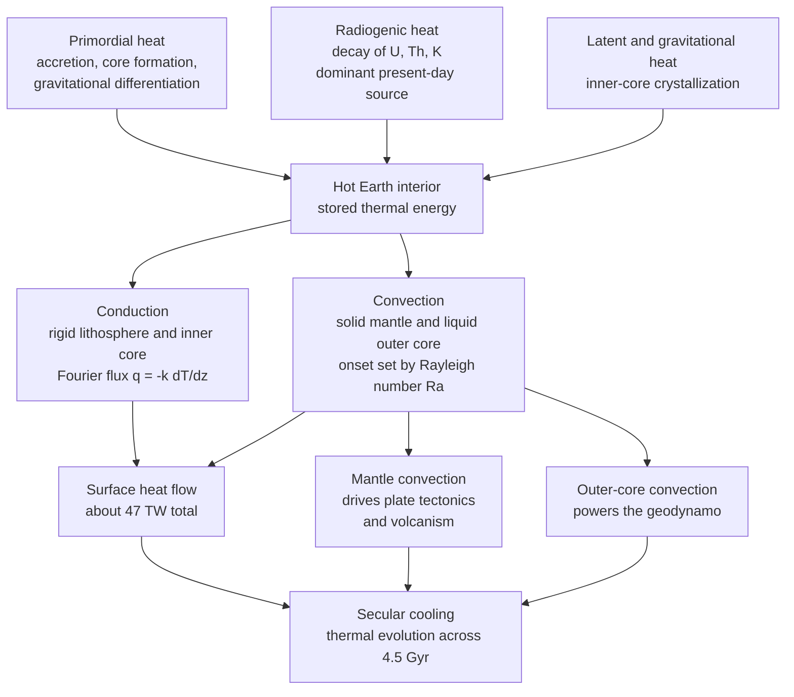

# 🌋 Terrestrial Heat Flow and Thermal Evolution

> [!abstract] TL;DR
> Earth is a slowly cooling ball of rock powered by **primordial heat** (accretion, core formation, differentiation) plus **radiogenic heat** (decay of $^{238}$U, $^{235}$U, $^{232}$Th, $^{40}$K) and a dash of **latent heat** from inner-core crystallization — about **47 TW** in all. That heat escapes by **conduction** through the rigid lithosphere (Fourier's law) and by **convection** in the deep mantle and outer core (set by the Rayleigh number). The escaping flux carves the **geotherm** — steep in the conductive boundary layers, nearly adiabatic in the well-mixed interior — and drives plate tectonics, volcanism and the geodynamo. Oceanic lithosphere behaves as a cooling thermal boundary layer, so **seafloor depth and heat flow both scale as $\sqrt{\text{age}}$**, one of geophysics' cleanest confirmations of plate cooling. Over 4.5 Gyr the planet cools secularly; the **Urey ratio** measures how much of today's flux is radiogenic versus leftover primordial heat. Kelvin's famous 20–40 Myr "age of the Earth" was wrong precisely because he ignored radioactivity and mantle convection.

## Intuition — analogy FIRST

The Earth is a slowly cooling ball of rock, still glowing hot inside from its violent birth and from radioactive atoms decaying in its interior. That escaping heat is the engine of geology — it drives the mantle to convect, the plates to move, volcanoes to erupt, and the core to churn out a magnetic field. Yet the surface is deceptively cool because rock is a superb insulator: a thin, rigid skin traps almost all the temperature difference in its top hundred kilometres, like the crust on a fresh loaf that stays touchable while the inside scalds. Reading how much heat leaks out through that skin, and how the temperature climbs with depth, tells us how our planet works and how it has aged over 4.5 billion years.

Two facts make the whole subject tractable. First, **heat moves in two very different ways**: slow, diffusive **conduction** where rock is rigid, and fast, stirring **convection** where rock can creep. Second, **where you are in the planet decides which mode wins** — conduction in the lithosphere and inner core, convection in the mantle and outer core — and that single distinction explains the shape of the geotherm, the pace of cooling, and every surface expression of Earth's internal heat.

---

## How It Works

Heat sources charge the interior; two transport modes carry that heat toward the surface; the surface flux and the cooling it represents drive tectonics, magnetism and the planet's long thermal history.



The steep near-surface gradient you would measure in a borehole belongs only to the **conductive lithosphere**. Below it the mantle convects and the geotherm bends onto a shallow **adiabat**; the sharp bends between the two regimes are the **thermal boundary layers** (the lithosphere at the top, the D'' layer above the core). This is the physics companion to the geothermal-gradient bookkeeping in **Earth_Science / Earths_Internal_Heat_and_Geothermal_Gradient**, and it feeds directly into the sibling Geophysics notes **Mantle_Convection_and_Dynamics**, **Geomagnetism_and_the_Geodynamo**, **The_Deep_Structure_of_the_Earth** and **Geophysics_of_Plate_Tectonics** (see the **Geophysics_Overview**).

---

## Key Concepts

### Secondary Level

- **Where the heat comes from.** Two big sources plus a small one. **Primordial heat** is leftover warmth from Earth's birth: smashing planetesimals (accretion) and dense iron sinking to form the core (differentiation) released enormous gravitational energy as heat. **Radiogenic heat** is made continuously today by radioactive atoms (uranium, thorium, potassium) decaying inside the rock. A little extra **latent heat** is released as the liquid outer core slowly freezes onto the solid inner core.
- **Two ways heat travels.** **Conduction** passes heat atom-to-atom without the rock moving — slow, and dominant in the rigid outer shell. **Convection** carries heat by actually moving hot material, like a pot of soup overturning — fast, and dominant deep inside where rock can creep over millions of years.
- **The geothermal gradient.** Temperature rises with depth, roughly **25–30 °C per kilometre** in the continental crust. But you cannot extend that rate to the centre — deeper down the mantle stirs itself and the temperature climbs far more gently.
- **Why the surface feels cool.** Rock is an excellent insulator, so almost all of Earth's internal heat is bottled up. Only about **47 trillion watts (47 TW)** leaks out over the whole surface — enormous in total, but spread thin.

### Undergraduate Level

- **Fourier's law and the conductive geotherm.** In the lithosphere heat moves by conduction, $q = -k\,\dfrac{dT}{dz}$, with $k \approx 2\text{–}4\ \mathrm{W\,m^{-1}\,K^{-1}}$. Steady 1-D conduction with volumetric heat production $A$ gives

$$\frac{d}{dz}\!\left(k\frac{dT}{dz}\right) + A = 0 \quad\Rightarrow\quad T(z) = T_s + \frac{q_0}{k}\,z - \frac{A\,z^2}{2k}.$$

- **The global heat budget.** Total surface loss is $Q \approx 46\text{–}47\ \mathrm{TW}$ from tens of thousands of borehole and marine determinations. Oceanic lithosphere loses far more per unit area than continental (young seafloor is hot), while continents carry a large **radiogenic** contribution concentrated in the upper crust.
- **Reduced heat flow and heat-flow provinces.** Within a geological province, surface heat flow $q_0$ correlates linearly with near-surface heat production $A_0$: $q_0 = q_r + A_0\,D$, where $q_r$ is the **reduced heat flow** (the deep, mantle-derived part) and $D$ is a characteristic depth scale of the enriched layer. This lets geophysicists separate crustal radiogenic heat from the mantle flux underneath.
- **Conduction versus convection — the Rayleigh number.** Convection begins only when buoyancy beats viscous and diffusive damping:

$$Ra = \frac{\rho\,g\,\alpha\,\Delta T\,d^{3}}{\kappa\,\eta}.$$

Above a critical $Ra_c \approx 10^3$ the layer overturns. Earth's mantle sits at $Ra \sim 10^{7}\text{–}10^{8}$ — hugely supercritical, so it convects vigorously despite being solid (see **Convection_and_Thermal_Fluid_Dynamics**).
- **The mantle adiabat.** In the well-mixed interior a rising parcel exchanges little heat, so the geotherm follows the adiabatic gradient

$$\left(\frac{dT}{dz}\right)_{\text{ad}} = \frac{\alpha\,g\,T}{c_p} \approx 0.3\text{–}0.5\ ^\circ\mathrm{C/km},$$

nearly two orders of magnitude flatter than the crustal gradient.

### Graduate Level

- **Half-space cooling model (HSCM).** Oceanic lithosphere is created hot at a ridge and cools by conduction into a semi-infinite half-space as it ages. With mantle temperature $T_m$ and thermal diffusivity $\kappa = k/(\rho c_p)$,

$$T(z,t) = T_m\,\mathrm{erf}\!\left(\frac{z}{2\sqrt{\kappa t}}\right).$$

Two celebrated consequences follow: surface heat flow decays as $q(t) = k\,T_m/\sqrt{\pi\kappa t} \propto t^{-1/2}$, and thermal contraction deepens the seafloor as $d(t) = d_r + \dfrac{2\rho_m\alpha T_m}{\rho_m-\rho_w}\sqrt{\dfrac{\kappa t}{\pi}} \propto \sqrt{t}$. The **age–depth relationship** matches bathymetry beautifully for crust younger than ~70–80 Myr — direct confirmation that plates cool as they spread from ridges.
- **Plate model.** Old seafloor flattens relative to $\sqrt{t}$ because the boundary layer cannot grow indefinitely; the **plate model** imposes a bottom boundary at fixed depth (~95–125 km), letting the profile relax to a steady conductive plate. HSCM and plate model coincide when young, diverge when old.
- **Thermal boundary layers.** The lithosphere is the cold upper thermal boundary layer of mantle convection; the **D'' layer** just above the core–mantle boundary is the hot lower one, where heat conducted out of the core drives mantle plumes.
- **Parameterized convection and secular cooling.** Whole-mantle thermal history is modelled with a heat balance

$$M\,c_p\,\frac{dT_m}{dt} = H(t) - Q(t), \qquad Q \propto k\,\Delta T\,\left(\frac{Ra}{Ra_c}\right)^{\beta},\ \ \beta \approx \tfrac{1}{3},$$

so surface heat loss depends on mantle temperature through a temperature-dependent viscosity — a self-regulating thermostat (hotter mantle → lower viscosity → faster convection → more cooling).
- **The Urey ratio.** $Ur = H_{\text{radiogenic}}/Q_{\text{surface}}$. Geochemical (chondritic) estimates give $H \approx 20\ \mathrm{TW}$, so $Ur \approx 0.4$ — meaning **over half** of today's flux is secular cooling. But integrating backward with such a low $Ur$ produces a **thermal catastrophe** (an implausibly molten mantle only 1–2 Gyr ago), so geophysical fits prefer $Ur \approx 0.7$. Reconciling the two — hidden heat sources, layered convection, or weaker viscosity feedback — is an open problem, now constrained directly by **geoneutrino** counting.
- **Kelvin's error.** In 1862 Lord Kelvin modelled Earth as a purely conductively cooling solid and derived an age of only **20–40 Myr**, contradicting geology and evolution. He was wrong on two counts unknown at the time: **radioactivity** continually replenishes internal heat, and **mantle convection** transports it far more efficiently than conduction. Both were needed to reconcile the physics with the radiometric age of **4.54 Gyr** — a landmark episode in the history of science.

---

## Python Demo

```python
# Terrestrial heat flow: the continental conductive geotherm and the
# cooling oceanic lithosphere (half-space model + depth-vs-sqrt(age) law).
# numpy + matplotlib only (erf via stdlib math, vectorized).
import numpy as np
import matplotlib.pyplot as plt
from math import erf
erf_vec = np.vectorize(erf)

fig, (ax1, ax2, ax3) = plt.subplots(1, 3, figsize=(16, 5))

# ------------------------------------------------------------------
# (a) CONTINENTAL GEOTHERM: steady 1-D conduction with radiogenic
#     heat production and a fixed surface heat flow, solved by
#     integrating  q(z) = q0 - integral(A dz)  and  dT/dz = q/k.
# ------------------------------------------------------------------
Ts = 10.0                      # surface temperature, deg C
q0 = 0.065                     # surface heat flow, W/m^2 (65 mW/m^2)
k  = 3.0                       # thermal conductivity, W/m/K
z  = np.linspace(0.0, 150e3, 3000)   # depth, m
dz = z[1] - z[0]

# enriched, heat-producing upper crust; negligible production below
A = np.where(z < 16e3, 2.5e-6, 0.2e-6)          # W/m^3
q_up = q0 - np.cumsum(A) * dz                    # upward heat flow with depth
q_up = np.clip(q_up, 0.0, None)                  # cannot go negative here
T_cont = Ts + np.cumsum(q_up / k) * dz           # integrate the geotherm

# "reduced heat flow": what leaks up from below the radiogenic crust
q_reduced = q_up[np.searchsorted(z, 16e3)]
print(f"Surface heat flow q0 = {q0*1e3:.0f} mW/m^2 | "
      f"reduced (mantle) heat flow ~ {q_reduced*1e3:.0f} mW/m^2")

# naive linear extrapolation of the near-surface gradient (Kelvin-style)
grad0 = (T_cont[1] - T_cont[0]) / dz
T_naive = Ts + grad0 * z

ax1.plot(T_cont, z/1e3, 'b-', lw=2.2, label='Conductive geotherm (with A)')
ax1.plot(T_naive, z/1e3, 'r--', lw=1.4, label='Naive extrapolation (wrong)')
ax1.axhline(16, color='grey', ls=':', lw=1)
ax1.text(30, 15, 'base of heat-producing crust', fontsize=8, color='grey')
ax1.invert_yaxis(); ax1.set_xlim(0, 1600)
ax1.set_xlabel('Temperature (deg C)'); ax1.set_ylabel('Depth (km)')
ax1.set_title('(a) Continental geotherm\nsteady conduction + radiogenic heat')
ax1.legend(fontsize=8); ax1.grid(alpha=0.3)

# ------------------------------------------------------------------
# (b) OCEANIC LITHOSPHERE COOLING: half-space model
#     T(z,t) = Tm * erf( z / (2 sqrt(kappa t)) )
# ------------------------------------------------------------------
Tm    = 1350.0                 # mantle temperature, deg C
kappa = 1.0e-6                 # thermal diffusivity, m^2/s
Myr   = 3.1557e13              # seconds per million years
zo    = np.linspace(0.0, 120e3, 400)

for age, c in zip([1, 5, 20, 80], ['#d73027', '#fc8d59', '#4575b4', '#313695']):
    t = age * Myr
    T_ocean = Tm * erf_vec(zo / (2.0 * np.sqrt(kappa * t)))
    ax2.plot(T_ocean, zo/1e3, color=c, lw=2, label=f'{age} Myr')

ax2.invert_yaxis(); ax2.set_xlim(0, Tm*1.02)
ax2.set_xlabel('Temperature (deg C)'); ax2.set_ylabel('Depth (km)')
ax2.set_title('(b) Cooling oceanic lithosphere\nhalf-space model, thickening boundary layer')
ax2.legend(title='plate age', fontsize=8); ax2.grid(alpha=0.3)

# ------------------------------------------------------------------
# (c) AGE-DEPTH LAW: seafloor deepens as sqrt(age) via thermal
#     contraction as plates cool moving away from the ridge.
# ------------------------------------------------------------------
rho_m, rho_w = 3300.0, 1000.0  # mantle, water density, kg/m^3
alpha  = 3.0e-5                # thermal expansivity, 1/K
d_ridge = 2500.0              # ridge-crest depth, m
ages = np.linspace(0.0, 100.0, 200)          # Myr
t    = ages * Myr
depth = d_ridge + (2*rho_m*alpha*Tm/(rho_m - rho_w)) * np.sqrt(kappa*t/np.pi)

ax3.plot(np.sqrt(ages), depth/1e3, 'k-', lw=2.4, label='HSCM prediction')
# fit a straight line to confirm linearity in sqrt(age)
m, b = np.polyfit(np.sqrt(ages[1:]), depth[1:]/1e3, 1)
ax3.plot(np.sqrt(ages), m*np.sqrt(ages)+b, 'g--', lw=1.2,
         label=f'linear fit: slope {m:.2f} km/sqrt(Myr)')
ax3.set_xlabel('sqrt(age)  (sqrt(Myr))'); ax3.set_ylabel('Seafloor depth (km)')
ax3.set_title('(c) Age-depth relationship\ndepth grows linearly with sqrt(age)')
ax3.invert_yaxis(); ax3.legend(fontsize=8); ax3.grid(alpha=0.3)

plt.tight_layout(); plt.show()

# heat flow also decays as t^{-1/2}: q(t) = k Tm / sqrt(pi kappa t)
for age in [1, 20, 80]:
    q = k * Tm / np.sqrt(np.pi * kappa * age * Myr)
    print(f"age {age:>3} Myr -> conductive heat flow {q*1e3:6.1f} mW/m^2")
```

Panel (a) shows the continental geotherm bending under radiogenic heat production and how a straight-line extrapolation of the surface gradient (Kelvin's implicit assumption) diverges to absurd temperatures. Panel (b) shows oceanic geotherms at increasing age — the cold thermal boundary layer thickens as $\sqrt{t}$. Panel (c) is the payoff: plotting seafloor depth against $\sqrt{\text{age}}$ yields a straight line, the signature that plates cool and thermally contract as they move away from the ridge.

---

## Real-World Applications

- **Reading plate cooling from bathymetry.** The systematic deepening of the ocean floor from ~2.5 km at ridge crests to ~5–6 km in old basins is the half-space cooling model made visible on a global map; deviations flag hotspot swells and dynamic topography.
- **Geothermal energy siting.** High-heat-flow provinces — spreading ridges (Iceland), rifts, and radiogenic granite batholiths — are the best targets for power and district heating; the reduced-heat-flow decomposition tells operators how much of the surface flux is deep and sustainable.
- **Petroleum basin maturation.** Source-rock "cooking" depends on the thermal history integrated along a basin's subsidence path; basin modellers run conductive geotherms forward in time to predict oil and gas windows.
- **Constraining Earth's fuel with geoneutrinos.** The KamLAND and Borexino detectors count antineutrinos from $^{238}$U and $^{232}$Th decay inside the Earth, giving the first *direct* radiogenic-power measurement (~20 TW) and sharpening the Urey-ratio debate.
- **Planetary comparison.** Mars and the Moon, with larger surface-area-to-volume ratios, lost internal heat far faster; their volcanism and any dynamo died early — a natural experiment confirming that heat loss paces geological and magnetic activity.
- **Core evolution and the geodynamo.** The heat conducted across the core–mantle boundary, plus latent and gravitational energy from inner-core growth, sets whether the outer core can convect and sustain the magnetic field — linking thermal evolution to planetary habitability.

---

## Common Pitfalls

1. **Extrapolating the crustal gradient to depth.** The steep ~25 °C/km applies only to the *conductive lithosphere*; below it the convecting mantle follows a near-flat adiabat. Linear extension to the core predicts temperatures ~15× too high. This is the geometric root of Kelvin's mistake.
2. **The Kelvin age-of-the-Earth error.** Modelling Earth as a purely conductively cooling solid ignores both **radioactivity** (which reheats the interior) and **mantle convection** (which transports heat far faster than conduction). Either omission alone gives an age one to two orders of magnitude too young.
3. **Confusing conduction and convection regimes.** Conduction dominates the lithosphere and inner core; convection dominates the mantle and outer core. Applying Fourier's law across a convecting layer, or an adiabat across a rigid boundary layer, gives nonsense geotherms.
4. **Mis-partitioning radiogenic versus primordial heat.** Radiogenic decay supplies only ~40–70% of the surface flux; the rest is primordial secular cooling. Assuming the surface heat flow equals current radiogenic production (Urey ratio of 1) breaks thermal-history models and hides the thermal-catastrophe paradox.
5. **Treating a solid mantle as unable to convect.** On million-year timescales the "solid" mantle creeps like a viscous fluid with $Ra \sim 10^{7}\text{–}10^{8} \gg Ra_c$. Solidity on human timescales does not forbid convection on geological ones.
6. **Boundary-layer versus whole-mantle thinking.** The lithosphere is a *thermal boundary layer* of mantle convection, not an inert lid; the age-depth $\sqrt{t}$ law flattens for old seafloor precisely because the boundary layer stops growing (the plate model), a subtlety lost if you treat the lithosphere as static.
7. **Using bulk heat production without isotopic decay.** Each isotope has its own half-life, so the heat mix has changed with time; $^{235}$U and $^{40}$K dominated the young Earth even though they are minor today, making the early planet 4–5× more radiogenically productive.

---

## Related Concepts

- [[Earths_Internal_Heat_and_Geothermal_Gradient]] — the Earth-Science companion on the heat budget and geothermal gradient; this note is the heat-transport and thermal-history physics behind it
- [[Earth_Formation_and_Differentiation]] — accretion and core formation are the origin of the primordial heat inventory
- [[Earth_Internal_Structure]] — the layered interior whose thermal boundary layers and adiabat the geotherm traces
- [[Geomagnetism_and_Paleomagnetism]] — core convection powered by this heat budget sustains the geodynamo
- [[Convection_and_Thermal_Fluid_Dynamics]] — Rayleigh number, Rayleigh–Bénard convection and the buoyancy physics that governs the mantle
- [[Geophysical_Fluid_Dynamics]] — rotating, stratified thermal-convective flow, the fluid-dynamics parent of mantle and core motion
- [[Hydrodynamic_Instabilities]] — the onset of convection as a buoyancy instability above a critical Rayleigh number
- [[Laws_of_Thermodynamics]] — Fourier conduction and the first/second laws govern all heat escape
- [[Entropy_and_Second_Law]] — heat flows down the temperature gradient because entropy must increase
- [[The_Heat_and_Diffusion_Equation]] — the governing PDE for the geotherm and the half-space cooling solution
- [[Finite_Difference_Methods]] — the numerical scheme used to integrate conductive geotherms and cooling models
- [[Introduction_to_PDEs]] — classification of the diffusion equation and its boundary conditions
- [[Fourier_Analysis]] — the error-function and separable solutions of the heat equation used in the cooling models

---

## Review Questions

1. **Secondary:** Deep mines get hotter with depth at roughly 25 °C per kilometre, yet Earth's surface stays cool. (a) Where does this internal heat come from, naming the two main sources? (b) Why can't you multiply 25 °C/km by the 2900 km to the core to estimate the core–mantle boundary temperature?
2. **Undergraduate:** Using Fourier's law $q = -k\,dT/dz$ with $k = 3\ \mathrm{W\,m^{-1}\,K^{-1}}$ and a near-surface gradient of 25 °C/km, compute the conductive heat flux. Then explain, using the Rayleigh number and the adiabatic-gradient formula, why the deep-mantle gradient is nearly a hundred times smaller than the crustal one.
3. **Graduate:** Starting from the half-space cooling model $T(z,t)=T_m\,\mathrm{erf}(z/2\sqrt{\kappa t})$, derive the $q \propto t^{-1/2}$ and $d \propto \sqrt{t}$ laws and state your assumptions. Then explain how (i) the observed flattening of old seafloor and (ii) a Urey ratio of 0.4 versus 0.7 each constrain Earth's thermal history — and how Kelvin's neglect of radioactivity and convection produced his erroneous 20–40 Myr age.

---

## Sources

- Turcotte, D. L. & Schubert, G. — *Geodynamics*, 3rd ed. (Cambridge, 2014), Ch. 4 "Heat Transfer" — Fourier's law, half-space and plate cooling, isotope heat production
- Stacey, F. D. & Davis, P. M. — *Physics of the Earth*, 4th ed. (Cambridge, 2008) — heat sources, secular cooling, thermal history
- Jaupart, C. & Mareschal, J.-C. — *Heat Generation and Transport in the Earth* (Cambridge, 2011) — heat-flow provinces, reduced heat flow, Urey ratio
- Fowler, C. M. R. — *The Solid Earth: An Introduction to Global Geophysics*, 2nd ed. (Cambridge, 2005), Ch. 7 — geotherms, oceanic cooling, Kelvin's calculation
- Davies, J. H. & Davies, D. R. (2010) — "Earth's surface heat flux," *Solid Earth* 1, 5–24 (the ~47 TW global estimate)

---

#geophysics #heat-flow #geotherm #thermal-evolution #mantle-cooling
