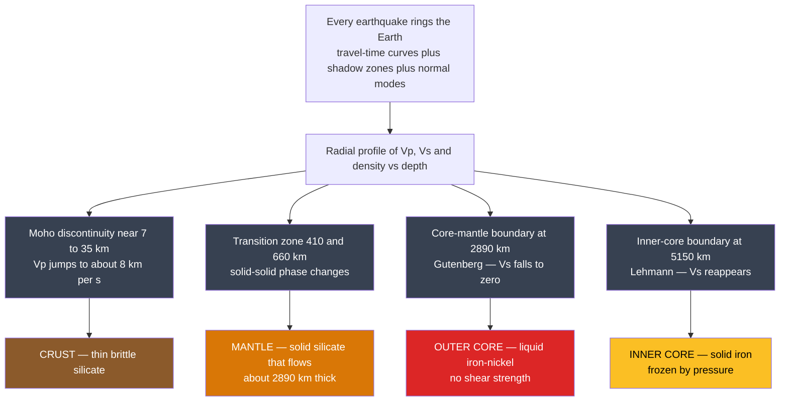

# 🌍 The Deep Structure of the Earth

> [!abstract] TL;DR
> No one has ever sampled below ~12 km, yet we know the Earth is a layered onion — **crust, mantle, liquid outer core, solid inner core** — to within a few kilometres. The knowledge is *seismological*: every earthquake sends **P- and S-waves** racing through the planet, and their arrival times, refractions, and conspicuous *absences* betray each hidden boundary. The **S-wave shadow zone** and the total block of S-waves beyond ~103° prove a **liquid** outer core; the faint P-waves refracted back into the shadow (PKIKP) reveal the **solid inner core**; and the whole radial profile of velocity and density is codified in reference models like **PREM** (Dziewonski & Anderson, 1981). This note is the *geophysical determination* of that structure — the detective work — as opposed to the geology-level description in [[Earth_Internal_Structure]].

---

## Intuition

**Analogy:** Tap a watermelon and you can tell whether it is ripe from the sound alone — the vibrations reveal what is inside without ever cutting it open. The Earth rings the very same way after every large earthquake. By timing how seismic waves race through it, geophysicists mapped a hidden onion of layers: a thin brittle crust, a vast solid-but-flowing mantle, a churning liquid-iron outer core, and a solid inner core hotter than the surface of the Sun.

The stunning part is the *detective work*. Nobody drilled to the core; instead each clue arrived indirectly — a **missing wave** here, a **sudden speed jump** there. A shadow where P-waves should have landed betrayed a slow liquid core bending rays away. The complete disappearance of shear waves on the far side betrayed that this core cannot hold a twist — it is molten. A whisper of P-waves reappearing in the middle of the shadow betrayed a frozen ball at the very centre. Piece the clues together and a planet's anatomy emerges from nothing but vibration and arithmetic.

---

## How It Works

### Core Mechanics

1. **The planet is a resonator.** An earthquake radiates fast compressional **P-waves** (travel through solids *and* liquids) and slower shear **S-waves** (need rigidity, so **solids only**). Their speeds are set by the medium: $V_p=\sqrt{(K+\tfrac{4}{3}\mu)/\rho}$ and $V_s=\sqrt{\mu/\rho}$.
2. **Boundaries reveal themselves as kinks.** Where a wave crosses a jump in velocity it **refracts and reflects**. Plotting arrival time versus epicentral distance yields **travel-time curves** whose slope is the *slowness* $1/v$; every sharp change of slope pins a **discontinuity** at depth.
3. **Absence is evidence.** Beyond ~103° from an epicentre, direct S-waves vanish entirely (the **S-wave shadow**) — a region that cannot carry shear, i.e. a **liquid outer core**. P-waves refract sharply *downward* at the slow core and skip a band from ~103° to ~143° (the **P-wave shadow zone**).
4. **A ball in the shadow.** In 1936 Inge Lehmann noticed faint P arrivals *inside* the shadow (the phase **PKIKP**), only explicable if a **solid inner core** reflects/refracts them back — the **Lehmann discontinuity**.
5. **Density needs extra constraints.** Seismic velocities alone cannot fix density; that comes from the Earth's **mass** ($\bar\rho\approx5.51$ g/cm³), its **moment of inertia** ($I/MR^2\approx0.331$, showing mass concentrated inward), and the frequencies of the planet's **normal modes** (free oscillations). Together they yield reference models such as **PREM**, **IASP91**, and **AK135**.

### Flow / Architecture



---

## Key Concepts

### Secondary Level

**The layers by composition** — what the Earth is *made of*, top to bottom:

| Layer | Depth range | Material | Boundary at base |
|-------|-------------|----------|------------------|
| **Crust** | 0 to ~7 km (ocean) / ~35 km (continent) | silicate rock (basalt / granite) | **Moho** |
| **Mantle** | Moho to ~2890 km | silicate rock (peridotite), solid but flowing | **CMB / Gutenberg** |
| **Outer core** | ~2890 to ~5150 km | **liquid** iron-nickel | **ICB / Lehmann** |
| **Inner core** | ~5150 to 6371 km | **solid** iron | (centre) |

**Why we believe it.** Two wave types, one decisive difference: P-waves push-pull and pass through anything; S-waves shake sideways and need rigidity. S-waves **disappear** on the far side of the planet — the only explanation is a molten layer they cannot cross. That single observation splits a solid rocky planet from its liquid metal heart.

### Undergraduate Level

**Travel-time curves and refraction.** Because velocity generally rises with depth, rays **turn** and return to the surface; the deepest-turning ray that still avoids the core defines the ~103° limit of direct arrivals. At the core the velocity *drops*, so P-rays refract inward and are pushed to ≥143°, carving the **P-wave shadow zone (103°–143°)**.

**The liquidity proof, quantitatively.** In a fluid the shear modulus $\mu=0$, so
$$V_s=\sqrt{\mu/\rho}=0,\qquad V_p=\sqrt{(K+\tfrac{4}{3}\mu)/\rho}=\sqrt{K/\rho}\neq0.$$
Hence S-waves are extinguished in the outer core while P-waves merely *slow*. This is why the S-wave shadow is total beyond ~103°, but the P-wave shadow is only a *band*. (The wave physics of $V_p,V_s$ is developed in *Elasticity and Seismic Wave Theory*.)

**PKIKP and the solid inner core.** Ray phases are named by the legs they traverse: **P** (mantle P), **K** (outer-core P), **I** (inner-core P). The phase **PKIKP** dips through the inner core; its clean, on-time arrivals inside the P-shadow — and the fact that shear waves (**PKJKP**, with a *J* leg) are so hard to observe — show the inner core is **solid** but only weakly rigid. This was Lehmann's 1936 inference.

**Reference Earth models.** A one-dimensional, spherically averaged Earth is summarised by:
- **PREM** (Dziewonski & Anderson, 1981) — includes density, attenuation, and anisotropy in the uppermost mantle; the field standard.
- **IASP91** and **AK135** — travel-time models optimised for **earthquake location** and phase identification.

**Two layerings, not one.** The **compositional** scheme (crust / mantle / core) is *not* the **mechanical** scheme (lithosphere / asthenosphere / mesosphere / outer core / inner core). The rigid **lithosphere** is crust *plus* the cold uppermost mantle; beneath it the weak **asthenosphere** — often marked by a seismic **low-velocity zone (LVZ)** — lets plates slide. The base of the lithosphere is therefore **not** the Moho.

### Graduate Level

**Density from velocity — Adams–Williamson.** In a chemically homogeneous, adiabatic, self-compressed layer,
$$\frac{d\rho}{dr}=-\frac{\rho\,g(r)}{\Phi},\qquad \Phi=\frac{K_S}{\rho}=V_p^2-\tfrac{4}{3}V_s^2,$$
which converts measured $V_p,V_s$ into a density profile — the backbone of PREM. Where the data *violate* Adams–Williamson (the 660 km jump is too large for self-compression alone), the cause is a **phase or composition change**, not mere compression.

**Integral constraints and normal modes.** Velocity profiles are non-unique until anchored by the total **mass** and **moment of inertia** ($I/MR^2=0.3307$), plus the discrete eigenfrequencies of the Earth's **free oscillations** — spheroidal and toroidal modes that sample deep density and provide the strongest constraints on the core. (These standing waves are the subject of *Free Oscillations and Normal Modes*.)

**Transition-zone mineralogy.** The 410 and 660 km discontinuities are **solid–solid phase transitions** in $(\mathrm{Mg,Fe})_2\mathrm{SiO_4}$ / $\mathrm{MgSiO_3}$, not compositional breaks:

| Depth | Pressure | Transition | Clapeyron slope |
|-------|----------|-----------|-----------------|
| 410 km | ~13.5 GPa | olivine → **wadsleyite** | positive (+3 MPa/K) |
| ~520 km | ~18 GPa | wadsleyite → **ringwoodite** | positive |
| 660 km | ~23 GPa | ringwoodite → **bridgmanite + ferropericlase** | **negative** (−2 MPa/K) |
| ~2700 km (D″) | ~125 GPa | bridgmanite → **post-perovskite** | positive |

The **negative** slope at 660 km resists vertical flow and may partially layer convection; the **post-perovskite** transition helps explain the seismic character of the **D″ layer** just above the CMB. (See [[Mineral_Stability_and_Phase_Diagrams]].)

**Beyond 1-D.** The real Earth departs from any radial model: **seismic tomography** images cold slabs and hot plumes and two continent-sized **LLSVPs** on the CMB, while **anisotropy** (directional velocity, notably in the inner core, fast along the spin axis) records flow and crystal alignment. These lateral structures are developed in *Seismic Tomography and Earth Imaging*; the deep thermal state that sets the phase boundaries and keeps the outer core molten is treated in *Terrestrial Heat Flow and Thermal Evolution*. For the big picture of how these sub-disciplines fit together, see *Geophysics Overview*.

---

## Python Demo

```python
# The PREM Earth and the core shadow zone.
# (a) Plot the PREM-like radial profile of Vp, Vs and density, marking the
#     Moho, the 410/660 km transition-zone jumps, the core-mantle boundary
#     (Vs -> 0, proving a LIQUID outer core) and the inner-core boundary
#     (Vs reappears, a SOLID inner core).
# (b) Schematic ray geometry of the P-wave shadow zone (103 to 143 deg):
#     direct P rays turn in the mantle, PKP rays refract through the liquid
#     core, and a band on the far side receives no direct P; S-waves are
#     blocked beyond 103 deg entirely.
import numpy as np
import matplotlib.pyplot as plt
from matplotlib.patches import Circle, Wedge

# ---------------------------------------------------------------
# (a) PREM-like radial profile (after Dziewonski & Anderson 1981),
#     sampled at layer boundaries; duplicated depths encode the jumps.
# ---------------------------------------------------------------
depth = np.array([0, 24, 24, 220, 410, 410, 660, 660,
                  1000, 2000, 2891, 2891, 4000, 5150, 5150, 6371.0])
vp = np.array([5.80, 6.80, 8.11, 8.00, 8.91, 9.36, 10.20, 10.79,
               11.46, 12.79, 13.72,  8.06, 9.31, 10.36, 11.03, 11.26])
vs = np.array([3.20, 3.90, 4.49, 4.42, 4.77, 5.08, 5.60, 5.95,
               6.38, 6.93, 7.26,   0.00, 0.00, 0.00,  3.50, 3.67])
rho = np.array([2.60, 2.90, 3.38, 3.36, 3.54, 3.72, 3.99, 4.38,
                4.58, 5.12, 5.57,  9.90, 11.65, 12.17, 12.76, 13.09])

discs = [(24, "Moho"), (410, "410 km"), (660, "660 km"),
         (2891, "CMB (Gutenberg)"), (5150, "ICB (Lehmann)")]

fig, (axL, axR) = plt.subplots(1, 2, figsize=(13, 7))

axL.plot(vp,  depth, color="navy",    lw=2, label="Vp  (P-wave)")
axL.plot(vs,  depth, color="crimson", lw=2, label="Vs  (S-wave)")
axL.plot(rho, depth, color="green",   lw=2, ls="--", label="Density (g/cm^3)")
axL.invert_yaxis()
axL.set_xlabel("Velocity (km/s)  /  Density (g/cm^3)")
axL.set_ylabel("Depth (km)")
axL.set_title("PREM-like radial structure of the Earth")
axL.set_xlim(0, 14)
for d, name in discs:
    axL.axhline(d, color="gray", ls=":", lw=1)
    axL.text(0.2, d - 45, name, fontsize=8, color="dimgray")
# Highlight Vs = 0 through the liquid outer core
axL.axhspan(2891, 5150, color="red", alpha=0.06)
axL.text(1.4, (2891 + 5150) / 2, "Vs = 0\n(liquid\nouter core)",
         fontsize=9, color="crimson", va="center")
axL.legend(loc="lower right", fontsize=9)

# ---------------------------------------------------------------
# (b) Schematic shadow-zone ray geometry
# ---------------------------------------------------------------
R, Rc, Ric = 6371.0, 3480.0, 1220.0    # Earth, outer-core, inner-core radii (km)

axR.set_aspect("equal"); axR.axis("off")
axR.set_title("P-wave shadow zone (schematic)")
axR.add_patch(Circle((0, 0), R,   facecolor="#f2d9b0", ec="k", lw=1.2, zorder=0))
axR.add_patch(Circle((0, 0), Rc,  facecolor="#e8845a", ec="k", lw=1.0, zorder=1))
axR.add_patch(Circle((0, 0), Ric, facecolor="#ffd23f", ec="k", lw=1.0, zorder=2))

def pt(delta_deg, radius=R):
    """Point at angular distance delta from the source (placed at the top)."""
    a = np.deg2rad(90.0 - delta_deg)
    return radius * np.array([np.cos(a), np.sin(a)])

def bezier(p0, p1, p2, n=120):
    t = np.linspace(0, 1, n)[:, None]
    return (1 - t) ** 2 * p0 + 2 * (1 - t) * t * p1 + t ** 2 * p2

S = pt(0.0)                              # earthquake source at the top

# Direct P: mantle rays that turn and return, 0 to 103 deg
for delta in [20, 40, 60, 80, 103]:
    ctrl = pt(delta / 2.0, radius=max(Rc + 250, R - 22 * delta))
    c = bezier(S, ctrl, pt(delta))
    axR.plot(c[:, 0], c[:, 1], color="navy", lw=1.3, zorder=5)

# PKP: rays refracting through the liquid core, emerging beyond 143 deg
for delta in [150, 165, 180]:
    ctrl = pt(delta / 2.0, radius=0.45 * Rc)   # control point inside the core
    c = bezier(S, ctrl, pt(delta))
    axR.plot(c[:, 0], c[:, 1], color="darkgreen", lw=1.3, zorder=5)

# Shadow-zone wedges (103 to 143 deg, both sides -> full annular band)
for sgn in (+1, -1):
    a1, a2 = 90.0 - sgn * 103.0, 90.0 - sgn * 143.0
    axR.add_patch(Wedge((0, 0), R, min(a1, a2), max(a1, a2),
                        facecolor="gray", alpha=0.30, zorder=3))

axR.plot(*S, marker="*", color="red", ms=18, zorder=6)
axR.text(S[0], S[1] + 350, "Earthquake", ha="center", color="red", fontsize=9)
lbl = pt(123.0, radius=R + 550)
axR.text(lbl[0], lbl[1], "P-wave\nshadow zone\n103 to 143 deg",
         ha="center", va="center", fontsize=9, color="dimgray")
axR.text(0, -R - 750,
         "S-waves blocked beyond 103 deg (cannot cross the liquid core)",
         ha="center", fontsize=9, color="crimson")
axR.set_xlim(-R - 1600, R + 1600)
axR.set_ylim(-R - 1600, R + 1600)

plt.tight_layout()
plt.show()

# Text confirmation of the smoking gun
i_cmb = 11   # first sample just below the core-mantle boundary
print(f"Just below the CMB: Vp = {vp[i_cmb]:.2f} km/s, Vs = {vs[i_cmb]:.2f} km/s")
print("Vs = 0  ->  no shear strength  ->  the outer core is LIQUID.")
```

Running this reproduces the PREM signature: velocity and density climb through the mantle, **Vs collapses to zero** at the CMB while Vp drops from ~13.7 to ~8.1 km/s (the liquid outer core), and **Vs reappears** at the ICB (the solid inner core). The right panel shows why: rays bend away from the slow core, leaving the 103°–143° P-wave shadow band, while S-waves are stopped outright beyond 103°.

---

## Real-World Applications

> **Example — earthquake location (IASP91 / AK135):** Every seismic network on Earth locates events by matching observed P and S arrival times against a 1-D reference travel-time model. The same radial structure that this note derives is the *lookup table* that turns a set of arrival times at scattered stations into a latitude, longitude, depth, and origin time — and, crucially, into the phase picks that global earthquake catalogues and nuclear-test monitoring (the CTBTO) depend on.

- **Nuclear-test monitoring** distinguishes explosions from earthquakes using body-wave versus surface-wave amplitude ratios, all referenced to a known deep structure.
- **Resource and geothermal exploration** uses the crust-and-Moho part of the same physics — refraction and reflection surveys map sedimentary basins and the crust-mantle boundary.
- **Planetary seismology**: NASA's **InSight** lander (2018–2022) recorded marsquakes and, for the first time, sized the **core of Mars** (liquid, radius ~1830 km) using exactly this shadow-zone-and-travel-time logic on another planet.
- **The geodynamo**: knowing the outer core is *liquid* iron is the precondition for understanding that its convection generates Earth's magnetic field — a direct line from seismology to habitability.

---

## Common Pitfalls

- **Confusing composition boundaries with phase boundaries.** The Moho and the CMB are **compositional** changes (rock→rock chemistry, silicate→metal). The 410 and 660 km discontinuities are **phase transitions** in the *same* material — the atoms repack into denser crystal structures; the chemistry does not change.
- **Thinking S-waves are merely "slowed" by the core.** They are **extinguished**. A liquid has $\mu=0$, so $V_s=0$ exactly — there is no slow S-wave in the outer core, there is *none*. This is the Gutenberg proof of liquidity; do not describe it as a speed reduction.
- **Treating the transition zone as a composition change.** The 410/660 jumps do **not** mark a new chemical layer; they are olivine→wadsleyite→ringwoodite→bridgmanite+ferropericlase phase changes. Calling them "a different rock" misses the whole point.
- **Blurring chemical and mechanical layering.** *Crust/mantle/core* (composition) is a different partition from *lithosphere/asthenosphere/mesosphere* (mechanical strength). The **lithosphere includes the uppermost mantle**, so its base is deeper than the Moho — never equate the two schemes.
- **Reading the P-shadow as blockage.** The P-wave shadow (103°–143°) is caused by **refraction** at the slow core bending rays away, *not* by the core absorbing them — P-waves happily traverse the liquid core (that is what PKP is).
- **Depth versus radius.** The CMB is at **2890 km depth** but **3480 km radius**. Mixing the two corrupts every core calculation.

---

## Related Concepts

- [[Earth_Internal_Structure]] — the geology-level *description* of the same layers; **this** note is the seismological *determination* behind it. Read them as a pair.
- [[Seismology_and_Earthquakes]] — the source of the P/S travel-time and shadow-zone data that *is* the evidence; the elastic-rebound source and wave types.
- [[Earth_Formation_and_Differentiation]] — how gravitational settling of iron produced the layered, differentiated planet whose structure we then read off with seismology.
- [[Wave_Motion_and_Properties]] — the $v=\sqrt{\text{modulus}/\rho}$ physics that makes $V_s=0$ in a liquid, the linchpin of the whole argument.
- [[Mineral_Stability_and_Phase_Diagrams]] — the Clapeyron slopes and phase equilibria behind the 410/660 km transition-zone discontinuities.
- [[Phase_Equilibria_and_Colligative_Properties]] — thermodynamics of the solid–solid phase transitions in the mantle.
- [[Solid_State_and_Crystal_Structures]] — the crystal repacking (olivine → spinel-structured phases → perovskite/post-perovskite) that produces each seismic jump.
- [[Phase_Transitions_and_Critical_Phenomena]] — the general physics of first-order transitions underlying the transition-zone and D″ boundaries.
- [[Oscillations_and_SHM]] — normal modes / free oscillations, the standing waves that constrain deep density in reference models.
- [[Earths_Internal_Heat_and_Geothermal_Gradient]] — the geotherm that keeps the outer core molten yet freezes the hotter inner core.
- [[Geomagnetism_and_Paleomagnetism]] — the geodynamo powered by convection in the seismically-revealed liquid outer core.
- [[Gravity_Isostasy_and_the_Geoid]] — mass and moment-of-inertia constraints that pin down the density profile.

---

## Review Questions

1. **Secondary:** Name the four compositional layers of the Earth from surface to centre and the discontinuity that separates each pair. Which single wave observation proves that the outer core is liquid, and why?
2. **Undergraduate:** Using $V_p=\sqrt{(K+\tfrac{4}{3}\mu)/\rho}$ and $V_s=\sqrt{\mu/\rho}$, explain precisely why S-waves vanish beyond ~103° while P-waves only *slow* at the core. Then describe how the phase PKIKP demonstrates that the inner core is solid, given that the shadow zone would otherwise be empty of P arrivals.
3. **Graduate:** The 410 km discontinuity has a *positive* Clapeyron slope and the 660 km a *negative* one, yet **both** are phase transitions in the same mantle material. Explain how the sign of the slope changes whether a boundary promotes or impedes vertical flow, why neither marks a compositional break, and how Adams–Williamson lets you tell a phase change apart from simple self-compression in the density profile.

---

## Sources

- Dziewonski, A. M. & Anderson, D. L. (1981) — "Preliminary reference Earth model (PREM)," *Phys. Earth Planet. Inter.* 25, 297–356.
- Stein, S. & Wysession, M. (2003) — *An Introduction to Seismology, Earthquakes, and Earth Structure* (Blackwell).
- Fowler, C. M. R. (2005) — *The Solid Earth: An Introduction to Global Geophysics*, 2nd ed. (Cambridge University Press).
- Bullen, K. E. & Bolt, B. A. (1985) — *An Introduction to the Theory of Seismology*, 4th ed. (Cambridge University Press).
- Lehmann, I. (1936) — "P′," *Publ. Bur. Cent. Séism. Int. A* 14, 87–115.

---

#geophysics #earth-structure #prem #core-mantle-boundary #seismology
