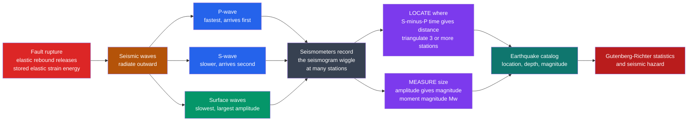

# 🌐 Earthquake Seismology Fundamentals

> [!abstract] TL;DR
> **Earthquake seismology** is the quantitative study of earthquakes and the waves they radiate. An earthquake is a sudden slip on a **fault** that releases elastic strain energy stored over decades (**elastic rebound**), sending out **P-waves** (fast), **S-waves** (slower), and **surface waves** (slowest, largest). From the squiggle a distant **seismometer** records we reverse-engineer three numbers: **where** (using the **S-minus-P time** to get distance, then triangulating three or more stations), **how big** (the **moment magnitude** $M_w=\tfrac{2}{3}\log_{10}M_0-6.07$ from the seismic moment $M_0=\mu A D$ — each unit is $\sim32\times$ the energy), and eventually **what the fault did**. Earthquake counts obey the **Gutenberg-Richter law** $\log_{10}N=a-bM$ with $b\approx1$ — a power law that ties seismicity to hazard.

## Intuition — analogy FIRST

Take a wooden stick and bend it slowly. It stores elastic energy, deforming smoothly and silently — then, at some threshold, it *snaps*. All the stored energy escapes in an instant as a sharp crack and a sting in your fingers. **An earthquake is the Earth doing exactly this on the scale of a mountain range.** Tectonic plates load a locked fault for decades or centuries; friction holds it while elastic strain quietly builds; when stress finally exceeds the fault's strength, the rock ruptures and springs back, and the stored energy screams outward as seismic waves.

But here is the twist that makes seismology a *science* rather than a story: **you are almost never standing at the break.** You feel it seconds later, when the waves reach your feet, and a seismometer thousands of kilometres away records nothing but a wiggle drawn on a chart. The genius of earthquake seismology is that everything worth knowing — **WHERE** the quake happened, **HOW BIG** it was, and **WHAT** the rock actually did — can be reconstructed *purely from those travelling wiggles*, using one deceptively simple fact: **faster waves arrive before slower ones.** The lag between the fast P-wave and the slower S-wave is a built-in tape measure to the source. Read that lag at three stations and the planet tells you where it hurt.

---

## How It Works

An earthquake is a **source**, a set of **waves** that carry information about it, and a network of **receivers** that record them. Seismology is the craft of running that chain backwards. The rupture radiates body waves in every direction; because P travels faster than S, and both faster than surface waves, every seismogram is time-ordered: **P first, then S, then the big surface waves.** The **S-minus-P interval** grows with distance, so it *is* a distance gauge. The **amplitude** of the recorded motion, corrected for distance, *is* a size gauge. Combine distance from several stations to get the epicenter; combine amplitude and rupture physics to get magnitude.



> [!note] Relationship to the Earth Science companion note
> [[Seismology_and_Earthquakes]] gives the *descriptive* geoscience picture — wave types, the shadow zones, and how seismology reveals Earth's layered interior. **This note is the quantitative-seismology treatment**: the equations and workflow of *locating* an earthquake and *measuring its size*, and the statistics of earthquake populations. It opens the Geophysics seismology section, which continues with the elastic wave theory behind $V_p$ and $V_s$ (Elasticity and Seismic Wave Theory), the geometry of travel times (Seismic Ray Theory and Travel Times), the physics of the rupture itself (Earthquake Source and Focal Mechanisms), and probabilistic hazard (Seismic Hazard and Ground Motion).

---

## Key Concepts

### Secondary Level

**Elastic rebound — why earthquakes happen.** H.F. Reid formulated this after surveying the 1906 San Francisco earthquake. Plate motion slowly drags the two sides of a fault, but friction locks the fault surface, so elastic strain builds in the surrounding rock like a bent spring. When stress exceeds the fault's strength, the fault **slips** suddenly, the rock rebounds toward its unstrained shape, and the released energy radiates as seismic waves. Because loading resumes afterward, faults produce **repeating** earthquakes — the **seismic cycle**. The stop-start behaviour of a locked-then-slipping fault is called **stick-slip**.

**Focus vs epicenter.** The **focus** (or **hypocenter**) is the point *at depth* where rupture begins; the **epicenter** is the point on the surface directly above it. **Depth matters** — a shallow event shakes the surface far harder than a deep one of the same size.

**The seismogram — a time-ordered wiggle.** A **seismometer** measures ground motion; the record it draws is a **seismogram**. Every earthquake writes the same sequence because faster waves arrive first: a small sharp **P** arrival, then a larger **S** arrival, then the slow, long, large-amplitude **surface waves** that do most of the damage. The gap between P and S is the key to locating the quake.

**Magnitude vs intensity — two different things.**
- **Magnitude** is one instrumental number for the whole earthquake, from the size of the recorded waves.
- **Intensity** (the **Modified Mercalli** scale, I to XII) describes *felt shaking and damage at a particular place*, so a single earthquake has *one* magnitude but *many* intensities that fade with distance.

### Undergraduate Level

**Locating an earthquake from the S-minus-P time.** P and S leave the focus together but travel at different constant speeds, so the arrival gap is proportional to distance $d$:

$$\Delta t_{S-P}=\frac{d}{V_s}-\frac{d}{V_p}\;\Longrightarrow\; d=\Delta t_{S-P}\cdot\frac{V_p\,V_s}{V_p-V_s}.$$

A useful rule of thumb near the surface (with $V_p\approx6$, $V_s\approx3.5$ km/s) is $d\approx8\ \text{km}\times\Delta t_{S-P}$ (seconds). **One station gives only a radius** — a circle of possible epicenters. Draw the distance circle for **three** stations and they intersect at one point: **triangulation**. In practice this is done as a **travel-time inversion** — a least-squares fit that solves for latitude, longitude, depth, and origin time simultaneously (see the demo).

**The magnitude scales — all logarithmic.**
- **Richter local magnitude** $M_L=\log_{10}A-\log_{10}A_0(d)$: the log of the largest seismogram amplitude $A$ (on a standard Wood-Anderson instrument), corrected for distance $d$. Calibrated for Southern California.
- **Body-wave magnitude** $m_b$ and **surface-wave magnitude** $M_s$ extend the idea to teleseismic P and to $\sim20$ s surface waves respectively.
- Because they are logarithmic, **each whole unit is $10\times$ the ground-motion amplitude** and, as we will see, **$\sim32\times$ the energy**.

**Moment magnitude — the modern, non-saturating scale.** $M_L$, $m_b$, and $M_s$ all **saturate**: above roughly magnitude 7-8 they stop growing even for far larger earthquakes, because their fixed-period amplitude cannot capture a huge, long-duration rupture. The fix is to measure the physical **seismic moment**:

$$M_0=\mu\,A\,D,$$

where $\mu$ is fault-zone rigidity ($\sim3\times10^{10}$ Pa), $A$ the rupture area, and $D$ the average slip. Then (Hanks and Kanamori, SI units, $M_0$ in N·m):

$$\boxed{\,M_w=\tfrac{2}{3}\log_{10}M_0-6.07\,}$$

Radiated energy scales as $\log_{10}E\approx1.5\,M+4.8$ (joules), so a one-unit increase in magnitude means $10^{1.5}\approx31.6\times$ more energy — the famous "each step is about $32\times$ the energy" rule. This is why an $M\,7$ releases about $1000\times$ the energy of an $M\,5$.

### Graduate Level

**Travel-time inversion as a linearized least-squares problem.** Given arrival times $t_i^{obs}$ at stations, the hypocenter $\mathbf{m}=(x,y,z,t_0)$ is found by minimizing residuals $r_i=t_i^{obs}-t_i^{pred}(\mathbf{m})$. Linearizing about a trial hypocenter gives $\mathbf{r}\approx\mathbf{G}\,\delta\mathbf{m}$, where $\mathbf{G}$ holds the partial derivatives of travel time with respect to location (the **Geiger method**, 1910). Iterating $\delta\mathbf{m}=(\mathbf{G}^T\mathbf{G})^{-1}\mathbf{G}^T\mathbf{r}$ converges to the best-fit source. **Depth is the poorly-resolved coordinate** unless a station sits nearly above the focus, because near-surface stations all see similar downgoing ray takeoff angles — the classic **depth-origin-time trade-off**. Relative-location methods (**double-difference**, `hypoDD`) sharpen relative positions by differencing arrival times of nearby events, exploiting shared path effects.

**Source spectra and the moment.** The far-field displacement spectrum is flat at low frequency, and that plateau $\Omega_0$ fixes $M_0$ directly; above a **corner frequency** $f_c$ (which scales inversely with rupture dimension) it falls off as $\omega^{-2}$ (Brune model). Thus a single well-recorded spectrum yields both the *size* ($M_0$) and a *length scale* of the rupture, and $M_w$ follows without any saturation.

**Gutenberg-Richter and the frequency-magnitude power law.** The number $N$ of earthquakes with magnitude $\ge M$ in a region and time window obeys

$$\log_{10}N=a-bM,$$

with the **b-value** $b\approx1$ nearly universal. Because magnitude is a log of amplitude/energy, this is a **power law** in seismic moment: small events are vastly more common than large ones, but the rare large ones dominate the released energy. The $a$-value sets the overall rate (seismic productivity); departures of $b$ from 1 track stress state and are watched in **volcano** and **swarm** monitoring. This frequency-magnitude power law, together with **self-organized criticality** in stick-slip fault systems, connects earthquakes to the broader physics of scale-free, avalanche-like phenomena (see [[Self_Organized_Criticality_in_Economics]] and [[Power_Laws_and_Heavy_Tails_in_Economics]]).

**Aftershocks and Omori's law.** After a mainshock, aftershock rate decays as $n(t)=K/(c+t)^p$ (**modified Omori law**, $p\approx1$). **Foreshocks** sometimes precede a mainshock but are only identifiable as such in hindsight, which is central to why deterministic short-term prediction remains elusive. The **ETAS** (Epidemic-Type Aftershock Sequence) model combines Gutenberg-Richter productivity with Omori decay to describe cascading, triggered seismicity — the modern statistical backbone of operational earthquake forecasting.

**Global seismicity is not random.** Plotted on a map, earthquakes trace narrow belts along **plate boundaries** — the circum-Pacific "Ring of Fire," mid-ocean ridges, and continental collision zones — with the deepest events (to $\sim700$ km) confined to subducting slabs. Seismicity is thus a direct readout of plate tectonics (see [[Plate_Boundaries_and_Plate_Motions]] and [[Subduction_Zones_and_Mountain_Building]]).

---

## Python Demo

Two-panel demo of the two core tasks of earthquake seismology. **Left:** *locate the earthquake* — turn the **S-minus-P time** at each of three stations into a distance, draw the distance circles, and recover the epicenter by least-squares triangulation. **Right:** *measure its size* — show that magnitude is **logarithmic**, so each unit is $10\times$ the amplitude but $\sim32\times$ the **energy**, and mark a specific event whose moment magnitude $M_w$ is computed from the seismic moment $M_0=\mu A D$.

```python
# Earthquake seismology in one figure: (a) locate it, (b) size it.
import numpy as np
import matplotlib.pyplot as plt

# ---------------- (a) EARTHQUAKE LOCATION ----------------
Vp, Vs = 6.0, 3.5                       # crustal P- and S-wave speeds (km/s)
k = (Vp * Vs) / (Vp - Vs)               # distance = k * (ts - tp)

def distance_from_sp(dt_sp):
    """S-minus-P time (s) -> epicentral distance (km)."""
    return k * dt_sp

# Three seismic stations in a local flat-Earth frame (km)
stations = np.array([[  0.0,   0.0],
                     [140.0,  10.0],
                     [ 40.0, 130.0]])

# Synthesize observations from a known "true" epicenter
true_epi = np.array([55.0, 60.0])
true_d   = np.linalg.norm(stations - true_epi, axis=1)
tp       = true_d / Vp                              # P arrival times (s)
ts       = true_d / Vs                              # S arrival times (s)
dt_sp    = ts - tp                                  # observed S-P gaps (s)

# Invert: each S-P gap -> a distance; triangulate by linear least squares.
d = distance_from_sp(dt_sp)
x0, y0, d0 = stations[0, 0], stations[0, 1], d[0]
A, b = [], []
for (xi, yi), di in zip(stations[1:], d[1:]):       # subtract station-0 circle to linearize
    A.append([2 * (xi - x0), 2 * (yi - y0)])
    b.append((xi**2 - x0**2) + (yi**2 - y0**2) - (di**2 - d0**2))
epi_hat, *_ = np.linalg.lstsq(np.array(A), np.array(b), rcond=None)

print("S-P intervals (s):        ", np.round(dt_sp, 2))
print("Epicentral distances (km):", np.round(d, 1))
print("Recovered epicenter (km): ", np.round(epi_hat, 2))
print("True epicenter (km):      ", true_epi)

# ---------------- (b) MAGNITUDE and ENERGY ----------------
# Logarithmic magnitude: ML ~ log10(amplitude). Energy: log10(E) = 1.5*M + 4.8 (Joules).
M = np.linspace(3, 9, 200)
amplitude = 10.0**M                      # relative ground-motion amplitude (arbitrary units)
energy    = 10.0**(1.5 * M + 4.8)        # radiated seismic energy (J)

# One unit of magnitude:
amp_ratio = amplitude[M.searchsorted(6.0)] / amplitude[M.searchsorted(5.0)]   # ~10x
en_ratio  = energy[M.searchsorted(6.0)]   / energy[M.searchsorted(5.0)]       # ~31.6x
print(f"\nPer +1 magnitude:  amplitude x{amp_ratio:.1f},  energy x{en_ratio:.1f}")

# Moment magnitude of a specific rupture: M0 = mu * A * D
mu   = 3.0e10                            # fault rigidity (Pa)
area = 60e3 * 25e3                       # rupture area 60 km x 25 km (m^2)
slip = 4.0                               # average slip (m)
M0   = mu * area * slip                  # seismic moment (N*m)
Mw   = (2.0 / 3.0) * np.log10(M0) - 6.07 # Hanks-Kanamori (SI)
E_Mw = 10.0**(1.5 * Mw + 4.8)
print(f"M0 = {M0:.2e} N*m  ->  Mw = {Mw:.2f}  (radiated energy ~ {E_Mw:.2e} J)")

# ---------------- Plot ----------------
fig, (ax1, ax2) = plt.subplots(1, 2, figsize=(13, 6))
theta = np.linspace(0, 2 * np.pi, 400)
colors = ["#dc2626", "#2563eb", "#059669"]

for (sx, sy), di, c in zip(stations, d, colors):
    ax1.plot(sx + di * np.cos(theta), sy + di * np.sin(theta), color=c, lw=1.4, alpha=0.8)
    ax1.plot(sx, sy, "^", color=c, ms=13, mec="k", zorder=5)
ax1.plot(*true_epi, "*", color="k",       ms=20, label="true epicenter", zorder=6)
ax1.plot(*epi_hat,  "x", color="#7c3aed", ms=14, mew=3, label="located (S-P triangulation)", zorder=7)
ax1.set_aspect("equal")
ax1.set_xlabel("east (km)"); ax1.set_ylabel("north (km)")
ax1.set_title("Locate: S-minus-P distance circles + triangulation")
ax1.legend(loc="upper right", fontsize=8); ax1.grid(alpha=0.3)

ax2.semilogy(M, energy,    color="#b91c1c", lw=2.5, label="radiated energy (J)")
ax2.semilogy(M, amplitude, color="#2563eb", lw=2.0, ls="--", label="wave amplitude (rel.)")
ax2.axvline(Mw, color="#7c3aed", lw=1.2)
ax2.plot(Mw, E_Mw, "o", color="#7c3aed", ms=10,
         label=f"Mw={Mw:.2f} from M0=mu*A*D")
ax2.annotate("each +1 magnitude:\n10x amplitude, ~32x energy",
             xy=(6, 10.0**(1.5 * 6 + 4.8)), xytext=(3.4, 1e18), fontsize=8,
             arrowprops=dict(arrowstyle="->"))
ax2.set_xlabel("magnitude M"); ax2.set_ylabel("energy (J)  /  amplitude (rel.)")
ax2.set_title("Size: the logarithmic magnitude scale")
ax2.legend(loc="upper left", fontsize=8); ax2.grid(alpha=0.3, which="both")

plt.tight_layout()
plt.savefig("earthquake_seismology_fundamentals.png", dpi=120)
print("\nSaved earthquake_seismology_fundamentals.png")
```

The left panel shows the whole point of the S-minus-P trick: three circles, one intersection, one epicenter — recovered to within rounding of the truth. The right panel shows why "magnitude" confuses people: it is a *logarithm*, so the visually modest step from $M\,6$ to $M\,7$ is a $32\times$ jump in the energy the fault actually released.

---

## Real-World Applications

- **Earthquake early warning.** Japan's nationwide EEW, the US **ShakeAlert**, and Mexico's SASMEX exploit the P/S speed gap: detect the harmless fast P-wave, estimate location and magnitude in seconds, and warn before the destructive S and surface waves arrive — enough to stop trains, halt surgeries, and open elevator doors.
- **Sizing great earthquakes correctly.** The 2004 Sumatra ($M_w\,9.1$) and 2011 Tohoku ($M_w\,9.0$) earthquakes could only be sized by **moment magnitude**; older scales saturated near 8 and badly underestimated them in the crucial first minutes, with consequences for tsunami warning.
- **Rapid location for tsunami warning.** Fast travel-time inversion plus **GPS/GNSS** rupture estimates drive tsunami forecasts within minutes of a great subduction earthquake.
- **Nuclear-test monitoring.** The **CTBTO** global network locates seismic events and uses source characteristics (P/S energy ratios, depth, magnitude scaling) to discriminate underground explosions from natural earthquakes.
- **Induced seismicity management.** Wastewater injection and reservoir operations can trigger earthquakes; tracking their **locations, b-values, and Omori decay** (e.g. Oklahoma since 2009) guides "traffic-light" injection protocols.
- **Seismic hazard maps.** Gutenberg-Richter recurrence statistics feed **probabilistic seismic hazard analysis** (PSHA), setting building codes and insurance pricing worldwide.

---

## Common Pitfalls

- **Confusing magnitude with intensity.** Magnitude is one number for the whole event (from wave size); **Modified Mercalli intensity** describes felt shaking at a place and varies with distance, soil, and construction. One earthquake, one magnitude, many intensities.
- **Treating "Richter" as universal.** $M_L$ was calibrated for Southern California and **saturates** above $\sim7$. Report great earthquakes in **moment magnitude** $M_w$, not "on the Richter scale." $m_b$ and $M_s$ saturate too; only $M_w$ (from $M_0$) does not.
- **Forgetting magnitude is logarithmic.** Each unit is $10\times$ amplitude and $\sim32\times$ energy. An $M\,7$ is not "a bit worse" than an $M\,6$ — it releases about $32\times$ the energy, and about $1000\times$ that of an $M\,5$.
- **Ignoring the depth trade-off in location.** Epicenter (map position) is usually well constrained, but **focal depth is not**, unless a station sits nearly above the focus — near-surface stations see similar takeoff angles, so depth and origin time trade off. Deep events also shake the surface far less than shallow ones of equal magnitude.
- **Over-reading foreshocks and aftershocks.** **Foreshocks** are only identifiable *after* the mainshock, so they do not give reliable prediction; **aftershocks** decay predictably (**Omori's law**, $\sim1/t$) and follow the same Gutenberg-Richter statistics, occasionally including an aftershock larger than the "mainshock" (which then gets relabeled).
- **Misusing the S-minus-P rule far away.** The linear "$8\ \text{km}\times\Delta t_{S-P}$" rule assumes constant crustal velocities; at teleseismic distances the ray bends through a layered Earth and you must use proper **travel-time curves**, not a straight-line speed.

---

## Related Concepts

- [[Geophysics_Overview]] — the field-level parent: this note opens its seismology section, the primary probe of the deep interior.
- [[Seismology_and_Earthquakes]] — the Earth Science companion; descriptive wave types, shadow zones, and how seismology images the layered Earth (this note is the quantitative location-and-magnitude treatment).
- [[Earth_Internal_Structure]] — the crust/mantle/core model whose velocities ($V_p$, $V_s$) set the travel times used to locate earthquakes.
- [[Wave_Motion_and_Properties]] — the wave physics ($v=\sqrt{\text{modulus}/\rho}$) behind why P is fast, S is slower, and both are ordered on the seismogram.
- [[Oscillations_and_SHM]] — harmonic motion underlying seismometer response and the frequency content of source spectra.
- [[Work_Energy_and_Conservation]] — the stored elastic strain energy that elastic rebound converts into radiated seismic energy.
- [[Plate_Boundaries_and_Plate_Motions]] — global seismicity traces plate boundaries; plate loading drives the seismic cycle.
- [[Subduction_Zones_and_Mountain_Building]] — source of the largest earthquakes and of deep-focus seismicity to ~700 km.
- [[Regression_and_Correlation]] — least-squares fitting is exactly how travel-time inversion recovers the hypocenter and how the b-value is estimated.
- [[Statistical_Inference]] — estimating the Gutenberg-Richter a- and b-values and their uncertainties is a statistical-inference problem.
- [[Power_Laws_and_Heavy_Tails_in_Economics]] — the Gutenberg-Richter law is a power law; the same heavy-tailed, scale-free mathematics appears here.
- [[Self_Organized_Criticality_in_Economics]] — stick-slip fault systems are a canonical example of self-organized criticality, the physics behind Gutenberg-Richter.
- [[Criticality_and_Phase_Transitions]] — the critical, avalanche-like behavior that produces scale-free earthquake statistics.

---

## Review Questions

### Secondary Level

1. A seismogram records the P-wave arriving 30 s before the S-wave. Using the rule $d\approx8\ \text{km}\times\Delta t_{S-P}$, how far is the epicenter? Why does this single station still leave the location ambiguous, and what would you need to pin it down?
2. Explain, in plain language, the difference between an earthquake's **magnitude** and its **intensity**, and why one earthquake can have many intensities but only one magnitude.

### Undergraduate Level

3. With $V_p=6.0$ km/s and $V_s=3.5$ km/s, derive the exact epicentral distance for a $20$ s S-minus-P gap. Then explain why an $M\,7$ earthquake releases roughly $1000\times$ the energy of an $M\,5$, using the relation $\log_{10}E\approx1.5M+4.8$.
4. Richter $M_L$, body-wave $m_b$, and surface-wave $M_s$ all "saturate," but moment magnitude $M_w$ does not. Explain what saturation means physically and why measuring the **seismic moment** $M_0=\mu A D$ avoids it.

### Graduate Level

5. Earthquake location is a linearized least-squares (Geiger) inversion for $(x,y,z,t_0)$. Explain the **depth-origin-time trade-off**: why is focal depth the least-well-resolved parameter for a shallow event recorded only by distant stations, and how do relative-location methods (double-difference) improve precision?
6. The Gutenberg-Richter law $\log_{10}N=a-bM$ has $b\approx1$. Interpret this as a power law in seismic moment, explain what physical information the $a$- and $b$-values carry, and describe how Gutenberg-Richter recurrence plus Omori aftershock decay combine (as in ETAS) to underpin operational earthquake forecasting and seismic-hazard estimates.

---

## Sources

- Stein, S. & Wysession, M. — *An Introduction to Seismology, Earthquakes, and Earth Structure* (Blackwell, 2003).
- Shearer, P. M. — *Introduction to Seismology*, 2nd ed. (Cambridge University Press, 2009).
- Lay, T. & Wallace, T. C. — *Modern Global Seismology* (Academic Press, 1995).
- Gutenberg, B. & Richter, C. F. (1944) — "Frequency of earthquakes in California," *Bulletin of the Seismological Society of America*, 34, 185-188.
- Hanks, T. C. & Kanamori, H. (1979) — "A moment magnitude scale," *Journal of Geophysical Research*, 84, 2348-2350.

---

#geophysics #seismology #earthquakes #magnitude #earthquake-location
