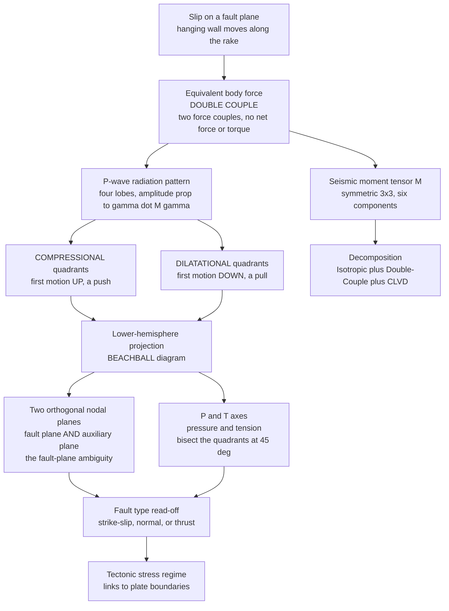

# 💥 Earthquake Source and Focal Mechanisms

> [!abstract] TL;DR
> Slip on a fault radiates seismic waves as if driven by a **double couple** of forces — two opposing force pairs with **no net force and no net torque**. This equivalent-force model has two powerful consequences. First, the *size* of an earthquake is the **seismic moment** $M_0 = \mu A D$ (rigidity × rupture area × average slip), which converts to the saturation-free **moment magnitude** $M_w = \tfrac{2}{3}\log_{10}M_0 - 6.07$. Second, the *geometry* of the break is written into the **P-wave radiation pattern**: a four-lobed field split into **compressional** (first motion up) and **dilatational** (first motion down) quadrants by two orthogonal **nodal planes** — the fault plane and its auxiliary plane. Projecting first-motion polarities onto a lower hemisphere yields the **"beachball" diagram**, and the general point source is captured by the symmetric **moment tensor** (6 components, decomposable into isotropic + double-couple + CLVD). From distant wiggles alone, we reconstruct strike, dip, rake, and the stress regime of a fault we never saw.

---

## Intuition

**Analogy:** An earthquake pushes the ground one way on some sides and the opposite way on others. Stand around a break in the crust and the very first jolt to arrive is a **compression** (a push *away* from the source, ground jerks up) at some stations, and a **dilatation** (a pull *toward* the source, ground drops down) at others. Now do something simple: plot which stations felt a push and which felt a pull. A beautiful pattern emerges — a disk divided into black and white quadrants, a **beachball**, whose two seams reveal exactly how the fault was oriented and which way it slipped. Was the ground pulled apart (normal faulting), squeezed together (thrust), or sheared sideways (strike-slip)? The beachball tells you, from wiggles recorded thousands of kilometres away.

Technically, the four black-and-white quadrants are the lobes of the **P-wave radiation pattern** of a double couple. The seams between them — the two nodal planes where first motion flips from up to down — are the fault plane and a mathematically identical "auxiliary" plane at right angles to it. That last twist is the famous **fault-plane ambiguity**: the wiggles alone cannot tell the two planes apart; only aftershocks or surface geology can.

---

## How It Works

### Core Mechanics

1. **Slip is equivalent to a double couple.** A shear dislocation — one side of a fault sliding past the other — exerts no *net* force on the Earth (nothing is added or removed) and no *net* torque (angular momentum is conserved). The body-force system that radiates identical seismic waves is therefore a **double couple**: two force couples whose individual torques cancel. This is *not* a single directed force, and *not* an explosion.
2. **Seismic moment measures size.** The strength of that double couple is the **scalar seismic moment** $M_0 = \mu A D$, where $\mu$ is the fault-zone rigidity ($\sim 3\times10^{10}$ Pa), $A$ is rupture area, and $D$ is average slip. It converts to **moment magnitude** $M_w = \tfrac{2}{3}\log_{10}M_0 - 6.07$ ($M_0$ in N·m), the only scale that does not saturate for great earthquakes.
3. **The moment tensor generalizes the source.** A general point source is a symmetric $3\times3$ **moment tensor** $\mathbf{M}$ with **6 independent components**. A pure double couple is built from the fault normal $\mathbf{n}$ and slip direction $\mathbf{d}$ as $\mathbf{M} = M_0(\mathbf{n}\mathbf{d}^{\mathsf T} + \mathbf{d}\mathbf{n}^{\mathsf T})$. Its **trace is zero** — no volume change.
4. **The radiation pattern encodes geometry.** Far-field P-wave amplitude in ray direction $\boldsymbol{\gamma}$ is proportional to $\boldsymbol{\gamma}^{\mathsf T}\mathbf{M}\,\boldsymbol{\gamma}$. Its sign is the **first-motion polarity**: positive → compression (up), negative → dilatation (down). The four sign lobes are separated by two **nodal planes** where $\boldsymbol{\gamma}^{\mathsf T}\mathbf{M}\,\boldsymbol{\gamma}=0$: the **fault plane** and the perpendicular **auxiliary plane**.
5. **The beachball is a projection.** Trace every downgoing ray to where it pierces a lower focal hemisphere, then flatten that hemisphere to a disk (equal-angle stereographic or equal-area). Shade the compressional quadrants. Strike-slip, normal, and thrust faults produce three instantly recognizable beachballs.
6. **P and T axes summarize stress.** The eigenvectors of $\mathbf{M}$ are the **T (tension)** axis (largest eigenvalue, sits in the *compressional* quadrant) and the **P (pressure)** axis (smallest eigenvalue, in the *dilatational* quadrant); they bisect the nodal planes at $45°$.
7. **Decomposition separates source types.** Any moment tensor splits into an **isotropic** part $\tfrac{1}{3}\operatorname{tr}(\mathbf{M})\,\mathbf{I}$ (volume change → explosions, phase changes), a **double-couple (DC)** part (shear faulting), and a **compensated linear vector dipole (CLVD)** part (non-DC, e.g. fluid-driven or ring-fault sources).

### Flow / Architecture



---

## Key Concepts

**Secondary (intuition level).** An earthquake shoves the ground outward on some sides and sucks it inward on others. Record the very first up-or-down flick of the ground at many stations, colour "up" black and "down" white, and you get a **beachball**: black and white pie-slices whose dividing lines trace the fault. A beachball that is black in the middle means the crust was **squeezed** (a thrust); white in the middle means it was **pulled apart** (a normal fault); a four-way pinwheel means the crust **slid sideways** (strike-slip). The *size* of the quake is the **seismic moment** — how much rock slipped, over how big an area, times how stiff the rock is — which gives the **moment magnitude** $M_w$ you see in the news.

**Undergraduate (working level).** The source is modelled as a **double couple**, the force system equivalent to shear slip (Aki & Richards). Two fault-orientation parameters plus a slip direction — **strike** $\phi_s$, **dip** $\delta$, **rake** $\lambda$ — fully specify the geometry. The far-field P amplitude is the radiation pattern $\mathcal{F}^P(\phi_s,\delta,\lambda; i,\phi)$; its polarity (compression vs dilatation) at a station depends on the **takeoff angle** $i$ and **azimuth** $\phi$. Plotting polarities on a lower-hemisphere stereonet and finding the two orthogonal great circles that separate + from − gives the **fault plane and auxiliary plane** — mathematically interchangeable, so the true fault plane must be picked using **aftershock alignment** or mapped surface rupture. The size is $M_0 = \mu A D \Rightarrow M_w = \tfrac{2}{3}\log_{10}M_0 - 6.07$. The **P axis** (maximum compressive stress proxy) and **T axis** (tension) sit $45°$ from the nodal planes and encode the tectonic regime: normal faulting → vertical T-favoured extension; thrust → horizontal compression; strike-slip → both horizontal.

**Graduate (rigorous level).** The general point source is the symmetric **moment tensor** $M_{ij}$ (6 independent components); the far-field displacement is $u_i^P \propto \gamma_i\,\gamma_p\,\gamma_q\,M_{pq}/(4\pi\rho\alpha^3 r)$ convolved with the **source time function** $\dot M_0(t)$. Diagonalizing $\mathbf{M}$ gives eigenvalues $(m_1\ge m_2\ge m_3)$ and P/T/null axes. The **isotropic** component is $\tfrac{1}{3}\operatorname{tr}\mathbf M$; the deviatoric remainder decomposes as a **major DC** plus a **CLVD** parametrized by $\epsilon = -m_2^{\text{dev}}/\max(|m_1^{\text{dev}}|,|m_3^{\text{dev}}|)$ (Jost & Herrmann; the "Hudson source-type" plot maps it). Real earthquakes are **finite ruptures**, not points: **directivity** Doppler-shifts and sharpens waveforms in the propagation direction (unilateral vs bilateral rupture), and the point-source moment tensor is the zeroth moment of the slip distribution. Routine **CMT (Centroid Moment Tensor)** inversion fits long-period waveforms for the six $M_{ij}$ plus centroid location and time; the **Global CMT** catalog is the standard reference. Apparent **non-double-couple** components arise from finite source volume, near-source velocity heterogeneity, tensile cracks, or genuine volumetric sources (explosions, volcanic conduits, ring faults).

---

## Python Demo

```python
# Focal-mechanism beachballs from strike/dip/rake, built directly from the
# double-couple moment tensor M = n d^T + d n^T (unit moment).
#   (a) P-wave radiation pattern: sign of gamma^T M gamma = first-motion polarity
#       (compression vs dilatation) -> the four-lobed pattern.
#   (b) Lower-hemisphere stereographic "beachball" for strike-slip, normal, thrust.
#   (c) Station first-motion polarities on the strike-slip ball, illustrating how
#       + / - readings pin the two nodal planes (fault + AMBIGUOUS auxiliary plane).
# Frame: x = North, y = East, z = Down  (Aki & Richards convention).
import numpy as np
import matplotlib.pyplot as plt

def moment_tensor(strike_deg, dip_deg, rake_deg):
    """Unit-moment double-couple tensor from fault normal n and slip vector d."""
    phi, dip, lam = np.radians([strike_deg, dip_deg, rake_deg])
    n = np.array([-np.sin(dip)*np.sin(phi),          # fault normal
                   np.sin(dip)*np.cos(phi),
                  -np.cos(dip)])
    d = np.array([ np.cos(lam)*np.cos(phi) + np.sin(lam)*np.cos(dip)*np.sin(phi),
                   np.cos(lam)*np.sin(phi) - np.sin(lam)*np.cos(dip)*np.cos(phi),
                  -np.sin(lam)*np.sin(dip)])          # hanging-wall slip
    return np.outer(n, d) + np.outer(d, n), n, d

def polarity_field(M, X, Y):
    """gamma^T M gamma on a lower-hemisphere disk (stereographic r = tan(i/2))."""
    R = np.hypot(X, Y)
    i = 2*np.arctan(np.clip(R, 0, 1))     # takeoff angle from downward vertical
    az = np.arctan2(X, Y)                  # azimuth clockwise from North
    gx, gy, gz = np.sin(i)*np.cos(az), np.sin(i)*np.sin(az), np.cos(i)
    pol = (M[0,0]*gx*gx + M[1,1]*gy*gy + M[2,2]*gz*gz
           + 2*M[0,1]*gx*gy + 2*M[0,2]*gx*gz + 2*M[1,2]*gy*gz)
    return np.where(R <= 1.0, pol, np.nan)

def draw_beachball(ax, strike, dip, rake, title, n=500):
    M, _, _ = moment_tensor(strike, dip, rake)
    g = np.linspace(-1, 1, n)
    X, Y = np.meshgrid(g, g)               # X = East (right), Y = North (up)
    pol = polarity_field(M, X, Y)
    shade = np.where(pol > 0, 1.0, np.nan) # compressional quadrants -> shaded
    ax.imshow(shade, extent=[-1, 1, -1, 1], origin="lower",
              cmap="Reds", vmin=0, vmax=1.4)
    t = np.linspace(0, 2*np.pi, 300)
    ax.plot(np.cos(t), np.sin(t), "k", lw=1.6)
    ax.set_xlim(-1.25, 1.25); ax.set_ylim(-1.25, 1.25)
    ax.set_aspect("equal"); ax.axis("off"); ax.set_title(title, fontsize=10)
    ax.text(0, 1.14, "N", ha="center", fontsize=9)
    return M

fig, ax = plt.subplots(2, 2, figsize=(11, 11))

# (a) Four-lobed P radiation pattern in a vertical plane (pure double couple).
th = np.linspace(0, 2*np.pi, 1000)
amp = np.sin(2*th)                          # gamma^T M gamma ~ sin(2*theta)
xx, yy = np.abs(amp)*np.cos(th), np.abs(amp)*np.sin(th)
comp = amp >= 0
ax[0,0].scatter(xx[comp],  yy[comp],  s=4, color="#c0392b", label="compression (+)")
ax[0,0].scatter(xx[~comp], yy[~comp], s=4, color="#2980b9", label="dilatation (-)")
for a in (np.pi/4, 3*np.pi/4):              # the two nodal planes
    ax[0,0].plot([-np.cos(a), np.cos(a)], [-np.sin(a), np.sin(a)],
                 "k--", lw=1, alpha=0.6)
ax[0,0].set_aspect("equal"); ax[0,0].axis("off")
ax[0,0].set_title("(a) P-wave radiation pattern\nfour lobes, nodal planes dashed", fontsize=10)
ax[0,0].legend(loc="lower center", fontsize=7, ncol=2)

# (b) Strike-slip beachball + synthetic station first-motion polarities.
Mss = draw_beachball(ax[0,1], 0, 90, 0, "(b) Strike-slip  (0/90/0)")
stations = [(30,60),(75,50),(150,70),(205,55),(300,65),(340,45)]  # (azimuth, takeoff)
for az_deg, i_deg in stations:
    az, i = np.radians(az_deg), np.radians(i_deg)
    r = np.tan(i/2)                          # stereographic radius
    px, py = r*np.sin(az), r*np.cos(az)      # East, North
    g = np.array([np.sin(i)*np.cos(az), np.sin(i)*np.sin(az), np.cos(i)])
    pol = g @ Mss @ g
    if pol > 0:
        ax[0,1].plot(px, py, "o", mfc="#c0392b", mec="k", ms=9)   # up / compression
    else:
        ax[0,1].plot(px, py, "o", mfc="white",   mec="k", ms=9)   # down / dilatation

# (c) Normal fault  -> WHITE (dilatational) centre.
draw_beachball(ax[1,0], 0, 45, -90, "(c) Normal  (0/45/-90)\nextension: white centre")

# (d) Thrust fault  -> SHADED (compressional) centre.
draw_beachball(ax[1,1], 0, 45,  90, "(d) Thrust  (0/45/90)\ncompression: dark centre")

plt.tight_layout()
plt.savefig("focal_mechanisms.png", dpi=130)
print("Saved focal_mechanisms.png")

# ---- Console: seismic moment, magnitude, P/T axes, and decomposition ----
mu, A, D = 3.0e10, 60e3*25e3, 4.0           # rigidity, area (m^2), slip (m)
M0 = mu*A*D
Mw = (2/3)*np.log10(M0) - 6.07
print(f"\nM0 = mu*A*D = {M0:.2e} N*m   ->   Mw = {Mw:.2f}")

for name, sdr in {"strike-slip": (0,90,0), "normal": (0,45,-90),
                  "thrust": (0,45,90)}.items():
    M, n, d = moment_tensor(*sdr)
    w, V = np.linalg.eigh(M)                 # eigen-decomposition
    T_axis = V[:, np.argmax(w)]              # tension  (max eigenvalue)
    P_axis = V[:, np.argmin(w)]              # pressure (min eigenvalue)
    print(f"\n{name:11s}  eigenvalues = {np.round(w,3)}   trace = {np.trace(M):+.2e}")
    print(f"             n.d = {n@d:+.2e} (0 -> pure shear, no volume change)")
    print(f"             T-axis (tension)  = {np.round(T_axis,2)}")
    print(f"             P-axis (pressure) = {np.round(P_axis,2)}")
```

Running this prints eigenvalues of $(+1,0,-1)$ for every case (the signature of a pure double couple: trace $=0$, so **no isotropic/volume change**, and $\mathbf{n}\cdot\mathbf{d}=0$ confirming pure shear), reports $M_0 = 1.8\times10^{20}$ N·m $\Rightarrow M_w \approx 7.5$, and lists the P/T axes. The figure shows (a) the four-lobed radiation pattern, and (b)–(d) the three canonical beachballs — a pinwheel for strike-slip (with station dots that land in the correct quadrants and pin the two nodal seams), a **white-centred** ball for the extensional normal fault, and a **dark-centred** ball for the compressional thrust.

---

## Real-World Applications

- **Global CMT catalog.** Since 1976, nearly every earthquake above $\sim M_w\,5$ has an inverted centroid moment tensor. Plotting the beachballs on a world map paints the plate boundaries in fault type: thrust balls ring subduction zones, normal balls line mid-ocean ridges and back-arc extension, strike-slip balls mark transform faults like the San Andreas and North Anatolian.
- **Tsunami and hazard response.** Within minutes, the moment tensor tells responders whether a great offshore event was **shallow thrust** (vertical seafloor uplift → tsunamigenic, as in 2011 Tōhoku $M_w\,9.0$) or strike-slip (little vertical motion, weak tsunami), driving warning decisions.
- **Stress-field mapping.** Aggregated P/T axes feed the **World Stress Map**, revealing the orientation of maximum horizontal compression across continents — essential for reservoir engineering, mine stability, and fault-reactivation risk.
- **Induced and volcanic seismicity.** **Non-double-couple** and isotropic components flag unusual sources: tensile cracking during hydraulic fracturing and geothermal stimulation, ring-fault collapse during caldera events (e.g. 2018 Kīlauea), and volcanic "long-period" sources driven by fluid flow.
- **Nuclear-test discrimination.** A true underground explosion is dominantly **isotropic** (positive volume change, compression-first at *all* azimuths — an all-black beachball), which the moment tensor cleanly separates from the double-couple pattern of a natural earthquake — the physical basis of CTBTO monitoring.

---

## Common Pitfalls

- **Single force vs double couple.** Early "single-couple" models were discarded because they predict the wrong S-wave radiation and violate torque balance. Slip radiates as a **double couple** — no net force, no net torque. Confusing the two mislabels which lobes are compressional.
- **Fault-plane vs auxiliary-plane ambiguity.** First motions cannot distinguish the real fault plane from its orthogonal auxiliary plane; they produce *identical* radiation. Resolve it with **aftershock alignment**, mapped surface rupture, or directivity — never from the beachball alone.
- **P/T axes are not the fault planes.** The P and T axes bisect the quadrants at $45°$; they are stress-direction proxies, not slip surfaces. And beware the naming trap: the **T (tension) axis lies in the shaded compressional quadrant** (tension pulls the ground outward, so the first P motion there is a *push*), while the P (pressure) axis sits in the *white* dilatational quadrant.
- **Reading the centre wrong.** A dark centre means the *downgoing vertical ray* is compressional → **thrust**; a white centre → **normal**. Students routinely invert this.
- **Over-interpreting non-double-couple components.** A small CLVD or isotropic part is often an artifact of noise, unmodeled 3-D velocity structure, or finite-source effects — not proof of an exotic source. Decompose carefully (isotropic + DC + CLVD) and check uncertainties before claiming a volumetric source.
- **Point source vs finite fault.** The moment tensor is a *point* approximation. For large ruptures, **directivity** and finite length distort waveforms and bias the apparent mechanism; a proper finite-fault inversion is needed for slip distribution.
- **Mixing moment units.** The constant $-6.07$ in $M_w$ assumes $M_0$ in N·m (SI); the classic form uses $-10.7$ for dyne·cm. Mismatched units shift $M_w$ by a full unit.

---

## Related Concepts

- [[Seismology_and_Earthquakes]] — the parent overview: elastic rebound, wave types, S–P location, and moment magnitude that this note deepens into source physics.
- [[Plate_Boundaries_and_Plate_Motions]] — beachball fault types map one-to-one onto divergent (normal), convergent (thrust), and transform (strike-slip) boundaries.
- [[Subduction_Zones_and_Mountain_Building]] — the source of the largest, tsunamigenic shallow-thrust mechanisms and deep-focus non-shear sources.
- [[Stress_Strain_and_Elastic_Moduli]] — the rigidity $\mu$ in $M_0=\mu A D$ and the elastic constitutive law behind the radiated field.
- [[Eigenvalues_and_Eigenvectors]] — diagonalizing the moment tensor yields the P/T/null axes and the isotropic + DC + CLVD decomposition.
- [[Matrices_and_Determinants]] — the moment tensor is a symmetric $3\times3$ matrix; its trace fixes the volumetric part.
- [[Rotational_Dynamics]] — torque and force couples: why slip requires two couples so the net torque vanishes.
- [[Earth_Internal_Structure]] — the velocity model through which radiated rays travel and refract on their way to distant stations.

*Sibling notes in this Geophysics section (build these next): **Earthquake_Seismology_Fundamentals** frames the observational catalog and magnitude scales; **Elasticity_and_Seismic_Wave_Theory** supplies the elastic wave equation and radiation physics this source model feeds; **Seismic_Hazard_and_Ground_Motion** turns mechanisms and moment into shaking and risk; **Geophysics_of_Plate_Tectonics** connects P/T axes to the driving stress field; and **Rheology_and_Deformation_of_the_Earth** explains why the crust stores and releases the elastic strain in the first place.*

---

## Review Questions

1. **(Secondary)** You are handed three beachballs: one black in the middle, one white in the middle, and one that looks like a four-way pinwheel. Which is a thrust, which is a normal fault, and which is strike-slip — and in one sentence each, what did the ground do?
2. **(Undergraduate)** A fault ruptures $60\times25$ km with $4$ m average slip and $\mu = 3\times10^{10}$ Pa. Compute $M_0$ and $M_w$. Then explain why the first-motion data give *two* possible fault planes and describe two independent observations you could use to break the tie.
3. **(Graduate)** A moment-tensor inversion returns eigenvalues $(+1.0, +0.1, -1.1)$ (normalized) with a non-zero trace of $+0.2$. Decompose this into isotropic, double-couple, and CLVD parts, quantify the percentage of each, and discuss two physical mechanisms and two artifacts that could produce the non-double-couple signal. How would directivity from a finite unilateral rupture separately bias the recovered mechanism?

---

## Sources

- Aki, K. & Richards, P. G. — *Quantitative Seismology* (2nd ed., University Science Books, 2002) — Chs. 3–4, the double-couple source and radiation patterns.
- Shearer, P. M. — *Introduction to Seismology* (3rd ed., Cambridge University Press, 2019) — Ch. 9, earthquake source and focal mechanisms.
- Stein, S. & Wysession, M. — *An Introduction to Seismology, Earthquakes, and Earth Structure* (Blackwell, 2003) — Ch. 4, seismic moment and moment tensor.
- Jost, M. L. & Herrmann, R. B. (1989) — "A Student's Guide to and Review of Moment Tensors," *Seismological Research Letters* 60(2), 37–57.
- [Global CMT Project](https://www.globalcmt.org/) — the standard centroid-moment-tensor catalog and beachball archive.

---

#geophysics #focal-mechanism #moment-tensor #earthquake-source #beachball
