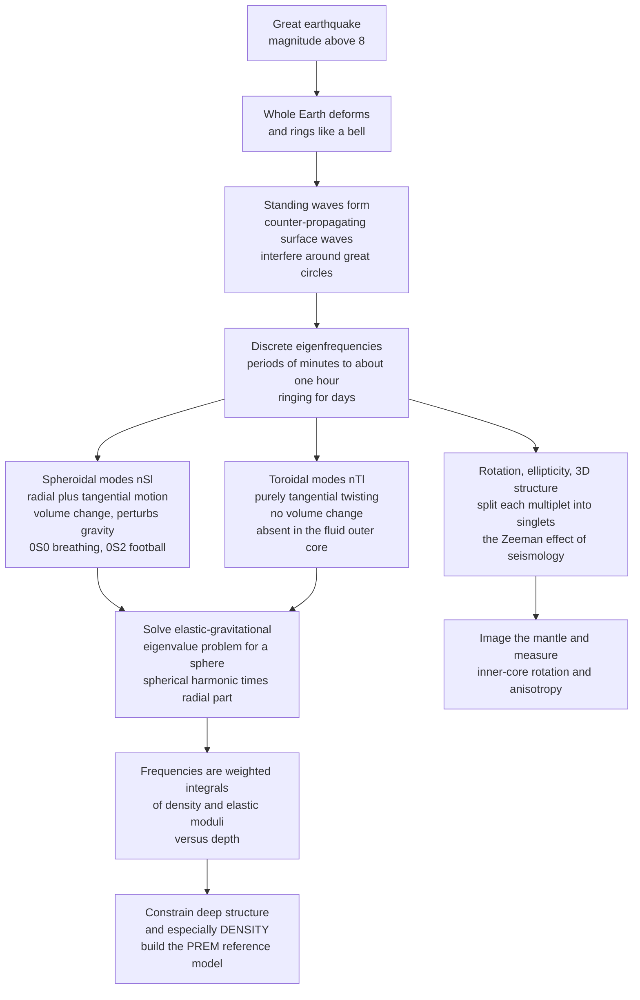

# 🔔 Free Oscillations and Normal Modes

> [!abstract] TL;DR
> A **great** earthquake (magnitude above roughly 8) does not just send waves *across* the Earth — it sets the **entire planet ringing** in standing-wave patterns at a discrete set of **eigenfrequencies**, the lowest-frequency phenomenon in all of seismology (periods of **minutes to nearly an hour**, ringing for **days**). These **free oscillations / normal modes** come in two families: **spheroidal modes** $_nS_l$ (radial *and* tangential motion, involving volume change — e.g. $_0S_0$ the "breathing" mode near 20 min, $_0S_2$ the "football" mode near 54 min) and **toroidal modes** $_nT_l$ (purely tangential twisting, no volume change, absent in the fluid outer core). Each mode is an eigenfunction of the elastic-gravitational equations for a spherical Earth, and — crucially — its frequency depends on **density**, a quantity ordinary body-wave travel times *cannot* resolve. Rotation, ellipticity, and 3-D structure **split** each mode into a multiplet (the "Zeeman effect of seismology"), a signal now used to image the mantle and measure inner-core rotation.

---

## Intuition

**Analogy:** Strike a bell and it rings — not at every pitch, but at a few specific, *pure* tones: its **natural frequencies**, fixed by the bell's size, shape, and the metal it is cast from. Feed it energy and it settles into these same tones every time; they are the bell's fingerprint.

A great earthquake does exactly this to the **whole planet**. The rupture is a single sharp "strike," and afterward the entire Earth vibrates like a colossal bell — expanding and contracting, wobbling from a rugby-ball shape to a pancake and back, twisting hemisphere against hemisphere. But the Earth is so vast that its "notes" are absurdly low: periods of minutes to nearly an hour, far below anything an ear could hear, and they hum on for **days**. Here is why a seismologist cares: **each note feels the deep Earth in its own way.** The breathing mode squeezes the whole planet and is exquisitely sensitive to how mass is distributed with depth; a twisting mode never touches the fluid core at all. Record the planet's ringing and Fourier-transform it, and the sharp peaks in the spectrum become a direct readout of **density and elasticity all the way to the center** — information that the ordinary P- and S-waves of [[Elasticity_and_Seismic_Wave_Theory]], which measure only *velocities*, simply cannot give on their own.

---

## How It Works

### Core Mechanics

1. **A bounded elastic body has discrete resonances.** An infinite medium supports travelling waves of *any* frequency. But the Earth is **finite and closed** — a wave that circles the globe must interfere with itself. Only frequencies for which the interference is *constructive* survive as long-lived standing waves. These are the **normal modes**, and their frequencies $\omega_{nl}$ are **discrete eigenvalues**, not a continuum.

2. **Standing waves are counter-propagating surface waves.** A normal mode is mathematically identical to two [[Wave_Motion_and_Properties|surface-wave]] trains running in opposite directions around a great circle and adding up. The resonance condition — an integer number of wavelengths fits the circumference — is what discretizes the spectrum. Fundamental spheroidal modes are standing **Rayleigh** waves; fundamental toroidal modes are standing **Love** waves. This **duality** means "normal modes" and "surface waves" are two views of one physics: modes dominate at long periods, travelling waves at short.

3. **Two families of motion.** Separating the elastic-gravitational field on a sphere yields exactly two independent classes:
   - **Spheroidal modes $_nS_l$** — coupled radial + tangential motion that **changes the Earth's volume and shape** and perturbs gravity. They exist everywhere, *including* through the fluid outer core. Examples: $_0S_0$, the **breathing mode** (period near 20.5 min), in which the whole planet swells and shrinks radially; $_0S_2$, the **football mode** (period near 53.9 min, the gravest of all), in which the Earth oscillates between prolate ("rugby ball") and oblate ("pancake") shapes.
   - **Toroidal modes $_nT_l$** — **purely tangential** twisting, with **no radial motion and no volume change**. Because they are pure shear, they **cannot exist in the fluid outer core** (a fluid has zero rigidity) and are confined to the mantle. The gravest is $_0T_2$ (period near 44 min).

4. **The nomenclature $_nS_l$ / $_nT_l$.** The **angular order** $l$ is the degree of the spherical harmonic $Y_l^m$ describing the pattern *over the surface* — it counts nodal lines wrapping the globe. The **overtone (radial) number** $n$ counts nodes in the **radial** eigenfunction: $n=0$ is the **fundamental** (no radial nodes, energy concentrated near the surface), and higher $n$ are **overtones** that reach deeper and behave like turning body waves. A hidden third index, the **azimuthal order** $m$ (from $-l$ to $+l$), labels $2l+1$ "singlets" that are all *degenerate* — equal in frequency — for an idealized spherical Earth.

5. **It is an eigenvalue problem.** For a **S**pherically-symmetric **N**on-**R**otating **E**lastic **I**sotropic (SNREI) Earth, separating variables factors each mode into a spherical harmonic (the angular part) times a **radial eigenfunction**. The radial parts satisfy a system of ODEs — a **Sturm-Liouville-type boundary-value problem** (free surface on top, regularity at the center, continuity across the core-mantle and inner-core boundaries) whose **eigenvalues are the squared frequencies** $\omega_{nl}^2$. This is the whole-Earth cousin of the matrix [[Eigenvalues_and_Eigenvectors|eigenvalue problem]] in the demo below. Self-gravitation matters: as the mode sloshes mass around, it perturbs the gravity field, and that term must sit inside the equations.

6. **They constrain DENSITY, not just velocity.** A mode's frequency is a weighted integral over the whole Earth of **density $\rho(r)$**, **bulk modulus**, and **shear modulus**, with the weighting set by that mode's eigenfunction. Because different $(n,l)$ have different depth sensitivities, a catalog of hundreds of measured $\omega_{nl}$ **inverts for the radial profiles of $\rho$, $V_p$, $V_s$**. This is decisive: body-wave travel times give only *velocity* $V=\sqrt{\text{modulus}/\rho}$ — a ratio that cannot separate density from stiffness. Normal modes break that trade-off and are the backbone of the **Preliminary Reference Earth Model (PREM)** and its picture in *The Deep Structure of the Earth*.

7. **Splitting: the Zeeman effect of seismology.** The $2l+1$ singlets of a multiplet are degenerate only on a perfect sphere. **Rotation** (Coriolis, linear in $m$), **ellipticity** (the Earth's oblateness), and **3-D structure** (lateral heterogeneity + anisotropy) each **break the symmetry and split one spectral peak into a cluster** — precisely analogous to how a magnetic field splits an atom's $m$-levels (see [[Angular_Momentum_and_Spin]]). The splitting *pattern* is a fingerprint of deep structure and is used both for tomography and to measure **inner-core super-rotation and anisotropy** via the anomalous splitting of core-sensitive modes.

8. **Attenuation and mode Q.** Each mode decays as $e^{-\omega t / 2Q}$; its spectral peak has width proportional to $1/Q$. Measuring mode $Q$ maps the Earth's **anelastic (attenuation) structure**. The radial mode $_0S_0$ has enormous $Q$ (thousands) and can ring detectably for **weeks to months** after the largest quakes.

### Flow / Architecture



---

## Key Concepts

**Secondary (intuition level).** Hit a bell and it rings at a few fixed tones. A huge earthquake hits the *whole planet* and makes it ring the same way — but so slowly you could never hear it (each "note" lasts many minutes and the ringing goes on for days). Some notes make the Earth swell and shrink; others make it twist. Because each note "feels" a different part of the deep Earth, listening to the planet's ringing tells scientists what the inside is made of — especially how heavy the rock is at each depth, which regular earthquake waves can't reveal.

**Undergraduate (working level).** Free oscillations are the **standing-wave** normal modes of the Earth, excited by great earthquakes. They split into **spheroidal** ($_nS_l$: P-SV / Rayleigh-like, radial + tangential, volume-changing, present through the fluid core) and **toroidal** ($_nT_l$: SH / Love-like, pure horizontal shear, no radial motion, mantle-only) families. The index $l$ (angular order) is the spherical-harmonic degree; $n$ (overtone number) counts radial nodes, with $n=0$ the surface-hugging fundamental. Frequencies come from an eigenvalue problem and depend on $\rho(r)$, $K(r)$, $\mu(r)$, letting a mode catalog invert for the radial Earth model including **density**. Rotation and ellipticity **split** each degenerate multiplet into $2l+1$ singlets. The mode/surface-wave **duality** (a mode = two counter-rotating great-circle wave trains) unifies long- and short-period seismology.

**Graduate (rigorous level).** For a SNREI Earth the displacement is expanded in **vector spherical harmonics**; spheroidal fields use $(P_l, B_l)$ radial functions coupling to the gravitational-potential perturbation, toroidal fields a single $W_l$. The equations of motion reduce to coupled radial ODEs — a self-adjoint (Sturm-Liouville) system — integrated with a Runge-Kutta / minor-vector scheme subject to free-surface, center-regularity, and solid-fluid boundary conditions; the eigenfrequencies $\omega_{nl}$ are found by root-searching the characteristic function. Toroidal modes decouple from gravity and vanish in fluid regions ($\mu=0$). Departures from SNREI are handled by **degenerate perturbation theory**: rotation contributes first-order splitting $\propto m$, ellipticity and even-degree structure add $m$-dependent shifts, and lateral heterogeneity produces a **splitting matrix** whose diagonal (self-coupling) gives structure coefficients $c_{st}$ and whose off-diagonal terms **couple neighboring multiplets**. Anomalous splitting of core-sensitive modes (e.g. $_3S_2$, $_{13}S_2$) constrains **inner-core anisotropy and differential rotation**. Anelasticity enters through complex frequencies $\omega(1 + i/2Q)$, tying mode $Q$ to the mantle's $Q_\mu$, $Q_\kappa$ structure and to physical dispersion via causality.

---

## Python Demo

```python
# Normal modes and the Earth's free-oscillation spectrum.
#   (a) A SIMPLE analog first: the normal modes of a string fixed at both
#       ends are the eigenvectors of a matrix eigenvalue problem -> a bounded
#       elastic body rings only at DISCRETE frequencies with node patterns.
#   (b) A schematic Earth spectrum: a long post-quake record, Fourier-
#       transformed, shows sharp PEAKS at the mode frequencies (0S2 ~54 min,
#       0S0 ~20 min), and rotation/ellipticity SPLIT a peak into a multiplet.
import numpy as np
import matplotlib.pyplot as plt

# =====================================================================
# (a) NORMAL MODES OF A BOUNDED BODY: a string fixed at both ends.
#     Same eigenvalue problem the whole Earth solves, in 1-D:
#         -u''(x) = k^2 u(x),   u(0) = u(L) = 0
#     Discretize the second derivative -> a tridiagonal matrix whose
#     eigenvalues are k^2 and eigenvectors are the mode SHAPES.
# =====================================================================
N, Lstr = 300, 1.0
dx = Lstr / (N + 1)
x = np.linspace(dx, Lstr - dx, N)               # interior grid points
main = -2.0 * np.ones(N)
off  =  1.0 * np.ones(N - 1)
D2 = (np.diag(main) + np.diag(off, 1) + np.diag(off, -1)) / dx**2
ksq, shapes = np.linalg.eigh(-D2)               # ascending eigenvalues k^2
k = np.sqrt(ksq)                                # wavenumbers
f_ratio = k / k[0]                              # frequency relative to fundamental

print("String normal modes (a discrete, eigen-problem):")
for n in range(5):
    print(f"  mode n={n+1}:  f/f1 = {f_ratio[n]:.3f}  (theory {n+1})  interior nodes = {n}")

# =====================================================================
# (b) SCHEMATIC EARTH FREE-OSCILLATION SPECTRUM.
#     Synthesize a long gravimeter-like record after a great quake as a
#     sum of decaying sinusoids at REAL fundamental-mode frequencies,
#     then FFT it. Sharp peaks land exactly on the eigenfrequencies.
#     mode : observed period in minutes
# =====================================================================
modes = {"0S2": 53.9, "0T2": 44.2, "0S3": 35.6, "0S4": 25.8, "0S0": 20.5}
Qfac  = {"0S2": 510,  "0T2": 250,  "0S3": 400,  "0S4": 400,  "0S0": 5500}
amp   = {"0S2": 1.0,  "0T2": 0.5,  "0S3": 0.7,  "0S4": 0.5,  "0S0": 0.8}
f_hz  = {m: 1.0 / (p * 60.0) for m, p in modes.items()}     # Hz

dt = 20.0                                        # sampling interval [s]
t = np.arange(0.0, 60 * 3600.0, dt)              # 60 hours of record
rng = np.random.default_rng(0)
signal = 0.02 * rng.standard_normal(t.size)      # background noise
for m in modes:
    w = 2 * np.pi * f_hz[m]
    decay = np.exp(-w * t / (2 * Qfac[m]))       # amplitude ~ exp(-pi f t / Q)
    signal += amp[m] * decay * np.cos(w * t + rng.uniform(0, 2 * np.pi))

win  = np.hanning(t.size)
spec = np.abs(np.fft.rfft(signal * win))
freq_mhz = np.fft.rfftfreq(t.size, dt) * 1e3     # mHz

# =====================================================================
# (c) MODE SPLITTING (schematic). Rotation + ellipticity + 3-D structure
#     lift the (2l+1)-fold degeneracy: for 0S2 (l=2) one peak -> 5 singlets.
#     "The Zeeman effect of seismology."
# =====================================================================
f0 = f_hz["0S2"] * 1e3                            # 0S2 centre frequency [mHz]
l  = 2
m_vals = np.arange(-l, l + 1)                     # -2 .. +2
split  = 0.006                                    # schematic singlet spacing [mHz]
f_singlets = f0 + m_vals * split
hwhm = 0.0025                                     # peak half-width [mHz]
fx = np.linspace(f0 - 0.03, f0 + 0.03, 2000)
lorentz  = lambda f, c: 1.0 / (1.0 + ((f - c) / hwhm) ** 2)
unsplit  = 5.0 * lorentz(fx, f0)                  # degenerate ideal Earth
splitsum = sum(lorentz(fx, c) for c in f_singlets)   # real, split Earth

# =====================================================================
# PLOT
# =====================================================================
fig, ax = plt.subplots(2, 2, figsize=(13, 9))

# (a) string mode shapes stacked vertically, nodes visible
for n, col in zip(range(4), ["#c0392b", "#2980b9", "#16a085", "#8e44ad"]):
    v = shapes[:, n] / np.max(np.abs(shapes[:, n]))
    ax[0, 0].plot(x, v + 2.5 * n, color=col, lw=1.8)
    ax[0, 0].axhline(2.5 * n, color="grey", lw=0.5, ls=":")
    ax[0, 0].text(1.02, 2.5 * n, f"n={n+1}", va="center", color=col)
ax[0, 0].set_title("(a) Normal modes of a string: discrete shapes with nodes")
ax[0, 0].set_xlabel("position along the body")
ax[0, 0].set_yticks([]); ax[0, 0].set_xlim(0, 1.15)

# (b) discrete eigenfrequency ladder (ratios 1:2:3:...)
ax[0, 1].vlines(f_ratio[:8], 0, 1, color="#2c3e50", lw=2)
for n in range(8):
    ax[0, 1].text(f_ratio[n], 1.04, str(n + 1), ha="center", fontsize=8)
ax[0, 1].set_title("(b) A bounded body rings only at DISCRETE frequencies")
ax[0, 1].set_xlabel("frequency / fundamental   (f / f1)")
ax[0, 1].set_yticks([]); ax[0, 1].set_xlim(0, 8.5); ax[0, 1].set_ylim(0, 1.2)

# (c) synthetic Earth spectrum with labelled peaks
ax[1, 0].plot(freq_mhz, spec, color="#34495e", lw=0.9)
ax[1, 0].set_xlim(0.2, 0.95)
for m in modes:
    fm = f_hz[m] * 1e3
    j = np.argmin(np.abs(freq_mhz - fm))
    ax[1, 0].axvline(fm, color="#e67e22", ls=":", lw=0.8)
    ax[1, 0].text(fm, spec[j] * 1.05, m, ha="center", fontsize=9, color="#c0392b")
ax[1, 0].set_title("(c) Earth's free-oscillation spectrum after a great quake")
ax[1, 0].set_xlabel("frequency [mHz]   (0S2 near 54 min, 0S0 near 20 min)")
ax[1, 0].set_ylabel("spectral amplitude")

# (d) splitting of the 0S2 multiplet
ax[1, 1].plot(fx, unsplit,  "--", color="grey",    lw=1.5, label="ideal Earth: one degenerate peak")
ax[1, 1].plot(fx, splitsum, "-",  color="#c0392b", lw=1.8, label="real Earth: 5 split singlets")
for c in f_singlets:
    ax[1, 1].axvline(c, color="#2980b9", ls=":", lw=0.7)
ax[1, 1].set_title("(d) Splitting of 0S2:  l=2 -> 2l+1 = 5 singlets")
ax[1, 1].set_xlabel("frequency [mHz]"); ax[1, 1].set_ylabel("amplitude")
ax[1, 1].legend(fontsize=8)

plt.tight_layout()
plt.savefig("free_oscillations_normal_modes.png", dpi=130)
print("\nSaved free_oscillations_normal_modes.png")
```

Running this prints the string's frequency ratios (1.000, 2.000, 3.000, ... — the hallmark of a bounded resonator) with mode $n$ carrying $n-1$ interior nodes, and produces four panels: **(a)** the discrete string mode shapes with their nodal points; **(b)** the eigenfrequency "ladder" proving a finite body rings only at separated frequencies; **(c)** the synthetic Earth spectrum with sharp peaks pinned to $_0S_2$, $_0T_2$, $_0S_3$, $_0S_4$, and $_0S_0$; and **(d)** the single $_0S_2$ peak resolving into a **five-line multiplet** once rotation and ellipticity are switched on — the seismic Zeeman effect.

---

## Real-World Applications

- **Building the reference Earth (PREM).** Free-oscillation frequencies were the density-sensitive constraint that let Dziewonski and Anderson (1981) pin down the radial profiles of $\rho$, $V_p$, $V_s$, and $Q$ in the **Preliminary Reference Earth Model** — still the standard 1-D Earth. Body waves alone cannot fix density; modes can.
- **Global tomography and inner-core studies.** The **splitting** and **coupling** of multiplets encode the Earth's 3-D structure. Anomalous splitting of core-sensitive spheroidal modes is a primary line of evidence for **inner-core anisotropy** and has been used to bound **inner-core differential rotation** (super-rotation).
- **Mantle attenuation.** Mode **$Q$** measurements (peak widths) map anelasticity in the mantle, complementing surface-wave and body-wave attenuation and informing models of temperature, partial melt, and volatiles.
- **Great-earthquake source and size.** The longest-period modes are excited in proportion to the earthquake's **static moment**, so they measure the true size of the very largest events, which short-period magnitudes saturate on. The **2004 Sumatra-Andaman** ($M_w \approx 9.2$) mega-thrust rang $_0S_0$ for months and provided textbook-clean multiplet observations; the **2011 Tohoku** ($M_w \approx 9.0$) event, recorded by dense broadband and superconducting-gravimeter networks, gave some of the sharpest splitting spectra ever obtained.
- **Historical milestone.** The **1960 Great Chilean earthquake** ($M_w \approx 9.5$, the largest ever recorded) yielded the first unambiguous detection of free oscillations, confirming eigenfrequency predictions that Pekeris, Alterman, and Jarosch had computed for realistic Earth models only months earlier — a rare case of theory landing just ahead of the data.

---

## Common Pitfalls

- **Confusing spheroidal and toroidal modes.** Spheroidal $_nS_l$ have **both radial and tangential** motion, change the Earth's **volume/shape**, perturb gravity, and penetrate the fluid outer core; toroidal $_nT_l$ are **purely tangential twists** with **no volume change** and **cannot exist in the fluid core**. Swapping their properties inverts every interpretation. (Rule of thumb: spheroidal ↔ Rayleigh/P-SV; toroidal ↔ Love/SH.)
- **Misreading the nomenclature $_nS_l$.** The **subscript-left $n$** is the *radial overtone* number (nodes in depth), the **subscript-right $l$** is the *angular order* (spherical-harmonic degree, nodal lines on the surface). $_0S_2$ means "fundamental, $l=2$" — not "second overtone." Higher $n$ reaches deeper.
- **Forgetting modes ARE interfering surface waves.** A normal mode is not a separate phenomenon from travelling waves; it is **two counter-propagating great-circle wave trains** in resonance. Treating modes and surface waves as unrelated misses the duality that unifies long- and short-period seismology.
- **Ignoring splitting — expecting one clean peak.** On the real, **rotating, oblate, laterally heterogeneous** Earth a multiplet is **$2l+1$ singlets**, not one line. Reading a split cluster as a single frequency corrupts both the model and the source estimate; conversely, the splitting *is* the signal you want for 3-D and core studies.
- **Expecting free oscillations from ordinary earthquakes.** Only the **greatest** events (roughly $M_w > 8$) inject enough long-period energy to excite observable modes above the noise. A $M6$ produces plenty of body and surface waves but essentially no detectable whole-Earth ring.
- **Neglecting self-gravitation.** For the gravest spheroidal modes the **perturbation of the gravity field** by the sloshing mass is *not* a small correction — omit it and $_0S_2$'s frequency is wrong. Toroidal modes, moving no mass radially, decouple from gravity.

---

## Related Concepts

- [[Elasticity_and_Seismic_Wave_Theory]] — the elastic wave equation and P/S/Rayleigh/Love waves; normal modes are the whole-Earth, standing-wave limit of exactly this physics.
- [[Oscillations_and_SHM]] — the single-oscillator building block; a normal mode is a collective SHM of the entire planet at one eigenfrequency.
- [[Wave_Motion_and_Properties]] — travelling waves, wavelength, and interference; the resonance condition that discretizes modes lives here.
- [[Eigenvalues_and_Eigenvectors]] — the linear-algebra engine: mode shapes are eigenvectors and squared frequencies are eigenvalues, exactly as in the string demo.
- [[Introduction_to_PDEs]] — separation of variables and boundary-value (Sturm-Liouville) problems, the mathematics that turns the elastic-gravitational PDE into radial eigenfunctions times spherical harmonics.
- [[Fourier_Transform]] — the operation that turns a long post-quake seismogram into the spectrum whose peaks *are* the mode frequencies.
- [[Frequency_Spectrum]] — reading amplitude-versus-frequency plots, peak widths (mode $Q$), and split multiplets.
- [[Angular_Momentum_and_Spin]] — the atomic Zeeman effect, whose $m$-level splitting is the direct analogue of rotational mode splitting in seismology.
- [[Pitch_and_the_Harmonic_Series]] — overtones and harmonics of a vibrating string, the musical mirror of the Earth's overtone modes $_nS_l$.
- [[Resonance_and_Instruments]] — how the shape and material of a bounded body select its natural frequencies, the acoustic version of what fixes the Earth's modes.

*Sibling notes in this Geophysics section (prose links, build these out next): __Elasticity and Seismic Wave Theory__ supplies the elastic foundations; __The Deep Structure of the Earth__ is where the density profile these modes constrain (PREM) lives; __Seismic Tomography and Earth Imaging__ uses mode splitting and coupling for 3-D structure; __Earthquake Seismology Fundamentals__ covers the source physics that excites the modes; and __Earths Gravity Field and Geodesy__ shares the self-gravitation term and the global-scale, long-wavelength view of the planet.*

---

## Review Questions

1. **(Secondary)** A bell and the whole Earth both "ring" only at certain fixed tones rather than at any pitch you like. In plain language, what makes those tones **discrete**, and why are the Earth's tones so low that no one can hear them?
2. **(Undergraduate)** Explain the difference between a **spheroidal** mode $_nS_l$ and a **toroidal** mode $_nT_l$ in terms of particle motion and volume change. Using that difference, argue why toroidal modes **cannot** exist in the fluid outer core, and state which mode family is the standing-wave equivalent of Rayleigh waves.
3. **(Graduate)** Two seismologists measure the same $_0S_2$ multiplet but on Earth models that differ only in their **density** profile at fixed seismic velocity. (a) Explain why body-wave travel times cannot distinguish these models but the mode frequency can. (b) The observed multiplet is **split into five lines with an anomalously large spread** relative to the rotation-plus-ellipticity prediction. Interpret this anomaly: what deep-Earth structure does it implicate, and through what perturbation-theory mechanism does that structure enter the splitting?

---

## Sources

- Dahlen, F. A. & Tromp, J. — *Theoretical Global Seismology* (Princeton University Press, 1998). The definitive treatment of free oscillations, splitting, and coupling.
- Stein, S. & Wysession, M. — *An Introduction to Seismology, Earthquakes, and Earth Structure* (Blackwell, 2003), Ch. 2 (normal modes).
- Lay, T. & Wallace, T. C. — *Modern Global Seismology* (Academic Press, 1995), Ch. 4.
- Masters, G. & Widmer, R. — "Free Oscillations: Frequencies and Attenuations," in *Global Earth Physics: A Handbook of Physical Constants* (AGU, 1995).
- Dziewonski, A. M. & Anderson, D. L. — "Preliminary Reference Earth Model (PREM)," *Physics of the Earth and Planetary Interiors* 25, 297–356 (1981).

---

#geophysics #normal-modes #free-oscillations #global-seismology #eigenfrequencies
