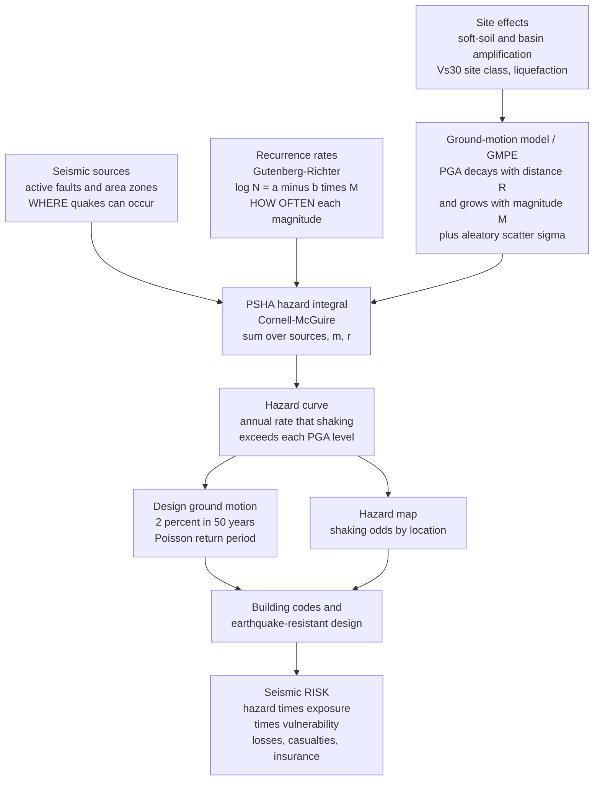

# 🌍 Seismic Hazard and Ground Motion

> [!abstract] TL;DR
> Earthquakes don't kill people — **collapsing buildings do**, so the life-saving payoff of seismology is not predicting *when* the next quake strikes (we cannot) but forecasting *how hard the ground will shake* at a given site over the coming decades. **Ground motion** quantifies that shaking — peak ground acceleration (**PGA**), velocity, displacement, and the **response spectrum** (spectral acceleration) that captures what a building actually *feels*. A **ground-motion model (GMPE)** describes how shaking *decays with distance* and *grows with magnitude*; **site effects** amplify it over soft soils. **Probabilistic Seismic Hazard Analysis (PSHA — Cornell 1968, McGuire)** integrates over every source, its **Gutenberg-Richter** recurrence rate, and the GMPE to produce the **annual rate** that shaking exceeds a level — the **hazard curve** behind the "**2% in 50 years**" design ground motion in every seismic building code. Hazard is not risk: **risk = hazard × exposure × vulnerability**.

---

## Intuition

**Analogy:** A weather forecaster cannot tell you the exact minute the next thunderstorm will hit your street, but they *can* tell you your roof needs to survive a "100-year storm" — the once-a-century downpour that building codes require. Seismic hazard is the same bargain with a slower, deadlier planet. We **cannot predict** the day of the next earthquake, but we **can forecast the odds** of strong shaking: combine *where the faults are*, *how often each ruptures*, and *how shaking fades with distance*, and out comes a single number — the ground acceleration your building has a 2% chance of feeling in the next 50 years.

That number is an **invisible design constraint** baked into every earthquake-resistant structure on Earth. It is a probability game against geology: earthquakes are effectively random in time (a **Poisson** process at the long time-scales that matter), so the honest product is not a date but a **map of the odds** — the annual rate that the ground exceeds each level of shaking, at every point on the planet.

---

## How It Works

### Core Mechanics

1. **Measure the shaking.** Ground motion at a site is characterized by **PGA** (peak ground *acceleration*, in units of $g$ — controls forces on stiff structures), **PGV** (peak *velocity* — correlates with damage to flexible structures), **PGD** (peak *displacement*), and — most usefully — the **response spectrum**: the peak response of a bank of single-degree-of-freedom oscillators, giving **spectral acceleration** $S_a(T)$ at each natural period $T$. A building "feels" the $S_a$ *at its own period*, which is why spectral acceleration, not raw PGA, governs modern design. Macroseismic **intensity** (Modified Mercalli) is the felt/damage-based cousin.
2. **Model how shaking attenuates — the GMPE.** A **ground-motion model** (a.k.a. ground-motion prediction equation, GMPE, or "attenuation relation") predicts the *distribution* of a shaking measure given magnitude $M$, source-site distance $R$, and site conditions. Schematically $\ln(\text{PGA}) = c_1 + c_2 M - c_3\ln R - c_4 R + (\text{site}) + \varepsilon$. The $-c_3\ln R$ term is **geometric spreading** (energy diluting over an expanding wavefront) and $-c_4 R$ is **anelastic attenuation** (energy lost to heat, the $Q$ effect). The residual $\varepsilon$ is **aleatory variability** — genuine record-to-record scatter, modelled as lognormal with standard deviation $\sigma$ (typically $\sigma \approx 0.5$–$0.7$ in $\ln$ units, a huge and often dominant contribution to hazard).
3. **Add site effects.** Soft sediments and sedimentary **basins amplify** shaking and lengthen its period: seismic energy slows and its amplitude grows as it enters low-velocity soil (impedance contrast), and basins trap and resonate it. **Mexico City, 1985** is the textbook catastrophe — a magnitude-8.0 quake **350 km away** flattened mid-rise buildings because the old lake-bed clay amplified long-period shaking up to $50\times$ at exactly the buildings' resonant period. Sites are classified by **$V_{s30}$** (average shear-wave velocity in the top 30 m); very low $V_{s30}$ also risks **liquefaction**, where saturated sand loses strength and flows.
4. **Combine everything — PSHA (Cornell-McGuire).** Probabilistic Seismic Hazard Analysis integrates over *all* sources and *all* magnitudes and distances. Each source has a **magnitude-frequency recurrence** law — **Gutenberg-Richter**, $\log_{10} N = a - bM$ (smaller quakes vastly more frequent; $b\approx 1$) — giving the rate and magnitude distribution of events. For a threshold $x$, the **annual rate of exceedance** at the site is
   $$\lambda(\text{IM} > x) = \sum_{\text{sources}} \nu_i \iint P(\text{IM} > x \mid m, r)\, f_M(m)\, f_R(r)\, dm\, dr,$$
   where $\nu_i$ is the source's rate of events, $f_M$ and $f_R$ are the magnitude and distance densities, and $P(\text{IM}>x\mid m,r)$ comes from the GMPE's lognormal tail. Plotting $\lambda$ versus $x$ gives the **hazard curve**; doing it for many sites gives a **hazard map**.
5. **Convert rate to design probability.** Treating events as **Poisson** in time, the probability of exceedance in $t$ years is $P = 1 - e^{-\lambda t}$. Building codes invert this: the **"2% in 50 years"** design motion ($\approx$ 2475-year return period) is the PGA/$S_a$ whose annual rate satisfies $1 - e^{-\lambda\cdot 50} = 0.02$. A less stringent **"10% in 50 years"** ($\approx$ 475-year) level is common for ordinary buildings.
6. **Deterministic alternative (DSHA).** Instead of integrating probabilities, **Deterministic Seismic Hazard Analysis** picks a specific worst-case *scenario* ("the maximum credible earthquake on the nearest fault") and computes the shaking it produces. DSHA is transparent and favoured for critical facilities (dams, nuclear plants) but ignores how *often* that scenario occurs — PSHA's strength.
7. **Forecast, don't predict.** We can estimate **long-term rates** and even **short-term aftershock probabilities** (**ETAS** models, operational earthquake forecasting), but a century of failed **prediction** attempts (Parkfield, VAN, radon, animals) confirms individual quakes are effectively unpredictable in time. **Early warning** (Japan, USGS **ShakeAlert**) sidesteps prediction entirely: detect the fast, harmless **P-wave** and broadcast an alert that outruns the slower, damaging **S-waves** and surface waves — seconds to tens of seconds of warning.

### Flow / Architecture



---

## Key Concepts

**Secondary (intuition level).** Earthquakes don't kill people; buildings that collapse do. We *cannot* predict when a quake will happen, but we *can* forecast how hard the ground is likely to shake at your location over the next 50 years. Shaking gets **weaker with distance** and **stronger with bigger quakes**, and **soft soil shakes worse** than hard rock. Engineers combine "where faults are," "how often they slip," and "how shaking fades" into one number — the shaking your building must survive — written into the building code.

**Undergraduate (working level).** Ground motion is quantified by PGA/PGV/PGD and, more usefully, the **response spectrum** $S_a(T)$. A **GMPE** predicts the lognormal distribution of shaking from magnitude, distance, and site term (geometric spreading $\ln R$ + anelastic $R$ + $V_{s30}$). **PSHA** integrates the GMPE against **Gutenberg-Richter** recurrence over all sources to give the **annual exceedance rate** $\lambda(x)$; the Poisson assumption converts $\lambda$ to a probability of exceedance in a design window, yielding the **2% / 10% in 50 years** hazard levels and the **hazard curve/map**. **DSHA** is the scenario-based alternative. Crucially, **risk = hazard × exposure × vulnerability** — hazard is only the first factor.

**Graduate (rigorous level).** The hazard integral $\lambda(x) = \sum_i \nu_i \iint P(\text{IM}>x\mid m,r)\,f_M(m)\,f_R(r)\,dm\,dr$ separates **aleatory** variability (irreducible record-to-record scatter, the GMPE $\sigma$, integrated *inside* $P$) from **epistemic** uncertainty (imperfect knowledge of models/parameters, handled *outside* via a **logic tree** of weighted alternatives, producing a fan of hazard curves and fractiles). **Disaggregation** decomposes a chosen hazard level back into the controlling $(M, R, \varepsilon)$ scenario for ground-motion selection. Modern **NGA** GMPEs add nonlinear site response, basin depth ($Z_{1.0}$, $Z_{2.5}$), hanging-wall and directivity terms, and partition $\sigma$ into **between-event** ($\tau$) and **within-event** ($\phi$) components (single-station sigma). Time-dependent hazard replaces Poisson with **renewal** (Brownian Passage Time) models on individual faults; short-term hazard uses **ETAS** self-exciting point processes. **Vector**- and **conditional-spectrum** methods, and full **physics-based** ground-motion simulation (SCEC CyberShake), push beyond scalar PSHA.

---

## Python Demo

```python
# Ground-motion attenuation + the core of PSHA, from scratch (numpy + matplotlib).
# (a) GMPE: how PGA DECAYS with distance and GROWS with magnitude
#     (geometric spreading -c3*ln R  +  anelastic attenuation -c4*R).
# (b) Gutenberg-Richter recurrence  log10 N = a - b*M.
# (c) PSHA hazard curve: annual RATE that PGA exceeds x at a site, plus the
#     "2% / 10% in 50 years" design ground motions (Poisson return periods).
import numpy as np
import matplotlib.pyplot as plt
from math import erf

def norm_cdf(z):
    # Standard-normal CDF via the error function, applied element-wise.
    return 0.5 * (1.0 + np.vectorize(erf)(z / np.sqrt(2.0)))

# ---------------------------------------------------------------------------
# (a) A simple GMPE:  ln PGA[g] = c1 + c2*M - c3*ln(Reff) - c4*Reff  (+/- sigma)
#     Reff = sqrt(R^2 + h^2) avoids the singularity at R = 0 (near-source saturation)
# ---------------------------------------------------------------------------
c1, c2, c3, c4, h, sigma = -4.0, 0.90, 1.10, 0.004, 5.0, 0.60

def ln_pga_median(M, R):
    Reff = np.sqrt(R**2 + h**2)
    return c1 + c2*M - c3*np.log(Reff) - c4*Reff   # ln of median PGA in g

R = np.logspace(0, np.log10(300), 300)             # 1 -> 300 km
mags = [5.0, 6.0, 7.0, 8.0]

# ---------------------------------------------------------------------------
# (b) Gutenberg-Richter recurrence for one source, truncated to [Mmin, Mmax]
# ---------------------------------------------------------------------------
a_gr, b_gr, Mmin, Mmax = 4.0, 1.0, 5.0, 7.5
nu = 10.0**(a_gr - b_gr*Mmin)                       # rate of events with M >= Mmin
m = np.linspace(Mmin, Mmax, 200)
dm = m[1] - m[0]
# truncated-exponential magnitude PDF (derivative of the GR law):
fM = (b_gr*np.log(10)*10.0**(-b_gr*(m - Mmin))) / (1 - 10.0**(-b_gr*(Mmax - Mmin)))
N_ge = nu * (10.0**(-b_gr*(m - Mmin)) - 10.0**(-b_gr*(Mmax - Mmin))) \
          / (1 - 10.0**(-b_gr*(Mmax - Mmin)))       # annual rate of events >= m

# ---------------------------------------------------------------------------
# (c) PSHA hazard integral at a site 10 km from the source.
#     lambda(x) = nu * INTEGRAL P(PGA>x | m) fM(m) dm ,  P from the GMPE lognormal tail
# ---------------------------------------------------------------------------
R_site = 10.0
mu_m = ln_pga_median(m, R_site)                     # median ln PGA for each magnitude
x = np.logspace(np.log10(0.002), np.log10(2.0), 250)  # PGA thresholds [g]

lam = np.empty_like(x)
for i, xi in enumerate(x):
    P_exceed = 1.0 - norm_cdf((np.log(xi) - mu_m) / sigma)   # P(PGA>xi | m)
    lam[i] = nu * np.sum(P_exceed * fM * dm)                 # annual exceedance rate

P50 = 1.0 - np.exp(-lam * 50.0)                     # Poisson prob. of exceedance in 50 yr

# Design motions: invert  1 - exp(-lambda*50) = p  ->  lambda = -ln(1-p)/50
lam_10 = -np.log(1 - 0.10) / 50.0                   # 10% in 50 yr (~475-yr return)
lam_02 = -np.log(1 - 0.02) / 50.0                   # 2%  in 50 yr (~2475-yr return)
# interpolate PGA at those rates (lambda decreases with x, so reverse for np.interp)
pga_10 = np.interp(lam_10, lam[::-1], x[::-1])
pga_02 = np.interp(lam_02, lam[::-1], x[::-1])
print(f"Source rate nu (M>=5) : {nu:.3f} /yr  (~1 every {1/nu:.0f} yr)")
print(f"10% in 50 yr design PGA (~475-yr) : {pga_10:.3f} g")
print(f" 2% in 50 yr design PGA (~2475-yr): {pga_02:.3f} g")

# ---------------------------------------------------------------------------
# Plots
# ---------------------------------------------------------------------------
fig, ax = plt.subplots(1, 3, figsize=(16, 4.6))

# (a) attenuation curves: log PGA vs distance for several magnitudes
for M in mags:
    ax[0].loglog(R, np.exp(ln_pga_median(M, R)), label=f"M {M:.0f}")
ax[0].set_xlabel("distance from source R [km]")
ax[0].set_ylabel("median PGA [g]")
ax[0].set_title("(a) GMPE: shaking decays with distance,\ngrows with magnitude")
ax[0].legend(title="magnitude"); ax[0].grid(True, which="both", alpha=0.3)

# (b) Gutenberg-Richter recurrence
ax[1].semilogy(m, N_ge, color="#8e44ad")
ax[1].set_xlabel("magnitude M")
ax[1].set_ylabel("annual rate of events with M or greater")
ax[1].set_title("(b) Gutenberg-Richter recurrence\nlog N = a - b M")
ax[1].grid(True, which="both", alpha=0.3)

# (c) PSHA hazard curve
ax[2].loglog(x, lam, color="#c0392b", lw=2, label="hazard curve")
for lv, pg, lab in [(lam_10, pga_10, "10% in 50 yr"),
                    (lam_02, pga_02, "2% in 50 yr")]:
    ax[2].axhline(lv, color="grey", ls=":", lw=1)
    ax[2].plot(pg, lv, "ko")
    ax[2].annotate(f"{lab}\n{pg:.2f} g", xy=(pg, lv),
                   xytext=(pg*1.05, lv*3), fontsize=8)
ax[2].set_xlabel("PGA level x [g]")
ax[2].set_ylabel("annual rate PGA > x  [1/yr]")
ax[2].set_title("(c) Seismic hazard curve (core of PSHA)")
ax[2].grid(True, which="both", alpha=0.3); ax[2].legend()

plt.tight_layout()
plt.savefig("seismic_hazard_and_ground_motion.png", dpi=130)
print("\nSaved seismic_hazard_and_ground_motion.png")
```

Running this prints the source rate and the design PGAs, then produces three panels: **(a)** the GMPE — parallel curves showing PGA falling roughly as a power of distance (the straight-ish log-log slope from geometric spreading, bending down at large $R$ from anelastic attenuation) and shifting *up* with magnitude; **(b)** the Gutenberg-Richter recurrence, small quakes vastly more frequent than large ones; and **(c)** the **hazard curve** — the annual rate that PGA exceeds each level — with the "10% in 50 years" and "2% in 50 years" **design ground motions** read off where the curve crosses the corresponding Poisson exceedance rates. That single curve *is* the deliverable of PSHA.

---

## Real-World Applications

- **Building codes.** National seismic maps (USGS in the U.S., feeding **ASCE 7** and the **IBC**; Eurocode 8; Japan's code) publish the 2%- or 10%-in-50-year $S_a$ that every new structure must be designed to resist — the direct, mandatory output of PSHA.
- **Critical infrastructure.** Nuclear plants, large dams, LNG terminals, and hospitals use very long return periods (up to $10^4$–$10^6$ years) and often DSHA scenarios; the discipline traces to Cornell's 1968 framework and NRC/IAEA siting rules.
- **Earthquake insurance and catastrophe bonds.** Cat-modelling firms (RMS, Verisk/AIR) chain hazard → exposure → vulnerability to price policies and reinsurance, making **risk = hazard × exposure × vulnerability** an explicitly financial equation.
- **Land-use and retrofit prioritization.** Hazard + liquefaction + landslide-susceptibility maps steer zoning and identify which soft-story or unreinforced-masonry buildings to retrofit first.
- **Earthquake Early Warning.** USGS **ShakeAlert** (U.S. West Coast) and Japan's JMA system detect P-waves at near-source stations and issue alerts that halt trains, stop surgeries, and open firehouse doors seconds before the S-waves arrive.
- **Operational earthquake forecasting.** After a mainshock, **ETAS**-based models issue evolving aftershock probabilities (as USGS/INGV did following Ridgecrest and the Italian sequences) to guide emergency response — forecasting, never prediction.

---

## Common Pitfalls

- **Confusing hazard with risk.** Hazard is the *shaking* (a property of the ground); **risk = hazard × exposure × vulnerability** is the *expected loss*. A ferocious hazard in an empty desert is low risk; a modest hazard under a dense, poorly-built city is catastrophic risk. Reporting hazard maps as "risk" maps is the single most common error.
- **Expecting prediction instead of forecasting.** No method reliably predicts the *time* of an individual earthquake; a century of "precursors" (radon, animals, VAN, Parkfield) failed. What works is **forecasting** long-term rates and hazard, plus short-term *aftershock* probabilities. Selling PSHA as prediction erodes public trust when a quake "arrives early."
- **Ignoring site effects / amplification.** PGA on hard rock can be a small fraction of PGA on soft clay. **Mexico City 1985** amplified distant shaking up to $50\times$; assuming rock motion everywhere badly under-designs structures on basins and reclaimed land. Always carry $V_{s30}$, basin depth, and possible **liquefaction**.
- **Designing to PGA when the building's period matters.** PGA is one point on the response spectrum. A tall, flexible building resonates at long periods where **spectral acceleration** $S_a(T)$ can far exceed PGA (again, Mexico City's mid-rise resonance). Use the spectral ordinate at the *structure's own period*, not raw PGA.
- **Mishandling aleatory vs epistemic uncertainty.** **Aleatory** variability (the GMPE $\sigma$) is irreducible record-to-record scatter and must be integrated *inside* the hazard integral — truncating or omitting it drastically underestimates hazard. **Epistemic** uncertainty (which model/parameters are right) is *reducible* and belongs in a **logic tree** *outside* the integral. Collapsing the two, or dropping $\sigma$, corrupts the result.
- **Treating Gutenberg-Richter as a fault's whole story.** Regional GR captures many faults' aggregate; a *single* large fault may instead produce quasi-periodic **characteristic earthquakes** better modelled by time-dependent renewal, not a stationary Poisson/GR extrapolation.
- **Blindly extrapolating the tail.** Design return periods (2475+ years) reach far beyond the ~century-long instrumental catalog; the extreme tail leans heavily on model assumptions, paleoseismology, and $M_{max}$ choices — the most uncertain and consequential inputs.

---

## Related Concepts

- [[Elasticity_and_Seismic_Wave_Theory]] — the P/S/surface waves whose amplitude and geometric spreading the GMPE parameterizes; the $V_p>V_s$ head-start that early warning exploits.
- [[Seismology_and_Earthquakes]] — the observational foundation: locating and sizing the sources whose recurrence and shaking this note forecasts.
- [[Common_Probability_Distributions]] — the **Poisson** process behind return periods and the **lognormal** GMPE tail that supplies $P(\text{IM}>x\mid m,r)$.
- [[Probability_Theory]] — exceedance probabilities, conditional integration, and the total-probability structure of the PSHA hazard integral.
- [[Criticality_and_Phase_Transitions]] — self-organized criticality and power-law event-size statistics that make Gutenberg-Richter's scale-free frequency-magnitude law natural.
- [[Cascades_and_Systemic_Risk]] — how a single hazard can cascade through interdependent infrastructure into systemic loss (hazard → risk amplification).
- [[Power_Laws_and_Heavy_Tails_in_Economics]] — the same heavy-tailed statistics (fat tails, rare-but-huge events) that govern earthquake sizes and seismic-loss distributions.
- [[Self_Organized_Criticality_in_Economics]] — sandpile-style criticality, the conceptual cousin of stress accumulation and sudden fault rupture.
- [[Mass_Wasting_and_Slope_Stability]] — earthquake-triggered landslides and liquefaction, the ground-failure secondary hazards that accompany strong shaking.

*Sibling notes in this Geophysics/Seismology section (build these next): Earthquake_Seismology_Fundamentals develops magnitude, location, and the seismograph; Earthquake_Source_and_Focal_Mechanisms covers the rupture physics and radiation pattern feeding the GMPE; Geophysics_of_Plate_Tectonics supplies the fault kinematics and long-term slip rates behind recurrence; Induced_Seismicity_and_Georesource_Geophysics treats human-caused (injection/reservoir) earthquakes and their hazard; and The_Reach_and_Future_of_Geophysics places hazard forecasting within the discipline's societal mission.*

---

## Review Questions

1. **(Secondary)** People often say "seismologists should just predict earthquakes." Explain the difference between *predicting* an earthquake and *forecasting seismic hazard*, and why the second — even without knowing the date — still saves lives.
2. **(Undergraduate)** A site sits 10 km from a fault with Gutenberg-Richter parameters $a=4$, $b=1$ (magnitudes 5.0–7.5). Using a GMPE and the Poisson assumption, outline every step to compute the PGA with a 2%-in-50-year probability of exceedance. Where does the ground-motion variability $\sigma$ enter, and why does dropping it under-predict the hazard?
3. **(Graduate)** Two hazard analyses for the same site give the same *median* hazard curve, but one has a much wider fan of fractile curves. (a) Which type of uncertainty widens that fan, and how is it represented? (b) Contrast it with the variability integrated *inside* the hazard integral. (c) How would replacing the Poisson recurrence on the controlling fault with a Brownian-Passage-Time renewal model change the short-term hazard shortly after that fault's last rupture?

---

## Sources

- Cornell, C. A. (1968). "Engineering seismic risk analysis." *Bulletin of the Seismological Society of America*, 58(5), 1583–1606. (The founding paper of PSHA.)
- McGuire, R. K. (2004). *Seismic Hazard and Risk Analysis*. Earthquake Engineering Research Institute (EERI).
- Reiter, L. (1990). *Earthquake Hazard Analysis: Issues and Insights*. Columbia University Press.
- Kramer, S. L. (1996). *Geotechnical Earthquake Engineering*. Prentice Hall. (Ground motion, site effects, liquefaction.)
- Baker, J. W., Bradley, B. A., & Stafford, P. J. (2021). *Seismic Hazard and Risk Analysis*. Cambridge University Press. (Modern PSHA; see also Baker's "Introduction to PSHA" tutorial.)
- [USGS — Earthquake Hazards Program: Seismic Hazard Maps and ShakeAlert](https://www.usgs.gov/programs/earthquake-hazards)

---

#geophysics #seismic-hazard #ground-motion #psha #earthquake-engineering
