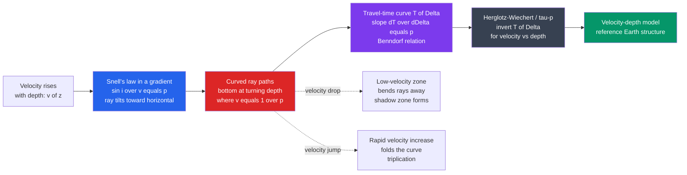

# 🌐 Seismic Ray Theory and Travel Times

> [!abstract] TL;DR
> **Seismic ray theory** is the **high-frequency approximation** to elastic wave propagation: instead of tracking whole wavefronts, we follow **rays** — the paths energy takes, obeying **Snell's law** as the wave speed changes. The key conserved quantity is the **ray parameter** `p = sin(i)/v` (the horizontal slowness), which stays constant along a ray and also equals the **slope of the travel-time curve**, `p = dT/dΔ` (Benndorf's relation). Because the Earth's velocity generally rises with depth, rays **curve back to the surface**, bottoming at a turning depth where `v = 1/p`. Catalogue how arrival time `T` varies with epicentral distance `Δ` and you can run the physics backward — via the **Herglotz–Wiechert / τ–p inversion** — to reconstruct **velocity versus depth**. This one idea built the first reference Earth models, revealed the liquid core through its **shadow zone**, and underpins **refraction surveying** and **tomography**.

## Intuition — analogy FIRST

Drop a straw into a glass of water and it looks bent at the surface. Light travels slower in water than in air, so at the boundary it **changes direction** — it *refracts*. That is **Snell's law**, and seismic waves obey exactly the same rule when they pass from one rock into a faster or slower one. Because the Earth gets stiffer and faster with depth, a seismic wave doesn't just kink at one boundary — it bends **continuously**, curving like a ball thrown across a field: it arcs gently downward, reaches a lowest point, and swings back up to the surface far away.

Now imagine you're standing at the surface with a row of microphones stretched out toward the horizon, and someone taps the ground once. Each microphone hears the tap at a slightly different time. Plot **arrival time against distance** and you get a curve — a **travel-time curve**. That curve is a **fingerprint of the rock at depth**: its *slope* at each distance tells you the wave's horizontal slowness, and the *shape* of the whole curve encodes how fast the rock is at every depth the rays touched. Seismology is the craft of reading that fingerprint backward — from arrival times on the surface to a velocity profile of a planet no one can visit.

---

## How It Works

### Core Mechanics

1. **The ray is a shortcut for a wavefront.** When wavelengths are short compared with the scale over which velocity changes, energy travels along **rays** perpendicular to the wavefronts. This is the **eikonal** limit of the wave equation — the seismic version of *geometric optics*.
2. **Snell's law bends the ray.** At any point the angle of incidence `i` (measured from vertical) and the local velocity `v` are tied by Snell's law. Written for the horizontal component of slowness, it says one number stays fixed along the entire ray.
3. **The ray parameter is conserved.** That number is the **ray parameter** `p = sin(i)/v`. As the ray descends into faster rock, `v` grows, so `sin(i)` must grow too — the ray tilts toward the horizontal — until at the **turning depth** it is travelling horizontally (`i = 90°`, `v = 1/p`) and starts climbing back.
4. **Ray tracing = integrating the ray.** Given a velocity model `v(z)`, you integrate the ray equations from the source outward: `dx/dz = tan(i) = p·v / sqrt(1 − p²v²)`. Each takeoff angle gives a different `p`, a different turning depth, and a different landing distance `Δ`.
5. **Travel-time curves are the observable.** For each ray you accumulate distance `Δ(p)` and time `T(p)`. The plot of `T` versus `Δ` is the primary datum of classical seismology, and its slope is the ray parameter itself: **`p = dT/dΔ` (Benndorf's relation).**
6. **Inversion recovers the Earth.** Because slope encodes `p` and `p` sets the turning depth, an integral transform — the **Herglotz–Wiechert formula**, or its modern **τ–p** cousin — turns a measured `T(Δ)` curve into `v(z)` directly, provided velocity increases monotonically with depth.

### Flow / Architecture



---

## Key Concepts

### Secondary Level

- **Rays bend, like light in water.** A seismic wave passing into faster rock changes direction — Snell's law — just as light bends entering water. Since rock speeds up with depth, rays curve downward then back up.
- **One tap, many arrival times.** A single seismic source is heard at different times by receivers at different distances. The graph of time versus distance is the **travel-time curve**.
- **Deeper rays go faster and get there quicker (per km).** A wave that dives deep travels through faster rock, so distant receivers can be reached surprisingly fast — the curve is not a straight line.
- **The curve is a code for the interior.** By reading the curve's shape, seismologists work out how fast the rock is at each depth — without ever digging down.

### Undergraduate Level

- **Ray parameter `p = sin(i)/v`.** The horizontal slowness, **constant along a ray**. Small `p` (steep takeoff) dives deep; large `p` (shallow takeoff) turns near the surface. Range: `0` (vertical) to `1/v_surface` (horizontal).
- **Turning point.** A ray bottoms where it becomes horizontal, i.e. where `v(z) = 1/p`. Deeper turning ⇔ smaller `p` ⇔ faster bottoming rock.
- **Benndorf's relation `p = dT/dΔ`.** The slope of the travel-time curve *equals* the ray parameter of the ray arriving at that distance. Measuring slope on a seismogram section gives `p` directly.
- **Direct, refracted (head) and reflected phases.** In a layered crust the first arrival switches from the **direct wave** (`T = Δ/v₁`, a straight line through the origin) to the **head wave / critical refraction** (a straight line with shallower slope `1/v₂` and a positive intercept) beyond the crossover distance — the basis of **refraction surveying**.
- **Named body-wave phases.** Global travel-time curves label rays by the path they take: **P**, **S**, **PP**, **PcP** (reflects off the core), **ScS**, **PKP** (through the outer core), **PKIKP** (through the inner core). Each is one branch of `T(Δ)`.
- **Shadow zones.** A velocity **drop** at depth bends rays *away*, so a band of distances receives no direct arrival — the **P-wave shadow zone (~103°–143°)** is how the liquid outer core was discovered.

### Graduate Level

- **The eikonal equation.** Ray theory is the leading term of a high-frequency (WKBJ) asymptotic solution of the elastic wave equation. The travel-time field `T(x)` obeys the **eikonal** `|∇T|² = 1/v²`, a first-order nonlinear PDE; its **characteristics are the rays**, and the transport equation carries amplitude along them.
- **Fermat's principle.** Rays are **stationary-time paths** — a variational principle identical in form to least action in mechanics. Snell's law and the ray equations fall straight out of it (calculus of variations).
- **τ–p (intercept-slowness) formulation.** Define the **delay time** `τ(p) = T − pΔ = 2∫ sqrt(u² − p²) dz` (with slowness `u = 1/v`). `τ(p)` is single-valued and monotonic even where `T(Δ)` triplicates, which is why modern inversion and slant-stacking work in the τ–p domain rather than `T–Δ`.
- **Herglotz–Wiechert inversion.** For a monotonically increasing `v(z)`, the turning-point depth is recovered by an Abel-type integral of `dT/dΔ` over distance — the classic closed-form inverse that produced the first `v(z)` models (Jeffreys–Bullen) before computers.
- **Triplications.** A rapid velocity increase (steep gradient or a discontinuity, e.g. the **410/660 km** transition-zone jumps) makes `Δ(p)` non-monotonic, folding `T(Δ)` into **three overlapping branches** — two prograde and one **retrograde** — with **caustics** at the cusps.
- **Breakdown of ray theory.** Being a high-frequency approximation, ray theory diverges at **caustics** and gives zero energy in shadow zones (where real, finite-frequency waves diffract). Corrections require **Maslov / Gaussian-beam** methods, **WKBJ** with turning-point (Airy) functions, or full **finite-frequency / waveform** theory.

---

## Python Demo

Two panels for a single, self-consistent, layered Earth model whose velocity **rises with depth**. **Left:** ray tracing by the **ray parameter** `p = sin(i)/v`. For a fan of takeoff angles we integrate the ray through constant-gradient layers (using the singularity-free circular-arc formulas), so each ray **curves downward, bottoms at its turning depth, and arcs back to the surface**. **Right:** the resulting **travel-time curve** `T(Δ)`. We verify numerically that the slope `dT/dΔ` reproduces the ray parameter `p` (Benndorf), and the deliberately **steep zone at 120–160 km folds the curve into overlapping branches — a triplication** — exactly the fingerprint an inversion decodes back into `v(z)`.

```python
# Seismic ray tracing + travel-time curve for a velocity model that increases with depth.
# Demonstrates: p = sin(i)/v conserved, curved rays with turning depths, T(Delta),
# slope dT/dDelta = p (Benndorf), a triplication from a rapid velocity increase,
# and the tau-p / Herglotz-Wiechert inversion idea.
import numpy as np
import matplotlib.pyplot as plt

# --- Piecewise-linear (continuous) velocity model: nodes (depth km, velocity km/s) ---
znodes = np.array([0.0, 60.0, 120.0, 160.0, 400.0])
vnodes = np.array([5.0,  6.0,   6.5,   9.0,  10.5])   # steep jump 120->160 km => triplication
v0 = vnodes[0]

def trace(p):
    """Trace one ray of ray parameter p (1/(km/s)) through the model.
    Returns full ray path (x,z), total distance X, total time T, turning depth, or None."""
    xs, zs = [0.0], [0.0]
    X = T = 0.0
    turned = False
    for j in range(len(znodes) - 1):
        zt, zb = znodes[j], znodes[j + 1]
        vt, vb = vnodes[j], vnodes[j + 1]
        a = (vb - vt) / (zb - zt)          # velocity gradient in this layer (nonzero)
        it = np.arcsin(min(p * vt, 1.0))   # incidence angle at layer top (from vertical)
        if p * vb >= 1.0:                  # ray turns INSIDE this layer, where v = 1/p
            ib = np.pi / 2.0
            ii = np.linspace(it, ib, 80)
            xs.extend((xs[-1] + (np.cos(it) - np.cos(ii)) / (p * a))[1:])
            zs.extend((zt + (np.sin(ii) - np.sin(it)) / (p * a))[1:])
            X += (np.cos(it) - np.cos(ib)) / (p * a)
            T += (np.log(np.tan(ib / 2)) - np.log(np.tan(it / 2))) / a
            turned = True
            break
        else:                              # ray crosses the whole layer
            ib = np.arcsin(p * vb)
            ii = np.linspace(it, ib, 30)
            xs.extend((xs[-1] + (np.cos(it) - np.cos(ii)) / (p * a))[1:])
            zs.extend((zt + (np.sin(ii) - np.sin(it)) / (p * a))[1:])
            X += (np.cos(it) - np.cos(ib)) / (p * a)
            T += (np.log(np.tan(ib / 2)) - np.log(np.tan(it / 2))) / a
    if not turned:
        return None                        # ray never turned within the model
    xs, zs = np.array(xs), np.array(zs)
    x_full = np.concatenate([xs, (2 * xs[-1] - xs[::-1])[1:]])   # mirror the up-going leg
    z_full = np.concatenate([zs, zs[::-1][1:]])
    return x_full, z_full, 2 * X, 2 * T, zs[-1]

# --- Sweep takeoff angles -> ray parameters -> rays ---
takeoff = np.deg2rad(np.linspace(30, 89, 60))
p_all, X_all, T_all, zturn_all, paths = [], [], [], [], []
for i0 in takeoff:
    p = np.sin(i0) / v0
    r = trace(p)
    if r is None:
        continue
    x, z, X, T, zt = r
    p_all.append(p); X_all.append(X); T_all.append(T); zturn_all.append(zt); paths.append((x, z))
p_all = np.array(p_all); X_all = np.array(X_all); T_all = np.array(T_all)

# Benndorf check: slope of T(Delta) should equal the ray parameter p
order = np.argsort(X_all)
dTdX = np.gradient(T_all[order], X_all[order])
print("Benndorf p = dT/dDelta check (should match ray parameter p):")
for k in range(0, len(order), max(1, len(order) // 6)):
    print(f"  Delta={X_all[order][k]:6.1f} km   p_true={p_all[order][k]:.4f}   "
          f"dT/dDelta={dTdX[k]:.4f}  s/km")

# tau-p delay time (single-valued even where T(Delta) triplicates) -> Herglotz-Wiechert idea
tau_all = T_all - p_all * X_all
print(f"\ntau = T - p*Delta is monotonic in p: min={tau_all.min():.2f}s max={tau_all.max():.2f}s")
print("Inverting T(Delta) -> v(z) (Herglotz-Wiechert / tau-p) is the classic inverse problem.")

# --- Plot ---
fig, (ax1, ax2) = plt.subplots(1, 2, figsize=(13, 6))

# Left: curved ray paths bottoming at turning depths
cmap = plt.cm.viridis
for idx in range(0, len(paths), 4):
    x, z = paths[idx]
    ax1.plot(x, z, color=cmap(idx / len(paths)), lw=1.3)
    ax1.plot(x[len(x)//2], zturn_all[idx], 'v', color='k', ms=4)   # turning point
for zn in znodes[1:-1]:
    ax1.axhline(zn, color='0.6', ls='--', lw=0.7)
ax1.axhspan(120, 160, color='#dc2626', alpha=0.10)
ax1.text(5, 140, "steep\nzone", color='#dc2626', fontsize=8)
ax1.plot(0, 0, 'r*', ms=15, label="source")
ax1.set_xlabel("epicentral distance  Delta  (km)")
ax1.set_ylabel("depth  z  (km)")
ax1.set_title("Ray tracing: curved rays bottom at v = 1/p and return")
ax1.invert_yaxis(); ax1.legend(loc="lower right", fontsize=8); ax1.grid(alpha=0.3)

# Right: travel-time curve T(Delta), colored by ray parameter p; triplication visible
sc = ax2.scatter(X_all, T_all, c=p_all, cmap='plasma', s=22)
ax2.plot(X_all[order], T_all[order], color='0.7', lw=0.8, zorder=0)
cb = fig.colorbar(sc, ax=ax2); cb.set_label("ray parameter p = sin(i)/v  (s/km)")
ax2.plot(X_all, X_all / v0, '--', color='0.5', lw=1,
         label=f"direct along surface  T = Delta/{v0:.0f}")
ax2.annotate("slope dT/dDelta = p\n(Benndorf)", xy=(X_all[order][8], T_all[order][8]),
             xytext=(0.45, 0.25), textcoords='axes fraction', fontsize=8,
             arrowprops=dict(arrowstyle="->"))
ax2.text(0.40, 0.72, "rapid velocity increase\nfolds the curve\n=> TRIPLICATION",
         transform=ax2.transAxes, fontsize=8, color='#b91c1c')
ax2.set_xlabel("epicentral distance  Delta  (km)")
ax2.set_ylabel("travel time  T  (s)")
ax2.set_title("Travel-time curve T(Delta): slope = ray parameter")
ax2.legend(loc="lower right", fontsize=8); ax2.grid(alpha=0.3)

plt.tight_layout()
plt.savefig("seismic_ray_theory_travel_times.png", dpi=120)
print("\nSaved seismic_ray_theory_travel_times.png")
```

Running it prints the **Benndorf check** (the numerical slope `dT/dΔ` matching each ray's `p`), confirms that the **τ = T − pΔ** delay time is monotonic, and produces one figure: curved rays bottoming at their turning depths on the left, and a triplicated travel-time curve — colour-coded by ray parameter — on the right. That figure *is* the forward problem; the inverse problem is reading it right-to-left back into `v(z)`.

---

## Real-World Applications

- **Reference Earth models.** Herglotz–Wiechert and later travel-time inversions built the **Jeffreys–Bullen tables** and, with normal modes and gravity, **PREM/AK135/IASP91** — the `v(z)` standards used to locate every earthquake.
- **Discovering the core and inner core.** The **P-wave shadow zone** (Oldham, Gutenberg) proved a low-velocity liquid outer core; a faint arrival inside it (Lehmann's **PKIKP**) revealed the solid inner core — both are pure ray-theory shadow/triplication arguments.
- **Earthquake location.** Every hypocentre is found by matching observed `P` and `S` arrival times to predicted travel-time curves — the daily bread of seismic networks and early-warning systems.
- **Exploration refraction & reflection surveying.** Critically refracted **head waves** give crustal and near-surface velocities (crossover-distance method); reflection seismics uses moveout (a travel-time curve in disguise) to image oil, gas, geothermal, and CO₂-storage targets.
- **Seismic tomography.** Millions of travel-time residuals — ray theory's predictions minus observations — are inverted for 3-D velocity, imaging subducting slabs to the core–mantle boundary and rising plumes.
- **Planetary seismology.** NASA's **InSight** used a handful of marsquake travel times and ray theory to infer the Martian crust, mantle, and a large liquid core.
- **Nuclear-test monitoring.** The CTBTO discriminates explosions from earthquakes partly through their body-wave travel times and phase behaviour.

---

## Common Pitfalls

- **Forgetting the ray parameter is conserved.** `p = sin(i)/v` is constant along the *whole* ray, not just at one interface. Losing this invariant is the most common ray-tracing bug — every turning depth and landing distance follows from it.
- **Assuming velocity always increases (ignoring low-velocity zones).** A velocity **drop** bends rays *away* and creates a **shadow zone**; there, Herglotz–Wiechert fails (it assumes monotonic `v(z)`) and a naive inversion invents fake structure. The core's shadow zone is the textbook case.
- **Missing triplications from velocity jumps.** A rapid increase (the 410/660 discontinuities) folds `T(Δ)` into three overlapping branches. Picking "the" arrival at such distances without recognising the retrograde branch mis-identifies phases and corrupts the inversion — work in **τ–p**, where the curve stays single-valued.
- **Trusting ray theory near caustics.** Ray theory predicts **infinite** amplitude at caustics and **zero** energy in shadows — both wrong for real, finite-frequency waves that diffract. Use Gaussian-beam, Maslov, or WKBJ turning-point corrections there.
- **Confusing head waves with direct or reflected arrivals.** The **critically refracted head wave** is a distinct phase (shallower slope, non-zero intercept, first arrival only beyond the crossover distance). Treating a refraction as a direct wave gives wrong layer velocities.
- **Using ray theory below its frequency limit.** Rays assume wavelength ≪ structure. For long-period waves or fine layering, finite-frequency ("banana-doughnut") kernels or full-waveform methods are required, or features get mislocated.

---

## Related Concepts

- [[Geophysics_Overview]] — the parent field; ray theory is the workhorse of its primary probe, seismology, and the source of the inverse problem it centres on.
- [[Geometric_and_Wave_Optics]] — the direct optical analog: Snell's law, Fermat's principle, and refraction are identical in form; seismic rays *are* geometric optics for elastic waves.
- [[Wave_Motion_and_Properties]] — the underlying wave physics; ray theory is its short-wavelength (high-frequency) limit.
- [[Lagrangian_Mechanics]] — Fermat's stationary-time principle is a variational principle of the same shape as least action; the ray equations are its Euler–Lagrange equations.
- [[Introduction_to_PDEs]] — the eikonal `|∇T|² = 1/v²` is a first-order nonlinear PDE whose characteristics are the rays.
- [[First_Order_ODEs]] — ray tracing integrates the ray equations as a system of first-order ODEs through the velocity model.
- [[Ray_Tracing_and_Path_Tracing]] — computer-graphics ray tracing is the same geometric-ray abstraction (light instead of seismic energy), sharing Snell refraction and shadow reasoning.
- [[Interference_and_Diffraction]] — explains what ray theory *misses*: caustics and shadow-zone energy that arrive only through diffraction (finite-frequency effects).

*(Sibling seismology notes referenced in prose — Elasticity and Seismic Wave Theory, The Deep Structure of the Earth, Seismic Tomography and Earth Imaging, Seismic Reflection and Refraction Surveying, Geophysical Inverse Theory — will be wikilinked once created.)*

---

## Review Questions

### Secondary Level

1. Light bends when it enters water. Explain, using this analogy, why a seismic wave curves back up to the surface instead of continuing straight down into the Earth.
2. A single seismic tap is recorded by microphones at many distances. What is a "travel-time curve," and why isn't it a straight line?

### Undergraduate Level

3. Define the ray parameter `p = sin(i)/v`. Show that a ray turns (bottoms) where `v = 1/p`, and explain whether a steeply launched ray (small `p`) turns shallow or deep, and why.
4. State Benndorf's relation `p = dT/dΔ`. Given a travel-time curve, describe step by step how you would read off the ray parameter and the turning-point velocity of an arrival at a chosen distance.

### Graduate Level

5. A **low-velocity zone** exists at some depth. Explain what it does to the ray paths and the travel-time curve, why it produces a shadow zone, and why the Herglotz–Wiechert inversion cannot recover it. What data or methods would you add to detect it?
6. Explain why the **τ–p** (intercept-slowness) representation is preferred over `T–Δ` when a triplication is present. Derive `τ(p) = 2∫ sqrt(u² − p²) dz` conceptually and state why it is single-valued and monotonic where `T(Δ)` is not.

---

## Sources

- Shearer, P. M. — *Introduction to Seismology*, 2nd ed. (Cambridge University Press, 2009) — ch. 4, ray theory and travel times.
- Aki, K. & Richards, P. G. — *Quantitative Seismology*, 2nd ed. (University Science Books, 2002) — rays, eikonal, and the WKBJ approximation.
- Stein, S. & Wysession, M. — *An Introduction to Seismology, Earthquakes, and Earth Structure* (Blackwell, 2003) — travel-time curves, phases, and Herglotz–Wiechert.
- Červený, V. — *Seismic Ray Theory* (Cambridge University Press, 2001) — the definitive monograph on ray tracing and its extensions.
- Lay, T. & Wallace, T. C. — *Modern Global Seismology* (Academic Press, 1995) — τ–p methods and body-wave travel times.

---

#geophysics #seismology #ray-theory #travel-times #snells-law
