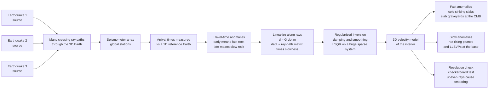

# 🌍 Seismic Tomography and Earth Imaging

> [!abstract] TL;DR
> **Seismic tomography is a CT scan of the planet.** Earthquakes are the sources, seismometers the detectors, and the *travel times* of countless waves crisscrossing the Earth from every direction are the data. A wave arriving **early** has crossed **fast (cold, stiff) rock**; one arriving **late** has crossed **slow (hot, soft) rock**. Because each measured delay is (to first order) the sum of tiny slowness perturbations along the wave's ray path, the whole dataset linearizes to $\mathbf{d} = G\,\mathbf{m}$ — data equals a huge, sparse **ray-path matrix** $G$ times the unknown 3-D **slowness model** $\mathbf{m}$. Solving this ill-posed inverse problem (least-squares with damping and smoothing) reconstructs a 3-D velocity image of the interior, revealing **cold slabs sinking to the core-mantle boundary**, **hot plumes rising from it**, and the giant **LLSVPs** — the moving parts of the plate-tectonic engine.

---

## Intuition

**Analogy:** A **CT scanner** images your body by firing X-rays through it from thousands of angles and computing, cell by cell, where the rays slowed down — dense bone absorbs more than soft tissue, so combining all those projections reconstructs a 3-D picture of your insides *without ever cutting you open*. Seismic tomography does exactly this to the planet. **Earthquakes are the X-ray sources**, **seismometers are the detectors**, and by combining the travel times of countless waves that criss-cross the Earth from every direction, geophysicists reconstruct a 3-D picture of the interior.

The one twist versus a hospital scanner is that we do not get to choose where the sources are — earthquakes happen where plates grind, and stations sit where there is dry land — so the "X-ray angles" are **uneven**. Some regions are pierced by thousands of crossing rays (sharp image); others are barely sampled (blurry smear). Wherever the rays *do* cross well, they reveal the planet's machinery: **cold slabs of old ocean floor sinking into the mantle** show up as fast blobs, and **hot plumes rising from the deep** show up as slow ones — the churning engine that drives plate tectonics, imaged from the outside in.

---

## How It Works

### Core Mechanics

1. **Pick a reference model.** Start with a smooth 1-D Earth (velocity as a function of depth only, e.g. PREM). For every source-receiver pair, predict the arrival time of a phase (P, S, a surface-wave period, or a whole waveform). This is the baseline the data are compared against.
2. **Measure travel-time anomalies.** For each recorded wave, the **residual** $\delta t = t_{\text{observed}} - t_{\text{predicted}}$ is the datum. A **negative** residual (early arrival) means the ray crossed **faster-than-average** rock; a **positive** residual (late arrival) means **slower-than-average** rock. Millions of such residuals are collected.
3. **Linearize along ray paths.** To first order (Fermat's principle: the travel time is stationary, so the path itself barely moves under a small velocity change), each residual is the line integral of the **slowness perturbation** $\delta s = \delta(1/v)$ along the reference ray: $\delta t = \int_{\text{ray}} \delta s\, dl$. Discretize the Earth into cells and this becomes a sum, $\delta t_i = \sum_j G_{ij}\, m_j$, where $G_{ij}$ is the **path length of ray $i$ inside cell $j$** and $m_j$ is that cell's unknown slowness perturbation.
4. **Assemble the linear system $\mathbf{d} = G\,\mathbf{m}$.** Here $\mathbf{d}$ holds all the residuals, $\mathbf{m}$ holds every cell's unknown, and $G$ is the **ray-path (sensitivity) matrix**. $G$ is enormous (millions of rows) and **very sparse** — each ray touches only a handful of cells — and the system is **ill-posed**: some cells are hit by many crossing rays, others by none.
5. **Invert with regularization.** Because $G$ is under-determined and noisy, you cannot just solve $\mathbf{m} = G^{-1}\mathbf{d}$. Instead minimize $\lVert G\mathbf{m} - \mathbf{d}\rVert^2 + \lambda^2 \lVert L\mathbf{m}\rVert^2$: the first term fits the data, the second **damps** ($L = I$) or **smooths** ($L$ = a Laplacian) the model so unsampled cells relax to zero instead of blowing up. The knob $\lambda$ trades **resolution against stability**. Huge sparse systems are solved iteratively (LSQR / conjugate-gradient), never by explicit matrix inversion.
6. **Assess resolution.** Because coverage is uneven, always ask *what the image can actually resolve*. **Checkerboard tests** invert synthetic data from an alternating fast/slow pattern: where the recovered checkerboard is crisp, the real image is trustworthy; where it smears, it is not. The formal answer is the **resolution matrix** $R = (G^TG + \lambda^2 L^TL)^{-1}G^TG$, whose rows are the "blur kernels" of each cell.
7. **Interpret velocity as temperature and composition.** Cold, stiff rock is fast; hot, soft rock is slow. So **fast anomalies = cold sinking slabs**, **slow anomalies = hot rising plumes** and thermochemical piles — the tomographic image *is* a snapshot of mantle convection.

### Flow / Architecture



---

## Key Concepts

**Secondary (intuition level).** A wave that races through the Earth arrives **early** if it went through cold, hard rock and **late** if it went through hot, soft rock. Collect these early/late times for millions of waves shooting in from every direction — like a CT scanner's X-rays — and a computer can piece together a 3-D map of where the Earth is hot and cold inside. The map shows cold slabs of old seafloor sinking down and hot plumes rising up. The catch: earthquakes and stations are not everywhere, so some parts of the map are sharp and others are blurry.

**Undergraduate (working level).** Each travel-time residual is $\delta t = \int_{\text{ray}} \delta s\, dl$, which discretizes to $\mathbf{d} = G\mathbf{m}$ with $G_{ij}$ = path length of ray $i$ in cell $j$ (a **sparse** matrix) and $\mathbf{m}$ = per-cell slowness perturbation. The system is **over-determined in well-sampled cells and under-determined in poorly-sampled ones**, so it is solved as **regularized least squares**, minimizing $\lVert G\mathbf{m}-\mathbf{d}\rVert^2 + \lambda^2\lVert L\mathbf{m}\rVert^2$. Damping ($L=I$) pulls unconstrained cells to zero; smoothing (a discrete Laplacian) penalizes roughness. The main flavours are **body-wave** tomography (P and S travel times — good lateral resolution where rays cross), **surface-wave** tomography (period-dependent dispersion — excellent for depth-resolving the upper mantle beneath oceans where there are no stations), and **normal-mode** tomography (the whole Earth's free oscillations — best for the very largest, deepest structures). Resolution is quantified with **checkerboard tests** and the **resolution matrix**.

**Graduate (rigorous level).** Ray theory is the infinite-frequency limit; real finite-frequency waves sample a **3-D Fréchet sensitivity kernel** shaped like a hollow "banana-doughnut" (zero sensitivity *on* the ray, maximal on a surrounding shell), which cures ray-theory's paradox of a wave being blind to structure right where it travels. The modern frontier is **full-waveform inversion (FWI) / adjoint tomography**: instead of picking travel times, fit the *entire seismogram* by numerically solving the wave equation (spectral-element methods) for both a **forward** field and an **adjoint** field back-propagated from the data misfit; their interaction gives the exact gradient $\partial\chi/\partial\mathbf{m}$ used in a conjugate-gradient or L-BFGS descent — accurate but staggeringly expensive (global FWI runs on supercomputers). Regularization theory (Tikhonov, total-variation, or Bayesian priors) formalizes the **resolution-versus-variance trade-off** encoded by the L-curve and the **model resolution / covariance matrices**. Non-linearity re-enters through **ray bending** (updating paths between iterations), **anisotropy** (velocity depends on direction — the model becomes tensorial), and **crustal corrections** (thin, strong shallow structure that contaminates deep signals if not removed). **Ambient-noise tomography** sidesteps earthquakes entirely: cross-correlating months of background seismic noise between two stations reconstructs the inter-station Green's function, turning every station pair into a virtual source-receiver ray.

---

## Python Demo

```python
# 2-D seismic travel-time tomography, from scratch.
# (a) Divide a square region into cells with unknown slowness perturbation m.
#     Shoot many source-receiver rays across it, build the ray-path matrix G
#     (path length of each ray in each cell), synthesize travel-time anomalies
#     d = G @ m_true from a PLANTED anomaly, then INVERT d -> m_est by
#     regularized (damped) least squares and recover the blob.
# (b) Show how RAY COVERAGE and the REGULARIZATION strength control the image:
#     poorly-sampled cells are blurry -- the resolution problem.
import numpy as np
import matplotlib.pyplot as plt

rng = np.random.default_rng(0)

# ---------------------------------------------------------------------------
# Geometry: N x N cells covering a square domain of side L (cell size h = L/N)
# ---------------------------------------------------------------------------
N, L = 16, 16.0
h = L / N
centers = (np.arange(N) + 0.5) * h          # cell-center coordinate along an edge

def ray_lengths(src, rcv):
    """Path length of the straight ray src->rcv inside each of the N*N cells.
    Dense-sampling approximation: split the ray into many equal steps and add
    each step's length to whichever cell it lands in (robust and simple)."""
    n = 3000
    t = np.linspace(0.0, 1.0, n)
    xs = src[0] + (rcv[0] - src[0]) * t
    ys = src[1] + (rcv[1] - src[1]) * t
    seg = np.hypot(rcv[0] - src[0], rcv[1] - src[1]) / (n - 1)   # length per step
    ix = np.clip((xs // h).astype(int), 0, N - 1)
    iy = np.clip((ys // h).astype(int), 0, N - 1)
    idx = iy * N + ix                                            # flat cell index
    return np.bincount(idx, minlength=N * N) * seg              # length in each cell

# ---------------------------------------------------------------------------
# Sources and receivers on the four edges -> crossing coverage.
# Horizontal fans (left<->right) + vertical fans (top<->bottom) make rays cross
# densely in the middle but sparsely in the corners (the resolution problem).
# ---------------------------------------------------------------------------
left   = [(0.0, y) for y in centers]
right  = [(L,   y) for y in centers]
top    = [(x,   L) for x in centers]
bottom = [(x, 0.0) for x in centers]

rays = []
for s in left:                       # near-horizontal rays at every dip
    for r in right:
        rays.append((s, r))
for s in top:                        # near-vertical rays at every dip
    for r in bottom:
        rays.append((s, r))

G = np.vstack([ray_lengths(s, r) for (s, r) in rays])   # (n_rays x N*N) sparse-ish
print(f"rays = {G.shape[0]}, cells = {G.shape[1]}, "
      f"G density = {(G > 0).mean():.1%}")

# ---------------------------------------------------------------------------
# TRUE model: a planted "slow" blob (+ slowness = late arrivals) and a "fast"
# blob (- slowness = early arrivals) on an otherwise unperturbed background.
# ---------------------------------------------------------------------------
gx, gy = np.meshgrid(centers, centers)                  # gy[iy,ix], gx[iy,ix]
def blob(cx, cy, amp, width):
    return amp * np.exp(-((gx - cx) ** 2 + (gy - cy) ** 2) / (2 * width ** 2))
m_true = (blob(4.5, 11.0, +0.06, 1.6)     # slow  (hot plume-like)
          + blob(11.0, 5.0, -0.06, 1.6))  # fast  (cold slab-like)
m_true = m_true.ravel()

# Synthetic data with a little observational noise
d_clean = G @ m_true
noise = 0.01 * np.std(d_clean) * rng.standard_normal(d_clean.size)
d = d_clean + noise

# ---------------------------------------------------------------------------
# INVERSION: damped least squares  min ||G m - d||^2 + lam^2 ||m||^2
#   normal equations:  (G^T G + lam^2 I) m = G^T d
# ---------------------------------------------------------------------------
def invert(G, d, lam):
    n = G.shape[1]
    A = G.T @ G + (lam ** 2) * np.eye(n)
    return np.linalg.solve(A, G.T @ d)

m_good  = invert(G, d, lam=0.20)     # well-regularized
m_under = invert(G, d, lam=0.01)     # under-regularized -> noisy / streaky

def rms_err(m):
    return np.sqrt(np.mean((m - m_true) ** 2))
print(f"model RMS error  well-regularized (lam=0.20): {rms_err(m_good):.4f}")
print(f"model RMS error under-regularized (lam=0.01): {rms_err(m_under):.4f}")

# Ray coverage = number of rays crossing each cell (why some cells stay blurry)
hits = (G > 0).sum(axis=0).reshape(N, N)

# ---------------------------------------------------------------------------
# Plot: true model | ray coverage | recovered (good) | recovered (under-reg)
# ---------------------------------------------------------------------------
fig, ax = plt.subplots(2, 2, figsize=(12, 10))
ext = [0, L, 0, L]
vlim = np.max(np.abs(m_true))

im0 = ax[0, 0].imshow(m_true.reshape(N, N), origin="lower", extent=ext,
                      cmap="seismic_r", vmin=-vlim, vmax=vlim)
ax[0, 0].set_title("(a) TRUE model: red = slow/hot, blue = fast/cold")
fig.colorbar(im0, ax=ax[0, 0], fraction=0.046, label="slowness perturbation")

im1 = ax[0, 1].imshow(hits, origin="lower", extent=ext, cmap="viridis")
for (s, r) in rays[::37]:                       # overlay a thin sample of rays
    ax[0, 1].plot([s[0], r[0]], [s[1], r[1]], "w-", lw=0.3, alpha=0.5)
ax[0, 1].set_title("(b) RAY COVERAGE: bright = many crossing rays\n"
                   "dark corners = poorly sampled -> blurry")
fig.colorbar(im1, ax=ax[0, 1], fraction=0.046, label="rays per cell")

im2 = ax[1, 0].imshow(m_good.reshape(N, N), origin="lower", extent=ext,
                      cmap="seismic_r", vmin=-vlim, vmax=vlim)
ax[1, 0].set_title(f"(c) RECOVERED, well-regularized\nRMS err {rms_err(m_good):.3f}")
fig.colorbar(im2, ax=ax[1, 0], fraction=0.046, label="slowness perturbation")

im3 = ax[1, 1].imshow(m_under.reshape(N, N), origin="lower", extent=ext,
                      cmap="seismic_r", vmin=-vlim, vmax=vlim)
ax[1, 1].set_title(f"(d) RECOVERED, under-regularized\nRMS err {rms_err(m_under):.3f}")
fig.colorbar(im3, ax=ax[1, 1], fraction=0.046, label="slowness perturbation")

for a in ax.ravel():
    a.set_xlabel("x [km]"); a.set_ylabel("y [km]")
plt.tight_layout()
plt.savefig("seismic_tomography.png", dpi=130)
print("\nSaved seismic_tomography.png")
```

Running this prints the sparsity of $G$ (each ray touches only a small fraction of cells) and the model errors, then produces four panels: **(a)** the planted true model with a slow "plume" and a fast "slab"; **(b)** the **ray-coverage** map, bright where thousands of rays cross and dark in the under-sampled corners; **(c)** the **well-regularized** recovery, which faithfully reproduces both blobs in the well-covered interior while gently blurring the poorly-covered edges; and **(d)** the **under-regularized** recovery, where too-weak damping lets noise and uneven coverage inject streaky, ray-shaped artifacts — a vivid picture of the resolution-versus-stability trade-off at the heart of every real tomographic image.

---

## Real-World Applications

- **Imaging mantle convection.** Global P- and S-wave models (e.g. the S40RTS, GyPSuM, and SEMUCB families) show **subducting slabs** (fast) plunging from trenches — some stalling in the transition zone, others reaching the **core-mantle boundary** as "slab graveyards" — and broad **slow** regions rising as plumes. This is the direct observational backbone of plate-tectonic dynamics.
- **Discovering the LLSVPs.** Two continent-sized **Large Low-Shear-Velocity Provinces** under Africa and the Pacific, sitting on the CMB, were revealed by whole-mantle S-wave tomography and normal-mode data; they anchor deep plumes and are a central puzzle of deep-Earth geochemistry.
- **Tracking hotspots and plumes.** Finite-frequency and full-waveform tomography have imaged narrow low-velocity conduits beneath Hawaii, Iceland, and Yellowstone, testing whether hotspots are rooted deep in the mantle or shallow.
- **Ambient-noise tomography of the crust.** Cross-correlating months of background "hum" between station pairs (no earthquakes needed) images fault zones, sedimentary basins, and volcanoes at city-to-regional scale — now standard for seismic-hazard and geothermal work.
- **Exploration and reservoir monitoring.** Cross-well and surface **full-waveform inversion (FWI)** builds high-resolution velocity models for oil, gas, geothermal, and CO2-storage sites; **4-D (time-lapse) tomography** tracks fluid movement in a producing reservoir.
- **Medical and industrial kinship.** The identical mathematics ($\mathbf{d}=G\mathbf{m}$ + regularized inversion) underlies **X-ray CT**, **ultrasound tomography**, and geotechnical **electrical-resistivity imaging** — different physics, same inverse-problem skeleton.

---

## Common Pitfalls

- **Reading structure into unsampled cells.** Uneven ray coverage means some regions are constrained by thousands of crossing rays and others by almost none. Regularization fills the empty cells with a smooth guess — mistaking that guess for imaged rock is the classic error. **Always publish a resolution test** (checkerboard or spike) alongside the model.
- **The damping/smoothing trade-off.** Too little regularization and noise plus uneven coverage produce **ray-shaped streaks** and wild amplitudes; too much and real anomalies are **smeared and under-recovered** (amplitudes suppressed). There is no single "correct" $\lambda$ — choose it deliberately (L-curve / cross-validation) and report the choice.
- **Checkerboard tests are necessary but not sufficient.** A crisp recovered checkerboard shows a region is *sampled*, but a checkerboard has different smearing behaviour than a real broad slab or plume; passing the test does not guarantee correct amplitudes or shapes of the actual anomaly.
- **Confusing the tomography flavours.** **Body-wave** tomography gives sharp lateral structure only where rays cross (deep mantle, subduction zones); **surface-wave** tomography excels at depth-resolving the upper mantle, especially under oceans; **normal-mode** tomography constrains only the longest wavelengths. Comparing models built from different data as if equivalent leads to false "disagreements."
- **Non-uniqueness and the null space.** Many different models fit the data equally well (the null space of $G$). A fast anomaly can be traded against a nearby slow one, or amplitude against smoothness. Two credible models disagreeing does not mean one is wrong — it often means the data cannot distinguish them.
- **Ray theory where it breaks.** Straight or fixed-path linearization ignores **ray bending** in strong anomalies and the **finite-frequency** (banana-doughnut) sensitivity of real waves; for wavelength-scale targets you need finite-frequency kernels or full-waveform inversion, not simple travel-time rays.
- **Skipping crustal corrections.** The thin, strong, laterally variable crust imprints large travel-time signals; failing to correct for it leaks shallow structure into apparent deep-mantle anomalies.

---

## Related Concepts

- [[Elasticity_and_Seismic_Wave_Theory]] — the P/S wave physics whose speeds ($V_p,V_s$) are exactly what tomography maps in 3-D; velocity anomalies are the model $\mathbf{m}$.
- [[Mantle_Convection_and_Hotspots]] — the convecting engine that tomography images: fast anomalies are cold downwellings, slow ones are hot upwellings and plumes.
- [[Subduction_Zones_and_Mountain_Building]] — subducting slabs are the archetypal *fast* anomaly, imaged sinking from trenches toward the core-mantle boundary.
- [[Systems_of_Linear_Equations]] — $\mathbf{d}=G\mathbf{m}$ is a huge, sparse, rank-deficient linear system; tomography is its geophysical face.
- [[Singular_Value_Decomposition]] — the SVD of $G$ exposes the null space, small singular values, and the resolution/variance trade-off that regularization tames.
- [[Regularization_as_Optimization]] — damping and smoothing are Tikhonov penalties added to the least-squares objective; the same math that stabilizes ill-posed learning problems.
- [[Conjugate_Gradient]] — the iterative solver (as LSQR/CGLS) used to invert the enormous sparse tomographic system without ever forming $G^{-1}$.
- [[Regularization]] — the machine-learning view of the identical resolution-vs-overfitting trade-off (ridge = damping, priors = smoothing).
- [[Regression_and_Correlation]] — tomographic inversion is weighted least-squares regression with a physics-defined design matrix $G$.
- [[NeRF_and_3DGS]] — the computer-vision cousin: reconstruct a 3-D field from many 2-D projections/views by solving an inverse problem, the same spirit as a CT/seismic scan.

*Sibling notes in this Geophysics section (build these next): **Seismic_Ray_Theory_and_Travel_Times** supplies the ray paths and Fermat's-principle linearization that populate $G$; **The_Deep_Structure_of_the_Earth** is what tomography ultimately refines from 1-D to 3-D; **Free_Oscillations_and_Normal_Modes** provides the whole-Earth data for the longest-wavelength (deepest) tomography and the LLSVPs; **Mantle_Convection_and_Dynamics** is the geodynamic interpretation of the imaged anomalies; and **Geophysical_Inverse_Theory** formalizes the damping, smoothing, resolution matrix, and non-uniqueness used throughout this note.*

---

## Review Questions

1. **(Secondary)** A seismic wave from a distant earthquake arrives at a station a fraction of a second *earlier* than a smooth reference Earth predicts. What does that tell you about the rock the wave passed through, and — thinking of a CT scanner — why do we need waves arriving from *many different directions* to build a picture rather than just one?
2. **(Undergraduate)** Write down the discretized tomography equation $\delta t_i = \sum_j G_{ij} m_j$ and explain what $G_{ij}$ physically represents and why $G$ is sparse. Given that some cells are crossed by thousands of rays and others by none, explain why you cannot simply solve $\mathbf{m}=G^{-1}\mathbf{d}$, and what the regularization term $\lambda^2\lVert L\mathbf{m}\rVert^2$ does to the poorly-sampled cells as $\lambda$ increases.
3. **(Graduate)** You are handed two published global S-wave models that disagree about whether a plume beneath a hotspot extends to the core-mantle boundary. Design an argument — invoking the resolution matrix, checkerboard/spike tests, ray-theory vs finite-frequency sensitivity kernels, and the null space of $G$ — to decide whether the disagreement reflects genuinely different Earth structure or merely different regularization and coverage. How would moving from travel-time to full-waveform (adjoint) tomography change your confidence, and at what computational cost?

---

## Sources

- Nolet, G. — *A Breviary of Seismic Tomography: Imaging the Interior of the Earth and Sun* (Cambridge University Press, 2008).
- Rawlinson, N., Pozgay, S. & Fishwick, S. — "Seismic tomography: A window into deep Earth," *Physics of the Earth and Planetary Interiors* **178**, 101–135 (2010).
- Aki, K. & Richards, P. G. — *Quantitative Seismology* (2nd ed., University Science Books, 2002).
- Romanowicz, B. — "Global Mantle Tomography: Progress Status in the Past 10 Years," *Annual Review of Earth and Planetary Sciences* **31**, 303–328 (2003).
- Tromp, J., Tape, C. & Liu, Q. — "Seismic tomography, adjoint methods, time reversal and banana-doughnut kernels," *Geophysical Journal International* **160**, 195–216 (2005).

---

#geophysics #seismic-tomography #earth-imaging #inversion #mantle
