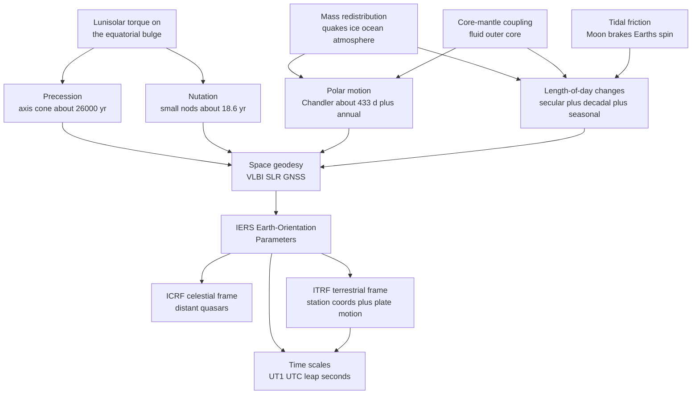

# 🌐 Earth's Rotation and Reference Frames

> [!abstract] TL;DR
> The Earth is a giant, imperfect, deformable spinning top, and no part of it holds still: the spin **axis** traces a ~26,000-year cone in the sky (**precession**) with small superimposed nods (**nutation**, principal term 18.6 yr); the pole **wanders across the crust** by ~10 m in the ~433-day **Chandler wobble** beating against an annual term (**polar motion**); and the **spin rate itself drifts** (**length-of-day, LOD**) — slowing ~1.8 ms/century as the Moon's tides brake it, jittering seasonally as the atmosphere trades angular momentum with the solid Earth, and stepping by microseconds whenever an earthquake, ice sheet, or El Niño shifts mass. Because everything we measure (GPS, plate motion, spacecraft) is measured *against* the Earth, geodesy must track every one of these wobbles as **Earth Orientation Parameters** and pin them to two rock-solid frames — the celestial **ICRF** (quasars) and the terrestrial **ITRF** (station coordinates plus plate velocities). Earth-rotation science is the backbone that lets GPS work to millimetres.

## Intuition — analogy FIRST

Watch a figure skater spin. Pull the arms in and she speeds up — nothing pushed her, angular momentum $L = I\omega$ is simply conserved, so shrinking the moment of inertia $I$ forces $\omega$ up. Now imagine she is not rigid but slightly lopsided and made of jelly: she will *wobble*, her axis of spin drifting in a small circle relative to her body, and if you gently nudge her once a lap she can build a sustained wobble.

The Earth is exactly that skater, scaled to planetary size. Earthquakes and melting ice **redistribute its mass**, nudging its moment of inertia and its spin rate. The Moon's tides act as a **brake** on its rotation — days are imperceptibly longer than they were in the Devonian, and fossil corals faithfully record shorter ancient days and *more* days per year. Its axis, tugged by the Sun and Moon on its equatorial bulge, traces **slow cosmic circles** — which is why the "pole star" is not permanent (it was Thuban for the Egyptians, is Polaris now, and will be Vega in ~12,000 years) — plus tiny **nods** and a **~14-month wobble** of the pole across the crust. To pin GPS to millimetres, we must measure every one of these motions and define reference frames that do *not* wobble.

---

## How It Works

### Core Mechanics

1. **The spin axis is not fixed in space.** The Sun and Moon pull on the Earth's equatorial bulge; the resulting torque tries to align the bulge with the ecliptic, and because the Earth is a fast gyroscope this torque is converted into a slow conical sweep of the axis — **precession** (~26,000 yr) — with small periodic **nutations** riding on top (principal term 18.6 yr, from the regression of the Moon's orbital node).
2. **The spin axis is not fixed in the body either.** Because the Earth is oblate and not spinning about an exact principal axis, the rotation pole traces a small path across the crust — **polar motion**. This is the sum of a *free* eigenmode (the **Chandler wobble**, ~433 days) and a *forced* annual term (seasonal atmosphere/ocean mass shifts). Their close frequencies **beat** with a ~6.4-year envelope.
3. **The spin rate is not constant.** Length-of-day (**LOD**) has a *secular* increase from **tidal friction** (the Moon brakes the Earth, transferring angular momentum to the lunar orbit), *decadal* swings from **core–mantle coupling**, and *seasonal/interannual* wiggles from **atmospheric and oceanic angular-momentum exchange**. Conservation of $L = I\omega$ ties all mass motion to rotation: move mass toward the axis and the day shortens.
4. **We measure the motion, not the causes.** **VLBI** ties the Earth to distant quasars (giving precession/nutation and UT1); **SLR** and **GNSS** track the pole and the geocenter. The **IERS** combines them into **Earth Orientation Parameters** (EOPs): polar motion $x_p, y_p$; $\mathrm{UT1}-\mathrm{UTC}$; and precession/nutation offsets.
5. **We anchor everything to two frames.** The **ICRF** (celestial, quasar-defined, space-fixed) and the **ITRF** (terrestrial, station coordinates + plate-motion velocities, rotating with the crust) are connected by the EOP transformation. Positioning is impossible without both.

### Flow / Architecture



---

## Key Concepts

### Secondary Level

**The day is not a perfect clock.** The Earth spins once per day, but that "once" changes. The Moon's tides drag on the oceans and the solid Earth, slowly stealing rotational energy: the day lengthens by roughly **1.8 milliseconds per century**. Wind it back and ancient days were shorter — **fossil corals** and **tidal rhythmites** from ~400 million years ago show growth bands implying a ~22-hour day and about **400 days per year**, a stunning confirmation from biology.

**The pole star changes.** The Earth's axis does not point in a fixed direction forever. Like a slowing top, it sweeps out a slow circle over about **26,000 years** — *precession*. Polaris is our pole star today, Thuban was for the ancient Egyptians, and Vega will be in ~12,000 years. This same slow sweep is the "precession of the equinoxes," and it is one of the **Milankovitch** pacemakers of ice ages.

**Why we need frames.** To say *where* anything is, you need a grid. Earth-rotation science builds two: a fixed grid in the **sky** (built from stars and quasars so distant they never move) and a fixed grid on the **ground** (a global set of station coordinates). Because the Earth wobbles, the two grids are always turning relative to each other, and knowing that rotation precisely is what makes GPS work.

### Undergraduate Level

The variation of Earth's rotation has **four distinct components**, easily confused:

| Phenomenon | What moves | Typical period | Dominant cause |
|---|---|---|---|
| **Precession** | Axis *in space* (conical) | ~25,772 yr | Lunisolar torque on the bulge |
| **Nutation** | Axis *in space* (periodic nods) | 18.6 yr (principal) + shorter terms | Lunar orbital-node regression, etc. |
| **Polar motion** | Axis *relative to the crust* | ~433 d (Chandler) + 365 d (annual) | Free eigenmode + seasonal mass shifts |
| **Length-of-day (LOD)** | Spin *rate* | secular + decadal + seasonal | Tides, core coupling, atmosphere |

**Precession quantitatively.** The torque on the oblate figure causes the axis to precess at about $50.3''$ per year, completing a circle in **25,772 years**. The physics is the gyroscope relation $\Omega_{\text{prec}} = \tau / (I\omega)$ from [[Rotational_Dynamics]] — the same equation that keeps a spinning top from falling.

**Polar motion and the Chandler wobble.** For a *rigid* oblate Earth, free (torque-free) wobble would have the **Euler period** $T_E = A/(C-A) \approx 305$ days, where $A$ and $C$ are the equatorial and polar moments of inertia. The **observed** period is ~433 days — the **Chandler wobble** — lengthened because the Earth is *elastic and oceans respond*. This free mode is continuously excited by atmosphere/ocean mass changes and damped (quality factor $Q \sim 30$–$100$); superposed on it is the *forced* annual term, and their beat gives the characteristic ~6-to-7-year amplitude envelope.

**LOD and conservation of angular momentum.** With $L = I\omega$ conserved (external torques aside), any mass motion changes $I$ and hence $\omega$: $\Delta(\text{LOD})/\text{LOD} = \Delta I / I$. Move mass toward the axis (a big thrust earthquake, spinning ice into the sea) and the day *shortens* by microseconds; seasonal winds and El Niño swap angular momentum with the solid Earth and modulate LOD at the millisecond level.

**How it is measured.** **VLBI** (radio telescopes observing quasars) delivers the celestial frame, precession/nutation, and UT1; **SLR** (laser-ranging to satellites) fixes the geocenter, scale, and $J_2$; **GNSS/GPS** densely tracks polar motion and station coordinates. The **IERS** fuses these into the **EOP** series that every precise application consumes.

**Reference frames and time.** The **ICRF** is the celestial frame (quasar directions, essentially inertial). The **ITRF** is the terrestrial frame — a catalog of station *positions and velocities*, because plate tectonics moves stations by cm/yr. **UT1** measures the actual rotation angle of the Earth; **UTC** is atomic time kept within 0.9 s of UT1 by inserting **leap seconds**. The difference $\mathrm{DUT1} = \mathrm{UT1} - \mathrm{UTC}$ is itself an EOP.

### Graduate Level

**Free wobble as an eigenmode.** Linearising the Euler equations for a rotating, slightly triaxial Earth gives the polar-motion (Liouville) equation $\dfrac{i}{\sigma_0}\dot{\mathbf{m}} + \mathbf{m} = \boldsymbol{\chi}$, where $\mathbf{m} = m_1 + i m_2$ is the pole offset, $\boldsymbol{\chi}$ is the *excitation function* (mass + motion terms of atmospheric/oceanic angular momentum), and $\sigma_0$ is the complex **Chandler frequency**. The rigid Euler value $\sigma_E = \frac{C-A}{A}\Omega$ (period ~305 d) is modified by the **elastic Love number** $k$, ocean pole tide, and core decoupling to the observed **433-day, weakly damped** resonance. Because it is a *resonance*, the pole responds strongly to excitation near its eigenfrequency — the Chandler wobble is a **free mode**, not a forced one (contrast the annual term).

**Polar motion vs true polar wander (TPW).** Superimposed on the daily-to-decadal polar motion is a slow secular **drift of the mean pole** (~10 cm/yr, historically toward ~80°W, then a documented **reversal in the early 2000s** attributed to accelerated ice melt and continental water storage) plus much slower **TPW** — reorientation of the whole solid Earth relative to the spin axis driven by mantle convection and **GIA-driven $J_2$ change**. These tie directly to postglacial rebound and mantle viscosity.

**Core–mantle coupling and decadal LOD.** Decadal LOD swings (up to a few ms) require angular-momentum exchange with the **fluid outer core** via topographic, electromagnetic, and gravitational coupling — the same core whose motions power the geodynamo, linking rotation to geomagnetic secular variation.

**Precession–nutation theory and frame realization.** Modern practice uses the **IAU 2000/2006** precession–nutation model and the **Celestial Intermediate Origin (CIO)**-based transformation between GCRS (celestial) and ITRS (terrestrial) via the **Earth Rotation Angle** (a linear function of UT1) plus polar-motion and nutation matrices. The **ITRF** is realized as station coordinates + velocities with a **no-net-rotation** (NNR) condition to remove the datum's rotational degree of freedom; its origin is the geocenter (from SLR), its scale from SLR/VLBI. **Time** is a hierarchy: **TAI** (atomic), **UT1** (rotation), and **UTC = TAI − (leap seconds)**; the leap second is scheduled for retirement (a much larger tolerance) around 2035, after which $\mathrm{UT1}-\mathrm{UTC}$ will be allowed to grow.

---

## Python Demo

```python
# Earth's rotational dynamics, numpy + matplotlib only (no scipy).
#   (a) POLAR MOTION: superpose the free Chandler wobble (~433 d) and the
#       forced annual term (~365.25 d). Their close frequencies BEAT, giving
#       the classic ~6.4-year amplitude envelope, and the pole traces a spiral.
#   (b) LENGTH-OF-DAY: conservation of angular momentum (I*omega = const) turns
#       mass redistribution into spin-rate change -> a quake shortens the day by
#       microseconds; tidal friction (secular) makes ancient days shorter, which
#       fossil corals record as MORE days per year.
import numpy as np
import matplotlib.pyplot as plt

# ---------------------------------------------------------------
# (a) POLAR MOTION = Chandler (free) + annual (forced), in arcseconds.
#     1 arcsec on Earth's surface ~ 31 m along the pole path.
# ---------------------------------------------------------------
T_ch, T_an = 433.0, 365.25            # periods in days
A_ch, A_an = 0.16, 0.09               # amplitudes in arcsec (representative)
days = np.arange(0.0, 12*365.25, 1.0) # ~12 years, daily samples
yr = days / 365.25

# complex pole position p = x_p + i*y_p (both terms circular, prograde)
p = A_ch*np.exp(2j*np.pi*days/T_ch) + A_an*np.exp(2j*np.pi*days/T_an)
xp, yp = p.real, p.imag
env = np.abs(p)                       # instantaneous amplitude (beat envelope)

# beat period from the difference of the two frequencies
f_beat = abs(1.0/T_an - 1.0/T_ch)     # cycles per day
T_beat_yr = (1.0/f_beat) / 365.25
print(f"Chandler {T_ch:.0f} d + annual {T_an:.2f} d  ->  beat period ~ {T_beat_yr:.2f} yr")
print(f"Pole path amplitude ranges {env.min():.3f} to {env.max():.3f} arcsec "
      f"(~{31*env.min():.1f} to {31*env.max():.1f} m at the pole)")

# ---------------------------------------------------------------
# (b1) LOD nudge from a single mass-redistribution event (I*omega conserved).
#      d(LOD)/LOD = dI/I ; a great thrust quake decreases I slightly.
# ---------------------------------------------------------------
LOD = 86400.0                          # seconds in a mean solar day
dI_over_I = -2.0e-11                    # fractional inertia drop (Tohoku-scale)
dLOD = LOD * dI_over_I                  # seconds
print(f"\nQuake: fractional dI/I = {dI_over_I:.1e} -> dLOD = {dLOD*1e6:+.2f} microseconds/day")

# ---------------------------------------------------------------
# (b2) SECULAR tidal slowdown: ~2.3 ms/century lengthening. Extrapolate the
#      day length and days-per-year back through geologic time (linear model;
#      the true rate varied, so treat as illustrative).
# ---------------------------------------------------------------
rate_ms_per_century = 2.3
rate_s_per_yr = rate_ms_per_century * 1e-3 / 100.0     # s of LOD gained per year
Ma = np.linspace(0, 600, 601)                          # million years before present
day_hours = (86400.0 - rate_s_per_yr * (Ma*1e6)) / 3600.0
days_per_year = 365.25 * 24.0 / day_hours              # year length ~ fixed
i400 = np.argmin(np.abs(Ma - 400))
print(f"Linear tidal model at 400 Ma: day ~ {day_hours[i400]:.1f} h, "
      f"year ~ {days_per_year[i400]:.0f} days (Devonian corals: ~400 bands/yr)")

# ---------------------------------------------------------------
# Plot: (1) polar-motion spiral, (2) beat envelope, (3) ancient day length
# ---------------------------------------------------------------
fig, (ax1, ax2, ax3) = plt.subplots(1, 3, figsize=(15, 4.6))

sc = ax1.scatter(xp, yp, c=yr, cmap="viridis", s=4)
ax1.set_aspect("equal"); ax1.set_title("Polar motion spiral\n(Chandler + annual)")
ax1.set_xlabel("x_p (arcsec, toward Greenwich)")
ax1.set_ylabel("y_p (arcsec, toward 90 W)")
ax1.grid(alpha=0.3); fig.colorbar(sc, ax=ax1, label="years")

ax2.plot(yr, env, color="#2563eb", lw=1.5, label="amplitude |p|")
ax2.plot(yr,  xp, color="#dc2626", lw=0.6, alpha=0.7, label="x_p")
ax2.axhline(A_ch+A_an, ls="--", color="k", lw=0.8)
ax2.axhline(abs(A_ch-A_an), ls="--", color="k", lw=0.8)
ax2.set_title(f"Beat envelope (~{T_beat_yr:.1f} yr)")
ax2.set_xlabel("years"); ax2.set_ylabel("arcsec"); ax2.legend(loc="upper right"); ax2.grid(alpha=0.3)

ax3.plot(Ma, day_hours, color="#059669", lw=2)
ax3.scatter([400], [day_hours[i400]], color="#dc2626", zorder=5)
ax3.annotate(f"~{day_hours[i400]:.1f} h day\n~{days_per_year[i400]:.0f} days/yr",
             xy=(400, day_hours[i400]), xytext=(150, 22.6),
             arrowprops=dict(arrowstyle="->"))
ax3.invert_xaxis()
ax3.set_title("Tidal slowdown: ancient day length")
ax3.set_xlabel("Million years before present"); ax3.set_ylabel("Day length (hours)")
ax3.grid(alpha=0.3)

plt.tight_layout()
plt.savefig("earth_rotation_demo.png", dpi=120)
print("\nSaved figure to earth_rotation_demo.png")
```

Running it prints a **~6.4-year beat**, an amplitude that swells and collapses between $|A_{ch}+A_{an}|$ and $|A_{ch}-A_{an}|$, a Tohoku-scale quake trimming the day by roughly a microsecond, and a linear tidal extrapolation giving a ~22-hour Devonian day with ~400 days per year — the number fossil corals actually preserve. The scatter plot is the looping **polar-motion spiral** the rotation pole physically traces across the crust.

---

## Real-World Applications

> **Example — GPS cannot work without the EOPs.** A GPS satellite's orbit is computed in a quasi-inertial celestial frame, but you want your position on the *ground*. Converting between them requires the full Earth-orientation transformation — precession, nutation, the Earth Rotation Angle from **UT1**, and **polar motion** $x_p, y_p$. A 1-millisecond error in UT1 alone smears position by ~0.46 m at the equator, so the IERS EOP series is a hard dependency for every GNSS receiver on Earth.

- **Crustal-deformation geodesy.** Measuring plate motion, interseismic strain, and fault slip requires expressing station coordinates in a stable **ITRF** — which must itself be *maintained* against the very plate motion being measured (each station carries a velocity).
- **Deep-space navigation.** Spacecraft ranging and VLBI tracking are tied to **ICRF** quasars; without a space-fixed celestial frame there is nothing steady to navigate against.
- **Climate and geophysical monitoring.** Polar motion and LOD are *integrators of angular momentum*: the seasonal and El Niño LOD signals track atmospheric winds, and the drift of the pole now measurably reflects **ice-sheet melt and continental water storage** — Earth rotation as a global mass-budget sensor.
- **Astronomy and calendars.** Precession is why the **tropical year** (equinox to equinox) differs from the **sidereal year**, and why telescope pointing and star catalogs must be epoch-corrected.
- **Timekeeping infrastructure.** UTC, leap seconds, and $\mathrm{DUT1}$ underpin network time, financial timestamping, and any system that must reconcile atomic clocks with the turning Earth.

---

## Common Pitfalls

- **Conflating the four motions.** *Precession* and *nutation* move the axis **in space** (sky-fixed); *polar motion* moves the axis **relative to the crust** (Earth-fixed); *LOD* changes the **spin rate**, not the axis at all. Different geometry, different periods (26,000 yr vs 18.6 yr vs 433 d vs ms-to-decades), different causes. Mixing them is the classic beginner error.
- **ICRF vs ITRF.** The **ICRF** is celestial and essentially inertial (quasars); the **ITRF** rotates with the crust (station coordinates). Reporting a satellite position without stating which frame — or forgetting the EOP transformation between them — silently injects metre-to-kilometre errors.
- **UT1 vs UTC (and leap seconds).** **UT1** is the true rotation angle of the Earth; **UTC** is atomic time with leap seconds inserted to stay within 0.9 s of UT1. Using UTC where UT1 is required (or ignoring $\mathrm{DUT1}$) breaks precise pointing and positioning.
- **Thinking the Chandler wobble is forced.** The Chandler wobble is a **free eigenmode** (a resonance) of the oblate, elastic Earth — it is *excited and damped* by atmosphere/ocean but oscillates at the body's own frequency. Only the **annual** term is externally forced. Treating Chandler as a driven response gets both its period and its physics wrong.
- **Rigid vs elastic Chandler period.** A rigid Earth would wobble with the **305-day** Euler period; the observed **433 days** requires the Earth's elasticity and ocean pole tide. Quoting the rigid figure for the real Earth is a common slip.
- **Assuming a frame is permanent.** Plate tectonics moves ITRF stations by centimetres per year, so an ITRF datum is only exact **at its reference epoch** and must be continuously re-realized. A "fixed" coordinate that ignores station velocity drifts out of tolerance within a year.

---

## Related Concepts

- **Sibling notes** (this Geophysics section, prose only) — *Earths_Gravity_Field_and_Geodesy* supplies the oblate figure, $J_2$, and geocenter that rotation theory rests on; *Space_Geodesy_GPS_and_Crustal_Deformation* is the applied twin that consumes the EOPs and ITRF built here; *Postglacial_Rebound_and_Mantle_Viscosity* drives the secular $J_2$ change, true polar wander, and pole drift; *Geomagnetism_and_the_Geodynamo* shares the fluid outer core responsible for decadal LOD via core–mantle coupling.
- [[Rotational_Dynamics]] — the torque, angular momentum, inertia tensor, and Euler equations that *are* the physics of precession, wobble, and LOD
- [[Oscillations_and_SHM]] — the damped/driven-oscillator picture behind the Chandler resonance and its beat with the annual term
- [[The_Celestial_Sphere_and_Coordinates]] — equatorial coordinates, the equinox, and the celestial reference the ICRF formalizes
- [[Orbital_Mechanics_and_Celestial_Dynamics]] — the lunisolar orbits whose torque drives precession/nutation and whose angular momentum absorbs the tidal braking
- [[Tides_and_Tidal_Dynamics]] — the tidal friction that secularly lengthens the day and recedes the Moon
- [[Geophysics_of_Plate_Tectonics]] — the plate motion that forces continual maintenance of the terrestrial reference frame
- [[Eigenvalues_and_Eigenvectors]] — principal moments of inertia and the Chandler mode as an eigenvalue problem of the rotating Earth
- [[Systems_of_ODEs]] — the coupled Euler/Liouville equations integrated to model polar motion
- [[Paleoclimatology_and_Ice_Cores]] — where precession joins obliquity and eccentricity as a **Milankovitch** pacemaker of ice ages
- [[Coriolis_Effect_and_Geostrophic_Balance]] — the rotating-frame dynamics whose atmospheric angular-momentum swings modulate LOD seasonally

---

## Review Questions

1. **Secondary:** Fossil corals ~400 million years old show about 400 daily growth bands per year, yet today there are ~365 days per year. Explain, using the idea of the Moon "braking" the Earth, why ancient days were shorter and there were more of them — and why this does *not* mean the year itself changed much.
2. **Undergraduate:** Distinguish precession, nutation, polar motion, and LOD by (a) *what* moves, (b) the *frame* in which the motion is defined (space-fixed vs Earth-fixed), and (c) the *cause*. Then explain why the free polar-motion period is ~433 days (Chandler) rather than the rigid-Earth Euler value of ~305 days.
3. **Graduate:** The Chandler wobble is a weakly damped free eigenmode yet it has persisted for over a century. (a) Write the Liouville equation and identify the excitation function and the complex Chandler frequency. (b) Explain how atmospheric/oceanic angular momentum can both *excite* and *damp* the mode, and what its quality factor $Q$ implies. (c) Contrast this free mode with the *forced* annual term, and describe how their beat produces the ~6.4-year envelope you would extract by spectral analysis of the observed pole path.

---

## Sources

- Lambeck, K. — *The Earth's Variable Rotation: Geophysical Causes and Consequences* (Cambridge, 1980)
- Munk, W. H. & MacDonald, G. J. F. — *The Rotation of the Earth: A Geophysical Discussion* (Cambridge, 1960)
- Stacey, F. D. & Davis, P. M. — *Physics of the Earth*, 4th ed. (Cambridge, 2008), rotation and figure of the Earth
- Petit, G. & Luzum, B. (eds.) — *IERS Conventions (2010)*, IERS Technical Note 36 (EOP, ICRF/ITRF, precession–nutation, time scales)
- Gross, R. S. — "Earth Rotation Variations — Long Period," in *Treatise on Geophysics*, 2nd ed. (Elsevier, 2015)

---

#geophysics #earth-rotation #polar-motion #reference-frames #geodesy
