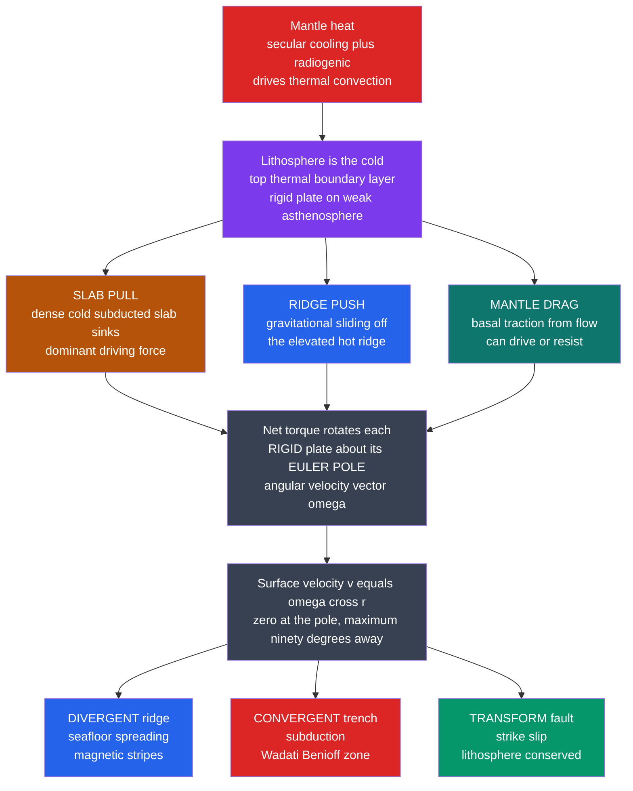

# 🌐 Geophysics of Plate Tectonics

> [!abstract] TL;DR
> Plate tectonics becomes *quantitative* the moment you accept one radical simplification: Earth's cold outer shell — the **lithosphere**, not the crust — behaves as a set of about a dozen **rigid plates** riding on the weak asthenosphere. Rigidity plus a sphere forces the geometry to be simple. By **Euler's theorem**, every plate's motion is a **rotation about an axis through Earth's centre** that pierces the surface at an **Euler pole**; surface velocity is $\mathbf{v}=\boldsymbol{\omega}\times\mathbf{r}$, which is *zero at the pole* and *maximal 90° away* — the very pattern used to read plate speeds off spreading rates, transform-fault azimuths, and earthquake slip vectors. The forces are a torque balance: **slab pull** (the dense sinking slab, dominant), **ridge push** (gravitational sliding off elevated ridges), and **mantle drag** (which may drive *or* resist). This note is the geophysical, force-and-kinematics treatment; the descriptive geology lives in [[Plate_Boundaries_and_Plate_Motions]] and its siblings.

---

## Intuition

**Analogy:** Earth's rigid outer shell is cracked into a dozen giant plates that drift about as fast as your fingernails grow — a few centimetres a year. It sounds trivially slow, yet over millions of years it opens oceans, raises the Himalayas, and triggers every great earthquake. The revolutionary insight of plate tectonics was that these plates move as **rigid** pieces on a sphere, so their motions obey elegant geometry: every plate's drift is a **rotation about a pole**, and the whole restless surface becomes a solvable puzzle of spinning caps.

Stick a pin through a peeled-egg fragment and swing it: points near the pin barely move, points on the far side sweep fastest. That pin is the **Euler pole** — a rotation axis, not a place the plate is heading toward. Once you see plate motion as a rotation, plate tectonics stops being a story about drifting continents and becomes **rigid-body kinematics on a sphere** — vectors, cross products, and torque balance. That shift from narrative to arithmetic is what made plate tectonics a predictive geophysical theory rather than a hypothesis.

---

## How It Works

### Core Mechanics

1. **The plate is the lithosphere, defined thermally.** The lithosphere is the cold, strong **top thermal boundary layer** of the convecting mantle — crust *plus* the rigid uppermost mantle, roughly 100 km thick. Its base is an isotherm (~1300 °C), *not* the Moho. Below it the hot, weak **asthenosphere** deforms easily and lets plates slide.
2. **Rigidity + sphere ⇒ Euler rotation.** A rigid cap moving on a sphere cannot translate in a straight line. **Euler's theorem** says the motion is equivalent to a rotation about a single axis through the centre. Encode it as an **angular-velocity vector** $\boldsymbol{\omega}$ pointing along that axis; the surface velocity at position $\mathbf{r}$ is $\mathbf{v}=\boldsymbol{\omega}\times\mathbf{r}$, with magnitude $|\mathbf{v}|=\omega R\sin\theta$ where $\theta$ is the angular distance from the Euler pole.
3. **Motions add as vectors.** Relative rotations compose: $\boldsymbol{\omega}_{A/C}=\boldsymbol{\omega}_{A/B}+\boldsymbol{\omega}_{B/C}$, and around any closed circuit of plates $\sum_i\boldsymbol{\omega}_i=0$. This **plate-circuit closure** is what lets global models solve every plate pair at once.
4. **Boundaries are where the action is.** Three kinds: **divergent** ridges (new lithosphere, seafloor spreading, magnetic stripes), **convergent** trenches (subduction, deep Wadati–Benioff earthquake zones), and **transform** faults (strike-slip, lithosphere conserved). Three boundaries meet at **triple junctions**.
5. **Speed is set by a torque balance, not chosen freely.** Sum of torques about Earth's centre vanishes: slab pull + ridge push + mantle drag + boundary friction $=0$. Because drag depends on the plate's own velocity, this is a self-consistent equation for $\boldsymbol{\omega}$. Empirically, **slab pull dominates** — the single best predictor of a plate's speed is the fraction of its boundary that is a subducting trench.

### Flow / Architecture



---

## Key Concepts

### Secondary Level

**Plates are pieces of the outer shell.** About seven major plates (Pacific, North American, South American, Eurasian, African, Indo-Australian, Antarctic) plus several minor ones (Nazca, Cocos, Philippine Sea, Arabian, Caribbean, Juan de Fuca, Scotia…) tile the surface. A plate is **not** a continent — the Pacific plate is almost all ocean floor, while the North American plate carries a continent *and* half an ocean.

**Three boundary types**, distinguished by relative motion and by what happens to lithosphere:

| Boundary | Relative motion | Lithosphere | Earthquakes | Example |
|----------|-----------------|-------------|-------------|---------|
| **Divergent** | apart | created | shallow, small | Mid-Atlantic Ridge |
| **Convergent** | together | destroyed / crumpled | shallow to ~700 km | Andes; Mariana; Himalaya |
| **Transform** | slide past | conserved | shallow strike-slip | San Andreas |

**How fast, and why we care.** A few centimetres a year — imperceptible in a lifetime, but it opens whole oceans over tens of millions of years and stores the elastic strain released as great earthquakes.

### Undergraduate Level

**Euler's theorem, made concrete.** Any rigid displacement of a plate on the sphere is a rotation about an axis through the centre. The axis meets the surface at the **Euler pole** (a geometric point — the plate does *not* physically pivot there and is not moving toward it). With angular-velocity vector $\boldsymbol{\omega}$ along the axis,

$$\mathbf{v}=\boldsymbol{\omega}\times\mathbf{r},\qquad |\mathbf{v}|=\omega R\sin\theta.$$

Velocity is **zero at the pole** and **maximal on the great circle 90° away** — identical kinematics to rigid-body rotation in [[Rotational_Dynamics]], just wrapped on a sphere.

**How the vectors are measured.** Three independent observables constrain a relative rotation $\boldsymbol{\omega}_{A/B}$:
- **Spreading rates** at ridges (from magnetic-anomaly widths) fix the *magnitude* of $|\mathbf{v}|$ along the boundary — this pins $\omega\sin\theta$.
- **Transform-fault azimuths** are *parallel to the local velocity*, so they lie on small circles about the Euler pole — this pins the pole's *location*.
- **Earthquake slip vectors** at boundaries give the *direction* of relative motion, an independent check.

**Relative vs absolute motion.** Motion is only ever defined relative to something. **Relative motion** (plate A w.r.t. plate B) is what a boundary feels and what we measure directly. **Absolute motion** needs a mantle-fixed frame — usually the **hotspot reference frame**, since deep-sourced hotspots drift only slowly (see [[Mantle_Convection_and_Hotspots]]). The Hawaiian–Emperor bend is absolute motion written on the seafloor.

**The confirmation of the theory.** Two 1960s predictions clinched plate tectonics: **Vine–Matthews–Morley** showed that symmetric **magnetic stripes** flanking ridges record geomagnetic reversals frozen into spreading crust (linking to the paleomagnetic record), and **J. Tuzo Wilson** predicted the peculiar slip sense of **transform faults** — later confirmed by first-motion earthquake studies. Both are direct tests of rigid-plate kinematics.

**The driving forces.**

| Force | Origin | Role |
|-------|--------|------|
| **Slab pull** | dense, cold subducted slab sinks and pulls the plate | **dominant** |
| **Ridge push** | gravitational sliding off the hot, elevated ridge flank | secondary, ~1/10 of slab pull |
| **Mantle drag** | basal shear coupling to asthenosphere flow | drives *or* resists |

### Graduate Level

**Global inversions and circuit closure.** Models such as **NUVEL-1A** and **MORVEL** invert hundreds of spreading rates, transform azimuths, and slip vectors simultaneously under the constraint $\sum_i\boldsymbol{\omega}_i=0$ around every plate circuit, solving least-squares for all pairwise rotations. **GPS/GNSS** geodesy now supplies present-day rotations directly to sub-mm/yr precision (GEODVEL, NNR-MORVEL).

**The no-net-rotation (NNR) frame.** To define absolute motion without hotspots, require the whole lithosphere to carry no net angular momentum:

$$\int_S \mathbf{r}\times\mathbf{v}\,dS = 0.$$

This picks a unique frame (NNR-MORVEL). It differs from the hotspot frame by a slow net **westward drift** of the lithosphere over the mantle — a clue to deep coupling.

**Force balance and why slab pull wins.** A plate's steady rotation satisfies a **torque balance** about Earth's centre:

$$\boldsymbol{\tau}_{\text{slab pull}} + \boldsymbol{\tau}_{\text{ridge push}} + \boldsymbol{\tau}_{\text{drag}}(\boldsymbol{\omega}) + \boldsymbol{\tau}_{\text{friction}} = 0.$$

Order-of-magnitude line forces per unit boundary length: slab pull $F_{SP}\sim 2\text{–}5\times10^{13}\,\mathrm{N/m}$ versus ridge push $F_{RP}\sim 2\text{–}3\times10^{12}\,\mathrm{N/m}$ — an order of magnitude apart. Slab pull scales with slab length and age (older = colder = denser, $\Delta\rho\propto$ thermal contraction), so old, fast-subducting margins move fastest. **Forsyth & Uyeda (1975)** showed the decisive empirical fact: plate speed correlates strongly with the fraction of the boundary attached to a downgoing slab, and *not* with plate area — direct evidence that **slab pull dominates and basal drag mostly resists**.

**Plates as the boundary layer of mantle convection.** The deepest reframing: plates are not passengers on convection cells — they *are* the top thermal boundary layer of mantle convection, and subducting slabs are the cold downwellings. This unifies kinematics (this note) with the dynamics developed in the sibling notes on *Mantle_Convection_and_Dynamics* and *Rheology_and_Deformation_of_the_Earth*, with the elastic strain release treated in *Earthquake_Source_and_Focal_Mechanisms*, and with the vertical adjustments in *Isostasy_and_Lithospheric_Flexure*. The magnetic-stripe timescale that dates it all is the subject of *Paleomagnetism_and_the_Magnetic_Record*.

---

## Python Demo

```python
# Geophysics of plate tectonics: kinematics on a sphere + the driving-force balance.
#
# (a) EULER-POLE ROTATION. A plate's motion is a rotation about an Euler pole
#     (angular-velocity vector omega). Compute the surface velocity v = omega x r
#     at points spread along a boundary and show it is ZERO at the pole and
#     MAXIMUM 90 degrees away -> |v| = omega * R * sin(theta). This sin(theta)
#     fingerprint is exactly how plate motions are recovered from spreading rates.
#
# (b) FORCE BALANCE. Model each plate's driving force as dominated by SLAB PULL
#     (proportional to the fraction of its boundary that is a subducting trench)
#     against a linear basal DRAG (proportional to speed). Steady state gives
#     v ~ (slab-pull term)/drag, so the fastest plates are the ones with the most
#     subduction -- the Forsyth & Uyeda (1975) result. Ridge push is ~10x weaker.
import numpy as np
import matplotlib.pyplot as plt

R = 6371.0  # mean Earth radius, km.  Handy unit fact: 1 km/Myr == 1 mm/yr.

# ------------------------------------------------------------------
# (a) Euler-pole velocity pattern:  v = omega x r
# ------------------------------------------------------------------
def lonlat_to_xyz(lon_deg, lat_deg, radius=1.0):
    lon, lat = np.radians(lon_deg), np.radians(lat_deg)
    return radius * np.array([np.cos(lat) * np.cos(lon),
                              np.cos(lat) * np.sin(lon),
                              np.sin(lat)])

pole_lon, pole_lat = 0.0, 90.0     # put the Euler pole at the geographic north pole
omega_deg_per_Myr  = 0.80          # angular speed (deg/Myr)
omega_hat = lonlat_to_xyz(pole_lon, pole_lat, 1.0)
omega_vec = np.radians(omega_deg_per_Myr) * omega_hat        # rad/Myr

# Sample points along a meridian: angular distance theta from the pole = 0..180 deg
theta = np.linspace(0, 180, 181)                              # deg from Euler pole
lat_pts = 90.0 - theta                                        # since pole is at 90N
speed_cross = np.empty_like(theta)
for i, la in enumerate(lat_pts):
    r_vec = lonlat_to_xyz(0.0, la, R)                         # km
    v_vec = np.cross(omega_vec, r_vec)                        # km/Myr == mm/yr
    speed_cross[i] = np.linalg.norm(v_vec)

speed_analytic = np.radians(omega_deg_per_Myr) * R * np.sin(np.radians(theta))
i_max = int(np.argmax(speed_cross))
print("(a) Euler-pole velocity pattern")
print(f"    |v| at the pole (theta=0)   : {speed_cross[0]:6.1f} mm/yr  (should be ~0)")
print(f"    |v| max at theta = {theta[i_max]:.0f} deg   : {speed_cross[i_max]:6.1f} mm/yr")
print(f"    cross-product vs omega*R*sin(theta) agree: "
      f"{np.allclose(speed_cross, speed_analytic, atol=1e-6)}")

# ------------------------------------------------------------------
# (b) Slab-pull force balance  ->  fastest plates subduct the most.
#     Illustrative representative values (after Forsyth & Uyeda 1975):
#     f_trench = fraction of a plate's boundary that is a subducting trench.
# ------------------------------------------------------------------
plates   = ["Cocos","Nazca","Pacific","Philippine","Indian","Arabian",
            "Caribbean","African","S.American","Antarctic","N.American","Eurasian"]
f_trench = np.array([0.90,0.55,0.45,0.50,0.40,0.30,
                     0.10,0.02,0.05,0.03,0.05,0.01])           # slab-pull proxy
v_obs    = np.array([86.0,76.0,80.0,64.0,61.0,42.0,
                     24.0,21.0,13.0,17.0,11.0, 7.0])           # mm/yr, absolute

# Simple model: driving force ~ slab pull ~ k * f_trench ; drag ~ c * v ;
# steady state v = (k/c) * f_trench.  Fit the proportionality by least squares.
slope = np.sum(f_trench * v_obs) / np.sum(f_trench**2)         # through the origin
v_model = slope * f_trench
# Correlation of speed with subduction fraction:
corr = np.corrcoef(f_trench, v_obs)[0, 1]
print("\n(b) Driving-force balance")
print(f"    speed vs trench-fraction correlation r = {corr:.2f}  (slab pull dominates)")

# Order-of-magnitude line forces (N per metre of boundary length):
g, dT, alpha, rho_m = 9.81, 600.0, 3e-5, 3300.0
h_slab, L_slab = 100e3, 600e3           # slab thickness and sinking length (m)
d_thermal      = 100e3                  # thermal boundary-layer / plate thickness (m)
F_slab_pull = g * (rho_m * alpha * dT) * h_slab * L_slab       # ~ negative buoyancy
F_ridge_push = 0.5 * g * rho_m * alpha * dT * d_thermal**2     # elevated-ridge push
print(f"    slab pull  ~ {F_slab_pull:.1e} N/m")
print(f"    ridge push ~ {F_ridge_push:.1e} N/m")
print(f"    slab pull / ridge push ~ {F_slab_pull/F_ridge_push:.0f}x")

# ------------------------------------------------------------------
# Plots
# ------------------------------------------------------------------
fig, (axL, axR) = plt.subplots(1, 2, figsize=(13, 5.2))

axL.plot(theta, speed_analytic, color="navy", lw=2, label=r"$\omega R\,\sin\theta$")
axL.scatter(theta[::12], speed_cross[::12], color="crimson", zorder=5,
            label=r"$|\,\boldsymbol{\omega}\times\mathbf{r}\,|$ (numeric)")
axL.axvline(0,   color="gray", ls=":", lw=1)
axL.axvline(90,  color="green", ls="--", lw=1)
axL.text(3, 4, "zero at\nEuler pole", color="dimgray", fontsize=9)
axL.text(92, speed_cross[i_max]*0.55, "maximum\n90 deg away", color="green", fontsize=9)
axL.set_xlabel("Angular distance from Euler pole,  theta (deg)")
axL.set_ylabel("Surface speed  |v|  (mm/yr)")
axL.set_title("(a) Plate velocity is a rotation:  v = omega x r")
axL.set_xlim(0, 180); axL.legend(loc="upper right", fontsize=9)

order = np.argsort(f_trench)
axR.plot(f_trench[order], v_model[order], color="navy", lw=2,
         label="slab-pull model  v = k * f_trench")
axR.scatter(f_trench, v_obs, color="crimson", zorder=5, label="observed plates")
for name, x, y in zip(plates, f_trench, v_obs):
    axR.annotate(name, (x, y), fontsize=7, xytext=(4, 3),
                 textcoords="offset points")
axR.set_xlabel("Fraction of boundary that is a subducting trench")
axR.set_ylabel("Plate speed  (mm/yr)")
axR.set_title(f"(b) Slab pull dominates:  faster = more subduction  (r={corr:.2f})")
axR.legend(loc="upper left", fontsize=9)

plt.tight_layout()
plt.show()
```

Running this confirms both pillars. Panel (a): the numeric $|\boldsymbol{\omega}\times\mathbf{r}|$ lands exactly on the analytic $\omega R\sin\theta$ curve — **zero at the Euler pole, maximal 90° away** — the signature geometry used to locate poles and read plate rates. Panel (b): plate speed climbs steeply with the fraction of boundary that is a subducting trench (correlation $r\approx0.95$), while the printed force estimates show **slab pull outweighing ridge push roughly tenfold** — the quantitative case that slab pull is the dominant driving force.

---

## Real-World Applications

> **Example — reading the Pacific plate off the seafloor:** The Pacific plate's motion is encoded three independent ways that must all agree on one Euler pole — the *width* of magnetic stripes on the East Pacific Rise (spreading rate ≈ $\omega R\sin\theta$), the *azimuths* of the great Pacific transform faults (small circles about the pole), and the *slip vectors* of subduction earthquakes around its rim. Global models (MORVEL) fit a single rotation to all three, and GNSS then checks it in real time. This is Euler-pole kinematics working as an operational tool, not a textbook abstraction.

- **Earthquake and tsunami hazard.** The plate-convergence rate at a trench sets the rate at which elastic strain accumulates on a locked megathrust; multiplied by recurrence time it bounds the maximum slip — and hence magnitude — of the next great subduction earthquake (Tohoku 2011, Cascadia).
- **Plate reconstructions.** Rewinding finite Euler rotations restores past continental configurations, guides **hydrocarbon and mineral exploration** on conjugate margins, and reconstructs paleoclimate boundary conditions (ocean gateways, mountain uplift).
- **Geodetic reference frames.** ITRF/GNSS positioning must remove rigid-plate rotation to expose the residual strain that signals fault loading, volcanic inflation, and glacial rebound.
- **Planetary comparison.** Earth is the *only* body with active plate tectonics; Venus and Mars show a stagnant single-plate ("stagnant-lid") regime. The slab-pull argument explains why — without dense, subductable oceanic lithosphere, the dominant driving force is absent.

---

## Common Pitfalls

- **"Plates are the crust."** They are the **lithosphere** — crust *plus* the rigid uppermost mantle down to the ~1300 °C isotherm (~100 km). The base of a plate is a thermal boundary, not the Moho. Continental crust can be far thinner than the plate it rides on.
- **Taking rigidity as literal.** The rigid-plate model is an *approximation* — excellent for ocean interiors, but plate boundaries are broad, deforming zones (the whole western US, the India–Asia collision), and even plate interiors strain slightly. Rigidity is the assumption that makes the kinematics solvable, not a claim that plates never deform.
- **Thinking the Euler pole is a place on the plate.** The Euler pole is where the *rotation axis* pierces the surface — a geometric point that may lie entirely off the plate. The plate is **not** pivoting there and is **not** moving toward it; velocity is simply *zero* there and grows as $\sin\theta$.
- **"Ridges push plates apart from behind."** Rising magma passively fills the gap opened by plates that are mostly being **pulled** by their sinking slabs. Ridge push is a real but secondary gravitational assist (~1/10 of slab pull); it does not shove plates like a conveyor belt.
- **Assuming mantle drag always drives.** Basal traction can drive *or* resist depending on whether asthenosphere flow is faster or slower than the plate. For most fast plates it mainly **resists**; only where deep flow outpaces the plate does it help drive.
- **Confusing absolute and relative motion.** A velocity is meaningless without a frame. Boundary measurements give *relative* motion; "absolute" motion requires a mantle-fixed frame (hotspot or NNR), and the two frames disagree by the lithosphere's net westward drift. Always state the frame.
- **Half-rate vs full-rate.** One ridge flank's magnetic anomalies give the *half*-spreading rate; the plate-separation rate is twice that. Mixing them halves or doubles every downstream number.

---

## Related Concepts

- [[Plate_Boundaries_and_Plate_Motions]] (Earth Science) — the descriptive companion: boundary types, triple junctions, and the same Euler-pole idea at a geology level. Read as a pair with this geophysical treatment.
- [[Seafloor_Spreading_and_Ocean_Basins]] (Earth Science) — the divergent process whose magnetic anomalies *measure* the spreading component of $\boldsymbol{\omega}$.
- [[Subduction_Zones_and_Mountain_Building]] (Earth Science) — where slab pull is generated and the deep Wadati–Benioff earthquakes trace the sinking plate.
- [[Mantle_Convection_and_Hotspots]] (Earth Science) — the convective engine beneath the plates and the hotspot frame that defines *absolute* motion.
- [[Continental_Drift_and_the_Plate_Tectonics_Revolution]] (Earth Science) — the historical path from Wegener's drift to the rigid-plate synthesis quantified here.
- [[Wilson_Cycle_and_Supercontinents]] (Earth Science) — how boundaries are born and die as ocean basins open and close over geologic time.
- [[The_Deep_Structure_of_the_Earth]] (Geophysics) — the lithosphere/asthenosphere contrast (and its seismic low-velocity zone) that makes rigid plates possible.
- [[Earthquake_Seismology_Fundamentals]] (Geophysics) — slip vectors and focal mechanisms that supply the boundary-motion directions feeding plate models.
- [[Terrestrial_Heat_Flow_and_Thermal_Evolution]] (Geophysics) — the cooling that thickens the lithosphere with age and sets slab density (hence slab pull).
- [[Geomagnetism_and_the_Geodynamo]] (Geophysics) — reversals of this field are the magnetic stripes that date and rate seafloor spreading.
- [[Elasticity_and_Seismic_Wave_Theory]] (Geophysics) — the elastic strength that lets the lithosphere behave as a rigid plate and store earthquake strain.
- [[Earths_Gravity_Field_and_Geodesy]] (Geophysics) — GNSS geodesy that now measures plate rotations directly to sub-mm/yr.
- [[Rotational_Dynamics]] (Physics) — the angular-velocity and $\mathbf{v}=\boldsymbol{\omega}\times\mathbf{r}$ rigid-body kinematics underlying Euler poles.
- [[Newtons_Laws_and_Kinematics]] (Physics) — the force and torque balance that fixes each plate's steady velocity.
- [[Vectors_and_3D_Geometry]] (Mathematics) — the cross product, spherical points, and small/great circles behind Euler-pole geometry.
- [[Vectors_and_Vector_Spaces]] (Mathematics) — vector addition of angular velocities and the least-squares structure of global plate inversions.

---

## Review Questions

1. **Secondary:** Why is it more accurate to say plates are made of *lithosphere* than of *crust*? Name the three boundary types and state, for each, whether lithosphere is created, destroyed, or conserved.
2. **Undergraduate:** A plate rotates about an Euler pole with $\omega=0.8°/\text{Myr}$. Using $|\mathbf{v}|=\omega R\sin\theta$ with $R=6371$ km, compute the surface speed (mm/yr) at $\theta=30°$ and $\theta=90°$. Explain why a transform fault's *azimuth* constrains the *location* of the Euler pole while a spreading *rate* constrains $\omega\sin\theta$.
3. **Graduate:** Forsyth & Uyeda found plate speed correlates with the fraction of boundary that is a subducting trench but *not* with plate area. Explain quantitatively why this argues that slab pull dominates and basal drag mostly resists, and contrast the hotspot and no-net-rotation frames — what does each assume, and why do their "absolute" velocities differ?

---

## Sources

- Turcotte, D. L. & Schubert, G. (2014) — *Geodynamics*, 3rd ed. (Cambridge University Press) — plate kinematics, driving forces, thermal boundary layer.
- Cox, A. & Hart, R. B. (1986) — *Plate Tectonics: How It Works* (Blackwell) — Euler-pole geometry and worked kinematics problems.
- Fowler, C. M. R. (2005) — *The Solid Earth: An Introduction to Global Geophysics*, 2nd ed. (Cambridge University Press), Ch. 2.
- Forsyth, D. & Uyeda, S. (1975) — "On the relative importance of the driving forces of plate motion," *Geophys. J. R. Astron. Soc.* 43, 163–200.
- DeMets, C., Gordon, R. G. & Argus, D. F. (2010) — "Geologically current plate motions" (MORVEL / NNR-MORVEL), *Geophys. J. Int.* 181, 1–80.

---

#geophysics #plate-tectonics #geodynamics #euler-poles #slab-pull
