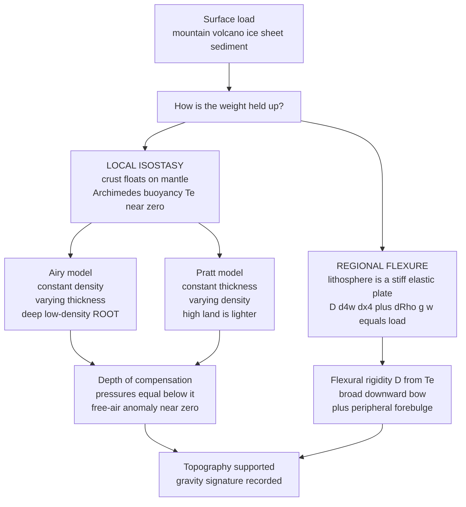

# 🏔️ Isostasy and Lithospheric Flexure

> [!abstract] TL;DR
> The solid Earth holds up its own weight in two complementary ways. **Isostasy** treats the crust/lithosphere as *floating* on the denser mantle in buoyant (Archimedean) equilibrium: mountains ride high because they have deep, low-density **roots** plunging into the mantle — like an iceberg's hidden keel. Its two classical flavours are **Airy** (constant-density crust of *varying thickness* — deep roots under high ground) and **Pratt** (constant thickness but *varying density* — high ground is lighter). But the lithosphere is not a limp raft: it is a **stiff elastic plate** that **bends** under concentrated loads. **Flexure** solves the thin-plate equation $D\,\partial^4 w/\partial x^4 + \Delta\rho\,g\,w = q(x)$, spreading a volcano's or ice sheet's weight over a broad region as a downward bow ringed by an upward **forebulge**, with the flexural wavelength set by the **flexural rigidity** $D$ and **effective elastic thickness** $T_e$. Short/young loads are supported elastically; long/old loads relax to local isostatic compensation.

## Intuition — analogy FIRST

An iceberg floats with roughly nine-tenths of its bulk hidden below the waterline, and **mountains do exactly the same thing**. The Himalayas are not merely piled on top of the crust like sand on a table; they have deep **roots** of light crustal rock plunging tens of kilometres down into the denser mantle, buoying them up like an iceberg's keel. Push more ice above the surface and the keel must grow deeper — push a mountain higher and its root grows deeper too. That is **isostasy**: the crust *floats* on the mantle, and what you see above sea level is the small visible tip of a much larger buoyant column.

But an iceberg is a free-floating solid, whereas the lithosphere is a **stiff sheet**. Set a heavy diver on the end of a diving board and the whole board sags in a smooth curve, not just the spot under their feet — and the far end even kicks *upward*. Drop a volcano or an ice sheet onto the lithosphere and the plate **bends** the same way: it bows down in a broad moat under the load and rises in a gentle **forebulge** around the rim. Isostasy (float) and flexure (bend) are the two mechanisms by which the solid Earth carries the weight of its own topography.

---

## How It Works

### Core Mechanics

1. **A load must be held up.** Any surface mass — a mountain range, a seamount, an ice cap, a pile of sediment — presses down on the lithosphere. The extra pressure has to be balanced from below, either by *buoyancy* (float) or by the *elastic strength* of the plate (bend), or a blend of both.

2. **Isostasy = Archimedes for the crust.** If the lithosphere were infinitely weak, every vertical column would float independently in the mantle so that the pressure at some deep **compensation depth** is everywhere equal. High topography must then be underlain by a mass *deficit* — either a thick low-density **root** (Airy) or a genuinely lower-density column (Pratt) — exactly as a taller iceberg needs a deeper keel.

3. **Airy vs Pratt.** *Airy* keeps crustal density fixed and varies crustal **thickness**: mountains sit on deep roots, ocean crust is thin. *Pratt* keeps thickness fixed and varies **density**: high standing regions are made of lighter material. Both reproduce the topography; they differ in what lies beneath.

4. **Flexure = elastic plate bending.** The real lithosphere has finite strength, so a *localised* load is not compensated locally — the plate distributes it. Balancing the bending resistance of a thin elastic plate against the buoyant restoring force of the displaced mantle gives the **flexure equation** $D\,\nabla^4 w + \Delta\rho\,g\,w = q$. The plate sags in a broad bowl and lifts into a peripheral **forebulge**.

5. **Rigidity sets the wavelength.** The **flexural rigidity** $D = E\,T_e^3 / [12(1-\nu^2)]$ (with Young's modulus $E$, Poisson ratio $\nu$, and **effective elastic thickness** $T_e$) controls how far the deflection spreads. A stiff, thick plate (large $T_e$, hence large $D$) bows gently over a very broad region; a weak, thin plate deflects sharply and locally, approaching pure Airy isostasy as $T_e \to 0$.

6. **Wavelength decides the regime.** Long-wavelength / geologically old loads are supported by buoyancy (isostasy); short-wavelength / young loads are supported by elastic strength (flexure). Gravity anomalies read out which: broad **isostatically compensated** features have near-zero long-wavelength free-air anomalies, while flexed or uncompensated loads leave a clear signature.

### Flow / Architecture



---

## Key Concepts

### Secondary Level

**Isostasy means floating.** A block floats with a fraction $\rho_{block}/\rho_{fluid}$ of its height submerged. Ice ($\rho \approx 917$) in seawater ($\rho \approx 1025$) floats with ~89% below the surface — the famous hidden nine-tenths. Continental crust ($\rho \approx 2800$ kg/m³) "floats" in mantle ($\rho \approx 3300$ kg/m³) the same way, so most of a mountain's supporting mass is a **root** buried out of sight.

**Why mountains have roots.** Piling rock on the surface adds weight; to stay in balance the column must displace an equal weight of mantle, which it does by pushing a low-density root down into it. A 5 km peak of crust needs roughly a **28 km** root (about 5–6× the visible height) — an iceberg with its keel.

**Two ways to stand tall.** *Airy*: the crust is all the same rock, and high ground simply has a **thicker** column with a deeper root. *Pratt*: the columns are all the same **height** to a common base, but high ground is made of **lighter** rock. Both put topography up; they hide the compensation differently.

**Bending, not just floating.** A single narrow volcano is too small to float on its own — the surrounding strong plate helps carry it, bending gently over a wide area. That elastic bending is **flexure**.

### Undergraduate Level

**Airy root from pressure balance.** Require equal lithostatic pressure at the compensation depth beneath a mountain column (crust thickness $T$, extra height $h$, root $r$) and a reference column. Cancelling common terms:

$$\rho_c\,h = (\rho_m - \rho_c)\,r \quad\Longrightarrow\quad \boxed{\,r = h\,\dfrac{\rho_c}{\rho_m - \rho_c}\,}$$

With $\rho_c = 2800$, $\rho_m = 3300$ kg/m³ the factor is $2800/500 = 5.6$: the root is ~5.6× the topographic height. The mirror case is an **anti-root** — thinned crust — beneath a water-filled ocean basin, $t = d\,(\rho_c-\rho_w)/(\rho_m-\rho_c)$.

**Pratt density from equal mass.** Demand equal mass above a compensation depth $D$. A column of height $h$ above sea level has density

$$\rho(h) = \rho_0\,\dfrac{D}{D + h}$$

so higher topography is systematically *less dense*. Airy and Pratt are end-members; the real Earth mixes them and adds flexure.

**Depth of compensation and isostatic anomalies.** Below the **compensation depth** all columns exert equal pressure. A perfectly compensated broad feature therefore has a **free-air anomaly near zero** (the mass excess of the mountain is cancelled by the mass deficit of its root) but a strongly **negative Bouguer anomaly** (Bouguer correction strips the topography, leaving the low-density root exposed in the data). The **isostatic anomaly** subtracts the *modelled* root/density compensation; near-zero values confirm equilibrium, non-zero values flag under- or over-compensation or flexural/dynamic support. See [[Gravity_Isostasy_and_the_Geoid|isostasy in the gravity field]].

**The flexure equation.** Treat the lithosphere as a thin elastic plate. Its bending resistance $D\,\partial^4 w/\partial x^4$ opposes the load $q(x)$ and the buoyant restoring force $\Delta\rho\,g\,w$ of mantle displaced by deflection $w$:

$$D\,\frac{d^4 w}{dx^4} + (\rho_m - \rho_i)\,g\,w = q(x), \qquad D = \frac{E\,T_e^{\,3}}{12\,(1-\nu^2)}$$

where $\rho_i$ is the density filling the deflected space (water, sediment, or the load itself). $D$ is the **flexural rigidity** (typically $10^{22}$–$10^{25}$ N·m), $T_e$ the **effective elastic thickness**, $E$ Young's modulus, $\nu \approx 0.25$ Poisson's ratio. Because $D \propto T_e^3$, the plate's stiffness is exquisitely sensitive to $T_e$.

**Limiting cases.** As $T_e \to 0$ (so $D \to 0$) the equation collapses to $\Delta\rho\,g\,w = q$, i.e. **local Airy isostasy** — each point floats independently. As $T_e \to \infty$ the plate is rigid and does not deflect at all. Real lithosphere lives between these extremes.

### Graduate Level

**Flexural parameter and analytic solution.** Define the flexural parameter

$$\alpha = \left[\frac{4D}{(\rho_m - \rho_i)\,g}\right]^{1/4}$$

For a **line load** $V_0$ (force per unit length) on a continuous infinite plate,

$$w(x) = \frac{V_0\,\alpha^3}{8D}\,e^{-|x|/\alpha}\left(\cos\frac{|x|}{\alpha} + \sin\frac{|x|}{\alpha}\right)$$

a damped oscillation. The deflection first crosses zero at $x_0 = \tfrac{3\pi}{4}\alpha$ and the **forebulge** crest sits at $x_b = \pi\alpha$ with an upward amplitude ~4% of the central deflection. The **flexural wavelength** is $\lambda = 2\pi\alpha$; for oceanic $T_e \sim 30$ km, $\alpha \sim 70$ km and $\lambda \sim 450$ km — the plate feels a seamount for hundreds of kilometres around it.

**Estimating $T_e$ from gravity and topography.** In the spectral domain the ratio of gravity to topography — the **admittance** $Z(k)$ — and the Bouguer–topography **coherence** $\gamma^2(k)$ transition with wavelength: short-wavelength loads are elastically supported (low compensation), long-wavelength loads are compensated (high admittance / high coherence). Fitting a flexure model to that transition (the Forsyth coherence method) yields $T_e$. Oceanic $T_e$ tracks the depth to the ~450 °C isotherm and thus $\sqrt{\text{age}}$; continental $T_e$ ranges from near zero in hot rifts to >100 km in cratons.

**Isostasy as the long-wavelength limit of flexure.** The **degree of compensation** $C(k) = [1 + D k^4 / (\Delta\rho\,g)]^{-1}$ runs from $C\to 1$ (fully compensated, isostatic) at long wavelength to $C\to 0$ (uncompensated, plate carries it elastically) at short wavelength. Isostasy is therefore not a separate physics but the $k\to 0$ (or $T_e \to 0$) corner of flexure. The crossover wavelength scales as $D^{1/4}$.

**Broken plates and time dependence.** At a subduction zone the plate is effectively *broken* at the trench, giving a half-plate solution with a pronounced **outer-rise** forebulge whose shape constrains $T_e$ and the plate's yield strength (bending stresses can exceed the elastic limit, so an *effective* $T_e$ replaces the true mechanical thickness). Over geological time viscoelastic relaxation lowers the supported $T_e$, and truly slow loads (deglaciation) are carried by **viscous** mantle flow rather than elastic bending — the domain of glacial isostatic adjustment.

---

## Python Demo

```python
# Isostasy & flexure: how the solid Earth supports surface loads.
#   (a) AIRY ISOSTASY  -- crustal ROOT needed to buoy up topography
#                         (r = h * rho_c / (rho_m - rho_c); root ~5-6x height).
#   (b) FLEXURE        -- numerically solve  D w'''' + dRho*g*w = q(x)
#                         for a seamount load on an elastic plate; show the
#                         moat + peripheral FOREBULGE set by rigidity D / Te.
# Requires numpy + matplotlib.
import numpy as np
import matplotlib.pyplot as plt

g = 9.81
rho_c, rho_m, rho_w = 2800.0, 3300.0, 1000.0    # crust, mantle, water (kg/m^3)

# ---------------------------------------------------------------
# (a) AIRY ISOSTASY: root = h * rho_c / (rho_m - rho_c)
# ---------------------------------------------------------------
ratio = rho_c / (rho_m - rho_c)                  # ~5.6: root-to-height factor
xa = np.linspace(-300, 300, 601)                 # km
h  = 5.0 * np.exp(-(xa / 60.0) ** 2)             # a 5 km-high mountain (km)
root = ratio * h                                 # depth of low-density root (km)

T_ref = 35.0                                     # reference crustal thickness (km)
print("AIRY ISOSTASY")
print(f"  root-to-height factor rho_c/(rho_m-rho_c) = {ratio:.2f}")
print(f"  a {h.max():.0f} km peak needs a {root.max():.0f} km root "
      f"(~{root.max()/h.max():.1f}x deeper) -- the iceberg keel")
print(f"  compensation depth ~ {T_ref + root.max():.0f} km below sea level")

# ---------------------------------------------------------------
# (b) FLEXURE: solve  D d4w/dx4 + dRho*g*w = q(x)  by finite differences.
#     Seamount load on an oceanic elastic plate; moat fills with water.
# ---------------------------------------------------------------
E, nu, Te = 70e9, 0.25, 30e3                      # Young's mod, Poisson, Te = 30 km
D = E * Te**3 / (12 * (1 - nu**2))                # flexural rigidity (N m)
dRho = rho_m - rho_w                              # buoyant restoring contrast

alpha = (4 * D / (dRho * g)) ** 0.25              # flexural parameter (m)
print("\nFLEXURE")
print(f"  flexural rigidity D = {D:.2e} N m   (Te = {Te/1e3:.0f} km)")
print(f"  flexural parameter  alpha = {alpha/1e3:.0f} km")
print(f"  forebulge crest near x = pi*alpha = {np.pi*alpha/1e3:.0f} km")

# grid (metres)
L, dx = 500e3, 2e3
xf = np.arange(-L, L + dx, dx)
N  = xf.size

# seamount load: buoyant weight (rho_c - rho_w)*g*h_topo, Gaussian 4 km high
h_topo = 4e3 * np.exp(-(xf / 25e3) ** 2)          # 4 km, half-width ~25 km
q = (rho_c - rho_w) * g * h_topo                  # load per unit area (Pa)

# assemble A w = q with the 4th-derivative stencil (1,-4,6,-4,1)/dx^4
A = np.zeros((N, N))
c = D / dx**4
for i in range(2, N - 2):
    A[i, i-2] += c
    A[i, i-1] += -4 * c
    A[i, i]   += 6 * c + dRho * g
    A[i, i+1] += -4 * c
    A[i, i+2] += c
for i in (0, 1, N-2, N-1):                        # far field clamped: w = 0
    A[i, :] = 0.0
    A[i, i] = 1.0
    q[i] = 0.0

w = np.linalg.solve(A, q)                          # downward deflection (m), w>0 = down

w_local = (rho_c - rho_w) * h_topo.max() / (rho_m - rho_w)  # full Airy compensation
print(f"  central deflection: flexural {w.max():.0f} m  vs  "
      f"local-isostatic {w_local:.0f} m")
print(f"  -> narrow load is only ~{100*w.max()/w_local:.0f}% compensated "
      f"(rest carried elastically)")
fb = w.min()
print(f"  forebulge uplift: {-fb:.0f} m at x = {xf[np.argmin(w)]/1e3:+.0f} km")

# ---------------------------------------------------------------
# Plot: Airy root  (left)  and  flexural deflection + forebulge  (right)
# ---------------------------------------------------------------
fig, (ax1, ax2) = plt.subplots(1, 2, figsize=(13, 5))

ax1.fill_between(xa, 0, h, color="#8d6e63", alpha=0.85, label="topography")
ax1.fill_between(xa, -T_ref, -T_ref - root, color="#90caf9",
                 alpha=0.85, label="low-density root")
ax1.axhline(0, color="k", lw=0.8)
ax1.axhline(-(T_ref + root.max()), color="#d32f2f", ls="--", lw=1,
            label="compensation depth")
ax1.set_title(f"Airy isostasy: root = {ratio:.1f} x height")
ax1.set_xlabel("Distance (km)"); ax1.set_ylabel("Height / depth (km)")
ax1.legend(loc="lower right"); ax1.grid(alpha=0.3)

xk = xf / 1e3
ax2.plot(xk, -w, color="#1565c0", lw=2, label="plate deflection")
ax2.axhline(0, color="k", lw=0.8)
ax2.fill_between(xk, 0, h_topo, color="#8d6e63", alpha=0.6, label="seamount load")
ax2.axvline(np.pi * alpha / 1e3, color="#2e7d32", ls=":", lw=1)
ax2.annotate("forebulge", xy=(np.pi*alpha/1e3, -fb),
             xytext=(np.pi*alpha/1e3 + 60, -fb + 400),
             arrowprops=dict(arrowstyle="->"), color="#2e7d32")
ax2.set_title(f"Flexure of an elastic plate (Te = {Te/1e3:.0f} km)")
ax2.set_xlabel("Distance (km)"); ax2.set_ylabel("Elevation of plate top (m)")
ax2.legend(loc="lower right"); ax2.grid(alpha=0.3)

plt.tight_layout()
plt.savefig("isostasy_flexure_demo.png", dpi=120)
print("\nSaved figure to isostasy_flexure_demo.png")
```

Running it prints a root ~5.6× the mountain height (the iceberg keel) and, for the flexure case, a central moat that is only *partially* compensated because the narrow seamount is much smaller than the flexural parameter $\alpha \sim 70$ km — the surrounding stiff plate shares the load and kicks up a small **forebulge** near $x = \pi\alpha$. Widen the load (or shrink $T_e$) and the flexural solution relaxes toward the full Airy value; that limit *is* local isostasy.

---

## Real-World Applications

> **Example — Hawaii's flexural moat and arch.** The Hawaiian volcanoes are far too heavy and narrow to float locally. They bend the ~90-Myr-old Pacific plate ($T_e \approx 25$–30 km) into a **moat** ringing the islands and a broad **arch** (the forebulge, the "Hawaiian swell") a few hundred kilometres out — textbook line/point-load flexure, and one of the cleanest natural measurements of oceanic elastic thickness.

- **Foreland basins.** The weight of a growing mountain belt (Himalaya, Alps, Andes, Appalachians) flexes the adjacent continental plate down into an asymmetric **foreland basin** (Ganges, Molasse, Chaco) with a subtle **peripheral bulge** beyond it — the basin geometry directly records the load history and $T_e$.
- **Trench outer rise.** Before it subducts, the incoming plate bends *upward* into an **outer rise** and then plunges into the trench. Fitting the outer-rise bathymetry and gravity yields the plate's effective elastic thickness and, because bending stresses saturate, its yield-strength envelope.
- **Ice and sediment loading.** Ice sheets and thick deltas (Ganges–Brahmaputra, Mississippi, Amazon fans) flex the lithosphere; the fast elastic part is flexure, while the slow post-melt recovery is *viscous* — glacial isostatic adjustment governed by mantle viscosity.
- **Mapping effective elastic thickness.** Gravity–topography admittance and Bouguer coherence turn global gravity models into maps of $T_e$, distinguishing strong cratons from weak, hot, tectonically active belts — a proxy for lithospheric strength and thermal state.
- **Ocean-floor isostasy.** The thickening, cooling, densifying oceanic lithosphere subsides with age (the $\sqrt{\text{age}}$ depth law) as a running example of thermal isostasy, and mid-ocean-ridge topography reflects the same buoyant balance.

---

## Common Pitfalls

- **Airy vs Pratt confusion.** Both models reproduce the *same surface topography* — they differ only in what compensates it: Airy varies crustal **thickness** (roots), Pratt varies **density**. You cannot tell them apart from elevation alone; you need seismic Moho depth, gravity, or density constraints. The real Earth is a blend, plus flexure.
- **Treating everything as locally compensated.** Local isostasy assumes an infinitely weak plate ($T_e = 0$) where each column floats independently. Narrow or young loads (seamounts, volcanoes, ice, subducting slabs) are **not** locally compensated — they are supported *regionally* by the plate's elastic strength. Applying Airy to a seamount badly overestimates its root.
- **Flexural rigidity vs elastic thickness.** $D \propto T_e^3$, so a factor-2 error in $T_e$ is a factor-8 error in $D$. And $T_e$ is an **effective** mechanical thickness — it is *not* the seismic lithosphere, the thermal lithosphere, or the crustal thickness, and can be smaller than all of them where the plate yields.
- **Forgetting the forebulge.** Flexure always produces a peripheral **upward** bulge (a few percent of the central deflection). Mistaking a forebulge for tectonic uplift, or ignoring it in foreland/outer-rise interpretation, misreads the mechanics — its position pins down $\alpha$ and hence $T_e$.
- **Wrong gravity anomaly for the question.** Over a compensated mountain the **free-air** anomaly is near zero, the **Bouguer** anomaly is strongly negative, and the **isostatic** anomaly (compensation removed) is near zero again — all correct, all different. Reading support from the wrong one is a classic blunder; short-wavelength edges also break the "free-air ≈ 0" rule of thumb.
- **Elastic when it should be viscous.** Flexure is the *instantaneous elastic* response. Slow loading/unloading over thousands of years (deglaciation) is carried by **viscous** mantle flow, not elastic bending — that is postglacial rebound, a different constitutive law and time scale.
- **Units and scale.** $T_e$ in kilometres must become metres inside $D$; $D$ is enormous ($\sim 10^{23}$ N·m). Mixing km and m in the rigidity, or SI stress with cgs density, throws the deflection off by orders of magnitude.

---

## Related Concepts

- **Sibling notes** (this Geophysics section, prose only) — *Earths_Gravity_Field_and_Geodesy* supplies the gravity anomalies that read out compensation; *Rheology_and_Deformation_of_the_Earth* explains why $T_e$ is an effective, yield-limited thickness; *Postglacial_Rebound_and_Mantle_Viscosity* is the viscous counterpart to elastic flexure for ice loads; *Gravity_and_Magnetic_Surveying* applies these anomalies in the field; *Geophysics_of_Plate_Tectonics* frames foreland basins, outer rises, and ocean-floor subsidence.
- [[Gravity_Isostasy_and_the_Geoid]] — the Earth-Science, geology-level treatment of isostatic roots, the geoid, and gravity anomalies; **this note is the flexure / plate-mechanics companion** to it (distinct, complementary scope)
- [[Earth_Internal_Structure]] — the crust/mantle density layering ($\rho_c$, $\rho_m$) that sets every buoyancy balance above
- [[Elasticity_and_Seismic_Wave_Theory]] — the elastic moduli $E$, $\nu$ that build the flexural rigidity $D$
- [[Stress_Strain_and_Elastic_Moduli]] — Young's modulus and Poisson's ratio, and the bending stresses that limit $T_e$
- [[Fluid_Statics_and_Buoyancy]] — Archimedes' principle and hydrostatic pressure balance, the physics behind isostasy
- [[Ordinary_Differential_Equations]] — the fourth-order (beam / plate) equation $D\,w'''' + \Delta\rho\,g\,w = q$ solved here numerically

---

## Review Questions

1. **Secondary:** An iceberg floats with most of its bulk hidden below the water. Explain, using that picture, why a 5 km-high mountain must have a root that is roughly 28 km deep — and what would happen to the root if the mountain were eroded away.
2. **Undergraduate:** Derive the Airy root formula $r = h\,\rho_c/(\rho_m-\rho_c)$ from pressure balance at the compensation depth, and contrast it with the Pratt model. Then explain why a fully compensated mountain shows a **free-air** anomaly near zero but a strongly **negative Bouguer** anomaly.
3. **Graduate:** A narrow seamount and a 1000 km-wide plateau impose the *same* total load on the same plate. Which is more fully compensated, and why? In your answer define the flexural parameter $\alpha$ and effective elastic thickness $T_e$, describe the forebulge, and outline how you would estimate $T_e$ from gravity–topography admittance/coherence.

---

## Sources

- Turcotte, D. L. & Schubert, G. — *Geodynamics*, 3rd ed. (Ch. 3 elastic flexure of the lithosphere; Ch. 5 gravity, geoid, and isostasy)
- Watts, A. B. — *Isostasy and Flexure of the Lithosphere* (Cambridge, 2001) — the definitive modern monograph
- Fowler, C. M. R. — *The Solid Earth: An Introduction to Global Geophysics*, 2nd ed. (Ch. 5, gravity & isostasy)
- Airy, G. B. (1855) & Pratt, J. H. (1855) — the original competing models of crustal compensation, *Phil. Trans. R. Soc.*
- Forsyth, D. W. (1985) — "Subsurface loading and estimates of the flexural rigidity of continental lithosphere," *J. Geophys. Res.* 90, 12623 (the coherence method for $T_e$)

---

#geophysics #isostasy #flexure #lithosphere #crustal-roots
