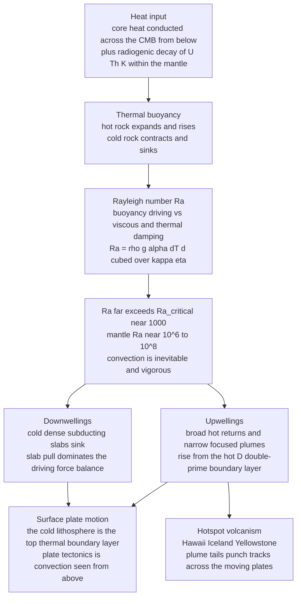

# 🌋 Mantle Convection and Dynamics

> [!abstract] TL;DR
> The mantle is **solid rock that flows** — over millions of years it deforms by **solid-state creep** and behaves as a fluid of colossal viscosity ($\eta \sim 10^{21}\ \mathrm{Pa\,s}$), so it **convects**, carrying the planet's internal heat outward. Whether and how vigorously it overturns is governed by a single dimensionless group, the **Rayleigh number** $Ra=\dfrac{\rho g\alpha\Delta T\,d^3}{\kappa\,\eta}$: the mantle's value is $\sim10^{6}$–$10^{8}$, thousands of times above the critical $Ra_c\!\sim\!10^{3}$, so convection is **inevitable and vigorous**. Because inertia is negligible against that viscosity (an effectively **infinite Prandtl number**, creeping Stokes flow), the motion is smooth: hot **upwellings** and focused **plumes** rise from the D″ layer at the core–mantle boundary while cold **downwellings** — subducting slabs — sink. The tectonic plates *are* the cold top **thermal boundary layer** of this convection, so plate tectonics is simply mantle convection viewed from above. Heat transport follows the **Nusselt–Rayleigh scaling** $Nu\sim Ra^{1/3}$, and the great open questions — whole-mantle versus layered convection, plume-driven versus plate-driven flow, temperature-dependent viscosity, and the deep LLSVPs — define modern geodynamics.

## Intuition — analogy FIRST

Heat a pot of **thick soup** from below on a low burner. The soup at the bottom warms, expands, becomes buoyant, and slowly rises; at the top it cools, grows dense, and sinks back down. Rolling **convection cells** organize themselves, and a cool, stiff **skin** forms on top, dragged along by the churning beneath. The Earth's mantle does exactly this — except the "soup" is *solid rock* that flows like ultra-slow honey over millions of years, and the "pot" is **2,900 km deep**. This sluggish overturning is the **master engine of the planet**: it hauls heat out of the deep interior, drags the tectonic plates across the surface, and shapes the entire dynamic Earth.

Hold onto the paradox at the heart of geodynamics: **solid rock, convecting.** Rock that shatters under a hammer on human timescales creeps like a fluid over geological time. Resolve that paradox and the whole subject opens up — the same buoyancy-versus-friction competition that governs a pot of soup governs a planet, once you measure it with the right dimensionless number.

---

## How It Works

Heat charges the mantle from below and within; that heat makes rock buoyant; the buoyancy is pitted against viscous drag and thermal diffusion in the Rayleigh number; and because the mantle's $Ra$ is enormously supercritical, the layer overturns — throwing up hot upwellings and plumes, dropping cold slabs, and moving the plates that are its own cold skin.



The steep temperature drops are locked into two thin **thermal boundary layers**: the cold **lithosphere** at the top and the hot **D″ layer** just above the core–mantle boundary. Between them the well-stirred interior follows a nearly flat adiabat. This is the fluid-dynamics companion to the heat-budget bookkeeping in the sibling note **Terrestrial_Heat_Flow_and_Thermal_Evolution**, it supplies the driving mechanism behind **Geophysics_of_Plate_Tectonics**, it depends on the creep laws detailed in **Rheology_and_Deformation_of_the_Earth**, it is imaged by **Seismic_Tomography_and_Earth_Imaging**, and its deep-core analogue powers the **Geomagnetism_and_the_Geodynamo** (see the **Geophysics_Overview**).

---

## Key Concepts

### Secondary Level

- **The mantle flows even though it is solid.** Under crushing pressure and heat, rock behaves like extremely stiff putty: given millions of years it deforms by **solid-state creep** at centimetres per year. It is *not* molten — the convecting bulk is solid crystalline rock.
- **Why it convects.** Heat comes from two sources: leftover and freshly conducted heat leaking out of the **core**, and **radioactive decay** of uranium, thorium, and potassium spread through the mantle. Hot deep rock expands, becomes buoyant, and rises; cold surface rock is dense and sinks. Heat in at depth, heat out at the top, motion in between — a heat engine.
- **Convection cells.** The rising and sinking organize into rolling **cells**, with **upwellings** (hot rock going up) and **downwellings** (cold rock going down). Where hot rock reaches the top it spreads sideways and cools.
- **Plates are the top of the convection.** A tectonic plate is the cold, rigid **skin** of a convection cell — not a raft floating on top of it, but literally its upper surface. When a cold slab sinks at a subduction zone it tows the rest of the plate behind it.
- **Plumes and hotspots.** Narrow, persistent jets of hot rock — **plumes** — rise from deep down and burn chains of volcanoes (Hawaii, Iceland) into the plates gliding overhead.

### Undergraduate Level

- **The Rayleigh number decides everything.** It is the ratio of the buoyancy *driving* convection to the diffusion *damping* it:

$$Ra=\frac{\rho\, g\, \alpha\, \Delta T\, d^{3}}{\kappa\,\eta}.$$

| Symbol | Meaning | Mantle value |
|--------|---------|--------------|
| $\rho$ | density | $\sim 4000\ \mathrm{kg\,m^{-3}}$ |
| $g$ | gravity | $\sim 10\ \mathrm{m\,s^{-2}}$ |
| $\alpha$ | thermal expansivity | $\sim 3\times10^{-5}\ \mathrm{K^{-1}}$ |
| $\Delta T$ | super-adiabatic contrast | $\sim 2500\ \mathrm{K}$ |
| $d$ | layer thickness | $\sim 2.9\times10^{6}\ \mathrm{m}$ |
| $\kappa$ | thermal diffusivity | $\sim 10^{-6}\ \mathrm{m^2\,s^{-1}}$ |
| $\eta$ | dynamic viscosity | $\sim 10^{21}\text{–}10^{22}\ \mathrm{Pa\,s}$ |

- **Critical Rayleigh number.** Convection begins only once $Ra$ exceeds a **critical value** of order $10^{3}$ — exactly $Ra_c = 27\pi^4/4 \approx 657.5$ for stress-free boundaries, $1708$ for rigid ones. Below $Ra_c$ diffusion wins and heat moves by conduction alone; above it, buoyant overturn takes over. Plugging in the mantle numbers gives $Ra \approx 10^{6}$–$10^{8}$ — **thousands of times supercritical**. The lesson: even a viscosity of $10^{22}\ \mathrm{Pa\,s}$ cannot switch off convection, because the $d^{3}$ term (a 2900 km layer) is astronomically large.
- **The high-Prandtl, creeping-flow regime.** The Prandtl number $Pr=\nu/\kappa=\eta/(\rho\kappa)$ measures momentum diffusion against thermal diffusion. For the mantle $Pr\sim10^{23}$ — effectively **infinite**. Inertia is utterly negligible, so the mantle is a textbook **low-Reynolds-number Stokes flow**: smooth, reversible-looking creep with no turbulence. The momentum equation collapses to an instantaneous force balance between buoyancy, pressure, and viscous stress (see **Low_Reynolds_Number_Flow**).
- **Nusselt–Rayleigh heat transport.** The **Nusselt number** $Nu$ is the ratio of total heat transported to what conduction alone would carry. Boundary-layer theory predicts $Nu \sim Ra^{1/3}$: hotter, less-viscous, more vigorous convection thins the boundary layers and dumps heat faster. This scaling links surface heat flow to the mantle's internal state.
- **Boundary layers are where the action is.** Almost the entire temperature contrast sits in two thin **thermal boundary layers** — the cold lithosphere on top and the hot D″ layer at the base — while the interior is nearly isothermal along an adiabat. Instabilities of these layers *are* the upwellings and downwellings.

### Graduate Level

- **The Boussinesq convection equations.** Constant-property, infinite-Prandtl mantle convection reduces (nondimensionally) to conservation of mass $\nabla\!\cdot\!\mathbf{u}=0$, an instantaneous Stokes balance $0=-\nabla p+\nabla^2\mathbf{u}+Ra\,T\,\hat{\mathbf{z}}$, and thermal advection–diffusion $\partial_t T+\mathbf{u}\!\cdot\!\nabla T=\nabla^2 T$. In the stream-function–vorticity form used in the demo, the momentum balance becomes the pair $\nabla^2\omega=-Ra\,\partial_x T$ and $\nabla^2\psi=-\omega$ — a Poisson problem solved every timestep.
- **Whole-mantle versus layered convection.** Does the mantle overturn as one cell top-to-bottom, or in two decoupled layers separated at **660 km**? The ringwoodite → bridgmanite transition there has a **negative Clapeyron slope** that resists vertical flow. Seismic tomography largely settled the debate: some cold slabs stall and pond near 660 km, but many **penetrate to the CMB** ("slab graveyards"), so the consensus is **whole-mantle convection with a partial, leaky, intermittent barrier** at 660 km, plus a viscosity jump of $\sim30\times$ into the lower mantle.
- **Plumes versus plate-driven flow.** Two circulation styles coexist. **Downwelling is plate-organized**: cold slabs (slab pull) impose the large-scale flow and account for most of the driving force. **Upwelling is partly passive** (broad return flow under ridges) and partly **active** (narrow, hot, buoyant plumes rising from thermal or thermochemical instabilities of D″). Distinguishing genuinely deep plumes from shallow, plate-related melting anomalies drives modern tomography.
- **Temperature- and stress-dependent viscosity.** Real mantle viscosity is *not* constant: it varies by orders of magnitude with temperature (Arrhenius creep), pressure, grain size, water content, and stress (non-Newtonian dislocation creep). This makes convection **self-regulating** — a hotter mantle is weaker, convects faster, and cools faster — and it is what lets the cold lithosphere behave as a rigid plate (a stiff lid) while the hot interior flows freely.
- **LLSVPs and the deep mantle.** Two continent-sized **Large Low-Shear-Velocity Provinces** sit on the CMB beneath Africa and the Pacific — dense, hot, probably **thermochemical piles** — from whose steep margins deep plumes preferentially rise. They anchor the pattern of upwelling and may persist over hundreds of millions of years.
- **Numerical mantle-convection modelling.** Because $Ra$ is huge and viscosity varies steeply, global geodynamics relies on large-scale finite-element and finite-volume codes (CitcomS, ASPECT, TERRA) with adaptive meshes, spherical geometry, and data assimilation of subduction history — the computational descendants of the toy solver below.

---

## Python Demo

```python
# Mantle convection: the Rayleigh-number criterion + a 2D convection simulation.
# (a) Compute Ra for the mantle and show it dwarfs the CRITICAL value -> must convect.
# (b) Solve the infinite-Prandtl Boussinesq equations (streamfunction-vorticity,
#     finite differences) and watch convection CELLS self-organize.
# (c) The Nusselt-Rayleigh heat-transport scaling Nu ~ Ra^(1/3).
# numpy + matplotlib only.  (The 2D solve takes ~10-30 s.)
import numpy as np
import matplotlib.pyplot as plt

# =====================================================================
# (a) RAYLEIGH-NUMBER CRITERION: must the mantle convect?
#     Ra = rho g alpha dT d^3 / (kappa eta)
# =====================================================================
rho   = 4000.0     # kg m^-3   mean mantle density
g     = 10.0       # m s^-2    gravity
alpha = 3.0e-5     # K^-1      thermal expansivity
dT    = 2500.0     # K         top-to-bottom super-adiabatic contrast
d     = 2.9e6      # m         mantle thickness (2900 km)
kappa = 1.0e-6     # m^2 s^-1  thermal diffusivity
eta   = 1.0e21     # Pa s      dynamic viscosity (solid-state creep)

Ra_mantle = rho*g*alpha*dT*d**3 / (kappa*eta)
Ra_crit   = 27*np.pi**4/4                 # 657.5, free-free critical value
Pr        = (eta/rho)/kappa               # Prandtl number

print(f"Mantle Rayleigh number   Ra   = {Ra_mantle:.2e}")
print(f"Critical Rayleigh number Ra_c = {Ra_crit:.1f}")
print(f"Ra / Ra_c = {Ra_mantle/Ra_crit:.2e}  -> hugely supercritical: the mantle MUST convect")
print(f"Mantle Prandtl number    Pr   = {Pr:.2e}  -> inertia negligible (creeping Stokes flow)")

# marginal-stability (onset) curve: Ra_c(k) = (pi^2 + k^2)^3 / k^2
k          = np.linspace(0.4, 8.0, 600)
Ra_c_curve = (np.pi**2 + k**2)**3 / k**2
k_min      = np.pi/np.sqrt(2)             # 2.221, the fastest-growing mode

# =====================================================================
# (b) 2D THERMAL CONVECTION -- infinite-Prandtl Boussinesq (mantle regime)
#     laplacian(omega) = -Ra dT/dx     (instantaneous Stokes balance)
#     laplacian(psi)   = -omega
#     dT/dt = -(u dT/dx + v dT/dy) + laplacian(T)
#     u = dpsi/dy , v = -dpsi/dx ; free-slip (psi=omega=0) walls,
#     T=1 hot bottom, T=0 cold top, insulated sides.
# =====================================================================
Ra_sim = 5.0e3                     # ~8x critical: steady laminar rolls
nx, ny = 61, 31                    # aspect ratio 2 (Lx=2, Ly=1)
Lx, Ly = 2.0, 1.0
h      = Ly/(ny-1)                 # dx = dy = h
x      = np.linspace(0, Lx, nx)
y      = np.linspace(0, Ly, ny)
X, Y   = np.meshgrid(x, y)         # shape (ny, nx): rows=y (vertical), cols=x

# conductive start (hot at bottom) + a small seed perturbation
T   = (1.0 - Y) + 0.05*np.sin(np.pi*Y)*np.cos(np.pi*X)
psi = np.zeros((ny, nx))
omg = np.zeros((ny, nx))

def poisson(phi, f, h, n_iter=50):
    """Solve laplacian(phi) = f with phi=0 Dirichlet walls (vectorized Jacobi)."""
    h2 = h*h
    for _ in range(n_iter):
        phi[1:-1, 1:-1] = 0.25*(phi[1:-1, 2:] + phi[1:-1, :-2]
                                + phi[2:, 1:-1] + phi[:-2, 1:-1]
                                - h2*f[1:-1, 1:-1])
    return phi

dt, nsteps = 2.0e-4, 6000
for step in range(nsteps):
    # insulated side walls + fixed hot bottom / cold top
    T[:, 0], T[:, -1] = T[:, 1], T[:, -2]
    T[0, :], T[-1, :] = 1.0, 0.0

    dTdx = np.zeros_like(T)
    dTdx[:, 1:-1] = (T[:, 2:] - T[:, :-2])/(2*h)

    # Stokes balance then streamfunction (both warm-started Poisson solves)
    omg = poisson(omg, -Ra_sim*dTdx, h, n_iter=50)
    psi = poisson(psi, -omg,         h, n_iter=50)

    # velocities  u = dpsi/dy , v = -dpsi/dx
    u = np.zeros_like(psi); v = np.zeros_like(psi)
    u[1:-1, :] =  (psi[2:, :] - psi[:-2, :])/(2*h)
    v[:, 1:-1] = -(psi[:, 2:] - psi[:, :-2])/(2*h)

    # temperature update: advection (central) + diffusion (5-point)
    adv = (u[1:-1, 1:-1]*(T[1:-1, 2:] - T[1:-1, :-2])/(2*h)
         + v[1:-1, 1:-1]*(T[2:, 1:-1] - T[:-2, 1:-1])/(2*h))
    lap = (T[1:-1, 2:] + T[1:-1, :-2] + T[2:, 1:-1] + T[:-2, 1:-1]
           - 4*T[1:-1, 1:-1])/(h*h)
    T[1:-1, 1:-1] += dt*(-adv + lap)

# Nusselt number from the cold top boundary flux (conduction => Nu = 1)
Nu_sim = np.mean(-(T[-1, :] - T[-2, :])/h)
print(f"Simulated Nusselt number at Ra={Ra_sim:.0f}:  Nu = {Nu_sim:.2f}  "
      f"(Nu>1 => convection carries most of the heat)")

# =====================================================================
# PLOTS
# =====================================================================
fig = plt.figure(figsize=(16, 5))

# (a) onset of convection -- marginal stability curve
ax1 = fig.add_subplot(1, 3, 1)
ax1.plot(k, Ra_c_curve, 'b-', lw=2)
ax1.axhline(Ra_crit, color='r', ls='--', lw=1.3, label=f'Ra_c min = {Ra_crit:.0f}')
ax1.plot(k_min, Ra_crit, 'ro', ms=7)
ax1.fill_between(k, Ra_c_curve, 1e5, color='orange',    alpha=0.18)
ax1.fill_between(k, 1,          Ra_c_curve, color='steelblue', alpha=0.12)
ax1.text(4.4, 4e4,  'CONVECTION\nRa > Ra_c', color='saddlebrown', fontsize=9)
ax1.text(4.4, 1.2e3,'no motion\nconduction', color='navy',       fontsize=9)
ax1.set_yscale('log'); ax1.set_ylim(3e2, 1e5)
ax1.set_xlabel('horizontal wavenumber k'); ax1.set_ylabel('critical Rayleigh number')
ax1.set_title('(a) Onset of convection\nmarginal stability curve')
ax1.legend(fontsize=8); ax1.grid(alpha=0.3, which='both')

# (b) temperature field + streamlines -> convection cells
ax2 = fig.add_subplot(1, 3, 2)
cf = ax2.contourf(X, Y, T, levels=30, cmap='inferno')
ax2.streamplot(X, Y, u, v, color='cyan', density=1.1, linewidth=0.7, arrowsize=0.8)
plt.colorbar(cf, ax=ax2, label='temperature (hot=1, cold=0)', shrink=0.85)
ax2.set_xlabel('x'); ax2.set_ylabel('height y  (cold surface at top, hot CMB at bottom)')
ax2.set_title(f'(b) Convection cells at Ra={Ra_sim:.0f}\nhot upwellings, cold downwellings')
ax2.set_aspect('equal')

# (c) Nusselt-Rayleigh heat-transport scaling
ax3 = fig.add_subplot(1, 3, 3)
Ra_line = np.logspace(np.log10(Ra_crit), 9, 200)
c_scale = Nu_sim / Ra_sim**(1/3)
ax3.plot(Ra_line, c_scale*Ra_line**(1/3), 'g-', lw=2, label='Nu ~ Ra^(1/3)')
ax3.axhline(1,       color='navy', ls=':',  lw=1.2, label='Nu=1 (pure conduction)')
ax3.axvline(Ra_crit, color='r',    ls='--', lw=1,   label='Ra_c onset')
ax3.plot(Ra_sim, Nu_sim, 'ko', ms=8, label='this simulation')
ax3.axvspan(1e6, 1e8, color='orange', alpha=0.15)
ax3.text(1.3e6, 1.4, "Earth's\nmantle", fontsize=8, color='saddlebrown')
ax3.set_xscale('log'); ax3.set_yscale('log')
ax3.set_xlabel('Rayleigh number Ra'); ax3.set_ylabel('Nusselt number Nu')
ax3.set_title('(c) Heat-transport scaling\nvigor of convection vs Ra')
ax3.legend(fontsize=8); ax3.grid(alpha=0.3, which='both')

plt.tight_layout(); plt.show()
```

Panel (a) plots the **marginal stability curve** $Ra_c(k)=(\pi^2+k^2)^3/k^2$: only above it (orange) does convection grow, and its minimum $Ra_c\approx657.5$ sits at wavenumber $k=\pi/\sqrt2$. The mantle's $Ra\sim10^{6}$–$10^{8}$ lands far above the whole curve — convection is not a close call, it is guaranteed. Panel (b) runs the actual Boussinesq solver: from a nearly conductive start, the seed perturbation grows into **convection cells** with hot upwellings and cold downwellings, exactly the mantle's overturning motif. Panel (c) shows the **Nusselt–Rayleigh scaling** $Nu\sim Ra^{1/3}$, with the simulation's measured $Nu$ marked and Earth's mantle far to the right — vigorous convection carrying orders of magnitude more heat than conduction ever could.

---

## Real-World Applications

- **Explaining plate tectonics mechanistically.** Convection supplied the long-missing *engine* for continental drift. Slab pull and ridge push are convective forces; global plate-motion models (NUVEL, MORVEL) are the surface kinematics of the underlying flow.
- **Seismic tomography as a convection snapshot.** Global wave-speed maps image cold sinking slabs (fast) and hot rising plumes (slow), plus the two deep LLSVPs — turning the abstract flow into a picture of where mantle material is going right now.
- **Hotspots and absolute plate motion.** Fixed-plume tracks (Hawaii–Emperor, Réunion → Deccan) let geophysicists read the *absolute* speed and direction of plates and reconstruct the pattern of upwelling over 100+ Myr.
- **Dynamic topography and sea level.** Mantle upwellings and downwellings deflect the surface by hundreds of metres of long-wavelength **dynamic topography**, biasing coastlines, sedimentary basins, and past sea-level records.
- **Thermal and magnetic evolution.** The heat convection extracts across the core–mantle boundary sets whether the outer core can convect and sustain the **geodynamo** — coupling mantle dynamics to the very existence of Earth's magnetic shield.
- **Planetary comparison.** Applying the $Ra$ and $Nu$ machinery to Venus (stagnant-lid, episodic overturn), Mars (early death of convection and dynamo), and the icy moons (solid-state convection of ice shells) turns mantle convection into a general theory of how rocky and icy bodies lose heat.

---

## Common Pitfalls

1. **"The mantle is molten liquid."** It is **solid crystalline rock** deforming by **solid-state creep** (diffusion and dislocation creep), not a magma ocean. Only trace partial melt exists near the surface; the convecting bulk is solid, which is exactly what makes "solid rock, convecting" the defining paradox.
2. **"High viscosity should shut convection off."** No — $Ra$ scales with $d^{3}$, so a 2900 km layer convects vigorously ($Ra\sim10^{6}$–$10^{8}$) *despite* $\eta\sim10^{22}\ \mathrm{Pa\,s}$. Viscosity slows the flow (cm/yr) but cannot prevent it.
3. **"Fast convection means turbulence and inertia."** The mantle's Prandtl number is effectively **infinite** and its Reynolds number vanishingly small — this is **creeping Stokes flow**, laminar and inertia-free. Modelling it with high-Reynolds intuition (eddies, turbulence) is wrong; drop the inertial terms and solve an instantaneous force balance.
4. **"The mantle convects in two neat layers."** The whole-mantle-versus-layered debate is largely resolved toward **whole-mantle convection with a leaky, intermittent 660 km barrier** — slabs both stall *and* penetrate. Treating 660 km as a hard lid, or ignoring it entirely, both miss the observed behaviour.
5. **"Plates ride passively on convection currents like conveyor belts."** Outdated. Plates **are** the cold top boundary layer, and **slab pull** — sinking slabs pulling their own plate — dominates the driving forces. Convection does not push the plates; the plates are part of the convection.
6. **"Every hotspot is a deep plume; all upwelling is plume-driven."** Downwelling is plate-organized while upwelling is a mix of broad passive return flow and focused active plumes; some intraplate volcanism may be shallow and plate-related, not a CMB-rooted plume.
7. **"Viscosity is a constant."** Real mantle viscosity varies by orders of magnitude with temperature, pressure, stress, grain size, and water — this temperature-dependence is precisely what creates a rigid lithospheric lid over a mobile interior and makes convection self-regulating.

---

## Related Concepts

- [[Mantle_Convection_and_Hotspots]] — the Earth-Science companion covering plumes, hotspot tracks, and LLSVPs; **this** note is the fluid-dynamics and convection-physics treatment behind it
- [[Convection_and_Thermal_Fluid_Dynamics]] — the Rayleigh number, Rayleigh–Bénard convection, and the buoyancy physics that this note applies to a planet
- [[Hydrodynamic_Instabilities]] — the onset of convection as a buoyancy instability above the critical Rayleigh number (the marginal-stability curve in the demo)
- [[Low_Reynolds_Number_Flow]] — the creeping Stokes / infinite-Prandtl regime that the mantle inhabits, where inertia is negligible
- [[Geophysical_Fluid_Dynamics]] — rotating, stratified, thermally driven planetary flow, the fluid-dynamics parent of mantle and core motion
- [[Viscosity_and_Stress_in_Fluids]] — the rheology that fixes $\eta\sim10^{21}\ \mathrm{Pa\,s}$ and the stress–strain-rate law for solid-state creep
- [[The_Deep_Structure_of_the_Earth]] — the layered interior, the 660 km discontinuity, D″, and the CMB that frame the convecting domain
- [[Plate_Boundaries_and_Plate_Motions]] — the surface geometry (ridges, trenches, transforms) of convective upwelling and downwelling limbs
- [[Viscous_Fluids_and_Navier_Stokes]] — the full momentum equations that reduce to the instantaneous Stokes balance used here
- [[The_Heat_and_Diffusion_Equation]] — the advection–diffusion temperature equation stepped forward in the simulation
- [[The_Poisson_and_Laplace_Equation]] — the elliptic problem solved each timestep for streamfunction and vorticity
- [[Finite_Difference_Methods]] — the discretization scheme behind the 2D convection solver
- [[Laws_of_Thermodynamics]] — the mantle as a heat engine driven by the temperature contrast between core and surface

---

## Review Questions

1. **Secondary:** A pot of thick soup on a low burner slowly overturns, forming rolling cells with a stiff skin on top. (a) Explain how the Earth's mantle does the same thing even though it is *solid* rock. (b) In this analogy, what plays the role of a tectonic plate, and is the plate riding on the convection or part of it?
2. **Undergraduate:** Using $Ra=\rho g\alpha\Delta T d^{3}/(\kappa\eta)$ with the tabulated mantle values, (a) estimate $Ra$ and compare it to $Ra_c\approx657.5$; does the mantle convect, and how vigorously? (b) The mantle's Prandtl number is $\sim10^{23}$ — what does that tell you about the role of inertia and turbulence, and how does it simplify the momentum equation?
3. **Graduate:** (a) Explain the whole-mantle-versus-layered-convection debate and the roles of the 660 km discontinuity's negative Clapeyron slope, the lower-mantle viscosity jump, and slab tomography in resolving it. (b) Contrast plume-driven upwelling with plate-driven downwelling in the mantle's force balance, and explain why temperature-dependent viscosity makes the lithosphere behave as a rigid lid while the interior flows freely.

---

## Sources

- Turcotte, D. L. & Schubert, G. — *Geodynamics*, 3rd ed. (Cambridge, 2014), Ch. 6 "Fluid Mechanics" and Ch. 4 "Heat Transfer" — Rayleigh number, boundary-layer theory, mantle convection
- Schubert, G., Turcotte, D. L. & Olson, P. — *Mantle Convection in the Earth and Planets* (Cambridge, 2001) — the comprehensive reference on convective dynamics, structure, and modelling
- Davies, G. F. — *Dynamic Earth: Plates, Plumes and Mantle Convection* (Cambridge, 1999) — plates as the top boundary layer, plumes, and whole-mantle flow
- Bercovici, D. (2015) — "Mantle Dynamics: An Introduction and Overview," in *Treatise on Geophysics*, 2nd ed., Vol. 7 (Elsevier) — modern review of mantle-convection physics and open problems
- Fowler, C. M. R. — *The Solid Earth: An Introduction to Global Geophysics*, 2nd ed. (Cambridge, 2005), Ch. 8 — convection, boundary layers, and the Rayleigh–Nusselt scaling

---

#geophysics #mantle-convection #geodynamics #rayleigh-number #plate-driving
