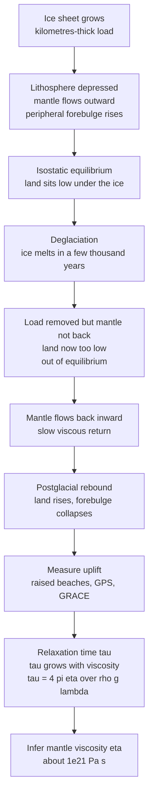

# 🧊 Postglacial Rebound and Mantle Viscosity

> [!abstract] TL;DR
> Press a mile-thick ice sheet onto a continent for 100,000 years and the solid Earth sinks; melt it away in a few thousand years and the land keeps rising for tens of millennia afterward. That slow bounce-back — **glacial isostatic adjustment (GIA)** — is not elastic recoil but **viscous flow**: the mantle oozes back into place with a **relaxation time** $\tau$ set by its **viscosity** $\eta$. Because the rate of rebound depends directly on how stiff the deep Earth is, GIA is our single best **natural viscometer**, pinning the mantle at $\sim\!10^{21}$ Pa·s (upper) rising to $\sim\!10^{22}$–$10^{23}$ Pa·s (lower). Fennoscandia and Hudson Bay still rise $\sim\!1$ cm/yr today; the same physics forces us to **subtract GIA** from tide-gauge and satellite records before we can read true climate-driven sea-level rise.

## Intuition — analogy FIRST

Press your thumb hard into a memory-foam mattress, then lift it away. The dent does not snap back — it rises *slowly, sluggishly*, filling in over several seconds. The foam is not springy (elastic); it is **viscous**, and the *speed* at which the dent recovers tells you how thick and gooey the foam is. A stiffer foam recovers slower; a softer one springs back faster.

Now scale that up by a planet. A mile-thick ice sheet pressed down on Scandinavia and Canada for roughly 100,000 years, squeezing the underlying mantle sideways like your thumb squeezing foam. The ice melted about 10,000 years ago — the thumb lifted — and the land is **still rising today**. Sweden's coast climbs about a centimetre a year; Viking-age harbours now sit stranded far inland; the Gulf of Bothnia is slowly draining as its floor lifts. The mantle is oozing back into the dent like ultra-slow memory foam. And just as with the mattress, the **rate** of that rebound is a direct readout of how **viscous** the deep Earth really is. GIA turns the whole planet into an experiment we could never run in a lab: load the mantle over an ice age, then watch — for ten thousand years — how fast it relaxes.

---

## How It Works

### Core Mechanics

1. **Loading depresses the lithosphere.** An ice sheet is a distributed weight. Beneath it the strong, cold **lithosphere** flexes down, and to make room the underlying **mantle flows outward** and sideways. A ring of uplift — the **peripheral forebulge** — rises a few hundred kilometres beyond the ice margin, like the rim of dough pushed up around a thumbprint.

2. **The response is viscoelastic, not elastic.** The Earth reacts on two clocks. An **instantaneous elastic** deflection happens the moment load changes (seconds), then a **delayed viscous** flow continues for millennia. This is a **Maxwell rheology**: a spring (elastic) in series with a dashpot (viscous). Over human timescales the elastic part is done; the *slow* signal we watch is pure viscous relaxation.

3. **Deglaciation flips the sign.** When the ice melts, the load vanishes but the mantle has not yet returned. The land now sits *too low* — out of isostatic equilibrium — so the mantle flows **back inward** and the depressed region **rebounds** while the forebulge **collapses** (subsides).

4. **The rate is set by viscosity through a relaxation time.** For a simple viscous half-space carrying a load of wavelength $\lambda$, the remaining depression decays exponentially, $w(t)=w_0\,e^{-t/\tau}$, with a **relaxation time**
$$\tau \;\approx\; \frac{4\pi\,\eta}{\rho\,g\,\lambda}.$$
Stiffer mantle (larger $\eta$) $\Rightarrow$ longer $\tau$ $\Rightarrow$ more sluggish rebound. This is the whole game: **measure the rebound, invert for $\eta$.**

5. **Wavelength selects depth.** A narrow load stirs only shallow mantle; a continent-wide ice sheet ($\lambda\sim3000$ km) deforms mantle down to roughly $\lambda/2$ — into the **lower mantle**. Comparing rebound at different wavelengths separates **upper- vs lower-mantle viscosity**.

6. **Many independent observables, one Earth.** Raised and radiocarbon-dated beaches, tilted shorelines, tide gauges, continuous **GPS** vertical velocities, **GRACE** gravity change, and even shifts in Earth's oblateness ($J_2$) and rotation (**true polar wander**) all record the same relaxing mantle — over-determining the viscosity profile.

### Flow / Architecture



---

## Key Concepts

### Secondary Level

**Isostasy — the Earth floats.** Continents ride on the denser mantle like blocks of wood on water: a taller block sits higher *and* deeper. Pile weight on top (an ice sheet) and the block sinks; take the weight off and it rises back. That rising-back after the ice is gone is **postglacial rebound**.

**Why it is slow.** Water lets a floating block bob up in an instant, but the mantle is not water — it is solid rock that flows only extremely slowly, over thousands of years. So the rebound is drawn out across the whole Holocene. Scandinavia has risen hundreds of metres since the ice left and is **still rising about 1 cm a year**; ancient shorelines and harbours are now stranded high and dry inland.

**Why anyone cares.** The land going *up* looks exactly like the sea going *down* (or *up*, where the forebulge is sinking). To measure real, climate-driven sea-level change we must first strip out this leftover "the ground is still moving" signal.

### Undergraduate Level

**The load, the depression, the rebound.** An ice column of thickness $h_i$ and density $\rho_i$ depresses the surface until buoyancy balances weight, giving an isostatic depression $w_0 \approx (\rho_i/\rho_m)\,h_i$. A 2.5 km ice sheet ($\rho_i\approx917$, $\rho_m\approx3300$) presses the land down $\sim\!700$ m. After deglaciation the deficit $w_0$ relaxes away.

**Elastic vs viscous vs viscoelastic.** A purely **elastic** Earth would rebound *instantly* and completely — no lingering uplift today. A purely **viscous** Earth would flow forever with no elastic snap. The real Earth is **viscoelastic (Maxwell)**: a fast elastic step plus a slow exponential viscous tail. The tail is what we still see 10,000 years on, and its **time constant** is the observable that carries the viscosity.

**Relaxation time.** Model the mantle as a viscous half-space under a sinusoidal load of wavelength $\lambda$. Balancing the driving buoyancy stress $\rho g w$ against viscous resistance gives exponential relaxation with
$$\tau \;\approx\; \frac{4\pi\,\eta}{\rho\,g\,\lambda}, \qquad w(t)=w_0\,e^{-t/\tau}, \qquad \dot w = -\frac{w}{\tau}.$$
The last identity is powerful: for exponential decay the **present uplift rate equals the present remaining depression divided by $\tau$** — so measuring both the rate and the disequilibrium pins $\tau$, hence $\eta$.

**The Haskell number.** Plug Fennoscandia's numbers — $\tau\approx4400$ yr, $\lambda\approx3000$ km, $\rho\approx3300$, $g\approx9.8$ — into $\eta = \tau\rho g\lambda/4\pi$ and you recover $\eta\approx10^{21}$ Pa·s. This is essentially Haskell's 1935 estimate, one of the great numbers of solid-Earth geophysics, still correct to within a factor of a few.

### Graduate Level

**Layered viscoelastic Earth models.** Real GIA modelling replaces the half-space with a spherically symmetric, self-gravitating, **Maxwell viscoelastic** Earth (elastic lithosphere over a viscosity-stratified mantle) and solves the **sea-level equation** — a gravitationally self-consistent equation that redistributes meltwater over a deforming solid Earth and a changing geoid, conserving mass. **Normal-mode / relaxation-mode** methods (Peltier 1974) decompose the response into a spectrum of decaying modes with their own relaxation times.

**The ice-history / Earth-rheology trade-off.** Any predicted uplift depends on **two** unknowns: the **ice history** (where and when ice loaded the Earth) and the **Earth rheology** (lithospheric thickness plus the radial viscosity profile). These are partly degenerate — a thicker ice sheet on a stiffer mantle can mimic a thinner sheet on a softer one. Breaking the trade-off requires data at *many* sites and wavelengths: **relative sea-level (RSL) curves** from dated beaches near and far from ice centres, **forebulge collapse** along the US east coast, GPS, and GRACE. Peltier's **ICE-nG** series (ICE-3G $\to$ ICE-5G $\to$ ICE-6G_C, coupled to the VM2/VM5a viscosity profiles) are the canonical joint solutions.

**Upper vs lower mantle.** Because relaxation depth scales with load wavelength, the broad Laurentide/Fennoscandian loads constrain the **lower-mantle** viscosity while narrower features and forebulge dynamics constrain the **upper mantle** and lithospheric thickness. Inversions typically find upper-mantle $\eta\sim(0.3\text{–}1)\times10^{21}$ Pa·s and lower-mantle $\eta\sim(1\text{–}30)\times10^{21}$ Pa·s — a viscosity **increase with depth** by roughly one to two orders of magnitude.

**Rotational and gravitational signatures.** Redistributing mass by GIA changes Earth's inertia tensor: it drives a secular decrease then reversal in the dynamic oblateness $\dot J_2$ and contributes to **true polar wander** (drift of the rotation pole toward Hudson Bay). These global integrals give an *independent* handle on lower-mantle viscosity, complementing the local RSL data.

**Relaxation time is not the Maxwell time.** The material **Maxwell time** $\tau_M=\eta/\mu$ (viscosity over shear modulus) for the mantle is only $\sim\!$ centuries; the **observed rebound relaxation time** $\tau\sim$ several thousand years is a *structural* timescale set by the load geometry, gravity, and density — the two must never be conflated.

---

## Python Demo

```python
# Postglacial rebound as VISCOUS RELAXATION of a loaded viscous half-space.
#   (a) forward model  w(t) = w0 * exp(-t/tau), with tau = 4*pi*eta/(rho*g*lambda);
#       show that higher viscosity -> longer tau -> more sluggish rebound,
#       and mark the present-day observed uplift rate (~1 cm/yr);
#   (b) invert: given an observed present-day uplift rate, back out mantle viscosity;
#   (c) show how far a load of a given wavelength reaches into the mantle.
# Requires numpy + matplotlib.
import numpy as np
import matplotlib.pyplot as plt

# --- physical constants (Haskell viscous half-space) --------------------------
YEAR  = 3.156e7        # s per year
rho_m = 3300.0         # mantle density, kg/m^3
g     = 9.81           # gravity, m/s^2
lam   = 3.0e6          # dominant load wavelength ~ 3000 km (continental ice sheet)
w0    = 700.0          # initial isostatic depression under ~2.5 km of ice, metres

def tau_years(eta):
    """Relaxation time (yr) of a viscous half-space: tau = 4*pi*eta/(rho*g*lambda)."""
    return 4.0*np.pi*eta / (rho_m*g*lam) / YEAR

def eta_from_tau(tau_yr):
    """Invert the relaxation-time relation for viscosity (Pa.s)."""
    return tau_yr*YEAR * rho_m*g*lam / (4.0*np.pi)

# --- (a) FORWARD: rebound curves for two mantle viscosities -------------------
etas   = [1e21, 3e21]                       # softer vs stiffer mantle
colors = ["#2563eb", "#dc2626"]
t      = np.linspace(0, 25000, 501)         # years since deglaciation

fig, ((axU, axR), (axInv, axWav)) = plt.subplots(2, 2, figsize=(12.5, 9.5))

print("Relaxation times:")
for eta, c in zip(etas, colors):
    tau  = tau_years(eta)                    # yr
    w    = w0*np.exp(-t/tau)                  # remaining depression, m
    rate = (w0/tau)*np.exp(-t/tau)*100.0      # uplift rate, cm/yr  (rate = w/tau)
    axU.plot(t/1000, w, color=c, lw=2,
             label=f"eta={eta:.0e} Pa.s  ->  tau={tau:,.0f} yr")
    axR.plot(t/1000, rate, color=c, lw=2, label=f"eta={eta:.0e} Pa.s")
    print(f"  eta={eta:.0e} Pa.s  ->  tau={tau:,.0f} yr,"
          f"  initial rate {w0/tau*100:.2f} cm/yr")

t_now = 10.0                                  # kyr since deglaciation (present day)
for ax in (axU, axR):
    ax.axvline(t_now, color="gray", ls="--", lw=1)
axR.axhline(1.0, color="green", ls=":", lw=1.6, label="observed ~1 cm/yr")

axU.set_title("(a) Remaining depression w(t) = w0 exp(-t/tau)")
axU.set_xlabel("Time since deglaciation (kyr)"); axU.set_ylabel("Depression left to recover (m)")
axU.annotate("present day", xy=(t_now, 300), xytext=(13, 500),
             arrowprops=dict(arrowstyle="->"))
axU.legend(); axU.grid(alpha=0.3)

axR.set_title("(b) Uplift RATE: softer mantle rebounds faster, then fades")
axR.set_xlabel("Time since deglaciation (kyr)"); axR.set_ylabel("Uplift rate (cm/yr)")
axR.legend(); axR.grid(alpha=0.3)

# --- (b) INVERT: observed present-day uplift rate -> implied mantle viscosity --
# For fixed w0 and time-since-deglaciation, present rate = (w0/tau) exp(-t_now/tau).
# On the "mostly-relaxed" branch tau < t_now this is monotone in tau, so invert
# by interpolation.  (A second, high-viscosity branch tau > t_now also fits the
# same rate; it is ruled out by the LARGE rebound already recorded in raised
# beaches -- exactly why a single number is not enough. See Common Pitfalls.)
t_now_yr  = 10000.0
tau_grid  = np.linspace(500.0, 9900.0, 6000)                 # fast branch, yr
rate_grid = (w0/tau_grid)*np.exp(-t_now_yr/tau_grid)*100.0    # cm/yr, increasing
obs_rates = np.linspace(0.4, 1.6, 200)                        # cm/yr scan
tau_inv   = np.interp(obs_rates, rate_grid, tau_grid)         # invert
eta_inv   = eta_from_tau(tau_inv)

# the canonical observed value
tau1 = np.interp(1.0, rate_grid, tau_grid)
eta1 = eta_from_tau(tau1)
print(f"\nInversion of observed ~1 cm/yr present uplift:")
print(f"  implied tau ~ {tau1:,.0f} yr  ->  eta ~ {eta1:.2e} Pa.s")

axInv.plot(obs_rates, eta_inv, color="#7c3aed", lw=2)
axInv.scatter([1.0], [eta1], color="k", zorder=5)
axInv.annotate(f"1 cm/yr -> eta~{eta1:.1e} Pa.s", xy=(1.0, eta1),
               xytext=(0.5, eta1*2.2), arrowprops=dict(arrowstyle="->"))
axInv.set_yscale("log")
axInv.set_title("(c) Invert observed rate -> mantle viscosity")
axInv.set_xlabel("Observed present uplift rate (cm/yr)")
axInv.set_ylabel("Implied mantle viscosity eta (Pa.s, log)")
axInv.grid(alpha=0.3, which="both")

# --- (c) DEPTH SAMPLED vs load wavelength: long loads probe the deep mantle ----
wl_km    = np.linspace(50, 4000, 400)
depth_km = wl_km/2.0                                  # deformation reaches ~ lambda/2
axWav.plot(wl_km, depth_km, color="#0891b2", lw=2)
axWav.axhspan(0,   660,  alpha=0.15, color="orange", label="upper mantle")
axWav.axhspan(660, 2000, alpha=0.15, color="brown",  label="lower mantle")
for name, wl in [("alpine glacier", 150), ("Fennoscandia", 1500), ("Laurentide", 3000)]:
    axWav.scatter([wl], [wl/2], color="k", zorder=5)
    axWav.annotate(name, xy=(wl, wl/2), xytext=(wl-300, wl/2+250))
axWav.set_title("(d) Deeper mantle is sampled by wider loads")
axWav.set_xlabel("Load wavelength (km)")
axWav.set_ylabel("Approx. depth deformed ~ lambda/2 (km)")
axWav.legend(loc="upper left"); axWav.grid(alpha=0.3)

plt.tight_layout()
plt.savefig("postglacial_rebound_demo.png", dpi=120)
print("\nSaved figure to postglacial_rebound_demo.png")
```

Running it prints relaxation times of $\sim\!4100$ yr for $\eta=10^{21}$ Pa·s and $\sim\!12{,}300$ yr for $\eta=3\times10^{21}$ Pa·s, confirming **stiffer mantle $\to$ longer $\tau$ $\to$ more sluggish rebound**. Panel (b) shows the softer mantle rebounding fast and then fading, while the stiffer one lags but sustains. The inversion in panel (c) turns an observed $\sim\!1$ cm/yr present uplift into $\eta\sim10^{21}$ Pa·s — Haskell's number — and its log-axis slope makes the **sensitivity** plain: a factor-of-two error in the observed rate moves the inferred viscosity by well under an order of magnitude, which is why GIA is such a robust viscometer. Panel (d) shows that only continent-scale loads reach into the **lower mantle**, so upper- and lower-mantle viscosities must be separated with loads of different width.

---

## Real-World Applications

> **Example — GRACE watches Hudson Bay rise.** The Laurentide ice sheet's former centre under Hudson Bay still hosts a broad **negative gravity anomaly** — a leftover mass deficit from mantle that has not yet flowed fully back. GRACE and GRACE-FO measure the *rate* at which that anomaly fills in, giving a direct, present-day constraint on lower-mantle viscosity that is completely independent of the raised-beach record.

- **Correcting sea-level records for climate science.** Tide gauges measure sea surface *relative to land*; if the land is rising (Scandinavia) or the forebulge is sinking (US mid-Atlantic coast), the gauge reads a GIA signal on top of climate-driven change. Every global sea-level budget must **subtract a GIA model** (the "GIA correction") — for satellite altimetry it is a small but non-negligible bias in the global-mean rate.
- **Ice-sheet stability feedback.** As an ice sheet thins, the bedrock beneath it **rebounds**, lifting the grounding line and reducing ocean contact — a **stabilising** feedback now built into Antarctic and Greenland ice-sheet models. Mantle viscosity sets how fast that bedrock help arrives.
- **Reconstructing past ice sheets.** Inverting RSL curves for ice history reconstructs the thickness and retreat chronology of the Laurentide and Fennoscandian sheets — data that feed paleoclimate and meltwater-pulse studies.
- **Geodetic reference frames and hazard.** GIA produces steady vertical (and horizontal) crustal motion that must be modelled to maintain precise reference frames and to separate the tectonic strain that matters for earthquakes from the background rebound signal.
- **Earth-rotation and length-of-day studies.** GIA's contribution to $\dot J_2$ and true polar wander must be removed to isolate present-day ice-mass and ocean signals in the rotation record.

---

## Common Pitfalls

- **GIA vs eustatic sea level.** *Eustatic* change is a change in ocean **volume/mass** (melting ice, thermal expansion); GIA is the solid Earth and geoid **deforming** underneath. A raised beach in Scandinavia does **not** mean the ocean fell — the land rose. Attributing a relative-sea-level trend entirely to climate without removing GIA is a classic error, and the sign even flips between the ice centre (falling RSL) and the collapsing forebulge (rising RSL).
- **Relaxation time $\ne$ Maxwell time.** The mantle's material Maxwell time $\eta/\mu$ is only centuries; the observed rebound time constant is *thousands* of years and is a structural timescale $\tau\approx4\pi\eta/\rho g\lambda$ set by load geometry, gravity, and density. Confusing the two mis-estimates viscosity by orders of magnitude.
- **Elastic vs viscous vs viscoelastic.** A purely elastic Earth would have finished rebounding instantly (no signal today); a purely viscous Earth has no instantaneous response. Only the **viscoelastic (Maxwell)** picture — fast elastic step plus slow viscous tail — reproduces both the immediate flexure and the ongoing millennial uplift.
- **A single present-day rate does not pin viscosity.** The same present uplift rate can arise from a soft mantle that has nearly finished rebounding **or** a stiff mantle still early in its rebound (the two branches in the demo). The ambiguity is broken only by using the **whole history** — dated relative-sea-level curves, **forebulge collapse**, GPS *and* GRACE together.
- **Decoupling ice history from Earth rheology.** Predicted uplift depends jointly on where/when ice sat *and* on mantle viscosity + lithospheric thickness; these trade off. Fitting one site can be done with the "wrong" pair. Robust inversions (ICE-nG/VMx) demand many sites and wavelengths simultaneously.
- **Forgetting self-gravitation and the moving geoid.** Melting ice not only unloads the crust, it also lowers its own gravitational pull on the ocean, so sea level near a shrinking ice sheet can *fall*. Proper GIA uses the gravitationally self-consistent **sea-level equation**, not a flat "add water uniformly" bathtub model.

---

## Related Concepts

- **Sibling notes** (this Geophysics section) — *Isostasy_and_Lithospheric_Flexure* provides the static buoyancy and plate-flexure backbone that GIA sets into motion; *Rheology_and_Deformation_of_the_Earth* supplies the Maxwell viscoelastic constitutive law behind the relaxation time; *Mantle_Convection_and_Dynamics* uses the very viscosity that GIA measures; *Earths_Gravity_Field_and_Geodesy* explains the geoid and gravity anomalies that GIA perturbs; *Space_Geodesy_GPS_and_Crustal_Deformation* is how present-day uplift is actually measured.
- [[Gravity_Isostasy_and_the_Geoid]] — the static isostatic balance whose *disturbance and slow restoration* is exactly postglacial rebound; also the source of the residual gravity lows over former ice centres
- [[Glaciers_and_Glacial_Landscapes]] — the ice sheets whose growth and melt are the load history that drives GIA
- [[Sea_Level_Rise_and_Ocean_Mass_Change]] — GIA is the correction that must be removed from these records to isolate the climate signal
- [[Sea_Level_Rise_and_the_Cryosphere]] — links melting cryosphere (the unloading) to the sea-level budget GIA distorts
- [[Paleoclimatology_and_Ice_Cores]] — Quaternary glacial cycles that set the timing of loading and deglaciation
- [[Viscosity_and_Stress_in_Fluids]] — the fluid-mechanics definition of viscosity that, applied to solid mantle rock, gives the $\sim\!10^{21}$ Pa·s here
- [[Low_Reynolds_Number_Flow]] — mantle rebound is creeping, inertia-free Stokes flow; the same slow-viscous-flow regime
- [[Mantle_Convection_and_Hotspots]] — the long-term flow of the same viscous mantle, driven by heat rather than surface loads

---

## Review Questions

1. **Secondary:** Scandinavia is rising about a centimetre a year even though no ice has sat on it for 10,000 years. In everyday terms, *why is it still rising*, and why does this look — to a tide gauge on that coast — like the sea is falling?
2. **Undergraduate:** Using $\tau\approx 4\pi\eta/(\rho g\lambda)$ with $\rho=3300$ kg/m³, $g=9.8$ m/s², and $\lambda=3000$ km, (a) show that a rebound relaxation time of $\sim\!4400$ yr implies a mantle viscosity of order $10^{21}$ Pa·s; (b) for exponential decay $w=w_0e^{-t/\tau}$, prove that the present uplift *rate* equals the present *remaining depression* divided by $\tau$, and explain why this makes the pair "current rate + current disequilibrium" enough to estimate $\tau$.
3. **Graduate:** Two GIA models — a soft upper mantle with thin lithosphere, and a stiffer mantle with thick lithosphere — fit the *present-day uplift rate* at Fennoscandia's centre equally well. (a) Explain the ice-history / Earth-rheology trade-off that makes this possible. (b) Which additional observables (RSL curves at varying distance, forebulge collapse, GPS horizontals, GRACE, $\dot J_2$) would you bring in to break the degeneracy, and specifically why does load *wavelength* let you separate upper- from lower-mantle viscosity?

---

## Sources

- Turcotte, D. L. & Schubert, G. — *Geodynamics*, 3rd ed., Ch. 6 (postglacial rebound, viscous half-space relaxation time, the Haskell estimate)
- Cathles, L. M. (1975) — *The Viscosity of the Earth's Mantle*, Princeton University Press (foundational GIA inversion for mantle viscosity)
- Peltier, W. R. (2004) — "Global glacial isostasy and the surface of the ice-age Earth: the ICE-5G (VM2) model," *Annu. Rev. Earth Planet. Sci.* 32, 111–149
- Peltier, W. R., Argus, D. F. & Drummond, R. (2015) — "Space geodesy constrains ice-age terminal deglaciation: The global ICE-6G_C (VM5a) model," *J. Geophys. Res. Solid Earth* 120, 450–487
- Fowler, C. M. R. — *The Solid Earth: An Introduction to Global Geophysics*, 2nd ed. (isostasy, flexure, and glacial rebound)

---

#geophysics #glacial-isostatic-adjustment #mantle-viscosity #sea-level #geodynamics
