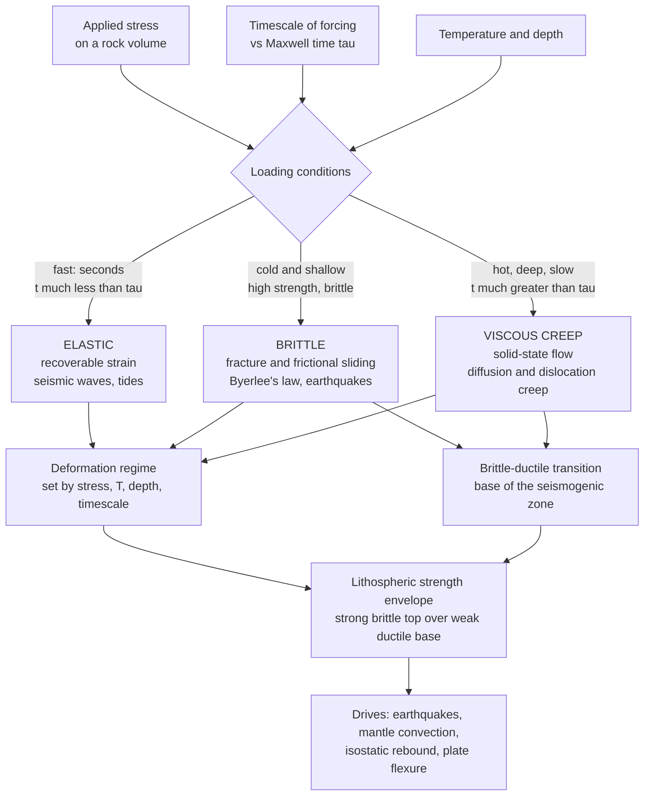

# 🌍 Rheology and Deformation of the Earth

> [!abstract] TL;DR
> **Rheology** is the science of how a material flows and deforms — and the Earth's defining trick is that *the same rock* behaves completely differently depending on **how fast, how hot, and how deep** you load it. Over **seconds** the mantle is a rigid **elastic** solid that carries earthquake waves; in the **cold, shallow** crust rock is **brittle**, fracturing and sliding on faults (strength set by **Byerlee's law**, rising with depth); in the **hot, deep** interior rock is a **viscous** fluid that undergoes solid-state **creep** and flows over millions of years to drive mantle convection. Which regime wins is decided by the **Maxwell time** $\tau = \eta/\mu$ (viscosity over rigidity): loads much shorter than $\tau$ are elastic, loads much longer are viscous. Stacking brittle-on-top-of-ductile with depth gives the **lithospheric strength envelope** — the master diagram of how strong the outer Earth really is.

---

## Intuition

**Analogy:** **Silly Putty** is the perfect teacher. Roll it into a ball and hit it with a hammer and it **shatters** like glass — a brittle solid. Leave that same ball on a table overnight and it slowly **spreads into a puddle** like a liquid. Bounce it and it springs back — elastic. One material, three utterly different personalities, and the *only* thing that changed is the **timescale** of the force: fast → elastic/brittle, slow → viscous flow.

The Earth's rocks are Silly Putty scaled up to a planet. Over the **seconds** of an earthquake, the mantle is stiff enough to transmit seismic waves as a rigid elastic solid. Over **millions of years**, that identical mantle flows like cold honey, dragging continents across the globe and slowly rebounding under melted ice sheets. Rheology is the science of this **dual personality** — the rules that decide, for a given stress, temperature, depth, and timescale, whether a rock **breaks, bends, or flows**.

---

## How It Works

### Core Mechanics

1. **Three end-member behaviors.** A rock's response to stress $\sigma$ falls into three idealized modes:
   - **Elastic** — strain is instantaneous and *recoverable*: $\sigma = \mu\,\varepsilon$ (Hooke's law). Remove the load and it springs back. Dominates on **short** timescales (seismic waves, tides).
   - **Brittle** — once stress exceeds the rock's strength it **fractures** and slides frictionally. This is *irrecoverable* and *discontinuous* — it is what an earthquake is.
   - **Viscous** — strain *rate* is proportional to stress, $\sigma = \eta\,\dot{\varepsilon}$ (Newtonian) or $\dot{\varepsilon}\propto\sigma^n$ (power-law). The material flows and never springs back. Dominates on **long** timescales in the **hot** interior.
2. **Brittle strength rises with depth — Byerlee's law.** Frictional sliding on a fault resists with shear stress proportional to the normal stress clamping it shut: $\tau = \mu_f\,\sigma_n$, with a nearly rock-*independent* friction coefficient $\mu_f \approx 0.6$–$0.85$ (**Byerlee's law**). Because $\sigma_n$ grows with the weight of overburden ($\propto \rho g z$), the crust gets **stronger with depth**. Pore-fluid pressure (factor $\lambda$) pushes the fault open and *weakens* it. This is the **Mohr-Coulomb / frictional** regime that defines the **seismogenic zone**.
3. **Ductile strength falls with depth — thermally activated creep.** Deep and hot, atoms and crystal defects become mobile and the rock flows in the *solid state*. The creep law is Arrhenius-thermally-activated:
   $$\dot{\varepsilon} = A\,\sigma^{\,n}\,\exp\!\left(-\frac{Q}{RT}\right),$$
   so the stress needed to sustain a given strain rate, $\sigma \propto \exp(Q/nRT)$, **collapses exponentially as temperature rises with depth**. Two flavors:
   - **Diffusion creep** ($n=1$, Newtonian) — atoms migrate through/around grains; strongly **grain-size sensitive** ($\propto d^{-2}$ to $d^{-3}$); dominates at low stress and fine grains.
   - **Dislocation creep** ($n\approx3$–$5$, non-Newtonian) — crystal dislocations glide and climb; grain-size *insensitive*; dominates at higher stress. (See [[Fatigue_Creep_and_High_Temperature_Failure]] and [[Plastic_Deformation_and_Slip_Systems]] for the metallurgy of the same mechanisms.)
4. **The brittle-ductile transition (BDT).** Brittle strength rises, ductile strength falls — they **cross**. The crossover depth (typically 10–20 km in continental crust) is the **brittle-ductile transition**, marking the base of the seismogenic zone: above it rock stores stress and ruptures in earthquakes; below it rock flows aseismically.
5. **Viscoelasticity and the Maxwell time.** Real rock is **both** elastic and viscous. The **Maxwell model** — a spring (rigidity $\mu$) in *series* with a dashpot (viscosity $\eta$) — captures it: apply a sudden strain and the stress **relaxes** as $\sigma(t) = \sigma_0\,e^{-t/\tau}$; apply a constant stress and you get an instant **elastic jump** followed by steady **viscous flow**. The crossover is the **Maxwell time**:
   $$\boxed{\;\tau = \frac{\eta}{\mu}\;}$$
   Loads with duration $t \ll \tau$ see an **elastic solid**; loads with $t \gg \tau$ see a **viscous fluid**. For the mantle ($\eta\sim10^{21}\,\text{Pa·s}$, $\mu\sim70\,\text{GPa}$), $\tau\sim500$ years — so seismic waves (seconds) are elastic, but post-seismic relaxation and post-glacial rebound (thousands of years) are viscous.
6. **The lithospheric strength envelope.** Plot the *minimum* of brittle and ductile strength versus depth and you get the **strength envelope** — a "Christmas-tree" profile. A strong brittle upper crust, a weak ductile lower crust, then (across the Moho) a strong upper mantle gives the famous **"jelly sandwich"**. The integrated area is the total force the lithosphere can support; its elastic core defines the **effective elastic thickness** $T_e$ that governs how plates flex under loads.

### Flow / Architecture



---

## Key Concepts

**Secondary (intuition level).** Rock is like Silly Putty: hit it fast and it cracks (brittle), push it slowly and it flows (viscous), bounce it and it springs back (elastic). Which one happens depends on **how fast, how hot, and how deep**. Near the cold surface, rock is strong and breaks in **earthquakes**, and it gets *stronger* the deeper you go because the weight above squeezes cracks shut. Deep down, where it is hot, rock gets *weaker* and slowly **flows** — which is how the mantle can churn and how the ground slowly rises back up after glaciers melt.

**Undergraduate (working level).** Three constitutive laws compete: elastic ($\sigma=\mu\varepsilon$), brittle-frictional (**Byerlee's law** $\tau=\mu_f\sigma_n$, strength $\propto\rho g z(1-\lambda)$, *increasing* with depth), and viscous **power-law creep** ($\dot\varepsilon = A\sigma^n e^{-Q/RT}$, strength *decreasing* with depth as $T$ rises). Their intersection is the **brittle-ductile transition**. Viscoelasticity is modeled by putting a spring and dashpot in series (**Maxwell body**), giving **stress relaxation** $\sigma=\sigma_0 e^{-t/\tau}$ with **Maxwell time** $\tau=\eta/\mu$. The depth-dependent minimum of brittle and ductile strength is the **lithospheric strength envelope**, whose integral is plate strength and whose elastic core sets the **effective elastic thickness** for flexure.

**Graduate (rigorous level).** Creep is a *deformation-mechanism map* in stress–temperature–grain-size space: diffusion creep (Nabarro-Herring through-grain, Coble grain-boundary; $n=1$, $\dot\varepsilon\propto d^{-2..-3}$) versus dislocation creep ($n\approx3$–$5$, grain-size-insensitive), with Peierls (low-$T$ plasticity) at high stress and pressure-dependent activation via $Q\to E^*+PV^*$ at depth. Effective viscosity $\eta_{\text{eff}}=\sigma/(2\dot\varepsilon)$ is therefore **stress-, temperature-, pressure-, grain-size-, and water-fugacity-dependent** — never a constant. Generalized viscoelasticity uses Maxwell, Kelvin-Voigt, and Burgers bodies (transient + steady-state creep) with a *spectrum* of relaxation times; the mantle's steady-state viscosity ($\sim10^{21}\,\text{Pa·s}$, with a weaker asthenosphere) is inverted from **post-glacial rebound** decay times and the **geoid**. Strength-envelope models feed the **jelly-sandwich vs crème-brûlée** debate over where lithospheric strength resides, and set $T_e$ that couples deformation to gravity/flexure observations.

---

## Python Demo

```python
# Rheology of the Earth: Maxwell viscoelasticity + the lithospheric strength envelope.
# (a) Maxwell STRESS RELAXATION: sigma(t) = sigma0 * exp(-t/tau), tau = eta/mu.
#     Short loads (seismic) are elastic; long loads (rebound) are viscous.
# (b) Maxwell CREEP under constant stress: instant elastic jump + linear viscous flow.
# (c) LITHOSPHERIC STRENGTH ENVELOPE: brittle (Byerlee, rising) vs ductile creep
#     (Arrhenius, falling) -> brittle-ductile transition and the "jelly sandwich".
# (d) Effective viscosity vs temperature (Arrhenius): why the deep mantle flows.
import numpy as np
import matplotlib.pyplot as plt

# ===========================================================================
# (a) & (b)  MAXWELL VISCOELASTIC MODEL  (spring mu in series with dashpot eta)
# ===========================================================================
mu  = 70e9          # shear modulus (rigidity) [Pa]  ~ upper mantle
YR  = 3.156e7       # seconds per year

# Three materials spanning the Earth's viscosity range -> different Maxwell times
visc = {                       # name : viscosity eta [Pa s]
    "Asthenosphere (1e19)": 1e19,
    "Mantle (1e21)":        1e21,
    "Cold lithosphere (1e23)": 1e23,
}

t = np.logspace(-1, 14, 500)   # 0.1 s  ->  ~3 million years
print("Maxwell times tau = eta / mu :")
relax = {}
for name, eta in visc.items():
    tau = eta / mu
    relax[name] = (np.exp(-t / tau), tau)
    print(f"  {name:26s} tau = {tau:9.3e} s = {tau/YR:10.3e} yr")

# (b) Creep: constant stress sigma0 -> strain = elastic jump + viscous flow
sigma0 = 10e6                  # applied stress [Pa] = 10 MPa
eta_m  = 1e21                  # use mantle viscosity
t_creep = np.linspace(0, 3000*YR, 400)
eps_elastic = sigma0 / mu                      # instantaneous, recoverable
eps_total   = eps_elastic + sigma0 / eta_m * t_creep   # + linear viscous flow

# ===========================================================================
# (c) LITHOSPHERIC STRENGTH ENVELOPE  (differential stress vs depth)
# ===========================================================================
g      = 9.8
z      = np.linspace(0, 60e3, 600)             # depth 0..60 km
Ts, dTdz = 288.0, 25e-3                         # surface T [K], geotherm [K/m]
T      = Ts + dTdz * z                          # temperature(depth)
lam    = 0.4                                     # hydrostatic pore-fluid factor
rho    = 2900.0                                  # mean crustal density [kg/m^3]
P      = rho * g * z                             # lithostatic pressure [Pa]

# Brittle: Byerlee frictional strength (thrust regime), differential stress
muf   = 0.6
kfric = (np.sqrt(1 + muf**2) + muf) ** 2        # sigma1/sigma3 ratio at failure
brittle = (kfric - 1.0) * P * (1.0 - lam)       # [Pa]

# Ductile power-law creep: sigma = (edot/A)^(1/n) * exp(Q/(nRT))
R    = 8.314
edot = 1e-14                                    # tectonic strain rate [1/s]
def creep_strength(A, n, Q, T):                 # A in MPa^-n s^-1 -> returns Pa
    return 1e6 * (edot / A) ** (1.0 / n) * np.exp(Q / (n * R * T))

# Crust (wet-quartz-like) above the Moho; olivine mantle below
moho = 35e3
ductile_crust  = creep_strength(A=1e-1, n=3.0, Q=250e3, T=T)
ductile_mantle = creep_strength(A=1e1,  n=3.5, Q=530e3, T=T)
ductile = np.where(z < moho, ductile_crust, ductile_mantle)

# Envelope = weaker of brittle vs ductile at each depth
envelope = np.minimum(brittle, ductile)
bdt_idx  = np.argmin(np.abs(brittle - ductile_crust))   # brittle-ductile transition
bdt_depth = z[bdt_idx] / 1e3
print(f"\nBrittle-ductile transition (crust) at ~{bdt_depth:.1f} km depth")

# ===========================================================================
# (d) Effective viscosity vs temperature (Arrhenius) -> why the mantle flows
# ===========================================================================
T_arr = np.linspace(600, 1600, 300)             # K
sig_ref = 1e6                                    # reference stress 1 MPa
edot_arr = 1e1 * (sig_ref/1e6) ** 3.5 * np.exp(-530e3 / (R * T_arr))  # olivine
eta_eff  = sig_ref / (2.0 * edot_arr)            # eta = sigma / (2 edot)

# ===========================================================================
# Plot
# ===========================================================================
fig, ax = plt.subplots(2, 2, figsize=(13, 10))

# (a) stress relaxation
for name, (rr, tau) in relax.items():
    ax[0,0].semilogx(t, rr, label=f"{name}")
    ax[0,0].axvline(tau, ls=":", lw=0.8, color="gray")
ax[0,0].axvspan(0.1, 100, color="#d6eaf8", alpha=0.6)
ax[0,0].axvspan(1e11, 1e14, color="#fdebd0", alpha=0.6)
ax[0,0].text(3, 0.05, "seismic\n(elastic)", fontsize=8, ha="center")
ax[0,0].text(3e12, 0.85, "rebound\n(viscous)", fontsize=8, ha="center")
ax[0,0].set_xlabel("time [s]  (log scale)")
ax[0,0].set_ylabel("stress / initial stress")
ax[0,0].set_title("(a) Maxwell stress relaxation: sigma = sigma0 exp(-t/tau)")
ax[0,0].legend(fontsize=8); ax[0,0].grid(alpha=0.3)

# (b) creep: elastic jump + viscous flow
ax[0,1].plot(t_creep/YR, eps_total*1e3, color="#c0392b", lw=2, label="total strain")
ax[0,1].axhline(eps_elastic*1e3, ls="--", color="#2980b9",
                label="instant elastic jump")
ax[0,1].annotate("elastic (recoverable)", xy=(50, eps_elastic*1e3),
                 xytext=(400, eps_elastic*1e3*0.55), fontsize=8,
                 arrowprops=dict(arrowstyle="->"))
ax[0,1].annotate("viscous flow\n(permanent)", xy=(2200, eps_total[-1]*1e3*0.9),
                 fontsize=8)
ax[0,1].set_xlabel("time [years]  (constant applied stress)")
ax[0,1].set_ylabel("strain  [x 1e-3]")
ax[0,1].set_title("(b) Maxwell creep: elastic-then-flowing")
ax[0,1].legend(fontsize=8); ax[0,1].grid(alpha=0.3)

# (c) strength envelope vs depth (depth increases downward)
ax[1,0].plot(brittle/1e6,  z/1e3, "--", color="#c0392b",  lw=1, label="brittle (Byerlee)")
ax[1,0].plot(ductile/1e6,  z/1e3, "--", color="#2980b9",  lw=1, label="ductile creep")
ax[1,0].plot(envelope/1e6, z/1e3, "-",  color="#000000",  lw=2.4, label="strength envelope")
ax[1,0].axhline(bdt_depth, color="#27ae60", ls=":", lw=1.2)
ax[1,0].axhline(moho/1e3, color="#8e44ad", ls=":", lw=1.2)
ax[1,0].text(5, bdt_depth-1.5, "brittle-ductile transition", fontsize=8, color="#27ae60")
ax[1,0].text(5, moho/1e3-1.5, "Moho", fontsize=8, color="#8e44ad")
ax[1,0].text(400, 5, "strong\nbrittle\nupper crust", fontsize=8, ha="center")
ax[1,0].text(120, 27, "weak ductile\nlower crust", fontsize=8, ha="center")
ax[1,0].text(220, 40, "strong upper\nmantle", fontsize=8, ha="center")
ax[1,0].set_xlim(0, 700); ax[1,0].invert_yaxis()
ax[1,0].set_xlabel("differential stress [MPa]")
ax[1,0].set_ylabel("depth [km]")
ax[1,0].set_title("(c) Lithospheric strength envelope ('jelly sandwich')")
ax[1,0].legend(fontsize=8, loc="lower right"); ax[1,0].grid(alpha=0.3)

# (d) effective viscosity vs temperature
ax[1,1].semilogy(T_arr, eta_eff, color="#16a085", lw=2)
ax[1,1].axhline(1e21, ls="--", color="gray")
ax[1,1].text(650, 1.5e21, "mantle ~ 1e21 Pa s", fontsize=8, color="gray")
ax[1,1].set_xlabel("temperature [K]")
ax[1,1].set_ylabel("effective viscosity [Pa s]  (log)")
ax[1,1].set_title("(d) Arrhenius: viscosity drops ~orders of magnitude with T")
ax[1,1].grid(alpha=0.3, which="both")

plt.tight_layout()
plt.savefig("rheology_of_the_earth.png", dpi=130)
print("\nSaved rheology_of_the_earth.png")
```

Running this prints the Maxwell times (mantle $\tau\approx450$ yr, so seconds-long seismic loads are elastic while millennium-long rebound is viscous) and the brittle-ductile transition depth (~13 km for the crustal parameters used), then draws four panels: **(a)** stress relaxing exponentially with a crossover at each material's Maxwell time; **(b)** the constant-stress creep curve showing an instant elastic jump followed by permanent linear viscous flow; **(c)** the classic strength envelope — brittle strength rising with depth, ductile strength collapsing with temperature, their minimum tracing a strong crust / weak lower crust / strong upper-mantle "jelly sandwich"; and **(d)** effective viscosity plunging orders of magnitude as temperature climbs, the reason the deep mantle can flow while the cold lithosphere cannot.

---

## Real-World Applications

- **Earthquakes and the seismogenic zone.** The brittle-ductile transition sets the *maximum depth* of crustal earthquakes (~10–20 km): stick-slip frictional failure above, aseismic creep below. Byerlee's law plus pore pressure explains why faults are weak when fluids are pumped in — the basis of understanding **induced seismicity** from wastewater injection.
- **Mantle convection and plate tectonics.** Because the hot mantle has finite viscosity ($\sim10^{21}$ Pa·s), it convects over $10^8$-year timescales, carrying plates on top. Rheology — especially the weak **asthenosphere** and temperature-dependent viscosity — controls convection style, slab behavior, and plate speeds (see the sibling note *Mantle_Convection_and_Dynamics*).
- **Post-glacial rebound.** When kilometer-thick ice sheets melt, the depressed crust rebounds over thousands of years — a load duration $\gg\tau$, so the mantle responds *viscously*. Measured rebound rates (Scandinavia, Hudson Bay) are the primary **inversion for mantle viscosity** (see *Postglacial_Rebound_and_Mantle_Viscosity*).
- **Isostasy and lithospheric flexure.** The elastic core of the strength envelope defines the **effective elastic thickness** $T_e$, which governs how the lithosphere bends under volcanoes, ice caps, and sediment loads — linking rheology to gravity and the geoid (see *Isostasy_and_Lithospheric_Flexure* and [[Gravity_Isostasy_and_the_Geoid]]).
- **Post-seismic deformation.** In the years after a great earthquake, GPS records transient afterslip and **viscoelastic relaxation** of the lower crust and mantle — a direct, human-timescale readout of the Maxwell/Burgers rheology of rocks.
- **Folding, faulting, and orogeny.** Whether a shortening crust **folds** (ductile) or **faults** (brittle) — and the wavelength of folds — is a rheological competition between strong and weak layers, the same physics that shapes mountain belts.

---

## Common Pitfalls

- **"Is rock solid or liquid?" — wrong question; ask over what TIMESCALE.** The same mantle is elastic to seismic waves (seconds), plastic in a fault zone, and viscous to glacial loads (millennia). Elastic vs brittle vs viscous is **not a fixed material property** — it is set by stress, temperature, and the loading duration relative to the **Maxwell time** $\tau=\eta/\mu$.
- **Treating viscosity as a constant.** Mantle viscosity is **not** a single number. It depends exponentially on temperature (Arrhenius), on pressure ($PV^*$), on stress (power-law $n\approx3$–5, so *non-Newtonian*), on **grain size** (diffusion creep $\propto d^{-2..-3}$), and on water content. Reporting "the viscosity of the mantle" without conditions is meaningless.
- **Confusing diffusion and dislocation creep.** Diffusion creep is **Newtonian** ($n=1$) and grain-size-sensitive; dislocation creep is **non-Newtonian** ($n\approx3$–5) and grain-size-insensitive. They dominate in different stress/grain-size fields, and mixing up their strain-rate scaling gives the wrong viscosity and the wrong seismic anisotropy.
- **Forgetting the brittle-ductile transition moves.** The BDT depth is not fixed — a hotter geotherm, faster strain rate, or wetter rock shifts it, changing seismogenic thickness. Warm settings (rifts, arcs) have shallow BDTs; cold cratons have deep ones.
- **Equating elastic thickness with crustal thickness.** The **effective elastic thickness** $T_e$ from flexure is the *mechanical* strength core of the envelope, generally *less* than the seismic crustal thickness and sometimes spanning into the mantle. Conflating them mis-estimates plate strength and the jelly-sandwich structure.
- **Ignoring pore fluids in the brittle regime.** Byerlee's law uses the *effective* normal stress $\sigma_n - P_f$. High pore pressure dramatically lowers fault strength; neglecting the pore-fluid factor $\lambda$ overestimates crustal strength and misses fluid-triggered and induced earthquakes.

---

## Related Concepts

- [[Elasticity_and_Seismic_Wave_Theory]] — the short-timescale, recoverable end-member of rheology; seismic velocities *are* the elastic response ($V_s=\sqrt{\mu/\rho}$) before creep or fracture ever occurs.
- [[Stress_Strain_and_Elastic_Moduli]] — the constitutive foundation: Hooke's law and the shear modulus $\mu$ that appears in both seismic velocity and the Maxwell time $\tau=\eta/\mu$.
- [[Polymer_Mechanics_and_Viscoelasticity]] — the materials-science treatment of the *identical* Maxwell/Kelvin-Voigt spring-and-dashpot models, stress relaxation, and creep — polymers are the lab analogue of mantle rock.
- [[Fatigue_Creep_and_High_Temperature_Failure]] — the engineering view of thermally activated creep and the Arrhenius $\exp(-Q/RT)$ law that makes hot metals (and hot rock) flow.
- [[Plastic_Deformation_and_Slip_Systems]] — dislocation glide and slip in crystals, the microscopic mechanism behind dislocation creep in the mantle.
- [[Defects_and_Dislocations_in_Crystals]] — the crystal defects whose motion (glide + climb) *is* solid-state creep; diffusion creep vs dislocation creep are two ways to move them.
- [[Non_Newtonian_and_Complex_Fluids]] — power-law creep ($\dot\varepsilon\propto\sigma^n$) makes the mantle a shear-thinning non-Newtonian fluid, exactly the rheology studied in fluid mechanics.
- [[Viscosity_and_Stress_in_Fluids]] — the definition of viscosity and the deviatoric stress-strain-rate relation that the Newtonian ($n=1$) diffusion-creep limit reduces to.
- [[Mantle_Convection_and_Hotspots]] — the long-timescale viscous flow that finite mantle viscosity permits, the engine of plate tectonics.
- [[Gravity_Isostasy_and_the_Geoid]] — flexure and isostatic response depend on the effective elastic thickness set by the strength envelope; rebound and geoid invert for mantle viscosity.

*Sibling notes in this Geodynamics & Tectonophysics section (build these next): **Mantle_Convection_and_Dynamics** (the viscous-flow engine), **Isostasy_and_Lithospheric_Flexure** (the effective elastic thickness from the envelope), **Postglacial_Rebound_and_Mantle_Viscosity** (the $t\gg\tau$ experiment that measures $\eta$), and **Earthquake_Source_and_Focal_Mechanisms** (the brittle end-member in action) all build directly on the rheology laid out here, and connect back to [[Elasticity_and_Seismic_Wave_Theory]] for the elastic short-timescale limit.*

---

## Review Questions

1. **(Secondary)** A block of Silly Putty shatters when hit with a hammer but flows into a puddle if left overnight. Using this, explain how the *same* mantle rock can carry earthquake waves as a solid yet flow like a fluid to let continents drift. What single factor decides which behavior you see?
2. **(Undergraduate)** Brittle strength *increases* with depth while ductile strength *decreases* with depth. Explain the physical reason for each trend (name the governing law), and describe what happens at the depth where the two curves cross. Why does a hotter geotherm move that crossover shallower?
3. **(Graduate)** The mantle's Maxwell time is $\tau=\eta/\mu\sim500$ yr. (a) Show why seismic waves are elastic but post-glacial rebound is viscous. (b) A rebound study infers a mantle viscosity of $10^{21}$ Pa·s but a shallow-asthenosphere study infers $10^{19}$ Pa·s — reconcile these using the temperature, stress, and grain-size dependence of viscosity, and explain which creep mechanism (diffusion vs dislocation) likely dominates in each case and how that affects Newtonian vs non-Newtonian behavior.

---

## Sources

- Turcotte, D. L. & Schubert, G. — *Geodynamics* (3rd ed., Cambridge University Press, 2014). — Chapters on stress, elasticity, flexure, and mantle rheology.
- Karato, S. — *Deformation of Earth Materials: An Introduction to the Rheology of Solid Earth* (Cambridge University Press, 2008).
- Ranalli, G. — *Rheology of the Earth* (2nd ed., Chapman & Hall, 1995).
- Byerlee, J. D. — "Friction of Rocks," *Pure and Applied Geophysics* 116, 615–626 (1978). — the original Byerlee's law.
- Brace, W. F. & Kohlstedt, D. L. — "Limits on Lithospheric Stress Imposed by Laboratory Experiments," *Journal of Geophysical Research* 85, 6248–6252 (1980). — the strength-envelope construction.

---

#geophysics #rheology #viscoelasticity #creep #lithospheric-strength
