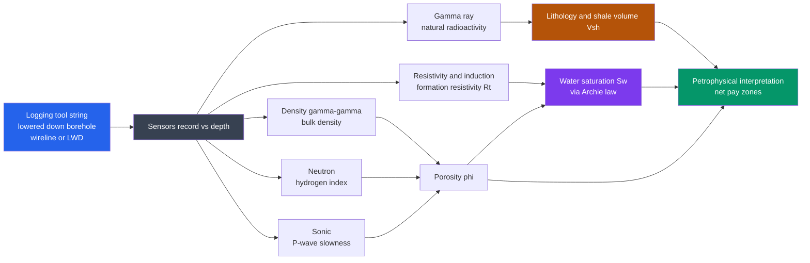

# 🛢️ Borehole Geophysics and Well Logging

> [!abstract] TL;DR
> **Well logging** lowers a string of sensors down a drilled hole to record the rock's physical properties **in situ, foot by foot** — its natural radioactivity (**gamma ray** → shale content), electrical **resistivity** (→ fluid type), **bulk density** and **neutron** response (→ porosity, and, via their crossover, **gas**), and **sonic** slowness (→ porosity and the tie to surface seismic). The petrophysicist combines these curves to solve the three questions that decide a well: **what rock is it (lithology)**, **how much empty space does it hold (porosity φ)**, and **what fills that space (water saturation Sw)** — the last from **Archie's law**, `Sw = (a·Rw / (φ^m·Rt))^(1/n)`. A layer that is **clean (low Vsh), porous (high φ), and resistive (high Rt → low Sw)** is a **pay zone**. Logs are the **highest-resolution, ground-truth arm of exploration geophysics**: they calibrate the blurry velocity and resistivity models from surface surveys against hard rock properties, and they underpin petroleum, groundwater, geothermal, mining, and CO₂-storage evaluation.

---

## Intuition

**Analogy:** A surface geophysical survey is like an **ultrasound through the belly** — genuinely useful, but blurry, because you are imaging from far away through everything in between. **Well logging is the endoscopy**: instead of guessing from the outside, you thread a string of sensors **down the borehole itself** and take continuous, high-resolution readings of the rock **right at the wall** — its natural radioactivity, its electrical resistance, its density, how fast sound moves through it, how much hydrogen (fluid) it holds — every quarter-metre from top to bottom.

The instruments come back up trailing a set of **squiggly curves plotted against depth**, and a petroleum engineer reads them the way a doctor reads a chart of vitals: a spike here means shale, a swing there means a permeable sand, a wide separation between two curves means gas. From those squiggles you decide **exactly which layers hold oil, gas, or water**, how good each layer is, and whether the well is worth completing. No other geophysical measurement gets this close to the rock.

---

## How It Works

### Core Mechanics

1. **Run a tool string down the hole.** After drilling, a sonde (the tool) is lowered on an armoured **wireline** cable — or the sensors ride just behind the bit as **LWD (logging while drilling)**. As it moves, each sensor samples the formation continuously, producing a **log**: the physical property plotted on the horizontal axis against **depth** on the vertical.
2. **Each log senses a different physical property.** No single measurement is enough; interpretation is about *combining* independent physics:
   - **Gamma ray (GR)** — counts natural radioactivity from potassium, thorium, and uranium concentrated in clays. High GR ≈ **shale**; low GR ≈ clean sand or carbonate. GR gives lithology, bed correlation between wells, and the **shale volume Vsh**.
   - **Spontaneous potential (SP)** — a natural electrical voltage that develops opposite **permeable beds** when drilling-mud salinity differs from formation water; it flags permeable zones and estimates formation-water resistivity Rw.
   - **Resistivity / induction** — measures how strongly the rock resists electrical current. **Brine is conductive (low resistivity); hydrocarbons and tight rock are resistive (high).** Multiple depths of investigation (shallow / medium / deep) reveal the **invasion profile** left by mud filtrate and let you recover the true, undisturbed formation resistivity **Rt**.
   - **Density (gamma-gamma)** — a source emits gamma rays that **Compton-scatter** off electrons; the count rate returns the **bulk density ρb**, which converts directly to **porosity**.
   - **Neutron** — a source emits neutrons that are slowed mainly by **hydrogen**; the tool reads a **hydrogen index** ≈ porosity. Where **density and neutron porosities cross over** (neutron reads low, density reads high), the pore fluid is **gas**.
   - **Sonic / acoustic** — times a P-wave pulse along the borehole wall, giving the **slowness Δt** (µs/ft). Slower ≈ more porous; and integrating Δt ties the well to **surface seismic** via **checkshots** and **synthetic seismograms**.
   - **Caliper** measures hole diameter (washouts, mudcake); **dipmeter / image logs** map bedding dip and fractures; **NMR** separates **free (producible)** from **bound (clay/capillary)** fluid.
3. **Turn logs into rock properties.** The petrophysical workflow chains the curves:
   - **Lithology / Vsh** from GR (and neutron-density, Pe).
   - **Porosity φ** from density: `φ = (ρ_matrix − ρ_bulk) / (ρ_matrix − ρ_fluid)` — and/or from neutron and sonic.
   - **Water saturation Sw** from **Archie's law** applied to the deep resistivity: `Sw = (a·Rw / (φ^m·Rt))^(1/n)`.
4. **Identify pay.** A zone that is **clean (low Vsh), porous (high φ), and hydrocarbon-bearing (high Rt → low Sw)** is flagged as **net pay**. Cutoffs on Vsh, φ, and Sw give **net-to-gross** and reserves.
5. **Calibrate and correct.** Logs read the *borehole environment*, not pristine rock: hole size, mud invasion, and temperature all bias readings and must be corrected, then the whole interpretation is **calibrated against core** measurements — logging's own ground truth.

### Flow / Architecture



---

## Key Concepts

### Secondary Level

- **Sensors on a string, sent down the hole.** Instead of imaging rock from the surface, well logging lowers instruments *into* the borehole and records the rock right at the wall, continuously with depth.
- **Different logs feel different things.** One tool feels natural radioactivity, another electrical resistance, another density, another sound speed. Together they describe the rock far better than any one alone.
- **Reading the curves.** Petroleum engineers read the log tracks like a hospital chart: high gamma ray means muddy **shale**, low means clean **sand**; high resistivity often means **oil or gas** instead of salty water.
- **Finding the pay.** A good reservoir layer is one that is clean, full of tiny holes (**porous**), and holds hydrocarbons rather than water — logs are how you find and rank those layers.

### Undergraduate Level

- **Gamma ray → shale volume.** Compute the gamma-ray index `IGR = (GR − GRmin)/(GRmax − GRmin)` between clean-sand and pure-shale baselines; `Vsh ≈ IGR` (linear) or via Larionov/Clavier nonlinear corrections. Vsh is the master lithology and reservoir-quality flag.
- **Density → porosity.** From the density log, `φ_D = (ρ_ma − ρ_b)/(ρ_ma − ρ_fl)` with `ρ_ma ≈ 2.65` (sandstone), `2.71` (limestone), `2.87` (dolomite) g/cc, and `ρ_fl ≈ 1.0` (water) or `~0.2` (gas). Neutron and sonic give independent porosity estimates.
- **Density–neutron crossover = gas.** In liquid-filled clean rock the two porosity curves overlay; **gas** lowers the hydrogen index, so neutron reads *low* while density reads *high* — the curves **cross over**, a direct gas indicator.
- **Resistivity → fluid via Archie.** Brine conducts (low Rt); hydrocarbons insulate (high Rt). **Archie's law** ties them together: `Sw = (a·Rw / (φ^m·Rt))^(1/n)` with tortuosity `a`, cementation exponent `m ≈ 2`, saturation exponent `n ≈ 2`, and formation-water resistivity `Rw`. **Formation factor** `F = a/φ^m = Ro/Rw`.
- **Invasion and depth of investigation.** Mud filtrate pushes formation fluid back from the wall, creating a **flushed / transition / virgin** profile. Shallow-, medium-, and deep-reading resistivity tools resolve this and recover **Rt** (virgin zone) plus **Rxo** (flushed zone).
- **Sonic ties logs to seismic.** Integrating sonic slowness gives a time-depth relation; convolving reflection coefficients (from ρ·V) with a wavelet builds a **synthetic seismogram** that pins reflectors in surface seismic to specific logged beds. See [[Elasticity_and_Seismic_Wave_Theory]] for the P-wave physics.

### Graduate Level

- **Shaly-sand saturation models.** Clean-sand Archie fails when clay adds surface conductivity, making `Sw` read pessimistically. **Waxman–Smits** (uses cation-exchange capacity Qv) and the **Simandoux / dual-water / Indonesia** equations add a shale-conductivity term; choosing and parameterising them is the crux of low-resistivity-pay evaluation.
- **Petrophysical inversion / multimineral solvers.** Rather than sequential formulas, modern interpretation solves an over-determined system: several log responses as linear/nonlinear functions of mineral and fluid volumes, minimised (least squares) to yield a continuous volumetric model — logging as an inverse problem, kin to [[Seismic_Tomography_and_Earth_Imaging]].
- **Density physics.** The density log exploits **Compton scattering** (∝ electron density → bulk density) while its **photoelectric factor Pe** — from photoelectric absorption at low energy — is nearly porosity-independent and diagnoses **matrix lithology** (sandstone ≈ 1.8, dolomite ≈ 3.1, limestone ≈ 5.1, anhydrite ≈ 5.1). See [[Photoelectric_Effect_and_Compton]] and [[Radioactive_Decay]].
- **Induction vs laterolog.** **Induction** tools (based on electromagnetic induction — see [[Faradays_Law_and_Induction]]) excel in resistive/oil-based mud; **laterolog** (galvanic) tools excel in conductive/salty mud. Tool choice follows the borehole conductivity contrast; both are corrected for skin effect and shoulder beds.
- **NMR petrophysics.** The `T2` distribution partitions pore fluids by relaxation time into **clay-bound, capillary-bound, and free fluid**, yielding a lithology-independent porosity and a **permeability** estimate (Timur–Coates, SDR) — the closest logs come to measuring producibility directly.
- **Measured depth vs true vertical depth.** In deviated and horizontal wells the log's **measured depth (MD)** along the wellbore differs sharply from **TVD**; correct saturation, pressure, and correlation all require the directional survey to convert MD → TVD.
- **LWD vs wireline.** **LWD/MWD** logs while drilling (real-time geosteering, measures before invasion deepens) but with lower resolution and harsher environment; **wireline** runs after drilling with richer, higher-resolution tool strings but later, more-invaded formations. The two are complementary and cross-calibrated.

---

## Python Demo

We synthesise a realistic suite of well logs for a layered formation — **shale → wet sand → gas/oil sand → tight limestone → shale** — and run the full petrophysical workflow on them: **(a)** shale volume `Vsh` from the gamma-ray log, **(b)** porosity `φ` from bulk density, and **(c)** water saturation `Sw` from **Archie's law** applied to the resistivity log. The code then flags the **pay zone** (clean + porous + low Sw) and renders a **multi-track log display** with depth increasing downward — exactly how a petrophysicist views it. Numbers are chosen so the gas/oil sand comes out as the only net pay, with a visible **density–neutron gas crossover**.

```python
# Petrophysical well-log interpretation on a synthetic layered formation.
# Workflow: (a) Vsh from gamma ray, (b) porosity from density,
# (c) Archie water saturation from resistivity -> flag the pay zone.
import numpy as np
import matplotlib.pyplot as plt

rng = np.random.default_rng(7)

# --- Depth axis (measured depth, metres) ---
depth = np.arange(2000.0, 2120.0, 0.25)
n = depth.size

# --- Define the formation by depth interval ---
# (top, base, name,        GR_API, Rt_ohm.m, RHOB_g/cc, NPHI_frac)
beds = [
    (2000, 2030, "shale",        120,   2.0, 2.52, 0.34),
    (2030, 2055, "wet sand",       25,   2.0, 2.32, 0.20),  # clean, water-bearing
    (2055, 2080, "gas/oil sand",   22,  60.0, 2.15, 0.10),  # clean, hydrocarbon = PAY
    (2080, 2095, "tight lime",     18, 200.0, 2.66, 0.03),  # low porosity, no fluid
    (2095, 2120, "shale",         125,   2.5, 2.55, 0.36),
]

GR = np.zeros(n); Rt = np.zeros(n); RHOB = np.zeros(n); NPHI = np.zeros(n)
for top, base, _name, gr, rt, rhob, nphi in beds:
    m = (depth >= top) & (depth < base)
    GR[m], Rt[m], RHOB[m], NPHI[m] = gr, rt, rhob, nphi

# realistic measurement noise (Rt is multiplicative -> stays positive)
GR   = GR   + rng.normal(0, 3.0,  n)
RHOB = RHOB + rng.normal(0, 0.01, n)
NPHI = NPHI + rng.normal(0, 0.005, n)
Rt   = Rt * np.exp(rng.normal(0, 0.04, n))

# ------------------------------------------------------------------
# (a) SHALE VOLUME from gamma ray
GRmin, GRmax = 20.0, 125.0                       # clean-sand and pure-shale baselines
Vsh = np.clip((GR - GRmin) / (GRmax - GRmin), 0, 1)

# (b) POROSITY from bulk density:  phi = (rho_ma - rho_b) / (rho_ma - rho_fl)
rho_ma, rho_fl = 2.65, 1.0                       # sandstone matrix, water-filled pores
phiD = np.clip((rho_ma - RHOB) / (rho_ma - rho_fl), 0, 1)

# (c) WATER SATURATION from Archie's law: Sw = (a*Rw / (phi^m * Rt))^(1/n)
a, m_exp, n_exp, Rw = 1.0, 2.0, 2.0, 0.05
phi_safe = np.clip(phiD, 0.02, 1)                # guard against divide-by-zero in tight rock
Sw = np.clip((a * Rw / (phi_safe**m_exp * Rt))**(1.0 / n_exp), 0, 1)

# PAY = clean AND porous AND hydrocarbon-bearing
pay = (Vsh < 0.35) & (phiD > 0.12) & (Sw < 0.50)

print("Net pay flagged over:")
if pay.any():
    print(f"  {depth[pay].min():.1f} - {depth[pay].max():.1f} m")
    print(f"  mean Vsh = {Vsh[pay].mean()*100:4.1f} %")
    print(f"  mean phi = {phiD[pay].mean()*100:4.1f} %")
    print(f"  mean Sw  = {Sw[pay].mean()*100:4.1f} %   "
          f"(hydrocarbon sat = {(1-Sw[pay].mean())*100:4.1f} %)")

# ------------------------------------------------------------------
# Multi-track log display (depth vertical, curves in tracks)
fig, ax = plt.subplots(1, 4, figsize=(13, 9), sharey=True)

# Track 1: Gamma ray + lithology shading
ax[0].plot(GR, depth, color="green", lw=0.8)
ax[0].fill_betweenx(depth, 0, 150, where=(Vsh >= 0.5), color="0.55", alpha=0.35)  # shale
ax[0].fill_betweenx(depth, 0, 150, where=(Vsh < 0.5),  color="gold", alpha=0.12)  # sand
ax[0].set_xlim(0, 150); ax[0].set_xlabel("GR (API)")
ax[0].set_ylabel("Depth (m)"); ax[0].set_title("Track 1\nGamma ray / lithology")

# Track 2: Resistivity (log scale)
ax[1].plot(Rt, depth, color="red", lw=0.8)
ax[1].set_xscale("log"); ax[1].set_xlim(1, 300)
ax[1].set_xlabel("Rt (ohm.m)"); ax[1].set_title("Track 2\nResistivity")

# Track 3: Density porosity vs Neutron porosity -> gas crossover
ax[2].plot(phiD*100, depth, color="black", lw=0.8, label="density phi")
ax[2].plot(NPHI*100, depth, color="blue",  lw=0.8, label="neutron phi")
ax[2].fill_betweenx(depth, NPHI*100, phiD*100,
                    where=(phiD > NPHI + 0.03), color="red", alpha=0.30, label="gas crossover")
ax[2].set_xlim(45, -5)  # reversed porosity scale (petrophysical convention)
ax[2].set_xlabel("porosity (%)"); ax[2].set_title("Track 3\nDensity-neutron")
ax[2].legend(fontsize=6, loc="lower left")

# Track 4: Archie Sw + porosity
ax[3].plot(Sw*100,  depth, color="purple", lw=0.9, label="Sw")
ax[3].plot(phiD*100, depth, color="brown", lw=0.8, label="phi")
ax[3].set_xlim(0, 100); ax[3].set_xlabel("Sw, phi (%)")
ax[3].set_title("Track 4\nArchie Sw + phi")
ax[3].legend(fontsize=6, loc="lower left")

# Highlight the pay zone across every track
for a_ in ax:
    a_.fill_betweenx(depth, *a_.get_xlim(), where=pay, color="orange", alpha=0.18)
    a_.grid(alpha=0.25)

ax[0].invert_yaxis()  # depth increases downward (shared across tracks)
fig.suptitle("Well-log interpretation: clean + porous + low Sw = PAY (gas/oil sand)", y=0.995)
plt.tight_layout()
plt.savefig("well_log_interpretation.png", dpi=120)
print("\nSaved well_log_interpretation.png")
```

Running it prints the flagged **net-pay interval (≈2055–2080 m)** with its mean Vsh, φ, and Sw, and produces the four-track figure: the gamma-ray track separates shale from sand, resistivity spikes in the pay, the **density–neutron crossover** lights up red exactly where gas lowers the hydrogen index, and the Archie track drops `Sw` to ~10 percent — the orange pay flag lines up across all four tracks. The wet sand, though equally clean and porous, is correctly *rejected* because its low resistivity forces `Sw` high.

---

## Real-World Applications

- **Petroleum formation evaluation.** The core use: log every well to decide **net pay, porosity, and saturation**, book reserves, choose perforation intervals, and design completions. Service companies (Schlumberger, Halliburton, Baker Hughes) built the industry around it.
- **Well-to-seismic tie.** Sonic + density logs generate the **synthetic seismogram** and **checkshot/VSP** velocities that pin blurry surface [[Seismic_Ray_Theory_and_Travel_Times|travel-time]] reflections to real rock — logs are the *ground truth* that calibrates seismic interpretation.
- **Hydrogeology / groundwater.** Gamma, resistivity, and SP logs map **aquifers, aquitards, and water quality** (fresh vs saline) in water wells — see [[Groundwater_and_Karst]].
- **Mining & mineral exploration.** Density, gamma, and spectral-gamma logs delineate **coal seams, ore grade, and radioactive deposits** downhole where core recovery is poor.
- **Geothermal.** Temperature, sonic, and image logs locate **fractured, permeable, high-heat zones** and characterise reservoir rock for energy extraction.
- **CO₂ storage & carbon capture.** Baseline and time-lapse logs verify **caprock integrity, injectivity, and plume containment** in sequestration projects.
- **Geotechnical & civil.** Caliper, sonic, and gamma logs characterise rock strength and layering for **dams, tunnels, and foundation** siting.

---

## Common Pitfalls

- **"Each log senses a *different* property."** The single most common conceptual error is treating logs as interchangeable. GR feels radioactivity, resistivity feels fluid conductivity, density feels electron density, neutron feels hydrogen — you must combine *independent* physics; no one curve gives porosity, lithology, and fluid at once.
- **"Gamma ray ≈ shaliness, not radioactive danger."** High GR flags clay-rich (shale) beds, not hazard. And clean beds can read high GR from **feldspar, mica, or uranium-rich carbonates**; spectral GR (K, Th, U) is needed to avoid over-calling shale.
- **Missing the density–neutron gas effect.** Gas lowers the hydrogen index, so **neutron reads too-low porosity and density too-high**; their **crossover** is the diagnostic. Read either curve alone and you either miss gas or misestimate porosity.
- **Archie's-law assumptions.** Archie assumes **clean, water-wet, connected porosity** with the *right* `a, m, n, Rw`. In **shaly sands**, clay conductivity makes Sw read pessimistically high (masking real "low-resistivity pay"); use **Waxman–Smits / Simandoux / dual-water**. Wrong `m`, `n`, or `Rw` swings reserves wildly.
- **Invasion & mud filtrate.** Drilling mud pushes filtrate into permeable rock, so shallow tools read the **flushed zone (Rxo)**, not the virgin **Rt**. Use the multi-depth resistivity suite and invasion correction, or you compute Sw on the wrong resistivity.
- **Borehole environment.** Washouts, mudcake, hole size, and temperature bias density, neutron, and resistivity. Always apply **environmental corrections** and check the **caliper** before trusting a reading.
- **Measured depth vs true vertical depth.** In deviated/horizontal wells, **MD ≠ TVD**; saturation-height, pressure, and cross-well correlation all need the directional survey to convert. Ignoring it misplaces contacts and reserves.
- **Skipping core calibration.** Logs are *calibrated* estimates, not direct measurements. Without **core porosity, permeability, and grain density** (and `m`, `n` from special core analysis) to anchor them, the interpretation drifts.
- **LWD vs wireline mismatch.** LWD logs earlier (less invasion, real-time geosteering) but at lower resolution; wireline logs later (deeper invasion) at higher resolution. Comparing them without accounting for **time-since-drilling and tool physics** creates false depth or value shifts.

---

## Related Concepts

- [[Geophysics_Overview]] — the parent field; logs are its **highest-resolution, in-situ probe** and the ground truth that calibrates every surface method.
- [[Elasticity_and_Seismic_Wave_Theory]] — the sonic log measures **P-wave slowness**; this note supplies the elastic-wave physics behind it and the tie to seismic velocities.
- [[Seismic_Ray_Theory_and_Travel_Times]] — sonic/checkshot logs provide the velocity–depth control that seismic travel-time interpretation depends on; logs anchor the ray model to real rock.
- [[Seismic_Tomography_and_Earth_Imaging]] — petrophysical multimineral interpretation is a small-scale **inverse problem**, kin to tomography: many measurements, few unknown volumes.
- [[Radioactive_Decay]] — the gamma-ray log counts natural K, Th, U decay; spectral GR resolves the three, refining lithology.
- [[Photoelectric_Effect_and_Compton]] — the density log works by **Compton scattering** (bulk density) while its **photoelectric factor** exploits photoelectric absorption to identify matrix lithology.
- [[Faradays_Law_and_Induction]] — **induction resistivity** tools measure formation conductivity by electromagnetic induction (Faraday's law) rather than galvanic contact.
- [[Maxwells_Equations]] — the full electromagnetic basis for induction and propagation-resistivity (LWD) logging tools.
- [[Waves_in_Fluids_and_Acoustics]] — the acoustic-wave physics of the sonic log's borehole-guided P-wave pulse.
- [[Sedimentary_Rocks_and_Environments]] — the reservoir and seal rocks (sands, shales, carbonates) whose porosity and lithology logs are built to distinguish.
- [[Groundwater_and_Karst]] — hydrogeological logging maps aquifers, porosity, and fresh-vs-saline water with the same GR/resistivity/SP suite.
- [[Economic_Geology_and_Resources]] — logs quantify the oil, gas, coal, ore, and geothermal resources that this note evaluates.
- [[Relative_Dating_and_Stratigraphy]] — gamma-ray and dipmeter logs are core tools for **well-to-well correlation** and building the subsurface stratigraphic framework.

*(Sibling exploration-geophysics notes referenced in prose — Exploration Geophysics Overview, Seismic Reflection and Refraction Surveying, Electrical and Electromagnetic Methods, Environmental and Hydrogeophysics, Induced Seismicity and Georesource Geophysics — will be wikilinked once created.)*

---

## Review Questions

### Secondary Level

1. Using the endoscopy analogy, explain why lowering sensors *into* a borehole gives sharper information about a rock layer than measuring from the surface.
2. On a gamma-ray log, one layer reads very high and the next reads very low. Which is likely **shale** and which is likely **clean sand**, and why does the shale glow on the gamma-ray tool?

### Undergraduate Level

3. A sand has bulk density 2.25 g/cc. Using `ρ_matrix = 2.65` and `ρ_fluid = 1.0` g/cc, compute the porosity. If the deep resistivity is 40 ohm·m and `Rw = 0.04`, `a = 1`, `m = n = 2`, use **Archie's law** to estimate `Sw`. Is this a pay zone? Justify with all three criteria (Vsh, φ, Sw).
4. Explain the **density–neutron crossover** and why it specifically indicates **gas** rather than oil or water. Sketch how the two porosity curves behave in a shale, a wet sand, and a gas sand.

### Graduate Level

5. A clean-looking sand shows good density porosity but Archie returns `Sw ≈ 0.7`, so the well is called wet — yet it later produces gas. Give two physical reasons Archie could have over-estimated `Sw`, name the models you would use instead, and describe what additional data (logs or core) would resolve the ambiguity.
6. You must plan a logging program for a **horizontal well** drilled with **oil-based mud**. Choose between wireline and LWD, between induction and laterolog resistivity, and explain how you would handle **MD vs TVD** and **mud invasion** in the subsequent saturation evaluation.

---

## Sources

- Rider, M. & Kennedy, M. — *The Geological Interpretation of Well Logs*, 3rd ed. (Rider-French, 2011).
- Ellis, D. V. & Singer, J. M. — *Well Logging for Earth Scientists*, 2nd ed. (Springer, 2007).
- Asquith, G. & Krygowski, D. — *Basic Well Log Analysis*, 2nd ed. (AAPG Methods in Exploration 16, 2004).
- Schlumberger — *Log Interpretation Principles/Applications* (Schlumberger Educational Services).
- Archie, G. E. — "The Electrical Resistivity Log as an Aid in Determining Some Reservoir Characteristics," *Trans. AIME* 146 (1942), 54–62.

---

#geophysics #well-logging #petrophysics #borehole #petroleum-geophysics
