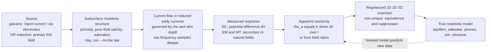

# ⚡ Electrical and Electromagnetic Methods

> [!abstract] TL;DR
> Rocks vary enormously in how easily they pass electric current, and that single property — **electrical resistivity** $\rho$ (or its inverse, **conductivity** $\sigma$) — is controlled almost entirely by things geologists desperately want to know: **porosity, pore-fluid salinity and saturation, clay content, and metallic or graphitic minerals** (quantified by **Archie's law**). Electrical and electromagnetic methods measure $\rho$ from the surface, from boreholes, or from aircraft. **DC resistivity** injects current through electrodes and reads the resulting voltage; **induced polarization (IP)** watches the ground behave like a leaky capacitor to find disseminated sulphides and clay; **self-potential (SP)** listens for the Earth's own natural voltages; **electromagnetic (EM) induction** methods wirelessly induce eddy currents in conductors and detect their secondary field; and **magnetotellurics (MT)** uses natural ionospheric and lightning fields spanning a huge frequency band to image resistivity from the soil to the mantle. In every case a raw measurement gives an **apparent resistivity**, and turning that into a true-resistivity model is a non-unique inverse problem. These are the geophysicist's premier **fluid, porosity, and conductivity sensors** — the perfect complement to seismic and potential-field surveys.

---

## Intuition

**Analogy:** Touch the probes of a multimeter to a wet sponge and then to a dry brick, and the meter tells you instantly that the sponge conducts electricity far better than the brick. **The Earth is no different.** Groundwater, dissolved salt, clay, and metallic ore let current flow easily (low resistivity); dry rock, clean sand, and gravel resist it (high resistivity). Electrical and electromagnetic surveys are, at heart, a giant **ohmmeter for the planet**: they push current into the ground through electrodes — or induce it wirelessly with a magnetic field — and map how easily it flows. The invisible variations in resistivity become pictures of **aquifers, ore bodies, saltwater intrusion, contamination plumes, and buried structures**.

The reason this works so well is that resistivity is a *fluid and pore* detector. Solid rock minerals (quartz, feldspar) are near-insulators; it is the salty water in the pores, the charged surfaces of clay minerals, and the odd conductive ore grain that carry the current. So mapping resistivity is very nearly mapping **where the water is, how salty it is, how porous the rock is, and whether ore is present** — which is exactly why these methods dominate groundwater, environmental, geotechnical, and mineral exploration.

---

## How It Works

### Core Mechanics

1. **Resistivity is the target property.** Ohm's law in a material is $\mathbf{J} = \sigma\mathbf{E}$ (current density equals conductivity times electric field); resistivity is $\rho = 1/\sigma$, measured in ohm-metres. Earth materials span **12 orders of magnitude**, from $\sim 0.1\ \Omega\text{m}$ (saline water, massive sulphide) to $\sim 10^{6}\ \Omega\text{m}$ (dry crystalline rock, ice) — a far wider contrast than seismic velocity or density, which is why resistivity is such a sensitive discriminator.
2. **What controls it: Archie's law.** In most water-bearing rock, conduction is *electrolytic* (through the pore fluid), not through the mineral grains. Archie's empirical law captures this: $\rho = a\,\rho_w\,\phi^{-m}\,S_w^{-n}$, where $\rho_w$ is pore-water resistivity, $\phi$ porosity, $S_w$ water saturation, and $a,m,n$ are constants. More pores, saltier water, or higher saturation all lower resistivity. Clay adds *surface* conduction; metallic/graphitic minerals add *electronic* conduction.
3. **DC resistivity — inject and measure.** Drive a current $I$ into the ground through two current electrodes and measure the potential difference $\Delta V$ across two potential electrodes. A single point source in a uniform half-space produces $V = \rho I / (2\pi r)$; superposing the electrodes and inverting gives the **apparent resistivity** $\rho_a = K\,\Delta V / I$, where $K$ is a purely **geometric factor** set by the electrode layout.
4. **Depth via spacing — sounding vs profiling.** Widen the electrode array and the current flows *deeper*, so $\rho_a$ starts to reflect deeper rock. A **Vertical Electrical Sounding (VES)** expands a fixed-centre array (Wenner or Schlumberger) to probe resistivity *versus depth*; **profiling** moves a fixed-size array laterally to map resistivity *versus position*; **2D/3D Electrical Resistivity Tomography (ERT)** combines both with multi-electrode cables and produces a resistivity image.
5. **Induced Polarization (IP) — the capacitor effect.** When the injected current is switched off, the voltage does not vanish instantly; it decays over seconds because the ground **stored charge** at grain–fluid interfaces (disseminated sulphides, clay). This **chargeability** is measured in the time domain (decay curve) or frequency domain (phase / percent-frequency-effect) and is the workhorse of **disseminated-sulphide mineral exploration**.
6. **Self-Potential (SP) — the Earth's own battery.** No current is injected at all; you simply measure natural voltages arising from **fluid flow (streaming potential)** and **redox reactions** over ore bodies — cheap reconnaissance for seepage, sulphides, and geothermal flow.
7. **EM induction — go wireless.** A time-varying **primary** magnetic field induces **eddy currents** in conductive ground; those currents radiate a **secondary** field that a receiver detects ([[Faradays_Law_and_Induction]]). Frequency-domain EM (FDEM, e.g. ground conductivity meters) reads in-phase and quadrature components; time-domain EM (TEM/TDEM) shuts off the primary and watches the secondary field decay. Airborne EM (AEM) blankets whole regions from a helicopter or fixed wing.
8. **Skin depth sets penetration.** In a conductor, an EM field is attenuated over the **skin depth** $\delta = \sqrt{2/(\omega\mu\sigma)} \approx 503\sqrt{\rho/f}$ metres (with $f$ in Hz, $\rho$ in $\Omega\text{m}$). **Low frequencies penetrate deep; high frequencies stay shallow.** This single relation governs the depth reach of every frequency-domain EM method.
9. **Magnetotellurics (MT) — nature's transmitter.** Natural EM energy from ionospheric currents and distant lightning drives ground currents across an enormous band (millihertz to kilohertz). By measuring orthogonal electric and magnetic fields and forming the **impedance tensor** $Z = E/H$, MT yields apparent resistivity $\rho_a = |Z|^2/(\omega\mu)$ and phase at each frequency. Because skin depth grows as frequency falls, sweeping frequency sweeps depth — MT is the **deepest-reaching EM method**, imaging from near-surface to the deep mantle.
10. **The inverse step.** Every method delivers **apparent** resistivity; recovering **true** resistivity versus depth (or a 2D/3D model) requires inversion, which is **non-unique** — many earth models fit the same curve.

### Flow / Architecture



---

## Key Concepts

### Secondary Level

- **Wet conducts, dry resists.** Groundwater, salt, clay, and metal ore let current flow; dry rock and clean sand block it. Mapping how well the ground conducts is nearly the same as mapping where the water and ore are.
- **Two ways to look.** You can *touch* the ground with electrodes and push current in (DC resistivity), or you can *induce* current with a magnetic coil from above without any contact (EM). Both read the same underground property.
- **Wider means deeper.** Spread the electrodes farther apart and the current dives deeper, so bigger spacings tell you about deeper rock — the basis of "sounding" for depth.
- **Apparent, not true.** A single reading gives an *apparent* resistivity — an average smeared over everything the current touched. Getting the real layer-by-layer picture takes a computer inversion.
- **Different tools for different jobs.** Resistivity finds aquifers and pollution; IP finds disseminated ore; SP finds seepage and ore cheaply; airborne EM maps huge areas fast; magnetotellurics sees kilometres to hundreds of kilometres deep.

### Undergraduate Level

- **Apparent resistivity and the geometric factor.** $\rho_a = K\,\Delta V/I$. For a **Wenner** array (four equally spaced electrodes, spacing $a$), $K = 2\pi a$; for a symmetric **Schlumberger** array with current half-spacing $L$ and potential half-spacing $l$, $K = \pi(L^2 - l^2)/(2l)$; **dipole–dipole** arrays use separated current and potential dipoles for lateral 2D imaging. $K$ is pure geometry — the physics is all in $\rho_a$.
- **Array trade-offs.** Wenner: strong signal, good vertical resolution, slow to expand. Schlumberger: efficient sounding (only current electrodes move), better lateral-noise rejection. Dipole–dipole: excellent lateral resolution and depth sensitivity for ERT, but weaker signal (lower signal-to-noise).
- **Two-layer sounding curve.** Over a top layer of resistivity $\rho_1$, thickness $h$, above a half-space $\rho_2$, the apparent resistivity rises from $\rho_1$ (small spacing) toward $\rho_2$ (large spacing) through an image series governed by the reflection coefficient $k = (\rho_2-\rho_1)/(\rho_2+\rho_1)$. The *shape* of the curve encodes $h$; the *asymptotes* encode $\rho_1$ and $\rho_2$.
- **Skin depth and depth of investigation.** $\delta \approx 503\sqrt{\rho/f}$. For a $100\ \Omega\text{m}$ ground, $\delta \approx 500\,$m at 100 Hz but only $\approx 16\,$m at 100 kHz. Frequency-domain EM and MT exploit this: change frequency to change depth, no moving parts.
- **Induced polarization observables.** Time-domain **chargeability** $M = \frac{1}{V_0}\int_{t_1}^{t_2} V(t)\,dt$; frequency-domain **percent-frequency-effect** $\mathrm{PFE} = 100(\rho_{\text{low}}-\rho_{\text{high}})/\rho_{\text{high}}$ and **metal factor**. Both flag surface-polarizable material — sulphides *and* clay (a notorious ambiguity).
- **Galvanic vs inductive coupling.** DC resistivity and IP couple **galvanically** (direct electrode contact, sensitive to *resistive* structure and near-surface layering); EM/MT couple **inductively** (no contact, most sensitive to *conductive* structure). This is why the methods see different things and are complementary.

### Graduate Level

- **The DC forward problem is Poisson's equation.** For a point current source in a heterogeneous half-space, $\nabla\cdot(\sigma\nabla V) = -I\,\delta(\mathbf{r}-\mathbf{r}_s)$; in the source-free region this reduces to **Laplace's equation** $\nabla^2 V = 0$ ([[Introduction_to_PDEs]], [[Gauss_Law_and_Electric_Potential]]). Layered-earth solutions come from Hankel transforms of the **resistivity transform / kernel function**, evaluated efficiently with digital linear (Ghosh) filters; 2D/3D forward modelling uses finite elements or finite differences.
- **EM forward problem is the diffusion equation.** At exploration frequencies displacement currents are negligible, so Maxwell's equations reduce to the **diffusion equation** $\nabla^2\mathbf{H} = \mu\sigma\,\partial\mathbf{H}/\partial t$ (quasi-static limit of [[Maxwells_Equations]]); the field spreads and attenuates rather than propagating as a wave. Ground-penetrating radar sits at the *opposite* end — high enough frequency that displacement currents dominate and the field truly propagates ([[Electromagnetic_Waves_and_Radiation]]).
- **The MT impedance tensor.** $\mathbf{E} = \mathbf{Z}\,\mathbf{H}$ with a $2\times2$ complex tensor $Z$; its invariants, dimensionality analysis (Swift skew, phase tensor), and strike decomposition separate 1D/2D/3D structure and correct for near-surface **static shift** and galvanic distortion. Apparent resistivity $\rho_{a,ij} = |Z_{ij}|^2/(\omega\mu)$ and phase $\phi_{ij} = \arg Z_{ij}$ are inverted jointly, often with seismic constraints.
- **Non-uniqueness: equivalence and suppression.** The 1D sounding inverse problem is fundamentally ill-posed. **Equivalence:** a thin *conductive* layer is constrained only by its **conductance** $S = h/\rho$ (many $(h,\rho)$ pairs fit), while a thin *resistive* layer is constrained only by its **transverse resistance** $T = h\rho$. **Suppression:** an intermediate layer too thin or of intermediate resistivity may be undetectable in the data at all. The singular-value structure of the sensitivity matrix ([[Singular_Value_Decomposition]]) exposes exactly which model combinations the data can and cannot resolve — inversion must be regularized and the resolution reported.
- **IP as complex resistivity.** IP is the low-frequency imaginary part of a **complex conductivity** $\sigma^*(\omega)$; the **Cole–Cole model** parameterizes chargeability, time constant, and frequency dependence, letting spectral IP (SIP) discriminate mineral texture and grain size — separating economic sulphides from barren clay/graphite.
- **Joint and structurally-constrained inversion.** Because resistivity is exquisitely sensitive to fluids and porosity but blind to lithology that seismic/gravity see well, modern practice couples EM/MT/DC inversions to seismic and potential-field data via cross-gradient or petrophysical constraints — the methods are strongest *together*.

---

## Python Demo

```python
# Two pillars of electrical & electromagnetic exploration:
#   (a) DC RESISTIVITY SOUNDING -- apparent resistivity vs electrode spacing for
#       a TWO-LAYER earth (Wenner array).  Widening the array samples DEEPER, so
#       the sounding curve climbs (or falls) from the top layer's rho1 toward the
#       deeper layer's rho2.  We use the classic image-series solution.
#   (b) EM SKIN DEPTH -- delta = 503*sqrt(rho/f).  LOW frequencies reach DEEP,
#       HIGH frequencies stay SHALLOW: the basis of frequency-domain EM and the
#       depth sounding of magnetotellurics.
import numpy as np
import matplotlib.pyplot as plt

# ---------------------------------------------------------------------------
# (a) Two-layer Wenner sounding curve (Telford et al., Applied Geophysics)
#     rho_a = rho1 * [ 1 + 4 * SUM_{n=1..inf} k^n * ( 1/sqrt(1+(2 n h/a)^2)
#                                                   - 1/sqrt(4+(2 n h/a)^2) ) ]
#     k = (rho2 - rho1)/(rho2 + rho1)   reflection coefficient at the interface
#     h = top-layer thickness, a = Wenner electrode spacing
#     Limits:  a -> 0  gives rho_a -> rho1 ;  a -> inf gives rho_a -> rho2
# ---------------------------------------------------------------------------
def wenner_two_layer(a, rho1, rho2, h, nterms=400):
    k = (rho2 - rho1) / (rho2 + rho1)
    n = np.arange(1, nterms + 1)[:, None]          # column of image orders
    x = (2.0 * n * h) / a[None, :]                 # (nterms x n_spacings)
    term = k**n * (1.0/np.sqrt(1.0 + x**2) - 1.0/np.sqrt(4.0 + x**2))
    return rho1 * (1.0 + 4.0 * term.sum(axis=0))

a  = np.logspace(-0.3, 2.3, 300)                   # Wenner spacing a  [m], ~0.5..200
h  = 10.0                                          # top-layer thickness [m]

rho1_A, rho2_A = 30.0, 300.0                       # conductive over resistive -> RISES
rho1_B, rho2_B = 300.0, 30.0                       # resistive over conductive -> FALLS
rhoa_A = wenner_two_layer(a, rho1_A, rho2_A, h)
rhoa_B = wenner_two_layer(a, rho1_B, rho2_B, h)

# geometric factor for the Wenner array (pure geometry): K = 2*pi*a
K = 2.0 * np.pi * a
print(f"Wenner geometric factor at a=10 m:  K = 2*pi*a = {2*np.pi*10:.1f}")
print(f"Curve A (30 over 300): rho_a spans {rhoa_A.min():.0f}..{rhoa_A.max():.0f} ohm-m")
print(f"Curve B (300 over 30): rho_a spans {rhoa_B.min():.0f}..{rhoa_B.max():.0f} ohm-m")

# ---------------------------------------------------------------------------
# (b) EM skin depth vs frequency:  delta = 503 * sqrt(rho / f)  [m]
# ---------------------------------------------------------------------------
f = np.logspace(-3, 8, 400)                        # 1 mHz (MT) .. 100 MHz (GPR-ish)
def skin_depth(rho, f):
    return 503.0 * np.sqrt(rho / f)                # metres
d_conductive = skin_depth(10.0,   f)               # 10 ohm-m clay / saline ground
d_resistive  = skin_depth(1000.0, f)               # 1000 ohm-m dry crystalline rock

# ---------------------------------------------------------------------------
# Plot
# ---------------------------------------------------------------------------
fig, (ax1, ax2) = plt.subplots(1, 2, figsize=(13, 5.4))

# --- Panel (a): sounding curves ---
ax1.plot(a, rhoa_A, lw=2.2, color="#2563eb",
         label=f"rho1={rho1_A:.0f} over rho2={rho2_A:.0f}  (rises)")
ax1.plot(a, rhoa_B, lw=2.2, color="#dc2626",
         label=f"rho1={rho1_B:.0f} over rho2={rho2_B:.0f}  (falls)")
for rv, c in [(rho1_A, "#2563eb"), (rho2_A, "#2563eb"),
              (rho1_B, "#dc2626"), (rho2_B, "#dc2626")]:
    ax1.axhline(rv, color=c, ls=":", lw=1, alpha=0.5)
ax1.axvline(h, color="k", ls="--", lw=1, alpha=0.6)
ax1.text(h*1.05, 40, "layer\nthickness h", fontsize=8, alpha=0.7)
ax1.set_xscale("log"); ax1.set_yscale("log")
ax1.set_xlabel("Wenner electrode spacing  a  [m]  (larger = deeper)")
ax1.set_ylabel("apparent resistivity  rho_a  [ohm-m]")
ax1.set_title("(a) DC two-layer sounding curve\nsmall a -> rho1,  large a -> rho2")
ax1.legend(fontsize=8, loc="center right"); ax1.grid(alpha=0.3, which="both")

# --- Panel (b): skin depth vs frequency ---
ax2.plot(f, d_conductive, lw=2.2, color="#059669", label="rho = 10 ohm-m (conductive)")
ax2.plot(f, d_resistive,  lw=2.2, color="#7c3aed", label="rho = 1000 ohm-m (resistive)")
ax2.set_xscale("log"); ax2.set_yscale("log")
# annotate method bands
for x0, x1, lbl, yy in [(1e-3, 1e0, "MT (deep)", 3e4),
                        (1e1, 1e4, "TEM / FDEM", 3e2),
                        (1e6, 1e8, "GPR (shallow)", 3e0)]:
    ax2.axvspan(x0, x1, color="gray", alpha=0.08)
    ax2.text(np.sqrt(x0*x1), yy, lbl, ha="center", fontsize=8, alpha=0.75)
ax2.set_xlabel("frequency  f  [Hz]  (lower = deeper)")
ax2.set_ylabel("skin depth  delta  [m]")
ax2.set_title("(b) EM skin depth  delta = 503*sqrt(rho/f)\nlow f penetrates deep, high f stays shallow")
ax2.legend(fontsize=8); ax2.grid(alpha=0.3, which="both")

plt.tight_layout()
plt.savefig("electrical_em_methods.png", dpi=130)
print("\nSaved electrical_em_methods.png")
```

Panel (a) is the essence of a **vertical electrical sounding**: at small electrode spacing the current stays shallow and $\rho_a$ equals the top-layer resistivity $\rho_1$; as you widen the array the current dives past the interface at depth $h$ and $\rho_a$ migrates toward the deeper resistivity $\rho_2$ — *rising* when a conductor overlies a resistor and *falling* when a resistor overlies a conductor. The curve's inflection near $a\sim h$ is what encodes the layer thickness. Panel (b) is the EM depth knob made visible: because $\delta\propto\sqrt{\rho/f}$, dropping the frequency by a factor of 100 increases penetration by a factor of 10, so magnetotellurics (millihertz) reaches tens of kilometres while ground-penetrating radar (megahertz) is confined to the top few metres — one equation, the entire depth range of electromagnetic exploration.

---

## Real-World Applications

- **Groundwater exploration.** Vertical electrical soundings and ERT map the water table, aquifer geometry, and bedrock depth from the resistivity contrast between saturated and unsaturated ground — the standard first tool for siting water wells worldwide.
- **Saltwater intrusion and salinization.** Because dissolved salt slashes resistivity, DC resistivity and airborne EM track the freshwater–saltwater interface in coastal aquifers and map soil salinity across irrigated farmland (e.g. large-scale AEM salinity surveys in Australia).
- **Contamination and environmental monitoring.** Conductive leachate plumes beneath landfills, saline or acid-mine drainage, and (via IP) organic contaminants show up as resistivity/chargeability anomalies; time-lapse ERT watches plumes and remediation evolve.
- **Mineral exploration.** IP is *the* method for **disseminated porphyry-copper and gold sulphides** (grains too sparse to short-circuit DC current still polarize); EM (ground and airborne) finds **massive sulphide** conductors (Ni-Cu-Zn); SP flags near-surface ore and geothermal upflow.
- **Geotechnical and archaeology.** ERT locates voids, karst, fracture zones, buried channels, foundations, and contaminated fill for engineering and heritage surveys, non-destructively.
- **Deep crustal and lithospheric imaging.** Magnetotellurics maps conductive zones marking partial melt, fluids, and graphite along faults and subduction zones — imaging magma chambers beneath volcanoes and tracing the lithosphere–asthenosphere boundary and mantle conductors down to hundreds of kilometres.
- **Hydrocarbon and CO2 monitoring.** Marine controlled-source EM (CSEM) detects resistive hydrocarbon reservoirs beneath the seafloor, and time-lapse EM/ERT monitors injected CO2 and steam-flood fronts.

---

## Common Pitfalls

- **Apparent is not true resistivity.** $\rho_a$ is a volume-weighted average of everything the current sampled, not the resistivity of any single layer. It equals the true value only over a uniform half-space. Interpreting raw $\rho_a$ as layer resistivity — or reading depth straight off electrode spacing — is the most common beginner error; you must invert.
- **Confusing methods that share a name but not a physics.** DC resistivity (galvanic, Laplace/Poisson), IP (complex conductivity / polarization), inductive EM and TEM (diffusion equation), MT (natural-source diffusion), and GPR (wave propagation) all sense "electrical properties" but obey **different governing equations** and answer different questions. Choosing GPR for a deep saline target, or MT for a shallow void, is a physics mismatch.
- **Ignoring the skin-depth / frequency–depth trade-off.** Pushing frequency up for resolution shrinks penetration; pushing it down for depth blurs shallow detail. A survey band must be matched to the target depth via $\delta\approx503\sqrt{\rho/f}$ before, not after, acquisition.
- **Wrong array geometry.** Wenner, Schlumberger, and dipole–dipole differ in depth reach, lateral resolution, and signal-to-noise. Using a low-signal dipole–dipole in electrically noisy ground, or a Wenner where you need lateral resolution, wastes a survey.
- **Equivalence and suppression (1D non-uniqueness).** A thin conductive layer is constrained only by its conductance $h/\rho$ and a thin resistive layer only by $h\rho$, so many models fit one sounding curve; a thin intermediate layer may be invisible altogether. Never present a single "best" 1D model without an equivalence/resolution analysis.
- **Galvanic vs inductive coupling confusion.** Galvanic methods (DC/IP) are most sensitive to resistors and near-surface layering; inductive methods (EM/MT) are most sensitive to conductors and can suffer near-surface galvanic distortion (MT static shift). Expecting them to image the same feature identically leads to false "contradictions."
- **Conductive overburden masking.** A shallow conductive layer (clay, saline soil) draws current and shields deeper targets, throttling penetration and hiding what lies beneath — a chronic problem for EM in weathered terrains that must be planned around, not discovered afterward.

---

## Related Concepts

- [[Faradays_Law_and_Induction]] — the electromagnetic induction at the heart of every EM, TEM, and MT method: a changing primary field drives eddy currents whose secondary field is the measurement.
- [[Maxwells_Equations]] — the parent physics; the quasi-static (diffusion) limit governs EM/MT, while the wave limit governs ground-penetrating radar.
- [[Gauss_Law_and_Electric_Potential]] — the electrostatic potential of a point current source in the ground ($V=\rho I/2\pi r$) is exactly the DC resistivity forward model.
- [[Electromagnetic_Waves_and_Radiation]] — propagation and attenuation in conductive media, where skin depth $\delta$ comes from, and the wave regime that distinguishes GPR from diffusive EM.
- [[Introduction_to_PDEs]] — DC resistivity solves Laplace/Poisson's equation; EM solves the diffusion equation — the two PDEs behind the whole method family.
- [[Singular_Value_Decomposition]] — exposes the null space of the sounding sensitivity matrix, formalizing equivalence, suppression, and the resolution of the ill-posed inversion.
- [[Groundwater_and_Karst]] — the aquifers, water tables, and karst voids that resistivity and EM are most often deployed to find and monitor.
- [[Geomagnetism_and_the_Geodynamo]] — the natural ionospheric and lightning-driven variations of Earth's magnetic field are the *free transmitter* that magnetotellurics exploits.

*Sibling notes in this Geophysics section (build alongside this one): **Exploration_Geophysics_Overview** frames where electrical/EM methods sit among the exploration toolkit; **Gravity_and_Magnetic_Surveying** covers the complementary potential-field methods (density and magnetization rather than resistivity); **Ground_Penetrating_Radar_and_Near_Surface_Geophysics** is the high-frequency wave-propagation cousin at the shallow, resistive end; **Environmental_and_Hydrogeophysics** applies these methods to water and contamination; and **Geophysical_Inverse_Theory** formalizes the non-unique apparent-to-true inversion used throughout.*

---

## Review Questions

1. **(Secondary)** You have a multimeter-like resistivity meter and want to find a buried freshwater aquifer versus a saltwater-intruded zone. Which one would read *low* resistivity and which *high*, and why? If your first, closely-spaced electrode reading only shows dry topsoil, what should you change to "see" deeper — and what physically happens to the current when you do?
2. **(Undergraduate)** For a two-layer earth with a $30\ \Omega\text{m}$ layer over a $300\ \Omega\text{m}$ half-space, sketch the Wenner sounding curve and state its small-spacing and large-spacing asymptotes. Separately, using $\delta\approx503\sqrt{\rho/f}$, estimate the skin depth in $100\ \Omega\text{m}$ ground at 10 kHz and at 1 Hz, and explain why magnetotellurics can image far deeper than a ground conductivity meter. When would you choose a dipole–dipole array over a Wenner array?
3. **(Graduate)** A single VES over an interpreted three-layer earth (conductive–resistive–conductive) is fit *equally well* by two very different middle-layer models. Explain, in terms of **equivalence** (conductance $h/\rho$ vs transverse resistance $h\rho$) and **suppression**, why this happens, how the singular-value structure of the sensitivity kernel encodes it, and what additional data or constraints (a second array, TEM, MT, or a borehole log) would break the ambiguity. Contrast the governing equations of DC resistivity, diffusive EM, and GPR, and justify which you would deploy for a $2$ km-deep magma body versus a $2$ m-deep utility trench.

---

## Sources

- Telford, W. M., Geldart, L. P. & Sheriff, R. E. — *Applied Geophysics*, 2nd ed. (Cambridge University Press, 1990) — chapters on electrical and electromagnetic methods (DC resistivity, IP, SP, EM, MT).
- Reynolds, J. M. — *An Introduction to Applied and Environmental Geophysics*, 2nd ed. (Wiley-Blackwell, 2011).
- Ward, S. H. & Hohmann, G. W. — "Electromagnetic Theory for Geophysical Applications," in *Electromagnetic Methods in Applied Geophysics, Vol. 1* (SEG, 1988).
- Binley, A. & Kemna, A. — "DC Resistivity and Induced Polarization Methods," in *Hydrogeophysics* (Springer, 2005).
- Simpson, F. & Bahr, K. — *Practical Magnetotellurics* (Cambridge University Press, 2005).

---

#geophysics #resistivity #electromagnetic-methods #magnetotellurics #hydrogeophysics
