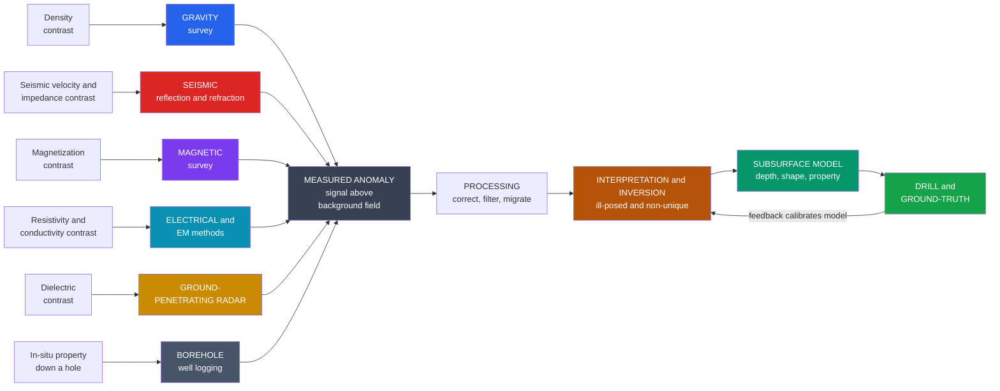

# 🛰️ Exploration Geophysics — Overview

> [!abstract] TL;DR
> **Exploration geophysics** is the **applied** branch of geophysics: imaging the **shallow subsurface non-invasively** to find oil and gas, ore, groundwater, buried hazards, and archaeological structure — without digging. Its power comes from a **toolkit of methods**, each sensing a *different physical property*: **seismic** (elastic velocity and impedance contrasts, the workhorse of petroleum), **gravity** (density contrasts — ore, salt, basins), **magnetic** (magnetization and susceptibility — basement, minerals, archaeology), **electrical and electromagnetic** (resistivity and conductivity — groundwater, minerals, contamination), **ground-penetrating radar** (dielectric contrasts — shallow, high-resolution), and **borehole/well logging** (measuring properties *in situ* down a hole). All share one workflow — **acquisition → processing → interpretation → drilling/ground-truth** — and one hard limit: the **inverse problem is non-unique**, so many subsurface models fit the same data. The remedy is **joint, integrated interpretation** across methods.

## Intuition — analogy FIRST

A doctor cannot cut you open just to check for a tumour, so instead they **see inside non-invasively**: **X-rays** and **CT** for dense bone, **ultrasound** echoes for soft-tissue boundaries, **MRI** for the magnetic response of water-rich tissue. Each machine senses a *different physical property* — density, acoustic contrast, magnetic response — and each produces a *different-looking* picture. A radiologist reads them *together*, because a shadow that is ambiguous on one scan is often nailed down by another.

**Exploration geophysicists do exactly this to the Earth.** They cannot dig a mile down to check for oil, water, or ore, so they **bounce sound waves off buried layers** (seismic), **weigh tiny gravity changes over dense ore bodies** (gravity), **sniff magnetic rocks** (magnetics), **shoot electricity through the ground** (electrical/EM), and **radar-image the top few metres** (GPR). Each method senses a different physical property, and — just like the radiologist — the geophysicist combines them to build a picture of what is hidden below. It is **medical imaging for the planet**, and its central difficulty is the radiologist's difficulty too: a faint blob might be a *small thing nearby* or a *big thing far away*, and one scan alone often cannot tell.

---

## How It Works

Every geophysical method exploits the same chain of logic. A buried target differs from the surrounding rock in **some physical property** — it is denser, faster, more magnetic, more conductive, or has a different dielectric constant. That contrast perturbs a **field measured at the surface** (or in a borehole), producing a localized deviation from the background called an **anomaly**. The geophysicist then runs the physics *backwards* — from the measured anomaly to a model of the buried body's **depth, shape, and property** — and finally **drills** to confirm. Methods split into **active** (you inject the signal: seismic sources, GPR pulses, controlled-source EM) and **passive** (you measure a natural field: gravity, the geomagnetic field, natural potentials). **Gravity and magnetics are the potential-field methods** — smooth, sourced by Laplace/Poisson physics, and support operations like **upward and downward continuation**, but pay for that smoothness with severe **non-uniqueness**.



---

## Key Concepts

### Secondary Level

- **We image the ground without digging.** Instead of drilling everywhere, geophysicists measure signals *at the surface* that respond to what is buried below.
- **Different tools feel different things.** Seismic listens for echoes off buried layers; gravity weighs heavy ore; magnetics sense magnetic rocks; electricity finds water; radar sees shallow objects. Each senses a **different physical property**.
- **An "anomaly" is a bump in the signal.** Over a buried target the measurement deviates from the smooth background — that deviation is what we hunt for.
- **You still have to drill to be sure.** Geophysics narrows down *where* to drill; the drill hole is the final proof (the "ground-truth").
- **Who uses it.** Oil and gas, mining, water supply, engineering and construction, environmental clean-up, archaeology, and hazard mapping.

### Undergraduate Level

- **Property → method map.** Each method is defined by the property it senses:
  - **Seismic** — elastic **velocity** and **acoustic impedance** contrasts; *reflection* seismology maps layer boundaries (petroleum workhorse), *refraction* gives layer velocities and depths.
  - **Gravity** — bulk **density** contrasts; finds dense ore, salt domes, and sedimentary basins.
  - **Magnetic** — rock **magnetization / susceptibility**; maps basement depth, iron-bearing ore, and buried archaeology.
  - **Electrical & EM** — **resistivity / conductivity**; groundwater, mineralization, saltwater intrusion, and contaminant plumes.
  - **GPR** — **dielectric permittivity** contrasts; centimetre-to-metre resolution in the top few metres.
  - **Borehole logging** — measures properties (resistivity, density, sonic, gamma, porosity) *directly in the hole*, calibrating the surface surveys.
- **The shared workflow.** **Acquisition** (survey design, sources, receivers) → **processing** (corrections, filtering, migration) → **interpretation** (build a subsurface model) → **drilling / ground-truth**.
- **Active vs passive.** *Active* methods inject energy (seismic shots, GPR, controlled-source EM); *passive* methods read a naturally existing field (gravity, geomagnetic field, self-potential).
- **Potential-field methods.** Gravity and magnetics obey Laplace's equation in source-free regions, so their fields are **smooth** and satisfy **upward/downward continuation**. Upward continuation is stable and suppresses shallow noise; downward continuation sharpens but *amplifies* noise.
- **Resolution vs penetration.** High frequency / short wavelength → high resolution but shallow reach; low frequency → deep reach but blurry. You cannot maximise both at once.

### Graduate Level

- **The inverse problem is the discipline.** Data `d` and Earth model `m` are linked by a forward operator, `d = G(m) + noise`. Recovering `m` is **ill-posed**: solutions are **non-unique**, unstable, and noise-sensitive — solved with **regularization** (smoothness, sparsity, Occam), **Bayesian** priors, and **resolution/covariance** analysis. (See the sibling note *Geophysical_Inverse_Theory*.)
- **Potential-field non-uniqueness is fundamental.** For gravity, the **Gauss/equivalent-source theorem** guarantees infinitely many mass distributions produce an identical surface field; only external constraints (depth, density, geology) break the tie. The classic degeneracy: the anomaly amplitude scales as `mass / depth²`, so a *small shallow* body mimics a *large deep* one.
- **Depth from anomaly geometry.** For a buried sphere the gravity half-width `x_{1/2} ≈ 0.766·z`, giving `depth ≈ 1.3·x_{1/2}` — a "depth rule". Magnetic **Euler deconvolution** and **spectral (Spector–Grant) depth estimation** generalise this: anomaly *shape and wavenumber content* encode source depth.
- **Different physics, different kernels.** A monopole-like **mass** produces a symmetric positive gravity bell; a **dipole** magnetic source produces an asymmetric anomaly with negative side-lobes (further skewed by field inclination, needing **reduction-to-pole**). Combining methods with *independent kernels* shrinks the null space — the quantitative case for **joint inversion**.
- **Processing is physics-aware.** Seismic **migration** repositions reflectors to their true subsurface location and collapses diffractions; gravity data need **free-air, Bouguer, and terrain** corrections; magnetics need **IGRF** removal and diurnal correction; EM needs **skin-depth** (`δ ∝ sqrt(ρ / f)`) reasoning for depth of investigation.
- **Signal and noise.** Coherent noise (multiples, ground roll, powerline, cultural EM) and random noise are attenuated by **stacking**, **f-k / tau-p filtering**, and **deconvolution**; the survey's **spatial sampling (Nyquist)** sets aliasing limits.

---

## Python Demo

The unifying object of exploration geophysics is the **anomaly** over a buried target. This demo models the response of *one* buried body sensed by *two different methods* to show both **method complementarity** and the **fundamental non-uniqueness** of the inverse problem.

- **Panel 1 — gravity over a buried dense sphere.** A dense ore body produces a symmetric bell-shaped `Δg` profile, `Δg(x) = G·Δm·z / (x² + z²)^{3/2}`. Its **half-width encodes the depth** (`x_{1/2} ≈ 0.766·z`).
- **Panel 2 — magnetic over the *same* body.** A magnetic (dipole) source gives a *different-shaped* anomaly — a central peak flanked by **negative side-lobes** — because it senses a different physical property. Same target, different fingerprint.
- **Panel 3 — normalized shapes together.** Overlaying the two shows why combining methods constrains a target one method alone leaves ambiguous.
- **Panel 4 — depth-vs-amplitude non-uniqueness.** A **small shallow** body and a **large deep** body produce anomalies with the *same peak amplitude*: from the peak alone they are indistinguishable. Only the differing *width* (and independent methods) can separate them — the core inverse-problem difficulty.

```python
# The geophysical ANOMALY: complementarity + depth-amplitude non-uniqueness
import numpy as np
import matplotlib.pyplot as plt

G   = 6.674e-11          # gravitational constant, m^3 kg^-1 s^-2
MU0_4PI = 1.0e-7         # magnetic constant mu0/4pi, T m / A
MGAL = 1.0e5            # 1 m/s^2 = 1e5 mGal
NT  = 1.0e9            # 1 T = 1e9 nT

x = np.linspace(-800, 800, 1601)     # horizontal profile position (m)

# ---------- buried sphere parameters ----------
R      = 100.0                        # radius (m)
drho   = 500.0                        # excess density: dense ore vs host (kg/m^3)
z      = 200.0                        # depth to centre (m)
dmass  = (4.0/3.0)*np.pi*R**3*drho    # excess mass (kg)

# ---------- (1) GRAVITY anomaly of a buried sphere (monopole-like) ----------
def gravity_sphere(x, dmass, z):
    """Vertical gravity anomaly of a buried point mass, returned in mGal."""
    return G * dmass * z / (x**2 + z**2)**1.5 * MGAL

dg = gravity_sphere(x, dmass, z)
dg_max = dg.max()
x_half = z*np.sqrt(2**(2/3) - 1)      # analytic half-width ~ 0.766 z
depth_from_width = x_half/np.sqrt(2**(2/3) - 1)   # recover z from half-width

# ---------- (2) MAGNETIC anomaly of the SAME sphere (vertical dipole) ----------
Mmag = 2.0                            # magnetization (A/m), induced in host field
moment = (4.0/3.0)*np.pi*R**3*Mmag    # magnetic dipole moment (A m^2)
def magnetic_sphere(x, moment, z):
    """Vertical magnetic anomaly of a vertically magnetized sphere, in nT."""
    return MU0_4PI * moment * (2*z**2 - x**2) / (x**2 + z**2)**2.5 * NT

dB = magnetic_sphere(x, moment, z)

# ---------- (4) NON-UNIQUENESS: small-shallow vs large-deep, SAME peak ----------
# Body A: shallow + small.  Body B: deep + large, mass tuned to match A's peak.
zA, RA = 150.0, 60.0
dmA = (4.0/3.0)*np.pi*RA**3*drho
zB = 320.0
dmB = dmA*(zB/zA)**2                  # forces identical peak amplitude
RB = (dmB/((4.0/3.0)*np.pi*drho))**(1/3)
dgA = gravity_sphere(x, dmA, zA)
dgB = gravity_sphere(x, dmB, zB)

# ---------- Plot ----------
fig, ax = plt.subplots(2, 2, figsize=(13, 9))

ax[0,0].plot(x, dg, color="#2563eb", lw=2.5)
ax[0,0].axhline(dg_max/2, color="0.6", ls=":", lw=1)
ax[0,0].axvline( x_half, color="0.6", ls="--", lw=1)
ax[0,0].axvline(-x_half, color="0.6", ls="--", lw=1)
ax[0,0].annotate(f"half-width x1/2 = {x_half:.0f} m\n=> depth z = {depth_from_width:.0f} m",
                 xy=(x_half, dg_max/2), xytext=(250, dg_max*0.7), fontsize=9,
                 color="#2563eb", arrowprops=dict(arrowstyle="->", color="#2563eb"))
ax[0,0].set_title(f"(1) GRAVITY over dense sphere  (peak {dg_max:.2f} mGal)")
ax[0,0].set_xlabel("position x (m)"); ax[0,0].set_ylabel("gravity anomaly (mGal)")
ax[0,0].grid(alpha=0.3)

ax[0,1].plot(x, dB, color="#7c3aed", lw=2.5)
ax[0,1].axhline(0, color="0.5", lw=0.8)
ax[0,1].annotate("negative side-lobes\n(dipole, not monopole)",
                 xy=(360, dB.min()), xytext=(150, dB.min()*3), fontsize=9,
                 color="#7c3aed", arrowprops=dict(arrowstyle="->", color="#7c3aed"))
ax[0,1].set_title("(2) MAGNETIC over the SAME sphere  (different shape)")
ax[0,1].set_xlabel("position x (m)"); ax[0,1].set_ylabel("magnetic anomaly (nT)")
ax[0,1].grid(alpha=0.3)

ax[1,0].plot(x, dg/dg.max(), color="#2563eb", lw=2.5, label="gravity (density)")
ax[1,0].plot(x, dB/dB.max(), color="#7c3aed", lw=2.5, label="magnetic (magnetization)")
ax[1,0].axhline(0, color="0.5", lw=0.8)
ax[1,0].set_title("(3) Same target, two fingerprints => complementarity")
ax[1,0].set_xlabel("position x (m)"); ax[1,0].set_ylabel("normalized anomaly")
ax[1,0].legend(fontsize=9); ax[1,0].grid(alpha=0.3)

ax[1,1].plot(x, dgA, color="#dc2626", lw=2.5,
             label=f"shallow + small  (z={zA:.0f} m, R={RA:.0f} m)")
ax[1,1].plot(x, dgB, color="#16a34a", lw=2.5, ls="--",
             label=f"deep + large  (z={zB:.0f} m, R={RB:.0f} m)")
ax[1,1].set_title(f"(4) NON-UNIQUENESS: same peak ({dgA.max():.3f} mGal), different width")
ax[1,1].set_xlabel("position x (m)"); ax[1,1].set_ylabel("gravity anomaly (mGal)")
ax[1,1].legend(fontsize=9); ax[1,1].grid(alpha=0.3)

plt.tight_layout()
plt.savefig("exploration_geophysics_overview.png", dpi=120)
print("Saved exploration_geophysics_overview.png")
print(f"Gravity peak      : {dg_max:.3f} mGal   (depth recovered from width: {depth_from_width:.0f} m)")
print(f"Magnetic peak     : {dB.max():.1f} nT  (with negative side-lobes -> dipole signature)")
print(f"Non-uniqueness    : shallow-small peak {dgA.max():.3f} mGal == deep-large peak {dgB.max():.3f} mGal")
```

Running it shows the two lessons of exploration geophysics in one figure: the **same buried body looks different to different methods** (so combining them helps), yet a **single method is fundamentally ambiguous** — a small shallow source and a big deep one can produce identical peak signals, resolved only by anomaly *shape*, extra data, and the drill.

---

## Real-World Applications

- **Petroleum (oil & gas).** 2-D/3-D/4-D **reflection seismology** is the industry workhorse, imaging traps, reservoirs, and salt; gravity and magnetics reconnaissance maps basin architecture before expensive seismic. Time-lapse ("4-D") seismic monitors production and CO₂ injection.
- **Mining & mineral exploration.** **Airborne magnetics and EM** map ore-hosting structures over huge areas cheaply; **gravity** targets dense sulphide bodies; **induced polarization (IP)** detects disseminated mineralization. The critical-minerals push (Li, Cu, rare earths) has revived exploration geophysics.
- **Groundwater / hydrogeology.** **Electrical resistivity tomography (ERT)** and **transient EM** map aquifers, the water table, and **saltwater intrusion**; airborne EM (e.g. Denmark's national aquifer mapping) images whole regions.
- **Geotechnical & engineering.** Shallow **seismic refraction (MASW)**, resistivity, and micro-gravity assess bedrock depth, voids/sinkholes, dam integrity, and tunnel routes before construction.
- **Environmental.** Resistivity, EM, and GPR delineate **contaminant plumes**, landfill boundaries, and buried tanks/drums for remediation.
- **Archaeology & forensics.** **GPR and magnetic gradiometry** reveal buried walls, graves, and hearths without excavation — non-destructive site surveys.
- **Hazards & planetary.** Geophysics maps active faults, unstable slopes, and permafrost; the same physics rode to Mars on **NASA InSight's** seismometer to sound the planet's interior.

---

## Common Pitfalls

- **Each method senses a *different* property — don't over-read one.** A gravity "high" means *dense*, not *oil*; a magnetic "high" means *magnetic rock*, not *ore grade*. Map the measured property to geology carefully, and remember one method's blind spot is often another's strength.
- **Treating an inverse solution as unique.** Potential-field data admit **infinitely many** source models (equivalent-source theorem). Any "recovered" body is one of many; always report the assumptions (density, depth range) and the **resolution/uncertainty**, and prefer models constrained by geology.
- **The depth-vs-amplitude trap.** A *small shallow* anomaly and a *large deep* one can look identical in amplitude (see the demo). Sparse or noisy sampling makes the ambiguity worse — dense profiles and independent methods are what break it.
- **Resolution vs depth-of-penetration confusion.** You cannot have high resolution *and* deep reach simultaneously: high-frequency GPR is crisp but shallow; low-frequency seismic/EM reach deep but blur. Choose the method to the target depth and required detail.
- **Skipping the corrections.** Uncorrected data lie: gravity needs free-air/Bouguer/terrain corrections; magnetics need IGRF and diurnal removal; seismic needs statics and migration. Skipping them creates artefacts mistaken for structure.
- **Noise and signal processing.** Ground roll, multiples, powerlines, and cultural EM masquerade as targets. Filtering and stacking help, but *over*-processing can also fabricate "features" — validate against raw data.
- **Interpreting in isolation instead of jointly.** The single biggest force-multiplier is **integrated / joint interpretation**: seismic for structure, gravity/magnetics for boundaries, EM/resistivity for fluids, logs for calibration — cross-constraining independent physics shrinks the non-uniqueness that dooms any single method.
- **Forgetting active vs passive limits.** Passive methods (gravity, magnetics) give no control over illumination or timing; active methods (seismic, GPR, CSEM) cost more and can be logistically/environmentally restricted. Match the method to site access and budget.

---

## Related Concepts

- [[Geophysics_Overview]] — the parent discipline; this note is its **applied, shallow-subsurface** counterpart aimed at resources and hazards.
- [[Earths_Gravity_Field_and_Geodesy]] — the potential-field physics behind **gravity surveying** and its corrections and continuation.
- [[Geomagnetism_and_the_Geodynamo]] — the field and rock magnetism underlying **magnetic surveying** and reduction-to-pole.
- [[Elasticity_and_Seismic_Wave_Theory]] — the elastic-wave physics behind **reflection and refraction** seismics.
- [[Seismic_Ray_Theory_and_Travel_Times]] — travel-time analysis that turns seismic arrivals into layer velocities and depths.
- [[Seismic_Tomography_and_Earth_Imaging]] — the inversion/imaging paradigm scaled from the whole Earth down to prospect scale.
- [[Economic_Geology_and_Resources]] — the ore, petroleum, and mineral deposits that gravity, magnetic, and EM surveys are deployed to find.
- [[Groundwater_and_Karst]] — the aquifers and voids targeted by resistivity, EM, and micro-gravity in hydrogeology.
- [[Gravity_Isostasy_and_the_Geoid]] — regional density/mass context that a local gravity survey sits within.
- [[Geomagnetism_and_Paleomagnetism]] — rock magnetization and remanence that shape magnetic anomalies.
- [[Newtons_Laws_and_Kinematics]] — the gravitation and mechanics behind the gravity method.
- [[Gauss_Law_and_Electric_Potential]] — the potential-theory backbone (Laplace/Poisson) shared by gravity, magnetics, and DC resistivity.
- [[Maxwells_Equations]] — the electromagnetic foundation of EM, GPR, and controlled-source methods.
- [[Electromagnetic_Waves_and_Radiation]] — the wave physics behind ground-penetrating radar and dielectric contrasts.
- [[Wave_Motion_and_Properties]] — the general wave behaviour (reflection, refraction, impedance) underlying seismic and GPR imaging.

---

## Review Questions

### Secondary Level

1. A geophysicist wants to find a dense metal ore body buried underground without digging. Which measurement would help most — measuring tiny changes in gravity, or measuring the colour of surface rocks — and why?
2. Explain in your own words what an "anomaly" is in a geophysical survey, and why you would still need to drill after finding one.

### Undergraduate Level

3. Match each method to the physical property it senses and give one target it is good at: (a) seismic reflection, (b) gravity, (c) magnetics, (d) electrical resistivity, (e) ground-penetrating radar. Why is it useful that different methods sense different properties?
4. A gravity profile over a buried sphere is bell-shaped with a half-width of about 150 m. Roughly how deep is the sphere's centre, and what feature of the anomaly did you use to estimate it? Why can't the *amplitude* alone give you the depth?

### Graduate Level

5. Explain why potential-field (gravity/magnetic) inversion is "non-unique," referencing the equivalent-source concept and the depth-vs-amplitude degeneracy. Describe two independent strategies (e.g. regularization, complementary methods, geological constraints) that make a usable model recoverable.
6. You must characterise a target at ~500 m depth with as much detail as possible, but your budget allows only two methods. Discuss the resolution-vs-penetration tradeoff, choose two complementary methods that sense *different* properties, and explain how their **joint interpretation** reduces ambiguity compared with either alone.

---

## Sources

- Telford, W. M., Geldart, L. P. & Sheriff, R. E. — *Applied Geophysics* (2nd ed., Cambridge University Press).
- Reynolds, J. M. — *An Introduction to Applied and Environmental Geophysics* (2nd ed., Wiley-Blackwell).
- Kearey, P., Brooks, M. & Hill, I. — *An Introduction to Geophysical Exploration* (3rd ed., Blackwell Science).
- Milsom, J. & Eriksen, A. — *Field Geophysics* (4th ed., Wiley).
- Blakely, R. J. — *Potential Theory in Gravity and Magnetic Applications* (Cambridge University Press).

---

#geophysics #exploration-geophysics #subsurface-imaging #applied-geophysics #survey-methods
