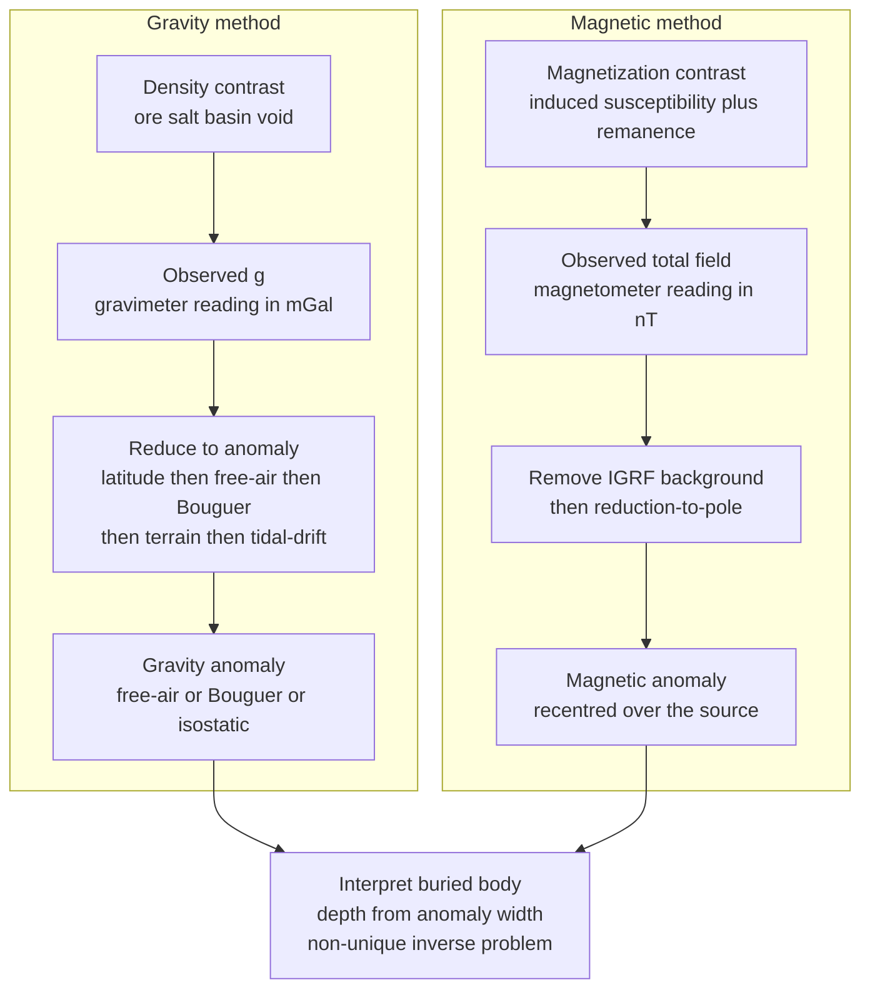

# 🧲 Gravity and Magnetic Surveying

> [!abstract] TL;DR
> Gravity and magnetic surveying are the two **passive potential-field** exploration methods: both measure a natural field the Earth already produces, and both sense where the subsurface *differs* from its background. A **gravimeter** detects millionths-of-$g$ variations (milligals, microgals) caused by **density** contrasts — ore bodies, salt domes, sedimentary basins, buried valleys, cavities. A **magnetometer** maps **nanotesla** wobbles in the geomagnetic field caused by rock **magnetization** — iron formations, volcanic basement, kimberlites, unexploded ordnance, even buried walls. Raw readings are useless until reduced to an **anomaly**: gravity needs latitude, free-air, Bouguer, terrain, and tidal/drift corrections; magnetics needs the **IGRF** removed and often a **reduction-to-pole**. Because both fields are **harmonic** (they obey Laplace's equation outside the source), they can be upward/downward-continued and differentiated to sharpen features — but they share a fatal flaw: **non-uniqueness**. Infinitely many buried bodies fit the same surface field, so interpretation is an inverse problem, not a measurement.

## Intuition — analogy FIRST

Bury a barrel of dense gold ore a few metres down and stand over it. You now weigh an *infinitesimal* fraction more than you did a step to the side — the extra mass pulls you a whisker harder. Bury an iron pipe instead, and a compass needle held above it will tug a hair off true north, because the iron distorts the Earth's magnetic field. Neither effect is visible; both are real, and both are measurable with the right instrument.

That is the whole game. A **gravity survey** carries a scale so absurdly sensitive it can feel that buried barrel — it maps where the ground below is **denser** (ore, iron formations, compacted basement) or **less dense** (salt, voids, loose basin fill). A **magnetic survey** carries an ultra-precise compass — a magnetometer — that maps where rocks are **more magnetic** (basalt, magnetite-rich ore, volcanic basement) than their neighbours. Neither instrument sees the buried object directly. Each only records the faint **whisper** that hidden mass, or hidden magnetization, leaves in the planet's gravity and magnetic fields — and the geophysicist's craft is to reconstruct the object from the whisper.

---

## How It Works

### Core Mechanics

1. **Passive fields already exist.** Unlike seismic or resistivity surveys, you inject nothing. Gravity comes from Newtonian attraction of all mass; magnetism comes from the geodynamo's main field plus the magnetization it induces (and locks) in rocks. You simply measure the field and hunt for departures from its smooth regional trend.

2. **A contrast, not an absolute, is what shows.** A uniform half-space produces no anomaly. Only a **density contrast** $\Delta\rho$ (gravity) or a **magnetization contrast** $\Delta M$ (magnetics) between a body and its surroundings creates a measurable bump. Salt in sandstone reads negative; magnetite in granite reads strongly positive.

3. **The raw reading is dominated by boring effects.** For gravity, the equator-to-pole latitude change ($\sim$5200 mGal) and station elevation swamp any target. So you subtract the predictable parts: **latitude** (normal gravity), **free-air** (height), **Bouguer** (mass of intervening rock), **terrain**, and **tidal/instrument-drift** corrections. What remains is the **gravity anomaly**. For magnetics you subtract the **IGRF** (the global reference field model) and diurnal variation, leaving the **magnetic anomaly**.

4. **Reduction makes anomalies interpretable.** Gravity gives you a choice of anomaly — **free-air** (height only), **Bouguer** (height + rock slab), or **isostatic** (also removes deep compensating roots). Magnetics at mid-latitudes produces a skewed dipolar shape; **reduction-to-pole (RTP)** mathematically re-magnetizes everything vertically so anomalies sit symmetrically *over* their sources.

5. **Width encodes depth.** For a compact body the **half-width** of its anomaly scales with burial depth — for a buried sphere, depth $\approx 1.3\times$ the half-width-at-half-maximum. Shallow bodies make sharp, narrow anomalies; deep bodies make broad, gentle ones.

6. **The inverse problem is non-unique.** Both fields are harmonic (Laplace outside the source), so a shallow small body and a deep large one can produce identical surface fields. Interpretation therefore needs geological constraints, drilling, or seismics — a gravity/magnetic map alone never *proves* a subsurface model.

### Flow / Architecture



---

## Key Concepts

### Secondary Level

**Both methods weigh or magnetize the invisible.** A gravity survey is a super-sensitive weighing exercise: stand a **gravimeter** on the ground and it reads $g$ to about a **milligal** (1 mGal $= 10^{-5}$ m/s², roughly one-millionth of gravity). Where the rock below is heavier (dense ore, iron formation), $g$ reads slightly *high*; where it is lighter (salt, a cave, loose basin fill), $g$ reads slightly *low*.

A magnetic survey is a super-sensitive compass exercise: a **magnetometer** reads the strength of the magnetic field to a fraction of a **nanotesla** (nT; the whole Earth's field is $\sim$25,000–65,000 nT). Rocks rich in magnetic minerals (magnetite in basalt or ore) distort the field and make a **magnetic anomaly**.

**Passive and cheap.** Neither method sends anything into the ground — they just listen to fields the Earth already makes. That makes them fast and inexpensive, ideal for *reconnaissance*: scanning a huge area to decide where to spend money on drilling.

### Undergraduate Level

**Gravity: from raw reading to anomaly.** A gravimeter reading must survive a gauntlet of corrections before it means anything:

- **Latitude / normal gravity** — subtract theoretical gravity $\gamma(\phi)$ from the International Gravity Formula (the equator-to-pole $\sim$5200 mGal trend).
- **Free-air correction** — add $0.3086\,h$ mGal ($h$ in metres) to restore the height you gained above the datum (you are farther from the mass, so $g$ dropped).
- **Bouguer correction** — subtract the pull of the rock slab between station and datum, $0.0419\,\rho\,h$ mGal ($\rho$ in g/cm³) — typically $\sim$0.11 mGal/m for crustal rock.
- **Terrain correction** — account for nearby valleys (missing mass) and peaks (extra mass) that a flat slab ignores.
- **Tidal and drift correction** — remove solid-Earth/ocean tides ($\sim$0.3 mGal) and the slow creep of the spring gravimeter, usually via repeat base-station readings.

The **free-air anomaly** $\Delta g_{FA}=g_{obs}-\gamma+0.3086h$ keeps the topographic mass; the **Bouguer anomaly** $\Delta g_B=\Delta g_{FA}-0.0419\rho h$ removes it to expose density variation at depth; the **isostatic anomaly** additionally strips the deep low-density root that compensates a mountain (linking to isostasy and flexure). Each answers a different question.

**Forward model + depth rule.** A buried sphere of anomalous mass $\Delta m=\tfrac{4}{3}\pi R^3\Delta\rho$ at depth $z$ gives, along a surface profile,
$$\Delta g(x)=\frac{G\,\Delta m\,z}{\left(x^2+z^2\right)^{3/2}}.$$
Its peak $\Delta g_{max}=G\Delta m/z^2$ fixes the mass; its **half-width-at-half-maximum** $x_{1/2}$ fixes the depth: setting $\Delta g=\Delta g_{max}/2$ gives $x_{1/2}=z\sqrt{2^{2/3}-1}\approx 0.766\,z$, i.e. **depth $\approx 1.30\,x_{1/2}$** — the classic half-width rule.

**Magnetics: susceptibility, induced vs remanent.** A rock's magnetization has two parts: **induced** $\mathbf{M}=\chi\mathbf{H}$ (proportional to susceptibility $\chi$, aligned with today's field) and **remanent** (frozen in when the rock formed, possibly pointing anywhere — the paleomagnetic memory). The measured **total-field anomaly** at mid-latitudes is a lopsided positive-negative pair because the ambient field is inclined; **reduction-to-pole (RTP)** transforms the data as if the field and magnetization were vertical, re-centring each anomaly over its source. Surveys record either the **total field** (scalar magnetometer) or **gradients** (gradiometer — two sensors differenced), which suppress regional trends and sharpen shallow targets. The **IGRF** must be removed first to isolate crustal anomalies from the main geodynamo field.

### Graduate Level

**Potential-field mathematics.** Both fields derive from a scalar potential obeying **Laplace's equation** in source-free space ($\nabla^2 U=0$; $\nabla^2 V_m=0$). Harmonicity buys powerful tools:

- **Upward continuation** (a stable, smoothing convolution) recomputes the field at greater height, suppressing shallow noise to emphasise deep sources — the basis for separating regional from residual.
- **Downward continuation** is the inverse and is numerically *unstable*: it amplifies short wavelengths exponentially ($e^{kz}$ in the wavenumber domain), so it must be regularised or band-limited.
- **Derivative enhancements** — horizontal/vertical gradients, analytic signal, tilt derivative — locate edges and estimate depths (e.g. Euler deconvolution) by exploiting how derivatives sharpen anomaly flanks.

**Poisson's relation** ties the two methods: for a body of *uniform* density and *uniform* magnetization, the magnetic potential is proportional to the directional derivative of the gravitational potential along the magnetization direction. Where the same body produces both anomalies, this predicts one field from the other and underpins pseudo-gravity transforms.

**Reduction-to-pole and equatorial trouble.** RTP applies a phase/amplitude filter $1/[(\sin I + i\cos I\cos(D-\theta))^2]$ in the wavenumber domain, where $I,D$ are the field's inclination and declination and $\theta$ the wavenumber azimuth. Near the magnetic equator ($I\to 0$) the denominator blows up along strike, so RTP is unstable and analysts switch to **reduction-to-equator** or amplitude-based transforms (analytic signal), which are inclination-independent.

**Non-uniqueness and the inverse problem.** The Newtonian potential operator has an infinite-dimensional null space: distributing mass differently in depth while conserving the surface field leaves the anomaly unchanged (Gauss's theorem fixes only the *total* excess mass for a bounded source, not its shape or depth). Every inversion therefore requires prior information and regularisation — the doorway to geophysical inverse theory.

**Instruments and platforms.** Relative spring gravimeters (LaCoste–Romberg, Scintrex CG-6) and absolute/atom-interferometer instruments reach µGal precision for **microgravity** (cavities, tunnels, archaeology). Optically-pumped and Overhauser magnetometers reach sub-nT precision. **Aeromagnetic** surveys blanket continents cheaply from aircraft; **satellite gravimetry** (GRACE/GRACE-FO time-variable mass, GOCE static gradients) extends the gravity method to planetary scale.

---

## Python Demo

```python
# Potential-field anomalies over buried bodies, with corrections and RTP.
#   (a) GRAVITY  : anomaly of a buried sphere; recover DEPTH from the half-width
#                  (depth ~ 1.3 x half-width-at-half-maximum), plus a bar view of
#                  the free-air / Bouguer elevation corrections.
#   (b) MAGNETIC : total-field anomaly of a buried dipole at mid-latitude
#                  (asymmetric +/- shape) vs reduction-to-pole (recentred).
# Requires numpy + matplotlib.
import numpy as np
import matplotlib.pyplot as plt

G = 6.674e-11                     # gravitational constant, m^3 kg^-1 s^-2
x = np.linspace(-1500, 1500, 1201)   # survey line, metres

# ---------------------------------------------------------------
# (a) GRAVITY: buried sphere.  dg(x) = G*dm*z / (x^2 + z^2)^(3/2)
# ---------------------------------------------------------------
def gravity_sphere_mGal(x, z, R, d_rho):
    dm = (4.0/3.0)*np.pi*R**3*d_rho          # anomalous mass, kg
    return (G*dm*z/(x**2 + z**2)**1.5)*1e5    # m/s^2 -> mGal

def half_width_hwhm(x, prof):
    """Half-width at half-maximum on the x>=0 flank of a centred, peaked profile."""
    xp, pp = x[x >= 0], prof[x >= 0]
    half = pp.max()/2.0
    i = np.argmax(pp <= half)                 # first index at/below half-max
    x1, x2, p1, p2 = xp[i-1], xp[i], pp[i-1], pp[i]
    return x1 + (half - p1)*(x2 - x1)/(p2 - p1)

z_true, R = 400.0, 200.0
dg = gravity_sphere_mGal(x, z_true, R, d_rho=+500.0)   # dense ore, +500 kg/m^3
hwhm = half_width_hwhm(x, dg)
z_est = hwhm/np.sqrt(2**(2/3) - 1)            # depth-rule inversion (~1.305 * hwhm)

print("GRAVITY - buried sphere:")
print(f"  peak anomaly     : {dg.max():+.3f} mGal")
print(f"  half-width (HWHM): {hwhm:6.1f} m")
print(f"  depth (true/est) : {z_true:.0f} / {z_est:.0f} m   [rule: depth ~ 1.30 x HWHM]")

# Free-air & Bouguer corrections for a station 200 m above datum (rho=2.67 g/cm^3)
h, rho = 200.0, 2.67
fa  = +0.3086*h                               # free-air: add back elevation, mGal
boug = -0.04193*rho*h                         # Bouguer : remove rock slab, mGal
print(f"\nCORRECTIONS at h={h:.0f} m: free-air {fa:+.1f}, Bouguer {boug:+.1f}, "
      f"net {fa+boug:+.1f} mGal")

# ---------------------------------------------------------------
# (b) MAGNETIC: buried dipole total-field anomaly, and RTP.
#     Coordinates: x = north (declination 0), z = down. Field/magnetization
#     direction = (cos I, sin I). Dipole field ~ [3(m.u)u - m]/r^3; the
#     total-field anomaly is its projection onto the ambient field direction.
# ---------------------------------------------------------------
def dipole_TF(x, z0, incl_deg, C=4.0e6):
    I = np.radians(incl_deg)
    mx, mz = np.cos(I), np.sin(I)             # magnetization = ambient-field dir.
    fx, fz = mx, mz                           # induced case: they coincide
    rx, rz = x, -z0*np.ones_like(x)           # dipole at (0, z0) -> obs at (x, 0)
    r = np.sqrt(rx**2 + rz**2)
    ux, uz = rx/r, rz/r
    mdu = mx*ux + mz*uz
    Bx = (3*mdu*ux - mx)/r**3
    Bz = (3*mdu*uz - mz)/r**3
    return C*(fx*Bx + fz*Bz)                  # nT (model units)

z_mag = 300.0
mag_mid = dipole_TF(x, z_mag, incl_deg=60.0)  # mid-latitude: skewed +/- shape
mag_rtp = dipole_TF(x, z_mag, incl_deg=90.0)  # reduction-to-pole: vertical field
print(f"\nMAGNETIC - buried dipole (z={z_mag:.0f} m):")
print(f"  mid-lat peak at x = {x[np.argmax(mag_mid)]:+.0f} m (off-centre, asymmetric)")
print(f"  RTP     peak at x = {x[np.argmax(mag_rtp)]:+.0f} m (recentred over source)")

# ---------------------------------------------------------------
# Plots
# ---------------------------------------------------------------
fig, ax = plt.subplots(2, 2, figsize=(12, 9))

# gravity anomaly + half-width -> depth
ax[0,0].plot(x, dg, color="#dc2626", lw=2)
ax[0,0].axhline(dg.max()/2, color="grey", ls="--", lw=1)
ax[0,0].plot([-hwhm, hwhm], [dg.max()/2]*2, "o", color="#1d4ed8")
ax[0,0].annotate(f"HWHM = {hwhm:.0f} m\ndepth est = {z_est:.0f} m\n(true {z_true:.0f} m)",
                 xy=(hwhm, dg.max()/2), xytext=(500, dg.max()*0.6),
                 arrowprops=dict(arrowstyle="->"))
ax[0,0].set_title("Gravity anomaly over a buried sphere")
ax[0,0].set_xlabel("Distance (m)"); ax[0,0].set_ylabel("Anomaly (mGal)")
ax[0,0].grid(alpha=0.3)

# corrections as a bar/offset view
bars = ["Free-air\n(+0.3086 h)", "Bouguer\n(-0.0419 rho h)", "Net elevation"]
vals = [fa, boug, fa+boug]
cols = ["#2563eb", "#b45309", "#059669"]
ax[0,1].bar(bars, vals, color=cols)
ax[0,1].axhline(0, color="k", lw=0.8)
for i, v in enumerate(vals):
    ax[0,1].text(i, v + (2 if v >= 0 else -4), f"{v:+.1f}", ha="center")
ax[0,1].set_title(f"Gravity corrections at h = {h:.0f} m")
ax[0,1].set_ylabel("mGal"); ax[0,1].grid(alpha=0.3, axis="y")

# magnetic: mid-latitude vs RTP
ax[1,0].plot(x, mag_mid, color="#7c3aed", lw=2, label="mid-latitude (I=60)")
ax[1,0].plot(x, mag_rtp, color="#0891b2", lw=2, ls="--", label="reduction-to-pole")
ax[1,0].axhline(0, color="k", lw=0.8)
ax[1,0].axvline(0, color="grey", lw=0.8, ls=":")
ax[1,0].set_title("Magnetic anomaly: mid-latitude vs RTP")
ax[1,0].set_xlabel("Distance (m)"); ax[1,0].set_ylabel("Total-field anomaly (nT)")
ax[1,0].legend(); ax[1,0].grid(alpha=0.3)

# depth rule verification across several depths
depths = np.array([200, 300, 400, 500, 600, 800.0])
est = [half_width_hwhm(x, gravity_sphere_mGal(x, zz, R, 500.0))
       / np.sqrt(2**(2/3)-1) for zz in depths]
ax[1,1].plot(depths, depths, "k--", label="ideal y = x")
ax[1,1].plot(depths, est, "o-", color="#dc2626", label="from half-width rule")
ax[1,1].set_title("Depth recovered from anomaly half-width")
ax[1,1].set_xlabel("True depth (m)"); ax[1,1].set_ylabel("Estimated depth (m)")
ax[1,1].legend(); ax[1,1].grid(alpha=0.3)

plt.tight_layout()
plt.savefig("gravity_magnetic_survey_demo.png", dpi=120)
print("\nSaved figure to gravity_magnetic_survey_demo.png")
```

Running it recovers the sphere's 400 m depth to within a few metres from the anomaly half-width alone, prints the competing free-air ($+61.7$ mGal) and Bouguer ($-22.4$ mGal) corrections, and shows the magnetic anomaly's off-centre mid-latitude skew snapping back over the source once reduced-to-pole — the exact operations a field crew performs to turn raw dials into a buried body.

---

## Real-World Applications

> **Example — aeromagnetic mapping of magnetic basement and kimberlites.** Flying a magnetometer on a grid over a continent, geophysicists map the depth to crystalline basement (magnetic) beneath non-magnetic sedimentary cover, outlining basins for petroleum and directly detecting **kimberlite pipes** (the diamond-bearing volcanic bodies) as tight circular anomalies — the workhorse first pass of mineral exploration.

- **Mineral exploration.** Dense, magnetite-rich sulphide and iron-oxide ores raise *both* the Bouguer gravity and the magnetic anomaly, making joint gravity-magnetic surveys a cheap prospect-screening tool before drilling.
- **Petroleum and salt tectonics.** Low-density **salt domes** and sedimentary basins depress the Bouguer anomaly; gravity delineates basin geometry and salt structure that trap hydrocarbons, complementing seismic reflection.
- **Microgravity for voids and archaeology.** µGal-precision surveys detect caves, tunnels, sinkholes, and abandoned mine workings as negative anomalies — used in geotechnical site investigation and to find buried tombs and chambers.
- **Archaeological magnetics.** Fired hearths, kilns, brick walls, and iron artefacts carry magnetization; magnetic gradiometry maps buried Roman roads, walls, and settlements without excavation.
- **UXO and environmental.** Magnetometers locate buried unexploded ordnance, pipelines, drums, and steel debris; gradiometers suppress geologic background to isolate the man-made target.
- **Regional tectonics and isostasy.** Bouguer and isostatic anomalies over mountain belts reveal crustal roots and flexure; satellite gravity (GRACE/GOCE) extends the method to ice-mass and groundwater change.

---

## Common Pitfalls

- **Skipping or mis-ordering the gravity corrections.** A raw reading is dominated by latitude, elevation, and tides, all far larger than the target. Latitude → free-air → Bouguer → terrain → tidal/drift must all be applied (and in a consistent datum) before the number is an *anomaly*. Omit any one and you interpret noise.
- **Confusing free-air, Bouguer, and isostatic anomalies.** The free-air anomaly still contains the topographic mass; Bouguer removes the slab; isostatic also removes the deep compensating root. Over a compensated mountain the free-air is near zero while the Bouguer is strongly negative — both correct, answering different questions. Reporting the wrong one misleads completely.
- **Density units in the Bouguer term.** The coefficient $0.0419\,\rho$ mGal/m expects $\rho$ in **g/cm³**; plugging kg/m³ inflates the correction 1000×. A perennial sign/scale blunder alongside mixing mGal with SI m/s² ($10^5$ apart).
- **Total-field vs component magnetics.** Scalar magnetometers give the field *magnitude* (total-field anomaly), not a vector component. Treating a total-field reading as if it were the vertical component, or comparing surveys with different sensor orientations, corrupts amplitudes and shapes.
- **Ignoring remanent magnetization.** RTP and susceptibility inversions assume magnetization is *induced* (parallel to today's field). Rocks with strong **remanence** (basalts, some ore) point elsewhere, so RTP mislocates the anomaly and Königsberger-ratio corrections are needed — a frequent source of drilling misses.
- **Unstable reduction-to-pole and downward continuation.** RTP diverges near the magnetic equator ($I\to0$); downward continuation amplifies short-wavelength noise exponentially. Both need band-limiting/regularisation, or you fabricate high-frequency artefacts.
- **Forgetting to remove the IGRF (and diurnal drift).** Magnetic anomalies are tiny departures from the $\sim$50,000 nT main field; you must subtract the **IGRF** model and correct diurnal variation (via a base-station magnetometer) or the crustal signal drowns in the geodynamo's field.
- **Treating an inversion as unique.** Both fields are harmonic, so a shallow small body and a deep large one fit the same data. Never present a single potential-field model as *the* subsurface — constrain with geology, drilling, or seismics.

---

## Related Concepts

- **Sibling notes** (this Potential-Fields & Exploration section, prose only) — *Exploration_Geophysics_Overview* frames all the exploration methods together; *Electrical_and_Electromagnetic_Methods* are the complementary *active* techniques for conductivity/resistivity; *Geophysical_Inverse_Theory* formalises the non-uniqueness raised throughout; *Isostasy_and_Lithospheric_Flexure* is where the isostatic anomaly leads; *Paleomagnetism_and_the_Magnetic_Record* explains the remanent magnetization that complicates RTP.
- [[Earths_Gravity_Field_and_Geodesy]] — the potential-theory / geodesy parent: normal gravity, the geoid, and the free-air/Bouguer anomalies this note deploys in the field
- [[Geomagnetism_and_the_Geodynamo]] — the main field and IGRF that magnetic surveys must subtract before crustal anomalies appear
- [[Gravity_Isostasy_and_the_Geoid]] — the geology-level treatment of gravity anomalies, isostatic roots, and the geoid
- [[Geomagnetism_and_Paleomagnetism]] — induced vs remanent magnetization and the rock-magnetic memory behind magnetic anomalies
- [[Gauss_Law_and_Electric_Potential]] — the identical potential-theory machinery (Gauss, Poisson/Laplace) that makes both fields harmonic
- [[Magnetism_and_Biot_Savart]] — the magnetic dipole field underlying the anomaly of a buried magnetized body
- [[Newtons_Laws_and_Kinematics]] — the inverse-square gravitation that every gravity anomaly rests on
- [[Vector_Calculus_and_Differential_Operators]] — gradient, divergence, and the field-from-potential relation used in continuation and derivative enhancement
- [[Partial_Differential_Equations]] — the Laplace/Poisson equations governing both potential fields

---

## Review Questions

1. **Secondary:** You carry a gravimeter over a buried salt dome and, separately, a magnetometer over a buried iron-ore body. State the *sign* of each anomaly (high or low reading) and explain, in terms of density and magnetization, why the two targets behave oppositely in the two methods.
2. **Undergraduate:** A gravity profile over a compact body has a peak of 0.8 mGal and a half-width-at-half-maximum of 300 m. (a) Estimate the burial depth using the sphere depth rule and state the assumption you are making. (b) List, in order, the corrections you applied to the raw reading to obtain this anomaly, and give the sign of the free-air correction for a hilltop station.
3. **Graduate:** A mid-latitude aeromagnetic survey shows a skewed positive-negative anomaly that does not sit over the mapped intrusion. (a) Explain physically why the anomaly is asymmetric and how reduction-to-pole would correct it. (b) Why might RTP *fail* to centre this particular anomaly, and what two independent phenomena — one about the field geometry, one about the rock — could be responsible? (c) How does the non-uniqueness of potential-field inversion limit how confidently you can convert either the gravity or the magnetic map into a depth-to-body?

---

## Sources

- Telford, Geldart & Sheriff — *Applied Geophysics*, 2nd ed. (gravity and magnetic methods, corrections, interpretation)
- Blakely — *Potential Theory in Gravity and Magnetic Applications* (harmonic fields, continuation, RTP, Poisson's relation, inversion)
- Kearey, Brooks & Hill — *An Introduction to Geophysical Exploration*, 3rd ed. (survey practice, reductions, anomaly modelling)
- Reynolds — *An Introduction to Applied and Environmental Geophysics*, 2nd ed. (microgravity, magnetic gradiometry, archaeology, UXO)
- Hinze, von Frese & Saad — *Gravity and Magnetic Exploration: Principles, Practices, and Applications* (Cambridge, 2013)

---

#geophysics #gravity-survey #magnetic-survey #potential-fields #exploration
