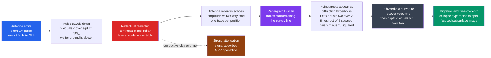

# 📡 Ground-Penetrating Radar and Near-Surface Geophysics

> [!abstract] TL;DR
> **Ground-penetrating radar (GPR)** drags an antenna along the ground while it fires **short electromagnetic pulses** (tens of MHz to a few GHz) straight down and times the **echoes** that bounce back. Reflections come not from density (as in seismics) but from contrasts in **dielectric permittivity** `εr` — pipes, rebar, soil layers, the water table, voids and buried objects. The pulse travels at a **radar velocity** `v = c/sqrt(εr)`, so the *shape* of an echo carries depth: a buried point target sweeps out a **diffraction hyperbola** `t(x) = (2/v)·sqrt(d² + (x−x0)²)` on the **radargram**, and fitting that hyperbola's curvature recovers **both the ground velocity and the target depth**. GPR lives under a hard **frequency trade-off** — high frequency gives fine resolution but shallow penetration, low frequency reaches deeper but blurs — and a hard **material limit**: it is brilliant in dry, resistive ground (dry sand, ice, concrete, granite) and nearly blind in wet **clay** or **saline/conductive** ground, where the wave is absorbed within centimetres. It is the shallow, high-resolution workhorse of **near-surface geophysics**: utility locating, concrete and bridge-deck inspection, archaeology, forensics, glaciology and geotechnical void detection.

## Intuition — analogy FIRST

A bat flying in the dark can't see the wall in front of it, so it does something cleverer: it **chirps** and listens for the **echo**. The delay between chirp and echo tells it how far the wall is; the pattern of echoes from many chirps builds a mental map of the cave. **Ground-penetrating radar is a bat pointed at the ground** — except instead of sound, it uses **radio waves**, and instead of a wall ahead it listens for whatever is buried below.

Drag the antenna along the surface and, at every step, it sends a faint radar pulse straight down. Each buried thing that is *electrically different* from the surrounding soil — a plastic pipe, a steel rebar, a concrete slab, an air-filled void, a buried wall, even a grave — bounces a little of that pulse back up. **Time the echoes** and you learn how deep each reflector is; **stack the timed echoes** from thousands of positions side by side and you get a **cross-section of the shallow underground**, drawn without lifting a single shovel of dirt. That is exactly how a utility crew finds the gas main before the excavator swings, and how an archaeologist maps the foundations of a buried Roman villa without touching a trowel. GPR is **radar sonar for the first few metres of Earth**.

One quirk falls straight out of the analogy. When the bat's chirp hits a small isolated object (a single hanging pebble), it hears an echo even when it is still a little to the side of it — and the echo is *earliest* when it is directly overhead and *later* when off to either side. Plot echo-time against the bat's position and that single pebble draws a smooth **U-shaped curve — a hyperbola**. Every isolated buried target in GPR does the same, and that hyperbola is not noise: its curvature is the key that unlocks how fast the radar wave travels in *this particular* soil, and therefore how deep the target really is.

---

## How It Works

### Core Mechanics

1. **A short EM pulse is radiated downward.** A transmitting antenna emits a broadband electromagnetic pulse — a wavelet only a couple of cycles long — with a **centre frequency** anywhere from ~25 MHz (deep, coarse) to ~2.6 GHz (shallow, fine). This is Maxwell's equations in a low-loss dielectric: a travelling wave, not a diffusing field.
2. **The wave travels at a velocity set by permittivity.** In non-magnetic ground the radar velocity is `v = c/sqrt(εr)`, where `c ≈ 0.3 m/ns` is the speed of light and `εr` is the **relative dielectric permittivity** of the ground. Dry sand (`εr ≈ 4–6`) passes the wave at ~0.12–0.15 m/ns; water (`εr ≈ 81`) crawls at ~0.033 m/ns. **Water content dominates `εr`**, so wet ground is *slow* ground.
3. **Reflections occur at dielectric contrasts.** Wherever `εr` changes abruptly — pipe vs soil, dry vs saturated sand, soil vs void, concrete vs rebar — a fraction of the wave reflects back up, with amplitude governed by the **reflection coefficient** `R = (sqrt(εr1) − sqrt(εr2)) / (sqrt(εr1) + sqrt(εr2))`. A **metal** target reflects almost everything; an **air void** reflects strongly with a polarity flip.
4. **The receiver records amplitude vs two-way time.** At each surface position the receiving antenna records a **trace**: reflected amplitude as a function of the **two-way travel time** (in nanoseconds). A reflector at depth `d` (with the antenna directly above it) returns at `t0 = 2d/v`.
5. **Traces are stacked into a radargram.** Moving the antenna along a survey line and placing each trace side by side builds a **radargram** (a B-scan): horizontal axis = distance along the line, vertical axis = two-way time increasing downward, colour/greyscale = amplitude. Continuous reflectors (soil layers, the water table) appear as **bands**; discrete point targets appear as **diffraction hyperbolas**.
6. **Hyperbola curvature gives velocity, then depth.** As the antenna passes a buried point target at position `x0`, depth `d`, the slant range grows off to the sides, so the two-way time traces `t(x) = (2/v)·sqrt(d² + (x−x0)²)`. **Fit that hyperbola** and its curvature yields `v` (hence `εr = (c/v)²`) and its apex time yields `d = v·t0/2`. This is the on-site way GPR turns *time* into *depth* without an independent velocity measurement.
7. **Processing cleans and focuses the image.** Standard steps: **time-zero correction**, **gain** (to counter geometric spreading and attenuation), **background/clutter removal** (subtract the horizontal ringing from the air/ground interface), **bandpass filtering**, and **migration** — which collapses each diffraction hyperbola back to its apex, turning a smeared radargram into a focused, geometrically correct image.

### Flow / Architecture



---

## Key Concepts

### Secondary Level

- **Radar for the ground.** Like a bat's echolocation or a fish-finder, GPR sends a pulse down and times the echo. Deeper things echo back later.
- **Different materials, different echoes.** A pipe, a wall, a void or a wet layer is *electrically* different from the surrounding soil, so it bounces part of the pulse back. Metal bounces back the most.
- **A buried pipe draws a smile.** On the radargram a single small object shows up as a curved arc (a hyperbola), not a dot, because the antenna "sees" it a little early from either side.
- **Two dials to trade.** A high-frequency antenna gives a sharp, detailed picture but only sees shallow; a low-frequency antenna sees deeper but the picture is blurry. You pick the antenna for the job.
- **GPR hates wet clay.** In dry sand, ice or concrete, radar sees several metres down. In wet clay or salty ground the signal is soaked up almost immediately — GPR barely works.

### Undergraduate Level

- **Radar velocity `v = c/sqrt(εr)`.** Velocity is set by the **relative dielectric permittivity** `εr`, dominated by **water content**. Typical values: air `εr = 1` (`v = 0.30 m/ns`), dry sand `4–6`, concrete `6–8`, saturated sand `20–30`, fresh water `81` (`v ≈ 0.033 m/ns`). More water → higher `εr` → **slower** wave → **later** echoes for the same depth.
- **Two-way time and depth.** A reflector directly beneath the antenna returns at `t0 = 2d/v`; converting the whole radargram from time to depth requires knowing `v`, which is exactly what hyperbola fitting supplies.
- **The diffraction hyperbola.** A buried point target at `(x0, d)` yields `t(x) = (2/v)·sqrt(d² + (x−x0)²)`. Squaring gives `t² = (4/v²)(x−x0)² + (2d/v)²` — a straight line in `t²` vs `(x−x0)²` whose **slope is `4/v²`** (→ velocity) and **intercept is `t0²`** (→ depth). Wider/flatter hyperbola ⇒ faster ground; tighter hyperbola ⇒ slower ground.
- **Reflection coefficient.** At a boundary, `R = (sqrt(εr1) − sqrt(εr2)) / (sqrt(εr1) + sqrt(εr2))`. An air-filled void (`εr` drops) gives a strong reflection with a **polarity reversal**; a water table (`εr` rises) gives a strong, unreversed reflection — polarity helps identify what is down there.
- **The frequency trade-off.** Vertical resolution `≈ λ/4 = v/(4f)`: higher `f` → shorter wavelength → finer resolution. But higher `f` also attenuates faster, so **penetration falls as frequency rises**. Rule of thumb: 25–100 MHz for tens of metres in ice/geology; 250–500 MHz for utilities to a few metres; 1.5–2.6 GHz for rebar in concrete at centimetre resolution.
- **Attenuation and the material limit.** Loss is controlled by **electrical conductivity** `σ`, not permittivity. In low-loss ground the amplitude falls roughly `exp(−α·distance)` with `α ∝ σ·sqrt(1/εr)`. Clay minerals and dissolved salts make `σ` large, so GPR excels in **dry/resistive** ground and fails in **conductive** ground.
- **Radargram vs true section.** Reflections plot at *apparent* positions along the antenna's path; **migration** repositions dipping reflectors and collapses hyperbolas to their true apex, and **time-to-depth** conversion (using `v`) yields a metric section.

### Graduate Level

- **From Maxwell to the wave.** In a linear, isotropic, low-loss medium GPR propagation is governed by the **damped wave equation** derived from Maxwell's equations. The complex propagation includes velocity `v = c/sqrt(εr)` (from the real permittivity) and attenuation `α` (from `σ` and the imaginary permittivity). The **loss tangent** `tanδ = σ/(ω·ε)` separates the low-loss "wave" regime (`tanδ ≪ 1`) from the high-loss "diffusion" regime where GPR degenerates toward induction/EM methods.
- **Skin depth and depth of investigation.** Penetration scales with **skin depth** `δ ≈ 1/α`; in low-loss ground `δ` grows as conductivity falls and as frequency falls. Real depth of investigation is a compromise between skin depth (favours low `f`) and required resolution (favours high `f`) and is set on site by test lines, not by a formula.
- **Resolution, two flavours.** **Vertical (range) resolution** `≈ λ/4` distinguishes two closely-spaced reflectors. **Horizontal (lateral) resolution** is set by the **first Fresnel zone** radius `≈ sqrt(λ·d/2)`, which widens with depth — deep targets blur laterally even when vertically resolved. Migration narrows the Fresnel zone toward the theoretical limit.
- **Diffraction, migration and the exploding-reflector model.** A point scatterer radiates a diffraction hyperbola whose asymptote slope is the ground slowness; **migration** (Kirchhoff, Stolt f-k, or reverse-time) back-propagates the recorded wavefield to focus energy at scatterers, using a velocity model exactly as reflection seismology does. Errors in the assumed velocity over- or under-migrate (smiles/frowns).
- **Dispersion and the CRIM/Topp relations.** In dispersive, water-bearing ground `εr` (and thus `v`) varies with frequency; petrophysical mixing models (**Complex Refractive Index Model**, **Topp's equation**) link bulk `εr` to volumetric water content, which is why GPR doubles as a **soil-moisture** and **hydrogeophysical** tool.
- **Full-waveform and quantitative GPR.** Beyond travel-time picking, **full-waveform inversion** and **amplitude-vs-offset** analysis of multi-offset (CMP/WARR) gathers estimate `εr` and `σ` distributions quantitatively; borehole GPR tomography inverts inter-hole travel times for cross-sections, a near-surface analogue of seismic tomography.
- **Antenna, polarisation and clutter.** GPR antennas are broadband dipoles with a radiation pattern that depends on the ground's `εr`; **polarisation** matters (linear targets like pipes respond most to co-polarised, along-strike orientation). The strong direct air-wave and ground-wave and antenna "ringing" produce horizontal clutter removed by background subtraction — but over-aggressive removal erases real flat-lying reflectors.

---

## Python Demo

Two panels, one self-consistent buried-pipe experiment. **Left:** we forward-model a **synthetic radargram** — a plastic-then-metal point target (a pipe) buried at depth `d` in soil of dielectric constant `εr`. As the antenna moves across it, we deposit a Ricker wavelet along the exact **diffraction hyperbola** `t(x) = (2/v)·sqrt(d² + (x−x0)²)`, with amplitude decaying by geometric spreading. We then *pretend we don't know the velocity*, **auto-pick** the echo time on each trace, and **fit a hyperbola** (a straight-line fit of `t²` vs `(x−x0)²`) to recover the ground **velocity `v`**, hence **`εr = (c/v)²`** and the target **depth `d`** — comparing recovered vs true. **Right:** the same target seen through **dry vs wet soil** — a higher dielectric constant (wetter ground) slows the wave, deepening and tightening the hyperbola — plus printed **resolution-vs-frequency** trade-offs (`λ/4`) showing that a higher-frequency antenna resolves finer detail but, in real ground, at the cost of penetration.

```python
# GPR diffraction hyperbola: forward-model a radargram, then fit the hyperbola
# to recover ground velocity v = c/sqrt(eps_r) and target depth d.
# Also shows how wetter soil (higher eps_r) changes the hyperbola, and the
# resolution vs frequency (wavelength/4) trade-off. numpy + matplotlib only.
import numpy as np
import matplotlib.pyplot as plt

c = 0.2998  # speed of light in m/ns

# ---------------- TRUE (unknown to the "processor") scene ----------------
eps_true = 6.0                     # dry-ish sand/soil dielectric constant
v_true = c / np.sqrt(eps_true)     # radar velocity in m/ns  (~0.122 m/ns)
d_true = 0.80                      # target (pipe) depth in metres
x0_true = 0.0                      # target horizontal position in metres

# survey geometry: antenna offsets along the line, and a fast time axis
x = np.linspace(-3.0, 3.0, 121)    # antenna position (m)
t = np.arange(0.0, 40.0, 0.05)     # two-way travel time (ns)

def ricker(tt, f_ghz):
    """Ricker (Mexican-hat) wavelet centred at 0, centre frequency in GHz."""
    a = (np.pi * f_ghz * tt) ** 2
    return (1.0 - 2.0 * a) * np.exp(-a)

# ---------------- FORWARD MODEL: build the synthetic radargram ----------------
f0 = 0.5                           # 500 MHz antenna
radargram = np.zeros((t.size, x.size))
for j, xj in enumerate(x):
    R = np.hypot(d_true, xj - x0_true)          # slant distance (m)
    t_echo = 2.0 * R / v_true                   # two-way time to target (ns)
    amp = 1.0 / (1.0 + R)                        # geometric spreading (relative)
    radargram[:, j] = amp * ricker(t - t_echo, f0)
# add a little noise so the pick is not trivial
rng = np.random.default_rng(0)
radargram += 0.02 * rng.standard_normal(radargram.shape)

# ---------------- AUTO-PICK: time of peak echo on each trace ----------------
env = np.abs(radargram)
pk_idx = np.argmax(env, axis=0)
t_pick = t[pk_idx]
strength = env.max(axis=0)
# keep only confident picks near the apex (good signal) for a clean fit
use = strength > 0.35 * strength.max()
x_used, t_used = x[use], t_pick[use]

# ---------------- HYPERBOLA FIT: t^2 = (4/v^2)(x-x0)^2 + t0^2 ----------------
x0_est = x_used[np.argmin(t_used)]              # apex = earliest pick
X = (x_used - x0_est) ** 2
Y = t_used ** 2
slope, intercept = np.polyfit(X, Y, 1)          # linear fit -> slope, intercept
v_fit = 2.0 / np.sqrt(slope)                    # slope = 4/v^2
t0_fit = np.sqrt(max(intercept, 0.0))           # apex two-way time (ns)
d_fit = v_fit * t0_fit / 2.0                    # depth (m)
eps_fit = (c / v_fit) ** 2                       # recovered dielectric constant

print("=== Recovered vs true (GPR hyperbola fit) ===")
print(f" velocity  v : fit {v_fit:.4f}  true {v_true:.4f}  m/ns")
print(f" dielectric  : fit {eps_fit:.2f}   true {eps_true:.2f}")
print(f" depth     d : fit {d_fit:.3f}   true {d_true:.3f}  m")

# ---------------- RESOLUTION vs FREQUENCY (wavelength/4) ----------------
print("\n=== Frequency trade-off (vertical resolution ~ lambda/4) in this soil ===")
for f_ghz in (0.1, 0.25, 0.5, 0.9, 1.5):
    lam = v_true / f_ghz                          # wavelength (m)
    print(f"  {f_ghz*1000:6.0f} MHz : lambda {lam*100:6.1f} cm   "
          f"resolution ~ {lam/4*100:5.1f} cm   (higher f -> finer but shallower)")

# ---------------- PLOT ----------------
fig, (ax1, ax2) = plt.subplots(1, 2, figsize=(13, 6))

# Left: radargram (time increases downward) with fitted hyperbola overlaid
ax1.imshow(radargram, aspect='auto', cmap='gray_r',
           extent=[x.min(), x.max(), t.max(), t.min()])
xx = np.linspace(x.min(), x.max(), 400)
t_fit_curve = (2.0 / v_fit) * np.sqrt(d_fit**2 + (xx - x0_est)**2)
ax1.plot(xx, t_fit_curve, 'r-', lw=1.6, label="fitted hyperbola")
ax1.plot(x0_est, t0_fit, 'r v', ms=9, label="apex (depth pick)")
ax1.plot(x_used, t_pick[use], 'c.', ms=4, label="auto-picked echoes")
ax1.set_xlabel("antenna position  x  (m)")
ax1.set_ylabel("two-way time  t  (ns)")
ax1.set_title(f"Synthetic radargram + hyperbola fit\n"
              f"recovered v={v_fit:.3f} m/ns, eps_r={eps_fit:.1f}, d={d_fit:.2f} m")
ax1.legend(loc="lower right", fontsize=8)

# Right: dry vs wet soil -> same depth, different velocity -> different hyperbola
ax2b_eps = [6.0, 25.0]                            # dry vs wet (water-rich)
colors = ['#2563eb', '#b91c1c']
for eps_r, col in zip(ax2b_eps, colors):
    vv = c / np.sqrt(eps_r)
    tt = (2.0 / vv) * np.sqrt(d_true**2 + (xx - x0_true)**2)
    ax2.plot(xx, tt, color=col, lw=2,
             label=f"eps_r={eps_r:.0f}  ->  v={vv:.3f} m/ns  (t0={2*d_true/vv:.1f} ns)")
ax2.axhline(2*d_true / (c/np.sqrt(6.0)), color='#2563eb', ls=':', lw=0.8)
ax2.text(-2.9, 2*d_true/(c/np.sqrt(6.0)) - 0.6, "apex time = 2d/v", fontsize=8)
ax2.set_xlabel("antenna position  x  (m)")
ax2.set_ylabel("two-way time  t  (ns)")
ax2.set_title("Same depth d, wetter soil = slower v\n"
              "= deeper, tighter hyperbola")
ax2.invert_yaxis()
ax2.legend(loc="upper center", fontsize=8)
ax2.grid(alpha=0.3)

plt.tight_layout()
plt.savefig("gpr_hyperbola_depth.png", dpi=120)
print("\nSaved gpr_hyperbola_depth.png")
```

Running it prints the recovered velocity, dielectric constant and depth (all within a few percent of the true values from a *noisy* radargram, using nothing but the hyperbola's shape), the `λ/4` resolution for a ladder of antenna frequencies, and one figure: the synthetic radargram with its fitted hyperbola and depth-pick on the left, and the dry-vs-wet hyperbola comparison on the right. That figure is the whole method in miniature — the forward problem (a pipe makes a hyperbola) read backward into velocity and depth.

---

## Real-World Applications

- **Utility locating and "call-before-you-dig."** 250–500 MHz carts map buried gas, water, power and telecom lines (metal *and* non-metallic plastic) as hyperbolas before excavation, complementing electromagnetic pipe locators that only find conductive lines. This is GPR's single biggest commercial use.
- **Concrete and bridge-deck inspection.** 1.5–2.6 GHz antennas image **rebar spacing and cover depth**, post-tension cables, slab thickness and voids, and map **delamination and corrosion-driven damage** on bridge decks non-destructively before coring.
- **Archaeology.** GPR maps buried walls, floors, tombs, kilns and graves in plan view (via dense grids and horizontal **time-slices**), letting archaeologists target excavation — famously used at Roman sites, cemeteries and prospective dig sites without disturbing the ground.
- **Forensics and law enforcement.** Locating clandestine graves, buried evidence and disturbed ground: a dug-and-refilled pit changes soil compaction and moisture, altering `εr` enough to show as a disruption in otherwise layered radargrams.
- **Glaciology and ice.** Low-frequency GPR shines in **ice** (very low loss, high transparency): measuring glacier and ice-sheet **thickness**, internal layering, crevasses and the bed, and snowpack stratigraphy for avalanche work.
- **Geotechnical and environmental site characterization.** Mapping the **water table**, bedrock depth, sinkholes and karst voids, buried tanks and drums, and stratigraphy — GPR is the shallow, high-resolution member of a toolkit that also includes resistivity, EM, seismic refraction and microgravity.
- **Planetary radar.** Orbital and rover **sounding radars** (Mars MARSIS/SHARAD, the Perseverance and Zhurong rover GPRs, and lunar radars) use the same physics to image subsurface ice, layering and regolith on other worlds, where drilling is impossible.

---

## Common Pitfalls

- **Confusing what sets velocity with what sets loss.** **Permittivity `εr` controls velocity** (`v = c/sqrt(εr)`); **conductivity `σ` controls attenuation**. Wetter ground is slower (higher `εr`) *and* usually lossier (higher `σ`) — but they are different physics. Blaming poor penetration on permittivity, or wrong depths on conductivity, mis-diagnoses the survey.
- **Ignoring the frequency trade-off.** Choosing a high-frequency antenna "for detail" when the target is 5 m down means seeing nothing; choosing a low-frequency antenna for rebar means a useless blur. **Match centre frequency to target depth and required resolution** (`λ/4`), and expect to give up penetration for resolution.
- **Deploying GPR in conductive ground.** In wet **clay**, **saline/brackish** soils or seawater-saturated sediment, attenuation absorbs the pulse within centimetres to a few tens of centimetres — GPR effectively fails. Test a line first; if the ground is clayey or salty, switch to resistivity or EM induction methods instead of forcing GPR.
- **Reading diffraction hyperbolas as real geometry.** A single hyperbola is **one point target**, not a curved reflector or a series of shallow-then-deep objects. Un-migrated radargrams over-count and distort targets. **Migrate** (or at least mentally collapse hyperbolas to their apex) before interpreting shapes and depths.
- **Skipping migration and then trusting positions.** Dipping reflectors plot at the wrong lateral position and shallower dip in raw data; steeply dipping features and point scatterers *require* migration (with a correct velocity) to sit where they truly are.
- **Reporting time as if it were depth.** The vertical axis is **two-way travel time**, not depth. Converting needs a velocity — get it from **hyperbola fitting**, a common-midpoint (CMP/WARR) survey, or a known-depth calibration target. Assuming a textbook `εr` can bias depths by tens of percent, especially with variable moisture.
- **Over-cleaning with background removal.** Aggressive horizontal-average subtraction kills the air/ground ringing — and also erases genuine **flat-lying** reflectors (layers, the water table). Tune clutter removal to preserve real horizontal structure.
- **Misidentifying polarity and multiples.** A void reflects with reversed polarity (soil→air), water with normal polarity; ignoring polarity confuses air-filled from water-filled features. Strong shallow reflectors can also generate **multiples** (repeat echoes at 2× time) mistaken for deeper layers.

---

## Related Concepts

- [[Geophysics_Overview]] — the parent field; GPR is the shallow, high-resolution end of the geophysical spectrum, complementing the deeper seismic, gravity and magnetic probes.
- [[Electromagnetic_Waves_and_Radiation]] — GPR *is* an electromagnetic wave: propagation, reflection at impedance/permittivity contrasts, and radiation from the antenna are the same physics applied to the ground.
- [[Maxwells_Equations]] — the governing equations from which GPR's wave velocity, attenuation and reflection coefficients are derived in a low-loss dielectric.
- [[Wave_Motion_and_Properties]] — reflection, wavelength, frequency and velocity (`v = fλ`) — the wave fundamentals behind the resolution (`λ/4`) and depth (`t = 2d/v`) relations.
- [[Interference_and_Diffraction]] — a buried point target is a diffractor; the radargram hyperbola and the Fresnel-zone limit on lateral resolution are diffraction phenomena, and migration is diffraction focusing.
- [[Geometric_and_Wave_Optics]] — refraction, reflection coefficients and ray paths transfer directly from optics; GPR travel-time reasoning is geometric optics for radio waves in soil.
- [[Seismic_Ray_Theory_and_Travel_Times]] — the direct methodological cousin: seismic reflection moveout and GPR reflections both trace hyperbolas whose curvature yields velocity, then depth (time-to-depth via `v`).
- [[CT_Convolution]] — a recorded trace is the source wavelet **convolved** with the ground's reflectivity; deconvolution and matched filtering that sharpen radargrams are convolution operations.
- [[Groundwater_and_Karst]] — GPR maps the **water table** (a strong dielectric contrast) and detects karst **voids and sinkholes**, a core near-surface/hydrogeophysical application.
- [[Ray_Tracing_and_Path_Tracing]] — the same geometric-ray abstraction (with reflection and refraction) used in computer graphics for light underlies GPR travel-time modelling and migration.

*(Sibling near-surface and exploration-geophysics notes referenced in prose — Exploration Geophysics Overview, Electrical and Electromagnetic Methods, Seismic Reflection and Refraction Surveying, Environmental and Hydrogeophysics, and Gravity and Magnetic Surveying — will be wikilinked once created.)*

---

## Review Questions

### Secondary Level

1. Using the bat-echolocation analogy, explain how GPR figures out how deep a buried pipe is, and why the pipe shows up as a curved arc rather than a single dot on the radargram.
2. Why does GPR work well in dry sand, ice and concrete but almost fail in wet clay or salty ground? What one property of the ground makes the difference?

### Undergraduate Level

3. A point target's echo obeys `t(x) = (2/v)·sqrt(d² + (x−x0)²)`. Show that `t²` plotted against `(x−x0)²` is a straight line, and state exactly what the **slope** and **intercept** tell you about the ground velocity and the target depth.
4. You must inspect rebar 8 cm inside a concrete wall, and separately map a suspected void about 4 m below a field. For each job pick a sensible antenna centre frequency and justify it in terms of the resolution-vs-penetration trade-off (`resolution ≈ λ/4`, `v = c/sqrt(εr)`).

### Graduate Level

5. Two GPR surveys over identical buried pipes give hyperbolas of different width. The soil in survey B is wetter. Explain quantitatively (via `εr`, `v` and the hyperbola equation) why B's hyperbola is tighter and its apex later, and describe how you would recover the correct depth in each case rather than assuming a textbook velocity.
6. GPR degrades from a clean "wave" method to a lossy, near-diffusive one as ground conductivity rises. Using the loss tangent `tanδ = σ/(ω·ε)` and skin depth, explain the transition, why *lowering* frequency helps penetration in lossy ground, and at what point you would abandon GPR for resistivity or EM-induction methods — including how migration errors arise if the velocity model is wrong.

---

## Sources

- Jol, H. M. (ed.) — *Ground Penetrating Radar: Theory and Applications* (Elsevier, 2009) — the standard multi-author reference on GPR physics, systems and applications.
- Daniels, D. J. (ed.) — *Ground Penetrating Radar*, 2nd ed. (IET, 2004) — antennas, systems and signal processing.
- Reynolds, J. M. — *An Introduction to Applied and Environmental Geophysics*, 2nd ed. (Wiley-Blackwell, 2011) — GPR situated within the near-surface toolkit alongside resistivity, EM and seismics.
- Annan, A. P. — *Ground Penetrating Radar: Principles, Procedures and Applications* (Sensors & Software, 2003) — the classic practitioner's notes on velocity, resolution and survey design.
- Conyers, L. B. — *Ground-Penetrating Radar for Archaeology*, 3rd ed. (AltaMira, 2013) — time-slicing and interpretation for archaeological prospection.

---

#geophysics #ground-penetrating-radar #near-surface #archaeology-geophysics #utilities
