# 🛢️ Seismic Reflection and Refraction Surveying

> [!abstract] TL;DR
> **Seismic surveying** images the subsurface by firing a controlled source (vibroseis, airgun, or dynamite) and timing the elastic waves that come back. **Reflection surveying** — the petroleum industry's workhorse — records *echoes* off **acoustic-impedance boundaries** ($Z = \rho V$), whose strength is set by the **reflection coefficient** $R = (Z_2 - Z_1)/(Z_2 + Z_1)$. Many receivers share each **common midpoint (CMP)**; after **normal-moveout (NMO)** correction flattens the reflection hyperbola $t(x) = \sqrt{t_0^2 + x^2/v^2}$ (which also *measures* the velocity), the traces are **stacked** to boost signal-to-noise, then **migrated** to move dipping reflectors and collapse diffractions to their true position. The result is a seismic section in **two-way travel time**, not depth. **Refraction surveying** instead uses **head waves** that critically refract along a fast layer: the **crossover distance**, the slopes ($1/v_1$, $1/v_2$) and the **intercept time** yield layer velocities and refractor depth — cheap and ideal for shallow bedrock, water-table, and crustal studies.

---

## Intuition

**Analogy:** Shout in a canyon and count the seconds until the echo — you have just measured the distance to the far wall. Seismic surveying does exactly this *into the Earth*: a truck's thumper or a small charge sends sound down, and **geophones** listen for echoes bouncing off buried rock layers. Time the echoes and you map the layers — this is how virtually every oil and gas field on Earth was found.

But there is a second trick. If you shout toward a distant cliff that is made of much harder rock, some sound skims *along* the cliff face and races back to you faster than a straight echo would. **Refraction** surveying listens for exactly that: waves that dive to a fast layer, run **along** it, and pop back up — the arrival that reveals how deep the bedrock sits under a construction site. Reflection maps the layers in detail and deep; refraction reads the velocity of the fast layer and its depth, cheaply and shallow.

---

## How It Works

### Core Mechanics

1. **Source injects energy.** On land a **vibroseis** truck sweeps a chirp into the ground (or dynamite gives an impulse); at sea an **airgun** array releases a bubble pulse. The wavefront travels down as **P-waves** (see elastic wave theory).
2. **Boundaries reflect and refract.** At each interface the contrast in **acoustic impedance** $Z = \rho V$ (density times velocity) partly reflects energy back up and partly transmits it downward, bending by **Snell's law**. The vertical-incidence reflection strength is the **reflection coefficient** $R = (Z_2 - Z_1)/(Z_2 + Z_1)$ — the fraction of amplitude echoed.
3. **Receivers record a wavefield.** A spread of **geophones** (land) or **hydrophones** in towed **streamers** (marine) samples the returning waves as a set of traces versus offset and time.
4. **The trace is a convolution.** Each recorded trace is well-modeled as the Earth's **reflectivity series** convolved with the **source wavelet** plus noise: $\text{trace} = w * r + n$. **Deconvolution** tries to invert the wavelet $w$ to sharpen the reflectivity.
5. **CMP gathering and fold.** Traces are re-sorted so all those sharing one **common midpoint** form a **CMP gather**. The number of traces per midpoint is the **fold** — higher fold means more redundancy and better noise suppression.
6. **NMO and velocity analysis.** A reflection appears in a CMP gather as a **hyperbola** $t(x) = \sqrt{t_0^2 + x^2/v^2}$. Choosing the velocity $v$ that best *flattens* it is **velocity analysis**; the shift $t(x) - t_0$ applied to each trace is the **normal-moveout (NMO) correction**.
7. **Stacking.** The flattened traces are summed into one **stacked trace** at the midpoint — random noise averages down while the coherent reflection adds up, a large signal-to-noise gain.
8. **Migration.** Stacking places energy at its *recorded* midpoint; **migration** repositions dipping reflectors to their true subsurface location and **collapses diffractions** (hyperbolic smears from point scatterers) back to points, producing a geologically correct image.
9. **The section is time, not depth.** The finished image is plotted in **two-way travel time (TWT)**; converting to depth needs the velocity model. **3D** surveys give a data cube; repeating a 3D survey over time (**4D / time-lapse**) monitors how fluids move in a producing reservoir.

### Flow / Architecture

```mermaid
graph LR
    SRC["Controlled source<br/>vibroseis or airgun or dynamite<br/>sends elastic energy down"] --> BND["Acoustic-impedance boundaries<br/>Z equals density times velocity<br/>waves REFLECT and REFRACT"]
    BND -->|"reflected echoes"| REC["Receiver array<br/>geophones on land<br/>hydrophone streamers at sea"]
    BND -->|"critically refracted<br/>head waves"| REC
    REC --> SORT["Sort into CMP gathers<br/>traces sharing<br/>one common midpoint"]
    SORT --> NMO["NMO correction<br/>flatten the reflection hyperbola<br/>velocity analysis gives v and t0"]
    NMO --> STK["Stack the gather<br/>sum many traces<br/>boost signal-to-noise"]
    STK --> MIG["Migration<br/>move dipping reflectors to true position<br/>collapse diffractions"]
    MIG --> IMG["Subsurface image<br/>in two-way travel time<br/>convert to depth"]
    style BND fill:#2563eb,color:#fff
    style NMO fill:#7c3aed,color:#fff
    style STK fill:#dc2626,color:#fff
    style MIG fill:#b45309,color:#fff
    style IMG fill:#059669,color:#fff
```



---

## Key Concepts

### Secondary Level

- **Echoes off buried layers.** A thump at the surface bounces off rock boundaries; timing the echoes tells you how deep each layer is. This is **reflection** surveying — how oil and gas are found.
- **Louder echoes at bigger contrasts.** A boundary between very different rocks reflects a strong echo; between similar rocks, a weak one. The contrast is the **impedance** change.
- **Skimming waves.** Some energy dives to a hard layer and runs **along** it before returning — the **head wave**. Beyond a certain distance it arrives *first*. Timing where that happens gives the depth of the hard layer. This is **refraction** surveying.
- **Time, not depth.** A seismic picture is drawn in *travel time*; turning it into true depth needs to know how fast the waves went.

### Undergraduate Level

- **Acoustic impedance & reflection coefficient.** $Z = \rho V$; at normal incidence $R = (Z_2 - Z_1)/(Z_2 + Z_1)$, $T = 1 - |R|$ in energy sense. Only *contrasts* in $Z$ reflect — a thick uniform layer is seismically invisible inside.
- **Reflection moveout.** In a CMP gather over a flat layer, $t(x) = \sqrt{t_0^2 + x^2/v^2}$. Linearize as $t^2 = t_0^2 + x^2/v^2$: a plot of $t^2$ vs $x^2$ is a straight line whose **slope is $1/v^2$** and **intercept is $t_0^2$**, giving velocity and zero-offset time (hence depth $= v\,t_0/2$).
- **NMO, stacking, fold.** NMO removes the offset-dependent delay so a reflection becomes flat across the gather; **stacking** the flattened traces multiplies signal-to-noise by roughly $\sqrt{\text{fold}}$.
- **Refraction two-layer solution.** Direct wave $t = x/v_1$; head wave $t = x/v_2 + t_i$ with **intercept time** $t_i = \tfrac{2h\cos\theta_c}{v_1}$ and critical angle $\theta_c = \arcsin(v_1/v_2)$. The **crossover distance** where they cross is $x_c = t_i / (1/v_1 - 1/v_2) = 2h\sqrt{(v_2 + v_1)/(v_2 - v_1)}$. Refractor depth $h = \tfrac{t_i}{2}\cdot\tfrac{v_1 v_2}{\sqrt{v_2^2 - v_1^2}} = \tfrac{x_c}{2}\sqrt{(v_2 - v_1)/(v_2 + v_1)}$.
- **Migration & diffractions.** A dipping reflector is imaged too shallow and mis-positioned before migration; a point scatterer smears into a **diffraction hyperbola**. Migration moves both to truth.
- **Deconvolution.** Because $\text{trace} = \text{wavelet} * \text{reflectivity}$, spiking/predictive deconvolution compresses the wavelet and suppresses reverberations, sharpening vertical resolution.

### Graduate Level

- **Zoeppritz & AVO.** Amplitude partitioning at an interface is the exact **Zoeppritz equations**; their linearized forms (Aki-Richards, Shuey) give **amplitude-versus-offset (AVO)** — the change of $R$ with angle, driven by $V_p$, $V_s$, and density contrasts. **Bright spots** and AVO anomalies flag gas because gas-filled sand drops impedance sharply.
- **NMO stretch & higher-order moveout.** The single-velocity hyperbola is only the small-offset approximation; NMO **stretches** far-offset wavelets (lowering their frequency, forcing a mute), and long spreads or anisotropy need **fourth-order** moveout and **eta ($\eta$)** parameters. **DMO** (dip moveout) precedes stack when dips are present.
- **Migration algorithms.** Kirchhoff (diffraction-summation), finite-difference, phase-shift, and **reverse-time migration (RTM)** solve the wave equation to back-propagate the recorded field. **Pre-stack depth migration (PSDM)** in a velocity model is the accuracy standard; **full-waveform inversion (FWI)** fits waveforms directly to build high-resolution velocity models — the modern inverse-theory frontier.
- **Multiples & noise.** **Multiples** (energy reflected more than once, e.g. water-bottom reverberations) mimic deep primaries; SRME, Radon, and predictive deconvolution attenuate them. Ground-roll (Rayleigh waves) and air-blast are coherent noises removed by **f-k** and bandpass filtering.
- **Sampling & aliasing.** Both temporal ($f_{Nyq} = 1/2\Delta t$) and **spatial** sampling matter; too-coarse a receiver spacing **spatially aliases** steep dips and ground-roll, corrupting f-k filtering and migration.
- **Refraction at scale.** The same head-wave physics runs from **near-surface statics** (weathering-layer corrections for reflection processing) to **wide-angle / refraction-reflection profiling (WARR)** and **deep seismic sounding** that images the whole crust and Moho; modern practice inverts first arrivals by **refraction tomography** rather than layer-cake slopes.

---

## Python Demo

Two experiments on synthetic data. **Part A (reflection):** build a CMP gather with a Ricker wavelet placed on the hyperbolic moveout $t(x) = \sqrt{t_0^2 + x^2/v^2}$; recover $v$ and $t_0$ (hence depth) by linearizing $t^2$ vs $x^2$; apply **NMO** to flatten the gather for **stacking**; and run a **velocity analysis** whose stack power peaks at the true velocity. **Part B (refraction):** for a two-layer model, plot the direct wave and head wave, find the **crossover distance**, then invert the two first-arrival slopes and the **intercept time** back into $v_1$, $v_2$, and refractor depth $h$.

```python
# Seismic reflection (NMO + velocity analysis) and refraction (crossover) analysis.
# Reflection: recover v, t0, depth from hyperbolic moveout; flatten a CMP gather.
# Refraction: recover v1, v2, refractor depth from first-arrival slopes + intercept.
import numpy as np
import matplotlib.pyplot as plt

# =====================================================================
# PART A -- SEISMIC REFLECTION: moveout, NMO, stacking, velocity analysis
# =====================================================================
v_true, t0_true = 2000.0, 1.0          # NMO velocity [m/s], zero-offset time [s]
depth = v_true * t0_true / 2.0         # horizontal-layer depth = 1000 m
offsets = np.linspace(0, 3000, 24)     # source-receiver offsets [m]

def t_reflect(x, v, t0):
    """Hyperbolic reflection travel time  t(x) = sqrt(t0^2 + x^2/v^2)."""
    return np.sqrt(t0**2 + (x / v)**2)

# "Observed" moveout picks with small timing noise
rng = np.random.default_rng(0)
t_obs = t_reflect(offsets, v_true, t0_true) + rng.normal(0, 0.004, offsets.size)

# Recover v, t0 by LINEARIZING:  t^2 = t0^2 + (1/v^2) x^2
slope, icept = np.polyfit(offsets**2, t_obs**2, 1)   # slope = 1/v^2, icept = t0^2
v_fit, t0_fit = 1.0/np.sqrt(slope), np.sqrt(icept)
print("REFLECTION -- recovered from moveout:")
print(f"  v  = {v_fit:7.1f} m/s   (true {v_true:.0f})")
print(f"  t0 = {t0_fit:7.3f} s     (true {t0_true:.3f})")
print(f"  depth = {v_fit*t0_fit/2:6.1f} m (true {depth:.0f})")

# Synthetic CMP gather: a Ricker wavelet riding the reflection hyperbola
def ricker(t, f):
    a = (np.pi*f)**2
    return (1 - 2*a*t**2) * np.exp(-a*t**2)

tt, f0 = np.linspace(0, 2.0, 1000), 25.0        # record time [s], wavelet freq [Hz]
tx = t_reflect(offsets, v_true, t0_true)
G  = np.array([ricker(tt - tx[j], f0) for j in range(offsets.size)]).T

# NMO correction: shift each trace UP by (t(x) - t0) so the event flattens
G_nmo = np.zeros_like(G)
for j in range(offsets.size):
    G_nmo[:, j] = np.interp(tt + (tx[j] - t0_true), tt, G[:, j], left=0.0, right=0.0)

# Velocity analysis: stack amplitude vs trial NMO velocity (peaks at true v)
vtrials = np.linspace(1400, 2600, 200)
power = np.zeros_like(vtrials)
for k, v in enumerate(vtrials):
    txv, stack = t_reflect(offsets, v, t0_true), np.zeros(tt.size)
    for j in range(offsets.size):
        stack += np.interp(tt + (txv[j] - t0_true), tt, G[:, j], left=0.0, right=0.0)
    power[k] = np.max(np.abs(stack))            # coherent stack amplitude
v_best = vtrials[np.argmax(power)]
print(f"  velocity analysis peak at v = {v_best:.0f} m/s")

# =====================================================================
# PART B -- SEISMIC REFRACTION: direct + head wave, crossover, inversion
# =====================================================================
v1, v2, h = 1500.0, 4000.0, 300.0               # layer velocities [m/s], depth [m]
theta_c = np.arcsin(v1/v2)                       # critical angle
t_i     = 2*h*np.cos(theta_c)/v1                 # head-wave intercept time [s]
x_cross = t_i / (1.0/v1 - 1.0/v2)                # crossover distance [m]

xr = np.linspace(0, 1500, 400)
t_direct = xr / v1                               # direct wave
t_head   = xr / v2 + t_i                         # critically refracted head wave
t_first  = np.minimum(t_direct, t_head)          # observed first arrival

# "Invert" first-arrival slopes + intercept back to v1, v2, h
near, far = xr < x_cross, xr >= x_cross
s1 = np.polyfit(xr[near], t_first[near], 1)      # slope 1/v1
s2 = np.polyfit(xr[far],  t_first[far],  1)      # slope 1/v2, intercept t_i
v1_fit, v2_fit, t_i_fit = 1.0/s1[0], 1.0/s2[0], s2[1]
h_fit = t_i_fit * v1_fit / (2*np.cos(np.arcsin(v1_fit/v2_fit)))
print("\nREFRACTION -- recovered from first-arrival slopes:")
print(f"  v1 = {v1_fit:7.1f} m/s   (true {v1:.0f})")
print(f"  v2 = {v2_fit:7.1f} m/s   (true {v2:.0f})")
print(f"  intercept t_i = {t_i_fit:.3f} s -> depth h = {h_fit:5.1f} m (true {h:.0f})")
print(f"  crossover distance = {x_cross:.0f} m")

# =====================================================================
# PLOTS
# =====================================================================
fig, ax = plt.subplots(2, 3, figsize=(16, 9))

# (A1) reflection moveout hyperbola + fit
ax[0,0].plot(offsets, t_obs, 'o', ms=5, color='#c0392b', label='observed picks')
xx = np.linspace(0, 3000, 200)
ax[0,0].plot(xx, t_reflect(xx, v_fit, t0_fit), '-', color='#2c3e50',
             label=f'fit v={v_fit:.0f} m/s, t0={t0_fit:.2f}s')
ax[0,0].axhline(t0_fit, color='0.6', ls=':', lw=1)
ax[0,0].set_xlabel('offset x [m]'); ax[0,0].set_ylabel('two-way time t [s]')
ax[0,0].set_title('(A1) Reflection moveout  t=sqrt(t0^2 + x^2/v^2)')
ax[0,0].invert_yaxis(); ax[0,0].legend(fontsize=8); ax[0,0].grid(alpha=0.3)

# (A2) CMP gather BEFORE NMO
ax[0,1].imshow(G, aspect='auto', cmap='gray_r',
               extent=[offsets[0], offsets[-1], tt[-1], tt[0]])
ax[0,1].set_xlabel('offset x [m]'); ax[0,1].set_ylabel('time t [s]')
ax[0,1].set_title('(A2) CMP gather BEFORE NMO (hyperbolic)')

# (A3) CMP gather AFTER NMO -> flat -> stack
ax[0,2].imshow(G_nmo, aspect='auto', cmap='gray_r',
               extent=[offsets[0], offsets[-1], tt[-1], tt[0]])
ax[0,2].axhline(t0_true, color='#c0392b', ls='--', lw=1, label='t0 (flattened)')
ax[0,2].set_xlabel('offset x [m]'); ax[0,2].set_ylabel('time t [s]')
ax[0,2].set_title('(A3) AFTER NMO -> flat -> STACK'); ax[0,2].legend(fontsize=8)

# (B1) velocity analysis
ax[1,0].plot(vtrials, power/power.max(), color='#8e44ad')
ax[1,0].axvline(v_best, color='#c0392b', ls='--', label=f'peak {v_best:.0f} m/s')
ax[1,0].axvline(v_true, color='0.4', ls=':', label=f'true {v_true:.0f} m/s')
ax[1,0].set_xlabel('trial NMO velocity [m/s]'); ax[1,0].set_ylabel('stack power (norm.)')
ax[1,0].set_title('(B1) Velocity analysis'); ax[1,0].legend(fontsize=8); ax[1,0].grid(alpha=0.3)

# (B2) refraction travel-time diagram
ax[1,1].plot(xr, t_direct*1000, '--', color='#2980b9', label='direct  t=x/v1')
ax[1,1].plot(xr, t_head*1000,  '--', color='#16a085', label='head wave  t=x/v2 + ti')
ax[1,1].plot(xr, t_first*1000, '-',  color='#2c3e50', lw=2.2, label='first arrival')
ax[1,1].axvline(x_cross, color='#c0392b', ls=':', lw=1)
ax[1,1].plot(0, t_i*1000, 'ks', ms=6)
ax[1,1].annotate(f'intercept ti={t_i*1000:.0f} ms', xy=(0, t_i*1000),
                 xytext=(220, t_i*1000+55), fontsize=8, arrowprops=dict(arrowstyle='->'))
ax[1,1].annotate(f'crossover {x_cross:.0f} m', xy=(x_cross, x_cross/v1*1000),
                 xytext=(x_cross+60, x_cross/v1*1000-120), fontsize=8,
                 arrowprops=dict(arrowstyle='->'))
ax[1,1].set_xlabel('offset x [m]'); ax[1,1].set_ylabel('travel time [ms]')
ax[1,1].set_title('(B2) Refraction: direct vs head wave')
ax[1,1].legend(fontsize=8, loc='upper left'); ax[1,1].grid(alpha=0.3)

# (B3) two-layer model + schematic head-wave ray
ax[1,2].axhspan(0, h, color='#fde9c8'); ax[1,2].axhspan(h, h+180, color='#cfe3f2')
ax[1,2].text(750, h/2, f'layer 1  v1={v1:.0f} m/s', ha='center', fontsize=9)
ax[1,2].text(750, h+90, f'refractor  v2={v2:.0f} m/s', ha='center', fontsize=9)
ax[1,2].plot([0, 300, 1200, 1500], [0, h, h, 0], color='#c0392b', lw=1.6)
ax[1,2].plot(0, 0, 'r*', ms=14)
ax[1,2].set_xlim(0, 1500); ax[1,2].set_ylim(h+180, -20)
ax[1,2].set_xlabel('distance [m]'); ax[1,2].set_ylabel('depth [m]')
ax[1,2].set_title(f'(B3) Two-layer model, recovered h={h_fit:.0f} m')

plt.tight_layout()
plt.savefig('seismic_reflection_refraction.png', dpi=120)
print('\nSaved seismic_reflection_refraction.png')
```

Running it prints the recovered reflection parameters ($v \approx 2000$ m/s, $t_0 \approx 1.0$ s, depth $\approx 1000$ m), the velocity-analysis peak landing on the true velocity, and the refraction inversion ($v_1 \approx 1500$, $v_2 \approx 4000$ m/s, $h \approx 300$ m, crossover $\approx 890$ m). The figure shows the moveout hyperbola and fit, the CMP gather smiling before NMO and flattening after (ready to stack), the semblance peak, and the classic two-slope refraction travel-time diagram.

---

## Real-World Applications

- **Petroleum exploration.** 3D reflection surveys are the primary tool for finding and delineating oil and gas reservoirs; **bright spots** and **AVO** anomalies are direct hydrocarbon indicators that guide where to drill.
- **Reservoir monitoring (4D).** Repeated time-lapse surveys over producing fields (e.g. the North Sea's Gullfaks and Statfjord, or CO2 storage at **Sleipner**) track fluid fronts and pressure changes between injections and production.
- **CO2 sequestration & geothermal.** The same imaging verifies caprock integrity and maps fracture-controlled permeability for carbon storage and enhanced-geothermal targets.
- **Engineering & environmental (refraction).** Shallow refraction and MASW map depth to bedrock, water-table depth, and rippability for foundations, dams, tunnels, and landslide assessment — fast and inexpensive.
- **Crustal & academic imaging.** Deep-crustal reflection profiling (COCORP, BIRPS) and wide-angle refraction reveal the **Moho**, fault geometry, and basin structure; marine multichannel data image subduction megathrusts.
- **Mineral exploration.** Hardrock reflection surveys increasingly image massive-sulphide and deep ore bodies where impedance contrasts allow.

---

## Common Pitfalls

- **Confusing the reflection and refraction domains.** Reflection dominates at **short offsets** and images fine detail deep; refraction relies on **long offsets** where the head wave overtakes the direct wave. Using the wrong offset range answers the wrong question.
- **Getting fold/CMP wrong.** Mis-sorting geometry, or assuming a flat reflector when the subsurface dips, smears the stack. Low fold gives noisy sections; the CMP assumption breaks under strong dip (needs DMO/pre-stack migration).
- **NMO stretch and bad velocities.** Over-corrected (velocity too low) events curve up, under-corrected ones curve down; far offsets **stretch** and lose high frequency, requiring a mute. A wrong stacking velocity blurs or kills the reflection — velocity analysis is not optional.
- **Skipping migration.** An unmigrated section places dipping reflectors up-dip of their true position and leaves point scatterers as **diffraction hyperbolas**. Migration must move dipping reflectors to true position and collapse those diffractions before geological interpretation.
- **Multiples masquerading as primaries.** Water-bottom and short-period **multiples** repeat at predictable times and can be mistaken for deep reflectors; predictive deconvolution, Radon, and SRME are needed to remove them.
- **Two-way time is not depth.** A seismic section's vertical axis is **TWT**; equal time intervals are unequal depths because velocity varies. Depth conversion needs an explicit velocity model, or interpreted "structures" may be pure velocity artifacts (pull-up/push-down).
- **Aliasing from coarse sampling.** Too-large receiver or shot spacing **spatially aliases** steep dips and ground-roll, corrupting f-k filtering and migration — respect both temporal and spatial Nyquist limits.
- **2D vs 3D vs 4D.** A 2D line cannot resolve out-of-plane (sideswipe) energy; only 3D positions reflectors correctly in a volume, and only repeatable 4D acquisition can be differenced for time-lapse monitoring.

---

## Related Concepts

- [[Elasticity_and_Seismic_Wave_Theory]] — supplies the P-wave velocities and impedance $Z = \rho V$ whose contrasts set the reflection coefficient this method exploits.
- [[Seismic_Ray_Theory_and_Travel_Times]] — head waves, the direct/refracted crossover, and moveout are all travel-time curves; reflection/refraction surveying is exploration-scale ray theory.
- [[Geometric_and_Wave_Optics]] — Snell's law, the critical angle, and reflection/transmission are the same physics that govern acoustic-impedance boundaries.
- [[Wave_Motion_and_Properties]] — the underlying wave physics: propagation, reflection, and the frequency content that limits seismic resolution.
- [[CT_Convolution]] — the seismic trace is the reflectivity convolved with the source wavelet; deconvolution inverts this to sharpen the image.
- [[Fourier_Transform]] — the spectral basis for wavelet analysis, bandpass and f-k filtering, and vibroseis sweep correlation.
- [[Interference_and_Diffraction]] — diffractions from point scatterers are the interference features that migration collapses back to their source.
- [[Economic_Geology_and_Resources]] — the petroleum, sedimentary-basin, and mineral targets that reflection surveying is deployed to find and delineate.

*Sibling exploration-geophysics notes referenced in prose — Exploration Geophysics Overview, Geophysical Signal and Data Processing, Geophysical Inverse Theory, Marine Geophysics and the Ocean Floor, and Borehole Geophysics and Well Logging — will be wikilinked once created; they extend the processing chain, the inverse problem, marine acquisition, and the well-log calibration used here.*

---

## Review Questions

### Secondary Level

1. Using the canyon-echo analogy, explain in your own words how a truck's thump lets geologists "see" a rock layer a kilometre underground without digging.
2. What is the difference between a wave that *echoes* off a layer and one that *skims along* it, and which kind does refraction surveying listen for?

### Undergraduate Level

3. A CMP gather shows a reflection at $t_0 = 1.2$ s that arrives at $t = 1.5$ s for a 2400 m offset. Using $t(x) = \sqrt{t_0^2 + x^2/v^2}$, find the stacking velocity $v$ and the reflector depth. Then explain what NMO correction does to this event and why stacking afterward improves the image.
4. For a two-layer refraction survey you measure first-arrival slopes of $1/1500$ and $1/4000$ s/m with an intercept time of 0.37 s. Compute $v_1$, $v_2$, the crossover distance, and the refractor depth. Why does the head wave only become the first arrival beyond the crossover distance?

### Graduate Level

5. A dipping gas sand produces a bright spot. Explain how you would use AVO (Zoeppritz/Shuey) to test whether the amplitude anomaly is truly gas, what pre-stack processing must precede the analysis, and why an unmigrated stack could mis-position the reservoir.
6. Contrast time migration with pre-stack depth migration and full-waveform inversion. Under what velocity conditions does time migration fail, how do multiples and NMO stretch degrade the stack it operates on, and why is an accurate velocity model the crux of turning two-way time into true depth?

---

## Sources

- Yilmaz, Ö. — *Seismic Data Analysis: Processing, Inversion, and Interpretation of Seismic Data*, 2nd ed. (SEG, 2001) — the definitive reference on CMP, NMO, deconvolution, and migration.
- Telford, W. M., Geldart, L. P. & Sheriff, R. E. — *Applied Geophysics*, 2nd ed. (Cambridge University Press, 1990) — reflection and refraction surveying fundamentals.
- Sheriff, R. E. & Geldart, L. P. — *Exploration Seismology*, 2nd ed. (Cambridge University Press, 1995) — theory and practice of the seismic method.
- Kearey, P., Brooks, M. & Hill, I. — *An Introduction to Geophysical Exploration*, 3rd ed. (Blackwell, 2002) — accessible treatment of seismic and other exploration methods.

---

#geophysics #seismic-reflection #seismic-refraction #exploration #petroleum-geophysics
