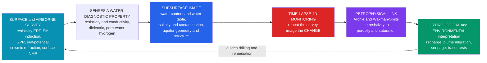

# 💧 Environmental and Hydrogeophysics

> [!abstract] TL;DR
> **Environmental and hydrogeophysics** points the exploration toolkit *downward and shallow* — at **water, contamination, and the living "critical zone"** instead of oil and ore. It images the **water table, aquifer geometry, porosity, and saturation** and watches **contaminant plumes, saltwater intrusion, and seepage** using electrical **resistivity/ERT** (water lowers resistivity — *Archie's law*), **electromagnetic induction** (airborne and ground conductivity mapping), **seismic refraction** (the water-table velocity jump), **surface NMR** (direct pore-water content), **self-potential** (streaming potentials from flow), and **GPR** (a shallow water table). Its defining superpower is **time-lapse / 4-D monitoring**: repeat the survey and image the *change* — infiltration, a migrating plume, a tracer test — non-invasively, over dense spatial coverage, again and again. The catch is the **petrophysical link** (Archie / Waxman–Smits) that turns a resistivity image into hydrology: powerful, but **non-unique**, so the best practice is **joint / coupled inversion** with hydrological flow models and boreholes.

## Intuition — analogy FIRST

A doctor used to open you up with **exploratory surgery** to find out what was wrong. Now they run a **non-invasive MRI** and simply *watch blood flow through living tissue* — repeatedly, without a scalpel. **Hydrogeophysics does exactly this for the ground beneath our feet.** Instead of drilling hundreds of expensive, sparse wells (each a tiny "biopsy" of the subsurface), it **images where groundwater sits**, **watches a contaminant plume creep** across an aquifer, and **tracks water seeping through a dam** — all from the surface, densely, and *repeatedly in 4-D*.

That shift changed the whole character of the field. Geophysics stopped being only a **resource-hunting tool** (where is the oil, where is the ore?) and became an **environmental stethoscope** — a way to listen to aquifers, pollution, and the thin skin of soil, rock, and water called the **critical zone** that sustains life. Boreholes tell you a lot at *one point*; geophysics fills in the *space between the wells* and, crucially, the *time between measurements*.

---

## How It Works

A geophysical method works here for the same reason it works anywhere: a hydrological target differs from its surroundings in **some physical property**, and that contrast perturbs a field we can measure at the surface. The special gift of the subsurface *water* problem is that **water is a spectacular electrical target** — it fills pores, it carries dissolved ions, and its resistivity swings over orders of magnitude with **saturation** and **salinity**. So the electrical and electromagnetic methods dominate, backed by seismic (which feels the *mechanical* water-table jump), NMR (which feels the *hydrogen* in pore water directly), and GPR (which feels the *dielectric* jump at a shallow water table).

1. **Sense a water-diagnostic property.** DC **resistivity / ERT** injects current through electrode arrays; **EM induction** uses a transmitter loop to induce eddy currents (Faraday's law) and reads back apparent **conductivity**; **surface NMR** pulses the Earth's-field proton resonance to count pore-water hydrogen and estimate **pore size**; **self-potential (SP)** passively reads natural voltages from **streaming potentials** as water flows; **seismic refraction** detects the P-wave velocity jump (dry ≈ 500 m/s to saturated ≈ 1500 m/s) at the **water table**; **GPR** images shallow dielectric boundaries.
2. **Invert to a subsurface image.** The measured apparent resistivities/conductivities are run through an **inversion** (an ill-posed problem — see the sibling note *Geophysical_Inverse_Theory*) to recover a 2-D/3-D model of the property versus depth.
3. **Translate to hydrology via petrophysics.** The **Archie / Waxman–Smits** relations convert resistivity into **porosity and water saturation**; empirical laws tie NMR relaxation and SP to **hydraulic conductivity** and flow.
4. **Repeat — the 4-D step.** Re-survey the *same lines* over hours to years and difference the images. The **change** isolates the moving water: an infiltration front, a growing plume, a seepage pathway, a tracer sweeping through.

This is the **environmental and hydrological arm of near-surface geophysics** — the same electrical, EM, and radar physics developed for the parent field *Exploration_Geophysics_Overview*, and detailed for the fluid-sensing methods in the sibling notes *Electrical_and_Electromagnetic_Methods* and *Ground_Penetrating_Radar_and_Near_Surface_Geophysics*, calibrated in situ by *Borehole_Geophysics_and_Well_Logging*.



---

## Key Concepts

### Secondary Level

- **Water changes how the ground conducts electricity.** Dry rock and soil resist electric current; add water — especially *salty* water — and current flows easily. So mapping how easily the ground conducts current is really a **map of where the water is**.
- **We can find the water table without drilling.** The boundary between dry ground above and water-soaked ground below shows up as a sharp change in resistivity (and in seismic wave speed). Geophysics draws that line across a whole field from the surface.
- **We can watch pollution move.** A leaking landfill or a spill of salty or chemical water makes the ground *very* conductive. By surveying the same place again and again, we watch the pollution **plume spread** — like time-lapse photography of the underground.
- **Repeating the survey is the trick.** One survey is a snapshot; **many surveys over time (4-D)** show *change*, which is exactly what matters for leaks, seepage through a dam, and clean-up progress.
- **It is cheaper and gentler than drilling everywhere.** Wells are expensive holes at single points; geophysics fills in the space *between* the wells non-invasively.

### Undergraduate Level

- **Archie's law — the master translator.** For clean (clay-free) rock, bulk resistivity `ρ = a·Rw·φ^(-m)·Sw^(-n)`, where `Rw` is pore-water resistivity, `φ` porosity, `Sw` water saturation, and `a, m, n` empirical constants (`m` cementation ≈ 1.8–2.5, `n` saturation ≈ 2). Two levers dominate: **more water (higher Sw) → lower ρ**, and **saltier water (lower Rw) → lower ρ**. This is why a saline plume lights up so strongly.
- **The method zoo, by target.**
  - **DC resistivity / ERT** — 2-D/3-D images of the water table, aquifer layering, and plumes; workhorse of time-lapse monitoring.
  - **EM induction** (ground EM31/EM34, airborne AEM/SkyTEM) — fast **conductivity mapping** of aquifers, **salinity**, and **clay** over huge areas; no galvanic contact needed. Depth of investigation set by **skin depth** `δ ∝ sqrt(ρ/f)`.
  - **Seismic refraction (MASW)** — the **water-table refractor**: the P-velocity jumps toward ≈ 1500 m/s when pores saturate.
  - **Surface NMR (magnetic resonance sounding)** — the only method that senses **water directly** (via pore-hydrogen), giving **water content** and, from relaxation, **pore size / permeability**.
  - **Self-potential (SP)** — passive voltages from **streaming potentials**: maps groundwater **flow** and seepage.
  - **GPR** — high-resolution shallow imaging of a **shallow water table** and the vadose zone (dielectric contrast).
- **Static vs 4-D (time-lapse).** A *static* survey maps structure; a *time-lapse* survey subtracts a **baseline** to image **change**. Percent-difference images of ERT are the standard product for infiltration, plume migration, and tracer experiments.
- **Aquifer properties, not just geometry.** Beyond "where is the water," petrophysics estimates **porosity, saturation, and (via NMR/SP) hydraulic conductivity** — the quantities a hydrogeologist actually models.
- **The critical zone and vadose monitoring.** Much of the action is in the **unsaturated (vadose) zone** — soil moisture, infiltration, salinity — where repeated ERT/EM and GPR track water and solutes through the life-supporting skin of the Earth.

### Graduate Level

- **Petrophysics is the bottleneck, and it is non-unique.** Archie assumes conduction only through the electrolyte; real sediments add **surface conduction** on clays. **Waxman–Smits / dual-water** models correct this with a cation-exchange term `Qv`, but the parameters (`m, n, a, Qv`) are **site- and lithology-dependent** and rarely known. A given resistivity is consistent with *many* `(φ, Sw, Rw, clay)` combinations — the geophysics-to-hydrology map is fundamentally **ambiguous** without independent constraints.
- **Temperature and salinity corrections are mandatory.** Fluid conductivity rises ≈ **2% per °C**, so seasonal temperature swings and geothermal gradients masquerade as saturation or salinity change in time-lapse data. TDS/salinity likewise shifts `Rw`; both must be corrected before interpreting a difference image as *water movement*.
- **Time-lapse referencing is delicate.** Reliable 4-D requires **fixed electrode positions**, consistent contact resistance, and **difference/ratio inversion** (invert the change, or regularize toward the baseline model) to suppress inversion artefacts that would otherwise dominate small real changes. Poor referencing manufactures phantom plumes.
- **Resolution decays with depth.** Sensitivity of surface arrays falls off rapidly (current density spreads), so **deep, thin, or small targets blur**; the achievable resolution and depth-of-investigation are set by array geometry, electrode spacing, and the model's **resolution matrix** (see *Geophysical_Inverse_Theory* and [[Singular_Value_Decomposition]] for the ill-posedness).
- **Joint and coupled (hydrogeophysical) inversion.** The frontier is **coupling geophysics to a flow-and-transport model**: instead of inverting for resistivity then guessing hydrology, invert *directly* for hydrological parameters (K, dispersivity, source) so that the recovered model **honors both the geophysical data and the physics of flow** (advection–diffusion). **Structural / cross-gradient joint inversion** ties resistivity, seismic, and GPR to a shared geometry, shrinking the null space.
- **Why 4-D beats static.** A static image inherits all the petrophysical ambiguity; a **difference** image cancels the static background (unknown geology, fixed clay content) so that the *change* isolates the moving fluid. This is the single most important idea in modern hydrogeophysics: **image the change, not the state.**

---

## Python Demo

This demo maps a **water table** and a **saline contaminant plume** with electrical resistivity, then does the thing hydrogeophysics is famous for — a **time-lapse difference image**. We build a synthetic 2-D cross-section where **Archie's law** ties resistivity to porosity and saturation: a **resistive dry vadose zone** sits over a **conductive saturated zone** (the water table is a resistivity boundary), and a **very conductive saline plume** is embedded below. Two snapshots are taken as the plume migrates down-gradient and grows; the **percent-change image** between them is exactly what time-lapse ERT actually measures.

```python
# Mapping the water table + a migrating saline plume with resistivity (Archie's law)
# and the time-lapse DIFFERENCE image that 4-D ERT actually measures.
import numpy as np
import matplotlib.pyplot as plt
from matplotlib.colors import LogNorm

# ---- Grid: horizontal x (m), depth z (m, positive DOWN) ----
nx, nz = 160, 80
x = np.linspace(0, 120, nx)
z = np.linspace(0, 30, nz)
X, Z = np.meshgrid(x, z)                  # shape (nz, nx); Z increases downward

# ---- Hydrogeologic framework + Archie parameters ----
phi       = 0.30          # porosity (fraction)
a, m, n   = 1.0, 2.0, 2.0 # Archie constants: tortuosity a, cementation m, saturation n
Rw_fresh  = 20.0          # pore-water resistivity, fresh groundwater  (ohm.m)
Rw_saline = 0.4           # pore-water resistivity, saline contaminant (ohm.m)
wt        = 8.0           # water-table depth (m)

def saturation(Z, wt, fringe=1.5):
    """Sw: dry-ish vadose zone (Sw~0.25) over fully saturated zone (Sw=1),
    with a smooth capillary-fringe transition across the water table."""
    Sw_vadose, Sw_sat = 0.25, 1.0
    return Sw_vadose + (Sw_sat - Sw_vadose) * 0.5*(1.0 + np.tanh((Z - wt)/fringe))

def plume_fraction(X, Z, xc, zc, rx, rz):
    """Elliptical saline-plume mixing fraction in [0,1], confined below the water table."""
    blob = np.exp(-(((X - xc)/rx)**2 + ((Z - zc)/rz)**2))
    blob = np.where(Z > wt, blob, 0.0)    # plume lives in the saturated zone
    return np.clip(blob, 0.0, 1.0)

def archie_resistivity(Sw, frac_saline):
    """Bulk resistivity from Archie's law with a fresh/saline pore-water mix:
       rho = a * Rw * phi^-m * Sw^-n ,  Rw = mix of fresh and saline pore water."""
    Rw = Rw_fresh*(1.0 - frac_saline) + Rw_saline*frac_saline
    return a * Rw * phi**(-m) * Sw**(-n)

Sw = saturation(Z, wt)

# ---- Two time-lapse snapshots: plume migrates down-gradient and grows ----
f1 = plume_fraction(X, Z, xc=40, zc=15, rx=8,  rz=5)    # baseline
f2 = plume_fraction(X, Z, xc=60, zc=18, rx=12, rz=7)    # months later

rho1 = archie_resistivity(Sw, f1)
rho2 = archie_resistivity(Sw, f2)

# ---- Time-lapse ERT measures the CHANGE (percent) ----
pct = (rho2 - rho1)/rho1 * 100.0

# ---- Report the Archie end-members ----
rho_vadose = a*Rw_fresh *phi**(-m)*0.25**(-n)
rho_satfrs = a*Rw_fresh *phi**(-m)*1.00**(-n)
rho_plume  = a*Rw_saline*phi**(-m)*1.00**(-n)
print(f"Vadose (dry, Sw=0.25, fresh) : {rho_vadose:8.1f} ohm.m  <- resistive")
print(f"Saturated (Sw=1, fresh)      : {rho_satfrs:8.1f} ohm.m  <- conductive")
print(f"Saline plume core (Sw=1)     : {rho_plume:8.1f} ohm.m  <- very conductive")
print(f"Max resistivity DROP where plume arrives : {pct.min():6.1f} %")

# ---- Plot: two resistivity sections + the time-lapse difference ----
extent = [x.min(), x.max(), z.max(), z.min()]   # surface (z=0) at top
rnorm  = LogNorm(vmin=5, vmax=4000)
fig, ax = plt.subplots(3, 1, figsize=(9, 11), sharex=True)

for a_, rho, ttl, f in [(ax[0], rho1, "(1) BASELINE resistivity: water table + young plume", f1),
                        (ax[1], rho2, "(2) REPEAT survey: plume has migrated + grown",      f2)]:
    im = a_.imshow(rho, extent=extent, aspect="auto", cmap="turbo", norm=rnorm)
    a_.axhline(wt, color="cyan", ls="--", lw=1.8)
    a_.text(2, wt-0.6, "water table", color="cyan", fontsize=9, va="bottom")
    a_.contour(X, Z, f, levels=[0.3], colors="k", linewidths=1.5)
    a_.set_title(ttl); a_.set_ylabel("depth (m)")
    fig.colorbar(im, ax=a_, label="resistivity (ohm.m)", pad=0.01)

dmax = np.nanmax(np.abs(pct))
imd = ax[2].imshow(pct, extent=extent, aspect="auto", cmap="RdBu_r",
                   vmin=-dmax, vmax=dmax)
ax[2].axhline(wt, color="k", ls="--", lw=1.2)
ax[2].set_title("(3) TIME-LAPSE DIFFERENCE  (percent change) — what 4-D ERT measures")
ax[2].set_xlabel("distance x (m)"); ax[2].set_ylabel("depth (m)")
ax[2].annotate("plume ARRIVES\nresistivity drops (blue)", xy=(60, 18), xytext=(78, 24),
               color="#1d4ed8", fontsize=9,
               arrowprops=dict(arrowstyle="->", color="#1d4ed8"))
ax[2].annotate("plume VACATES\nresistivity recovers (red)", xy=(40, 15), xytext=(6, 24),
               color="#b91c1c", fontsize=9,
               arrowprops=dict(arrowstyle="->", color="#b91c1c"))
fig.colorbar(imd, ax=ax[2], label="change (%)", pad=0.01)

plt.tight_layout()
plt.savefig("environmental_hydrogeophysics.png", dpi=120)
print("Saved environmental_hydrogeophysics.png")
```

Running it prints the Archie end-members — a **resistive vadose zone** (~3600 Ω·m) over a **conductive saturated zone** (~220 Ω·m), with the **saline plume core** near ~4 Ω·m — and produces three stacked panels. Panels 1 and 2 show the *state* (both dominated by the same static geology), while panel 3, the **percent-change image**, cancels that static background so the **only thing left is the moving plume**: strong resistivity *drops* where the plume arrives and *recoveries* where it has vacated. That is the entire argument for 4-D monitoring in one figure — **image the change, not the state.**

---

## Real-World Applications

- **Aquifer mapping and management.** ERT and **airborne EM** (Denmark's national SkyTEM aquifer survey; the USGS/Stanford AEM campaigns) map aquifer geometry, the water table, clay/aquitard layers, and fresh-vs-brackish boundaries across whole regions — vastly cheaper than drilling grids of wells.
- **Contaminant-plume delineation and monitoring.** Landfill **leachate**, saline spills, acid-mine drainage, and hydrocarbon/**DNAPL** sources are tracked with resistivity/EM because dissolved ions (or biodegradation-altered pore fluids) change conductivity; **time-lapse ERT** watches plumes migrate and remediation shrink them.
- **Saltwater intrusion.** Coastal aquifers over-pumped near the sea let a saline wedge advance inland; EM and ERT map the sharp fresh–salt conductivity front and monitor its movement (a growing problem with sea-level rise).
- **Dam, levee, and embankment integrity.** **Self-potential** and time-lapse resistivity detect **internal erosion and seepage pathways** before they become failures — continuous ERT is now installed on high-risk dams.
- **Agriculture and soil salinity.** Ground and towed EM (apparent electrical conductivity, ECa) map **soil moisture and salinity** for precision irrigation and salinization management.
- **Permafrost and the cryosphere.** ERT and EM sense the huge resistivity contrast between frozen and thawed ground, monitoring **permafrost degradation** and active-layer dynamics in a warming climate.
- **Carbon storage and leak monitoring.** Time-lapse resistivity, seismic, and gravity monitor injected **CO₂** and screen for leakage in geological carbon-sequestration projects.
- **Critical-zone and vadose-zone science.** Repeated ERT/EM, GPR, and surface NMR image **infiltration, root-zone water uptake, and tracer transport**, quantifying how water moves through the life-supporting near-surface.

---

## Common Pitfalls

- **Trusting the petrophysical translation as if it were unique.** Archie (and clay-corrected **Waxman–Smits**) *tie* geophysics to hydrology, but the parameters (`m, n, a, Qv`) are site-specific and the resistivity-to-`(φ, Sw, salinity, clay)` map is **many-to-one**. Never report saturation or salinity without stating the petrophysical model and its uncertainty; calibrate against boreholes (*Borehole_Geophysics_and_Well_Logging*).
- **Ignoring clay / surface conduction.** Archie assumes conduction only through the pore fluid. In clayey sediments, **surface conduction** lowers resistivity independently of water content, so an "apparent plume" may just be a clay lens. Use Waxman–Smits or complementary induced-polarization data.
- **Forgetting resolution decays with depth.** Surface-array sensitivity falls off fast; deep, thin, or small features blur or vanish. Interpret the **resolution/sensitivity** of the inversion, not just the color image, and don't over-read poorly resolved depths.
- **Sloppy time-lapse referencing.** 4-D fails silently without fixed electrode positions, consistent contact, and **difference/ratio inversion** referenced to a proper baseline; otherwise inversion artefacts swamp the real change and you "discover" phantom plumes.
- **Skipping temperature and salinity corrections.** Fluid conductivity changes ≈ 2%/°C, so seasonal or geothermal temperature swings (and background TDS shifts) mimic water movement in a difference image. Correct for temperature and independently constrain salinity before calling a change "flow."
- **Treating the vadose zone like the saturated zone.** In the **critical / vadose zone**, saturation, temperature, and salinity all vary quickly; monitoring there demands more frequent surveys and tighter environmental corrections than deep aquifer work.
- **Interpreting geophysics in isolation from hydrology.** The strongest results come from **joint / coupled (hydrogeophysical) inversion** that ties the image to a flow-and-transport model (advection–diffusion; see [[Introduction_to_PDEs]]) and to independent methods (*Electrical_and_Electromagnetic_Methods*, *Ground_Penetrating_Radar_and_Near_Surface_Geophysics*), not standalone resistivity pictures.
- **Underselling 4-D by settling for a static snapshot.** A single survey inherits all the static ambiguity; the **difference** image cancels the fixed background and isolates the moving fluid. When the question is about *change* (leaks, plumes, seepage, recharge), a static map is the wrong deliverable.

---

## Related Concepts

- [[Geophysics_Overview]] — the parent discipline; this note is its **environmental / hydrological, shallow, time-lapse** arm.
- [[Groundwater_and_Karst]] — the aquifers, water table, and vadose zone that hydrogeophysics images and monitors.
- [[Weathering_and_Soils]] — the soils and **critical zone** whose moisture and salinity are mapped with EM and ERT.
- [[Gauss_Law_and_Electric_Potential]] — the Laplace/Poisson potential theory behind DC **resistivity** and self-potential.
- [[Maxwells_Equations]] — the electromagnetic foundation of **EM induction** and GPR.
- [[Faradays_Law_and_Induction]] — the induced-current physics behind **airborne and ground EM conductivity** mapping.
- [[Electromagnetic_Waves_and_Radiation]] — the dielectric-wave physics behind **ground-penetrating radar**.
- [[Elasticity_and_Seismic_Wave_Theory]] — the elastic-wave basis of the **seismic water-table refractor**.
- [[Seismic_Ray_Theory_and_Travel_Times]] — refraction travel-times that locate the water table and layer depths.
- [[Coastal_Processes_and_Landforms]] — the coastal setting where **saltwater intrusion** is monitored.
- [[Seawater_Composition_and_Major_Ions]] — the dissolved ions and salinity that make intruding seawater so **conductive**.
- [[Precipitation_Processes]] — the recharge input whose **infiltration** is tracked by time-lapse geophysics.
- [[Sea_Level_Rise_and_the_Cryosphere]] — the permafrost/cryosphere and coastal-intrusion changes geophysics helps monitor.
- [[Introduction_to_PDEs]] — the advection–diffusion transport physics that **coupled hydrogeophysical inversion** honors.
- [[Singular_Value_Decomposition]] — the linear-algebra core of the ill-posed **resistivity inversion** and its resolution analysis.

---

## Review Questions

### Secondary Level

1. Why does salty polluted water in the ground show up so strongly in an electrical resistivity survey, while clean dry soil does not? Explain in terms of how water and salt affect the flow of electric current.
2. What is the advantage of surveying the *same* patch of ground several times over months, instead of just once, if you are trying to track a leak from a landfill?

### Undergraduate Level

3. Using Archie's law `ρ = a·Rw·φ^(-m)·Sw^(-n)`, explain qualitatively why (a) the vadose zone is far more resistive than the saturated zone, and (b) a saline plume in the saturated zone is far more conductive than the surrounding fresh groundwater. Which variable changes in each case?
4. You have EM induction, seismic refraction, and surface NMR available. Which one would you trust most to give a **direct** estimate of water content, which best locates the **water table**, and which covers the **most ground fastest** — and why?

### Graduate Level

5. A time-lapse ERT difference image shows a broad resistivity *decrease* across your whole survey between a summer and a winter baseline, with no known contaminant source. List three effects (physical and processing) that could produce this without any actual water movement, and describe the corrections or acquisition changes you would apply before interpreting it as flow.
6. Contrast **sequential** interpretation (invert for resistivity, then map to saturation via Archie) with **coupled hydrogeophysical inversion** (invert directly for hydrological parameters using a flow-and-transport model). What specifically does coupling buy you in terms of non-uniqueness and the null space, and what new assumptions and risks does it introduce?

---

## Sources

- Rubin, Y. & Hubbard, S. S. (eds.) — *Hydrogeophysics* (Springer, Water Science and Technology Library).
- Binley, A. et al. — "The emergence of hydrogeophysics for improved understanding of subsurface processes over multiple scales," *Water Resources Research* (2015).
- Reynolds, J. M. — *An Introduction to Applied and Environmental Geophysics* (2nd ed., Wiley-Blackwell).
- Everett, M. E. — *Near-Surface Applied Geophysics* (Cambridge University Press).
- Archie, G. E. — "The electrical resistivity log as an aid in determining some reservoir characteristics," *Transactions of the AIME* (1942).

---

#geophysics #hydrogeophysics #environmental-geophysics #groundwater #time-lapse-monitoring
