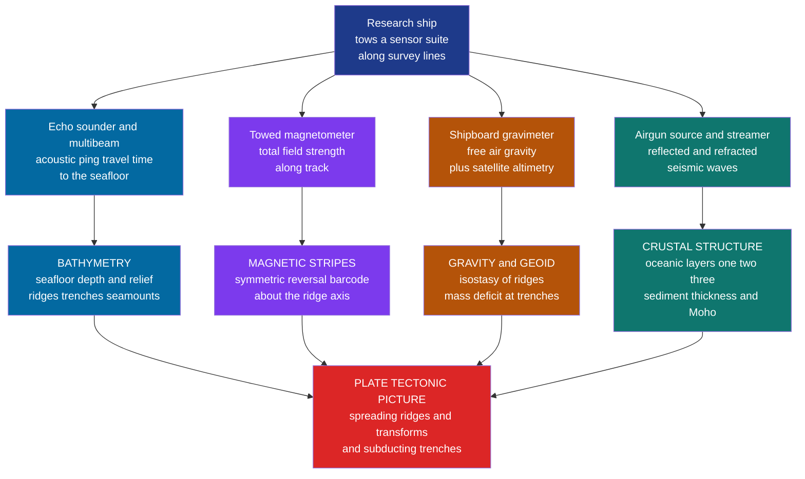

# 🌊 Marine Geophysics and the Ocean Floor

> [!abstract] TL;DR
> **Marine geophysics is how we "see" the two-thirds of Earth's solid surface that lies hidden under kilometres of opaque seawater** — and it is the discipline that turned continental drift from a hunch into the proven theory of **plate tectonics**. A ship drags four kinds of sensor along survey lines: an **echo sounder / multibeam sonar** that maps *bathymetry* from acoustic travel time, a towed **magnetometer** that recorded the symmetric "zebra-stripe" magnetic anomalies of the **Vine–Matthews–Morley** hypothesis (the definitive proof of **seafloor spreading**), a **gravimeter** (now backed by *satellite altimetry*) that reads the mass structure of ridges and trenches, and **airgun-plus-streamer seismics** that X-ray the sediments and the layered oceanic crust down to the Moho. The ocean floor turned out to be the **youngest, most active surface on the planet** — born at ridges, cooled and sunk with the square root of its age, and swallowed at trenches, all in under 200 million years. This note opens the Global, Marine & Environmental section as the *marine complement* to the land-based potential-field and seismic methods, and the observational backbone of geodynamics.

---

## Intuition

**Analogy:** We have better maps of the surface of Mars than of much of our own seafloor. Water is transparent to your eye for a few metres and then utterly opaque; light, radar, and GPS all die within it. So the ocean floor — 70% of the solid Earth — was, until the 1950s, a near-total blank. Marine geophysics is the set of tricks for **feeling the seabed in the dark**: you cannot look, so instead you *ping* it with sound and time the echo, you *listen* to its faint magnetism, you *weigh* it through tiny tugs on gravity, and you *thump* it with compressed air and record the ringing to read the layers below. Every one of these is a remote sense substituting for a sense that seawater has switched off.

And when we finally "felt" the seabed, it was nothing like the drowned, ancient plain everyone expected. It was a globe-encircling mountain range (the mid-ocean ridges), split by a central rift, flanked by a **symmetric magnetic barcode** written identically on both sides — the unmistakable signature of a surface being *manufactured at the ridge and carried outward like a conveyor belt*. Marine geophysics did not just map the ocean floor; it read the story printed on it, and that story was plate tectonics.

---

## How It Works

### Core Mechanics

1. **Bathymetry — mapping the shape.** A hull-mounted **echo sounder** emits an acoustic ping and times the two-way travel to the seafloor and back; with sound speed $c\approx1500\ \mathrm{m/s}$, depth $=\tfrac12 c\,t$. Single beams draw a line; a modern **multibeam swath** system fans out dozens of beams to paint a *strip* of seabed per pass. Because ships are slow, only a fraction of the ocean has been swath-mapped — so the *global* map is filled in from **satellite altimetry**: sea-surface height bulges by metres over the extra gravity of a seamount and dimples over a trench, and this **altimetry-derived gravity bathymetry** (Sandwell & Smith) revealed tens of thousands of uncharted seamounts.
2. **Marine magnetics — the time barcode.** A **magnetometer** towed behind the ship (to escape the ship's own iron) measures total-field strength along track. New basalt erupts at the ridge, cools through its **Curie temperature**, and freezes in the *direction of Earth's field at that instant*. Because the field **reverses** episodically, and spreading is symmetric, the crust becomes a normal/reversed **barcode identical on both flanks** — the **Vine–Matthews–Morley** anomalies that both *prove* seafloor spreading and *date* the crust.
3. **Marine gravity — weighing structure.** Shipboard **gravimeters** (and altimetry) map **free-air anomalies**: near-zero over the deep ocean where ridges and trenches are largely **isostatically compensated**, but with characteristic edge highs and lows that betray the mass excess of a young hot ridge and the mass deficit of a subducting slab's flexural trench.
4. **Marine seismics — X-raying the layers.** An **airgun** array releases a bubble pulse; sound reflects off sediment layers and refracts through the crust, recorded by a towed **streamer** of hydrophones or by **ocean-bottom seismometers (OBS)**. This resolves **sediment thickness**, the layered **oceanic crust (Layer 1 sediments, Layer 2 basalts, Layer 3 gabbros)**, and the **Moho**, plus shallow **sub-bottom profiling** and gas-hydrate **bottom-simulating reflectors (BSRs)**.
5. **Heat flow and the $\sqrt{\text{age}}$ cooling.** Oceanic lithosphere is the cold **top thermal boundary layer** of the convecting mantle. As it ages it cools, thickens, and grows *denser*, so it **subsides**: depth increases as $\sqrt{\text{age}}$ (half-space model), and heat flow falls as $1/\sqrt{\text{age}}$. Ridges are hot, thin, and shallow; abyssal plains are cold, thick, and deep — one law ties **distance → age → depth** across an entire ocean basin.

### Flow / Architecture



---

## Key Concepts

### Secondary Level

**Earth has two levels, not a smooth slope.** A histogram of every elevation on Earth (the **hypsometric curve**) has *two peaks*: continents near sea level and abyssal seafloor about 4–5 km deep, with little in between. That bimodal shape is a direct fingerprint of two kinds of crust — light, thick, old **continental** crust and dense, thin, young **oceanic** crust — and it is the first thing marine mapping revealed.

**Sound is our light underwater.** You cannot see or radar through seawater, but sound travels for thousands of kilometres. **Echo sounding** — ping, wait, time the echo — is the fundamental tool of bathymetry, the same physics as a bat or a fish-finder scaled to full ocean depth.

**The seafloor is young and made in stripes.** The most surprising discovery: *no ocean floor is older than about 200 million years* (the continents are billions). It is continuously **created at mid-ocean ridges** and destroyed at **trenches**, and the magnetic "stripes" recording magnetic reversals are the ticking clock that proves it.

### Undergraduate Level

**From single beam to swath, and up to satellites.** Depth from travel time, $d=\tfrac12 c\,t$, needs the *sound-speed profile* $c(z)$, which varies with temperature, salinity, and pressure (the same acoustics that make the **SOFAR channel**). **Multibeam** systems beam-form an array to resolve a wide swath and even seafloor *backscatter* (hardness/roughness). Where no ship has been, **satellite radar altimetry** measures sea-surface height to centimetres; the geoid mimics seafloor topography because a seamount's extra mass pulls water into a bulge above it. Differentiating that surface yields **gravity**, and gravity inverts to **predicted bathymetry** — the source of the near-global seafloor maps in Google Earth.

**Vine–Matthews–Morley, made quantitative.** Crust at distance $x$ from the ridge has age $t = x / v_{1/2}$, where $v_{1/2}$ is the **half-spreading rate**. The polarity frozen at that age comes from the **geomagnetic polarity timescale (GPTS)**. So the magnetization pattern is the GPTS *stretched by the spreading rate*, symmetric about the axis. Reading it backwards: the *widths* of stripes give you the spreading rate, and the *sequence* dates every point of seafloor. This is **magnetic dating of the ocean crust** — the map of "seafloor age" is entirely a marine-magnetics product.

**The oceanic crust is a layered factory product.** Refraction seismics resolve a remarkably uniform ~7 km column: **Layer 1** (sediments, velocity $\sim1.5$–$2$ km/s), **Layer 2** (fractured pillow basalts and sheeted dikes, $\sim5$ km/s, steep gradient), and **Layer 3** (gabbros, $\sim6.7$ km/s), over a sharp **Moho** into $\sim8$ km/s mantle peridotite. Its sameness worldwide is itself evidence of a single ridge-forming process.

**Subsidence as thermal cooling.** Model the plate as a cooling half-space: depth below the ridge crest grows as
$$d(t) \approx d_{\text{ridge}} + 350\,\sqrt{t_{\text{Myr}}}\ \ \text{(metres)},$$
excellent for young crust and flattening beyond $\sim70$ Myr, where the finite-thickness **plate model** (a basal heat supply) fits better. Heat flow falls as $q \propto 1/\sqrt{t}$; measured near-ridge values fall *below* prediction because circulating seawater carries heat away — the discovery that led to **hydrothermal vents**.

### Graduate Level

**Free-air gravity, the geoid, and flexure.** Over most of the abyss the free-air anomaly is small: ridges and trenches are close to **isostasy**. The informative signal is in the *departures* — the flexural **outer-rise high** and deep **trench low** encode the elastic thickness of the subducting plate, and short-wavelength free-air anomalies over seamounts constrain their compensation (Airy vs elastic). The **geoid** over the ocean also carries a long-wavelength contribution from deep density and dynamic mantle flow, which must be stripped to isolate lithospheric structure. This is the marine face of the potential-field surveying developed on land.

**Full-waveform and OBS crustal seismology.** Beyond stacked reflection images, wide-angle OBS profiles inverted by **travel-time tomography** and increasingly **full-waveform inversion** recover the 2-D velocity field of the crust and uppermost mantle, imaging melt lenses beneath fast-spreading ridges, serpentinized mantle at slow ridges, and the down-going slab. **Sub-bottom profilers** (CHIRP) resolve the top tens of metres of sediment; deeper multichannel seismics image **bottom-simulating reflectors (BSRs)** marking the base of the gas-hydrate stability zone — a marine climate and hazard target.

**The reversal timescale and its calibration.** The seafloor barcode, tied to radiometrically dated lava flows on land (the *magnetostratigraphy* strand of the wider paleomagnetic record — see the sibling note *Paleomagnetism_and_the_Magnetic_Record*), yields the **GPTS** back to $\sim160$ Ma. Marine anomaly widths then give **spreading rates through time**, and their integral reconstructs past plate boundaries and ocean-basin opening — the kinematic data that feed the global rotation models discussed in the sibling *Geophysics_of_Plate_Tectonics*.

**Why this is the observational backbone of geodynamics.** Bathymetry gives the *shape*, magnetics give the *age and rate*, seismics give the *structure*, gravity gives the *mass and flexure*, and heat flow gives the *thermal state* — together they constrain the cooling-plate model whose thermal side is developed in *Terrestrial_Heat_Flow_and_Thermal_Evolution*, whose potential-field methods parallel *Gravity_and_Magnetic_Surveying*, and whose present-day motions are now measured directly by *Space_Geodesy_GPS_and_Crustal_Deformation*. Marine geophysics is where the abstract plate model meets a directly measured, dated, layered surface.

---

## Python Demo

```python
# Marine geophysics: the two signatures that clinched plate tectonics.
#
# (a) MAGNETIC STRIPES (Vine-Matthews-Morley).  New basalt erupts at a mid-ocean
#     ridge, cools through its Curie temperature, and freezes in the direction of
#     Earth's magnetic field AT THAT MOMENT.  Because the field REVERSES episodically
#     and the seafloor spreads symmetrically, the crust becomes a magnetic "barcode"
#     (normal / reversed blocks) that is IDENTICAL on both flanks of the ridge.
#     Given a spreading rate + a polarity-reversal timescale we reconstruct the block
#     magnetization vs distance and the resulting magnetic anomaly profile, symmetric
#     about the ridge axis.  That mirror symmetry WAS the proof of seafloor spreading.
#
# (b) SEAFLOOR SUBSIDENCE.  Ocean lithosphere is the cold top of a cooling half-space:
#     it thickens and grows denser with age, so it SINKS.  Depth follows a sqrt(age)
#     law, d ~ 2500 + 350*sqrt(age_Myr) metres -- ridges shallow and young, abyssal
#     plains deep and old.  distance -> age -> depth ties the whole ocean floor together.
import numpy as np
import matplotlib.pyplot as plt

# ------------------------------------------------------------------
# (a) Magnetic stripes about a mid-ocean ridge
# ------------------------------------------------------------------
half_rate = 30.0          # half-spreading rate, mm/yr == km/Myr

# Simplified geomagnetic polarity-reversal ages (Ma): boundary ages, youngest first.
reversals = np.array([0.78, 2.58, 3.58, 5.23, 6.03, 6.73,
                      7.53, 8.11, 8.79, 9.31, 10.15, 11.06])

x   = np.linspace(-350, 350, 4001)   # distance from ridge axis, km (both flanks)
age = np.abs(x) / half_rate          # crustal age at distance x, Ma (distance = rate*age)

# Polarity of the chron a given age falls in: normal (+1) for the youngest chron,
# then alternating at each reversal boundary (Brunhes = present-day normal field).
chron_index   = np.searchsorted(reversals, age)
magnetization = np.where(chron_index % 2 == 0, 1.0, -1.0)   # +1 normal, -1 reversed

# Observed anomaly ~ magnetization blurred by source depth / sensor height.
# Model that blurring as a Gaussian smoothing kernel (a stand-in for the magnetized-
# layer response); being symmetric, it preserves the ridge-axis mirror symmetry.
dx        = x[1] - x[0]
sigma_km  = 3.0
kx        = np.arange(-4 * sigma_km, 4 * sigma_km + dx, dx)
kernel    = np.exp(-0.5 * (kx / sigma_km) ** 2); kernel /= kernel.sum()
anomaly   = np.convolve(magnetization, kernel, mode="same")

print("(a) Magnetic stripes (Vine-Matthews-Morley)")
print(f"    half-spreading rate            : {half_rate:.0f} mm/yr")
print(f"    crustal age at 300 km offset   : {300 / half_rate:.1f} Ma")
print(f"    anomaly symmetric about ridge  : {np.allclose(anomaly, anomaly[::-1], atol=1e-9)}")

# ------------------------------------------------------------------
# (b) Seafloor subsidence: half-space cooling  d = d_ridge + 350*sqrt(age)
# ------------------------------------------------------------------
d_ridge = 2500.0          # ridge-crest depth, m
k_subs  = 350.0           # subsidence coefficient, m per sqrt(Ma)
age_Ma  = np.linspace(0, 160, 400)
depth   = d_ridge + k_subs * np.sqrt(age_Ma)     # metres below sea level

print("\n(b) Seafloor subsidence (sqrt-age cooling)")
print(f"    depth at ridge crest (0 Ma)    : {d_ridge:.0f} m")
print(f"    depth at 100 Ma                : {d_ridge + k_subs * np.sqrt(100):.0f} m")

# ------------------------------------------------------------------
# Plots
# ------------------------------------------------------------------
fig, ax = plt.subplot_mosaic([["bar",  "depth"],
                              ["anom", "depth"]], figsize=(13, 6))

# --- block-magnetization barcode ---
ax["bar"].fill_between(x, 0, 1, where=magnetization > 0, color="black", step="mid")
ax["bar"].fill_between(x, 0, 1, where=magnetization < 0, color="white", step="mid")
ax["bar"].axvline(0, color="crimson", lw=1.5)
ax["bar"].set_title("(a) Seafloor magnetic barcode  (black = normal polarity)")
ax["bar"].set_ylabel("block magnetization")
ax["bar"].set_yticks([]); ax["bar"].set_xlim(x.min(), x.max())
ax["bar"].set_facecolor("#d9d9d9")

# --- magnetic anomaly profile ---
ax["anom"].plot(x, anomaly, color="navy", lw=1.5)
ax["anom"].axhline(0, color="gray", lw=0.8)
ax["anom"].axvline(0, color="crimson", lw=1.5, label="ridge axis")
ax["anom"].set_title("Magnetic anomaly profile  (mirror-symmetric about the ridge)")
ax["anom"].set_xlabel("Distance from ridge axis (km)")
ax["anom"].set_ylabel("anomaly (norm.)")
ax["anom"].set_xlim(x.min(), x.max()); ax["anom"].legend(loc="upper right", fontsize=8)

# --- depth vs age subsidence ---
ax["depth"].plot(age_Ma, depth, color="teal", lw=2.5)
ax["depth"].scatter([0, 100], [d_ridge, d_ridge + k_subs * np.sqrt(100)],
                    color="crimson", zorder=5)
ax["depth"].annotate("ridge crest\nyoung + shallow", (0, d_ridge),
                     xytext=(25, 3300), fontsize=9,
                     arrowprops=dict(arrowstyle="->"))
ax["depth"].annotate("abyssal plain\nold + deep",
                     (140, d_ridge + k_subs * np.sqrt(140)),
                     xytext=(55, 6050), fontsize=9,
                     arrowprops=dict(arrowstyle="->"))
ax["depth"].invert_yaxis()   # depth increases downward
ax["depth"].set_title("(b) Ocean depth vs age:  d = 2500 + 350*sqrt(age)")
ax["depth"].set_xlabel("Crustal age (Myr)")
ax["depth"].set_ylabel("Depth below sea level (m)")

plt.tight_layout()
plt.show()
```

Running it prints that the modelled anomaly is **exactly mirror-symmetric about the ridge axis** — the single fact that convinced the community of seafloor spreading — and that a 30 mm/yr flank reaches 10 Ma crust by 300 km out. Panel (a) shows the normal/reversed **barcode** and its smoothed **anomaly wiggle**, identical on both sides of the red ridge axis. Panel (b) shows the ocean deepening as $\sqrt{\text{age}}$: **2500 m at the ridge crest, 6000 m at 100 Myr**, exactly the young-and-shallow to old-and-deep progression that ties every point of the seafloor back to its birth date at a ridge.

---

## Real-World Applications

> **Example — the age map of the world ocean:** The global "seafloor age" grid (Müller et al.) that colours every ocean basin is *not* measured by dredging rocks. It is built almost entirely from marine magnetics: ship and aeromagnetic surveys pick the symmetric **Vine–Matthews–Morley anomalies**, match their pattern to the geomagnetic polarity timescale, and interpolate age between identified isochrons. That single dataset underpins plate reconstructions, heat-flow prediction, and the depth-versus-age subsidence curves used throughout geodynamics.

- **Global bathymetry from space.** **Satellite-altimetry-derived gravity** (Sandwell & Smith; ESA CryoSat-2, NASA/CNES SWOT) fills the ~80% of ocean never swath-mapped, discovering tens of thousands of seamounts and guiding safe navigation, cable/pipeline routing, and tsunami models.
- **Hydrocarbon and mineral exploration.** Multichannel reflection seismics image sedimentary basins on passive margins; **conjugate-margin reconstructions** (rewinding the magnetic stripes) predict where source rocks and reservoirs sit on the other side of an ocean. Seafloor massive sulfides at ridges and vents are mineral targets.
- **Gas hydrates and geohazards.** **Bottom-simulating reflectors (BSRs)** in seismic sections map methane-hydrate reservoirs — both an energy resource and a submarine-landslide/climate hazard. Sub-bottom profiles assess slope stability and foundation siting.
- **Tsunami and earthquake hazard.** Trench bathymetry, sediment thickness, and OBS-derived slab geometry constrain the updip limit of megathrust rupture and the seafloor deformation that generates tsunamis (Tohoku 2011, Cascadia).
- **Ocean drilling ground-truth.** IODP boreholes calibrate the geophysics — confirming crustal layers, hydrothermal cooling, and the reversal timescale against real recovered rock.

---

## Common Pitfalls

- **Multibeam bathymetry ≠ altimetry-derived bathymetry.** Ship **multibeam** gives true, high-resolution depths but covers only narrow swaths; **satellite-altimetry gravity** gives near-global coverage but *predicts* depth from the gravity field, smoothing over anything narrower than a few kilometres. The seamless global map is a *blend*; do not read fine detail off the altimetric part.
- **Magnetic stripes are a time barcode, not a rock-type map.** A "normal" and a "reversed" stripe are the *same basalt* — they differ only in the *polarity frozen in* when they cooled. The stripes date the crust; they say nothing about composition.
- **Ridge topography is thermal, not constructional.** Ridges stand high because young lithosphere is **hot and low-density**, and they sink with $\sqrt{\text{age}}$ as they cool — *not* because volcanoes pile material up. Forgetting the cooling law makes the whole hypsometry look mysterious.
- **Marine vs land acquisition differ fundamentally.** At sea you have a *moving* platform, water-only sources (**airguns**, not dynamite/vibroseis), receivers in a towed **streamer** or on the seabed (**OBS**), and no static corrections but a strong **water-column multiple**. Land intuition about statics and near-surface velocities does not transfer.
- **Free-air gravity over ridges/trenches is subtle.** Because ridges and trenches are largely **isostatically compensated**, their *broad* free-air anomaly is small — the information lives in the **edge highs and lows** (outer-rise flexure, trench low). Treating a small free-air anomaly as "no structure" throws away the flexural signal.
- **Sub-bottom profiler ≠ deep multichannel seismics.** A CHIRP **sub-bottom profiler** images only the top tens of metres of sediment at high resolution; imaging the crust and Moho needs **airgun multichannel reflection or OBS refraction** with far more energy and offset. They answer different questions at different depths.
- **Half-rate vs full-rate.** One ridge flank's anomalies give the **half**-spreading rate; the plate-separation rate is twice that. Mixing them halves or doubles every derived age and distance.

---

## Related Concepts

- [[Seafloor_Spreading_and_Ocean_Basins]] (Earth Science) — the process this note *measures*: the magnetic stripes and subsidence curve are its direct evidence and clock.
- [[Plate_Boundaries_and_Plate_Motions]] (Earth Science) — ridges, transforms, and trenches are the boundaries whose motions marine data quantify.
- [[Continental_Drift_and_the_Plate_Tectonics_Revolution]] (Earth Science) — the historical arc from Wegener to the marine-geophysics proof described here.
- [[Subduction_Zones_and_Mountain_Building]] (Earth Science) — where the aged, cooled, dense ocean floor is destroyed; the trench signals appear in marine gravity and seismics.
- [[Mantle_Convection_and_Hotspots]] (Earth Science) — the convective engine that upwells at ridges and builds the seamount chains altimetry reveals.
- [[Geomagnetism_and_the_Geodynamo]] (Geophysics) — reversals of *this* field are the barcode frozen into cooling seafloor basalt.
- [[Earths_Gravity_Field_and_Geodesy]] (Geophysics) — the free-air anomaly, geoid, and satellite altimetry underlying marine gravity and predicted bathymetry.
- [[The_Deep_Structure_of_the_Earth]] (Geophysics) — the lithosphere/asthenosphere and crust/mantle layering that marine seismics image at the ocean floor.
- [[Elasticity_and_Seismic_Wave_Theory]] (Geophysics) — the reflection/refraction physics behind airgun-streamer and OBS crustal imaging.
- [[Earthquake_Seismology_Fundamentals]] (Geophysics) — the source and slip data at ridges, transforms, and trenches that complement marine surveys.
- [[Isostasy_and_Lithospheric_Flexure]] (Geophysics) — why ridges and trenches sit where they do, and the flexural signal in marine free-air gravity.
- [[Mantle_Convection_and_Dynamics]] (Geophysics) — the dynamic engine whose top boundary layer is the cooling, subsiding ocean plate.
- [[Ocean_Acoustics_and_Underwater_Sound]] (Oceanography) — the sound-speed physics and SOFAR channel that make echo sounding and multibeam mapping possible.
- [[Hydrothermal_Vents_and_Seafloor_Chemistry]] (Oceanography) — the circulating seawater that steals ridge heat, explaining the near-ridge heat-flow deficit.
- [[Deep_Sea_Ecology]] (Oceanography) — life on the abyssal plains and vents mapped and dated by these methods.
- [[Paleoceanography_and_Ocean_Sediment_Records]] (Oceanography) — the sediment layers that sub-bottom and multichannel profilers image above the basalt.
- [[Magnetism_and_Biot_Savart]] (Physics) — the magnetic-field fundamentals behind remanent magnetization and total-field anomalies.
- [[Wave_Motion_and_Properties]] (Physics) — the wave kinematics (travel time, reflection) underlying both sonar and seismic imaging.
- [[Waves_in_Fluids_and_Acoustics]] (Physics) — the acoustics of pressure waves in seawater that echo sounding and airgun sources exploit.

---

## Review Questions

1. **Secondary:** Why can we not simply photograph or radar-map the ocean floor, and what property of *sound* makes echo sounding the workaround? Explain in one sentence why the seafloor is far younger than the continents.
2. **Undergraduate:** A magnetometer profile shows the first polarity reversal 23.4 km from a mid-ocean ridge axis, and the geomagnetic timescale places that reversal at 0.78 Ma. Compute the **half-spreading rate** and the **full spreading rate**. Then, using $d = 2500 + 350\sqrt{t_{\text{Myr}}}$ m, find the ocean depth over crust 64 Myr old, and explain why the *symmetry* of the stripes about the axis — not their mere existence — was the decisive proof of seafloor spreading.
3. **Graduate:** Contrast **ship multibeam** and **satellite-altimetry-derived** bathymetry in terms of coverage, resolution, and what physical quantity each actually measures. Then explain why the **free-air gravity anomaly** over a mature mid-ocean ridge is small despite kilometres of relief, and what feature of the anomaly over a **trench** still carries useful information about the subducting plate.

---

## Sources

- Fowler, C. M. R. (2005) — *The Solid Earth: An Introduction to Global Geophysics*, 2nd ed. (Cambridge University Press), Ch. 2–3 (ocean floor, marine magnetics, seismics).
- Turcotte, D. L. & Schubert, G. (2014) — *Geodynamics*, 3rd ed. (Cambridge University Press) — half-space cooling, seafloor subsidence and heat flow.
- Vine, F. J. & Matthews, D. H. (1963) — "Magnetic anomalies over oceanic ridges," *Nature* 199, 947–949.
- Sandwell, D. T. & Smith, W. H. F. (2009) — "Global marine gravity from retracked Geosat and ERS-1 altimetry," *J. Geophys. Res.* 114, B01411 (altimetry-derived bathymetry).
- Müller, R. D. et al. (2008) — "Age, spreading rates, and spreading asymmetry of the world's ocean crust," *Geochem. Geophys. Geosyst.* 9, Q04006.

---

#geophysics #marine-geophysics #seafloor-spreading #bathymetry #magnetic-anomalies
