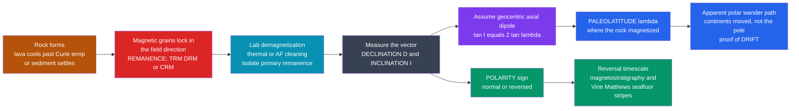

# 🪨 Paleomagnetism and the Magnetic Record

> [!abstract] TL;DR
> When a rock forms — lava cooling through the **Curie/blocking temperature**, or sediment settling grain by grain — its ferromagnetic minerals (magnetite, hematite) freeze in the *direction and strength* of Earth's field at that instant as a **remanent magnetization** ([[Magnetic_Materials_and_Magnetic_Domains|thermoremanent]] TRM for igneous, detrital DRM for sediment, chemical CRM for later growth). Two measured angles carry the story: **declination** $D$ and **inclination** $I$, with the geocentric-axial-dipole law $\tan I = 2\tan\lambda$ turning a frozen dip into a **paleolatitude**. After laboratory **demagnetization** ("magnetic cleaning") strips off later overprints to isolate the *primary* remanence, the record delivers three revolutions: **apparent-polar-wander paths** that diverge between continents (so the *continents* moved, proving [[Continental_Drift_and_the_Plate_Tectonics_Revolution|drift]]), **geomagnetic reversals** that flip north and south (the polarity timescale, and via **Vine–Matthews** the symmetric [[Seafloor_Spreading_and_Ocean_Basins|seafloor magnetic stripes]]), and **magnetostratigraphy** that dates and correlates strata by their polarity barcode. This is the discipline that made continental drift and seafloor spreading *quantitative*.

---

## Intuition

**Analogy:** Drop a handful of tiny compass needles into hot wax and let it set — each needle freezes pointing the way the field pointed at that moment, and the solid wax now carries a permanent snapshot of that direction long after you take the field away. Rocks do exactly this. Inside cooling lava (or settling mud) sit microscopic grains of magnetic iron oxide, each a little compass needle. As the rock hardens the needles lock in place, recording the direction of Earth's magnetic field at the exact moment and place of formation — a **fossil compass reading**, sealed for millions of years.

Now read those frozen compasses in rocks of different ages, and two shocking things emerge. First, the field has completely **flipped** north-and-south hundreds of times: rocks of certain ages point *south* where today's field points north. Second, the compasses in old rocks point to a "north pole" that sits in the wrong place — and it sits in a *different* wrong place for rocks on different continents. The only way to reconcile the readings is that the **continents themselves wandered** thousands of kilometres. Paleomagnetism is how rocks *remember* the ancient magnetic field, and that memory rewrote geology by proving continental drift and, later, seafloor spreading.

---

## How It Works

### Core Mechanics

1. **A rock acquires a remanence when it forms.** Ferromagnetic grains carry a spontaneous magnetization, but above a critical temperature — the **Curie point** ($580\,^\circ\mathrm{C}$ for magnetite, $680\,^\circ\mathrm{C}$ for hematite) — thermal agitation randomizes it and no record is possible. As the rock cools past that point and further through the **blocking temperature**, each grain's moment is frozen *parallel to the ambient field*. For lava this is **thermoremanent magnetization (TRM)**; for slowly settling sediment, grains physically rotate into alignment as they deposit — **detrital remanent magnetization (DRM)**; for minerals that grow later (diagenesis, weathering), **chemical remanent magnetization (CRM)**.
2. **The record is a vector: declination and inclination.** The frozen remanence is a direction in 3-D, reported as **declination** $D$ (azimuth from true north, horizontal) and **inclination** $I$ (dip below horizontal). These are the two numbers the whole discipline hangs on.
3. **Inclination reads latitude.** Assuming the time-averaged field is a **geocentric axial dipole (GAD)** — a bar magnet at Earth's centre aligned with the spin axis — geometry forces $\tan I = 2\tan\lambda$. A rock's frozen $I$ therefore yields the **paleolatitude** $\lambda$ at which it magnetized; if that differs from where the rock sits today, the continent *moved*.
4. **Clean the record before you trust it.** A rock accumulates *secondary* overprints (a viscous present-day component, lightning strikes, chemical growth). **Progressive demagnetization** — heating in steps (thermal) or applying decaying alternating fields (AF) — peels these away in order of stability, isolating the stable **characteristic (primary) remanence** on an orthogonal (Zijderveld) plot.
5. **Compare ages and continents.** Plotting the ancient pole position implied by rocks of successive ages traces an **apparent-polar-wander (APW) path**. Because the pole did *not* actually wander far, a moving path means the *continent* rotated and translated; **different continents give different paths that can be re-joined only by closing an ancient ocean** — the paleomagnetic proof of drift.
6. **Polarity is a global clock.** Independently, the *sign* of the remanence (normal like today, or reversed) flips with the field's reversals. Radiometrically dated lavas pin these flips into a **Geomagnetic Polarity Time Scale (GPTS)** — a barcode of normal/reversed chrons that dates seafloor stripes and land sections alike (**magnetostratigraphy**).

### Flow / Architecture



---

## Key Concepts

### Secondary Level

- **Rocks are fossil compasses.** Magnetic grains inside lava or mud freeze pointing along Earth's field at the moment of formation and stay that way for millions of years.
- **The field flips.** Every so often magnetic north and south trade places (a **reversal**). Rocks of some ages point the "wrong" way — this is a real signal, not an error.
- **Inclination tells latitude.** How steeply the frozen needle dips depends on how far from the equator the rock formed — flat at the equator, straight down at the pole. So a rock secretly records *where it was born*.
- **Continents moved.** When a rock's frozen latitude disagrees with where it sits today, the continent must have drifted — the first hard evidence for **continental drift**.
- **Stripes on the seafloor.** The ocean floor carries symmetric magnetic stripes, matched pairs on either side of a mid-ocean ridge, that record reversals as new crust spreads — the proof of **seafloor spreading**.

### Undergraduate Level

- **Types of remanence.** **TRM** (igneous, on cooling through the Curie/blocking temperature) is the most reliable recorder; **DRM** (detrital, grains aligning as sediment settles) is continuous but prone to *inclination shallowing*; **CRM** (chemical, minerals growing later) records the field at the *time of growth*, not deposition — a trap if mistaken for primary.
- **The dipole field elements.** With intensity $F$: horizontal $H = F\cos I$, vertical (down positive) $Z = F\sin I$, so $\tan I = Z/H$; a geocentric dipole gives $Z = 2B_0\sin\lambda$, $H = B_0\cos\lambda$ and hence $\tan I = 2\tan\lambda$, with $F = B_0\sqrt{1 + 3\sin^2\lambda}$ (twice as strong at the poles as the equator).
- **What inclination does and does not give.** $I$ pins **paleolatitude**; $D$ gives the **rotation** of the block about a vertical axis. Neither gives **paleolongitude** — a fundamental limitation of a symmetric dipole (you can slide a continent freely east-west without changing $I$ or $D$).
- **Magnetic cleaning.** Progressive **thermal** or **alternating-field (AF)** demagnetization removes low-stability overprints first; the surviving linear trajectory toward the origin on a **Zijderveld (orthogonal vector) diagram** is the **characteristic remanent magnetization (ChRM)** used for the paleopole.
- **Reversals and the GPTS.** Named chrons (Brunhes normal, Matuyama reversed, Gauss, Gilbert…) build the **Geomagnetic Polarity Time Scale**; the last full reversal (Brunhes–Matuyama) was $\sim 0.78\,\mathrm{Ma}$. Matching a section's polarity pattern to the GPTS is **magnetostratigraphy**.
- **Secular variation vs reversals.** Year-to-century drift of $D$, $I$, $F$ is **secular variation** (core-flow wobble); it must be *averaged out* over $\gtrsim 10^4$ yr to recover the true GAD direction. A **reversal** is a wholesale $180^\circ$ flip; an **excursion** swings far off-axis but returns to the *same* polarity.

### Graduate Level

- **Néel theory of single-domain remanence.** For a single-domain grain of volume $v$ and anisotropy, the relaxation time follows $\tau = \tau_0\exp(v\,K/k_BT)$ (an Arrhenius-Néel law): above the **blocking temperature** $T_B$, $\tau$ is seconds and the moment is superparamagnetic; below it, $\tau$ balloons to billions of years and the moment is *blocked*, locking in a TRM. Grain size controls domain state — **single-domain** and **pseudo-single-domain** grains are stable recorders; large **multidomain** grains carry soft, unreliable remanence.
- **Statistical paleodirections — Fisher statistics.** Unit direction vectors scatter on a sphere; the **Fisher distribution** $P(\theta)\propto e^{\kappa\cos\theta}$ gives the mean direction, the precision parameter $\kappa$, and the $\alpha_{95}$ cone of 95% confidence. **Virtual geomagnetic poles (VGPs)** are averaged into a **paleomagnetic pole**; the **reversal test** and **fold test** (does the direction cluster better before or after unfolding?) establish whether the remanence pre-dates deformation.
- **Apparent polar wander and terrane analysis.** An APW path is the locus of paleopoles for one plate through time; matching, rotating, and re-splicing paths reconstructs past plate positions. Discordant paleomagnetic directions diagnose **exotic terranes** (far-travelled crustal blocks) and vertical-axis **block rotations** — Butler's "magnetic domains to geologic terranes."
- **Paleointensity.** Recovering ancient field *strength* (not just direction) exploits TRM being linear in field for small fields: **Thellier–Thellier** double-heating experiments compare natural remanence lost with laboratory TRM gained in a known field. This tracks the long-term dipole moment and even the *timing of inner-core nucleation*.
- **The Vine–Matthews–Morley hypothesis.** Seafloor magnetic anomalies are symmetric about ridges because spreading crust records the alternating polarity of the field as it cools — the marine expression of the same reversal barcode, and the observation that clinched plate tectonics. Marine magnetic surveying reads plate spreading rates directly off stripe widths.
- **What reversals imply about the core.** Reversals are a property of the **geodynamo**: the dipole collapses through a multipolar transitional state and rebuilds with opposite sign over $\sim 1\text{–}10\,\mathrm{kyr}$, at irregular intervals governed by nonlinear core dynamics (the Cretaceous Normal Superchron ran $\sim 40\,\mathrm{Myr}$ with none). The magnetic record is thus a *paleo-observatory of the deep interior*.

---

## Python Demo

```python
# Paleomagnetism: reading the ancient field out of rocks.
#   (a) GEOCENTRIC AXIAL DIPOLE (GAD) law  tan(I) = 2 tan(lambda):
#       a rock's frozen INCLINATION I fixes the LATITUDE at which it formed
#       (paleolatitude) -- the measurement that exposed continental drift.
#   (b) MAGNETIC POLARITY TIMESCALE: a Poisson-like reversal process builds a
#       normal/reversed "barcode" vs age; matching a rock's polarity sequence to
#       it dates strata (magnetostratigraphy) -- the same barcode that the
#       Vine-Matthews seafloor stripes record on either side of a ridge.
import numpy as np
import matplotlib.pyplot as plt

# ----------------------------------------------------------------------
# (a) The GAD law:  tan(I) = 2 tan(lambda)   (I = inclination, lambda = latitude)
# ----------------------------------------------------------------------
lat  = np.linspace(-90, 90, 361)                      # geographic latitude (deg)
incl = np.degrees(np.arctan(2.0 * np.tan(np.radians(lat))))

def paleolatitude(I_deg):
    """Invert an inclination to the latitude at which the rock magnetized."""
    return np.degrees(np.arctan(np.tan(np.radians(I_deg)) / 2.0))

# A Deccan-style basalt now near 20 N records a SHALLOW inclination -> formed south.
I_measured = 12.0
lam_form   = paleolatitude(I_measured)
lat_today  = 20.0
drift_km   = (lat_today - lam_form) * 111.19          # 1 deg latitude ~ 111 km
print("(a) Geocentric-axial-dipole paleolatitude")
print(f"    measured inclination I = {I_measured:.0f} deg")
print(f"    -> paleolatitude       = {lam_form:.1f} deg  (formed near the equator)")
print(f"    site sits today at       {lat_today:.0f} deg N")
print(f"    implied northward drift ~ {drift_km:,.0f} km")

# ----------------------------------------------------------------------
# (b) Synthetic Geomagnetic Polarity Time Scale (a reversal barcode).
#     Reversals arrive as a Poisson process: exponentially distributed chron
#     durations; polarity alternates normal(+1)/reversed(-1) at each reversal.
# ----------------------------------------------------------------------
rng        = np.random.default_rng(7)
mean_chron = 0.25                                      # Myr, mean time between reversals
t_max      = 10.0                                     # Myr of record
edges = [0.0]
while edges[-1] < t_max:
    edges.append(edges[-1] + rng.exponential(mean_chron))
edges     = np.array(edges)
polarity  = np.where(np.arange(len(edges) - 1) % 2 == 0, 1, -1)  # +1 normal, -1 reversed
n_rev     = len(edges) - 2
print("\n(b) Magnetic polarity timescale")
print(f"    {n_rev} reversals in {t_max:.0f} Myr, mean chron ~ {mean_chron*1000:.0f} kyr")

# Magnetostratigraphic dating: an outcrop records a distinctive run of chrons.
# We 'observe' chrons #5,6,7 of the timescale and recover the age of the section.
j = 5
sec_top, sec_base = edges[j], edges[j + 3]
patt = "".join("N" if polarity[k] == 1 else "R" for k in range(j, j + 3))
print(f"    outcrop polarity pattern '{patt}' matches chrons {j}-{j+2}")
print(f"    -> section spans {sec_top:.2f}-{sec_base:.2f} Ma (base age = {sec_base:.2f} Ma)")

# ----------------------------------------------------------------------
# Plot: inclination-latitude curve  +  the polarity-timescale barcode
# ----------------------------------------------------------------------
fig, (ax1, ax2) = plt.subplots(2, 1, figsize=(10, 8),
                               gridspec_kw={"height_ratios": [2.2, 1.0]})

ax1.plot(lat, incl, lw=2, color="#2563eb")
ax1.axhline(0, color="k", lw=0.5); ax1.axvline(0, color="k", lw=0.5)
ax1.scatter([lam_form], [I_measured], color="crimson", zorder=5,
            label=f"I = {I_measured:.0f} deg  ->  paleolat = {lam_form:.1f} deg")
ax1.annotate("shallow inclination\n= low (near-equator) latitude",
             xy=(lam_form, I_measured), xytext=(-78, 45), fontsize=8,
             arrowprops=dict(arrowstyle="->", color="gray"))
ax1.set_xlabel("Geographic latitude  lambda  (deg)")
ax1.set_ylabel("Magnetic inclination  I  (deg)")
ax1.set_title("(a) GAD law  tan I = 2 tan(latitude):  inclination -> paleolatitude")
ax1.set_xlim(-90, 90); ax1.set_ylim(-90, 90)
ax1.legend(fontsize=9, loc="upper left"); ax1.grid(alpha=0.3)

for i in range(len(edges) - 1):
    face = "black" if polarity[i] == 1 else "white"
    ax2.axvspan(edges[i], min(edges[i + 1], t_max), facecolor=face,
                edgecolor="black", lw=0.5)
ax2.axvspan(sec_top, sec_base, ymin=1.02, ymax=1.14, facecolor="crimson",
            clip_on=False)                              # matched outcrop bracket
ax2.text((sec_top + sec_base) / 2, 1.22, f"outcrop '{patt}'", color="crimson",
         ha="center", va="bottom", fontsize=8, transform=ax2.get_xaxis_transform())
ax2.set_xlim(0, t_max); ax2.set_ylim(0, 1); ax2.set_yticks([])
ax2.set_xlabel("Age  (Ma, millions of years before present)")
ax2.set_title("(b) Polarity timescale barcode  (black = normal, white = reversed)")

plt.tight_layout(); plt.show()
```

Panel (a) is the engine of paleogeography: a measured inclination lands on the GAD curve and reads straight off as a paleolatitude — a shallow $I$ means a low-latitude birthplace, so a rock now at $20^\circ$N that froze near the equator has drifted roughly $900\,\mathrm{km}$ north. Panel (b) is the reversal clock: a Poisson-like process reproduces the irregular black/white **barcode** of normal and reversed chrons, and matching an outcrop's distinctive polarity run to that barcode dates and correlates the section — exactly the logic that reads the age of ocean crust off symmetric seafloor magnetic stripes.

---

## Real-World Applications

> **Example — India's dash north written in Deccan basalts:** Paleomagnetic inclinations in Indian rocks record steadily *steepening* $I$ from the Cretaceous to today, tracing the Indian plate's flight from far south of the equator to its collision with Asia at rates up to $\sim 18\,\mathrm{cm/yr}$ — a continental journey of thousands of kilometres read out of frozen compasses, and the boundary condition for raising the Himalaya.

- **Proof of plate tectonics.** Diverging APW paths for Europe and North America (rejoined only by closing the Atlantic) gave drift its first quantitative proof; the symmetric magnetic stripes of the **Vine–Matthews–Morley** hypothesis then confirmed seafloor spreading — the twin pillars of the plate-tectonic revolution.
- **Magnetostratigraphic dating.** Where fossils and radiometric ages are sparse, matching a section's polarity pattern to the GPTS dates and correlates strata globally — dating hominin sites in the East African Rift, marine cores, and loess sequences.
- **Marine magnetic surveying.** Shipborne and aeromagnetic surveys map the seafloor's stripe pattern to determine crustal **age** and **spreading rate**, and to fingerprint tectonic-plate boundaries — the operational backbone of ocean-basin reconstruction.
- **Terrane and rotation analysis.** Discordant paleodeclinations reveal **vertical-axis block rotations** and far-travelled **exotic terranes** accreted onto continental margins (much of western North America).
- **Environmental magnetism.** Magnetic-mineral concentration and grain size in sediments and soils act as proxies for **paleoclimate** (loess–paleosol cycles), **sediment provenance**, and modern **pollution** (magnetic particulates from combustion) — reading the environment, not just the field.
- **Archaeomagnetism and paleointensity.** Baked archaeological materials (kilns, hearths, pottery) record field direction and strength at known dates, both dating artefacts and extending the record of the dipole's decline and secular variation.

---

## Common Pitfalls

- **Inclination gives paleoLATITUDE, not longitude.** A symmetric geocentric dipole is longitude-blind: $I$ and $D$ fix latitude and rotation, but a continent can be slid freely east-west with *no* change in the record. Paleolongitude needs independent constraints (hotspots, plate circuits).
- **Confusing the three remanence types.** **TRM** dates cooling, **DRM** dates deposition, **CRM** dates *later mineral growth* — mistaking a CRM overprint for the primary signal assigns the wrong age and direction. Always establish which carrier you are reading.
- **Curie vs blocking temperature.** The **Curie point** is where spontaneous magnetization vanishes for a mineral; the **blocking temperature** (grain-size dependent, at or below the Curie point) is where a given grain's moment actually locks. A grain records at its *blocking*, not its Curie, temperature.
- **Skipping magnetic cleaning.** Raw natural remanence is a *sum* of primary signal plus viscous, lightning, and chemical overprints. Without progressive **thermal or AF demagnetization** to isolate the stable ChRM on a Zijderveld plot, a "paleopole" may be nothing but a recent overprint.
- **Apparent polar wander is the continent moving, not the pole.** The *pole* stayed near the spin axis (GAD); an APW path is the record of the *plate* rotating and translating beneath a fixed pole. Reading it literally as a wandering pole inverts the whole logic of drift.
- **Secular variation vs reversals.** Decadal-to-millennial wobble (secular variation) and full $180^\circ$ reversals are different phenomena; you must *average out* secular variation over $\gtrsim 10^4$ yr to recover a clean GAD direction, and not mistake an **excursion** (returns to the same polarity) for a reversal.
- **Inclination shallowing in sediments.** Detrital grains settling and compacting flatten toward horizontal, biasing DRM inclinations *too shallow* — uncorrected, this places rocks closer to the equator than they truly formed. Applied blindly it fakes extra northward drift.
- **The GAD assumption is an approximation.** $\tan I = 2\tan\lambda$ holds only for a *time-averaged* geocentric axial dipole; non-dipole and non-axial contributions, and any long-term departure from GAD, add systematic error to paleolatitudes and must be assessed, not assumed away.

---

## Related Concepts

- [[Geomagnetism_and_the_Geodynamo]] (Geophysics) — the S01 companion: the core dynamo that *generates* the field paleomagnetism records, and whose nonlinear dynamics produce the reversals read here.
- [[Geomagnetism_and_Paleomagnetism]] (Earth Science) — the survey-level treatment of the same material; this note is the deep rock-magnetism and remanence-physics dive that complements it.
- [[Seafloor_Spreading_and_Ocean_Basins]] (Earth Science) — the Vine–Matthews magnetic stripes are the marine expression of the reversal barcode built here.
- [[Continental_Drift_and_the_Plate_Tectonics_Revolution]] (Earth Science) — apparent-polar-wander paths supplied the first quantitative proof of the drift this note underpins.
- [[Relative_Dating_and_Stratigraphy]] (Earth Science) — magnetostratigraphy slots the polarity barcode into the stratigraphic framework.
- [[Radiometric_Dating]] (Earth Science) — dated lavas calibrate the reversals into an absolute Geomagnetic Polarity Time Scale.
- [[Geologic_Time_Scale]] (Earth Science) — the reversal record and magnetostratigraphy are woven into the global timescale.
- [[Magnetic_Materials_and_Magnetic_Domains]] (Materials Science) — ferromagnetism, magnetic domains, the Curie temperature, and Néel relaxation that make remanence physically possible.
- [[Magnetism_and_Biot_Savart]] (Physics) — the dipole magnetostatics behind $\tan I = 2\tan\lambda$ and the field geometry a rock samples.

---

## Review Questions

1. **Secondary:** A lava flow records a magnetic inclination of $I = 0^\circ$ (perfectly flat), yet the rock sits today at latitude $45^\circ$N. What was the rock's paleolatitude, and what does the mismatch tell you happened to the continent? Why can a rock record the *direction* of an ancient field even though the field that magnetized it is long gone?
2. **Undergraduate:** Explain, using $\tan I = 2\tan\lambda$, why inclination yields paleolatitude but *not* paleolongitude. Distinguish thermoremanent (TRM), detrital (DRM), and chemical (CRM) magnetization and state what geological event each dates. Why is progressive thermal or AF demagnetization necessary before a direction can be trusted?
3. **Graduate:** Using Néel theory ($\tau = \tau_0\exp(vK/k_BT)$), explain the difference between the Curie and blocking temperatures and why single-domain grains are better recorders than multidomain grains. Given diverging apparent-polar-wander paths for two continents plus a symmetric seafloor magnetic-stripe pattern, lay out the combined argument that establishes seafloor spreading and closes an ancient ocean, and describe what a reversal implies about the state of the geodynamo during the transition.

---

## Sources

- Butler, R. F. (1992) — *Paleomagnetism: Magnetic Domains to Geologic Terranes* (Blackwell) — remanence acquisition, demagnetization, and terrane analysis.
- Tauxe, L. (2010) — *Essentials of Paleomagnetism* (University of California Press) — rock magnetism, Fisher statistics, paleointensity, and the GPTS.
- Merrill, R. T., McElhinny, M. W. & McFadden, P. L. (1996) — *The Magnetic Field of the Earth: Paleomagnetism, the Core, and the Deep Mantle* (Academic Press).
- Cox, A. & Doell, R. R. (1960) — "Review of paleomagnetism," *Geological Society of America Bulletin* 71, 645–768.
- Vine, F. J. & Matthews, D. H. (1963) — "Magnetic anomalies over oceanic ridges," *Nature* 199, 947–949.

---

#geophysics #paleomagnetism #rock-magnetism #geomagnetic-reversals #apparent-polar-wander
