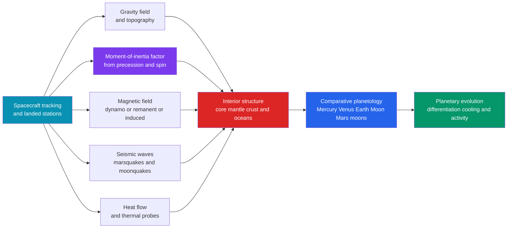

# 🪐 Planetary Geophysics

> [!abstract] TL;DR
> Planetary geophysics points the same toolkit that X-rayed Earth's interior — **seismic waves, gravity, magnetism, and heat flow** — at the Moon, planets, and moons, turning remote spacecraft tracking and a handful of landed instruments into maps of interiors we can never drill. From orbit, Doppler tracking yields **gravity fields** (crustal thickness, flexure) and, through precession and spin, the **moment-of-inertia factor** $C/MR^2$ that fixes how strongly mass is concentrated toward the centre — a whole-planet weigh-in of the core without ever landing. On the ground, Apollo's moonquakes and InSight's **marsquakes** deliver crust, mantle, and core radii; magnetometers distinguish a live **dynamo** (Earth, Mercury, Ganymede) from **fossil crustal remanence** (Mars, Moon) and from **induced** fields that betray hidden salty oceans (Europa, Ganymede, Callisto); heat-flow probes and **tidal heating** explain why Io erupts and Europa stays liquid. Read together across worlds, these measurements form the ultimate controlled experiment in how rocky and icy planets differentiate, cool, and either stay geologically alive or die.

---

## Intuition

**Analogy:** Drop a single seismometer on Mars, listen for "marsquakes," and you can map the inside of a whole planet you have never drilled — that is exactly what NASA's **InSight** lander did. A quake on the far side of Mars sends waves racing through the interior; where those waves speed up, slow down, bounce, or vanish tells you where the rock changes to a liquid metal core, just as a doctor reads an unseen organ from how ultrasound echoes off it. One good listening post, and a planet gives up its layers.

Planetary geophysics takes that same idea and generalises it. Every method that revealed Earth's inside has a planetary twin: **seismology** (how waves travel), **gravity and geodesy** (how mass tugs a passing spacecraft), **geomagnetism** (whether an iron heart still churns), and **heat flow** (how fast the planet is losing its primordial warmth). Point all four at other worlds and you recover Mars's core radius, the Moon's magma-ocean crust, the ocean sloshing under Europa's ice, and the reason Earth alone kept a strong, lasting dynamo. Comparing planets side by side is a controlled experiment nature ran for us: same physics, different sizes, compositions, and histories — so the *differences* teach us how rocky worlds work. Throughout, **Earth is the calibrated reference** against which every alien reading is interpreted.

---

## How It Works

### Core Mechanics

1. **Weigh the interior from orbit (gravity + topography).** Tracking a spacecraft's tiny Doppler wobbles maps a planet's **gravity field**. Comparing gravity against topography (the *admittance*) reveals whether highs are supported by deep roots (**isostasy**) or held up by a stiff **flexing lithosphere**, which in turn gives **crustal thickness** — this is exactly how the twin **GRAIL** probes mapped the Moon's crust to kilometre precision.
2. **Read central condensation from spin (the moment-of-inertia factor).** A planet's response to torques — its axial **precession** and rotation — fixes the dimensionless **moment-of-inertia factor** $C/MR^2$. A uniform sphere has $C/MR^2 = 0.4$; the smaller the value, the more mass is packed into a dense central core. Earth's $0.3307$ demanded an iron core long before any seismology confirmed it.
3. **Listen to the interior (planetary seismology).** Body waves refract and reflect at internal boundaries. **Apollo** seismometers detected moonquakes and defined a lunar crust and partial-melt zone; **InSight** used single-station marsquakes plus core-reflected phases to place Mars's crust, mantle, and a surprisingly large, low-density liquid core (radius $\sim 1830\,\mathrm{km}$).
4. **Check for a beating heart (magnetism).** A magnetometer distinguishes three regimes: an active **dynamo** (Earth, Mercury, Ganymede), **fossil crustal remanence** frozen in when an ancient dynamo died (Mars, Moon), and a **time-varying induced** field driven by the planet's motion through Jupiter's field — the tell-tale of a conducting **subsurface ocean** (Europa, Ganymede, Callisto).
5. **Take the planet's temperature (heat flow).** Surface heat flux plus a thermal model constrains the mix of **radiogenic** heat (long-lived isotopes), leftover **primordial/accretional** heat, and, for moons, **tidal heating**. InSight's **HP3** "mole" was designed to hammer a heat-flow probe into Mars.
6. **Assemble the interior and compare.** Combining all four constraints yields a layered model — **core, mantle, crust** (and, for icy moons, an ocean and ice shell). Lining these models up across worlds turns single-planet facts into **comparative planetology**: how size controls cooling, and cooling controls geological life.

Each method is the offspring of a terrestrial parent. Planetary seismology descends from **Earthquake Seismology** (the study that resolved Earth's own core and mantle); orbital gravity work extends **Earth's Gravity Field and Geodesy**; the dynamo-versus-remanence question is the planetary face of **Geomagnetism and the Geodynamo**; heat-flow modelling generalises **Terrestrial Heat Flow and Thermal Evolution**; and the final layered picture is compared against **The Deep Structure of the Earth**, our one ground-truthed interior.

### Flow / Architecture



---

## Key Concepts

### Secondary Level

- **One listening post can map a planet.** Seismic waves change speed and bounce at internal boundaries, so even a single well-placed seismometer (InSight on Mars, Apollo on the Moon) reveals a planet's layers without any drilling.
- **Spin tells you about the core.** How a planet wobbles as it spins measures how tightly its mass is packed toward the centre. A perfectly uniform ball scores $0.4$ on the "concentration" scale; Earth scores $0.33$, which only makes sense if a heavy iron core hides inside.
- **Does the planet still have a magnet?** A live molten-iron dynamo means a hot, churning interior (Earth, Mercury). A planet with only patchy "fossil" magnetism (Mars, the Moon) once had a dynamo that switched off as it cooled.
- **Hidden oceans announce themselves.** Jupiter's moons Europa and Ganymede wiggle Jupiter's magnetic field in a way that only a buried salty (conducting) ocean can explain — geophysics finding oceans through kilometres of ice.
- **Size decides the story.** Small worlds cool fast and go geologically quiet; big worlds stay hot and active. Comparing planets of different sizes is a natural experiment in planetary aging.

### Undergraduate Level

- **The moment-of-inertia factor.** $C/MR^2$ is dimensionless; $0.4$ for a uniform sphere, lower for a centrally condensed one. It is obtained from the **precession constant** and the gravitational flattening $J_2$ (via the Radau–Darwin relation) or directly from spacecraft-measured spin dynamics. Values: Earth $0.3307$, Mars $0.3644$, Mercury $\sim 0.346$, Moon $0.394$ (nearly uniform), Venus poorly constrained.
- **Gravity, admittance, and flexure.** Expanding the field in spherical harmonics gives the coefficients whose ratio to topography (the **admittance**) diagnoses compensation: Airy roots, Pratt density variation, or elastic-plate **flexure** characterised by the effective elastic thickness $T_e$. GRAIL resolved lunar crustal thickness ($\sim 30\text{–}40\,\mathrm{km}$) and buried mass concentrations (**mascons**).
- **Single-station seismology.** With one station you cannot triangulate an epicentre the usual way; InSight instead combined **P–S arrival-time differences** for distance, three-component **polarisation** for back-azimuth, and **core-reflected phases** (ScS-like) to size the core. Fewer stations means model-dependence — the central methodological limit of the field.
- **Three magnetic regimes.** (i) **Active dynamo**: field generated now by core convection. (ii) **Crustal remanence**: magnetisation frozen below the Curie temperature, recording an *extinct* dynamo (Mars's strong southern-highland stripes). (iii) **Induced field**: a conductor in a time-varying external field ($\partial B/\partial t$) responds with an opposing induced field — the amplitude and phase reveal a subsurface ocean's depth and conductivity.
- **The heat budget.** Surface heat flow $q = k\,dT/dz$ integrates three sources: **radiogenic** ($^{238}\mathrm{U}, {}^{235}\mathrm{U}, {}^{232}\mathrm{Th}, {}^{40}\mathrm{K}$), **primordial** (accretion + core formation), and, for satellites, **tidal** dissipation. The balance sets whether a planet convects, has plate tectonics, or freezes into a stagnant lid.

### Graduate Level

- **Radau–Darwin and interior inversion.** To first order $C/MR^2 = \tfrac{2}{3}\big[1 - \tfrac{2}{5}\sqrt{\tfrac{5}{2}\tfrac{q}{J_2} - 1}\,\big]$ links the observable $J_2$ and rotation parameter $q = \Omega^2 R^3/GM$ to internal density structure; combined with mean density $\bar\rho$ it bounds core radius and density, but the inversion is **non-unique** — infinitely many density profiles fit two integral constraints, which is why seismic or induction data are decisive.
- **Tidal heating and the Laplace resonance.** Dissipation power scales as $\dot E \propto \tfrac{k_2}{Q}\,\tfrac{n^5 R^5 e^2}{G}$ (love number $k_2$, quality factor $Q$, mean motion $n$, eccentricity $e$). Io's forced eccentricity, locked by the **Io–Europa–Ganymede Laplace resonance**, drives the most volcanically active body in the Solar System; the same mechanism keeps Europa's ocean liquid and may power Enceladus's plumes.
- **Dynamo scaling and the reversal record on other worlds.** Whether a body sustains a dynamo depends on core size, cooling rate, and whether the magnetic Reynolds number stays supercritical. Mars likely lost its dynamo by $\sim 4\,\mathrm{Ga}$ as its small core stopped convecting; Mercury runs a weak, possibly thermally stratified dynamo; Ganymede's dynamo is a genuine surprise for a mid-size icy moon. Crustal remanence on Mars and the Moon dates the demise of extinct dynamos.
- **Magma oceans and differentiation.** A global **magma ocean** — from accretional and core-formation energy — sets a planet's earliest structure. The Moon's anorthosite highland crust is the classic **flotation cumulate** of a solidifying magma ocean; Earth's early differentiation and the timing of core formation are read from Hf–W isotopes.
- **Habitability from geophysics.** The icy-moon ocean worlds reframe habitability around **internal** energy (tidal + radiogenic) and water–rock chemistry rather than the stellar habitable zone. Induced-field detections (Galileo at Europa/Ganymede/Callisto) plus libration and topography constrain ocean thickness, salinity, and ice-shell rigidity — the observables the *Europa Clipper* and *JUICE* missions are built to sharpen.

---

## Python Demo

```python
# Weighing a planet's interior WITHOUT landing on it.
#   (a) MOMENT-OF-INERTIA FACTOR for a two-layer planet (dense core + light mantle):
#       C/MR^2 = (2/5) * [r*f^5 + (1-f^5)] / [r*f^3 + (1-f^3)]
#       f = R_core/R_planet,  r = rho_core/rho_mantle.
#       Uniform sphere -> 0.4 ; central condensation drives it DOWN toward Earth's 0.33.
#   (b) COMPARE the terrestrial bodies (mean density vs measured MoI factor)
#       -> a scatter that separates well-differentiated worlds from near-uniform ones.
#   (c) OPTIONAL: hydrostatic pressure vs radius for a two-layer Earth-like model.
import numpy as np
import matplotlib.pyplot as plt

G = 6.674e-11

# ----------------------------------------------------------------------
# (a) Moment-of-inertia factor of a two-layer planet
# ----------------------------------------------------------------------
def moi_factor(f, ratio):
    """f = R_core/R_planet ; ratio = rho_core/rho_mantle."""
    num = ratio * f**5 + (1.0 - f**5)
    den = ratio * f**3 + (1.0 - f**3)
    return 0.4 * num / den

f = np.linspace(0.0, 1.0, 400)
contrasts = [1.5, 2.0, 3.0, 4.0]          # rho_core / rho_mantle
print(f"Uniform sphere  C/MR^2 = {moi_factor(0.0, 3.0):.3f}   (must be 0.400)")

# What core fraction reproduces Earth's 0.3307 for a plausible density contrast?
target, ratioE = 0.3307, 2.3
fx = np.linspace(0.01, 0.99, 5000)
f_earth = fx[np.argmin(np.abs(moi_factor(fx, ratioE) - target))]
print(f"Earth: rho_c/rho_m={ratioE}, C/MR^2={target} -> core radius ~ {f_earth:.2f} R")

# ----------------------------------------------------------------------
# (b) Terrestrial-body comparison: mean density (kg/m^3) and MoI factor
# ----------------------------------------------------------------------
bodies = {
    "Mercury": (5427, 0.346),
    "Venus":   (5243, 0.337),   # MoI poorly constrained (assumed)
    "Earth":   (5514, 0.3307),
    "Moon":    (3344, 0.3940),
    "Mars":    (3933, 0.3644),
}

# ----------------------------------------------------------------------
# (c) Hydrostatic pressure of a two-layer Earth-like planet
#     dP/dr = -rho(r) g(r),  g(r) = G m(r) / r^2
# ----------------------------------------------------------------------
R, f_core, rho_c, rho_m, N = 6.371e6, 0.55, 11000.0, 4500.0, 20000
rr   = np.linspace(1.0, R, N)                       # radius from centre outward
dens = np.where(rr <= f_core * R, rho_c, rho_m)
drr  = rr[1] - rr[0]
m_enc = np.cumsum(4.0 * np.pi * rr**2 * dens * drr) # enclosed mass
g     = G * m_enc / rr**2                           # gravity profile
# P(r) = integral_r^R rho*g dr'  (sum inward from the surface)
P = np.cumsum((dens * g * drr)[::-1])[::-1] / 1e9   # GPa
print(f"Two-layer model: central pressure ~ {P[0]:.0f} GPa "
      f"(Earth's true value ~ 360 GPa)")

# ----------------------------------------------------------------------
# Plot
# ----------------------------------------------------------------------
fig, (ax1, ax2, ax3) = plt.subplots(1, 3, figsize=(15, 4.6))

# (a) MoI curves
for c in contrasts:
    ax1.plot(f, moi_factor(f, c), lw=2, label=f"rho_c/rho_m = {c}")
ax1.axhline(0.4, ls="--", color="gray", lw=1, label="uniform sphere = 0.4")
ax1.axhline(0.3307, ls=":", color="red", lw=1.5, label="Earth = 0.3307")
ax1.scatter([f_earth], [0.3307], color="red", zorder=5)
ax1.set_xlabel("core radius fraction  f = R_core / R")
ax1.set_ylabel("moment-of-inertia factor  C / M R^2")
ax1.set_title("(a) Central condensation shrinks C/MR^2")
ax1.legend(fontsize=8); ax1.grid(alpha=0.3); ax1.set_ylim(0.2, 0.42)

# (b) planetary comparison
for name, (rho, moi) in bodies.items():
    ax2.scatter(rho, moi, s=70, zorder=5)
    ax2.annotate(name, (rho, moi), textcoords="offset points",
                 xytext=(6, 5), fontsize=9)
ax2.axhline(0.4, ls="--", color="gray", lw=1)
ax2.text(3400, 0.402, "uniform sphere", fontsize=8, color="gray")
ax2.set_xlabel("mean density  (kg / m^3)")
ax2.set_ylabel("moment-of-inertia factor  C / M R^2")
ax2.set_title("(b) Terrestrial bodies: differentiation")
ax2.grid(alpha=0.3); ax2.invert_yaxis()

# (c) hydrostatic pressure profile
ax3.plot(rr / 1e3, P, lw=2, color="#7c3aed")
ax3.axvline(f_core * R / 1e3, ls="--", color="gray", lw=1)
ax3.text(f_core * R / 1e3 + 60, P.max()*0.5, "core-mantle\nboundary",
         fontsize=8, color="gray")
ax3.set_xlabel("radius  (km)")
ax3.set_ylabel("pressure  (GPa)")
ax3.set_title("(c) Hydrostatic pressure vs radius")
ax3.grid(alpha=0.3)

plt.tight_layout(); plt.show()
```

Panel (a) is the whole trick of remote interior science: a planet with all its mass smeared out uniformly must read $C/MR^2 = 0.4$, and every drop below that number is a direct measure of how much mass has sunk into a dense core — no landing required. Panel (b) turns the terrestrial bodies into a scatter: the **Moon** sits near $0.394$ (barely differentiated, a tiny core), while **Earth**, **Mars**, and **Mercury** fall well below $0.4$, betraying substantial iron cores. Panel (c) shows the hydrostatic pressure climbing to a few hundred GPa at the centre — the pressure regime that squeezes mantle minerals through phase transitions and helps freeze an inner core.

---

## Real-World Applications

- **InSight at Mars (2018–2022).** The first dedicated planetary seismic + geodetic station: marsquakes fixed a $\sim 20\text{–}40\,\mathrm{km}$ crust, a mantle without an Earth-like lower-mantle phase boundary, and a large, low-density liquid core — evidence of light elements alloyed with the iron.
- **GRAIL at the Moon (2012).** Two satellites in tandem measured the lunar gravity field to unprecedented resolution, mapping crustal thickness, the density of the highland crust, and ancient buried impact structures.
- **Galileo at Jupiter's moons.** Magnetometer detections of **induced** fields at Europa, Ganymede, and Callisto are the strongest evidence for global subsurface **salt-water oceans** — geophysics discovering oceans behind kilometres of ice.
- **Apollo lunar seismic network (1969–1977).** Four stations recorded moonquakes and meteoroid impacts, first revealing the Moon's layered crust and deep partial-melt zone — the template for all later planetary seismology.
- **Mercury (MESSENGER).** A large iron core (huge mean density, low $C/MR^2$) plus an active but weak dynamo constrain formation models — why is Mercury so metal-rich?
- **Icy-moon mission design.** *Europa Clipper* and ESA's *JUICE* carry magnetometers, radar, gravity, and laser altimetry precisely to convert these geophysical signatures into ocean depth, salinity, and ice-shell thickness — the observables that gate **habitability**.

---

## Common Pitfalls

- **Moment-of-inertia factor is not mean density.** Two planets can share a mean density yet have very different $C/MR^2$: density tells you *how much* mass; the MoI factor tells you *how it is distributed*. Only $C/MR^2$ diagnoses **central condensation** — a big dense core versus a homogeneous ball.
- **$C/MR^2$ inversions are non-unique.** Mean density plus MoI factor are just two integral constraints; infinitely many radial density profiles satisfy them. Never quote a single "the core is X km" from gravity alone — seismic, induction, or libration data are needed to break the degeneracy.
- **Single/few-station seismology is model-dependent.** With one station you trade the luxury of triangulation for heavy reliance on assumed velocity models; InSight's core radius shifted as models improved. Treat planetary seismic "measurements" as model-conditioned inferences, not direct readings.
- **Induced field vs dynamo field.** A magnetometer signal is not automatically a dynamo. A **time-varying induced** field (in phase with the external driving field) means a conductor — an ocean — not a core dynamo. Conflating the two once muddied the Ganymede/Europa debate; the diagnostic is the field's *time dependence*, not just its presence.
- **Crustal remanence is a fossil, not a live dynamo.** Mars's strong local magnetic stripes are frozen remanence from a dynamo that died billions of years ago, not evidence of a present-day one. Dating the remanence dates the dynamo's *death*.
- **Forgetting tidal heating.** For satellites, radiogenic + primordial heat alone badly underpredicts activity. **Tidal** dissipation (Io, Europa, Enceladus), set by orbital resonances, can dominate the budget — omit it and you wrongly conclude a small moon must be frozen and dead.
- **Assuming every planet should have a dynamo.** Whether a body sustains one depends on core size, cooling rate, and staying supercritical in magnetic Reynolds number. Earth's strong, lasting dynamo is not the default — Venus (no dynamo despite Earth-like size, likely from sluggish core cooling under a stagnant lid) and Mars (small, cooled-out core) show how easily it fails.
- **Remote inference is not ground truth.** Earth is the one interior we have calibrated with dense seismic arrays and samples. Every extrapolation to another world inherits Earth-based mineral physics and velocity models; state the assumptions rather than presenting inferences as facts.

---

## Related Concepts

- [[Terrestrial_Planets]] — the Astronomy companion cataloguing Mercury/Venus/Earth/Mars surfaces and bulk properties this note probes from the inside
- [[Giant_Planets_and_Their_Moons]] — the Galilean and icy moons (Io's tidal volcanism, Europa/Ganymede/Callisto induced-field oceans) where planetary geophysics meets habitability
- [[Formation_of_the_Solar_System]] — accretion, condensation, and core formation that set each planet's initial differentiation and heat budget
- [[Astrobiology_and_Habitability]] — icy-moon subsurface oceans reframe habitability around internal (tidal + radiogenic) energy rather than the stellar habitable zone
- [[Orbital_Mechanics_and_Celestial_Dynamics]] — precession, spin, and resonances that yield the moment-of-inertia factor and drive tidal heating
- [[Earth_Internal_Structure]] — the one ground-truthed core/mantle/crust model that calibrates every alien interior
- [[Earth_Formation_and_Differentiation]] — magma oceans and core formation, the terrestrial reference for planetary differentiation
- [[Geomagnetism_and_Paleomagnetism]] — the Earth analogue of dynamos and crustal remanence read on Mars and the Moon
- [[Earths_Internal_Heat_and_Geothermal_Gradient]] — the radiogenic + primordial heat-flow framework generalised to other worlds
- [[Gravity_Isostasy_and_the_Geoid]] — isostasy, admittance, and flexure, the tools GRAIL applied to lunar crustal thickness
- [[Rotational_Dynamics]] — the moment-of-inertia physics underlying $C/MR^2$ and precession

---

## Review Questions

1. **Secondary:** A moon is measured to have a moment-of-inertia factor very close to $0.4$, while a similarly sized planet reads $0.33$. What does each value tell you about whether the body has a dense central core, and why can spin/precession reveal this without ever landing?
2. **Undergraduate:** InSight had only one seismic station on Mars, yet reported a crust, mantle, and core radius. Explain how P–S travel-time differences, three-component polarisation, and core-reflected phases substitute for a multi-station network — and identify the main source of uncertainty this introduces.
3. **Graduate:** Europa and Ganymede both produce magnetometer signals, but only one is attributed to a core dynamo. Describe how the *time dependence* of an induced field distinguishes a conducting subsurface ocean from a dynamo, why the moment-of-inertia factor plus mean density cannot by itself resolve the interior, and how tidal heating (via the Laplace resonance) keeps such an ocean liquid.

---

## Sources

- Stacey, F. D. & Davis, P. M. — *Physics of the Earth*, 4th ed., Cambridge University Press (moment of inertia, planetary interiors, heat flow)
- Melosh, H. J. — *Planetary Surface Processes*, Cambridge University Press
- de Pater, I. & Lissauer, J. J. — *Planetary Sciences*, 2nd ed., Cambridge University Press (interiors, tidal heating, magnetism)
- Banerdt, W. B. et al. (2020) — "Initial results from the InSight mission on Mars," *Nature Geoscience* 13, 183–189
- Turcotte, D. L. & Schubert, G. — *Geodynamics*, 3rd ed., Cambridge University Press (thermal evolution and gravity chapters)

---

#geophysics #planetary-geophysics #planetary-interiors #comparative-planetology #marsquakes
