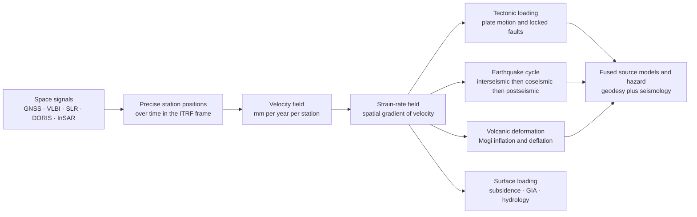

# 🛰️ Space Geodesy, GPS and Crustal Deformation

> [!abstract] TL;DR
> **Space geodesy** measures the shape and motion of the solid Earth's surface to **millimetre precision** using signals from satellites and quasars — **GNSS/GPS** carrier-phase positioning, **VLBI** (quasar baselines that define the celestial frame and Earth orientation), **SLR** (laser ranging that fixes the geocentre and gravity), **DORIS**, and **InSAR** (radar interferometry that paints spatially dense line-of-sight deformation maps). Read against a stable reference frame (**ITRF**), these positions-over-time give a **velocity field**, whose spatial gradient is the **strain-rate field** — and from that we watch the "solid" Earth move: plates gliding at rates that match million-year geology, faults silently **accumulating strain** between earthquakes (the arctangent profile that reveals a fault's **locking depth** and slip rate), snapping in a **coseismic** jump (elastic rebound), then **relaxing** for years afterward, volcanoes **inflating** as magma rises, and the crust flexing under shifting ice and water loads. Fused with seismology, geodesy delivers earthquake source models and the strain budget that underlies seismic hazard.

## Intuition — analogy FIRST

Bolt a GPS receiver to solid bedrock, walk away, and come back in a few years. It will have **moved**. Los Angeles is creeping toward San Francisco at a few centimetres a year — faster than your fingernails grow — carried on the Pacific Plate along the San Andreas. The receiver never felt a push; it simply rode a slab of "solid" rock that is, on the timescale of patience, a slow-moving fluid.

Now imagine a whole grid of such receivers, each reporting its position to the width of a pencil line, timed against satellites orbiting 20,000 km up and radio galaxies billions of light-years away. Watch the grid for a decade and the Earth turns **visibly alive**: continents drift, a locked fault sits still while the ground on either side quietly bends around it (strain loading like a stretched spring), and then one afternoon the fault ruptures and the whole grid **jumps** as the spring snaps back. Volcanoes bulge before they erupt; basins sink as we pump out their groundwater; the crust rebounds where ice sheets melted away ten thousand years ago. Space geodesy is the instrument that caught the continents in the act.

---

## How It Works

### Core Mechanics

1. **A satellite is a clock in the sky.** Each GNSS satellite broadcasts a coded signal stamped with the exact time it left. A receiver measures the travel time to each of several satellites; multiply by the speed of light to get ranges, and trilaterate a position. Code-based positioning gets you metres — enough for a car, useless for tectonics.
2. **Carrier phase buys millimetres.** Instead of the metre-scale code, geodesy tracks the **phase of the ~19 cm carrier wave** itself. Measuring a fraction of that wavelength, and stacking days of data, drives precision to **millimetres** — once you solve the *integer ambiguity* (how many whole wavelengths lie in the range) and correct the ionosphere (dispersive, removed with two frequencies), the wet troposphere (estimated as a nuisance parameter), solid-Earth and ocean tides, antenna phase-centre offsets, and relativistic clock effects.
3. **Everything is measured against a frame.** A position only means something relative to a datum. The **ITRF** (International Terrestrial Reference Frame) is a global catalogue of station *coordinates and velocities* with its origin at the geocentre (from SLR), scale from SLR/VLBI, and orientation held by a **no-net-rotation** condition. **VLBI** ties the whole thing to quasars — the inertial celestial frame — and supplies Earth orientation. Change the frame (global ITRF vs a "plate-fixed" frame that rotates with a chosen plate) and the *same data* yields different velocities: this is why reference-frame bookkeeping is half the science.
4. **Positions over time become a velocity field.** Continuous stations produce time series; fit a line (with offsets for earthquakes and equipment changes, plus annual loading terms) by **least squares** and the slope is the station **velocity**, good to fractions of a mm/yr after years of data.
5. **The gradient of velocity is strain rate.** Neighbouring stations moving at slightly different velocities means the crust between them is **straining**. The spatial derivative of the velocity field is the **strain-rate tensor** — where it concentrates, faults are locked and loading; where it is smooth, the crust is rigid.
6. **InSAR fills in the space between stations.** Two radar images of the same ground from orbit, differenced in **phase**, map the change in satellite-to-ground distance to sub-centimetre precision over millions of pixels — dense **line-of-sight** deformation maps of an earthquake, an inflating volcano, or a subsiding city, complementing the sparse-but-3D GNSS network.

### Flow / Architecture



---

## Key Concepts

### Secondary Level

**Satellites let us measure the ground with a ruler made of radio waves.** GPS was built so cars and phones know where they are to a few metres. Point the same idea at a rock, record for years, and average carefully, and you can see it move by a **hair's width** — millimetres. That is precise enough to watch continents drift.

**Continents really do move, and we can prove it directly.** For a century, plate tectonics was inferred from magnetic stripes on the seafloor and fossils split across oceans. Now GPS shows Hawaii sliding toward Japan, and the two sides of the San Andreas grinding past each other, **live** — and the speeds match the million-year geologic rates almost exactly. It is one of the great confirmations in Earth science.

**Faults are like a stuck slingshot.** A locked fault does not slide smoothly. The rock on either side keeps moving, so the ground near the fault slowly **bends and stores energy**, like pulling back a slingshot. When the fault finally lets go, it snaps forward in an **earthquake** and the stored bend is released in seconds. GPS stations sit still, drift as the strain builds, then **jump** when the quake strikes — a sawtooth written in the data.

**We also watch things sink and swell.** Radar satellites (InSAR) can map how a whole city sinks as we pump out its groundwater, or how a volcano's surface **bulges** as magma pushes up beneath it — often a warning before an eruption.

### Undergraduate Level

**The geodetic techniques, and what each is best at.** They are *different instruments*, easily conflated:

| Technique | What it measures | Signal | Strength |
|---|---|---|---|
| **GNSS / GPS** | 3D station positions, continuous or campaign | ~1.2–1.6 GHz carrier phase | mm-precision *point* velocities, real-time |
| **VLBI** | Baselines between radio telescopes | Quasar radio noise correlated across antennas | Defines the celestial frame + Earth orientation |
| **SLR** | Range to laser-retroreflector satellites | Laser pulse round-trip time | Geocentre, scale, low-degree gravity ($J_2$) |
| **DORIS** | Doppler shift of ground beacons at a satellite | Uplink microwave Doppler | Dense global frame realization, orbit determination |
| **InSAR** | Change in satellite–ground range | Radar phase difference between passes | Spatially *dense* line-of-sight deformation maps |

**Carrier-phase positioning.** The observable is $\phi = \frac{1}{\lambda}(\rho + c(\delta t_r - \delta t^s)) + N + \varepsilon$, where $\rho$ is the geometric range, $N$ the unknown **integer ambiguity**, and the terms in $\varepsilon$ are ionosphere, troposphere, and multipath. Dual-frequency data cancels the (dispersive) ionosphere; the troposphere is estimated; ambiguities are fixed to integers. **PPP** (Precise Point Positioning) uses precise satellite orbit/clock products to position a single receiver globally without a nearby base station.

**Elastic rebound and the earthquake cycle.** Reid's 1910 theory (from the 1906 San Francisco geodetic surveys): the crust **stores elastic strain** while a fault is locked, and an earthquake **releases** it. Geodesy resolves the cycle in three phases:
- **Interseismic** — steady strain accumulation around a locked fault.
- **Coseismic** — the sudden offset at rupture (seconds).
- **Postseismic** — months-to-years of decaying relaxation (afterslip on the fault + viscoelastic flow in the mantle) after the mainshock.

**The arctangent (screw-dislocation) profile.** For a vertical strike-slip fault locked from the surface to depth $D$ and slipping freely below at long-term rate $s$, the interseismic **surface velocity** parallel to the fault is
$$v(x) = \frac{s}{\pi}\,\arctan\!\left(\frac{x}{D}\right),$$
where $x$ is distance perpendicular to the fault. Far from the fault $v \to \pm s/2$ (the two plates); across the fault the velocity changes *smoothly*, and the **width of that smooth transition reveals the locking depth $D$** while the far-field step gives the slip rate $s$. This is the single most-used equation in tectonic geodesy.

**InSAR basics.** Interferometric SAR differences the **phase** of two complex radar images; after removing topographic and orbital phase, the residual fringes map ground displacement projected onto the radar **line of sight**, in units of the radar half-wavelength (a few cm per fringe). It trades GNSS's 3D precision for millions of pixels of spatial coverage.

### Graduate Level

**Dislocation models and inversion.** Coseismic and interseismic deformation are modelled with elastic **dislocation theory** — Volterra/Steketee formalism, most famously **Okada's (1985)** closed-form surface displacements for a finite rectangular fault in an elastic half-space. Given surface displacements $\mathbf{d}$ and a Green's-function matrix $\mathbf{G}$ linking unit slip on fault patches to surface motion, **finite-fault slip inversion** solves $\mathbf{d} = \mathbf{G}\,\mathbf{m}$ for the slip distribution $\mathbf{m}$ — an ill-posed linear inverse problem regularized by smoothing and positivity, tackled with weighted least squares from [[Regression_and_Correlation]]. Interseismic *coupling* inverts the *velocity* field for the fraction of each patch that is locked (back-slip formulation).

**Back-slip and coupling.** Savage's back-slip model represents interseismic loading as steady block motion *minus* the slip deficit accumulating on the locked interface; the arctangent profile is its 2D screw-dislocation limit. Fitting geodetic velocities across a subduction megathrust yields maps of **locking (coupling)** — where the plate interface is stuck and building the deficit that a future great earthquake will release.

**Postseismic mechanisms and rheology.** The postseismic signal separates competing physics: **afterslip** (velocity-strengthening frictional creep down-dip of the rupture, a rapid logarithmic-in-time transient), **poroelastic** rebound (pore-fluid pressure re-equilibration), and **viscoelastic** relaxation of a Maxwell/Burgers mantle (longer, broader). Their distinct spatial and temporal signatures let geodesy **probe mantle viscosity** independently of postglacial rebound — a direct link to the same rheology inferred from glacial isostatic adjustment.

**Volcano sources.** The **Mogi (1958)** point-source model gives radial and vertical surface displacement from a pressurized spherical cavity: $u_z \propto \dfrac{\Delta V\,d}{(d^2 + r^2)^{3/2}}$, where $d$ is source depth, $r$ radial distance, and $\Delta V$ the volume change. InSAR/GNSS inversions for source depth and $\Delta V$ track magma accumulation; more general models use dikes, sills (rectangular dislocations), and finite ellipsoids.

**Separating the loading signals.** Millimetre time series are a *superposition*: tectonics + **elastic loading** (seasonal hydrology, atmospheric pressure, ocean tidal loading — instantaneous, $\propto$ load) + **GIA** (glacial isostatic adjustment — the slow viscoelastic response to Pleistocene deglaciation, a secular vertical rate up to ~1 cm/yr in Fennoscandia and Hudson Bay) + monument noise + reference-frame drift. Extracting tectonic strain requires **modelling and removing** the rest; get the frame or the loading wrong and you invent tectonics that is not there.

**Error models matter as much as the data.** GNSS time series are dominated by **coloured (flicker) noise**, not white — ignoring this can *underestimate velocity uncertainties by an order of magnitude*. Rigorous rates use maximum-likelihood estimation of a white + flicker + random-walk noise model; monument instability injects random-walk. Reference-frame realization (ITRF version, no-net-rotation, geocentre motion, plate-fixation Euler pole) sets a systematic floor that error bars must include.

**Transients and slow slip.** Dense networks reveal **slow-slip events** and **episodic tremor and slip** on subduction interfaces — aseismic ruptures lasting days to years that radiate little seismic energy yet release significant moment, detectable *only* geodetically, and central to modern views of the seismic-aseismic transition and time-varying hazard.

---

## Python Demo

```python
# The earthquake deformation cycle, seen by GPS. numpy + matplotlib only.
#   (a) INTERSEISMIC STRAIN: the arctangent (screw-dislocation) surface-velocity
#       profile across a locked strike-slip fault, v(x) = (s/pi)*arctan(x/D).
#       Its transition WIDTH reveals the LOCKING DEPTH D; its far-field step is
#       the slip rate s. Differentiate -> the strain rate concentrates on the fault.
#   (b) COSEISMIC STEP + TIME SERIES: a GPS station's displacement is a sawtooth --
#       steady interseismic loading, a sudden coseismic jump (elastic rebound),
#       and decaying postseismic relaxation.
import numpy as np
import matplotlib.pyplot as plt

# ---------------------------------------------------------------
# (a) INTERSEISMIC arctangent profile for two locking depths
# ---------------------------------------------------------------
s = 30.0                                   # long-term slip rate, mm/yr
x = np.linspace(-100.0, 100.0, 801)        # distance across the fault, km
def v_profile(x, s, D):                     # fault-parallel surface velocity
    return (s/np.pi)*np.arctan(x/D)
def strain_rate(x, s, D):                    # dv/dx = (s/pi)*D/(x^2+D^2)
    return (s/np.pi)*D/(x**2 + D**2)

for D in (10.0, 20.0):                       # shallow vs deep locking, km
    peak = strain_rate(0.0, s, D)            # max strain rate is at the fault
    print(f"D = {D:4.0f} km : far-field step = {s:.0f} mm/yr, "
          f"peak strain rate = {peak*1e3:.3f} microstrain/yr")

# ---------------------------------------------------------------
# (b) GPS TIME SERIES: interseismic + coseismic + postseismic
# ---------------------------------------------------------------
t   = np.linspace(0.0, 200.0, 4001)          # years
v_i = 30.0                                    # interseismic loading rate, mm/yr
eqs = [60.0, 160.0]                           # earthquake times (recurrence ~100 yr)
slip = v_i*100.0                              # coseismic release ~ accumulated strain
after, tau = 300.0, 5.0                       # afterslip amplitude (mm) and time-const (yr)

d = v_i*t                                     # steady interseismic accumulation
for te in eqs:
    m  = t >= te
    d  = d - slip*m                           # elastic rebound: sudden jump back
    d  = d + after*(1.0 - np.exp(-(t - te)/tau))*m   # postseismic relaxation

# ---------------------------------------------------------------
# Plot: velocity profile | strain rate | GPS sawtooth
# ---------------------------------------------------------------
fig, ax = plt.subplots(1, 3, figsize=(15, 4.2))

for D, c in ((10.0, "tab:blue"), (20.0, "tab:red")):
    ax[0].plot(x, v_profile(x, s, D), color=c, label=f"D = {D:.0f} km")
    ax[2 - 1].plot(x, strain_rate(x, s, D)*1e3, color=c, label=f"D = {D:.0f} km")
ax[0].axvline(0.0, color="k", lw=0.8, ls="--")
ax[0].set(title="(a) Interseismic velocity\narctan screw-dislocation",
          xlabel="distance from fault [km]", ylabel="fault-parallel velocity [mm/yr]")
ax[0].legend(); ax[0].grid(alpha=0.3)

ax[1].axvline(0.0, color="k", lw=0.8, ls="--")
ax[1].set(title="(b) Strain rate = dv/dx\nconcentrates on the fault",
          xlabel="distance from fault [km]", ylabel="strain rate [microstrain/yr]")
ax[1].legend(); ax[1].grid(alpha=0.3)

ax[2].plot(t, d, color="tab:green")
for te in eqs:
    ax[2].axvline(te, color="k", lw=0.8, ls=":")
ax[2].set(title="(c) GPS station time series\nload, rupture, relax (sawtooth)",
          xlabel="time [yr]", ylabel="displacement [mm]")
ax[2].grid(alpha=0.3)

plt.tight_layout()
plt.show()
# Takeaways: a NARROWER velocity transition (smaller D) => a SHARPER strain-rate
# spike at the fault; the time series is the earthquake cycle in one picture.
```

---

## Real-World Applications

- **Plate motion, measured directly.** The **Plate Boundary Observatory / GAGE** network (western US) and global **IGS** stations pin present-day plate velocities that reproduce the geologic **NUVEL/MORVEL** rates — the modern proof of plate tectonics.
- **Earthquake response.** Within minutes of the 2011 **Tohoku** ($M_w$ 9.0) and 2004 **Sumatra** events, GNSS + InSAR delivered **coseismic slip models** used for tsunami forecasting and rupture analysis; Tohoku's coast dropped and moved *metres* seaward on the geodetic record.
- **Subduction hazard.** Interseismic **coupling maps** from GNSS reveal which segments of the Cascadia, Chile, and Japan megathrusts are locked and storing the deficit for future great earthquakes — a primary input to hazard models.
- **Volcano monitoring.** InSAR + GNSS track **inflation** at Kīlauea, Yellowstone, and the Icelandic systems; the **2010 Eyjafjallajökull** and **2021–23 Reykjanes** eruptions were preceded by clear geodetic bulging fit with dike/Mogi sources.
- **Land subsidence.** InSAR maps show cities such as **Jakarta, Mexico City, and the San Joaquin Valley** sinking by tens of cm/yr from groundwater and hydrocarbon withdrawal — infrastructure and flood-risk critical.
- **Ice and water loading.** GNSS vertical rates in **Greenland, Antarctica, and Alaska** record **elastic uplift** from present-day ice loss and **GIA** from Pleistocene deglaciation, feeding sea-level and cryosphere science.
- **Reference frame + navigation.** ITRF, realized by VLBI/SLR/GNSS/DORIS, is the datum under **GPS, precise orbit determination, and satellite altimetry** for sea-level.

---

## Common Pitfalls

- **Treating GNSS, VLBI, SLR, DORIS, and InSAR as interchangeable.** They are *different instruments* with different strengths: GNSS gives 3D point velocities, VLBI defines the celestial frame and Earth orientation, SLR fixes the geocentre and scale, DORIS densifies the frame, InSAR gives dense line-of-sight maps. Conflating them (e.g., expecting InSAR to give 3D, or GNSS to give continuous spatial coverage) is a classic error.
- **Ignoring the reference frame.** A velocity is meaningless without stating the frame. Global **ITRF** velocities and **plate-fixed** velocities differ by a whole-plate rotation. Mixing frames, using the wrong ITRF realization, or forgetting geocentre motion silently corrupts the result.
- **Confusing the three cycle phases.** **Interseismic** (slow, smooth strain), **coseismic** (a sudden step), and **postseismic** (a decaying transient) have distinct physics. Fitting a single straight line through a series that contains an earthquake or afterslip yields a nonsense "velocity."
- **Misreading the arctangent profile.** The *width* of the smooth velocity transition encodes the **locking depth $D$**, not just the slip rate. A narrow transition means shallow locking; a broad one, deep locking. The far-field step gives the slip rate — do not swap the two.
- **Taking InSAR line-of-sight for true displacement.** InSAR measures only the projection onto the radar line of sight. Vertical, north, and east motions mix into one number; recovering 3D needs ascending + descending passes (and north is poorly constrained) or fusion with GNSS.
- **Not separating loading signals.** GIA, elastic hydrology/ice loading, atmospheric pressure, and ocean tidal loading all masquerade as tectonic motion in raw time series. They must be modelled and removed before interpreting strain.
- **Underestimating errors with a white-noise model.** GNSS time series carry **coloured (flicker/random-walk) noise**; assuming white noise can shrink velocity uncertainties ~5–10×, manufacturing false significance. Millimetre precision demands proper stochastic error modelling.
- **Forgetting relativity in the clocks.** GNSS timing requires both special- and general-relativistic corrections; gravitational time dilation alone would accumulate ~38 microseconds per day of error — enough to break positioning within minutes if uncorrected.

---

## Related Concepts

- [[Plate_Boundaries_and_Plate_Motions]] — the tectonic velocities and boundary types that space geodesy now measures directly and matches to geologic rates.
- [[Elasticity_and_Seismic_Wave_Theory]] — elastic half-space dislocation theory (Okada, screw dislocations) underlies both interseismic and coseismic deformation models.
- [[Earthquake_Seismology_Fundamentals]] — seismology fused with geodesy yields finite-fault source models and the seismic-vs-aseismic strain budget.
- [[Interference_and_Diffraction]] — the phase interferometry that makes InSAR (and its fringe counting) possible.
- [[Fourier_Transform]] — spectral processing of SAR images and of GNSS time-series noise and seasonal terms.
- [[Introduction_to_General_Relativity]] — gravitational time dilation and the relativistic clock corrections without which GNSS positioning fails.
- [[Regression_and_Correlation]] — least-squares estimation of station velocities and the linear inverse problem behind slip inversion.
- [[Orbital_Mechanics_and_Celestial_Dynamics]] — the precise satellite orbits (SLR/DORIS-determined) that every geodetic technique depends on.

*Sibling notes in this Geophysics track (in prose):* the ITRF/EOP backbone in **Earths_Rotation_and_Reference_Frames**; the load-response and mantle-viscosity link in **Postglacial_Rebound_and_Mantle_Viscosity**; large-scale tectonics in **Geophysics_of_Plate_Tectonics**; the geocentre/scale and gravity field in **Earths_Gravity_Field_and_Geodesy**; magma-source deformation in **Volcano_Geophysics_and_Monitoring**; and rupture kinematics in **Earthquake_Source_and_Focal_Mechanisms**.

---

## Review Questions

1. **(Secondary)** A GPS receiver bolted to bedrock in Los Angeles moves a few centimetres per year even though nobody touches it. Explain in plain terms what is moving it, and why this counts as direct evidence for plate tectonics.
2. **(Undergraduate)** Two GPS transects cross locked strike-slip faults with the same far-field slip rate, but one velocity profile changes over a much *narrower* zone than the other. Using the arctangent model $v(x)=\frac{s}{\pi}\arctan(x/D)$, which fault is locked more shallowly, and how would the strain-rate curves differ? Sketch both.
3. **(Graduate)** You have coseismic InSAR (line-of-sight) and a sparse 3D GNSS field for a large earthquake, and you want a finite-fault slip model. Set up the inverse problem $\mathbf{d}=\mathbf{G}\mathbf{m}$: what are $\mathbf{G}$ and $\mathbf{m}$, why is it ill-posed, and how do reference-frame choice, InSAR line-of-sight ambiguity, and coloured-noise error models each affect the solution and its uncertainties?

---

## Sources

- Segall, P. — *Earthquake and Volcano Deformation* (Princeton, 2010): dislocation theory, the arctangent/screw-dislocation model, Mogi sources, and inversion.
- Herring, T. A., Melbourne, T. I., et al. — *GPS/GNSS Geodesy* (Treatise on Geophysics / GAMIT-GLOBK references): carrier-phase processing, ITRF, and time-series analysis.
- Blewitt, G. — "GPS and Space-Based Geodetic Methods," in *Treatise on Geophysics*: techniques, error models, and reference frames.
- Bürgmann, R., Rosen, P. A., & Fielding, E. J. — "Synthetic Aperture Radar Interferometry to Measure Earth's Surface Topography and Its Deformation," *Annu. Rev. Earth Planet. Sci.* (2000); Bürgmann & Thatcher on the earthquake cycle.
- IERS Conventions / ITRF (itrf.ign.fr) and the International GNSS Service (IGS): reference-frame realization and Earth orientation parameters.

---

#geophysics #space-geodesy #gps-gnss #crustal-deformation #insar
