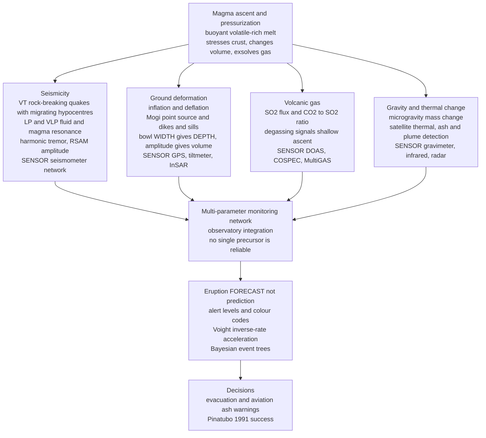

# 🌋 Volcano Geophysics and Monitoring

> [!abstract] TL;DR
> A volcano rarely erupts without warning — but the warning is buried kilometres underground, so we read it with **geophysics**. As magma forces its way toward the surface it **cracks rock** (swarms of tiny **volcano-tectonic** earthquakes), makes the ground and its fluids **resonate** (**long-period**, **very-long-period**, and **harmonic tremor** signals), **inflates the surface** like a slowly filling balloon (measured by **GPS**, **tiltmeters**, and satellite **InSAR** — modelled with the point-source **Mogi** solution, where the *width* of the uplift bowl fixes the source *depth* and its amplitude gives the *volume change*), **releases gas** (**SO₂/CO₂** fluxes and ratios via DOAS/COSPEC/MultiGAS), and shifts **mass, gravity, and heat**. No single precursor is reliable — the life-saving product comes from **integrating** seismicity + deformation + gas into **alert levels** and **probabilistic eruption forecasts** (accelerating-seismicity / **Voight inverse-rate** methods and Bayesian event trees). This is applied, real-time geophysics: the science that **evacuated 60,000+ people before Pinatubo in 1991**.

---

## Intuition

**Analogy:** Before a pot boils over, it **rumbles, hisses, and its lid bulges**. A volcano does exactly the same — only its warning signs are buried kilometres down and its lid is a mountain of rock. As magma pushes upward it *cracks* the crust (swarms of tiny earthquakes, the rumble), *inflates* the ground like a slowly filling balloon (the bulging lid, seen by GPS and radar satellites), and *vents* telltale gases (the hiss). **Volcano geophysics is the stethoscope and early-warning system pressed against a restless mountain** — turning invisible underground unrest into the forecasts that evacuate cities in time.

The key mental shift is that we are not watching the volcano — we are watching *the magma's struggle to reach the surface*, indirectly, through the fingerprints it leaves on the rock, the ground surface, the atmosphere, and the local gravity and heat fields. Each instrument listens to a different fingerprint; only by overlaying all of them does the underground story become legible.

---

## How It Works

### Core Mechanics

1. **The driver: magma ascent and pressurization.** Buoyant, volatile-rich melt rises from a reservoir toward the surface. As it moves it *stresses the surrounding crust*, *changes volume in its storage zone*, and *exsolves gas* as pressure drops. Every monitoring signal below is a downstream consequence of this one process. The monitoring goal is to invert the surface observations back to the **depth, volume, rate, and pressurization** of the magma.
2. **Volcano seismology — the crust breaking and the fluids ringing.** Seismometers on the edifice record several distinct signal families, each a different physical process:
   - **Volcano-tectonic (VT) earthquakes** — brittle rock *fracturing* as magma forces its path. High-frequency, impulsive, with clear P and S arrivals; their **hypocentres migrate**, so tracking the swarm literally maps the magma's ascent path.
   - **Long-period (LP) and very-long-period (VLP) events** — *fluid and magma resonance*, not rock breaking. LP events (~0.5–5 Hz) reflect pressure oscillations in fluid-filled cracks and conduits; VLP events (tens of seconds) track bulk mass transport and inflation/deflation of the shallow system. A shift *from VT to LP* often signals magma reaching shallow, gas-charged levels.
   - **Volcanic (harmonic) tremor** — sustained, often narrow-band vibration from continuous fluid/gas movement or sustained resonance; frequently the last-stage precursor before eruption.
   - **RSAM (Real-time Seismic Amplitude Measurement)** — a single running average of ground-shaking amplitude that collapses the whole waveform into one number a duty scientist can watch escalate around the clock (its cousin **SSAM** adds a spectral breakdown).
3. **Ground deformation — the inflating balloon.** A pressurizing magma body pushes the surface *up and out* (**inflation**); withdrawal or degassing pulls it *down and in* (**deflation**). The simplest, workhorse model is the **Mogi source**: a point (small spherical) pressure/volume change $\Delta V$ at depth $d$ in an elastic half-space, giving surface displacements
   $$u_z(r) = \frac{(1-\nu)}{\pi}\,\Delta V\,\frac{d}{(d^2+r^2)^{3/2}}, \qquad u_r(r) = \frac{(1-\nu)}{\pi}\,\Delta V\,\frac{r}{(d^2+r^2)^{3/2}}$$
   where $u_z$ is vertical uplift, $u_r$ radial horizontal motion, $\nu$ Poisson's ratio, and $r$ the distance from the point above the source. The decisive geophysical insight: the **width of the uplift bowl encodes the source depth** — the half-width is $r_{1/2}=d\sqrt{2^{2/3}-1}\approx 0.77\,d$, so a *narrow, sharp* bulge is *shallow* and a *broad, gentle* bulge is *deep* — while the **amplitude gives the volume change**. This is exactly what **GPS**, **tiltmeters**, and satellite **InSAR** measure (ties directly to space geodesy). Real sources need richer geometries — **sills** and **dikes** as tensile dislocations (Okada), prolate spheroids, and pipes — but Mogi is the intuition-builder every volcanologist starts with.
4. **Volcanic gas — degassing announces ascent.** Rising magma releases volatiles in a rough sequence: deep **CO₂** first (low solubility), then shallow **SO₂**, then water and halogens near the surface. **SO₂ flux** (via **DOAS**/**COSPEC** ultraviolet spectrometers on the ground, aircraft, or satellites) and gas **ratios** (**CO₂/SO₂**, **SO₂/H₂S** via in-situ **MultiGAS**) reveal how much magma is degassing and how shallow it sits. A rising CO₂/SO₂ ratio can flag fresh, deep magma recharge before anything else moves.
5. **Gravity, thermal, and other fields.** **Microgravity** surveys detect *mass* change (new magma or fluids) independent of the deformation, resolving the classic ambiguity of "is the ground rising because magma arrived, or just because gas pressurized existing magma?" **Thermal and remote sensing** (satellite infrared radiance, thermal cameras, ash and SO₂ plume detection) track surface heating, lava, and eruption clouds — critical for aviation. **Magnetic**, **self-potential/electrical**, and increasingly **muon radiography** image the internal structure and hydrothermal state of the edifice.
6. **Integration — no single precursor is reliable.** Each signal alone is ambiguous: swarms fade without eruption, ground inflates then stalls, gas fluctuates with weather. **The forecast emerges from overlaying seismicity + deformation + gas + thermal** at an **observatory**, translating the combined picture into a small number of **alert levels** (colour codes) that trigger public and aviation action.
7. **Forecasting, not prediction.** We do **not** deterministically "predict" the day and hour. We **forecast probabilities**. Two complementary approaches:
   - **Material-failure / accelerating-seismicity (Voight's law).** As the system approaches failure, precursor rates accelerate: $\ddot\Omega = A\,\dot\Omega^{\alpha}$ for a measurable $\Omega$ (event count, RSAM). For $\alpha=2$ this integrates so the **inverse rate** $1/\dot\Omega$ falls *linearly* toward **zero at the failure time** $t_f$ — the **Failure Forecast Method (FFM)**: extrapolate the straight line of $1/\text{rate}$ to its x-intercept to forecast eruption timing.
   - **Probabilistic / Bayesian event trees** (e.g., BET_EF, VOLCANO). Structured trees assign, at each branch (unrest → magmatic → eruption → size → location), probabilities updated with monitoring data — producing hazard forecasts even when precursors are noisy.

### Flow / Architecture



---

## Key Concepts

**Secondary (intuition level).** A volcano warns you before it erupts, but the warnings are underground, so we use instruments. As magma pushes up it makes tiny earthquakes (a rumble we hear with seismometers), swells the ground (a bulge we see with GPS and radar satellites), and lets out gases (a hiss we sniff with gas sensors). A *narrow* bulge means the magma is *shallow*; a *wide* gentle bulge means it is *deep*. No single sign is trustworthy on its own — sometimes the mountain rumbles and never erupts (a **false alarm**) — so scientists combine earthquakes + swelling + gas to set an **alert level**. We cannot say the exact hour, but we *can* say the odds are rising, and that is enough to evacuate a city in time.

**Undergraduate (working level).** Volcano monitoring is a **multi-parameter inverse problem**: surface observations → magma state at depth. **Seismology** distinguishes **VT** (brittle failure, migrating swarms map ascent), **LP/VLP** (fluid/magma resonance), and **tremor** (sustained fluid flow), summarized in real time by **RSAM**. **Deformation** is modelled by the **Mogi** point source, $u_z(r)\propto \Delta V\,d/(d^2+r^2)^{3/2}$; the **bowl half-width $\approx 0.77\,d$ fixes depth** and the amplitude gives $\Delta V$ — measured by GPS/tilt/InSAR (space geodesy). **Gas** (SO₂ flux, CO₂/SO₂ ratio) tracks degassing and recharge; **microgravity** separates mass gain from pressurization. **Integration** yields **alert levels**; **forecasting** uses **Voight's inverse-rate** (extrapolate $1/\text{rate}\to 0$ at $t_f$) and **Bayesian event trees**. Emphasize **forecast (probability) vs prediction (deterministic time)**, and that **unrest does not guarantee eruption**.

**Graduate (rigorous level).** Seismic sources are inverted for **moment-tensor** content: VLP events often carry strong **non-double-couple (volumetric)** components diagnostic of conduit/crack inflation, and LP events are modelled as **fluid-filled resonators** whose complex frequencies encode geometry and the acoustic properties of the magmatic fluid (gas fraction dramatically lowers sound speed → tremor spectra). Deformation inversion faces **source non-uniqueness**: Mogi (isotropic point), **Okada** rectangular dislocations (dikes/sills), **Yang** prolate spheroids, and **finite/topographic/heterogeneous-elastic (and viscoelastic)** models trade off depth, geometry, and $\Delta V$ — resolved only by *combining* InSAR spatial coverage with continuous GPS time series and independent **microgravity** ($\Delta g$ vs uplift separates intrusion from pressurization via the free-air/Bouguer partition). Gas geochemistry couples to **magma degassing dynamics** and solubility (CO₂-then-SO₂-then-H₂O sequence). Forecasting formalizes **Voight's relation** $\ddot\Omega = A\dot\Omega^{\alpha}$ (FFM, $\alpha\!\approx\!2$ giving linear inverse-rate) and **Bayesian Event Trees** (BET_EF) with **failure-forecast uncertainty**, situating eruption onset as a **critical transition / self-organized criticality** problem. Modern practice fuses these into **operational probabilistic forecasts** and machine-learning classifiers on the seismic/deformation catalog.

---

## Python Demo

```python
# Reading volcanic unrest with geophysics (numpy + matplotlib).
# (a) THE MOGI MODEL: a pressurized point magma source at depth d inflates the
#     surface. The WIDTH of the uplift bowl constrains source DEPTH; the amplitude
#     gives the volume change dV -- exactly what GPS / tiltmeters / InSAR measure.
# (b) SEISMIC SWARM ESCALATION + eruption FORECAST: synthetic accelerating VT-quake
#     counts and RSAM (seismic amplitude), plus Voight's inverse-rate method
#     (1/rate -> 0 at the failure time), the "Failure Forecast Method".
import numpy as np
import matplotlib.pyplot as plt

np.random.seed(0)

# ---------------------------------------------------------------------------
# (a) MOGI ground deformation of an elastic half-space
#     u_z(r) = (1-nu)/pi * dV * d / (d^2 + r^2)^(3/2)   (vertical uplift)
#     u_r(r) = (1-nu)/pi * dV * r / (d^2 + r^2)^(3/2)   (radial horizontal)
# ---------------------------------------------------------------------------
nu = 0.25                      # Poisson's ratio
dV = 2.0e6                     # source volume change [m^3] (~0.002 km^3)
r  = np.linspace(-15000, 15000, 601)   # distance across the volcano [m]

def mogi_uz(r, d, dV=dV, nu=nu):
    return (1 - nu) / np.pi * dV * d / (d**2 + r**2)**1.5

def mogi_ur(r, d, dV=dV, nu=nu):
    return (1 - nu) / np.pi * dV * r / (d**2 + r**2)**1.5

depths = [2000.0, 4000.0, 6000.0]      # candidate magma-source depths [m]
# half-width of the uplift bowl scales with depth:  r_half = d*sqrt(2^(2/3)-1)
half_factor = np.sqrt(2**(2/3) - 1)    # ~0.766

# ---------------------------------------------------------------------------
# (b) Accelerating seismicity toward failure time t_f (Voight, alpha = 2)
#     rate(t)   = 1 / (A*(t_f - t))         -> accelerates toward t_f
#     1/rate(t) = A*(t_f - t)               -> LINEAR, hits zero at t_f
# ---------------------------------------------------------------------------
t_f   = 30.0                    # true (hidden) failure/eruption day
A     = 0.02
t     = np.arange(0.5, 28.0, 0.5)          # observation days (crisis so far)
rate_true = 1.0 / (A * (t_f - t))          # true VT-events per day
rsam_true = 20.0 * rate_true               # RSAM tracks the same acceleration

vt_counts = np.random.poisson(rate_true)                    # noisy daily VT counts
rsam_obs  = rsam_true * (1 + 0.08*np.random.randn(len(t)))  # noisy RSAM amplitude

# Failure Forecast Method: fit a straight line to the inverse rate, extrapolate to 0.
inv_rate = 1.0 / rsam_obs
obs = t <= 24.0                             # pretend we forecast mid-crisis (day 24)
slope, intercept = np.polyfit(t[obs], inv_rate[obs], 1)
t_forecast = -intercept / slope             # x-intercept  = forecast eruption day
print(f"Mogi bowl half-widths (constrain depth):")
for d in depths:
    print(f"   depth {d/1000:.0f} km  ->  half-width {half_factor*d/1000:.2f} km, "
          f"peak uplift {mogi_uz(0.0, d)*100:.1f} cm")
print(f"\nTrue eruption day t_f      : {t_f:.1f}")
print(f"Inverse-rate FORECAST day  : {t_forecast:.1f}  (from data up to day 24)")

# ---------------------------------------------------------------------------
# Plots
# ---------------------------------------------------------------------------
fig, ax = plt.subplots(2, 2, figsize=(13.5, 9.5))

# (a1) Mogi vertical uplift: shallow = narrow & tall, deep = broad & low
for d in depths:
    ax[0,0].plot(r/1000, mogi_uz(r, d)*100, lw=2, label=f"d = {d/1000:.0f} km")
    rh = half_factor*d
    ax[0,0].plot([rh/1000, -rh/1000],
                 [mogi_uz(rh, d)*100]*2, "k.", ms=6)
ax[0,0].set_xlabel("distance from summit r [km]")
ax[0,0].set_ylabel("vertical uplift u_z [cm]")
ax[0,0].set_title("(a) Mogi uplift: bowl WIDTH encodes source DEPTH\n"
                  "(dots = half-width ~ 0.77 d)")
ax[0,0].legend(title="source depth"); ax[0,0].grid(alpha=0.3)

# (a2) vertical vs radial (what GPS/InSAR see) for one source
d0 = 4000.0
ax[0,1].plot(r/1000, mogi_uz(r, d0)*100, lw=2, label="u_z vertical (uplift)")
ax[0,1].plot(r/1000, mogi_ur(r, d0)*100, lw=2, label="u_r radial (outward)")
ax[0,1].axhline(0, color="grey", lw=0.8)
ax[0,1].set_xlabel("distance from summit r [km]")
ax[0,1].set_ylabel("surface displacement [cm]")
ax[0,1].set_title(f"(a) Deformation field, d = {d0/1000:.0f} km\n"
                  "(measured by GPS, tiltmeters, InSAR)")
ax[0,1].legend(); ax[0,1].grid(alpha=0.3)

# (b1) accelerating seismicity: VT counts + RSAM
ax[1,0].bar(t, vt_counts, width=0.4, color="#c0392b", alpha=0.7,
            label="VT quakes / day")
ax[1,0].set_xlabel("time [days]")
ax[1,0].set_ylabel("VT earthquakes / day", color="#c0392b")
axb = ax[1,0].twinx()
axb.plot(t, rsam_obs, "o-", color="#2c3e50", ms=3, label="RSAM amplitude")
axb.set_ylabel("RSAM (seismic amplitude)", color="#2c3e50")
ax[1,0].set_title("(b) Seismic swarm ESCALATION toward eruption")
ax[1,0].grid(alpha=0.3)

# (b2) inverse-rate forecast (Voight FFM): 1/rate -> 0 at failure time
ax[1,1].plot(t[obs],  inv_rate[obs],  "ko", ms=4, label="observed 1/RSAM")
ax[1,1].plot(t[~obs], inv_rate[~obs], "o", ms=4, mfc="none",
             mec="grey", label="future (unseen)")
tt = np.linspace(0, t_forecast, 50)
ax[1,1].plot(tt, slope*tt + intercept, "r--", lw=2, label="linear fit")
ax[1,1].axhline(0, color="grey", lw=0.8)
ax[1,1].axvline(t_forecast, color="red", ls=":", lw=1.5)
ax[1,1].axvline(t_f, color="green", ls=":", lw=1.5)
ax[1,1].annotate(f"forecast\nday {t_forecast:.1f}", xy=(t_forecast, 0),
                 xytext=(t_forecast-9, inv_rate[obs].max()*0.5), color="red",
                 fontsize=9, arrowprops=dict(arrowstyle="->", color="red"))
ax[1,1].annotate(f"true t_f\nday {t_f:.0f}", xy=(t_f, 0),
                 xytext=(t_f-4, inv_rate[obs].max()*0.25), color="green", fontsize=9)
ax[1,1].set_xlabel("time [days]")
ax[1,1].set_ylabel("inverse rate  1 / RSAM")
ax[1,1].set_title("(b) Voight inverse-rate forecast\n(1/rate crosses zero at eruption)")
ax[1,1].legend(fontsize=8); ax[1,1].grid(alpha=0.3)

plt.tight_layout()
plt.savefig("volcano_geophysics_and_monitoring.png", dpi=130)
print("\nSaved volcano_geophysics_and_monitoring.png")
```

Running this prints the Mogi bowl half-widths (confirming the shallower source gives a **narrower, taller** bulge) and an **inverse-rate eruption forecast** made from data only up to "day 24," landing close to the hidden true failure day. The four panels show: **(a)** the Mogi uplift profiles for three depths — the deep source produces a **broad, gentle** bowl and the shallow source a **sharp, tall** one, so measuring the bowl's width from GPS/InSAR *inverts to the magma depth*; **(a, right)** the paired vertical and radial surface motion a geodetic network actually records; **(b)** the accelerating VT count and RSAM swarm climbing toward eruption; and **(b, right)** the **Failure Forecast Method** — the inverse rate falling along a straight line whose x-intercept *is* the forecast eruption time. Together they are a miniature of real-time unrest analysis.

---

## Real-World Applications

- **Pinatubo, Philippines (1991) — the textbook success.** PHIVOLCS and the USGS **VDAP** tracked accelerating VT swarms, shallowing seismicity, and surging SO₂ over weeks, escalated alert levels, and **evacuated 60,000+ people** days before the second-largest eruption of the 20th century — one of the clearest cases of geophysical monitoring saving thousands of lives.
- **Volcano observatories and VDAP.** Permanent observatories (USGS Alaska/Hawaiian/Cascades/Yellowstone, Italy's INGV, Iceland's IMO, Japan's JMA, PHIVOLCS, Montserrat's MVO) run 24/7 multi-parameter networks; the USGS–USAID **Volcano Disaster Assistance Program** deploys portable networks to crises worldwide.
- **Aviation safety.** Volcanic Ash Advisory Centres fuse satellite thermal, SO₂, and ash-plume detection with ground seismicity to reroute aircraft — the **Eyjafjallajökull 2010** eruption grounded European aviation for days, underscoring the stakes.
- **Kīlauea, Hawaiʻi.** Dense GPS + tiltmeter + InSAR + seismic networks resolve **magma-chamber inflation/deflation** and **dike propagation** in near-real time; the 2018 Lower East Rift Zone eruption was tracked as migrating seismicity and metres of deformation.
- **Campi Flegrei caldera, Italy.** Decades of **bradyseism** (slow ground rise and fall of metres) over a densely populated caldera near Naples make it a flagship case for deformation-source modelling and probabilistic (Bayesian event-tree) unrest assessment.
- **Satellite geodesy at scale.** InSAR missions (ESA **Sentinel-1**) now systematically screen the world's ~1,400 subaerial volcanoes for deformation, catching unrest at unmonitored volcanoes that have no ground instruments.

---

## Common Pitfalls

- **Assuming unrest always leads to eruption (the false-alarm problem).** Most episodes of elevated seismicity and inflation **stall without erupting** (failed/aborted intrusions). Over-calling erodes public trust and imposes real evacuation costs; under-calling costs lives. This asymmetry is the central operational tension of volcano forecasting.
- **Treating the Mogi model as reality.** Mogi is a **simplified isotropic point source** in a uniform elastic half-space. Real magma bodies are **sills, dikes, or spheroids** in heterogeneous, topographic, sometimes viscoelastic crust. The same surface uplift can be fit by different depth/geometry/$\Delta V$ combinations — **source non-uniqueness** — so never over-interpret a single Mogi inversion.
- **Relying on any single precursor.** Seismicity, deformation, and gas can each mislead alone (weather-contaminated gas, aseismic inflation, tremor without eruption). **Multi-parameter integration is essential** — the forecast lives in the *combination*, not any one channel.
- **Confusing the seismic families.** **VT** (brittle rock breaking) is a different physical process from **LP/VLP** (fluid/magma resonance) and **tremor** (sustained fluid flow). Misclassifying them mis-reads the state of the system — e.g., a **VT-to-LP transition** signalling shallow gas-charged magma is easy to miss if all events are lumped together.
- **Ignoring the mass-vs-pressure ambiguity.** Ground uplift alone cannot say whether **new magma arrived** or **existing magma simply pressurized/degassed**. Only adding **microgravity** (mass change) resolves it — deformation without gravity change points to pressurization, not fresh intrusion.
- **Overlooking gas and thermal channels.** SO₂/CO₂ fluxes and ratios (and their solubility-driven sequence) plus satellite thermal/ash detection carry information seismicity and deformation do not — omitting them blinds the forecast to shallow degassing and effusion.
- **Conflating forecasting with prediction.** We produce **probabilities and alert levels** (forecasting), not deterministic date-and-time **predictions**. The Voight inverse-rate line and Bayesian event trees give *odds and windows*; presenting them as exact predictions guarantees eventual, trust-destroying "misses."

---

## Related Concepts

- [[Earthquake_Seismology_Fundamentals]] — the seismograph, magnitude, and hypocentre location that volcano seismology repurposes for VT swarm tracking (distinct: brittle regional quakes vs magmatic fluid resonance).
- [[Elasticity_and_Seismic_Wave_Theory]] — the elastic half-space physics behind the Mogi solution and the wave propagation that shapes VT/LP/tremor signals.
- [[Volcanism_and_Volcanic_Hazards]] — the **eruption processes and hazards** (this note is the geophysical *monitoring / unrest* companion that forecasts them).
- [[Magma_Generation_and_Bowens_Series]] — where the ascending, degassing magma comes from; the melt whose motion every precursor tracks.
- [[Plate_Boundaries_and_Plate_Motions]] — the subduction-zone and hotspot settings that localize the world's monitored volcanoes.
- [[Earths_Gravity_Field_and_Geodesy]] — the geodetic and gravity foundations behind GPS deformation and microgravity mass-change monitoring.
- [[Gravity_and_Magnetic_Surveying]] — the potential-field methods (microgravity, magnetics) used to image and monitor volcanic edifices.
- [[Frequency_Spectrum]] — spectral analysis of harmonic tremor and LP resonance frequencies, the signal-processing backbone of volcano seismology.
- [[Oscillations_and_SHM]] — the resonance physics underlying LP/VLP events modelled as fluid-filled oscillating cracks and conduits.
- [[Criticality_and_Phase_Transitions]] — eruption onset as a critical transition; the accelerating-precursor / material-failure view of approaching failure.
- [[Bifurcations_and_Tipping_Points]] — the tipping-point framing of when pressurizing unrest flips irreversibly into eruption.
- [[Atmospheric_Optics_and_Aerosols]] — the volcanic SO₂/sulfate aerosols whose flux is monitored and which drive climate cooling after large eruptions.

*Sibling notes in this Geophysics section (prose references, build alongside): **Space_Geodesy_GPS_and_Crustal_Deformation** supplies the GPS/InSAR geodesy that measures Mogi inflation; **Earthquake_Source_and_Focal_Mechanisms** provides the moment-tensor machinery reused for non-double-couple VLP sources; **Seismic_Hazard_and_Ground_Motion** shares the forecast-not-predict philosophy for the seismic side; **Geophysical_Signal_and_Data_Processing** underpins RSAM, spectral tremor analysis, and swarm detection; and **Environmental_and_Hydrogeophysics** connects hydrothermal, electrical, and self-potential imaging of the edifice.*

---

## Review Questions

1. **(Secondary)** A town below a volcano sees weeks of tiny earthquakes and the ground slowly bulging, but no eruption comes. Explain, using the "boiling pot" idea, why scientists still raise an alert — and why the volcano can rumble and swell yet *not* erupt (a false alarm). Why is it dangerous to trust just one warning sign?
2. **(Undergraduate)** InSAR shows a circular uplift bowl over a volcano. (a) How do you use the *width* of the bowl to estimate the magma-source *depth*, and the *amplitude* to estimate the volume change, via the Mogi model? (b) Two teams fit the same uplift but disagree on depth vs volume — what causes this ambiguity, and which *additional* measurement would resolve whether new magma actually arrived? (c) Explain the difference between forecasting and predicting the eruption.
3. **(Graduate)** You observe accelerating RSAM and a swarm migrating upward, dominated increasingly by LP over VT events, with rising CO₂/SO₂. (a) Physically interpret each of these three trends in terms of magma state. (b) Apply Voight's relation $\ddot\Omega = A\dot\Omega^{\alpha}$: for what $\alpha$ does the inverse-rate become linear, and what are the failure-mode and uncertainty limitations of extrapolating $1/\text{rate}\to 0$? (c) How would a Bayesian event tree combine these signals into an eruption-probability forecast, and why might it outperform the inverse-rate line in a noisy, non-monotonic crisis?

---

## Sources

- Sparks, R. S. J. (2003). "Forecasting volcanic eruptions." *Earth and Planetary Science Letters*, 210(1–2), 1–15.
- Segall, P. (2010). *Earthquake and Volcano Deformation*. Princeton University Press. (Mogi and dislocation deformation-source theory.)
- Sigurdsson, H. et al. (Eds.) (2015). *The Encyclopedia of Volcanoes*, 2nd ed. Academic Press. (Monitoring, seismology, gas, and forecasting chapters.)
- Dzurisin, D. (2007). *Volcano Deformation: Geodetic Monitoring Techniques*. Springer-Praxis. (GPS, tilt, InSAR, and source modelling.)
- McNutt, S. R. (2005). "Volcanic seismology." *Annual Review of Earth and Planetary Sciences*, 33, 461–491. (VT/LP/tremor classification and RSAM.)
- Voight, B. (1988). "A method for prediction of volcanic eruptions." *Nature*, 332, 125–130. (The inverse-rate / failure-forecast method.)
- [USGS Volcano Hazards Program — Monitoring](https://www.usgs.gov/programs/VHP/volcano-monitoring)

---

#geophysics #volcano-monitoring #volcano-seismology #ground-deformation #eruption-forecasting
