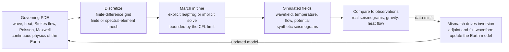

# 💻 Computational Geophysics and Simulation

> [!abstract] TL;DR
> **Computational geophysics turns the governing equations of the solid Earth into a virtual planet you can experiment on.** You cannot trigger a real earthquake to test a building code, or rewind a billion years of mantle stirring — but you *can* do both inside a computer. The recipe is always the same: take a continuous physical law (the elastic **wave equation** for seismic propagation, the **heat/diffusion + Stokes** equations for mantle convection, **Poisson/Laplace** for gravity and potential fields, **Maxwell** for electromagnetics), **discretize** it onto a grid or mesh with finite differences, finite/spectral elements, or spectral methods, then **march it forward in time** to produce simulated fields — synthetic seismograms, temperature snapshots, flow patterns. This *forward-modeling engine* is the "third pillar" of geophysics alongside theory and observation, and it is the kernel inside every modern inversion: simulate the data a candidate Earth would produce, compare to what was recorded, and back-propagate the mismatch to correct the model. The craft lies in the numerics — the **CFL stability limit**, **grid dispersion**, and **absorbing boundaries** — which separate a physical result from numerical garbage.

---

## Intuition

**Analogy:** You can't set off a real magnitude-8 earthquake to check whether a city's skyscrapers will survive, and you certainly can't restart mantle convection to watch how the continents assemble — the experiments are too big, too slow, or too catastrophic to run for real. But you *can* run them inside a computer. Computational geophysics is a **laboratory for a planet you can never put on a bench**: you write down the equations the Earth already obeys, hand them to a machine, and let the virtual planet evolve. Simulate the full shaking of an earthquake sweeping across a basin, stir a billion years of mantle in an afternoon, or synthesize the *exact seismogram* that a given arrangement of rock would produce.

The move that makes this possible is deceptively simple. A physical law like "the acceleration of the ground equals wave-speed-squared times the curvature of the wavefield" ($\partial^2 u/\partial t^2 = c^2\nabla^2 u$) is a statement about *every point in space at every instant* — infinitely many unknowns. You cannot store infinity, so you **sample**: chop space into a grid of points and time into ticks, and replace derivatives with differences of neighbouring values. The Earth's smooth physics becomes a giant bookkeeping problem a computer can grind through — provided you respect the numerical rules that keep the bookkeeping honest.

---

## How It Works

### Core Mechanics

1. **Choose the governing equation.** Every solid-Earth process is a partial differential equation (PDE). Seismic waves obey the **elastic/acoustic wave equation** (hyperbolic — signals propagate at finite speed). Mantle convection couples the **heat/diffusion equation** (parabolic) to slow, viscous **Stokes flow** (the creeping limit of Navier–Stokes). Gravity and static potential fields obey **Poisson/Laplace** (elliptic — instantaneous, boundary-value). Electromagnetic sounding obeys **Maxwell's equations**. The equation's *type* dictates the whole numerical strategy.

2. **Discretize space.** Represent the continuous field by values on a **grid** (finite differences) or a **mesh** of elements (finite / spectral elements). Replace each spatial derivative with a stencil of neighbouring samples: the Laplacian $\nabla^2 u$ becomes "sum of neighbours minus centre," scaled by $1/\Delta x^2$. Fine grids resolve short wavelengths; coarse grids are cheap but blurry.

3. **Discretize time.** For time-dependent problems, step the field forward. **Explicit** schemes (leapfrog for waves) compute the next state directly from known past states — cheap per step but stability-limited. **Implicit** schemes solve a linear system each step — expensive but unconditionally stable, the norm for stiff, slow diffusion/flow (mantle convection).

4. **Inject sources and boundary conditions.** Add an earthquake source (a force or moment-tensor pulse), a heat flux, or an incident field. Then handle the domain edges: a **free surface** at the top, and — for the sides of a chunk of Earth that should behave as if infinite — **absorbing boundaries** (a *Perfectly Matched Layer*, PML) that swallow outgoing waves instead of reflecting them back to pollute the interior.

5. **March and record.** Iterate the update over millions of grid cells and thousands of timesteps. Sample the field at virtual receivers to build **synthetic data** — the seismogram a seismometer *would* record, the gravity anomaly a satellite *would* measure.

6. **Close the loop with data.** Forward simulation alone is a prediction. Its real power is as the engine inside **inversion**: run the forward model, compare synthetics to observations, and use the **adjoint** (a second, back-propagated simulation) to compute how to nudge the Earth model to reduce the mismatch — the heart of **full-waveform inversion (FWI)**.

### Flow / Architecture



---

## Key Concepts

**Secondary (intuition level).** The Earth follows a handful of rules — how waves travel, how heat spreads, how rock slowly flows, how gravity pulls. These rules are equations. A computer can't handle "every point everywhere," so it lays a **grid** over the Earth and only tracks the values at grid points, updating each one from its neighbours in tiny time steps. Do this a few million times and you have simulated an earthquake, a convecting mantle, or a gravity field. The one iron law: the simulation's clock tick must be **short enough** that a wave never jumps more than about one grid box per tick. Make the tick too big and the whole calculation explodes into nonsense — that is the **CFL condition**.

**Undergraduate (working level).** The workhorse for seismic waves is the **finite-difference** solution of $\partial^2 u/\partial t^2 = c^2\nabla^2 u$: an explicit **leapfrog** update $u^{n+1} = 2u^n - u^{n-1} + (c\,\Delta t/\Delta x)^2\,\nabla^2_h u^n$, stable only if the **Courant number** $C = c\,\Delta t/\Delta x$ stays below a limit ($\le 1$ in 1D, $\le 1/\sqrt{2}$ in 2D, $\le 1/\sqrt{3}$ in 3D). Two more resolution rules bite: you need **enough points per wavelength** (typically 5–10 for finite differences, fewer for high-order methods) or the wave suffers **numerical dispersion** — different wavelengths crawl at slightly wrong speeds and a sharp pulse smears into spurious ripples. And you need **absorbing boundaries** (PML) so a finite grid mimics an infinite Earth. Different equations call for different discretizations: **finite differences** for simple layered seismic models, **finite/spectral elements** (SPECFEM) for realistic topography and complex geometry, **spectral/pseudo-spectral** for smooth periodic domains, **finite volume** for conservation laws and flow.

**Graduate (rigorous level).** Stability, accuracy, and cost are governed by numerical analysis, not intuition. **Von Neumann analysis** derives the CFL limit and the **numerical dispersion relation** $\sin^2(\omega\Delta t/2) = C^2\sin^2(k\Delta x/2)$ (versus exact $\omega = ck$), quantifying phase error per wavelength. **Discretization error** and **convergence order** (second-order for classic finite differences; spectral/exponential for spectral-element methods) trade against per-node cost, which is why **spectral-element methods** dominate global seismology — high order gives many fewer points per wavelength and a diagonal mass matrix that makes explicit time stepping cheap. Stiff problems (mantle convection: viscosity spanning many orders of magnitude, the incompressibility constraint) demand **implicit** solvers, saddle-point Stokes systems, and multigrid or Krylov preconditioners (ASPECT). Crucially, the forward solver *is* the kernel of the **adjoint state method**: the gradient of a waveform misfit with respect to the model is the time-correlation of the forward field with an **adjoint field** back-propagated from the data residuals — one forward and one adjoint simulation yield the full gradient of a model with billions of parameters, the mathematical engine of **full-waveform inversion** and **adjoint tomography**. All of this is fundamentally **HPC**: domain-decomposed across thousands of MPI ranks or GPUs, with reproducibility (fixed meshes, versioned code, checkpointing) now a first-class scientific concern.

---

## Python Demo

```python
# 2D scalar (acoustic) WAVE EQUATION by explicit finite differences.
#   d2u/dt2 = c(x,z)^2 * (d2u/dx2 + d2u/dz2)
# (a) inject a point source (Ricker wavelet), propagate the wavefield with a
#     leapfrog (central-time, central-space) scheme, and show SNAPSHOTS of the
#     expanding wavefronts REFLECTING / REFRACTING at a velocity-contrast layer.
# (b) demonstrate the CFL STABILITY limit  C = c*dt/dx <= 1/sqrt(2)  in 2D:
#     a stable run stays bounded; too large a timestep BLOWS UP.
import numpy as np
import matplotlib.pyplot as plt

# ---- grid & two-layer velocity model -------------------------------------
nx, nz = 240, 240
dx = 10.0                                   # grid spacing [m]
c = np.full((nz, nx), 1500.0)               # upper layer speed [m/s]
c[nz // 2:, :] = 3000.0                      # faster lower layer -> reflection
cmax = c.max()

sx, sz = nx // 2, 25                          # source grid location
f0 = 12.0                                     # dominant source frequency [Hz]

def ricker(t):
    """Ricker (Mexican-hat) source wavelet: a clean transient pulse."""
    a = (np.pi * f0 * (t - 1.0 / f0)) ** 2
    return (1.0 - 2.0 * a) * np.exp(-a)

def make_sponge(w=25, r=0.93):
    """Cheap Cerjan absorbing sponge: taper a border to damp edge reflections."""
    s = np.ones((nz, nx))
    ramp = np.linspace(r, 1.0, w)
    s[:w, :]  *= ramp[:, None]
    s[-w:, :] *= ramp[::-1, None]
    s[:, :w]  *= ramp[None, :]
    s[:, -w:] *= ramp[None, ::-1]
    return s

SPONGE = make_sponge()

def propagate(courant, nsteps, want_snaps=()):
    """Leapfrog FD solver. Returns {step: field} snapshots, max|u| history, dt."""
    dt = courant * dx / cmax
    coef = (c * dt / dx) ** 2                 # per-cell (c*dt/dx)^2
    u_prev = np.zeros((nz, nx))
    u = np.zeros((nz, nx))
    lap = np.zeros((nz, nx))
    snaps, amp = {}, np.empty(nsteps)
    for n in range(nsteps):
        lap[1:-1, 1:-1] = (u[1:-1, 2:] + u[1:-1, :-2]
                           + u[2:, 1:-1] + u[:-2, 1:-1] - 4.0 * u[1:-1, 1:-1])
        u_next = 2.0 * u - u_prev + coef * lap
        u_next[sz, sx] += (dt ** 2) * ricker(n * dt)     # inject the source
        u_prev, u = u * SPONGE, u_next * SPONGE           # absorb at edges
        amp[n] = np.max(np.abs(u))
        if n in want_snaps:
            snaps[n] = u.copy()
    return snaps, amp, dt

# ---- (a) STABLE run: expanding wavefronts + reflection/refraction ---------
snap_steps = [120, 300, 500, 750]
snaps_s, amp_s, dt_s = propagate(0.5, 900, want_snaps=snap_steps)

# ---- (b) CFL sweep: stable (C=0.5) vs UNSTABLE (C=1.1 > 1/sqrt(2)) --------
np.seterr(over="ignore", invalid="ignore")   # let the unstable run overflow quietly
_, amp_unstable, _ = propagate(1.1, 220)

# ================================ plots ===================================
fig, ax = plt.subplots(2, 3, figsize=(15, 9))
extent = [0, nx * dx / 1000, nz * dx / 1000, 0]   # km, depth increasing downward
layer_km = (nz // 2) * dx / 1000

# velocity model
im = ax[0, 0].imshow(c, extent=extent, cmap="viridis", aspect="auto")
ax[0, 0].plot(sx * dx / 1000, sz * dx / 1000, "r*", ms=13)
ax[0, 0].axhline(layer_km, color="w", ls="--", lw=1)
ax[0, 0].set_title("Velocity model (star = source)")
fig.colorbar(im, ax=ax[0, 0], fraction=0.046, label="c [m/s]")

# four wavefield snapshots
for a, n in zip([ax[0, 1], ax[0, 2], ax[1, 0], ax[1, 1]], snap_steps):
    field = snaps_s[n]
    v = 0.35 * np.max(np.abs(field)) + 1e-30
    a.imshow(field, extent=extent, cmap="RdBu_r", vmin=-v, vmax=v, aspect="auto")
    a.axhline(layer_km, color="k", ls="--", lw=0.8)
    a.plot(sx * dx / 1000, sz * dx / 1000, "k*", ms=8)
    a.set_title(f"wavefield  t = {n * dt_s:.2f} s")

# CFL stability panel
ax[1, 2].semilogy(np.clip(amp_s, 1e-30, 1e30), label="C = 0.5  (stable)")
ax[1, 2].semilogy(np.clip(amp_unstable, 1e-30, 1e30), "--",
                  label="C = 1.1  (BLOWS UP)")
ax[1, 2].set_title("CFL: 2D limit  C <= 1/sqrt(2) ~ 0.707")
ax[1, 2].set_xlabel("timestep"); ax[1, 2].set_ylabel("max |u|  (log)")
ax[1, 2].legend(fontsize=9)

for a in [ax[0, 0], ax[0, 1], ax[0, 2], ax[1, 0], ax[1, 1]]:
    a.set_xlabel("x [km]"); a.set_ylabel("depth [km]")
plt.tight_layout()
plt.savefig("computational_geophysics_wavefield.png", dpi=130)
print("Saved computational_geophysics_wavefield.png")
print(f"stable   run: final max|u| = {amp_s[-1]:.3e}")
print(f"unstable run: final max|u| = {amp_unstable[-1]:.3e}  (CFL violated)")
```

Running this produces six panels. The first shows the **two-layer velocity model** with the source star near the top. The next four are **wavefield snapshots**: at $t=0.2$ s a clean circular wavefront expands from the source; by $t=0.5$ s it approaches the fast lower layer; at $t=0.83$ s it has split into a **reflected** wave heading back up and a faster, more steeply bent **refracted/transmitted** wave in the lower layer (the velocity contrast is exactly what a seismic survey exploits); and by $t=1.25$ s the reflection is climbing toward the surface while the transmitted front races ahead below. The final panel is the punchline: with $C=0.5$ the wavefield's maximum amplitude stays **bounded forever**, but with $C=1.1$ — above the 2D CFL limit of $1/\sqrt{2}\approx0.707$ — the amplitude **rockets past $10^{30}$** within a few dozen steps as short-wavelength grid modes grow without bound. Same equations, same code; one line (the timestep) decides whether you get physics or garbage.

---

## Real-World Applications

- **3D seismic ground-motion & hazard simulation.** Codes like **SPECFEM3D** (spectral elements) and finite-difference engines (SW4, AWP-ODC) simulate the full elastic wavefield of a large earthquake sweeping across a sedimentary basin, capturing amplification, focusing, and surface-wave trapping that empirical shaking maps miss — directly feeding building codes and the physics-based end of *[[Seismic_Hazard_and_Ground_Motion]]*.
- **Global & regional adjoint tomography.** GLAD-M and continental models are built by running SPECFEM3D forward and adjoint simulations on supercomputers, iteratively fitting whole seismograms to refine 3D mantle structure — forward simulation as the beating heart of imaging.
- **Exploration seismology.** **Reverse-time migration (RTM)** and **full-waveform inversion (FWI)** solve the acoustic/elastic wave equation on grids of billions of cells to build high-resolution subsurface velocity models for oil, gas, geothermal, and CO2-storage sites — the industrial backbone of *[[Seismic_Reflection_and_Refraction_Surveying]]*.
- **Mantle convection & geodynamics.** **ASPECT** and **CitcomS** solve coupled Stokes-flow + energy equations with adaptive meshes to model plate-driven mantle stirring, plume dynamics, and subduction over geological time.
- **Reservoir & groundwater flow.** Finite-volume/finite-element solvers (MODFLOW, TOUGH, industry reservoir simulators) integrate Darcy flow and transport to forecast aquifer drawdown, contaminant plumes, and hydrocarbon production.
- **Geomagnetic dynamo & EM sounding.** Spherical-shell MHD simulations reproduce field reversals of the geodynamo, while 3D finite-element/finite-difference solvers of Maxwell's equations invert magnetotelluric and controlled-source EM data for subsurface conductivity.

---

## Common Pitfalls

- **Violating the CFL condition** — the number-one killer of explicit solvers. Fix $\Delta t$ and forget $c_{\max}\Delta t/\Delta x \le C_{\text{limit}}$ and the run detonates in a handful of steps. Refining the *space* grid without shrinking the timestep silently breaks stability; always set $\Delta t$ *from* the Courant number and the **fastest** wave speed in the model.
- **Grid dispersion & too few points per wavelength** — even a stable scheme lies if the grid is too coarse: different wavelengths travel at slightly wrong speeds, so a sharp pulse grows spurious trailing ripples and arrival times drift. Enforce a **points-per-wavelength** budget ($\gtrsim 5$–$10$ for finite differences, fewer for spectral elements) set by the *highest* frequency and the *slowest* velocity.
- **Artificial boundary reflections** — a finite grid is not an infinite Earth. Naive walls bounce outgoing energy back into the interior, masquerading as real reflectors. Use **absorbing boundaries / PML**; a "reflection-free" boundary that still leaks a few percent can ruin a sensitive inversion.
- **Picking the wrong discretization** — **finite differences** are simple and fast on regular grids but choke on topography and complex geometry; **finite/spectral elements** conform to irregular boundaries and free surfaces but cost more per node and demand mesh generation; **spectral methods** are ultra-accurate but want smooth, periodic domains. Matching method to problem geometry is half the battle.
- **Ignoring discretization error & convergence** — a single-resolution run is not a result. Without a **convergence test** (halve $\Delta x$, confirm the answer stabilizes at the expected order) you cannot distinguish a physical feature from a mesh artifact.
- **Treating forward modeling as the whole story** — the forward simulation is the *engine* inside inversion, not the destination. Underestimating that the gradient in **full-waveform inversion / adjoint tomography** requires an entire second (adjoint) simulation per iteration leads to wildly wrong cost and runtime estimates.
- **Underestimating HPC cost & reproducibility** — realistic 3D runs are memory- and communication-bound across thousands of MPI ranks or GPUs. Poor domain decomposition, load imbalance, or unversioned meshes/parameters make results both slow and irreproducible.

---

## Related Concepts

- [[Finite_Difference_Methods]] — the core discretization workhorse of seismic simulation: derivatives become neighbour-difference stencils on a grid.
- [[The_Wave_Equation_and_Hyperbolic_PDEs]] — the hyperbolic PDE this note simulates, its leapfrog scheme, and the CFL condition, treated from the numerical-physics side.
- [[The_Heat_and_Diffusion_Equation]] — the parabolic PDE governing thermal evolution and (coupled to flow) mantle convection.
- [[The_Poisson_and_Laplace_Equation]] — the elliptic PDE behind gravity and static potential-field modeling.
- [[The_Finite_Element_Method]] — the mesh-based discretization behind spectral-element seismology (SPECFEM) and geodynamic solvers on complex geometry.
- [[Spectral_Methods_and_the_FFT]] — high-accuracy pseudo-spectral and spectral-element methods with near-zero numerical dispersion.
- [[Classification_of_PDEs_and_Discretization]] — the elliptic / parabolic / hyperbolic trichotomy that dictates which solver each Earth process needs.
- [[Introduction_to_PDEs]] — the mathematical foundation: what the governing equations mean before they are discretized.
- [[Computational_Fluid_Dynamics]] — the sibling discipline for the Stokes/Navier–Stokes side of mantle convection and reservoir flow.
- [[Wave_Motion_and_Properties]] — the analytic physics of waves (superposition, reflection, refraction) the simulation reproduces numerically.
- [[Elasticity_and_Seismic_Wave_Theory]] — the P/S wave physics and elastic wave equation that seismic simulation solves.
- [[Seismic_Hazard_and_Ground_Motion]] — a headline application: physics-based 3D shaking scenarios for engineering hazard.
- [[Seismic_Reflection_and_Refraction_Surveying]] — the exploration setting where the velocity-contrast reflection/refraction in the demo is exploited and inverted.
- [[Terrestrial_Heat_Flow_and_Thermal_Evolution]] — the thermal physics driving the diffusion/convection simulations.
- [[Earths_Gravity_Field_and_Geodesy]] — the potential-field observations that Poisson/Laplace forward models are compared against.
- [[Geomagnetism_and_the_Geodynamo]] — the MHD/Maxwell simulations that model field generation and reversals.
- [[High_Performance_and_Parallel_Computing]] — the HPC substrate (MPI, GPUs, domain decomposition) that makes realistic 3D geophysical simulation feasible.
- [[Floating_Point_and_Numerical_Error]] — the round-off floor that a CFL-violating scheme amplifies to infinity.

*Sibling notes in this Geophysics section: **Geophysical_Inverse_Theory** formalizes the inversion loop (regularization, resolution, non-uniqueness) that forward simulation feeds; **Seismic_Tomography_and_Earth_Imaging** is the imaging application where full-waveform/adjoint forward simulation is the kernel; **Mantle_Convection_and_Dynamics** is the geodynamic process the heat/Stokes solvers model; **Geophysical_Signal_and_Data_Processing** prepares the observed data that synthetics are compared against; and **Machine_Learning_in_Geophysics** increasingly supplements or accelerates these physics-based solvers with learned surrogates.*

---

## Review Questions

1. **(Secondary)** A geophysicist wants to know how strongly a future earthquake will shake a particular city, but obviously cannot cause a real one to find out. Explain how a computer simulation acts as a "virtual laboratory" here, and describe in plain words the one rule about the simulation's time step that, if broken, makes the whole calculation explode.
2. **(Undergraduate)** Write down the explicit leapfrog update for the 2D scalar wave equation and state the CFL stability condition in terms of the Courant number $C = c\,\Delta t/\Delta x$. If you refine the spatial grid by halving $\Delta x$ to resolve higher frequencies, what must you do to $\Delta t$, and separately, how does "points per wavelength" constrain how coarse your grid can be before numerical dispersion corrupts the result?
3. **(Graduate)** You must build a 3D full-waveform inversion for crustal structure beneath a mountainous region with strong topography. Justify choosing a spectral-element method over finite differences, explain why the forward solver is also the engine of the gradient computation (adjoint state method), and identify the two distinct numerical hazards — one at the domain boundaries and one in the interior — that must be controlled for the synthetic seismograms to be trustworthy. What is the dominant computational cost, and how is it parallelized?

---

## Sources

- Igel, H. — *Computational Seismology: A Practical Introduction* (Oxford University Press, 2017).
- Moczo, P., Kristek, J. & Galis, M. — *The Finite-Difference Modelling of Earthquake Motions: Waves and Ruptures* (Cambridge University Press, 2014).
- Fichtner, A. — *Full Seismic Waveform Modelling and Inversion* (Springer, 2011).
- Press, W. H., Teukolsky, S. A., Vetterling, W. T. & Flannery, B. P. — *Numerical Recipes: The Art of Scientific Computing*, 3rd ed. (Cambridge University Press, 2007).
- Virieux, J. & Operto, S. — "An overview of full-waveform inversion in exploration geophysics," *Geophysics* **74**(6), WCC1–WCC26 (2009).

---

#geophysics #computational-geophysics #wave-simulation #finite-difference #numerical-modeling
