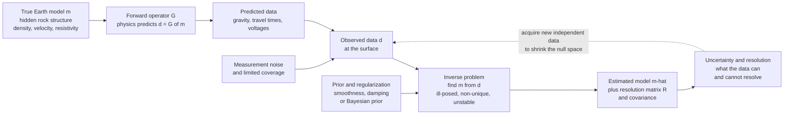

# 🔎 Geophysical Inverse Theory

> [!abstract] TL;DR
> **Geophysical inverse theory is the mathematics of reasoning backward from surface measurements to hidden Earth structure.** The *forward* problem is easy in principle — given a model $\mathbf{m}$ (densities, velocities, resistivities), physics predicts the data $\mathbf{d}=G(\mathbf{m})$. The *inverse* problem — given noisy data, find the model — is hard because it is **ill-posed**: solutions may not exist, are almost never **unique** (the null space of $G$ hides infinitely many models that fit equally well), and are **unstable** (tiny data noise blows up into wild model oscillations because $G$ is ill-conditioned). The cure is **regularization** (Tikhonov damping/smoothing, chosen by the L-curve or discrepancy principle) or a **Bayesian prior**, which trade **resolution against stability**. The enduring geophysical lesson: data underdetermine the Earth, every model embeds prior assumptions, and an honest inversion reports **uncertainty and resolution**, not just a pretty picture.

---

## Intuition

**Analogy:** A **detective never sees the crime happen.** They arrive after the fact and see only the *clues left behind* — a fingerprint, a muddy footprint, a broken window — and must reason **backward** to the cause that produced them. Geophysics is exactly this detective work. We can never cut the planet open; we only measure its *clues at the surface* — the pull of gravity, the travel time of an earthquake wave, a voltage between two electrodes — and must infer the hidden arrangement of rock that produced those readings. The catch that makes it genuinely hard is the same one that frustrates every detective: **many different suspects can leave identical clues.** A small dense body buried shallow and a large dense body buried deep produce the *exact same* gravity reading at the surface. There is no measurement, however precise, that can tell them apart from the surface alone.

Inverse theory is the rigorous framework for doing this backward reasoning **when the answer is fundamentally non-unique**. It does not pretend to conjure the one true culprit from ambiguous evidence. Instead it does something more honest: it tells you the *whole family* of models consistent with the data, quantifies which features are firmly pinned down and which are free to vary, and — crucially — makes explicit the **prior assumptions** (the detective's "the simplest explanation is usually right") that let you pick a single preferred suspect out of the lineup. The output of a good inversion is never just "here is the Earth"; it is "here is a plausible Earth, here is how well each part is resolved, and here is what I had to assume to get it."

---

## How It Works

### Core Mechanics

1. **The forward problem: $\mathbf{d} = G(\mathbf{m})$.** Physics runs *cause to effect*. Given a model vector $\mathbf{m}$ (e.g. density in each cell, seismic slowness on a grid, resistivity vs depth), the governing equations — Newtonian gravity, the wave equation, Maxwell's equations — predict what the instruments *should* read. When the physics is linear (gravity, magnetics, straight-ray tomography) this collapses to a **matrix–vector product** $\mathbf{d}=G\mathbf{m}$; $G$ is the **kernel / sensitivity / design matrix** whose entry $G_{ij}$ says how much data point $i$ responds to a unit change in model parameter $j$.
2. **The inverse problem: find $\mathbf{m}$ from $\mathbf{d}$.** Now run *effect to cause*. This is where **Hadamard's three conditions for well-posedness** all break: a solution may not **exist** (noisy data may lie outside the range of $G$), may not be **unique** (many $\mathbf{m}$ give the same $\mathbf{d}$), and may not be **stable** (a small change in $\mathbf{d}$ causes a huge change in $\mathbf{m}$). Geophysical inverse problems fail all three routinely.
3. **Non-uniqueness and the null space.** Any model component $\mathbf{m}_0$ with $G\mathbf{m}_0=\mathbf{0}$ is **invisible to the data** — you can add any amount of it and the predicted data never change. This *null space* is the mathematical face of "many suspects, same clues," and it is a **hard physical limit**, not a numerical nuisance. No amount of clever computing removes it; only *new, independent data* or *prior assumptions* can.
4. **Instability from ill-conditioning.** Write $G=U\Sigma V^{\!\top}$ (the **SVD**). The inverse divides each data component by a **singular value** $\sigma_i$. Real geophysical kernels are *smoothing* operators, so their singular values **decay toward zero**. Dividing noisy data by a near-zero $\sigma_i$ multiplies that noise by $1/\sigma_i \to \infty$, producing a "solution" that fits the noise perfectly with violent, physically absurd oscillations.
5. **Regularization — the deliberate bias.** Because raw inversion is unusable, we *add prior information* as a penalty and solve $\min_{\mathbf{m}} \lVert G\mathbf{m}-\mathbf{d}\rVert^2 + \lambda^2\lVert L\mathbf{m}\rVert^2$. The **Tikhonov / damped-least-squares** solution is $\mathbf{m}=(G^{\top}G+\lambda^2 L^{\top}L)^{-1}G^{\top}\mathbf{d}$. With $L=I$ this *damps* the model toward zero; with $L$ a discrete derivative it enforces *smoothness*. The knob $\lambda$ trades **data fit against model simplicity** — small $\lambda$ = high resolution but unstable/noisy; large $\lambda$ = stable but blurred/biased. Choose it with the **L-curve** (the corner of the misfit-vs-norm trade-off) or the **discrepancy principle** (fit the data to the noise level, no better).
6. **Report resolution and uncertainty.** The **resolution matrix** $R=(G^{\top}G+\lambda^2 L^{\top}L)^{-1}G^{\top}G$ maps the true model to the recovered one: $\mathbf{m}_{\text{est}}=R\,\mathbf{m}_{\text{true}}$. If $R=I$ every parameter is perfectly resolved; in reality its rows are **blur kernels** showing how each estimate is a smeared average of the truth. The **model covariance** propagates data noise into parameter error bars. A model without these is a picture without a caption.
7. **Nonlinear and Bayesian generalizations.** When $G$ depends on $\mathbf{m}$ (ray bending, electromagnetic sounding, full-waveform inversion), linearize repeatedly — **Gauss–Newton / Levenberg–Marquardt** iterations, or **adjoint/gradient** methods for huge problems — while dodging **local minima**. The **Bayesian** view unifies everything: combine a **prior** $p(\mathbf{m})$ with a **likelihood** $p(\mathbf{d}\mid\mathbf{m})$ to get the **posterior** $p(\mathbf{m}\mid\mathbf{d})\propto p(\mathbf{d}\mid\mathbf{m})\,p(\mathbf{m})$. The **MAP** estimate coincides with Tikhonov (Gaussian prior = smoothing penalty), and **MCMC sampling** maps the *full posterior* to quantify uncertainty rather than reporting a single model.

### Flow / Architecture



---

## Key Concepts

**Secondary (intuition level).** You can weigh a wrapped present and shake it, but you cannot see inside. From the outside clues you *guess* what is in the box — and several different toys might feel exactly the same. Geophysicists have the same problem with the Earth: they measure gravity, wave arrival times, and electric signals at the surface and must guess the rock hidden below, even though **many different underground arrangements give the same surface reading**. A single guess would be dishonest, so the method instead finds the *simplest* arrangement that matches the clues, and clearly states which parts of the guess are trustworthy and which are just filler. "Simplest" is a *choice we impose*, not something the data prove — that is the deep idea of inverse theory.

**Undergraduate (working level).** A linear inverse problem is $\mathbf{d}=G\mathbf{m}+\text{noise}$, solved by **least squares** $\mathbf{m}=(G^{\top}G)^{-1}G^{\top}\mathbf{d}$ when $G^{\top}G$ is invertible — but for real kernels it is **rank-deficient or ill-conditioned**, so this blows up. The **SVD** $G=U\Sigma V^{\!\top}$ diagnoses exactly why: right-singular vectors with $\sigma_i=0$ span the **null space** (unresolvable model directions), and vectors with tiny $\sigma_i$ are the **noise amplifiers**. **Tikhonov regularization** replaces $1/\sigma_i$ with the **filter factor** $\sigma_i/(\sigma_i^2+\lambda^2)$, which smoothly damps the small-$\sigma$ directions to zero instead of exploding — this is the SVD-domain meaning of "$\min\lVert G\mathbf{m}-\mathbf{d}\rVert^2+\lambda^2\lVert\mathbf{m}\rVert^2$." Pick $\lambda$ with the **L-curve** (log model-norm vs log data-misfit forms an "L"; sit at the corner) or the **discrepancy principle** (choose $\lambda$ so the misfit equals the known noise level $\sim\sqrt{N}\sigma$). Read off the **resolution matrix** $R$ to see how blurred each parameter is, and the **covariance** for its error bar. This is *exactly ridge regression* / Bias–Variance under a different name: damping adds bias to kill variance.

**Graduate (rigorous level).** Cast the problem probabilistically (Tarantola): with Gaussian data errors of covariance $C_D$ and a Gaussian prior of mean $\mathbf{m}_0$ and covariance $C_M$, the **posterior** is Gaussian with mean $\hat{\mathbf{m}}=\mathbf{m}_0+(G^{\top}C_D^{-1}G+C_M^{-1})^{-1}G^{\top}C_D^{-1}(\mathbf{d}-G\mathbf{m}_0)$ and covariance $\hat{C}_M=(G^{\top}C_D^{-1}G+C_M^{-1})^{-1}$ — Tikhonov is the special case $C_D=\sigma^2 I$, $C_M=(\sigma^2/\lambda^2)I$, and **MAP = penalized least squares**. For **nonlinear** problems $\mathbf{d}=g(\mathbf{m})$, iterate $\mathbf{m}_{k+1}=\mathbf{m}_k+(J_k^{\top}C_D^{-1}J_k+\mu I+C_M^{-1})^{-1}J_k^{\top}C_D^{-1}(\mathbf{d}-g(\mathbf{m}_k))$ where $J_k=\partial g/\partial\mathbf{m}$ is the **Jacobian/Fréchet derivative**; the $\mu I$ term is **Levenberg–Marquardt** damping interpolating between Gauss–Newton and steepest descent. For millions of parameters (full-waveform inversion) one never forms $J$: the **adjoint method** computes $J^{\top}\mathbf{r}$ with one forward and one back-propagated (adjoint) simulation, feeding **conjugate-gradient / L-BFGS** descent. The **resolution operator** $R=(J^{\top}C_D^{-1}J+C_M^{-1})^{-1}J^{\top}C_D^{-1}J$ and **posterior covariance** quantify what is constrained; **Backus–Gilbert** theory instead builds *averaging kernels* that trade spread against variance directly. When the posterior is non-Gaussian or multimodal (nonlinear, non-unique), **MCMC** (Metropolis–Hastings, Hamiltonian Monte Carlo, reversible-jump for unknown parameterization) samples $p(\mathbf{m}\mid\mathbf{d})$ to report *distributions and credible intervals* — the gold standard for honest **uncertainty quantification**.

---

## Python Demo

```python
# The ill-posed linear inverse problem and its cure by Tikhonov regularization.
# (a) Build a small tomography-style kernel matrix d = G @ m (each measurement is
#     a smooth, overlapping "ray sensitivity" average of the model). Plant a TRUE
#     model, synthesize data, add a WHIFF of noise. Show the naive least-squares
#     inverse is UNSTABLE (wild oscillations) because G is ill-conditioned -- its
#     singular values decay toward zero.
# (b) Apply Tikhonov  m = (G^T G + lam^2 I)^-1 G^T d  over a sweep of lam, draw
#     the L-CURVE (model norm vs data misfit), pick lam at its corner, and show
#     the recovered SMOOTH model beside the unstable one -- the resolution-vs-
#     stability (bias-variance) trade-off made visible.
import numpy as np
import matplotlib.pyplot as plt

rng = np.random.default_rng(1)

# --- Grid + smooth "ray-kernel" forward operator G (a first-kind integral) ---
n = 50                                   # unknown model parameters on a grid
x = np.linspace(0.0, 1.0, n)             # model coordinate
dx = x[1] - x[0]
w = 0.06                                 # kernel width -> strong smoothing
# G_ij = exp(-((x_i - x_j)^2)/(2 w^2)) * dx : each datum is a Gaussian-weighted
# average of the model. Smoothing forward map => UN-smoothing inverse => unstable.
Xi, Xj = np.meshgrid(x, x, indexing="ij")
G = np.exp(-((Xi - Xj) ** 2) / (2 * w ** 2)) * dx     # (n x n), symmetric

# --- TRUE model: two Gaussian bumps + a sharp box (features that stress it) ---
m_true = (np.exp(-((x - 0.30) ** 2) / (2 * 0.03 ** 2))
          + 0.8 * np.exp(-((x - 0.62) ** 2) / (2 * 0.02 ** 2)))
m_true += 0.6 * ((x > 0.80) & (x < 0.90))            # a step (hard to recover)

# --- Synthetic data with only 0.1% noise (that is all it takes) ---------------
d_clean = G @ m_true
sigma = 1e-3 * np.max(np.abs(d_clean))
d = d_clean + sigma * rng.standard_normal(n)

# --- Singular-value spectrum: the fingerprint of ill-posedness ----------------
U, sv, Vt = np.linalg.svd(G)
cond = sv[0] / sv[-1]
print(f"condition number of G = {cond:.2e}   (huge => ill-posed)")

# --- (a) NAIVE inverse: plain least squares / direct solve => UNSTABLE ---------
m_naive = np.linalg.solve(G, d)          # divides by near-zero singular values
print(f"naive solution amplitude   = {np.max(np.abs(m_naive)):.2e}  (should be ~1)")

# --- (b) TIKHONOV over a sweep of lambda, tracing the L-curve ------------------
def tikhonov(lam):
    A = G.T @ G + (lam ** 2) * np.eye(n)
    return np.linalg.solve(A, G.T @ d)

lams = np.logspace(-6, 0, 60)
misfit = np.array([np.linalg.norm(G @ tikhonov(l) - d) for l in lams])  # data fit
mnorm  = np.array([np.linalg.norm(tikhonov(l))          for l in lams]) # model norm

# Pick lambda at the L-curve CORNER = maximum curvature in log-log space
lx, ly = np.log(misfit), np.log(mnorm)
dx1, dy1 = np.gradient(lx), np.gradient(ly)
dx2, dy2 = np.gradient(dx1), np.gradient(dy1)
curv = np.abs(dx1 * dy2 - dy1 * dx2) / (dx1 ** 2 + dy1 ** 2) ** 1.5
k = np.argmax(curv)
lam_opt = lams[k]
m_reg = tikhonov(lam_opt)
print(f"L-curve corner lambda      = {lam_opt:.2e}")
print(f"regularized model error    = {np.linalg.norm(m_reg - m_true):.3f}")
print(f"naive       model error    = {np.linalg.norm(m_naive - m_true):.3e}")

# --- Plot: SVD spectrum | L-curve | naive (unstable) | regularized (smooth) ---
fig, ax = plt.subplots(2, 2, figsize=(12, 9))

ax[0, 0].semilogy(sv, "o-", ms=3)
ax[0, 0].axhline(sigma, color="r", ls="--", lw=1, label="noise floor")
ax[0, 0].set_title("(a) Singular values of G decay to ~0\n=> ill-conditioned, noise blows up")
ax[0, 0].set_xlabel("index i"); ax[0, 0].set_ylabel("singular value $\\sigma_i$")
ax[0, 0].legend()

ax[0, 1].loglog(misfit, mnorm, "-", color="0.4")
ax[0, 1].loglog(misfit[k], mnorm[k], "ro", ms=9, label=f"corner $\\lambda$={lam_opt:.1e}")
ax[0, 1].set_title("(b) L-curve: pick $\\lambda$ at the corner\n(balance misfit vs model norm)")
ax[0, 1].set_xlabel("data misfit  $\\||Gm-d\\||$")
ax[0, 1].set_ylabel("model norm  $\\||m\\||$"); ax[0, 1].legend()

ax[1, 0].plot(x, m_true, "k-", lw=2, label="true")
ax[1, 0].plot(x, m_naive, "r-", lw=1, label="naive inverse")
ax[1, 0].set_title("(c) NAIVE inverse is UNSTABLE\n(fits the noise, wild oscillations)")
ax[1, 0].set_xlabel("x"); ax[1, 0].set_ylabel("model m"); ax[1, 0].legend()

ax[1, 1].plot(x, m_true, "k-", lw=2, label="true")
ax[1, 1].plot(x, m_reg, "b-", lw=2, label=f"Tikhonov ($\\lambda$={lam_opt:.1e})")
ax[1, 1].set_title("(d) REGULARIZED recovery is stable & smooth\n(biased: sharp box is blurred)")
ax[1, 1].set_xlabel("x"); ax[1, 1].set_ylabel("model m"); ax[1, 1].legend()

plt.tight_layout()
plt.savefig("geophysical_inverse_theory.png", dpi=130)
print("\nSaved geophysical_inverse_theory.png")
```

Running this prints a **condition number of order $10^{18}$** and a naive-solution amplitude of order $10^{13}$ — a "recovered" model billions of times larger than the true one, pure amplified noise. The four panels tell the whole story: **(a)** the singular values of $G$ plunge below the noise floor, so the naive inverse divides by near-zero and explodes; **(b)** the **L-curve** bends sharply, and its corner marks the $\lambda$ that best balances fitting the data against keeping the model sane; **(c)** the **naive** reconstruction is a useless storm of oscillations; and **(d)** the **Tikhonov** reconstruction is stable and recovers both bumps faithfully — but *deliberately blurs* the sharp box, the visible signature of the **resolution-vs-stability / bias–variance** trade-off you buy with every regularization parameter.

---

## Real-World Applications

- **Seismic tomography.** Millions of travel-time residuals build a huge sparse ray-path matrix $G$; damped, smoothed least squares (LSQR/CG) reconstructs 3-D mantle velocity — cold slabs, hot plumes, the LLSVPs. Resolution is checked with checkerboard tests and the resolution matrix.
- **Potential-field (gravity & magnetic) inversion.** The archetypal non-unique problem: infinitely many subsurface density/susceptibility distributions match the same surface anomaly. Depth weighting, smoothness, and sparsity/compactness priors are *essential* to pin a geologically plausible body.
- **EM and DC-resistivity sounding.** Inverting apparent resistivity vs frequency/offset for a layered or 2-D/3-D conductivity model is strongly nonlinear; Occam's inversion (smoothest model fitting the data to the noise level) is the field standard for groundwater, geothermal, and mineral exploration.
- **Full-waveform inversion (FWI).** The frontier of exploration and global seismology: fit the *entire* seismogram by adjoint-gradient descent over millions of parameters. Ferociously ill-posed and nonlinear (cycle-skipping local minima), demanding multiscale strategies, strong regularization, and supercomputers.
- **Geodesy and InSAR/GPS.** Inverting surface deformation for fault slip or magma-chamber volume change — a linear (Green's-function) inverse problem regularized by slip smoothness, used routinely after earthquakes and during volcanic unrest.
- **Cross-disciplinary kin.** The identical skeleton ($\mathbf{d}=G\mathbf{m}$ + regularized/Bayesian inversion) powers medical **CT/MRI reconstruction**, radio-astronomy **image deconvolution**, and machine-learning **ridge/Bayesian regression** — geophysics is one dialect of a universal language.

---

## Common Pitfalls

- **Treating ill-posedness as a bug to be coded around.** Non-uniqueness and the **null space** are *physical* facts — many Earths produce the same data. No solver removes them; only new independent data or explicit priors can. Chasing a "perfect fit" just fits the noise.
- **Forgetting the null space when interpreting.** Structure sitting in the null space of $G$ is *invisible to the data*. If your model shows a feature there, it came from your regularizer, not from the Earth. Always ask: could the data even *see* this?
- **Overfitting vs oversmoothing.** Too little regularization reproduces noise as spurious high-amplitude structure (high variance); too much erases real anomalies and biases amplitudes low (high bias). Neither extreme is "the answer" — the honest model lives at the trade-off, deliberately chosen.
- **Picking $\lambda$ by eye.** Choose the regularization parameter with a principled rule — the **L-curve corner**, the **discrepancy principle** (fit the data to the known noise level, not better), or **cross-validation** — and *report the choice and its sensitivity*. A model is meaningless without stating how hard it was pushed to fit.
- **Publishing a model without a resolution matrix.** Different parameters are constrained very differently. Without the **resolution** and **covariance** matrices (or checkerboard/spike tests), readers cannot tell imaged rock from regularizer-filled blur. The caption is as important as the picture.
- **Linearizing a nonlinear problem once.** Gravity and straight-ray tomography are linear; EM sounding, ray-bending tomography, and FWI are not. A single Gauss–Newton step from a poor starting model can land in a **local minimum**; use multiscale continuation, good priors, and check convergence.
- **Confusing deterministic and Bayesian answers.** Tikhonov gives *one* model (the MAP under a Gaussian prior). It is *not* "the truth" and carries no error bars by itself. If you need honest **uncertainty**, sample the posterior (MCMC) or at least propagate the covariance — a single image hides the family of Earths the data allow.
- **Believing the model is the Earth.** The deepest pitfall. An inversion returns *a model consistent with the data and your priors*, not reality. State the assumptions, the resolution, and the uncertainty — every time.

---

## Related Concepts

- [[Singular_Value_Decomposition]] — the master tool of inverse theory: singular values expose ill-conditioning, small $\sigma_i$ are noise amplifiers, zero $\sigma_i$ span the null space, and the SVD defines the generalized (pseudo-)inverse.
- [[Systems_of_Linear_Equations]] — a linear inverse problem *is* the (rank-deficient, over/under-determined) system $\mathbf{d}=G\mathbf{m}$; inverse theory is the study of what to do when it has no exact or unique solution.
- [[Eigenvalues_and_Eigenvectors]] — the normal-equation matrix $G^{\top}G$ has eigenvalues $\sigma_i^2$; its near-zero eigenvalues are precisely the unstable, poorly-constrained model directions regularization must tame.
- [[Regularization_as_Optimization]] — Tikhonov damping/smoothing recast as adding a penalty to the least-squares objective; the optimization-theoretic backbone of stable inversion.
- [[Gradient_Descent]] — for huge nonlinear inversions (FWI) the model is updated by descent on the misfit, with the gradient supplied cheaply by the adjoint method.
- [[Conjugate_Gradient]] — the workhorse iterative solver (as LSQR/CGLS) for the enormous sparse systems of tomography and FWI, never forming $G^{-1}$.
- [[Newtons_Method]] — nonlinear inversion iterates Gauss–Newton / Levenberg–Marquardt steps, a damped Newton method on the data-misfit functional.
- [[Regularization]] — the machine-learning face of the same idea: ridge = damping, priors = smoothing, all fighting the identical overfitting/instability problem.
- [[Bias_Variance_Tradeoff]] — the resolution-vs-stability knob $\lambda$ is exactly bias vs variance: too little regularization = high variance, too much = high bias.
- [[Bayesian_Statistics]] — the unifying framework: prior + likelihood $\to$ posterior; MAP recovers Tikhonov, and the posterior delivers honest uncertainty.
- [[Regression_and_Correlation]] — linear inversion is weighted least-squares regression with a physics-defined design matrix $G$; Tikhonov is ridge regression.
- [[Statistical_Inference]] — resolution, covariance, confidence/credible intervals, and hypothesis testing are how inversion reports what the data actually constrain.
- [[The_Metropolis_Algorithm_and_MCMC]] — Markov-chain Monte Carlo samples the full (possibly multimodal) posterior for rigorous uncertainty quantification when a single model is not enough.

*Sibling notes in this Geophysics "Methods & Frontiers" section (build these next): **Geophysical_Signal_and_Data_Processing** supplies the deconvolution, filtering, and noise characterization that condition the data $\mathbf{d}$ and its covariance before inversion; **Computational_Geophysics_and_Simulation** provides the numerical forward solvers (finite-difference/element, spectral-element) that evaluate $G(\mathbf{m})$ and its adjoint; **Machine_Learning_in_Geophysics** offers data-driven surrogates, learned priors, and neural inversion as a modern complement to Tikhonov and Bayesian methods; **Seismic_Tomography_and_Earth_Imaging** is the flagship large-scale application of everything here; and **Exploration_Geophysics_Overview** is where potential-field, EM, and seismic inversions earn their commercial keep.*

---

## Review Questions

1. **(Secondary)** A geophysicist measures the pull of gravity at the surface and wants to know what dense rock lies below. Explain, using the detective analogy, why a single gravity survey can never give a unique answer — and name one thing (besides more math) that could narrow down the possibilities.
2. **(Undergraduate)** Given $\mathbf{d}=G\mathbf{m}$ with $G=U\Sigma V^{\!\top}$, show how the naive least-squares solution amplifies noise through the small singular values, and how the Tikhonov filter factor $\sigma_i/(\sigma_i^2+\lambda^2)$ fixes it. Sketch the L-curve and explain what its two axes are and why you choose $\lambda$ at the corner rather than at either end.
3. **(Graduate)** You run a nonlinear resistivity inversion and obtain a smooth conductivity model that fits the data. A colleague runs the *same* data with a sparsity (blocky) prior and gets a sharply layered model that fits equally well. (a) Which is "correct," and how does the null space / non-uniqueness make that question ill-formed? (b) Design a quantitative program — using the resolution matrix, the model covariance, and MCMC posterior sampling — to report *what the data actually constrain* rather than defending one preferred image. (c) At what computational cost, and how would a Bayesian framing make the role of each prior explicit?

---

## Sources

- Menke, W. — *Geophysical Data Analysis: Discrete Inverse Theory* (4th ed., Academic Press, 2018). The canonical textbook; SVD, resolution/covariance, and the generalized inverse.
- Aster, R. C., Borchers, B. & Thurber, C. H. — *Parameter Estimation and Inverse Problems* (3rd ed., Elsevier, 2018). Modern, computational, superb on Tikhonov, the L-curve, and nonlinear methods.
- Tarantola, A. — *Inverse Problem Theory and Methods for Model Parameter Estimation* (SIAM, 2005). The definitive Bayesian/probabilistic treatment.
- Parker, R. L. — *Geophysical Inverse Theory* (Princeton University Press, 1994). Rigorous functional-analysis foundations and existence/uniqueness.
- Hansen, P. C. — *Rank-Deficient and Discrete Ill-Posed Problems* (SIAM, 1998). The definitive reference on the SVD analysis of ill-posedness and the L-curve.

---

#geophysics #inverse-theory #ill-posed-problems #regularization #tomography
