# 📡 Geophysical Signal and Data Processing

> [!abstract] TL;DR
> **Geophysical signal processing** is the essential step *between* raw field measurements and interpretation: it extracts weak, buried signals from overwhelming noise across every method — seismic, gravity, magnetic, EM, and GPR. It rests on a small set of ideas: **digital sampling** (and the **Nyquist limit** that governs **aliasing**, in *both* time and space); the **Fourier / spectral view** (amplitude and phase spectra, the **f-k** frequency–wavenumber domain); **filtering** (low/high/band-pass and **notch**, built on the **convolution theorem**, with **zero-phase** vs **minimum-phase** choices and their **ringing** and phase-distortion costs); **stacking**, the workhorse where coherent signal adds while random noise cancels as $\sqrt{N}$; the **convolutional model** ($\text{trace} = w * r + n$) inverted by **deconvolution** to compress the wavelet and boost resolution; **correlation and matched filters** (vibroseis sweep correlation, ambient-noise cross-correlation to recover Green's functions); and **time-frequency** analysis (STFT / spectrograms and **wavelets**) for non-stationary signals. Processing choices — filters, mutes, gains, deconvolution — *shape what the interpreter sees*: done well they reveal structure, done badly they manufacture artifacts. **Garbage in, garbage out; good processing is half of geophysics.**

---

## Intuition

**Analogy:** A faint radio station buried in static can still be tuned in — if you know its frequency, you filter out the hiss and the music emerges. Geophysical signals are the same. A real seismic echo off a buried oil reservoir, or a subtle magnetic anomaly over a mineral body, is almost always **drowned in noise** — passing traffic, wind shaking the geophones, ocean waves thumping the seafloor, slow instrument drift. **Signal processing is the art of pulling the whispered signal out of the roar**: stacking repeated shots so the coherent echo survives while the random hiss cancels, filtering out the frequency bands where only noise lives, and sharpening blurred data before anyone dares to interpret it.

The deep point is that **the Earth never hands you the answer directly** — it hands you a wavefield smeared by the source, the instrument, and the environment. Processing is the pre-condition for *everything* downstream: pick the wrong filter or over-drive a deconvolution and you will interpret an artifact as a fault. Get it right and hidden structure snaps into focus.

---

## How It Works

### Core Mechanics

1. **Digitize and sample.** A continuous ground motion or field reading is measured at discrete instants spaced by the **sampling interval** $\Delta t$ (and, across a receiver line, at discrete positions spaced by $\Delta x$). Sampling rate $f_s = 1/\Delta t$.
2. **Respect Nyquist.** The **sampling theorem** says a signal is fully recoverable only if it contains no energy above the **Nyquist frequency** $f_N = f_s/2$. Energy above $f_N$ does not vanish — it **aliases**, folding down and masquerading as a lower frequency. The spatial analogue uses **wavenumber** $k$: too-coarse geophone spacing aliases steep dips. Cure: an **anti-alias filter** *before* digitizing, and adequate spatial sampling.
3. **Go to the frequency domain.** The **Fourier transform** (computed by the **FFT**) decomposes a trace into an **amplitude spectrum** (how much energy at each frequency) and a **phase spectrum** (the timing/alignment). For a whole array you 2-D transform time *and* space into the **f-k domain**, where different wave types (reflections, ground-roll, refractions) separate by their **apparent velocity** = slope in f-k.
4. **Filter.** Because the Fourier basis diagonalizes convolution (**convolution theorem**: convolution in time = multiplication in frequency), a filter is just a **weighting of the spectrum**: keep the passband, zero the stopband, then inverse-transform. **Low-pass / high-pass / band-pass** shape the frequency content; a **notch** surgically removes a single tone (50/60 Hz powerline); **f-k filtering** rejects a whole dip fan (e.g. ground-roll) that overlaps the signal in frequency but not in wavenumber.
5. **Choose the filter's phase.** A **zero-phase** filter is symmetric and does not shift event times — ideal for interpretation. A **minimum-phase** filter is causal and concentrates energy at its front — the natural model for physical sources. Sharp-edged filters **ring** (Gibbs oscillation); taper the edges to trade a little resolution for far less ringing.
6. **Stack.** Record the *same* event many times and average. The coherent signal is identical in every repeat and adds linearly ($N$ copies → $N \times$ amplitude); zero-mean random noise adds *incoherently* (amplitude grows only as $\sqrt{N}$). The **amplitude signal-to-noise ratio improves as $\sqrt{N}$**. This is **CMP stacking**, **signal averaging**, and array **beamforming**, all in one idea.
7. **Deconvolve.** Model a trace as the **convolutional model**: $\text{trace}(t) = w(t) * r(t) + n(t)$, source wavelet $w$ convolved with the Earth's **reflectivity** $r$ plus noise. **Deconvolution** estimates and removes $w$ to *compress* the wavelet and sharpen resolution; **predictive deconvolution** removes periodic **multiples**. It is an **inverse problem** — dividing by the wavelet's spectrum blows up wherever that spectrum is small, so it must be stabilized.
8. **Correlate.** A **vibroseis** source emits a long **sweep**, not an impulse; **cross-correlating** the record with the known sweep (a **matched filter**) collapses it to a sharp wavelet and maximizes SNR. **Ambient-noise cross-correlation** between two stations converges to the **Green's function** between them — turning background hum into a virtual source.
9. **Handle non-stationary signals.** When frequency content *changes with time* (dispersing surface waves, volcanic tremor), a single spectrum is inadequate. The **short-time Fourier transform (STFT / spectrogram)** and the **wavelet transform** give a joint **time–frequency** picture at a controllable resolution trade-off.

### Flow / Architecture

```mermaid
graph LR
    RAW["Raw field record<br/>weak signal buried in noise<br/>traffic wind drift ocean waves"] --> SAMP["Digitize and sample<br/>discretize in time and space<br/>honour the Nyquist limit"]
    SAMP --> SPEC["Spectral analysis<br/>FFT to amplitude and phase<br/>f-k domain for arrays"]
    SPEC --> FILT["Filtering<br/>band-pass notch f-k<br/>reject the wrong frequencies"]
    FILT --> STK["Stacking<br/>sum coherent repeats<br/>random noise cancels as root N"]
    STK --> DECON["Deconvolution<br/>compress the source wavelet<br/>sharpen the reflectivity"]
    DECON --> CLEAN["Clean signal<br/>high signal-to-noise<br/>artifact aware"]
    CLEAN --> INTERP["Ready for inversion<br/>and interpretation"]
    style RAW fill:#dc2626,color:#fff
    style SAMP fill:#2563eb,color:#fff
    style SPEC fill:#7c3aed,color:#fff
    style FILT fill:#7c3aed,color:#fff
    style STK fill:#b45309,color:#fff
    style DECON fill:#0891b2,color:#fff
    style CLEAN fill:#059669,color:#fff
    style INTERP fill:#059669,color:#fff
```



---

## Key Concepts

### Secondary Level

- **Signal vs noise.** The thing you want (an echo, an anomaly) is usually *quieter* than the things you do not want (wind, traffic, waves). Processing separates them.
- **Averaging helps.** Record the same thing many times and average: the real signal is always the same and survives, the random noise is different each time and cancels out. More repeats → cleaner result.
- **Filtering by pitch.** Just as an equaliser turns down the bass or treble, a filter keeps the frequencies where the signal lives and throws away those that are only noise — like a 50 Hz mains hum.
- **Sample often enough.** If you measure too rarely you miss the fast wiggles and can be badly fooled (a spinning wheel looking still in a video). There is a minimum sampling rate.
- **Processing shapes the picture.** How you clean the data changes what you "see" — so it must be done honestly.

### Undergraduate Level

- **Sampling theorem and aliasing.** $f_s > 2 f_{\max}$ to avoid **aliasing**; above **Nyquist** $f_N = f_s/2$, energy folds back to false low frequencies. Spatial version in **wavenumber** $k$: $\Delta x$ sets a spatial Nyquist and aliases steep dips.
- **DFT / FFT and the two spectra.** The **amplitude spectrum** shows energy per frequency; the **phase spectrum** shows alignment. Both are needed — phase carries the waveform shape.
- **Convolution theorem.** Filtering = multiply spectrum by the filter's **transfer function**, then inverse-transform. Linear time-invariant systems are fully described by their **impulse response**.
- **Filter types and phase.** Low/high/band-pass/notch; **zero-phase** (no time shift, symmetric) vs **minimum-phase** (causal). Sharp cutoffs cause **ringing**; tapers reduce it.
- **Stacking gain.** Amplitude SNR $\propto \sqrt{N}$ for coherent signal + independent zero-mean noise. Basis of **CMP stacking** and array **beamforming**.
- **Convolutional model.** $\text{trace} = \text{wavelet} * \text{reflectivity} + \text{noise}$; deconvolution inverts the wavelet.

### Graduate Level

- **f-k and $\tau$-p filtering.** Multichannel data live in **frequency–wavenumber** space; events map to lines/curves by apparent velocity, enabling **dip filtering** to strip ground-roll and coherent noise without harming reflections. Related **Radon / slant-stack** ($\tau$-p) transforms separate events by slowness.
- **Deconvolution as an inverse problem.** Spectral division $\hat r = \text{trace}/\hat w$ is **ill-posed** — small values of $\hat w(f)$ amplify noise. **Wiener/least-squares** deconvolution adds a **white-noise (prewhitening) term** $\varepsilon$: $\hat r = \dfrac{\overline{\hat w}\,\text{trace}}{|\hat w|^2 + \varepsilon}$. **Predictive deconvolution** models multiples via prediction lag. This is the same regularization logic that governs geophysical inverse theory.
- **Minimum-phase and the wavelet.** Under a minimum-phase assumption the wavelet is recoverable from its amplitude spectrum alone (Kolmogorov relation), which underlies **spiking (Wiener) deconvolution**.
- **Windowing and spectral leakage.** Finite records = multiplication by a rectangular window = convolution with a **sinc** in frequency → **leakage** and sidelobes. **Tapers** (Hann, Hamming, Tukey, DPSS/multitaper) trade main-lobe width against sidelobe suppression.
- **Matched filtering and correlation.** The **matched filter** maximizes SNR for a known waveform in white noise — **vibroseis** sweep correlation, **seismic interferometry** (ambient-noise cross-correlation → empirical Green's functions).
- **Time-frequency and non-stationarity.** STFT trades time vs frequency resolution by window length (Heisenberg-type bound); the **continuous wavelet transform** gives multi-resolution analysis — fine time at high frequency, fine frequency at low — apt for **dispersion** and **tremor**.
- **Potential fields as filters.** In the wavenumber domain, **upward continuation** multiplies the field's spectrum by $e^{-|k| \Delta z}$ (a smooth low-pass that suppresses shallow/short-wavelength sources); **derivatives** and **reduction-to-pole** are likewise spectral operators — the same DSP applies far beyond seismology.

---

## Python Demo

```python
# Geophysical signal processing: pulling a whisper out of the roar.
# (A) STACKING  -> coherent signal adds, random noise cancels as sqrt(N)
# (B) SPECTRAL FILTERING -> notch/high-pass in the frequency domain to
#     kill 50 Hz powerline hum and slow instrument drift, then recover.
# Requires only numpy + matplotlib.
import numpy as np
import matplotlib.pyplot as plt

rng = np.random.default_rng(42)

fs = 500.0                       # sampling rate (Hz)  -> Nyquist = 250 Hz
t  = np.arange(0.0, 1.0, 1.0 / fs)
nt = t.size

def ricker(t, t0, f):
    """Ricker (Mexican-hat) wavelet centered at t0 with peak frequency f."""
    a = (np.pi * f * (t - t0)) ** 2
    return (1.0 - 2.0 * a) * np.exp(-a)

# ------------------------------------------------------------------
# (A) STACKING: same weak wavelet repeated in N traces, buried in noise
# ------------------------------------------------------------------
clean_sig = ricker(t, 0.40, 25.0)     # the TRUE coherent signal (same each trace)
noise_amp = 3.0                       # noise >> signal (peak signal ~ 1.0)

Ns = np.array([1, 2, 4, 8, 16, 32, 64, 128, 256])
amp_gain = []
for N in Ns:
    traces  = clean_sig[None, :] + noise_amp * rng.standard_normal((N, nt))
    stacked = traces.mean(axis=0)             # stack = average the repeats
    resid   = stacked - clean_sig             # what noise survives the stack
    snr_pow = np.max(np.abs(clean_sig))**2 / np.mean(resid**2)  # power SNR
    amp_gain.append(np.sqrt(snr_pow))
amp_gain = np.array(amp_gain)
amp_gain /= amp_gain[0]                        # gain relative to a single trace

print("Stacking: amplitude-SNR gain should track sqrt(N)")
for N, g in zip(Ns, amp_gain):
    print(f"  N={N:4d}   measured gain={g:6.2f}   sqrt(N)={np.sqrt(N):6.2f}")

one_trace = clean_sig + noise_amp * rng.standard_normal(nt)          # 1 raw trace
stack_big = (clean_sig[None, :]
             + noise_amp * rng.standard_normal((256, nt))).mean(0)   # 256-fold stack

# ------------------------------------------------------------------
# (B) SPECTRAL FILTERING: broadband signal + 50 Hz hum + low-freq drift
# ------------------------------------------------------------------
sig       = ricker(t, 0.30, 30.0) + 0.7 * ricker(t, 0.65, 18.0)  # clean broadband
powerline = 1.2 * np.sin(2 * np.pi * 50.0 * t)                    # narrow-band hum
drift     = 0.8 * np.sin(2 * np.pi * 1.5 * t)                     # slow drift
dirty     = sig + powerline + drift

freqs = np.fft.rfftfreq(nt, d=1.0 / fs)
S     = np.fft.rfft(dirty)

H = np.ones_like(freqs)                 # design the filter in the frequency domain
H[freqs < 3.0] = 0.0                    # high-pass: remove < 3 Hz drift
H[np.abs(freqs - 50.0) < 2.0] = 0.0     # notch: remove 50 +/- 2 Hz powerline
recovered = np.fft.irfft(S * H, n=nt)   # inverse FFT -> filtered time series

# ------------------------------------------------------------------
# Plots: stacking curve, stacked wavelet, filtered trace, spectra
# ------------------------------------------------------------------
fig, ax = plt.subplots(2, 2, figsize=(12, 8))

ax[0, 0].loglog(Ns, amp_gain, "o-", label="measured gain")
ax[0, 0].loglog(Ns, np.sqrt(Ns), "k--", label=r"$\sqrt{N}$ theory")
ax[0, 0].set_xlabel("number of traces stacked N")
ax[0, 0].set_ylabel("amplitude SNR gain")
ax[0, 0].set_title("(A) Stacking gain follows sqrt(N)")
ax[0, 0].legend(); ax[0, 0].grid(True, which="both", alpha=0.3)

ax[0, 1].plot(t, one_trace, color="0.7", lw=0.8, label="1 raw trace")
ax[0, 1].plot(t, stack_big, "b", lw=1.3, label="256-fold stack")
ax[0, 1].plot(t, clean_sig, "r--", lw=1.2, label="true signal")
ax[0, 1].set_xlabel("time (s)"); ax[0, 1].set_ylabel("amplitude")
ax[0, 1].set_title("Wavelet emerges from noise after stacking")
ax[0, 1].legend()

ax[1, 0].plot(t, dirty, color="0.7", lw=0.9, label="dirty (hum + drift)")
ax[1, 0].plot(t, recovered, "g", lw=1.2, label="filtered")
ax[1, 0].plot(t, sig, "r--", lw=1.0, label="true clean")
ax[1, 0].set_xlabel("time (s)"); ax[1, 0].set_ylabel("amplitude")
ax[1, 0].set_title("(B) Notch + high-pass recover the signal")
ax[1, 0].legend()

ax[1, 1].plot(freqs, np.abs(S), color="0.6", lw=1.0, label="before")
ax[1, 1].plot(freqs, np.abs(S * H), "g", lw=1.2, label="after")
ax[1, 1].axvline(50.0, color="r", ls=":", lw=1.0, label="50 Hz notch")
ax[1, 1].set_xlim(0, 120)
ax[1, 1].set_xlabel("frequency (Hz)"); ax[1, 1].set_ylabel("|amplitude|")
ax[1, 1].set_title("Amplitude spectrum before / after")
ax[1, 1].legend()

plt.tight_layout()
plt.show()
```

**What it shows.** Part (A) confirms the central law of stacking: averaging $N$ noisy repeats improves amplitude SNR as $\sqrt{N}$ (128-fold stacking buys ~11× cleaner amplitude), and the wavelet that was invisible in a single trace stands out cleanly in the stack. Part (B) demonstrates frequency-domain surgery: the raw spectrum shows a sharp spike at 50 Hz (powerline) and a low-frequency lump (drift); zeroing those bands and inverse-transforming restores a trace that closely matches the true clean signal. Together they are the two pillars of geophysical noise suppression.

---

## Real-World Applications

- **Seismic reflection processing.** The entire industry pipeline — anti-alias filtering, gain recovery, deconvolution, CMP **stacking**, band-pass and f-k filtering to strip ground-roll, then migration — turns raw field shots into interpretable images of oil, gas, and CO$_2$ storage reservoirs.
- **Vibroseis surveys.** Land seismic sources emit a long frequency **sweep**; **cross-correlation** with the pilot sweep (a matched filter) compresses it to a usable wavelet, spreading source energy in time to protect equipment and boost SNR.
- **Ambient-noise interferometry.** Cross-correlating months of background seismic hum between station pairs recovers the **Green's function** between them, enabling passive **surface-wave tomography** of the crust — no earthquakes or explosions required.
- **Potential-field processing.** Gravity and magnetic maps are cleaned and enhanced with wavenumber-domain operators: **upward continuation** (a low-pass that emphasizes deep sources), vertical/horizontal derivatives (edge detection), and reduction-to-pole — the same DSP applied to static fields.
- **Ground-penetrating radar (GPR) and EM.** Dewow (low-cut) filtering removes slow drift, band-pass isolates the antenna band, gain functions compensate attenuation with depth, and deconvolution sharpens returns from buried utilities, rebar, and stratigraphy.
- **Earthquake and volcano monitoring.** **Spectrograms** and wavelet analysis characterize non-stationary signals — volcanic **tremor**, long-period events, and the changing frequency content of a rupture — feeding early-warning and hazard systems.
- **Earthquake location and detection.** Matched-filter (template) detection and array **beamforming** pull tiny repeating events and distant signals out of the noise floor, and are central to nuclear-test monitoring.

---

## Common Pitfalls

- **Aliasing from undersampling (time *and* space).** Any energy above the **Nyquist** frequency $f_s/2$ folds back and impersonates a real low frequency — irreversibly. The spatial version, from coarse geophone spacing, aliases steep dips in the **f-k** domain. Always **anti-alias filter before digitizing** and sample space densely enough for the steepest dip you care about.
- **Filter ringing and phase distortion.** Sharp spectral cutoffs cause **Gibbs ringing** (oscillatory sidelobes that mimic reflectors) and, if the filter is not zero-phase, **shift event times** so picks land in the wrong place. Taper filter edges and use zero-phase filters when timing matters.
- **Stacking's hidden assumptions.** Stacking only helps when the signal is **coherent** (aligned trace to trace) and the noise is **random and zero-mean**. Residual moveout, statics, or *coherent* noise (multiples, ground-roll) do **not** cancel — they stack right along with the signal, sometimes stronger.
- **Deconvolution instability.** Deconvolution divides by the wavelet spectrum, so it explodes wherever that spectrum is weak (notches, band edges), amplifying noise into spurious high-frequency wiggles. **Prewhitening / regularization** is mandatory, and the minimum-phase and stationarity assumptions are often only approximately true.
- **Spectral leakage from windowing.** A finite record is an infinite signal times a rectangular window, which **smears** each spectral line into sinc sidelobes — leakage that hides weak neighbors and biases amplitudes. Apply a smooth **taper** (Hann, Tukey, multitaper) before the FFT.
- **Using one spectrum for a non-stationary signal.** Dispersing surface waves and evolving tremor have frequency content that **changes with time**; a single Fourier spectrum averages it into mush. Use **STFT / spectrograms** or **wavelets**, and accept the time-vs-frequency resolution trade-off.
- **Forgetting that processing creates what you see.** Aggressive gains, mutes, filters, and deconvolution can **manufacture** coherent-looking events (migration smiles, filter ringing, stack artifacts). Processing is not neutral: an interpreter must know the parameters, or risk mapping an artifact as geology.

---

## Related Concepts

- [[Fourier_Transform]] — the mathematical engine of the whole spectral view: amplitude and phase spectra come from here.
- [[DFT_and_FFT]] — the discrete, fast algorithm that makes frequency-domain filtering and spectral analysis practical on real digital records.
- [[Frequency_Spectrum]] — amplitude/phase content per frequency; the object that filters reshape and that leakage distorts.
- [[Sampling_Theorem]] — the Nyquist criterion behind aliasing in both time and space, and the reason for anti-alias filtering.
- [[CT_Convolution]] — the convolution theorem underpins both filtering (multiply in frequency) and the convolutional trace model inverted by deconvolution.
- [[Digital_Filter_Design]] — how low/high/band-pass and notch filters are actually built, and the ringing / phase trade-offs they carry.
- [[Z_Transform]] — the discrete-time transform behind recursive digital filters and the minimum-phase reasoning in deconvolution.
- [[Fourier_Analysis]] — the broader mathematical foundation for decomposing signals into frequencies.
- [[Stationarity]] — the assumption that fails for tremor and dispersion, motivating time-frequency methods.
- [[Wave_Motion_and_Properties]] — the physics of the propagating waves whose sampled arrivals these methods process.
- [[Spectrograms_Features]] — the STFT / spectrogram view used for non-stationary geophysical signals.

Within the Geophysics vault this note is the processing bridge that feeds Geophysical_Inverse_Theory (deconvolution and spectral division are ill-posed inverse problems needing the same regularization), Computational_Geophysics_and_Simulation (FFT-based operators and forward modeling), Machine_Learning_in_Geophysics (learned denoisers and deconvolution now augment classical filters), Seismic_Reflection_and_Refraction_Surveying (which consumes CMP stacking, deconvolution, and migration directly), and Free_Oscillations_and_Normal_Modes (whose long-period spectral peaks are extracted by the very Fourier and multitaper methods described here).

---

## Review Questions

**Secondary.**
1. Why does averaging many repeated recordings make a weak signal easier to see, while it does not help a signal that is different every time?
2. A mains hum at 50 Hz contaminates a recording. In plain terms, how can a filter remove the hum without deleting the real signal?

**Undergraduate.**
3. A geophone records ground motion sampled at 500 Hz. What is the Nyquist frequency, and what happens to a 300 Hz vibration in the recorded data? How would you prevent the problem?
4. Explain why stacking improves amplitude signal-to-noise as $\sqrt{N}$. State the two assumptions this relies on, and give one example of noise that stacking will *not* remove.
5. Write the convolutional model of a seismic trace and explain what deconvolution is trying to achieve and why it is called sharpening the wavelet.

**Graduate.**
6. Deconvolution by spectral division $\hat r = \text{trace}/\hat w$ is ill-posed. Show where it fails and explain how a prewhitening term $\varepsilon$ in the Wiener form $\hat r = \overline{\hat w}\,\text{trace}/(|\hat w|^2 + \varepsilon)$ stabilizes it. How does this connect to regularization in geophysical inverse theory?
7. Ground-roll overlaps the reflection signal in frequency. Explain why a band-pass filter cannot separate them but an f-k (dip) filter can, and describe the aliasing constraint that spatial sampling imposes on f-k filtering.
8. For a dispersing surface-wave train, compare STFT and continuous-wavelet analysis. Discuss the time-frequency resolution trade-off and why a fixed window is a poor choice across the band.

---

## Sources

- Yilmaz, Ö. *Seismic Data Analysis: Processing, Inversion, and Interpretation of Seismic Data* (SEG). The definitive reference on the reflection-processing pipeline.
- Gubbins, D. *Time Series Analysis and Inverse Theory for Geophysicists* (Cambridge). Sampling, spectra, filtering, and their link to inversion.
- Oppenheim, A. V. & Schafer, R. W. *Discrete-Time Signal Processing* (Pearson). The DSP foundations: sampling, DFT, filter design, deconvolution.
- Telford, W. M., Geldart, L. P. & Sheriff, R. E. *Applied Geophysics* (Cambridge). Processing across seismic, potential-field, EM, and GPR methods.
- Sheriff, R. E. & Geldart, L. P. *Exploration Seismology* (Cambridge). Convolutional model, deconvolution, and vibroseis correlation in depth.

---

#geophysics #signal-processing #seismic-processing #filtering #time-series
