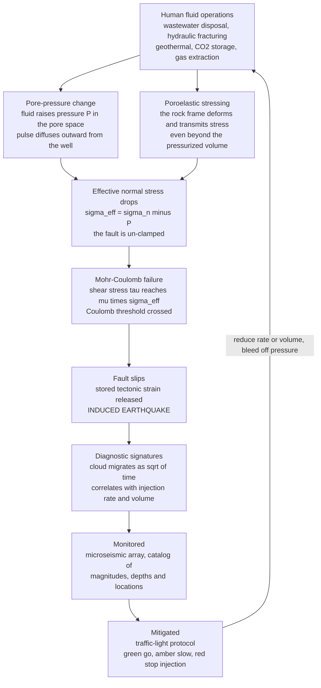

# 🌍 Induced Seismicity and Georesource Geophysics

> [!abstract] TL;DR
> **Induced seismicity** is the earthquakes *we* trigger by moving fluids in and out of the subsurface. The physics is disarmingly simple: a fault at depth is **clamped shut by the weight of overlying rock**, but pumping fluid down a well **raises the pore pressure** $P$ in the rock, which **cancels part of that clamping force** — the *effective* normal stress drops to $\sigma_n - P$, the frictional strength holding the fault falls with it (**Mohr-Coulomb**, $\tau = \mu(\sigma_n - P)$), and the fault can **slip as an earthquake**. Wastewater disposal turned Oklahoma from a couple of felt quakes a year into hundreds; enhanced geothermal projects were halted at **Basel** and killed people at **Pohang**; gas extraction is sinking and shaking **Groningen**. The tell-tale fingerprint is a **seismicity cloud that expands with the square root of time** as the pressure pulse diffuses outward. The *same* fluid physics also powers the low-carbon transition — **geothermal energy** and **CO₂ storage** — so geophysics plays a dual role: the **monitoring and risk-management science** (microseismic arrays, **traffic-light protocols**, 4D seismic) that lets us use the subsurface without breaking it.

---

## Intuition

**Analogy:** A heavy door is held shut not by a lock but by **friction** — the weight and the swollen frame pressing the edges together. Shove it and it barely budges. But **grease the hinges and the jamb**, and now the same door swings open with almost no push. You didn't add force; you *removed the friction* that was resisting the force already there.

Faults deep underground are exactly that door. They are **clamped closed** by the enormous weight of the rock above, and tectonic stress leans on them constantly but can't make them slip — friction wins. Now pump fluid down a well. The fluid pressure in the pore space acts like grease: it **pushes the rock walls apart from the inside**, cancelling part of the clamping weight, so the friction holding the fault collapses. The tectonic stress that was there all along now wins, and the fault **slips — as an earthquake we accidentally triggered**. This is induced seismicity, and it is why Oklahoma went from roughly one or two felt earthquakes a year to *hundreds* after the oil-and-gas industry began injecting billions of barrels of wastewater into deep formations. The energy we extract from the ground and the shaking we cause are two faces of the same fluid physics — and geophysics is the discipline that watches, warns, and manages it.

---

## How It Works

### Core Mechanics

1. **Effective stress is what a fault actually feels.** Terzaghi's principle: a saturated rock's mechanical behaviour is governed not by the total confining stress but by the **effective stress**, $\sigma_n' = \sigma_n - P$, where $\sigma_n$ is the total normal stress (the rock's weight and tectonic load) and $P$ is the **pore-fluid pressure** in the cracks and pores. Fluid pressure *carries* part of the load, un-clamping the grain-to-grain contacts. A fault is strong only because $\sigma_n'$ presses its two faces together.
2. **The Mohr-Coulomb failure criterion.** A fault slips when the shear stress $\tau$ driving it exceeds the frictional resistance holding it:
   $$\tau \;\ge\; C + \mu\,(\sigma_n - P),$$
   where $\mu \approx 0.6$–$0.85$ is the friction coefficient (**Byerlee's law**) and $C$ is cohesion (near zero on a pre-existing fault). Read this equation the way an operator should fear it: **the driving stress $\tau$ barely changes, but raising $P$ directly shrinks the right-hand side.** Push $P$ high enough and the inequality flips — that critical pressure is the **Coulomb failure** trigger.
3. **Two ways injection loads a fault.** *Direct pore-pressure diffusion*: fluid physically reaches the fault and raises $P$ on it. *Poroelastic stressing*: even where no fluid arrives, pressurising and expanding the reservoir rock **deforms the surrounding frame** and transmits stress changes to faults *outside* the pressurised volume — which is why some induced quakes occur kilometres beyond the plume and *after* injection stops. Both are captured by poroelasticity (Biot theory).
4. **The square-root-of-time signature.** Injected fluid does not fill the rock instantly; the pressure pulse **diffuses** like heat, governed by the **hydraulic diffusivity** $D$. The radius of the pressure front — and therefore the outer edge of the triggered-earthquake cloud — grows as
   $$r(t) \;\approx\; \sqrt{4\pi D\,t},$$
   (Shapiro's triggering-front relation). A seismicity cloud that **spreads outward with $\sqrt{t}$**, is centred on an injection well, and starts *after* injection begins is the classic diagnostic distinguishing **induced** from **natural** earthquakes.
5. **Magnitude is not (simply) bounded by the injection.** A common early hope was that small injections could only cause small quakes. Reality: injection nudges a fault that is *already loaded by tectonics* to the brink; once rupture starts, its final size is governed by the **fault's own dimensions and stress state**, not the injected volume. That is how a modest geothermal stimulation in **Pohang, South Korea (2017)** triggered a damaging **M5.5** — the largest and most destructive induced quake on record. There are *statistical* scaling relations between injected volume and the maximum *expected* magnitude, but no hard physical cap.
6. **Monitor, then manage — the traffic-light protocol.** Because we cannot predict the exact event, operations are run adaptively. A dense **microseismic** array continuously locates the tiny cracking events, tracking the migrating front and the largest magnitudes. A **traffic-light system (TLS)** sets thresholds: **green** — proceed; **amber** — magnitudes rising, reduce injection rate/volume; **red** — a magnitude limit exceeded, stop injection and bleed off pressure. It is closed-loop hazard control, the operational heart of managing georesource seismicity.

### Flow / Architecture



---

## Key Concepts

**Secondary (intuition level).** A fault deep in the ground is held shut by friction — the weight of the rock above squeezes its two sides together. When people pump fluid down a well (to get rid of oilfield wastewater, to crack rock for gas, or to make geothermal heat), the fluid pressure **pushes the rock apart from the inside** and cancels part of that squeezing. With less friction holding it, the fault can suddenly **slip and make an earthquake** — one we caused. This is why **Oklahoma** went from almost no earthquakes to hundreds a year after huge amounts of wastewater were injected underground. You can tell these human-made quakes apart because they **start near the well and spread outward over time** as the pressure seeps through the rock. The catch: the same trick that lets us tap clean geothermal energy or bury carbon dioxide underground can also shake the ground — so scientists watch these operations closely and use a **traffic-light rule** (green go, amber slow down, red stop) to keep them safe.

**Undergraduate (working level).** Induced seismicity follows from **effective stress**, $\sigma_n' = \sigma_n - P$, and the **Mohr-Coulomb** criterion $\tau \ge C + \mu(\sigma_n - P)$: raising pore pressure $P$ lowers frictional strength, so a fault already loaded by tectonic shear stress $\tau$ can reach **Coulomb failure**. Faults are loaded two ways — direct **pore-pressure diffusion** and **poroelastic stressing** of the frame. The hallmark of induced events is a seismicity front migrating as $r(t)\approx\sqrt{4\pi D t}$ (hydraulic diffusivity $D$), together with correlation to **injection rate and cumulative volume**. Causes span **wastewater disposal** (the dominant driver of the central-U.S. surge), **hydraulic fracturing**, **enhanced geothermal systems (EGS)**, **reservoir impoundment** behind dams, **gas extraction** (Groningen subsidence and quakes), and **CO₂ sequestration**. Because rupture size is set by the fault, not the injection, magnitude is **not strictly bounded** by injected volume. Management is empirical and closed-loop: **microseismic monitoring** plus a **traffic-light protocol**. The broader field — **reservoir geophysics** and **geomechanics** — uses the same subsurface toolkit for good: **4D (time-lapse) seismic** to image production, **microseismic** to map hydraulic fractures, and monitoring to verify **CO₂ storage** integrity.

**Graduate (rigorous level).** The rigorous frame is **Biot poroelasticity**: total stress, pore pressure, and rock-frame deformation are coupled, so injection produces both an *undrained* instantaneous poroelastic stress change and a *drained*, time-dependent pressure-diffusion field governed by $\partial P/\partial t = D\nabla^2 P + \text{source}$ with $D = \kappa/(\eta S)$ (permeability over viscosity times storativity). The trigger is quantified by the **Coulomb Failure Stress** change, $\Delta \text{CFS} = \Delta\tau + \mu(\Delta\sigma_n' ) = \Delta\tau - \mu(\Delta\sigma_n - \Delta P)$; $\Delta\text{CFS} > 0$ promotes slip. Whether slip is **seismic or aseismic** depends on **rate-and-state friction** and the fault's **$(a-b)$** stability parameter: velocity-weakening ($a-b<0$) patches host earthquakes, velocity-strengthening patches creep. Statistical models — the **seismogenic index** $\Sigma$ and **Shapiro/Dinske** volume-magnitude relations — link cumulative injected volume $V(t)$ to event rate and the **maximum expected magnitude**, while **McGarr's bound** $M_0^{\max} \lesssim G\,\Delta V$ caps *cumulative* seismic moment by the injected volume — though single large events can defy naive intuition (Pohang ruptured a mapped fault). Poroelastic and pressure-diffusion contributions must be separated to explain far-field and post-shut-in seismicity. On the resource side, **time-lapse (4D) seismic** inverts repeated surveys for production-induced changes in saturation and pore pressure (Gassmann fluid substitution), **microseismic** moment tensors resolve fracture-network geometry and stress state, and **CCS measurement, monitoring and verification (MMV)** integrates seismic, gravity, InSAR, and pressure data to confirm containment and satisfy regulators.

---

## Python Demo

```python
# Induced seismicity: the effective-stress trigger + the sqrt-time diffusion front.
# (a) MOHR-COULOMB: raising pore pressure P shifts the effective-stress Mohr circle
#     LEFT toward the failure envelope tau = mu*(sigma_n - P). The critical pressure
#     Pc brings the circle tangent to the envelope -> Coulomb failure = fault slip.
# (b) DISTANCE-TO-FAILURE vs P: a linear march to zero at the critical pressure Pc.
# (c) PRESSURE DIFFUSION: the triggering front r(t) = sqrt(4*pi*D*t) (Shapiro).
#     Induced events cluster INSIDE this front, so the seismicity cloud grows with
#     sqrt(time) -- the classic signature separating induced from natural quakes.
# (d) The same cloud in r vs sqrt(t): the diffusion front becomes a straight line.
import numpy as np
import matplotlib.pyplot as plt

# ---------------------------------------------------------------------------
# Stress state on a fault at depth (total principal stresses, MPa)
# ---------------------------------------------------------------------------
s1, s3  = 120.0, 60.0          # max / min principal TOTAL stress [MPa]
mu      = 0.6                  # fault friction coefficient (Byerlee)
center0 = 0.5*(s1 + s3)        # Mohr-circle center at P = 0
radius  = 0.5*(s1 - s3)        # Mohr-circle radius (fixed as P changes)

# Critical pore pressure: circle tangent to the envelope tau = mu*sigma_n.
# Tangency requires  mu*center'/sqrt(1+mu^2) = radius, with center' = center0 - Pc.
Pc = center0 - radius*np.sqrt(1 + mu**2)/mu
print(f"Critical pore pressure to trigger slip: Pc = {Pc:.1f} MPa")

P_values = [0.0, 0.5*Pc, Pc]                 # circle marching left toward failure
colors   = ["#2980b9", "#8e44ad", "#c0392b"]

# ---------------------------------------------------------------------------
# Pressure diffusion (Shapiro triggering front) + a synthetic seismicity cloud
# ---------------------------------------------------------------------------
D   = 0.5                                     # hydraulic diffusivity [m^2/s]
DAY = 86400.0
t   = np.linspace(1.0, 30*DAY, 500)           # 30 days of injection
r_front = np.sqrt(4*np.pi*D*t)                # triggering-front radius [m]
print(f"Triggering front after 30 days: r = {r_front[-1]/1000:.2f} km")

rng    = np.random.default_rng(1)
N      = 6000
t_ev   = rng.uniform(t.min(), t.max(), N)
r_ev   = rng.uniform(0.0, r_front.max()*1.05, N)
inside = r_ev < np.sqrt(4*np.pi*D*t_ev)       # events triggered inside the front

# ---------------------------------------------------------------------------
# Plots
# ---------------------------------------------------------------------------
fig, ax = plt.subplots(2, 2, figsize=(13, 10))

# (a) Mohr circles marching left toward the failure envelope
theta   = np.linspace(0, np.pi, 300)
sn_line = np.linspace(0, center0 + radius + 5, 200)
ax[0,0].plot(sn_line, mu*sn_line, "k-", lw=2, label="failure envelope  tau = mu*sigma_n")
for P, col in zip(P_values, colors):
    c  = center0 - P
    sn = c + radius*np.cos(theta)
    ta = radius*np.sin(theta)
    ax[0,0].plot(sn, ta, color=col, lw=1.8, label=f"P = {P:.0f} MPa")
ax[0,0].set_aspect("equal")
ax[0,0].set_xlabel("effective normal stress  sigma_n - P  [MPa]")
ax[0,0].set_ylabel("shear stress  tau  [MPa]")
ax[0,0].set_title("(a) Rising pore pressure marches the Mohr\ncircle LEFT into failure")
ax[0,0].legend(fontsize=8, loc="upper left"); ax[0,0].grid(alpha=0.3)

# (b) distance-to-failure vs pore pressure -> reaches zero at Pc
Pgrid = np.linspace(0, Pc*1.3, 200)
gap   = mu*(center0 - Pgrid)/np.sqrt(1 + mu**2) - radius     # >0 stable, 0 = failure
ax[0,1].plot(Pgrid, gap, color="#16a085", lw=2)
ax[0,1].axhline(0, color="k", lw=1)
ax[0,1].axvline(Pc, ls="--", color="#c0392b")
ax[0,1].fill_between(Pgrid, gap, 0, where=(gap < 0), color="#f5b7b1", alpha=0.6)
ax[0,1].annotate(f"critical pressure\nPc = {Pc:.0f} MPa", xy=(Pc, 0),
                 xytext=(Pc*0.42, gap.max()*0.45), fontsize=9,
                 arrowprops=dict(arrowstyle="->"))
ax[0,1].set_xlabel("pore pressure  P  [MPa]")
ax[0,1].set_ylabel("distance to Coulomb failure  [MPa]")
ax[0,1].set_title("(b) Injection erodes the margin\nto failure -> slip at Pc")
ax[0,1].grid(alpha=0.3)

# (c) seismicity cloud vs time, bounded by the sqrt(t) front
ax[1,0].scatter(t_ev[inside]/DAY, r_ev[inside]/1000, s=4, color="#5dade2",
                alpha=0.5, label="induced events")
ax[1,0].plot(t/DAY, r_front/1000, "r-", lw=2.2, label="front  r = sqrt(4*pi*D*t)")
ax[1,0].set_xlabel("time since injection start  [days]")
ax[1,0].set_ylabel("distance from well  r  [km]")
ax[1,0].set_title("(c) Seismicity cloud EXPANDS with sqrt(time):\nthe diffusion signature")
ax[1,0].legend(fontsize=8, loc="upper left"); ax[1,0].grid(alpha=0.3)

# (d) same cloud in r vs sqrt(t): the front becomes a straight line
ax[1,1].scatter(np.sqrt(t_ev[inside]/DAY), r_ev[inside]/1000, s=4,
                color="#af7ac5", alpha=0.5, label="induced events")
ax[1,1].plot(np.sqrt(t/DAY), r_front/1000, "r-", lw=2.2, label="front (linear here)")
ax[1,1].set_xlabel("sqrt(time)  [sqrt-days]")
ax[1,1].set_ylabel("distance from well  r  [km]")
ax[1,1].set_title("(d) In r vs sqrt(t) the front is LINEAR:\ndiagnostic of pressure diffusion")
ax[1,1].legend(fontsize=8, loc="upper left"); ax[1,1].grid(alpha=0.3)

plt.tight_layout()
plt.savefig("induced_seismicity_and_georesource_geophysics.png", dpi=130)
print("\nSaved induced_seismicity_and_georesource_geophysics.png")
```

Running this prints the critical pore pressure ($P_c \approx 32$ MPa for the chosen stress state) and the front radius after a month (~5.7 km), then draws four panels: **(a)** three Mohr circles for increasing pore pressure — the circle keeps the *same radius* but slides **left** (its effective stresses shrink) until it kisses the frictional failure envelope at $P_c$; **(b)** the "distance to Coulomb failure" falling **linearly** to zero at $P_c$, the moment the fault slips; **(c)** the induced-earthquake cloud spreading outward from the well and **bounded above by the $\sqrt{t}$ diffusion front**; and **(d)** the same cloud re-plotted against $\sqrt{t}$, where that front becomes a **straight line** — the geometric fingerprint that lets a seismologist say "this was pressure diffusion from a well," not tectonics.

---

## Real-World Applications

- **Wastewater disposal and the central-U.S. surge.** The archetype: co-produced saltwater from oil-and-gas operations injected into deep, permeable formations (Arbuckle in Oklahoma) raised basement pore pressure and triggered thousands of quakes. **Oklahoma** peaked at over 900 M3+ events in 2015 — including the **M5.8 Pow­huska/Pawnee (2016)**, the state's largest — before regulators cut injection volumes and rates and the rate fell sharply, a live demonstration of cause, effect, and mitigation.
- **Enhanced Geothermal Systems (EGS).** Deliberately fracturing hot dry rock to create a heat-exchange reservoir *requires* stimulating fractures — and can trigger felt events. **Basel, Switzerland (2006)** was shut down and abandoned after an M3.4; **Pohang, South Korea (2017)** triggered a damaging **M5.5** on a previously unmapped fault — the field's cautionary tales that reshaped protocols.
- **Hydraulic fracturing.** Most frac-induced events are microseismic and harmless, but in tectonically primed basins (Western Canada's **Montney/Duvernay**, parts of the UK's **Preston New Road**, which repeatedly tripped its red-light threshold) fracturing has produced felt earthquakes, distinct from the far larger wastewater problem.
- **Gas extraction and Groningen.** The Netherlands' giant Groningen field is the extraction analogue: decades of gas withdrawal compacted the reservoir, causing **subsidence and shallow induced earthquakes** (up to M3.6) that damaged thousands of homes — a driver of the political decision to shut the field, and a landmark in induced-seismicity risk and liability.
- **Reservoir impoundment.** Filling large reservoirs behind dams loads and pressurises the crust; **Koyna, India (1967, M6.3)** remains the deadliest suspected reservoir-triggered earthquake.
- **CO₂ sequestration and CCS monitoring.** Carbon capture and storage injects supercritical CO₂ into deep saline aquifers — the same pore-pressure physics, so induced-seismicity risk must be managed while **measurement, monitoring and verification (MMV)** geophysics (time-lapse seismic, gravity, InSAR) proves the CO₂ stays put. **Sleipner** (North Sea) is the flagship 4D-seismic-monitored project.
- **Reservoir geophysics and 4D seismic.** Beyond hazard, the georesource toolkit **produces value**: repeated (time-lapse) seismic surveys image how oil, gas, water, and pressure move through a producing reservoir, and **microseismic** monitoring maps the growing hydraulic-fracture network in real time — the core of modern subsurface stewardship for the energy transition.

---

## Common Pitfalls

- **Correlation vs causation in attribution.** Proving an earthquake is *induced* takes more than proximity to a well. The rigorous case rests on **spatial-temporal correlation** (events start after injection, cluster near the well, migrate as $\sqrt{t}$), a plausible **pressure/poroelastic pathway** to the fault, and often a shift from the natural background rate. Naming operators before this evidence exists — or, conversely, dismissing a well-correlated swarm as "natural" — are the twin failure modes.
- **Confusing pore-pressure with poroelastic triggering.** Direct pressure diffusion needs a hydraulic connection to the fault; **poroelastic stressing** transmits stress through the solid frame and can trigger events *beyond* the plume and *after* shut-in. Assuming only pressure diffusion under-predicts the reach and the tail of induced seismicity.
- **Thinking rate/volume don't matter — or that they fully control magnitude.** Event *rate* and *cumulative moment* scale with **injected volume and rate** (the basis of volume management and McGarr's bound), so throttling injection is the primary lever. But the *maximum single magnitude* is set by the **fault**, not the fluid — Pohang's M5.5 from a modest EGS stimulation is the proof. Manage volume to reduce likelihood, but never assume a hard magnitude cap.
- **Treating traffic-light systems as a cure-all.** A **TLS** reacts to what has already happened; if a fault is large and critically stressed, a felt event can arrive with little warning, and shutting in does not instantly relieve pressure (diffusion and poroelastic stress can keep loading faults after the pumps stop). TLS is necessary risk management, not a guarantee.
- **Failing to distinguish induced from natural.** Without dense local monitoring and accurate depths, induced swarms are easily missed or misattributed. The diagnostics — $\sqrt{t}$ migration, injection correlation, shallow basement depths, and departure from background rates — require instrumentation that is often installed *after* the problem begins.
- **Lumping all "induced" mechanisms together.** **Wastewater disposal** (large volumes, sustained pressure, the biggest quakes), **hydraulic fracturing** (small volumes, mostly microseismic), **EGS** (deliberate stimulation of hot basement), **CO₂ storage** (long-term buoyant injection), and **reservoir impoundment** (surface loading + pressure) have different volumes, timescales, and hazard profiles. Policy and monitoring that ignore these distinctions misallocate attention.
- **Assuming magnitude is bounded by the injection.** Restated because it is the single most consequential misconception: injection *initiates* rupture on a tectonically loaded fault, but the **rupture runs on the fault's own stored energy**. There is no simple physical ceiling tied to the injected volume of a single event.

---

## Related Concepts

- [[Earthquake_Seismology_Fundamentals]] — the science of locating, sizing, and cataloguing earthquakes; induced events are ordinary earthquakes with a human trigger, measured the same way.
- [[Elasticity_and_Seismic_Wave_Theory]] — the stress/strain and elastic-wave foundation behind the Mohr-Coulomb criterion and the microseismic waves used to monitor injection.
- [[Terrestrial_Heat_Flow_and_Thermal_Evolution]] — the geothermal-gradient resource that enhanced geothermal systems exploit, and whose extraction can induce seismicity.
- [[Economic_Geology_and_Resources]] — the georesource context: the energy and mineral resources whose extraction and disposal move the fluids that trigger quakes.
- [[Groundwater_and_Karst]] — subsurface fluid flow, aquifers, and hydraulic diffusivity — the porous-media physics through which injected pressure diffuses.
- [[Seismology_and_Earthquakes]] — the Earth-science treatment of faulting and earthquake mechanics that induced seismicity perturbs.
- [[Criticality_and_Phase_Transitions]] — fault populations sit near a critical, self-organized state; small pressure nudges can tip a critically stressed fault, explaining why tiny injections trigger disproportionate events.
- [[Cascades_and_Systemic_Risk]] — the risk-management framing: a single triggered rupture can cascade into structural, economic, and regulatory consequences (the logic behind traffic-light protocols).
- [[Environmental_Justice_and_Sustainability]] — the dual-use tension: the same fluid operations that decarbonise (geothermal, CCS) impose seismic and subsidence burdens that must be distributed and governed fairly.
- [[Climate_Ethics]] — CO₂ sequestration and geothermal are pillars of the low-carbon transition, forcing a trade-off between climate benefit and local induced-seismicity risk.

*Sibling notes in this Geophysics vault develop the neighbouring pieces: **Seismic_Hazard_and_Ground_Motion** provides the PSHA machinery that induced-seismicity hazard adapts (with time-varying, operation-dependent rates); **Earthquake_Source_and_Focal_Mechanisms** supplies the rupture physics and moment tensors that reveal whether an event slipped on the fault geometry injection would predict; **Borehole_Geophysics_and_Well_Logging** characterises the in-situ stress, permeability, and pore pressure at the injection interval that this note treats as inputs; **Rheology_and_Deformation_of_the_Earth** grounds the brittle-frictional (Byerlee) and pore-fluid physics in the strength envelope; and **Environmental_and_Hydrogeophysics** shares the near-surface monitoring toolkit for tracking subsurface fluids.*

---

## Review Questions

1. **(Secondary)** A fault has been sitting quietly under tectonic stress for centuries. An oil company begins injecting wastewater into a deep well nearby, and months later small earthquakes appear and spread outward from the well. Using the "greased door" idea, explain *why* the injection caused the quakes even though the company added no new pushing force to the fault — and name one clue that would tell a scientist these quakes were induced rather than natural.
2. **(Undergraduate)** Write the Mohr-Coulomb failure condition for a fault and explain, term by term, how raising the pore pressure $P$ moves a fault toward slip. Then explain the $r(t)\approx\sqrt{4\pi D t}$ triggering front: why does the seismicity cloud expand with the *square root* of time rather than linearly, and how would you use a plot of event distance versus $\sqrt{t}$ to argue a swarm is injection-induced?
3. **(Graduate)** A geothermal stimulation injects a modest fluid volume yet triggers an M5.5 earthquake, while a much larger wastewater-disposal operation produces only microseismicity. (a) Reconcile this with McGarr's volume bound on *cumulative* seismic moment and with the fact that single-event magnitude is fault-controlled. (b) Distinguish the roles of direct pore-pressure diffusion versus poroelastic stressing in producing events beyond the plume and after shut-in. (c) Explain, using rate-and-state friction and the $(a-b)$ parameter, why the *same* pressure change can produce aseismic creep on one fault patch and a seismic rupture on another — and what that implies for the design of a traffic-light protocol.

---

## Sources

- Ellsworth, W. L. (2013). "Injection-Induced Earthquakes." *Science*, 341(6142), 1225942. — the definitive review of the mechanism and the U.S. wastewater surge.
- National Research Council (2013). *Induced Seismicity Potential in Energy Technologies*. National Academies Press. — cross-technology assessment (wastewater, fracking, EGS, CCS, reservoirs).
- Shapiro, S. A. (2015). *Fluid-Induced Seismicity*. Cambridge University Press. — the pressure-diffusion / triggering-front theory and the seismogenic index.
- Zoback, M. D. (2007). *Reservoir Geomechanics*. Cambridge University Press. — in-situ stress, effective stress, fault reactivation, and the geomechanics toolkit.
- McGarr, A. (2014). "Maximum magnitude earthquakes induced by fluid injection." *Journal of Geophysical Research: Solid Earth*, 119(2), 1008–1019. — the volume-bounded cumulative-moment relation.
- [USGS — Induced Earthquakes (Earthquake Hazards Program)](https://www.usgs.gov/programs/earthquake-hazards/induced-earthquakes)

---

#geophysics #induced-seismicity #reservoir-geomechanics #energy-geophysics #pore-pressure
