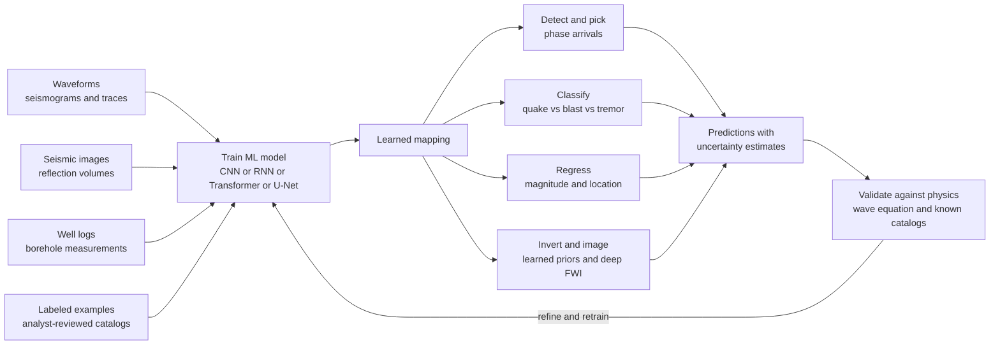

# 🤖 Machine Learning in Geophysics

> [!abstract] TL;DR
> **Machine learning bottles a veteran seismologist's trained eye and runs it on millions of traces a day.** Geophysics has become a firehose of data — a single 3-D seismic survey is terabytes, and dense sensor networks stream continuously — and classical, hand-tuned algorithms cannot keep up. ML learns the mapping from raw geophysical signals (waveforms, seismic images, well logs) to the answers we want: **detecting and picking** seismic phases at superhuman speed (ConvNetQuake, PhaseNet, EQTransformer), **classifying** events (earthquake vs blast vs tremor, lithofacies, faults/salt in images), **regressing** quantities (magnitude, location, ground motion for early warning), and even helping **invert and image** the subsurface (learned priors, denoising, deep-learning full-waveform inversion, fast surrogate simulators). The revolution is real — ML finds tiny quakes humans miss and densifies catalogs by 10x — but it is a **complement to physics, not a replacement**: its perils are scarce and biased training labels, poor generalization to new regions, black-box opacity, and the constant need to ask *where the machine's confidence is trustworthy and where it hallucinates*.

---

## Intuition

**Analogy:** A veteran seismologist can glance at a wiggly trace and instantly say **"that's a real earthquake, that's just a truck rumbling past the station"** — a pattern-recognition skill honed over decades of staring at seismograms. The knowledge lives in their trained intuition, not in any equation they could write down. Machine learning **bottles that intuition**: you show a neural network hundreds of thousands of examples that experts have already labeled ("earthquake here", "phase arrival there", "this is noise"), and it learns the same discriminating pattern — then applies it to **millions of traces per day**, tirelessly, at 3 a.m., on data no human will ever have time to look at.

The reason this matters *now* is scale. Modern geophysics **drowns in data**: continuous streams from thousands of seismometers, terabyte 3-D reflection surveys, dense GPS and DAS (distributed-acoustic-sensing) arrays turning fiber-optic cables into millions of virtual sensors. A hand-tuned detector or a human analyst is a bottleneck; ML is finally how we **drink from the firehose**. But the trained machine is only as good as the examples it saw, so the whole discipline is learning a second skill in parallel — figuring out **where the model's confidence is earned and where it is fabricating structure that isn't there**.

---

## How It Works

### Core Mechanics

1. **Frame the task.** Decide what you want the machine to output. Is it a **detection** (is there an event in this window, yes/no)? A **classification** (which of several event types)? A **regression** (a continuous number: magnitude, back-azimuth, arrival-time offset)? Or an **inverse/imaging** task (a whole subsurface model)? The task shape dictates the model and the loss function.
2. **Assemble labeled data.** Supervised ML needs examples paired with answers. In geophysics these come from **analyst-reviewed earthquake catalogs**, hand-picked phase arrivals, interpreted seismic horizons and faults, or logged well tops. Labels are precious and expensive — the central constraint of the whole field.
3. **Represent the input.** Raw waveforms (three-component time series), spectrograms, 2-D/3-D seismic-image patches, or feature vectors from well logs. Classic ML needs **hand-engineered features** (an STA/LTA ratio, a spectral centroid, an amplitude statistic); deep learning **learns the features itself** from raw traces via stacked convolutions.
4. **Choose an architecture.** **CNNs** excel at local patterns in waveforms and images (used by ConvNetQuake, PhaseNet's U-Net, and fault/salt detectors). **RNNs/LSTMs** model the temporal order of a seismogram (EQTransformer pairs CNNs, BiLSTMs, and attention). **U-Nets** do pixel-wise segmentation of seismic volumes. **Transformers** capture long-range context.
5. **Train by minimizing a loss.** Compare predictions to labels, compute a loss (cross-entropy for classification, mean-squared error for regression, a probabilistic peak for phase-time picking), and adjust weights by **gradient descent + backpropagation**. Regularization (weight decay, dropout, augmentation) fights overfitting on scarce labels.
6. **Validate — carefully.** Hold out data the model never saw, ideally from **different regions and time periods** (not just a random split, which leaks correlated neighbors). Report precision/recall, ROC/AUC, or picking error, and quantify **uncertainty** so downstream users know when to trust a prediction.
7. **Deploy against physics.** The best systems close the loop: predictions are **checked against physical constraints** (does a picked P and S time triangulate to a plausible location? does an inverted model satisfy the wave equation?) and against known catalogs, then the model is refined and retrained. Physics-informed ML (PINNs) bakes the governing PDE directly into the loss so the network cannot violate wave physics.

### Flow / Architecture



---

## Key Concepts

**Secondary (intuition level).** An expert can look at a squiggle from a seismometer and tell an earthquake from a passing truck. A computer can learn to do the same if you show it lots of examples that experts already sorted. Once trained, it never gets tired and can check millions of squiggles a day — so it catches tiny earthquakes people would miss and builds far more complete lists of quakes. The two big families of tasks are **"is this a real event and exactly when did the wave arrive?"** (detection and picking) and **"what kind of event is it and how big?"** (classification and prediction). The catch: the computer only knows what its examples taught it, so it can be fooled or overconfident on data unlike anything it trained on.

**Undergraduate (working level).** Most geophysical ML is **supervised learning**: learn a function $f_\theta(x) \to y$ from labeled pairs by minimizing a loss over parameters $\theta$ via gradient descent. The task landscape:
- **Detection & phase picking.** Deep nets scan continuous data. **ConvNetQuake** (Perol et al. 2018) does windowed detection + coarse location as classification. **PhaseNet** (Zhu & Beroza 2019) is a **U-Net** that outputs, per sample, the probability of a P pick, an S pick, or noise. **EQTransformer** (Mousavi et al. 2020) fuses CNNs, BiLSTMs, and attention to detect events *and* pick both phases at once. These systems pick faster and often more accurately than analysts and have **densified catalogs by an order of magnitude**, revealing swarms and foreshocks.
- **Classification.** Earthquake vs quarry blast vs noise vs volcanic tremor; volcanic event types; **lithofacies** from well logs; and CNN/U-Net **segmentation** of seismic images to flag **faults, salt bodies, and horizons** — replacing weeks of manual interpretation.
- **Regression & characterization.** Estimate **magnitude and location** directly from a few seconds of waveform, predict **ground motion**, and drive **earthquake early warning** (seconds count, so speed is everything).
- **Evaluation.** Because real events are rare, accuracy is misleading — use **precision, recall, F1, and ROC/AUC**, and split test data by **region and time** to expose generalization failures.

**Graduate (rigorous level).** The frontier moves beyond point prediction toward the **inverse problem, generative modeling, and physics integration**.
- **ML for imaging and inversion.** Learned **denoising** and **super-resolution** clean and sharpen data; **deep-learning full-waveform inversion (DL-FWI)** trains networks to map data to velocity models, either as a learned regularizer/prior inside classical FWI or as an end-to-end surrogate — trading the crippling cost and cycle-skipping of conventional FWI for the risk of learned artifacts. **Surrogate / emulator forward models** replace an expensive wave-equation solve with a network that approximates it, accelerating inversion and uncertainty sampling by orders of magnitude.
- **Self-supervised & generative methods.** Labels are scarce, but *unlabeled* seismic data is nearly infinite. **Self-supervised pretraining** (masking and reconstructing traces) learns representations that transfer to downstream tasks with few labels. **Generative models** (GANs, diffusion, VAEs) synthesize realistic training data, interpolate missing traces, and model priors over subsurface structure.
- **Physics-informed ML (PINNs).** Embed the governing PDE (the **wave equation**, eikonal equation, or diffusion equation) directly in the loss via automatic differentiation, so the network's output must satisfy physics *and* fit data. This bridges the data-driven and theory-driven worlds — crucial where labels are sparse but physical laws are exact.
- **Uncertainty quantification.** A prediction without a calibrated error bar is dangerous for hazard and exploration decisions. **Bayesian deep learning, deep ensembles, and MC-dropout** estimate epistemic uncertainty; **distribution shift** (train in California, deploy in Japan) is the central failure mode, so out-of-distribution detection and domain adaptation are active research. The governing principle throughout: ML is a **complement to physical understanding, not a substitute** — it accelerates and scales the classical methods (inverse theory, signal processing, simulation) rather than replacing the physics that makes results interpretable.

---

## Python Demo

```python
# Earthquake-vs-noise classification -- the canonical ML-in-seismology task.
# (a) Synthesize a LABELED dataset of short waveform windows:
#       "earthquake" = a decaying-sinusoid wavelet burst + background noise,
#       "noise"      = background noise only.
#     Extract two simple, physically motivated FEATURES per window:
#       f1 = log10 of the peak STA/LTA ratio (short-term / long-term average
#            energy -- the classic seismic trigger statistic), and
#       f2 = log10 of the window's total energy (variance).
#     Both rise when a transient burst is present, but weak events overlap
#     with noise -- so the classes are separable but NOT perfectly.
# (b) Train a logistic-regression classifier FROM SCRATCH in numpy
#     (sigmoid + binary cross-entropy, gradient descent), then plot the
#     decision boundary in feature space, the confusion matrix, and an
#     ROC curve with AUC -- showing how ML separates events from noise.
# numpy + matplotlib only. No sklearn, no torch.
import numpy as np
import matplotlib.pyplot as plt

rng = np.random.default_rng(0)

# ---------------------------------------------------------------------------
# 1. Synthesize labeled waveform windows
# ---------------------------------------------------------------------------
fs      = 100.0          # sampling rate [Hz]
N       = 200            # samples per window (2 s)
t       = np.arange(N) / fs
n_each  = 300            # windows per class

def earthquake_window():
    """Background noise + a decaying-sinusoid wavelet with random SNR/onset."""
    x   = rng.standard_normal(N)                     # unit-variance noise floor
    amp = rng.uniform(1.0, 4.0)                      # random amplitude -> SNR spread
    t0  = rng.uniform(0.4, 1.2)                       # random onset time [s]
    f0  = rng.uniform(5.0, 12.0)                      # dominant frequency [Hz]
    dec = rng.uniform(8.0, 16.0)                      # decay rate [1/s]
    mask = t >= t0
    wavelet = np.zeros(N)
    tt = t[mask] - t0
    wavelet[mask] = amp * np.exp(-dec * tt) * np.sin(2 * np.pi * f0 * tt)
    return x + wavelet

def noise_window():
    """Background noise only."""
    return rng.standard_normal(N)

waves  = [earthquake_window() for _ in range(n_each)] + \
         [noise_window()       for _ in range(n_each)]
labels = np.array([1] * n_each + [0] * n_each)        # 1 = earthquake, 0 = noise
waves  = np.array(waves)

# ---------------------------------------------------------------------------
# 2. Feature extraction: peak STA/LTA ratio and log-energy
# ---------------------------------------------------------------------------
def sta_lta_max(x, nsta=5, nlta=50):
    """Max short-term/long-term average energy ratio -- the classic trigger."""
    cf = x ** 2                                       # characteristic function
    c  = np.cumsum(np.insert(cf, 0, 0.0))             # prefix sums, length N+1
    idx = np.arange(nlta - 1, len(x))                 # end indices with LTA defined
    sta = (c[idx + 1] - c[idx + 1 - nsta]) / nsta     # trailing STA mean
    lta = (c[idx + 1] - c[idx + 1 - nlta]) / nlta     # trailing LTA mean
    return np.max(sta / (lta + 1e-12))

def features(x):
    f1 = np.log10(sta_lta_max(x) + 1e-9)              # log peak STA/LTA
    f2 = np.log10(np.var(x) + 1e-9)                   # log total energy
    return f1, f2

X = np.array([features(x) for x in waves])            # (2*n_each, 2)
y = labels.astype(float)

# ---------------------------------------------------------------------------
# 3. Train / test split
# ---------------------------------------------------------------------------
perm = rng.permutation(len(y))
X, y = X[perm], y[perm]
cut  = int(0.7 * len(y))
Xtr, Xte, ytr, yte = X[:cut], X[cut:], y[:cut], y[cut:]

# Standardize using TRAIN statistics (apply to test + plotting grid)
mu, sd = Xtr.mean(0), Xtr.std(0)
Ztr, Zte = (Xtr - mu) / sd, (Xte - mu) / sd

# ---------------------------------------------------------------------------
# 4. Logistic regression from scratch (sigmoid + BCE + gradient descent)
# ---------------------------------------------------------------------------
def sigmoid(z):
    return 1.0 / (1.0 + np.exp(-np.clip(z, -30, 30)))

def train_logreg(Z, yv, lr=0.3, epochs=4000):
    n, d = Z.shape
    w, b = np.zeros(d), 0.0
    for _ in range(epochs):
        p  = sigmoid(Z @ w + b)
        gw = Z.T @ (p - yv) / n                       # gradient of BCE loss
        gb = np.mean(p - yv)
        w -= lr * gw
        b -= lr * gb
    return w, b

w, b = train_logreg(Ztr, ytr)
p_te = sigmoid(Zte @ w + b)                           # test-set probabilities
pred = (p_te >= 0.5).astype(int)
acc  = np.mean(pred == yte)
print(f"dataset: {len(y)} windows  |  test accuracy = {acc:.3f}")

# Confusion matrix  [ [TN, FP], [FN, TP] ]
cm = np.zeros((2, 2), int)
for tv, pv in zip(yte.astype(int), pred):
    cm[tv, pv] += 1
print("confusion matrix [[TN FP][FN TP]] =\n", cm)

# ROC curve + AUC by sweeping the decision threshold
thr = np.linspace(0, 1, 201)
P, Nn = (yte == 1).sum(), (yte == 0).sum()
tpr = np.array([((p_te >= th) & (yte == 1)).sum() / P  for th in thr])
fpr = np.array([((p_te >= th) & (yte == 0)).sum() / Nn for th in thr])
order = np.argsort(fpr)
auc = np.trapz(tpr[order], fpr[order])
print(f"ROC AUC = {auc:.3f}")

# ---------------------------------------------------------------------------
# 5. Visualize: example waveforms | feature space + boundary | confusion | ROC
# ---------------------------------------------------------------------------
fig, ax = plt.subplots(2, 2, figsize=(12, 10))

# (a) one earthquake and one noise example window
eq_ex, ns_ex = earthquake_window(), noise_window()
ax[0, 0].plot(t, eq_ex + 6, color="crimson", lw=0.8, label="earthquake")
ax[0, 0].plot(t, ns_ex - 6, color="steelblue", lw=0.8, label="noise")
ax[0, 0].set_title("(a) Example waveform windows")
ax[0, 0].set_xlabel("time [s]"); ax[0, 0].set_yticks([]); ax[0, 0].legend(loc="upper right")

# (b) feature space with the learned decision boundary
gx = np.linspace(X[:, 0].min() - 0.3, X[:, 0].max() + 0.3, 300)
gy = np.linspace(X[:, 1].min() - 0.3, X[:, 1].max() + 0.3, 300)
GX, GY = np.meshgrid(gx, gy)
grid = np.column_stack([GX.ravel(), GY.ravel()])
Pg = sigmoid(((grid - mu) / sd) @ w + b).reshape(GX.shape)
ax[0, 1].contourf(GX, GY, Pg, levels=[0, 0.5, 1], colors=["#cfe3f7", "#f7d6d6"], alpha=0.7)
ax[0, 1].contour(GX, GY, Pg, levels=[0.5], colors="k", linewidths=1.5)
ax[0, 1].scatter(Xte[yte == 1, 0], Xte[yte == 1, 1], s=14, c="crimson", label="earthquake")
ax[0, 1].scatter(Xte[yte == 0, 0], Xte[yte == 0, 1], s=14, c="steelblue", label="noise")
ax[0, 1].set_title("(b) Feature space + learned decision boundary")
ax[0, 1].set_xlabel("log10 peak STA/LTA"); ax[0, 1].set_ylabel("log10 energy")
ax[0, 1].legend(loc="lower right")

# (c) confusion matrix
ax[1, 0].imshow(cm, cmap="Blues")
for i in range(2):
    for j in range(2):
        ax[1, 0].text(j, i, cm[i, j], ha="center", va="center",
                      color="white" if cm[i, j] > cm.max() / 2 else "black", fontsize=14)
ax[1, 0].set_xticks([0, 1]); ax[1, 0].set_xticklabels(["pred noise", "pred quake"])
ax[1, 0].set_yticks([0, 1]); ax[1, 0].set_yticklabels(["true noise", "true quake"])
ax[1, 0].set_title(f"(c) Confusion matrix  (test acc {acc:.2f})")

# (d) ROC curve
ax[1, 1].plot(fpr[order], tpr[order], color="darkgreen", lw=2)
ax[1, 1].plot([0, 1], [0, 1], "k--", lw=0.8)
ax[1, 1].set_title(f"(d) ROC curve  (AUC = {auc:.3f})")
ax[1, 1].set_xlabel("false positive rate"); ax[1, 1].set_ylabel("true positive rate")

plt.tight_layout()
plt.savefig("ml_earthquake_classifier.png", dpi=130)
print("\nSaved ml_earthquake_classifier.png")
```

Running this prints the test accuracy and ROC AUC, then produces four panels: **(a)** example earthquake and noise windows (the burst is visible in the red trace, absent in the blue); **(b)** the two-feature space with each test window plotted and the **logistic-regression decision boundary** drawn through it — a clean linear separator with a realistic sprinkle of overlap where weak, low-SNR events blend into the noise cloud; **(c)** the **confusion matrix** showing true/false positives and negatives; and **(d)** the **ROC curve** with its AUC, tracing the detection-sensitivity vs false-alarm trade-off that every operational detector must tune. This is a from-scratch miniature of exactly what ConvNetQuake and PhaseNet do at massive scale with deep networks instead of two hand-picked features.

---

## Real-World Applications

- **Superhuman phase picking and catalog densification.** **PhaseNet** and **EQTransformer** are now production tools at seismic networks worldwide, picking P/S arrivals on continuous data faster and often more precisely than analysts. Applied to archives, they have **increased earthquake catalogs by roughly 10x**, exposing foreshock sequences, swarms, and the fine structure of fault zones that were previously invisible.
- **Earthquake early warning.** ML regressors estimate magnitude and location from the first few seconds of P-wave data, buying precious seconds of warning before strong shaking arrives — feeding systems like ShakeAlert on the US West Coast.
- **Seismic interpretation in exploration.** CNNs and **U-Nets** segment 3-D reflection volumes to auto-detect **faults, salt bodies, and horizons**, compressing weeks of manual interpretation into minutes for oil, gas, geothermal, and CO2-storage projects.
- **Well-log analysis.** Classifiers predict **lithofacies** and fill gaps in borehole logs, and regressors estimate petrophysical properties, standardizing interpretation across thousands of wells.
- **Volcano and induced-seismicity monitoring.** ML classifies volcanic event types (long-period events, tremor) and flags induced microseismicity from fracking, wastewater injection, and geothermal operations in near-real time.
- **Denoising, deep inversion, and surrogate solvers.** Learned denoisers clean noisy field records; **DL-FWI** and neural surrogate forward models accelerate velocity-model building and let researchers run uncertainty sampling that full physics-based simulation could never afford.
- **DAS and the sensor explosion.** Distributed acoustic sensing turns telecom fiber into millions of virtual seismometers; the resulting data deluge is only tractable *because* ML can triage it.

---

## Common Pitfalls

- **Label scarcity and bias.** Supervised models inherit the blind spots of their training catalogs. If a network only ever saw analyst-reviewed events above magnitude 2 in California, it may systematically miss small events, unusual sources, or anything from a different tectonic setting. Curating labels — not building models — is usually the real bottleneck.
- **Distribution shift / poor generalization.** A model trained in one region routinely degrades when deployed in another (different noise, instruments, geology). A **random** train/test split hides this because neighboring windows are correlated — always split by **region and time**, and test explicitly for out-of-distribution behavior.
- **Black-box opacity and misplaced trust.** A confident softmax output is not understanding. Without interpretability (saliency maps, physics checks), operators may act on predictions the model cannot justify. In hazard and exploration, an unexplained wrong answer can be expensive or dangerous.
- **No uncertainty, no trust.** A point prediction with no calibrated error bar is unusable for decisions. Use Bayesian deep learning, deep ensembles, or MC-dropout, and *calibrate* — an overconfident model is worse than an honest uncertain one.
- **Confusing the task families.** **Detection/picking** (PhaseNet, EQTransformer), **classification**, **regression** (magnitude/location), **surrogate forward models**, and **inversion** are different problems with different failure modes and metrics. Borrowing a detection model's stellar recall to imply its magnitude regression is accurate is a category error.
- **Overfitting on tiny labeled sets.** Deep nets memorize small datasets. Combat it with regularization, dropout, data augmentation, self-supervised pretraining on unlabeled data, and honest held-out evaluation — never report training-set performance.
- **Pure black-box vs physics-informed.** A network free to output anything can violate the wave equation or produce a physically impossible velocity model. **Physics-informed ML (PINNs)** and learned-prior FWI constrain outputs with known physics — usually more robust and data-efficient than an unconstrained black box.
- **Treating ML as a replacement for physics.** The recurring lesson: ML **augments** classical inverse theory, signal processing, and simulation; it does not overturn them. The most reliable systems keep physics in the loop for validation and interpretation, and treat the network as a fast, scalable pattern-matcher — powerful, but only trustworthy where its training taught it well.

---

## Related Concepts

- [[Neural_Network_Basics]] — the core model class behind ConvNetQuake, PhaseNet, and EQTransformer; universal function approximators trained by backprop.
- [[CNN_Fundamentals]] — convolutions detect local patterns in waveforms and seismic images; the backbone of nearly every geophysical detector and segmenter.
- [[RNN_and_LSTM]] — recurrent nets model the temporal order of a seismogram; EQTransformer pairs BiLSTMs with attention to pick phases in sequence.
- [[Logistic_Regression]] — the from-scratch classifier in the demo; the simplest supervised separator of events from noise and the base case for all classification.
- [[Gradient_Descent]] — the optimization engine that fits every model here by iteratively minimizing the loss.
- [[Semantic_Segmentation_Deep]] — U-Net pixel-wise segmentation, exactly the architecture PhaseNet and seismic fault/salt detectors use on images and traces.
- [[CNN_Architectures]] — the deep architectures (ResNets, U-Nets, encoder-decoders) adapted from vision to seismic image interpretation.
- [[Self_Supervised_Pretraining]] — learn representations from abundant *unlabeled* seismic data, the key response to geophysics' label scarcity.
- [[Regularization]] — weight decay and penalties that stop small labeled sets from being memorized; the same math as damping in the inverse problem.
- [[Bias_Variance_Tradeoff]] — the overfitting-vs-underfitting lens for why a model that aces training data fails on a new region.
- [[Classification_Metrics]] — precision, recall, and F1, the honest scores for rare-event detection where raw accuracy misleads.
- [[ROC_and_AUC]] — the detection-sensitivity vs false-alarm curve plotted in the demo; how you tune an operational trigger.
- [[Handling_Imbalanced_Data]] — earthquakes are vastly outnumbered by noise windows; techniques to keep the model from ignoring the rare class.
- [[Probability_Theory]] — the language of uncertainty quantification and Bayesian deep learning that tells you when to trust a prediction.
- [[Regression_and_Correlation]] — the framework behind magnitude/location/ground-motion estimation, ML's regression tasks.
- [[Seismic_Tomography_and_Earth_Imaging]] — the classical regularized inverse problem that ML now augments with learned priors, denoising, and deep-learning FWI.
- [[Earthquake_Seismology_Fundamentals]] — the P/S phases, magnitudes, and source physics that ML detectors are trained to recognize and measure.

*Sibling notes in this Geophysics section (build these next): **Geophysical_Inverse_Theory** formalizes the regularized inversion that ML's learned priors and surrogate solvers accelerate; **Geophysical_Signal_and_Data_Processing** provides the STA/LTA triggers, filtering, and spectral features that ML either uses as inputs or learns to replace; **Computational_Geophysics_and_Simulation** supplies the expensive forward models that neural surrogates and PINNs emulate; **Seismic_Tomography_and_Earth_Imaging** is the imaging problem where deep-learning FWI and denoising are reshaping practice; and **Earthquake_Seismology_Fundamentals** defines the events, phases, and magnitudes that detection and characterization models are trained on. This note is the applied face of the entire AI-ML vault — the same neural networks, gradient descent, and evaluation machinery, pointed at the Earth.*

---

## Review Questions

1. **(Secondary)** A trained seismologist can tell a real earthquake from a passing truck by glancing at a trace. Explain in plain language how a machine-learning model learns to do the same thing, and give one reason the machine can catch small earthquakes that a human would miss — and one reason the machine might be fooled by data unlike anything it was trained on.
2. **(Undergraduate)** You build a CNN that detects earthquakes with 99% accuracy on a random train/test split of one region's data, but it performs terribly when deployed in a different country. Diagnose what likely went wrong. Why is raw accuracy a misleading metric for this rare-event task, which metrics would you report instead, and how should you have split your data to catch the problem before deployment?
3. **(Graduate)** Contrast three ways ML can attack the seismic inverse problem: (i) as a *learned prior/regularizer* inside classical full-waveform inversion, (ii) as an *end-to-end surrogate* that maps data straight to a velocity model, and (iii) as a *physics-informed network (PINN)* with the wave equation in its loss. Discuss the trade-offs among data efficiency, risk of hallucinated artifacts, computational cost, and interpretability. When would you insist on keeping explicit physics in the loop rather than trusting a pure black box, and how would you quantify and communicate the model's uncertainty to a decision-maker relying on the result?

---

## Sources

- Bergen, K. J., Johnson, P. A., de Hoop, M. V. & Beroza, G. C. — "Machine learning for data-driven discovery in solid Earth geoscience," *Science* **363**, eaau0323 (2019).
- Kong, Q., Trugman, D. T., Ross, Z. E., Bianco, M. J., Meade, B. J. & Gerstoft, P. — "Machine Learning in Seismology: Turning Data into Insights," *Seismological Research Letters* **90**, 3–14 (2019).
- Perol, T., Gharbi, M. & Denolle, M. — "Convolutional neural network for earthquake detection and location (ConvNetQuake)," *Science Advances* **4**, e1700578 (2018).
- Zhu, W. & Beroza, G. C. — "PhaseNet: a deep-neural-network-based seismic arrival-time picking method," *Geophysical Journal International* **216**, 261–273 (2019).
- Mousavi, S. M., Ellsworth, W. L., Zhu, W., Chuang, L. Y. & Beroza, G. C. — "Earthquake transformer — an attentive deep-learning model for simultaneous earthquake detection and phase picking (EQTransformer)," *Nature Communications* **11**, 3952 (2020).

---

#geophysics #machine-learning #deep-learning #seismology #data-driven-geoscience
