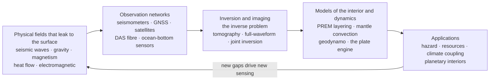

# 🌐 The Reach and Future of Geophysics

> [!abstract] TL;DR
> This is the **capstone** of the whole Geophysics vault. Across six sections we built one idea from many angles: **geophysics is the art of inferring an unreachable interior from the faint physical fields — seismic waves, gravity, magnetism, heat, and electric currents — that leak to the surface.** The recurring mathematical villain is the **inverse problem** and its incurable **non-uniqueness**; the recurring triumph is that, despite never drilling even 1% of the way to the centre, we know the Earth is a **layered, convecting, magnetically alive** planet. The recurring worldview is **Earth as one coupled system** — interior ↔ surface ↔ ocean ↔ climate ↔ life. The frontier is denser sensing (**DAS fibre, ocean-bottom, satellite constellations**), **exascale full-waveform simulation**, **machine learning** at scale, **multi-physics joint inversion**, real-time **hazard early-warning**, the **energy transition** (geothermal, carbon storage, critical minerals, induced seismicity), **climate coupling** (ice, sea level, groundwater), and **planetary geophysics** of other worlds and their hidden oceans.

## Intuition — analogy FIRST

We have stood on the Moon, landed robots on Mars, and flown a probe past Pluto — yet **no human or machine has ever reached even 1% of the way to the centre of the Earth beneath their feet**. The deepest hole ever drilled, the Kola Superdeep Borehole, stopped at about **12 km** into a planet whose core lies **6,371 km** down; scaled to an apple, we have not yet broken the skin. The interior is the least-visited place in the Solar System that we can reach out and touch.

And yet we speak of it with startling confidence: a **liquid iron outer core** wrapping a **solid inner core**; a **mantle that churns** like slow syrup over a hundred million years; a **magnetic dynamo** that flips its poles and shields the biosphere. How? Because a great earthquake in Chile **rings the whole planet like a struck bell**, and we listen. Because mass concentrations **tug** on satellites, and we weigh them. Because the field **leaks** and the ground **breathes** and heat **seeps**, and we read every faint signal. **Geophysics is humanity's X-ray vision for a world we can never open.** This note steps all the way back — past any single method — to see how the whole toolkit fits into one loop, what unifying ideas run through every chapter, and where the discipline is heading as it becomes central to living safely on a dynamic planet.

---

## How It Works

Every chapter of this vault is one arc of the **same loop**. Nature broadcasts physical fields from a hidden interior; we build **observation networks** to catch them; we run the physics **in reverse** (the inverse problem) to make images and models; those models feed **applications** — and the gaps they expose drive the next generation of sensing. The whole discipline is this cycle turning, tightening its picture of the Earth with every revolution.



The six sections of the vault map onto this loop cleanly:

1. **Foundations and Earth's interior** — the physics of each probe and the deep structure it reveals: elastic-wave theory, the gravity field and geodesy, the geodynamo, terrestrial heat flow, and the layered Earth itself (`FIELDS` + first pass at `MODEL`).
2. **Seismology** — earthquakes as sources, rays and travel times, source mechanisms, tomography, and the planet's normal modes; the single richest `OBS → INV → MODEL` chain.
3. **Geodynamics and tectonophysics** — the plate engine, mantle convection, rheology, isostasy and flexure, postglacial rebound, and Earth's rotation; turning `MODEL` from a static picture into a moving one.
4. **Potential fields and exploration geophysics** — seismic reflection/refraction, gravity/magnetic, electrical/EM, GPR, and borehole methods; the applied `OBS → INV` engine for the shallow subsurface.
5. **Global, marine, and environmental geophysics** — marine surveys, paleomagnetism, space geodesy, hydrogeophysics, volcano monitoring, and planetary bodies; extending the loop across the oceans, the surface environment, and other worlds.
6. **Methods and frontiers** — inverse theory, signal processing, computation, induced seismicity, and machine learning; the `INV` machinery and where the whole loop is going next.

---

## Key Concepts

### Secondary Level

**We know the inside of the Earth without ever going there.** No drill has come close — Kola stopped 500 times shallower than the core. Everything we know about the deep Earth is *detective work* from clues that reach the surface: the shaking from earthquakes, tiny changes in gravity, the compass-guiding magnetic field, and the heat that seeps out of the ground.

**Earthquake waves are the main flashlight.** When the Earth quakes, waves race through the whole planet and bend, speed up, slow down, and bounce off the layers inside — just like light bending through water. By timing when the waves arrive at stations around the world, scientists mapped the crust, the mantle, and the core. A crucial clue: one type of wave (the "shaking" S-wave) **cannot pass through liquid**, and it vanishes below 2,900 km — which is how we learned the **outer core is molten metal**.

**The Earth is a machine, not a rock.** The picture that emerged is a planet in slow motion: continents drift, the mantle churns, molten iron swirls to make the magnetic field, and heat from deep inside powers it all. Geophysics reads this machine from the outside.

**Why it matters to you.** The same skills tell us where earthquakes will strike, where to find water and clean energy, how fast the seas are rising, and even what hides inside Mars and the icy moons of Jupiter. Geophysics is how we live safely on a restless planet.

### Undergraduate Level

**One discipline, one problem: inference from the surface.** Strip away the jargon and every geophysical method is the same statement — *given measurements $\mathbf{d}$ made at or above the surface, find the interior model $\mathbf{m}$ that produced them*, by inverting a forward physics operator $G$: $\mathbf{d} = G(\mathbf{m})$. Seismology inverts travel times and waveforms for velocity structure; gravity inverts anomalies for density; magnetics inverts field for magnetization and the dynamo; heat flow inverts surface flux for the thermal budget; geodesy inverts surface motion for fault slip and mantle rheology. **The methods differ; the epistemology is identical.**

**The same physics, sensed many ways.** Three physical processes recur across every chapter:
- **Waves** (elastic seismic waves, plus EM waves in GPR/radar) — reveal *sharp boundaries and elastic/dielectric structure* by reflection, refraction, and travel time.
- **Potential fields** (gravity and magnetism, both governed by Laplace's equation) — reveal *distributions of mass and magnetization*, but ambiguously, because a potential field measured on a surface does not uniquely fix its source.
- **Diffusion** (heat conduction, pore-fluid flow, and low-frequency EM induction) — reveal *thermal state, permeability, and conductivity* through smoothing, decaying responses.
Learn one deeply and you have the template for the others.

**The recurring result: a layered, convecting, magnetic Earth.** Independent probes converge on the *same* structure, and that agreement is the proof. Seismology gives the sharp radial layering codified in **PREM** (crust, mantle, transition zone, D″, liquid outer core, solid inner core); gravity and normal modes fix the density and moment of inertia; heat flow and geodynamics explain *why* it convects; the geodynamo explains the field; paleomagnetism and marine surveys wrote plate tectonics into the seafloor. No single measurement forces the model — their **mutual consistency** does.

**Earth as one coupled system.** The interior is not sealed off from the surface. The **plate engine** built by mantle convection makes earthquakes and volcanoes and shapes the ocean basins; **glacial isostatic adjustment** couples the mantle's viscosity to ice sheets and sea level; **space geodesy** ties solid-Earth deformation to the hydrosphere and cryosphere; the geodynamo shields the atmosphere. Geophysics increasingly reads the planet as one system in which the deep interior, the surface, the ocean, the climate, and life all talk to each other.

### Graduate Level

**Non-uniqueness is structural, not a nuisance to be engineered away.** Potential-field inversion (gravity, magnetics) is *fundamentally* non-unique — Gauss showed that infinitely many interior mass distributions produce identical exterior fields (the depth–amplitude trade-off is the everyday face of this). Even where the forward operator is better behaved, real inverse problems are **ill-posed**: the operator's singular values decay so that data noise is amplified without bound in the naive inverse. The working resolution is **regularization** — Tikhonov damping, smoothing, Bayesian priors — which does not remove the ambiguity but *makes an explicit choice* about which of the infinitely many fitting models to prefer. Every published Earth model is therefore a **hypothesis conditioned on prior assumptions**, quantifiable through resolution operators, model covariance, and appraisal (Backus–Gilbert). Reading a tomographic image without reading its **resolution and coverage** is malpractice.

**Forward physics is shared across the vault.** The elastic wave equation and its Green's functions serve seismology, source inversion, tomography, and geodetic dislocation modelling alike; potential theory (Laplace/Poisson) underlies gravity, magnetics, and the geoid; the advection–diffusion and Stokes-flow equations govern both mantle convection and thermal evolution; Maxwell's equations run EM, magnetotellurics, and GPR. **Frontier methods are unifying these** — *joint inversion* couples seismic, gravity, EM, and geodetic data through shared structure or petrophysical relations, breaking the non-uniqueness that defeats any single dataset. *Full-waveform inversion (FWI)* replaces ray-based travel-time tomography with the complete wavefield, matching modelled and observed seismograms via adjoint gradients — a leap that demands exascale simulation.

**The observational revolution driving the frontier.** Resolution is data-limited, and data are exploding: **Distributed Acoustic Sensing (DAS)** turns a single telecom fibre into thousands of strain sensors, instrumenting the ocean floor, boreholes, and cities at a density no seismometer array can match; **ocean-bottom seismometers** and floating **MERMAID** hydrophones attack the great southern-hemisphere and oceanic data gap that biases every global tomographic model; satellite constellations (**GRACE/GRACE-FO** time-variable gravity, **InSAR** deformation, **Swarm** magnetics) turn the whole planet into a monitored surface. **Machine learning** now does earthquake detection and phase-picking at scales beyond human capacity, learns priors and surrogates for inversion, and denoises DAS — while raising the governance question of physics-informed versus purely data-driven models.

**Geophysics at the centre of planetary stewardship.** The frontier applications are civilizational: **real-time hazard** and earthquake/tsunami early warning from dense networks; the **energy transition** — imaging and monitoring geothermal reservoirs, carbon capture and storage (CCS), and critical-mineral deposits, while managing the **induced seismicity** that fluid injection and geothermal stimulation can trigger; **climate coupling** — glacial isostatic adjustment and elastic loading corrections that make satellite sea-level and ice-mass budgets meaningful, plus groundwater and cryosphere monitoring from gravity and geodesy; and **planetary geophysics** — InSight's seismometer measuring marsquakes to reveal Mars's core, magnetometry and gravity probing the **subsurface oceans** of Europa and Enceladus as astrobiological targets. The same inverse-problem toolkit, pointed at other worlds, is now a frontline instrument in the search for life.

---

## Python Demo

```python
# A four-panel "geophysics dashboard" tying the whole vault together.
#   (1) SEISMOLOGY  : a simplified PREM Vp/Vs-vs-depth profile. The layering
#       (crust, mantle, core) and the collapse of Vs to ZERO in the outer
#       core -- shear waves cannot cross a liquid -- is how we know the outer
#       core is molten metal without ever going there.
#   (2) GEODYNAMICS : the sqrt(age) ocean-depth subsidence law. Cooling of the
#       oceanic plate away from a ridge deepens the seafloor as ~sqrt(age),
#       linking heat flow, rheology, and marine geophysics in one curve.
#   (3) METHODS     : an ill-posed linear inversion. The naive least-squares
#       solution blows up on noise; Tikhonov regularization recovers a stable
#       model -- the non-uniqueness / inverse-problem heart of the discipline.
#   (4) HAZARD      : the Gutenberg-Richter magnitude-frequency law, log10 N vs
#       M, a straight line (b ~ 1) underpinning seismic hazard.
# Self-contained: numpy + matplotlib only.
import numpy as np
import matplotlib.pyplot as plt

rng = np.random.default_rng(2)

# ----------------------------------------------------------------------
# (1) Simplified PREM velocity-depth profile (control points, km & km/s)
# ----------------------------------------------------------------------
# Depths nudged to be strictly increasing across discontinuities.
depth_ctrl = np.array([0, 24, 24.01, 220, 400, 400.01, 670, 670.01,
                       2891, 2891.01, 5150, 5150.01, 6371.0])
vp_ctrl    = np.array([5.8, 6.8, 8.1, 8.0, 9.1, 9.4, 10.3, 10.8,
                       13.7, 8.0, 10.4, 11.0, 11.3])
vs_ctrl    = np.array([3.2, 3.9, 4.5, 4.4, 4.9, 5.1, 5.6, 5.9,
                       7.3, 0.0, 0.0, 3.5, 3.7])       # Vs = 0 in the OUTER CORE
z  = np.linspace(0, 6371, 3000)
vp = np.interp(z, depth_ctrl, vp_ctrl)
vs = np.interp(z, depth_ctrl, vs_ctrl)

# ----------------------------------------------------------------------
# (2) sqrt(age) ocean-depth subsidence (half-space cooling; GDH1-style)
# ----------------------------------------------------------------------
age = np.linspace(0, 100, 400)                    # seafloor age, Myr
d_ridge, C = 2600.0, 365.0                        # ridge depth (m), slope (m/sqrt(Myr))
depth_model = d_ridge + C*np.sqrt(age)            # ocean depth (m)
age_obs = np.sort(rng.uniform(1, 100, 40))
depth_obs = d_ridge + C*np.sqrt(age_obs) + rng.normal(0, 150, age_obs.size)

# ----------------------------------------------------------------------
# (3) Ill-posed linear inversion: smoothing operator + Tikhonov recovery
# ----------------------------------------------------------------------
n = 80
s = np.linspace(0, 1, n)
m_true = np.exp(-((s-0.35)/0.05)**2) + 0.6*(s > 0.65)          # bump + step
xx, yy = np.meshgrid(s, s)
G = np.exp(-((xx-yy)/0.04)**2); G /= G.sum(axis=1, keepdims=True)   # blur kernel
d_clean = G @ m_true
d_noisy = d_clean + rng.normal(0, 0.01, n)                     # 1% noise
m_naive = np.linalg.pinv(G) @ d_noisy                         # blows up
lam = 3e-2                                                     # Tikhonov weight
m_reg = np.linalg.solve(G.T@G + lam*np.eye(n), G.T@d_noisy)   # stable recovery

# ----------------------------------------------------------------------
# (4) Gutenberg-Richter magnitude-frequency (b ~ 1)
# ----------------------------------------------------------------------
b, Mmin, Nq = 1.0, 3.0, 6000
beta = b*np.log(10.0)
M = Mmin - np.log(rng.uniform(size=Nq))/beta                  # exponential tail
Ms = np.sort(M)
Ncum = Nq - np.arange(Nq)                                     # N with mag >= Ms
gr_line = np.log10(Nq) + b*Mmin - b*Ms                        # theoretical line

# ----------------------------------------------------------------------
# Plot the 4-panel synthesis dashboard
# ----------------------------------------------------------------------
fig, ax = plt.subplots(2, 2, figsize=(13, 9))

# (1) PREM
ax[0,0].plot(vp, z, color="tab:red", label="Vp (P-wave)")
ax[0,0].plot(vs, z, color="tab:blue", label="Vs (S-wave)")
ax[0,0].axhspan(2891, 5150, color="0.85", zorder=0)
ax[0,0].text(1.0, 4000, "OUTER CORE\nVs = 0 -> liquid", fontsize=8, va="center")
ax[0,0].axhline(2891, color="k", lw=0.6, ls="--")
ax[0,0].axhline(5150, color="k", lw=0.6, ls="--")
ax[0,0].invert_yaxis()
ax[0,0].set(title="(1) Seismology: PREM velocity vs depth",
            xlabel="velocity [km/s]", ylabel="depth [km]")
ax[0,0].legend(loc="lower left"); ax[0,0].grid(alpha=0.3)

# (2) sqrt(age) subsidence
ax[0,1].plot(age, depth_model, color="tab:green", lw=2, label="d = 2600 + 365 sqrt(age)")
ax[0,1].scatter(age_obs, depth_obs, s=14, color="k", alpha=0.6, label="noisy 'soundings'")
ax[0,1].invert_yaxis()
ax[0,1].set(title="(2) Geodynamics: ocean depth ~ sqrt(age)",
            xlabel="seafloor age [Myr]", ylabel="ocean depth [m]")
ax[0,1].legend(); ax[0,1].grid(alpha=0.3)

# (3) inversion
ax[1,0].plot(s, m_true, "k", lw=2, label="true model")
ax[1,0].plot(s, m_naive, color="tab:orange", lw=1, alpha=0.8, label="naive inverse (unstable)")
ax[1,0].plot(s, m_reg, color="tab:purple", lw=2, label="Tikhonov-regularized")
ax[1,0].set(title="(3) Methods: an ill-posed inversion",
            xlabel="model coordinate", ylabel="model value",
            ylim=(-0.8, 1.8))
ax[1,0].legend(); ax[1,0].grid(alpha=0.3)

# (4) Gutenberg-Richter
ax[1,1].semilogy(Ms, Ncum, ".", ms=3, color="tab:gray", label="cumulative counts")
ax[1,1].semilogy(Ms, 10**gr_line, "r-", lw=2, label=f"GR line, b = {b:.1f}")
ax[1,1].set(title="(4) Hazard: Gutenberg-Richter law",
            xlabel="magnitude M", ylabel="N with magnitude >= M")
ax[1,1].legend(); ax[1,1].grid(alpha=0.3, which="both")

fig.suptitle("A geophysics dashboard: interior structure, plate cooling, "
             "the inverse problem, and hazard", fontsize=13)
plt.tight_layout(rect=(0, 0, 1, 0.97))
plt.show()

# Takeaways:
#  - Vs collapsing to 0 in panel (1) is the fingerprint of the liquid outer core.
#  - The clean sqrt(age) trend (2) ties heat flow, rheology, and bathymetry.
#  - Panel (3): the SAME data admit a wild and a smooth model -- non-uniqueness
#    is not a bug, it is the structure of every geophysical inference.
#  - The straight GR line (4) is why earthquake statistics feed hazard curves.
```

Running it prints nothing but plots the four-panel synthesis: the layered planet with its telltale liquid-core shadow, the cooling ocean floor, the tamed inverse problem, and the earthquake magnitude law — the whole vault on one canvas.

---

## Real-World Applications

The reach of geophysics spans from the daily-practical to the cosmic:

- **Living safely with earthquakes.** Dense networks, ground-motion physics, and Gutenberg-Richter statistics drive **probabilistic seismic hazard** maps, building codes, and **earthquake early-warning** systems (Japan's, California's ShakeAlert) that give seconds of warning before shaking arrives — see [[Seismic_Hazard_and_Ground_Motion]] and [[Earthquake_Seismology_Fundamentals]].
- **Finding and stewarding resources.** Reflection seismology, gravity/magnetic, and electrical/EM surveys image the shallow crust for **groundwater, geothermal energy, and critical minerals** — while the same physics now monitors **carbon capture and storage (CCS)** reservoirs and manages the **induced seismicity** from fluid injection; the exploration toolkit is repurposed for the energy transition (referenced in prose: *Induced_Seismicity_and_Georesource_Geophysics*).
- **Watching the climate system from the solid Earth.** **GRACE/GRACE-FO** time-variable gravity weighs vanishing ice sheets and depleting aquifers; **space geodesy** and **glacial isostatic adjustment** models correct satellite sea-level and ice-mass budgets so they mean something; volcano deformation gives eruption warnings — connecting to [[Space_Geodesy_GPS_and_Crustal_Deformation]] and [[Postglacial_Rebound_and_Mantle_Viscosity]].
- **Understanding how the planet works.** Global **tomography** and **normal modes** map mantle convection and the plate engine that shapes continents, oceans, and the long-term carbon and climate cycles — see [[Seismic_Tomography_and_Earth_Imaging]] and [[Mantle_Convection_and_Dynamics]].
- **Exploring other worlds.** NASA's **InSight** put a seismometer on Mars and, from marsquakes, measured the size of the **Martian core**; magnetometry and gravity from **Galileo, Cassini, and Juno** revealed the **subsurface oceans** of Europa and Enceladus — prime astrobiology targets (referenced in prose: *Planetary_Geophysics*; and [[Astrobiology_and_Habitability]]).
- **Fundamental science.** Geophysics constrains Earth's **thermal and chemical evolution**, the **age and workings of the geodynamo**, and the deep water and carbon cycles — the physical history of the only inhabited planet we know.

---

## Common Pitfalls

- **Forgetting that non-uniqueness is universal.** No geophysical dataset uniquely determines the interior; potential fields are *provably* ambiguous and other problems are ill-posed. Any recovered model is one of infinitely many consistent with the data plus prior assumptions. Treating an inversion output as *the* answer, rather than *a* regularized choice, is the discipline's cardinal sin.
- **Mistaking a model for the truth.** PREM, a tomographic image, a mantle-convection simulation, and a slip inversion are **hypotheses**, not photographs. They are conditioned on parameterization, priors, and the data used. New data routinely revise them.
- **Ignoring resolution and coverage.** A colourful tomographic image looks equally sharp everywhere, but its **resolution varies wildly** with ray/station coverage. Blue and red blobs in poorly sampled regions (much of the oceans and southern hemisphere) can be artifacts. Always read the resolution test before believing a feature.
- **Over-trusting a pretty picture.** Smooth, high-contrast, publication-ready images are partly the *product of the regularization*, not just the Earth. Different damping choices yield different-looking models that fit the data equally well.
- **The data-gap bias.** Seismometers cluster on continents and in the northern hemisphere; the **oceans and the southern hemisphere are under-sampled**, systematically biasing "global" models. DAS, ocean-bottom instruments, and floating hydrophones exist precisely to close this gap — but until they do, global models are continent-weighted.
- **The global-versus-local gap.** A global model good to hundreds of kilometres says little about the fault under your city. Hazard and resource decisions need *local* resolution that global inversions cannot provide; matching scale to question is essential.
- **Working in one physics silo.** The hard problems are interdisciplinary — the strongest constraints come from **joint inversion** that forces seismic, gravity, EM, geodetic, and petrophysical data to agree. A single-method interpretation leaves resolvable ambiguity on the table.
- **Confusing correlation for mechanism in ML models.** Data-driven detectors and surrogates are powerful but can learn dataset artifacts and generalize poorly off-distribution. Physics-informed constraints and uncertainty quantification matter more, not less, as machine learning scales up.

---

## Related Concepts

This is the **hub** of the Geophysics vault; the links below fan out across all six sections and into neighbouring vaults.

**Foundations and Earth's interior (Section 01)**
- [[Geophysics_Overview]] — the field's opening statement of the inverse problem and the layered Earth; this capstone is its bookend.
- [[The_Deep_Structure_of_the_Earth]] — the PREM layering (crust, mantle, liquid outer core, solid inner core) that panel (1) of the demo reproduces.
- [[Elasticity_and_Seismic_Wave_Theory]] — the elastic wave physics shared by seismology, source inversion, tomography, and geodetic dislocation models.
- [[Earths_Gravity_Field_and_Geodesy]] — potential theory and the gravity/geoid probe, the archetype of non-unique inversion.
- [[Geomagnetism_and_the_Geodynamo]] — the core dynamo and the field that shields the biosphere and records plate history.
- [[Terrestrial_Heat_Flow_and_Thermal_Evolution]] — the thermal engine that powers convection and sets the sqrt(age) subsidence of panel (2).

**Seismology (Section 02)**
- [[Earthquake_Seismology_Fundamentals]] — earthquakes as the sources that ring the planet and feed hazard.
- [[Seismic_Ray_Theory_and_Travel_Times]] — the travel-time inversion that first mapped the interior and the liquid-core shadow zone.
- [[Earthquake_Source_and_Focal_Mechanisms]] — rupture kinematics fused with geodesy for finite-fault models.
- [[Seismic_Tomography_and_Earth_Imaging]] — the flagship inverse problem imaging mantle convection; ground zero for resolution/coverage caveats.
- [[Free_Oscillations_and_Normal_Modes]] — the whole-Earth "bell tones" that constrain density and deep structure.
- [[Seismic_Hazard_and_Ground_Motion]] — the Gutenberg-Richter statistics of panel (4) turned into hazard and early warning.

**Geodynamics and tectonophysics (Section 03)**
- [[Geophysics_of_Plate_Tectonics]] — the surface expression of the mantle engine, the unifying theory of the solid Earth.
- [[Mantle_Convection_and_Dynamics]] — the churning that drives plates, volcanism, and long-term climate.
- [[Rheology_and_Deformation_of_the_Earth]] — how "solid" rock flows, the physics behind convection and postseismic relaxation.
- [[Isostasy_and_Lithospheric_Flexure]] — the buoyant balance and bending of the lithosphere under loads.
- [[Postglacial_Rebound_and_Mantle_Viscosity]] — the ice-age memory that measures mantle viscosity and couples to sea level.
- [[Earths_Rotation_and_Reference_Frames]] — the ITRF/EOP backbone that every geodetic measurement lives in.

**Potential fields and exploration geophysics (Section 04)**
- [[Exploration_Geophysics_Overview]] — the applied toolkit for imaging the shallow subsurface.
- [[Seismic_Reflection_and_Refraction_Surveying]] — the workhorse that images sedimentary basins and reservoirs.
- [[Gravity_and_Magnetic_Surveying]] — the potential-field methods whose non-uniqueness this capstone dwells on.
- [[Electrical_and_Electromagnetic_Methods]] — conductivity/diffusion probes for water, minerals, and magma.
- [[Ground_Penetrating_Radar_and_Near_Surface_Geophysics]] — EM-wave imaging of the shallowest few metres.
- [[Borehole_Geophysics_and_Well_Logging]] — the one place we *do* reach in, calibrating everything else.

**Global, marine, and environmental geophysics (Section 05)**
- [[Marine_Geophysics_and_the_Ocean_Floor]] — surveying the two-thirds of the planet under water where the data gap is largest.
- [[Paleomagnetism_and_the_Magnetic_Record]] — the seafloor stripes that proved plate tectonics.
- [[Space_Geodesy_GPS_and_Crustal_Deformation]] — millimetre surface motion tying tectonics to the climate system.

**Cross-vault connections**
- [[Earth_Internal_Structure]] — the Earth-Science companion view of the layered planet.
- [[Plate_Boundaries_and_Plate_Motions]] — the geological framing of the plate engine.
- [[Mantle_Convection_and_Hotspots]] — the Earth-Science treatment of the convecting mantle.
- [[Gravity_Isostasy_and_the_Geoid]] — the geodesy/isostasy overlap from Earth Science.
- [[Terrestrial_Planets]] — comparative planetary interiors, extending the inverse problem to other worlds.
- [[Giant_Planets_and_Their_Moons]] — the icy moons whose subsurface oceans are geophysical/astrobiological frontiers.
- [[Astrobiology_and_Habitability]] — why probing hidden oceans with geophysics is a search for life.
- [[Systems_Thinking_Overview]] — the systems lens for treating Earth's interior, surface, ocean, climate, and life as one coupled system.
- [[Feedback_Loops_and_Causality]] — the feedbacks (ice-mantle, tectonics-climate) that make the Earth system dynamic.
- [[Sustainability_and_Planetary_Boundaries]] — the stewardship frame for geophysics in the energy transition and climate era.
- [[Neural_Network_Basics]] — the machine-learning foundation now transforming detection, inversion, and denoising in geophysics.
- [[Anthropogenic_Climate_Change]] — the climate signals that solid-Earth geophysics (GIA, sea level, ice mass) helps measure and correct.
- [[Sea_Level_Rise_and_Ocean_Mass_Change]] — the sea-level budget that depends on geodetic and gravity corrections.

*Referenced in prose (mid-build siblings in this Geophysics track):* the formal machinery in **Geophysical_Inverse_Theory**, the data-driven frontier in **Machine_Learning_in_Geophysics**, resource/hazard coupling in **Induced_Seismicity_and_Georesource_Geophysics**, other-world interiors in **Planetary_Geophysics**, and eruption forecasting in **Volcano_Geophysics_and_Monitoring**.

---

## Review Questions

1. **(Secondary, synthesis)** We have never drilled even 1% of the way to Earth's centre, yet textbooks state confidently that the outer core is liquid iron and the mantle slowly convects. Explain, using at least two different kinds of measurement made at the surface, how we can *know* these things about a place no instrument has ever visited.
2. **(Undergraduate, synthesis)** "The methods differ but the epistemology is identical." Take three geophysical techniques from different sections of the vault (e.g. seismic tomography, gravity surveying, and space geodesy) and show that each is the *same* inverse problem $\mathbf{d} = G(\mathbf{m})$. What is $\mathbf{m}$, what is the forward physics $G$, and why is each ill-posed or non-unique?
3. **(Graduate, trade-off)** You are handed a beautiful global tomographic image showing a "plume" rising under the South Pacific. List everything you must check before believing it is real — resolution, coverage, the southern-ocean data gap, regularization choice, and independent (gravity, geodynamic, geochemical) corroboration. Then argue how the frontier tools of the discipline (DAS and ocean-bottom sensing, full-waveform inversion, exascale simulation, joint inversion, and machine learning) would each *specifically* strengthen or challenge that interpretation.

---

## Sources

- Fowler, C. M. R. — *The Solid Earth: An Introduction to Global Geophysics*, 2nd ed. (Cambridge, 2005): the standard integrating text across the whole discipline.
- Stacey, F. D., & Davis, P. M. — *Physics of the Earth*, 4th ed. (Cambridge, 2008): the physical foundations of Earth's interior, gravity, magnetism, and thermal evolution.
- Lowrie, W., & Fichtner, A. — *Fundamentals of Geophysics*, 3rd ed. (Cambridge, 2020): a modern synthesis including computational and inverse methods.
- Shearer, P. M. — *Introduction to Seismology*, 3rd ed. (Cambridge, 2019): the seismological core, from rays and travel times to tomography and normal modes.
- Lay, T., et al. — "Seismological Grand Challenges in Understanding Earth's Dynamic Systems" (report of the IRIS Long-Range Science Plan, 2009), and Aster et al., *Parameter Estimation and Inverse Problems* (Elsevier, 3rd ed. 2018): the forward-looking research agenda and the inverse-theory backbone.

---

#geophysics #capstone #earth-system #planetary-science #grand-challenges
